# 52. Blob content-addressed layout

Artifact blobs are tenant-prefixed and scope-segmented, with an explicit content-addressed `dedup/{sha256}` layout for reusable payloads and large-payload offload envelopes.


