# 53. Notification channel matrix

Customer notifications are a preference matrix (email / Teams / outbound webhook) plus Teams trigger opt-in and email/Slack digest dispatch—not only the weekly digests hub. Logic Apps filter Teams fan-out server-side.


