# 55. Private Link network

`infra/terraform-private` is the optional private data-plane root (VNet, PE subnet, SQL/Blob private endpoints and DNS), gated by `enable_private_data_plane`. Compute must VNet-integrate to reach `privatelink.*` hostnames.


