# 56. Container deploy units

One API Dockerfile publishes API, Worker, and Jobs CLI into a shared image; ACA revisions select entrypoints. The UI ships as a separate Next.js image. Pair with `Hosting:Role` so deploy units are visible beyond Terraform boxes.


