# 57. CI product pipeline

Product CI is a multi-lane DAG: secrets scan, path lanes, fast core, OpenAPI snapshots, prompt-injection regression, Terraform validates, then full regression shards. This chapter maps gate intent and blast radius, not every job name.


