# 58. Golden cohort evaluation

The locked N=20 golden cohort JSON drives simulator drift automation and optional real-LLM nightly gates. `GoldenCohortFineTuningPromotionGate` compares faithfulness support ratios before model promotion—distinct from the agent-task simulator matrix.


