# 59. Workspace and project hierarchy

Scope is a three-level hierarchy (tenant → workspace → project) enforced in SQL and ambient `ScopeContext`. Projects soft-delete via `IsDeleted`/`DeletedUtc` with audit events and recycle restore—complementing tenant isolation without duplicating it.


