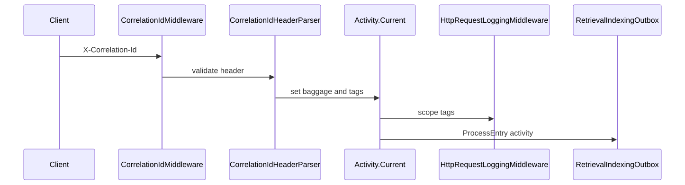

# 61. Correlation and tracing

Incoming `X-Correlation-Id` (validated) seeds request correlation; scope tags and Activity IDs flow into logs, audits, and outbox processors. Narrower than the observability map: end-to-end baggage from HTTP edge to worker activities.


