# 63. Health checks catalog

Liveness stays minimal; readiness and authenticated detailed surfaces register named checks (SQL, vector store, golden-manifest consistency, Content Safety, and more). Catalog which checks gate probes versus triage-only diagnostics.


