# 64. Hosting roles split

`Hosting:Role` selects Combined (default), Api (HTTP plus limited in-process work), or Worker (background loops, minimal health HTTP). Distinct from the hosted-services inventory (what loops exist) and azure-topology (where they run).


