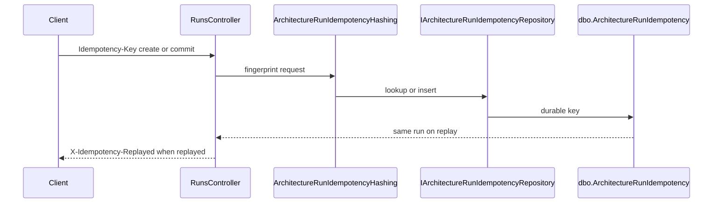

# 65. Mutating idempotency keys

Client `Idempotency-Key` is hashed and fingerprinted for create/commit (and required governance POSTs), with replay returning the same run/manifest without duplicate rows. The BFF forwards the header and surfaces `X-Idempotency-Replayed`.


