# 66. Soft-delete retention purge

Projects soft-delete via `IsDeleted`/`DeletedUtc`, then a hosted worker hard-deletes rows past retention days. SQL vs in-memory registrars swap real purge vs no-op so local hosts never hard-delete.


