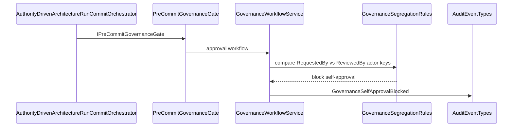

# 67. Manifest commit segregation of duties

Finalize runs through an optional pre-commit gate plus SoD that compares Entra-oid actor keys (not display names), blocking self-approval. This is submitter≠approver on approval requests—not a blanket “every pack blocks commit” rule.


