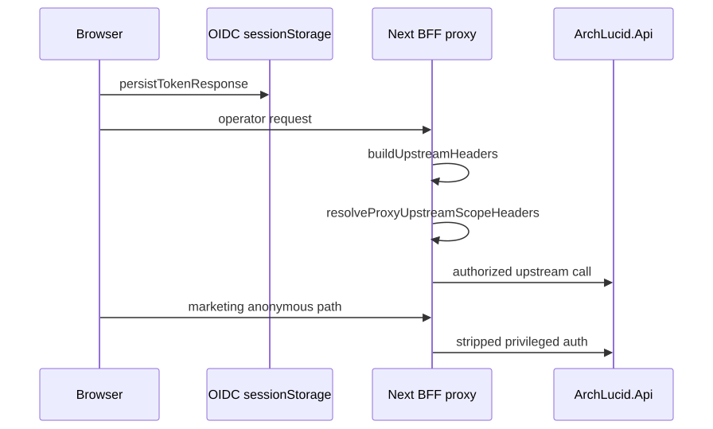

# 72. UI BFF proxy session

OIDC tokens are mirrored into an **HttpOnly BFF session cookie** (`archlucid-bff-session`) on sign-in while P1 dual-mode migration remains active; legacy browser builds may still attach `Authorization: Bearer` from `sessionStorage` until LK-06 removes the client token path.

The Next BFF proxy (`/api/proxy/*`) resolves upstream auth in this order:

1. Browser `Authorization` header (CLI-shaped Bearer migration path).
2. HttpOnly BFF session cookie (Working browser same-origin default).
3. Server `ARCHLUCID_PROXY_BEARER_TOKEN` or API key fallback.

Marketing paths strip privileged upstream auth so anonymous funnels never inherit operator credentials.

**Signing secret:** `ARCHLUCID_BFF_SESSION_SIGNING_SECRET` (local/dev) or Key Vault secret `bff-session-signing-key` (Terraform: `infra/terraform-keyvault/bff_session_signing_secret.tf`).

**Issue / clear routes:** `POST` and `DELETE` `/api/auth/bff-session`.

