# 73. Agent allowed-tools dispatch

Handler dispatch is gated by per-task allowlists; production-like hosts deny empty allowlists unless `UnrestrictedDispatch` is explicit. Invocations are persisted so run queries can audit which tools actually ran.


