# 74. Technology ledger lifecycle

Run-scoped technology ledger entries are seeded from request/evidence/topology, then patched through a command service and replayed with authority state. A first-class evidence/decision surface beyond findings taxonomy or golden-manifest anatomy.


