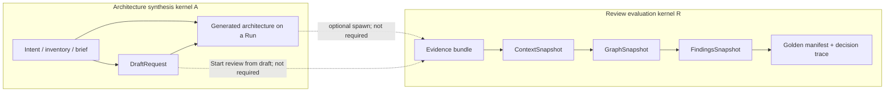

# 75. Architecture and review engines — formal specification

**Status:** Normative for platform documentation. Grounded in shipped types as of 2026-08-17.  
**Does not authorize:** new APIs, schema, or product copy.  
**Companion ADRs:** 0030 (authority unification), 0037 (catalog isolation), 0039/0045 (seal immutability), 0042 (canonical write surface), 0063 (cross-review finding identity), 0065 (model catalog), 0067 (co-equal entry points).

This chapter is the specification of the two product kernels the handbook previously described only by pipeline stage names. It is written as a typed system: objects, morphisms, state machines, algebraic properties, and boundary conditions. Where the code does not satisfy a property, that is stated as a **counterexample**, not as a wish.

---

## 0. Naming collisions (read first)

Four distinct constructions are called “engine” in this repository. They are **not** interchangeable.

| Name in code or copy | Actual type | Domain → codomain | Kernel? |
|----------------------|-------------|-------------------|---------|
| Product **Create architecture** | Intake + draft + optional LLM synthesis | Intent / evidence → mutable architecture representation | **Architecture synthesis kernel** \(\mathcal{A}\) |
| Product **Review** | Authority pipeline + finding engines + decisioning + seal | Evidence → findings + golden manifest | **Review evaluation kernel** \(\mathcal{R}\) |
| `IReviewEngine` | Empty alias of `IAgentExecutor` | `(runId, request, evidence, tasks)` → `AgentResult[]` | **No.** Agent-task batch executor. |
| `IFindingEngine` | Graph analyzer plugin | `GraphSnapshot` → `Finding[]` | Stage of \(\mathcal{R}\), not \(\mathcal{R}\) itself |
| `IDecisionEngine` | Authority decisioning | `(run, context, graph, findings)` → `(ManifestDocument, DecisionTrace)` | Stage of \(\mathcal{R}\) |
| `IDecisionEngineV2` | Agent-result merger | `(request, tasks, results, evaluations)` → `DecisionNode[]` | Stage of the **agent-task loop**, not \(\mathcal{R}\) |
| `IArchitectureRecommendationEngine` | Deterministic recommender | `(knowledge model, specialist findings, priorities)` → recommendations | Side path of \(\mathcal{A}\), not a generation LLM |
| LLM / model **catalog engine** (ADR 0065) | Completion provider row | Prompt → tokens | Advisory content only; forbidden to alter authority |

**Convention used below.** “Architecture engine” means \(\mathcal{A}\). “Review engine” means \(\mathcal{R}\). The C# identifier `IReviewEngine` is treated as a **misnomer** and is never used as a synonym for \(\mathcal{R}\).

---

## 1. Product signature

ArchLucid exposes two jobs of equal standing (ADR 0067) that produce **unequal** artifacts.

Let \(\mathsf{Intent}\) be the persisted workflow label:

- `ArchitectureWorkflowIntent.CreateArchitecture` = `"create-architecture"`
- `ArchitectureWorkflowIntent.StartReview` = `"start-review"`

The origin resolver is a total function on `ArchitectureRequest`:

\[
\mathsf{origin}: \mathsf{Request} \to \{\mathsf{Created},\mathsf{Reviewed}\}
\]

implemented by `ArchitecturePackageOriginResolver`: explicit create intent maps to `Created`; every other observed source (`start-review`, `wizard`, `recurrence`, `cli`, default) maps to `Reviewed`.

**Axiom A1 (co-equal entry).** Neither job is a required prefix of the other in navigation, CTA weight, or copy.  
**Axiom A2 (unequal artifacts).** A draft is mutable and unsealed. A golden manifest is sealed, hashed, and export-bearing. No morphism of \(\mathcal{A}\) may be presented as a governed record.

These axioms are **UI/governance** constraints. They are not theorems about the persistence model: both jobs, once they leave the draft table, hang off `dbo.Runs`.



The dashed arrows are **optional couplings**, not the definition of either kernel. That is the content of ADR 0067.

---

## 2. Type universe

### 2.1 Scope

A **paying-client boundary** is a tenant catalog \(\mathcal{C}(\tau)\), not a row filter (ADR 0037). Inside a catalog, organizational coordinates are a triple

\[
\sigma = (\mathsf{tenantId}, \mathsf{workspaceId}, \mathsf{projectId})
\]

Workspace and project are **not** isolation domains for a different paying client. Queries that omit \(\sigma\) on tenant tables are undefined behaviour.

### 2.2 Snapshots (immutable-once-written)

| Object | Symbol | Code | Meaning |
|--------|--------|------|---------|
| Evidence bundle | \(E\) | evidence bundle id on the run | Bytes and citations admitted to the run |
| Context snapshot | \(\kappa\) | `ContextSnapshot` | Normalized intake |
| Graph snapshot | \(\Gamma = (V, \mathcal{E}, W)\) | `GraphSnapshot` | Typed nodes \(V\), edges \(\mathcal{E}\), warnings \(W\) |
| Findings snapshot | \(F\) | `FindingsSnapshot` | Validated, gated, deduplicated findings plus engine failures |
| Decision trace | \(T\) | `DecisionTraceDto` | Why decisions were taken |
| Manifest | \(M\) | `ManifestDocument` / `dbo.GoldenManifests` | Sealed architecture package |
| Hash | \(h(M)\) | `ManifestHashService.ComputeHash` | SHA-256 of a canonical JSON projection |

Schema of \(\Gamma\) is versioned (`GraphSnapshot.SchemaVersion`, currently 1). Breaking changes require a new schema version plus a migration path — an explicit **backward-compatibility partial order**.

### 2.3 Mutable pre-authority objects

| Object | Code | Mutability |
|--------|------|------------|
| Draft | `dbo.DraftRequests` (`DraftId`) | Freely mutable; `SpawnedRunId` optional |
| Run header | `dbo.Runs` (`RunId`) | Mutable until commit-freeze of sealed fields |
| Agent tasks / results | `AgentTask` / `AgentResult` | Agent-task loop only |

There is **no** `Architecture` table and **no** `ArchitectureId`. “Architecture” as a customer noun is either draft content or a view over a run.

### 2.4 Run as the persistence spine

Define a run as a tuple

\[
R = (\mathsf{id}, \sigma, \mathsf{status}, \mathsf{origin}, \kappa^\ast, \Gamma^\ast, F^\ast, M^\ast, \ldots)
\]

where starred fields are optional pointers. Both kernels write through \(R\). This is an engineering convenience, not a proof that generation and review are the same functor.

---

## 3. Review evaluation kernel \(\mathcal{R}\)

### 3.1 Definition

\(\mathcal{R}\) is the **authority pipeline**. After `POST /v1/architecture/request` persists \(R\), `AuthorityPipelineStagesExecutor.ExecuteAfterRunPersistedAsync` applies a fixed sequence of stages. Queued (`AsyncAuthorityPipeline`) and inline paths share this executor.

**Stage object** (order is part of the definition):

\[
\mathsf{Seq} = (\iota,\; \gamma,\; \Phi,\; \Delta,\; \alpha)
\]

| Step | Span / internal name | Map | Implementation |
|------|----------------------|-----|----------------|
| 1 | `authority.context_ingestion` / `context_ingestion` | \(\iota: \mathsf{Request} \to \kappa\) | `IContextIngestionService.IngestAsync` |
| 2 | `authority.graph` / `graph` | \(\gamma: \kappa \to \Gamma\) | `IKnowledgeGraphService.BuildSnapshotAsync`, with committed reuse |
| 3 | `authority.findings` / `findings` | \(\Phi: \Gamma \to F\) | `IFindingsOrchestrator.GenerateFindingsSnapshotAsync` |
| 4 | `authority.decisioning` / `decisioning` | \(\Delta: (\kappa,\Gamma,F) \to (M,T)\) | `IDecisionEngine.DecideAsync` |
| 5 | `authority.artifacts` / `artifacts` | \(\alpha: (M,T) \to \mathsf{Bundle}\) | `IArtifactSynthesisService` |

Each stage is wrapped in an OpenTelemetry span tagged `archlucid.stage.name` and a `dbo.RunStageOutcomes` row.

**Invariant R1 (shared executor).** Queued and inline execution are the same morphism with different scheduling. They must not diverge in stage set or order.

### 3.2 Graph reuse (conditional identity)

Before \(\gamma\) rebuilds, the executor asks whether a committed \(\Gamma\) already exists for the current \(\kappa\):

\[
\gamma_{\mathsf{reuse}}(\sigma, R, \kappa) =
\begin{cases}
\Gamma_{\mathsf{committed}} & \text{if a committed snapshot is valid for this context} \\
\gamma_{\mathsf{build}}(\kappa) & \text{otherwise}
\end{cases}
\]

This is an **optimization that is required to be observationally equal** to a rebuild: reuse is legal only when the graph is a function of the admitted context, not of wall-clock. If that observational equality fails, replay and comparison are undefined.

### 3.3 Finding engines as a family of maps

Let \(\mathbb{E}\) be the registered set of `IFindingEngine` instances. Each engine is

\[
\Phi_i: \mathbf{GraphSnapshot} \times \mathsf{Cancel} \to \mathbf{Finding}^\ast
\]

with labels \((\mathsf{EngineType}_i, \mathsf{Category}_i)\).

**Signature gap (normative observation).** The interface does **not** take policy packs, evidence bytes, prior runs, or \(\sigma\). Any such information must already be encoded in \(\Gamma\) (nodes, edges, warnings) or the engine is blind to it. Cross-run engines (`requirement-cross-run-diff`, `topology-cross-run-diff`) recover “prior” only from metadata already present on the current graph. That is a **deliberate domain restriction**, and it is incomplete relative to ADR 0063’s comparison story (see §12).

#### 3.3.1 Orchestration \(\Phi = \mu \circ \bigparallel_i \Phi_i\)

`FindingsOrchestrator.GenerateFindingsSnapshotAsync`:

1. Invokes all \(\Phi_i\) **in parallel**.
2. On engine exception: records `FindingEngineFailure`, continues.
3. If **every** engine throws: throws `AggregateException`. (Fail-closed on total failure.)
4. If **some** engines succeed: returns a snapshot plus failure rows. (Fail-open on partial failure.)
5. Rejects findings whose payload fails `IFindingPayloadValidator`.
6. Throws if `finding.Category ≠ engine.Category` (after filling empty category from the engine).
7. Deduplicates by the string key \(\mathsf{FindingType} \mid \mathsf{Title}\) (case-insensitive), **keeping the first**.
8. Applies the insight-density gate and human-review options.

**Merge operator \(\mu\).** First-wins on \((\mathsf{FindingType}, \mathsf{Title})\) after an unordered parallel join.

**Proposition (not a theorem in code).** \(\mu\) is **not commutative** and **not confluent**. If \(\Phi_a\) and \(\Phi_b\) emit the same type/title with different payloads, the survivor depends on task completion order. Parallelism plus `GroupBy(...).First()` is a race on the equivalence class, not a join in a lattice.

**Corollary.** Finding identity for orchestration is **not** `FindingId` and **not** the ADR 0063 fingerprint \(\{\mathsf{policyRuleId}:\mathsf{fingerprint}\}\). Three different equality relations are in play; they do not coincide.

#### 3.3.2 Registered engines vs plugin deny-list

**Plugin skip set** `FindingEnginePluginDiscovery.BuiltInEngineTypeIds` (plugins with these ids are ignored):

`requirement`, `topology-coverage`, `topology-structure`, `topology-cross-run-diff`, `topology-anti-pattern`, `security-baseline`, `security-coverage`, `policy-applicability`, `policy-coverage`, `requirement-coverage`, `requirement-cross-run-diff`, `compliance`, `cost-constraint`.

**Actually registered** in `ServiceCollectionExtensions.Decisioning` (non-exhaustive vs the skip set):

| EngineType | Category (typical) | Assembly |
|------------|--------------------|----------|
| `requirement`, `requirement-expectation`, `requirement-gap`, `requirement-cross-run-diff`, `requirement-coverage` | Requirement | Decisioning |
| `topology-coverage`, `topology-structure`, `topology-cross-run-diff`, `topology-anti-pattern` | Topology | Decisioning |
| `security-baseline`, `security-baseline-expectation`, `security-baseline-completeness`, `security-gap`, `security-coverage` | Security | Decisioning |
| `policy-applicability`, `policy-coverage` | Policy | Decisioning |
| `compliance` | Compliance | Decisioning |
| `cost-constraint`, `cost-breach` | Cost | Capabilities.Cost |
| `orphaned-azure-resource`, `orphaned-aws-resource`, `orphaned-gcp-resource` | Inventory | Application |
| `azure-inventory-reconciliation`, `aws-inventory-reconciliation`, `gcp-inventory-reconciliation` | Inventory | Application |
| `azure-inventory-security-baseline`, `aws-inventory-security-baseline`, `gcp-inventory-security-baseline` | Security | Application |
| `advisor-cost-recommendation` | Cost | Application |

`TechnologyConsistencyFindingEngine` implements **`ITechnologyConsistencyFindingEngine`**, not `IFindingEngine`. It is not a member of \(\mathbb{E}\).

**Boundary failure B-plugin.** The skip set is a **proper subset** of registered `EngineType` values. A third-party DLL can register `security-gap` or `cost-breach` and be loaded alongside the product engine. Distinctness is not enforced for the full \(\mathbb{E}\).

### 3.4 Decisioning

Authority decisioning:

\[
\Delta: (\mathsf{runId}, \kappa, \Gamma, F) \to (M, T)
\]

`IDecisionEngine.DecideAsync`. This is the only \(\Delta\) on the authority path.

A **second** decisioning morphism exists for the agent-task loop:

\[
\Delta_2: (\mathsf{request}, \mathsf{tasks}, \mathsf{results}, \mathsf{evaluations}) \to \mathsf{DecisionNode}^\ast
\]

`IDecisionEngineV2.ResolveAsync`. Domain is agent results, not \((\Gamma, F)\). These maps are **not** interchangeable and **do not commute** with \(\Phi\).

### 3.5 Seal, hash, commit

Let \(h\) be SHA-256 over the canonical projection defined by `ManifestHashService` (schema `HasherSchemaVersion = "v1"`). The projection includes structural sections and effective governance at commit. It **excludes** `CreatedUtc` and, by ADR 0065 D5′, **engine identity**.

**Invariant R2 (commitment).** After commit, \(h(M)\) is frozen. Recomputing \(h\) on the stored canonical image must match.  
**Invariant R3 (producer excluded).** Changing the LLM catalog engine without changing structural sections does not change \(h(M)\). Authority is independent of inference (ADR 0065 D10).  
**Invariant R4 (SoD).** Manifest commit requires the separation-of-duties rules in chapter 67; a single actor must not both author and commit where SoD is enabled.

Commit-allowed statuses for the **agent-task** machine are not the authority machine. `RunStateTransitionService.ValidateCommitAllowed` permits commit only from `ReadyForCommit`. `Failed`, `FailedPartial`, `PartiallyCompleted`, `ExecutionCompletedQualityRejected`, `TasksGenerated` are denied. Authority finalization has its own lock in `ManifestFinalizationService` / `AuthorityDrivenArchitectureRunCommitOrchestrator`.

**Invariant R5 (one-way seal).** `Committed` is terminal for the golden-manifest image of that version. Later versions are new rows, not edits in place (ADR 0039 / 0045).

---

## 4. Architecture synthesis kernel \(\mathcal{A}\)

### 4.1 Definition

There is **no** `IArchitectureEngine` type. \(\mathcal{A}\) is the coproduct of three constructions that share a customer job (“produce an architecture”) and **do not** share a single morphism.

\[
\mathcal{A} = \mathcal{A}_{\mathsf{draft}} \;\sqcup\; \mathcal{A}_{\mathsf{generate}} \;\sqcup\; \mathcal{A}_{\mathsf{recommend}}
\]

| Summand | Entry | Output | Deterministic? |
|---------|-------|--------|----------------|
| \(\mathcal{A}_{\mathsf{draft}}\) | `IArchitectureRequestDraftService.DraftAsync`; UI `/architecture/architectures` | `DraftRequests` row | Yes (persistence) |
| \(\mathcal{A}_{\mathsf{generate}}\) | Create-architecture intent on `POST /v1/architecture/request`; agent execute tagged `AiUsageFeature.ArchitectureGeneration` | Run with origin `Created`; topology/cost/compliance/critic `AgentResult`s | No, unless simulator |
| \(\mathcal{A}_{\mathsf{recommend}}\) | `IArchitectureRecommendationEngine.BuildRecommendations` | `ArchitectureRecommendation[]` | **Intended** yes; **fails** because `RecommendationId = Guid.NewGuid()` |

### 4.2 Drafts

A draft \(D\) is a mutable architecture description that **does not** start a review. Spawning a run is a separate operation (`SpawnedRunId`). There is no version lattice on drafts beyond “current row.” There is no independent permission algebra: drafts inherit \(\sigma\) of the actor, not an `Architecture` ACL.

**Invariant A3.** Saving \(D\) must not create \(M\).  
**Invariant A4.** Copy must not call \(D\) a sealed or governed artifact (ADR 0067 point 5).

### 4.3 Generation via the agent-task loop

When origin is `Created`, synthesis currently **reuses** the four-agent loop rather than \(\mathsf{Seq}\):

\[
\{\mathsf{Topology}, \mathsf{Cost}, \mathsf{Compliance}, \mathsf{Critic}\}
\]

`IAgentExecutor.ExecuteAsync` (production handlers or `DeterministicReviewEngine` → `DeterministicAgentSimulator`). LLM spend is attributed to `AiUsageFeature.ArchitectureGeneration`.

This is the deepest structural entanglement: **creating an architecture is implemented as a review-shaped agent batch.** \(\mathcal{A}_{\mathsf{generate}}\) and the legacy coordinator are the same code path with a different origin label.

### 4.4 Recommendation engine

`ArchitectureRecommendationEngine` is a pure-looking map from specialist findings with conclusion `Fail` or `Indeterminate` into recommendations, then applies trade-off annotations.

**Counterexample to functionality.** `RecommendationId = Guid.NewGuid().ToString("N")` makes two invocations on identical inputs unequal. \(\mathcal{A}_{\mathsf{recommend}}\) is a **random-id process**, not a function. Replay and golden-cohort comparison cannot treat recommendation identity as stable.

---

## 5. Agent-task loop (live, non-canonical for new surfaces)

ADR 0030 / TB-1007: **canonical finish path for new surfaces is \(\mathcal{R}\)**. The agent-task loop remains for task-driven agents, external result push, trial/QuickStart, and selective re-execute.

### 5.1 Status labelled transition system

States \(S = \) `ArchitectureRunStatus` (integer tags 1–10):

`Created` → `TasksGenerated` → `WaitingForResults` → `ReadyForCommit` → `Committed`

Side states: `Failed`, `Retrying`, `ExecutionCompletedQualityRejected`, `PartiallyCompleted`, `FailedPartial`.

Required agents for commit:

\[
A_{\mathsf{req}} = \{\mathsf{Topology}, \mathsf{Cost}, \mathsf{Compliance}, \mathsf{Critic}\}
\]

`HasCommitReadyAgentResults` is a predicate on `AgentResult[]`. Commit is the partial function

\[
\mathsf{commit}: \{ R \mid \mathsf{status}(R)=\mathsf{ReadyForCommit} \land \mathsf{ready}(A_{\mathsf{req}}) \} \rightharpoonup R_{\mathsf{Committed}}
\]

**Mismatch.** \(\mathcal{R}\) does not use this four-agent gate as its definition of completeness; it uses stage outcomes and a findings snapshot. The **same enum** \(S\) is overloaded onto both kernels. Authority-complete runs must not be driven with `execute`/`result` (chapter 4). That rule is an operational exclusion, not a type distinction: nothing in the type system prevents calling `IArchitectureRunExecuteOrchestrator` on an authority-finalized run except runtime checks.

### 5.2 `IReviewEngine`

```csharp
public interface IReviewEngine : IAgentExecutor;
```

This is a **documentation alias**. `DeterministicReviewEngine` is a test/simulator adapter. It is not \(\mathcal{R}\). Treating it as the review kernel is a category error that has already appeared in planning docs.

---

## 6. LLM catalog (not a kernel)

ADR 0065: completions are catalog-selected; embeddings remain Azure OpenAI. Fail-closed controls are **capability** (structured-output ladder) and **data boundary**, not measured quality.

**Invariant L1.** Engine selection must not alter authorization, tenant isolation, evidence identifiers, citation linkage, finalization, audit, policy-gate calculation, scoring, retention, export completeness, or billing enforcement.  
**Invariant L2.** No silent cross-engine failover.  
**Invariant L3.** Workspace admin bounds the allowed set; the user chooses inside it.

These invariants place the catalog **outside** \(\mathcal{R}\)’s authority image. They belong in chapter 45, which previously stated the contradictory claim that non-Azure providers are scaffold-only.

---

## 7. Algebraic properties (what holds, what does not)

### 7.1 Idempotent create

HTTP create with an idempotency key is serialized (`sp_getapplock` or in-process semaphore) and uniqueness-constrained on `dbo.ArchitectureRunIdempotency`.

**Intended:** \(\mathsf{create}_k \circ \mathsf{create}_k = \mathsf{create}_k\).  
**Caveat:** uniqueness is on the key, not on request body equality. The same key with a different body is a conflict, not a merge.

### 7.2 Graph build as a function of context

If \(\gamma_{\mathsf{build}}\) is deterministic in simulator mode, then \(\gamma_{\mathsf{reuse}} = \gamma_{\mathsf{build}}\) on the committed subset. Live LLM-influenced graph construction is **not** claimed to be a function; the product instead seals \(\Gamma\) and hashes \(M\).

### 7.3 Findings snapshot

Let \(\bigparallel \Phi_i\) be the parallel family. The implemented \(\mu\) is:

- associative on disjoint type/title keys;
- **not** associative/commutative when keys collide;
- fail-closed on the empty success set;
- fail-open on a nonempty success set.

There is **no soundness theorem** of the form “if policy pack \(P\) requires control \(c\) and \(\Gamma\) lacks \(c\), then \(F\) contains a finding.” Coverage is empirical per engine, not a derivation in a policy calculus.

### 7.4 Manifest hash as a commitment scheme

\(h\) is a **content commitment** for the canonical projection, not a cryptographic binding of:

- which finding engines ran;
- which LLM catalog row produced advisory text;
- wall-clock;
- actor identity (that lives in audit, not in \(h\)).

Collision resistance of SHA-256 is assumed; **canonicalization completeness** is the real risk: any field omitted from the anonymous projection can change without moving \(h\). Engine identity is omitted **intentionally**. Finding mute flags, human-review notes, and some envelope fields on `Finding` are not obviously in \(M\)’s hashed sections — do not treat \(h\) as a hash of the findings snapshot.

### 7.5 Isolation

\[
\text{data}(\tau) \cap \text{data}(\tau') = \emptyset \quad (\tau \neq \tau')
\]

is implemented by **separate catalogs**, not by \(\sigma\) predicates inside one database. `SingleCatalog` is fail-fast on production-like hosts. RLS is not the paying-client boundary (ADR 0037). Defense in depth still requires \(\sigma\) on queries inside a catalog so that workspace/project mix-ups cannot leak across organizational units **of the same tenant**.

### 7.6 Replay

End-to-end replay compares sealed images. ADR 0065 requires engine-identity diff as the leading interpretation of advisory drift. Because \(h\) excludes engine identity, **hash equality does not imply engine equality**. Replay must consult `Runs.EngineProvenanceJson` / `AgentExecutionTrace`, not only \(h(M)\).

---

## 8. Shared infrastructure vs kernel membership

| Mechanism | In \(\mathcal{A}\)? | In \(\mathcal{R}\)? | Notes |
|-----------|---------------------|---------------------|-------|
| `POST /v1/architecture/request` | Yes (create intent) | Yes (review intent) | Same write surface (ADR 0042) |
| `dbo.Runs` | Yes once spawned | Yes | Spine, not identity of the job |
| Context ingestion / graph | Optional | Required in \(\mathsf{Seq}\) | |
| `IFindingEngine` family | No | Yes | |
| Four-agent execute | Yes (\(\mathcal{A}_{\mathsf{generate}}\)) | Legacy only | |
| Policy packs / focused pilot mode | Indirect (scope of later review) | Yes | Pilot mode may narrow \(\mathbb{E}\)’s effective rules |
| Golden manifest | No (forbidden by A2) | Yes | |
| Draft table | Yes | No | |
| Model catalog | Advisory in generate | Advisory in specialist/critic | Never authority |

---

## 9. HTTP and UI edges (non-exhaustive)

| Job | UI | HTTP |
|-----|----|------|
| Create architecture | `/architecture/architectures`, `/architecture/architectures/new` | Draft APIs + `POST /v1/architecture/request` with `WorkflowIntent=create-architecture` |
| Review | `/architecture/reviews`, `/architecture/reviews/new` | `POST /v1/architecture/request` with `WorkflowIntent=start-review` |
| Inspect authority stages | Run detail pipeline section | `GET /v1/architecture/run/{runId}/stage-timeline` |
| Inspect review | `GET /v1/architecture/review/{runId}` | Must be read before `execute`/`result`/`finalize` on mixed-path runs |

---

## 10. Configuration that changes kernel behaviour

| Knob | Effect on \(\mathcal{R}\) or \(\mathcal{A}\) |
|------|-----------------------------------------------|
| `FeatureManagement:FeatureFlags:AsyncAuthorityPipeline` | Schedule \(\mathsf{Seq}\) on Worker vs inline. Default enabled on SQL; InMemory never queues. |
| `ArchLucid:AuthorityPipeline:OrchestratorBackend` | `DurableTask` vs SQL outbox seam (DTF not required for V1). |
| `ArchLucid:FindingEngines:PluginDirectory` | Extra \(\Phi_i\) from non-`ArchLucid.*` DLLs. |
| Focused pilot mode | Restricts effective policy evaluation to Security + Cost pack names; does not delete the other 39 seeded packs. |
| Simulator vs Real execution | INV-002 aggregation: Real / Simulator / Fallback / Mixed. Absence of mode is invalid. |
| Hosting role Api / Worker / Combined | Who runs \(\mathsf{Seq}\) drain loops (chapter 64). |

---

## 11. Boundary conditions — satisfied vs not

| ID | Condition | Status |
|----|-----------|--------|
| B1 | Paying-client isolation = catalog, not RLS | **Satisfied** in production-like hosts (ADR 0037) |
| B2 | Draft is not a sealed record | **Satisfied** in data model; copy must keep A4 |
| B3 | Authority-complete ⇒ do not `execute`/`result` | **Satisfied** as operational contract; **not** a type boundary |
| B4 | \(\mathsf{Seq}\) order fixed and shared queued/inline | **Satisfied** in `PipelineStageSequence` |
| B5 | Total finding-engine failure fails the snapshot | **Satisfied** (`AggregateException`) |
| B6 | Partial finding-engine failure still yields \(F\) | **Satisfied** (and is a product choice, not an accident) |
| B7 | Finding equality used by \(\mu\) = ADR 0063 identity | **Not satisfied** (three equalities) |
| B8 | Plugin ids cannot collide with any registered engine | **Not satisfied** (skip set ⊂ \(\mathbb{E}\)) |
| B9 | \(h(M)\) binds producer (LLM engine) | **Not satisfied by design** (D5′) |
| B10 | \(\mathcal{A}_{\mathsf{recommend}}\) is a function | **Not satisfied** (`Guid.NewGuid`) |
| B11 | `IReviewEngine` denotes \(\mathcal{R}\) | **Not satisfied** (alias of executor) |
| B12 | Single decision morphism | **Not satisfied** (\(\Delta\) and \(\Delta_2\)) |
| B13 | `IFindingEngine` sees policy packs | **Not satisfied** (graph-only domain) |
| B14 | Co-equal UI entry | **Satisfied** by ADR 0067; older handbook/operator docs still funnel |
| B15 | Status LTS describes \(\mathcal{R}\) | **Not satisfied** (enum is agent-task-shaped) |
| B16 | Generation kernel has a single interface | **Not satisfied** (coproduct, no `IArchitectureEngine`) |

---

## 12. Open problems (incompleteness)

These are gaps in the **specification of the shipped system**, not a backlog shopping list.

1. **No policy calculus.** Packs are JSON documents with a string `pack.category`. There is no entailment relation \(P \vdash c\), so \(\Phi\) cannot be proven complete or sound relative to \(P\).
2. **No architecture object.** Reuse of “the same architecture” across reviews is a social convention over drafts and runs, not a first-class identity with a version poset.
3. **Domain of \(\Phi_i\) is too small** for inventory, freshness, and cross-run identity. Application-layer engines compensate by reading repositories **other than** `GraphSnapshot` while still implementing `IFindingEngine` — a signature lie: the interface says graph-only; several implementations close over SQL options and extractors.
4. **Two completeness predicates.** Authority: stages + snapshot. Agent-task: four successful agent types. A run can be complete in one sense and incomplete in the other.
5. **Focused pilot mode vs seeded catalog.** Thirty-nine packs exist but two names dominate first-run evaluation. Historical reviews do not, by themselves, record a proof of “which theory was in force” except via `EffectiveGovernanceAtCommit` on \(M\) when commit happened. Draft-time scope is weaker.
6. **Specialist intelligence path.** `SpecialistReviewFinding` / `ArchitectureKnowledgeModel` is a parallel vocabulary to `Finding` / `GraphSnapshot`. The recommendation engine consumes the former; \(\mathcal{R}\) consumes the latter. No adjoint or embedding is defined.
7. **Hash projection vs finding envelope.** Human-review, mute, treatment, insight-density, and model alias live on `Finding`. Whether each is in \(h(M)\) is not specified here; assume **not**, unless a field is in the canonical anonymous object.

---

## 13. Code index

| Concern | Path |
|---------|------|
| Authority stages | `ArchLucid.Application/Runs/Orchestration/Pipeline/AuthorityPipelineStagesExecutor.cs` |
| Create run | `ArchLucid.Application/Runs/Orchestration/ArchitectureRunCreateOrchestrator.cs` |
| Origin | `ArchLucid.Application/Runs/ArchitecturePackageOriginResolver.cs` |
| Findings fold | `ArchLucid.Decisioning/Services/FindingsOrchestrator.cs` |
| Finding contract | `ArchLucid.Decisioning/Interfaces/IFindingEngine.cs` |
| Plugin skip set | `ArchLucid.Decisioning/Plugins/FindingEnginePluginDiscovery.cs` |
| DI registration | `ArchLucid.Host.Composition/Startup/ServiceCollectionExtensions.Decisioning.cs` |
| Authority \(\Delta\) | `ArchLucid.Core/Persistence/Ports/IDecisionEngine.cs` |
| Agent \(\Delta_2\) | `ArchLucid.Decisioning/Merge/IDecisionEngineV2.cs` |
| Executor alias | `ArchLucid.Contracts/Abstractions/Agents/IReviewEngine.cs` |
| Simulator | `ArchLucid.AgentSimulator/Services/DeterministicReviewEngine.cs` |
| Recommendations | `ArchLucid.Application/ArchitectureIntelligence/ArchitectureRecommendationEngine.cs` |
| Hash | `ArchLucid.Decisioning/Services/ManifestHashService.cs` |
| Status LTS | `ArchLucid.Contracts/Common/ArchitectureRunStatus.cs`, `RunStateTransitionService.cs` |
| Finding output notes | `docs/library/FINDING_ENGINE_OUTPUT_REFERENCE.md` |

---

## 14. Critique — flaws, unsatisfied boundaries, simplifications

This section is the review of the **system as specified above**, not of this chapter’s wording.

### 14.1 Flaws (structural, not cosmetic)

**F1. Four “engines,” one word.** The type system does not distinguish \(\mathcal{A}\), \(\mathcal{R}\), `IReviewEngine`, `IFindingEngine`, and catalog rows. Humans already mis-plan against `IReviewEngine` (it is an executor). This is a specification bug with implementation consequences.

**F2. Generation is a review loop in costume.** \(\mathcal{A}_{\mathsf{generate}}\) is the four-agent coordinator with `PackageOrigin=Created`. Co-equal *jobs* were declared (ADR 0067) without co-equal *kernels*. The cheaper interpretation — one pipeline, two labels — is what the code implements. The handbook must not pretend otherwise.

**F3. Overloaded status machine.** `ArchitectureRunStatus` is a labelled transition system for agent tasks. Authority stages have a parallel timeline (`RunStageOutcomes`). Completeness is therefore a pair of predicates on one object. That is how mixed-path incidents happen.

**F4. Non-confluent finding merge.** Parallel engines + first-wins on a coarse key is not a well-defined join. Two engines can “win” on different replicas or different clocks. ADR 0063’s correlation key is not this key.

**F5. Dual decision engines with disjoint domains.** \(\Delta\) sees the graph. \(\Delta_2\) sees agent results. Nothing states the relationship. Merge of \(\Delta_2\) nodes into \(M\) is a third implicit map.

**F6. `IFindingEngine` is an incomplete signature.** Several Application engines need inventory freshness and SQL. Pretending the domain is only \(\Gamma\) hides effects and makes plugin authors copy the lie.

### 14.2 Incompleteness

See §12. The missing pieces that actually hurt operators:

- no first-class Architecture identity (so “review this architecture again” is a heuristic);
- no proof that enabled packs were evaluated (except commit-time effective-governance blob);
- recommendation ids are random, so \(\mathcal{A}_{\mathsf{recommend}}\) cannot be golden-tested as a function;
- plugin deny-list lag;
- specialist findings vs authority findings remain two theories of the same English word “finding.”

### 14.3 Boundary conditions not satisfied

B7, B8, B10, B11, B12, B13, B15, B16 in §11. The important operational ones: **plugin collision**, **status/type confusion**, **hash not binding producer** (intentional, but then provenance UI must carry the load), **draft/run noun collision** for buyers.

### 14.4 Ways to make it simpler (ordered by leverage)

1. **Delete the `IReviewEngine` alias.** Use `IAgentExecutor` only. One word reclaimed.
2. **Name the kernels in code:** `IReviewEvaluationKernel` = authority `Seq`; `IArchitectureSynthesisKernel` = draft + generate. Stop registering generation as “review execute.”
3. **Split the status LTS** or stop writing authority runs into agent-task statuses. Two small machines beat one overloaded enum.
4. **Retire the agent-task finish path** for product surfaces (already the ADR 0030 intent). Keep simulator execute as a test double of *synthesis*, not of \(\mathcal{R}\).
5. **Make \(\mu\) a lattice join keyed by ADR 0063 fingerprints**, with explicit conflict records instead of `First()`. Deterministic even under parallelism.
6. **Generate `BuiltInEngineTypeIds` from DI registration** so the plugin skip set cannot lag \(\mathbb{E}\).
7. **Widen `IFindingEngine` or split it:** graph-pure engines vs effectful inventory engines. Do not keep a dishonest arity.
8. **One decision morphism** whose domain is \((\Gamma, F)\) plus an optional agent-result appendix. Kill \(\Delta_2\) as a peer.
9. **`RecommendationId = H(findingId, proposedChange)`** so \(\mathcal{A}_{\mathsf{recommend}}\) becomes a function.
10. **One customer noun for `Run`.** Origin is a field, not a second object. Keep “draft” for `DraftRequests` only.

Items 1, 6, and 9 are local and do not change the product. Items 2–5, 7–8, 10 are the actual simplification of the architecture. They trade the current “everything is a Run with optional stages” convenience for two kernels that match ADR 0067.

### 14.5 What not to complicate

Do **not** introduce a third kernel for “policy engine,” “quality engine,” or `IReviewEngine` as an LLM gateway. Policy packs are data for \(\Phi\) and \(\Delta\). Quality dimensions are pack metadata, not a new morphism (see `architecture_quality_policy_engine_assessment.md`). The LLM catalog is a parameterized effect inside synthesis and critic text, already isolated by L1.

Do **not** put engine identity into \(h(M)\) without a hasher baseline re-lock. Provenance already has a table. Mixing producer into the content hash collapses “same architecture” with “same model,” which is the opposite of D5′.

---

## 15. Security, scale, reliability, cost

| Concern | How the kernels address it | If not applicable |
|---------|----------------------------|-------------------|
| **Security** | Catalog isolation; \(\sigma\) on rows; content-safety precheck on create; SoD on commit; catalog data-boundary gate (D11) | — |
| **Scalability** | Parallel \(\Phi_i\); graph reuse; async outbox for \(\mathsf{Seq}\); bounded batch parallelism on drains | Finding-engine fan-out is in-process `Task.WhenAll`, not a distributed join |
| **Reliability** | Stage outcomes; partial vs total engine failure distinction; commit lock; simulator path | Dual kernels share one status enum — reliability hazard (F3) |
| **Cost** | `AiUsageFeature.ArchitectureGeneration` vs review metering; focused pilot narrowing; catalog rates | Hash/replay CPU is negligible vs completions |

---

## 16. Decomposition (interfaces, services, data, orchestration)

| Layer | \(\mathcal{A}\) | \(\mathcal{R}\) |
|-------|-----------------|-----------------|
| **Interfaces** | `IArchitectureRequestDraftService`, `IArchitectureRecommendationEngine`, `IAgentExecutor` | `IContextIngestionService`, `IKnowledgeGraphService`, `IFindingsOrchestrator`, `IFindingEngine`, `IDecisionEngine`, `IArtifactSynthesisService`, `IAuthorityPipelineStagesExecutor` |
| **Services** | Draft service, recommendation engine, execute orchestrator, model catalog | Stage executor, findings orchestrator, decision engine, hash service, finalization |
| **Data** | `DraftRequests`, `Runs` (origin Created), agent traces | `Runs`, context/graph/findings snapshots, golden manifests, decision traces, stage outcomes |
| **Orchestration** | Create orchestrator + optional execute loop | `AuthorityPipelineStagesExecutor` ± Worker outbox |

This is the intended modular split. The flaw is that generation orchestration is still the review execute loop (F2).
