---

title: "ArchLucid platform architecture handbook"

subtitle: "Version 2026.08.06i — generated from docs/architecture/architecture_handbook"

---

# ArchLucid platform architecture handbook

**Version:** `2026.08.06b` (see `VERSION`)  
**Canonical poster:** `docs/ARCHITECTURE_ON_ONE_PAGE.md`  
**Diagram index:** `docs/architecture/architecture_diagrams/`

## Purpose

Provide a single, regenerable document that:

1. Explains the ArchLucid **product platform** end-to-end (system context → containers → pipelines → trust → ops).
2. Embeds the approved zoom-in diagrams next to the prose they illustrate.
3. Points to ADRs and library docs for depth without duplicating every runbook.

## Assumptions

- Azure-first hosting (Container Apps, SQL, private networking) unless a pilot diverges.
- Incomplete requirements and imperfect rollout are normal; backlogs stay observable (outboxes, health, metrics).

## Constraints

- No public SMB; storage and queues use private endpoints and managed identity where possible.
- Single DDL source per database.
- Configuration bridge: `ArchLucid*` keys remain authoritative with legacy overrides until sunset.

## What this handbook is not

It is **not** a customer architecture review package. ArchLucid produces those from evidence through the authority pipeline. This handbook is **platform documentation** maintained in-repo and exported to Word for offline review.

# 1. System context

ArchLucid turns architecture requests and evidence into versioned packages (golden manifests), decision traces, governance evidence, and exportable artifacts.

## Actors

| Actor | How they touch the system |
|-------|---------------------------|
| Operators / architects | Browser → Architect workspace (Next.js) |
| Sponsors / evaluators | Same UI; sponsor-oriented views and packages |
| CLI / CI automation | HTTPS → API (API key or JWT), optionally via Front Door / APIM |

## Diagram — system overview

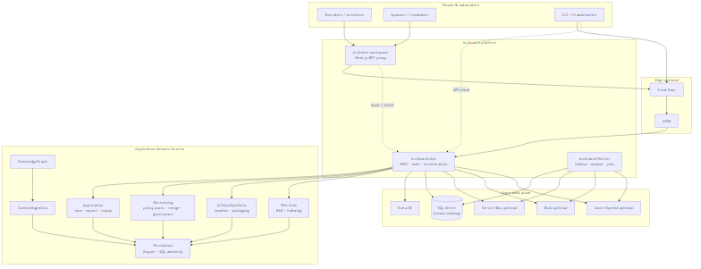

## Diagram — review happy path

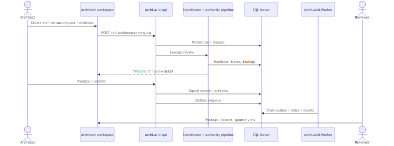

## Trust edges (summary)

- UI proxies to `ArchLucid.Api` with scope and correlation headers.
- API authenticates via Entra ID / JWT or API keys (environment-dependent).
- Authoritative persistence is SQL Server (database-per-tenant catalogs).
- Azure OpenAI, Service Bus, and Blob are optional for live models, integration fan-out, and large artifacts.

# 2. Containers and domain libraries

## Deployable containers

| Container | Responsibility |
|-----------|----------------|
| **archlucid-ui** | Operator / marketing shell; BFF proxy to API |
| **ArchLucid.Api** | Versioned REST, authZ, orchestration entry |
| **ArchLucid.Worker** | Outbox drain, queues, long-running jobs |
| **ArchLucid.Cli** | Scripted run lifecycle and graph export |

## Major libraries

| Library | Responsibility |
|---------|----------------|
| **ArchLucid.Application** | Runs, export, replay, analysis orchestration |
| **ArchLucid.Decisioning** | Policy packs, merge, governance, schema validation |
| **ArchLucid.Persistence** | Dapper SQL authority + workflow data access |
| **ArchLucid.ContextIngestion** | Evidence / context pipeline |
| **ArchLucid.KnowledgeGraph** | Graph snapshots from context |
| **ArchLucid.ArtifactSynthesis** | Artifact generators and packaging |
| **ArchLucid.Retrieval** | Embedding / indexing / Ask RAG path |
| **ArchLucid.Host.Composition** | DI graphs shared by Api and Worker |

Deep dive: `docs/library/ARCHITECTURE_CONTAINERS.md`, `docs/library/ARCHITECTURE_COMPONENTS.md`.

# 3. Authority pipeline

Canonical path after `POST /v1/architecture/request`: persist the run, run or queue **AuthorityPipelineStagesExecutor**, then transactional finalize into a golden manifest, decision trace, and outboxes.

## Diagram

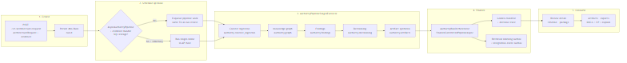

## Stages (OpenTelemetry)

| Stage | Span name |
|-------|-----------|
| Context ingestion | `authority.context_ingestion` |
| Knowledge graph | `authority.graph` |
| Findings | `authority.findings` |
| Decisioning | `authority.decisioning` |
| Artifact synthesis | `authority.artifacts` |

Spans carry tag `archlucid.stage.name` for support correlation.

## Detail

See `docs/library/ARCHITECTURE_FLOWS.md` (Flow A0), `docs/library/CANONICAL_PIPELINE.md`, `docs/architecture/architecture_diagrams/archlucid-authority-pipeline.md`.

# 4. Authority vs legacy coordinator

Two mental models can produce a golden manifest. Always inspect `GET /v1/architecture/review/{runId}` before calling `execute` / `result` / `finalize`.

## Diagram

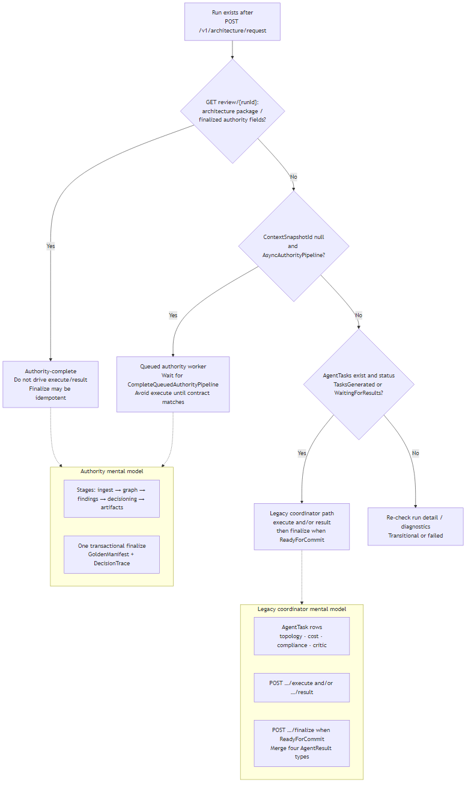

## Rule of thumb

| Observation | Action |
|-------------|--------|
| Finalized architecture package present | Authority-complete — do not drive execute/result |
| `ContextSnapshotId` null + async pipeline | Wait for worker |
| AgentTasks in TasksGenerated / WaitingForResults | Legacy coordinator path |
| Neither | Diagnostics / transitional / failed |

Contract matrix: `docs/library/AUTHORITY_VS_AGENTTASK_LOOP_CANONICAL_PATH_CONTRACT.md` (TB-1007).

# 5. Async authority pipeline and outboxes

On SQL with `AsyncAuthorityPipeline` default-on and an evidence bundle present, pipeline work is enqueued in the **same transaction** as run create. The Worker completes stages via `CompleteQueuedAuthorityPipelineAsync`.

## Diagram

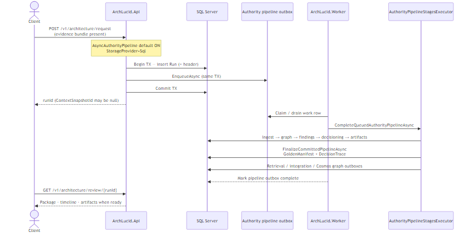

## Related outboxes

| Outbox | Purpose |
|--------|---------|
| Authority pipeline work | Durable stage execution after create |
| Retrieval indexing | Post-commit embedding / index (ADR 0004) |
| Cosmos graph snapshot | Async graph persistence when enabled (ADR 0038) |
| Integration events | Downstream / webhook fan-out |

Local opt-out: `AsyncAuthorityPipeline: false` in `appsettings.Advanced.json`. InMemory never queues.

# 6. Governance and policy packs

Policy packs are the adaptive brain of governance: rules, alerts, and advisory defaults ship as JSON/YAML and merge hierarchically at tenant, workspace, or project scope. The evaluation engine in `ArchLucid.Decisioning` stays decoupled from framework-specific knowledge.

## Diagram

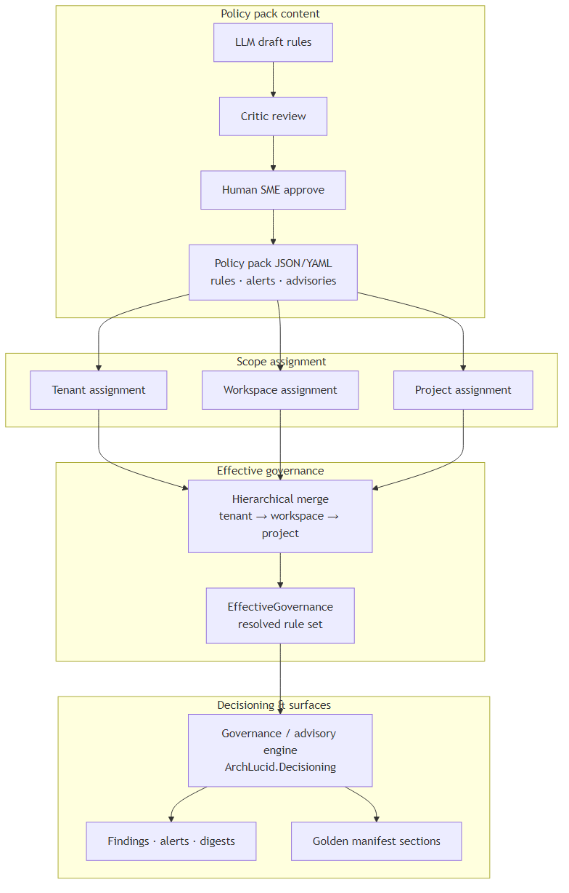

Content velocity: LLM draft → critic → human SME. See `docs/library/POLICY_PACK_CONTENT_BACKLOG.md`.

# 7. Tenant isolation

**Normative model (ADR 0037):** production isolation is **database-per-tenant catalogs**, not SQL RLS. Workspace and project are organizational dimensions within a catalog, not paying-client security boundaries. `SingleCatalog` is fail-fast in production-like hosts.

## Diagram

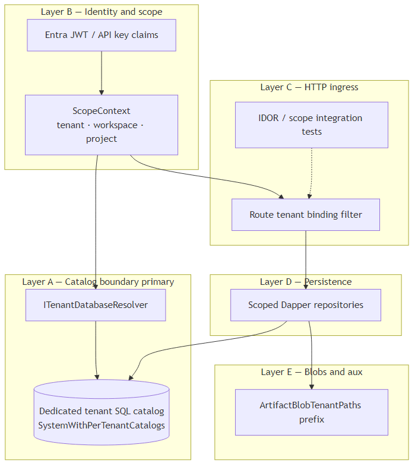

Trusted scope on production-like hosts comes from JWT/API-key claims or ambient job override — not from `x-tenant-id` headers alone. See `docs/security/TENANT_ISOLATION_DEFENSE_IN_DEPTH.md`.

# 8. Azure deployment topology

Terraform under `infra/` is the IaC source of truth. Workloads typically run as Container Apps (Api + Worker) against Azure SQL with per-tenant catalogs, Key Vault / managed identity, optional Front Door/APIM, Service Bus, Blob, OpenAI, Redis, and Cosmos.

## Diagram

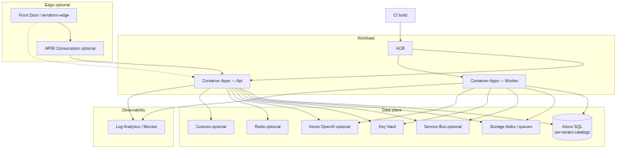

SQL schema is applied by the application host (DbUp), not inline Terraform scripts. Map of roots: `docs/library/DEPLOYMENT_TERRAFORM.md`.

# 9. Security model

Default deny on API controllers; Entra JWT or API keys; claims-based policies; production fail-closed on unsafe CORS, webhook HMAC gaps, billing misconfiguration, and `SingleCatalog`.

## Diagram

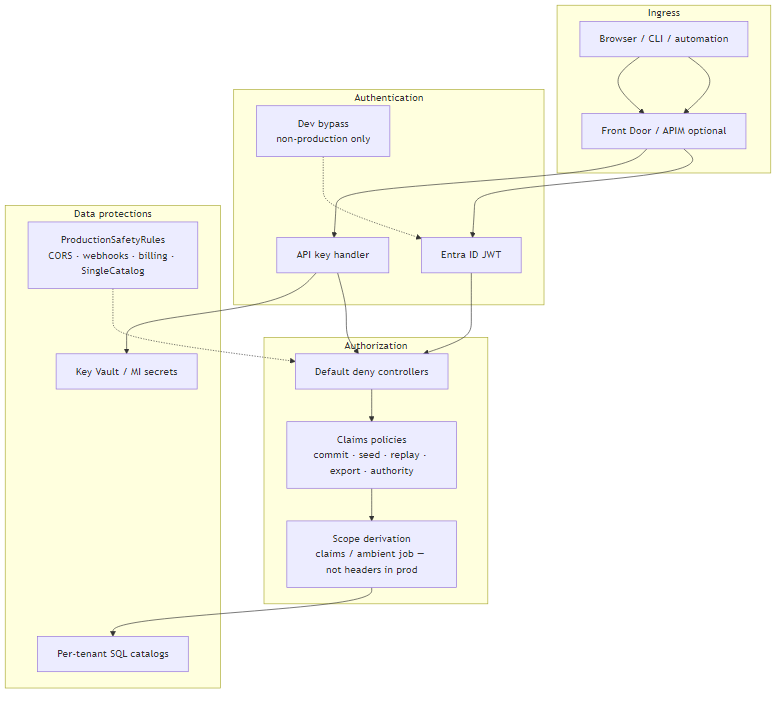

Secrets prefer Key Vault and managed identity. See also tenant isolation (chapter 7) and `docs/ARCHITECTURE_ON_ONE_PAGE.md` §7.

# 10. Data and persistence

Workflow Dapper repositories (`Persistence.Data.*`) and authority persistence (manifests, traces, UoW, outboxes) share SQL catalogs routed per tenant. One DDL source per database; forward-only migrations.

## .NET project graph

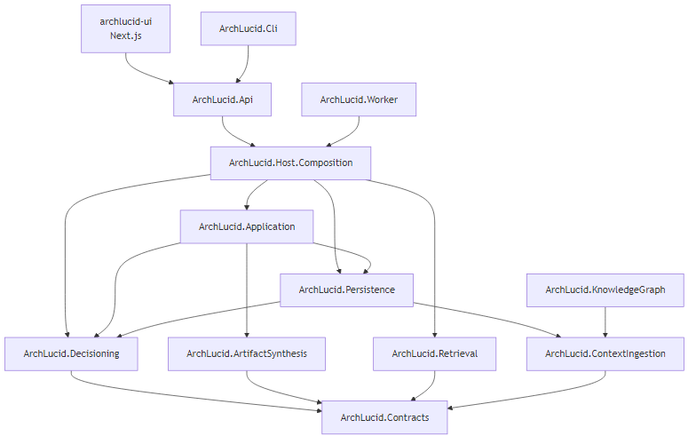

See `docs/library/DATA_MODEL.md`, `docs/library/ARCHITECTURE_COMPONENTS.md`.

# 11. Operator UI shell

Next.js app under `archlucid-ui/`: marketing vs operator shell, server BFF proxy with scope and correlation headers, heavy clients deferred off hot paths.

## Diagram

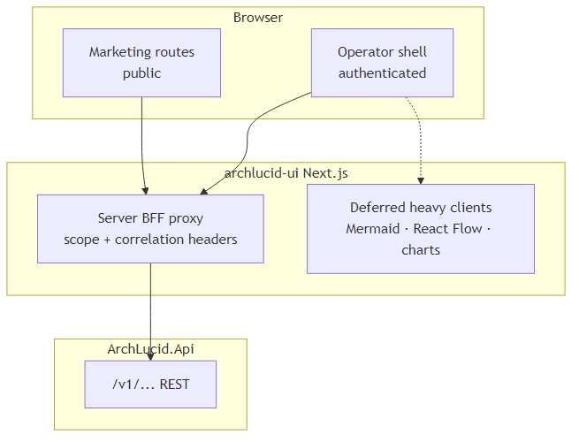

See `archlucid-ui/docs/ARCHITECTURE.md`, `docs/library/operator-shell.md`.

# 12. Exports, comparisons, synthesis, retrieval, and integrations

## Export and replay

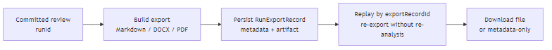

## Comparison and drift

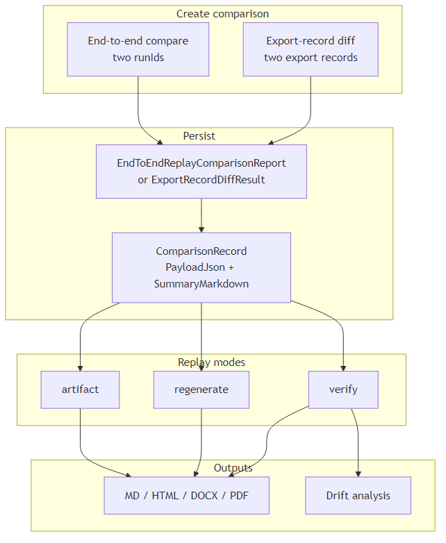

## Artifact synthesis

## Retrieval / RAG

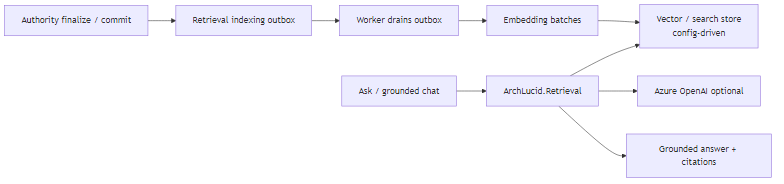

## Integrations / ITSM

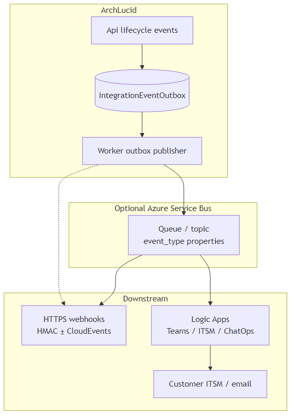

## First-run pilot path

Deep dives: `docs/library/ARCHITECTURE_FLOWS.md`, `COMPARISON_REPLAY.md`, `INTEGRATION_EVENTS_AND_WEBHOOKS.md`, `CANONICAL_FIRST_RUN_PATH.md`.

# 13. Authority pipeline stage zoom-ins

Each authority stage emits an OpenTelemetry span with tag `archlucid.stage.name`. Queued and inline paths share the same stage executor.

## Context ingestion

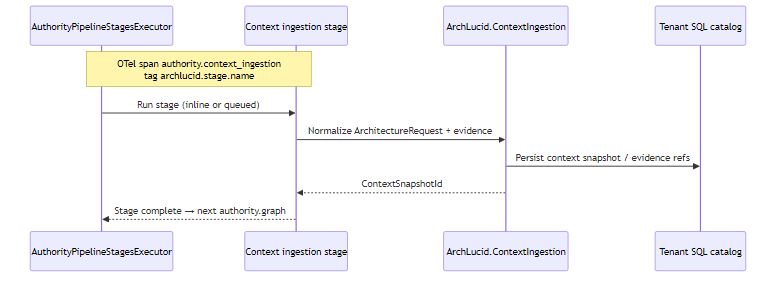

## Knowledge graph

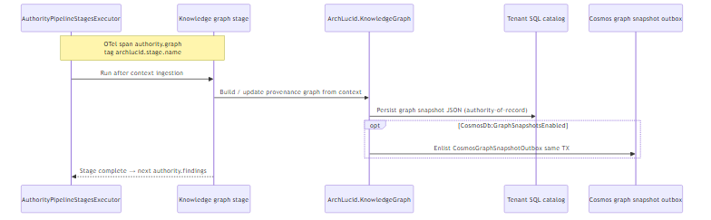

## Findings

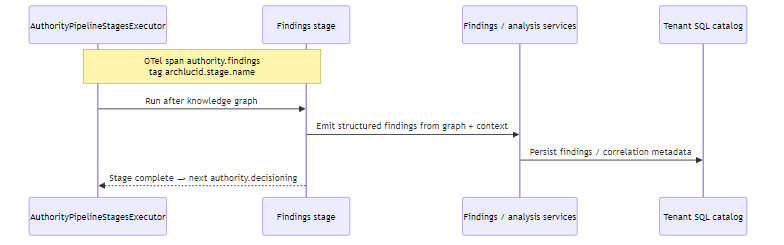

## Decisioning

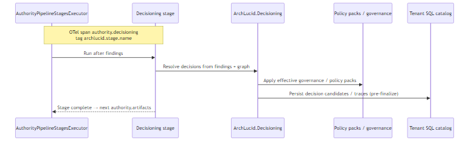

## Artifacts and finalize

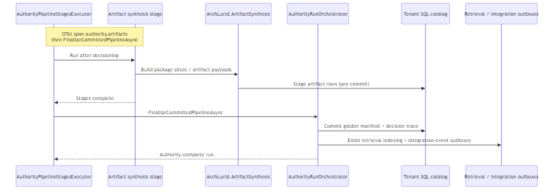

## Detail

See `docs/library/CANONICAL_PIPELINE.md`, `docs/library/BACKGROUND_JOB_CORRELATION.md`, and diagram companions under `docs/architecture/architecture_diagrams/`.

# 14. Failure resilience and failover continuity

## Failure resilience

Authority create enlists pipeline outbox work in the **same SQL transaction** as the run header (ADR 0038). Worker completion retries follow orchestrator and hosted-service lease semantics; Cosmos graph snapshots are eventually consistent projections of SQL authority.

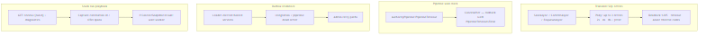

## Failover continuity

Primary posture is Azure Container Apps + per-tenant Azure SQL catalogs, managed identity, Key Vault, health/outbox probes, and per-catalog backup. Failover is redeploy + SQL continuity controls documented in operations runbooks—not an active-active multi-region product claim unless a pilot SoW states otherwise.

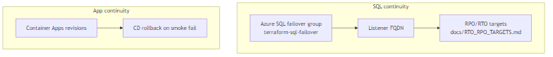

## Detail

- `docs/library/ORCHESTRATOR_RETRIES.md`
- `docs/architecture/adrs/0038-run-durability-multi-store-outbox-production-secrets.md`
- `docs/operations/TENANT_SQL_TOPOLOGY_RUNBOOK.md`

# 15. Threat models (Ask / RAG and webhooks)

Focused threat sketches for two high-traffic attack surfaces. Full security model remains chapter 9 and ADR 0037.

## Ask / RAG

Threats: cross-tenant retrieval probes, prompt injection, unbounded spend. Controls: identity-derived scope, tenant-filtered retrieval corpus, grounded citations, quotas.

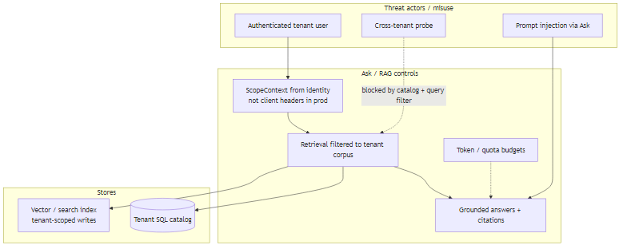

## Inbound webhooks

Threats: unsigned, replayed, or oversized posts. Controls follow INV-015 spine: rate → bounded size → verify → parse → fast ack, with fail-closed secrets and tenant correlation into the correct catalog.

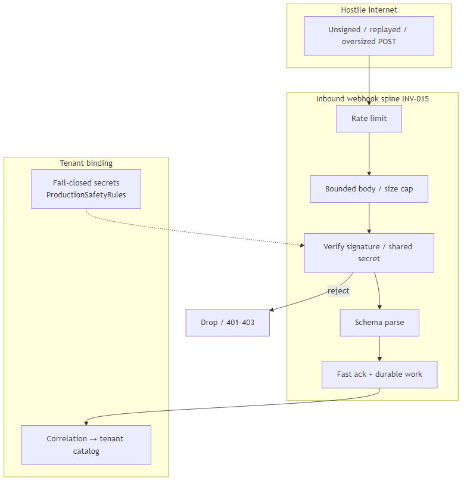

## Detail

- `docs/security/TENANT_ISOLATION_DEFENSE_IN_DEPTH.md`
- `docs/library/INTEGRATION_EVENTS_AND_WEBHOOKS.md`
- `docs/library/ARCHITECTURE_INVARIANTS.md` (INV-015)

# 16. Data model (pragmatic ER)

Core authority tables hang off **`dbo.Runs`**. Comparison left/right run ids may omit FKs so historical rows stay referenceable. Full narrative: `docs/library/DATA_MODEL.md`.

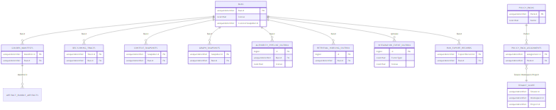

DDL source of truth: `ArchLucid.Persistence/Scripts/ArchLucid.sql` (one script per database).

# 17. Configuration precedence and fail-closed rules

Layered `IConfiguration`: appsettings → Advanced/SaaS overlays → **environment wins** → in-memory bridges. Only **`ArchLucid*`** / **`ARCHLUCID_*`** are authoritative; legacy `ArchiForge*` keys warn and are ignored.

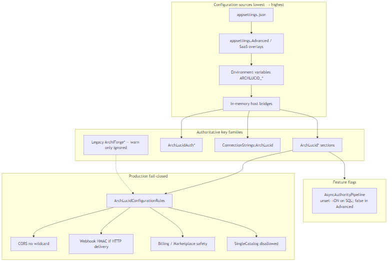

See `docs/library/CONFIGURATION_REFERENCE.md`, `CONFIGURATION_ARCHITECTURE_PRECEDENCE_VALIDATION_DRIFT_CLAIM_MAP.md`, `CONFIG_BRIDGE_SUNSET.md`.

# 18. Authentication by route tier

Anonymous health/version, unscoped marketing/webhook routes, and scoped operator `/v1/*` with JWT or API keys. Production-like hosts reject header-only scope and development bypass.

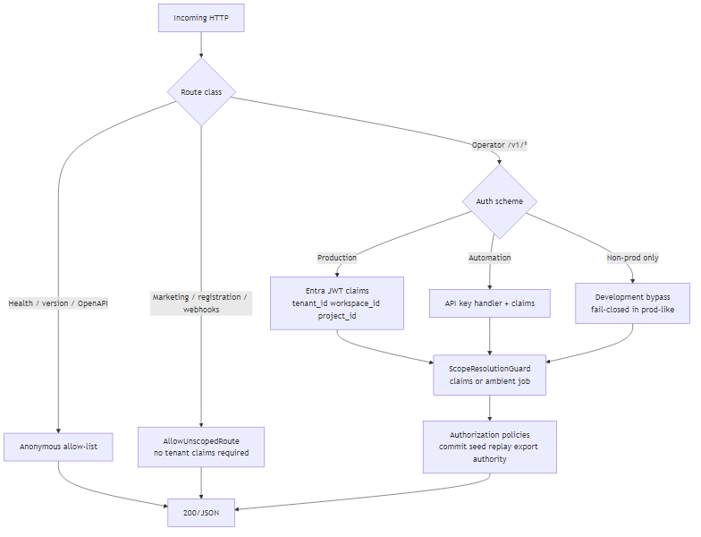

See tenant isolation chapter and `docs/security/TENANT_ISOLATION_DEFENSE_IN_DEPTH.md`.

# 19. Pilot day-0 / day-1 wireflow

Operator click-path (not C4): signup → intake → first review → finalize → export → invite reviewer → ongoing compare/Ask.

See `docs/CORE_PILOT.md`, `docs/library/CANONICAL_FIRST_RUN_PATH.md`.

# 20. FinOps and capacity drivers

Dominant spend: Azure OpenAI (completions + embeddings), Azure SQL (especially per-tenant catalogs), Container Apps replicas. Optional bus/blob/edge add marginal cost.

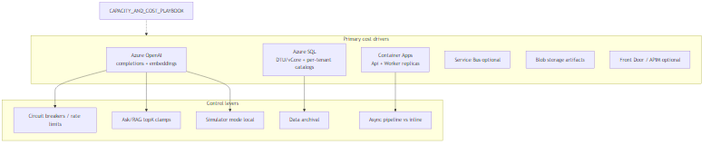

Playbook: `docs/library/CAPACITY_AND_COST_PLAYBOOK.md`.

# 21. Observability map

Authority stages emit OpenTelemetry spans (`authority.*`, tag `archlucid.stage.name`). Outbox depth and pipeline timeouts surface as meters; support correlates logs via correlation id + `runId`.

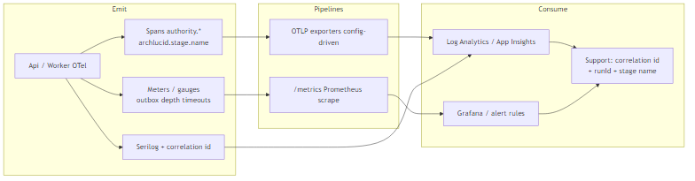

Alerts: `infra/prometheus/archlucid-alerts.yml`. Background correlation: `docs/library/BACKGROUND_JOB_CORRELATION.md`.

# 22. DR / failover drill storyboard

SQL geo failover group listener is the app connection target. Drill: confirm listener → force failover → Api/Worker follow listener → smoke `/health/ready` + synthetic review → record actual RTO vs targets.

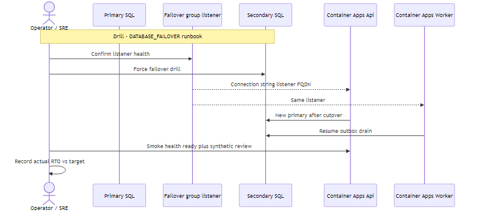

See `docs/runbooks/DATABASE_FAILOVER.md` and `docs/RTO_RPO_TARGETS.md` (when present in tree).

# 23. Policy-pack authoring SDLC

Content velocity: LLM draft → critic → SME → publish → scope assign → hierarchical effective merge → advisory hits on reviews.

Samples under `docs/samples/policy-packs/`. Backlog: `docs/library/POLICY_PACK_CONTENT_BACKLOG.md`.

# 24. API surface heat map

Public/demo routes stay lightly authenticated; operator architecture APIs use fixed/expensive rate limits; comparisons, Ask, and reports are heavier; governance/admin are authority-gated.

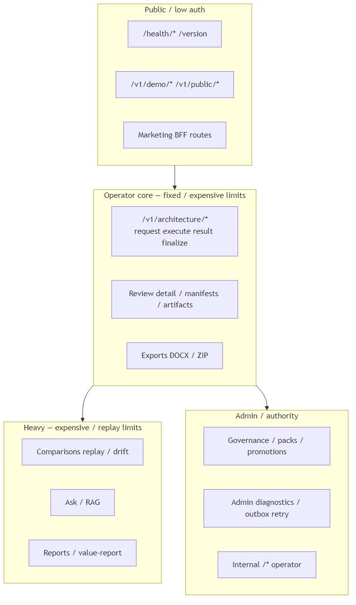

Contracts: `docs/library/API_CONTRACTS.md`. Atlas: `docs/library/OPERATOR_ATLAS.md`.

# 25. Evidence intake to context snapshot

Evidence (brief, documents, images, cloud ZIP) is validated in the intake wizard or API, assigned an evidence-bundle id, then consumed by authority **context ingestion** into a `ContextSnapshot` linked from `dbo.Runs`.

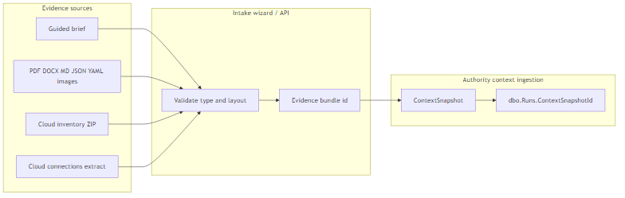

See `docs/library/customer-facing/EVIDENCE_INTAKE_OPERATOR_GUIDE.md`.

# 26. Golden manifest anatomy

The committed architecture package (API: golden manifest) carries topology, cost, compliance, and critic-oriented sections plus version/scope metadata. UI panels and consulting exports read from this shape; a decision trace is the companion audit trail.

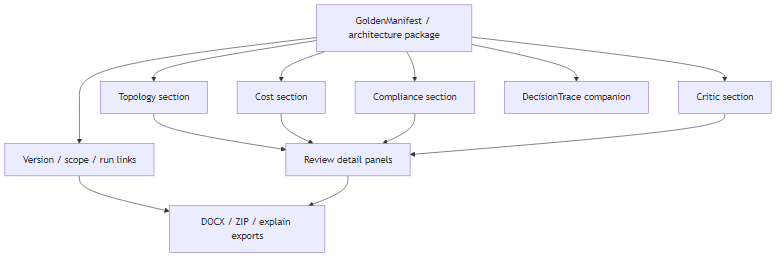

# 27. Decision-trace replay walkthrough

Support and audit path: finding → decision-trace entry → policy rule id → evidence/snapshot hint → “why this fired” for sponsors.

# 28. Billing, trial, and Marketplace

V1 ships wiring and sales-led pricing; live Stripe keys, published Marketplace offer, and signup DNS cutover remain owner flips (V1.1 candidate). Production safety rules fail closed on unsafe billing config.

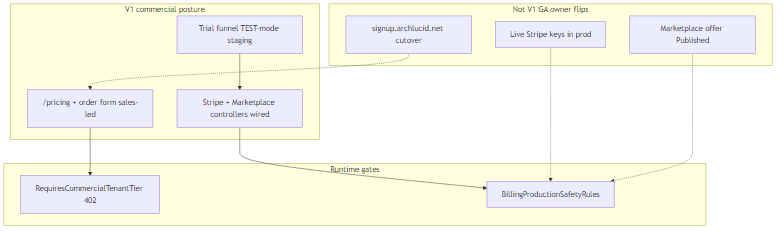

See `docs/library/V1_SCOPE.md` commerce rows.

# 29. SCIM and users & roles

Inbound SCIM 2.0 (`/scim/v2/*`) uses per-tenant bearer tokens, maps groups to roles, and feeds seat accounting. Resulting users surface in operator users-and-roles; tokens become JWT/session claims for authZ policies.

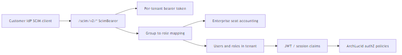

ADR 0032 · `docs/integrations/SCIM_PROVISIONING.md`.

# 30. Digest and alert subscriptions

Schedules drive advisory scans → digest payloads → tenant channel preferences (email / Teams / webhook) and optional Service Bus / Logic Apps fan-out via the integration outbox.

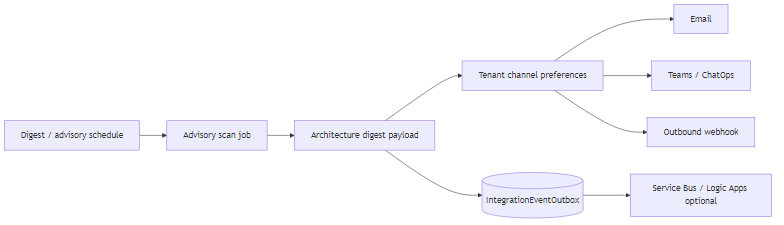

# 31. Hot-path performance

Mermaid, React Flow, and charts stay behind dynamic imports (import-policy tests). List APIs should avoid fat JSON blobs; caching decorators and rate-limit classes protect expensive routes.

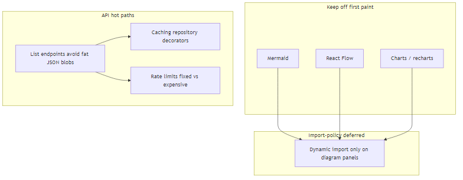

# 32. Storage provider modes

`InMemory` never queues authority (dev/tests). `Sql` is the production path and must use `SystemWithPerTenantCatalogs` on hosted workloads; `SingleCatalog` is CI/local only and fail-closed in prod-like hosts. Cosmos graph remains an optional outbox side path.

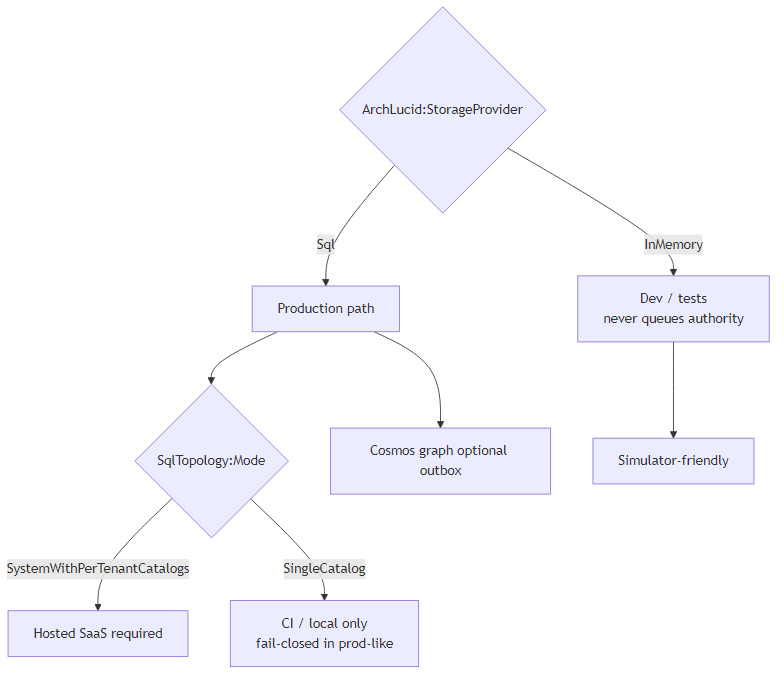

# 33. Compliance claim honesty board

Trust-center copy may describe owner pen-test posture, SOC self-assessment honesty, ADR 0037 isolation, and default-deny API. It must **not** imply a CPA SOC 2 report or a published third-party pen test until those exist (GTM **G-REAL-05**, **G-ASSURANCE-02**). Tech TB-135/TB-136 tracking is closed; owner execution remains open.

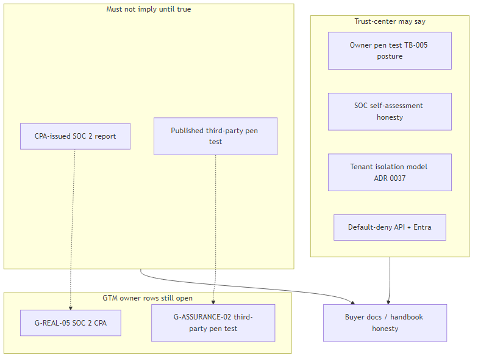

# 34. Agent-task / simulator matrix

Authority-complete runs must not be driven with `execute`/`result`. Legacy coordinator expects four `AgentResult` types (topology, cost, compliance, critic) before finalize. Executor may be simulator or real Azure OpenAI.

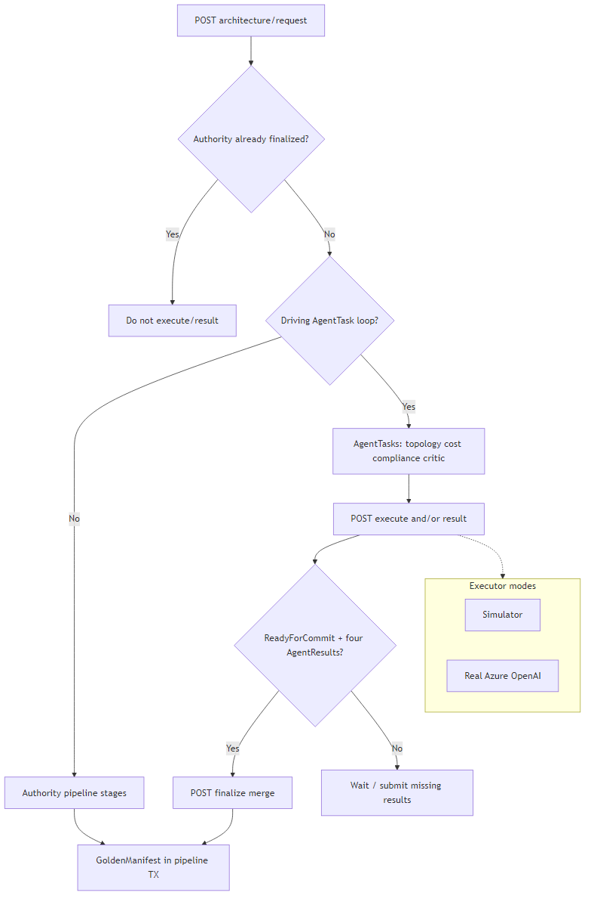

See `AUTHORITY_VS_AGENTTASK_LOOP_CANONICAL_PATH_CONTRACT.md` (TB-1007).

# 35. Cloud extractors and context ingestion

Per-tenant cloud connections feed Azure/AWS/GCP extractors (ZIP/inventory layouts). ContextIngestion normalizes objects and delta summaries into a `ContextSnapshot`.

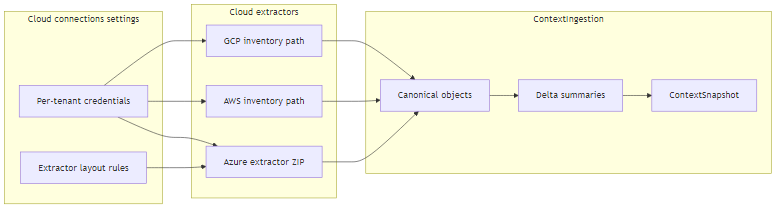

# 36. Knowledge graph model

Context snapshots build typed `GraphSnapshot` graphs (nodes/edges), validated, then shown in operator graph views and optional graph-RAG expand.

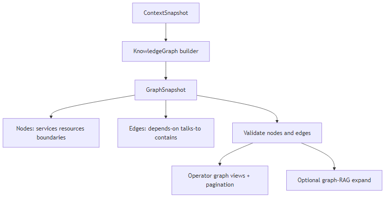

# 37. Findings taxonomy

Findings carry severity, category/theme, source stage, and optional policy rule ids linking into decision traces, digest rollups, and exports.

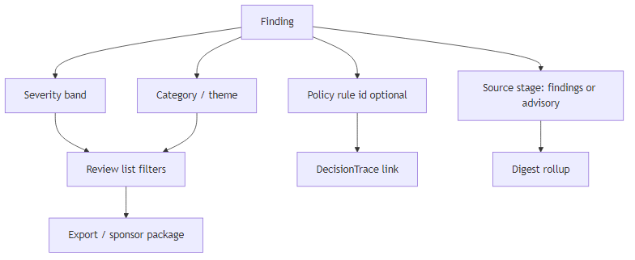

# 38. Artifact generator registry

`ArtifactSynthesisService` runs registered `IArtifactGenerator` implementations into an `ArtifactBundle`, then packaging produces ZIP/DOCX downloads.

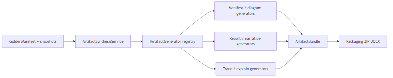

# 39. Comparison types catalog

Two primary persisted types: end-to-end run compare and export-record diff. Replay modes: artifact, regenerate, verify (drift).

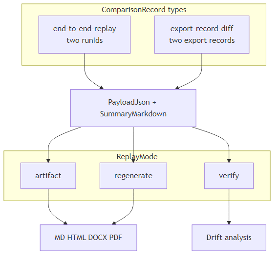

# 40. Ask thread lifecycle

Scoped retrieve → circuit breaker → completion → citations. Open breaker returns problem+json; answers should carry retrieved document ids for audit.

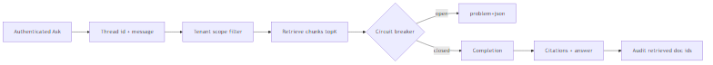

# 41. Worker hosted-services inventory

Leader-elected hosted loops drain authority, retrieval, integration, advisory/digest, archival, and optional Cosmos graph outboxes.

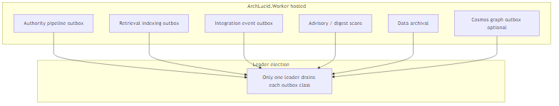

# 42. Demo and public surfaces

Demo preview and sample-run endpoints use read-only demo bundles only — they must never bypass tenant catalog isolation. Demo seed uses expensive rate limiting.

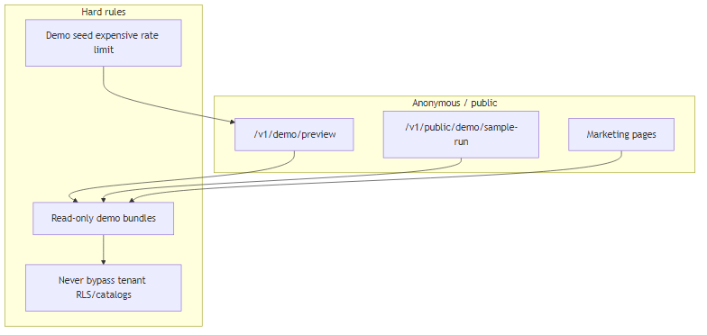

# 43. CLI command map

`ArchLucid.Cli` covers project bootstrap, run lifecycle, artifacts, comparison replay/drift, and graph export (Mermaid/GraphML) against the HTTPS API.

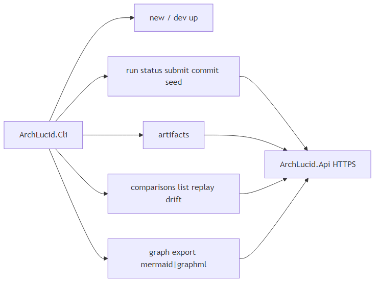

# 44. Terraform root apply order

`terraform-pilot` is the operator entry profile; nested roots cover Container Apps, private networking, edge, monitoring, Entra, storage, optional ACR/SQL failover/OpenAI/Logic Apps. See `REFERENCE_SAAS_STACK_ORDER`.

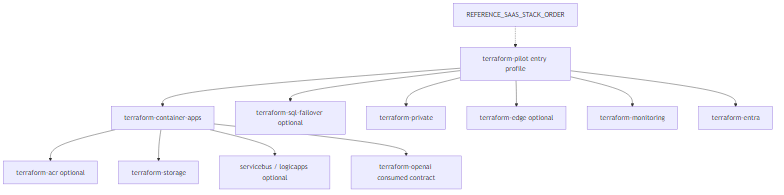

# 45. LLM provider adapters

Completions and embeddings are Azure OpenAI–backed in V1 behind `DefaultLlmProviderFactory` and a decorator stack (cache, circuit breaker, fallback, content safety). Non-Azure enum values remain scaffold-only (`NotSupportedException`).

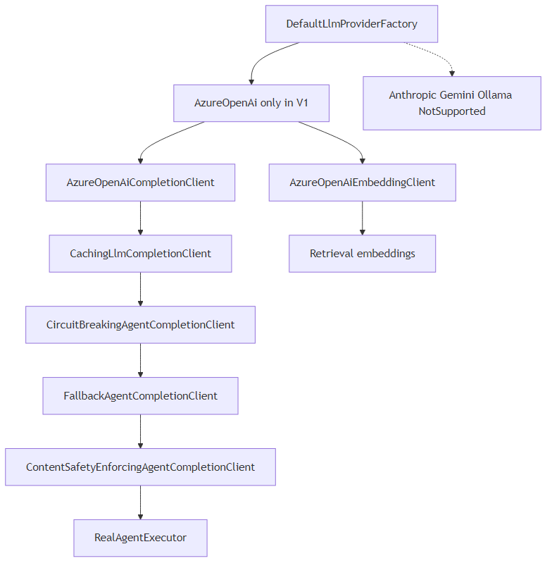

# 46. Secrets and Key Vault resolution

Runtime secrets resolve only through `ISecretProvider` (`EnvironmentVariable` or `KeyVault`, optionally composed). ITSM and Teams store Key Vault *secret names*, not raw credentials; stack generation emits `@Microsoft.KeyVault(...)` references for hosted pilots.

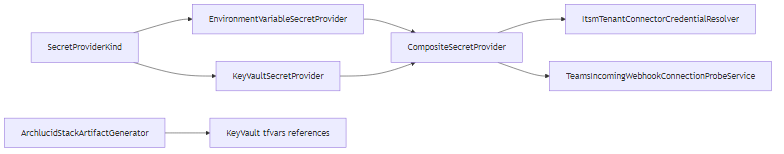

# 47. Kill switches and circuit breakers

Operational levers are config-driven circuit breakers and GA/budget gates—not a general feature-flag plane. AOAI and content-safety breakers, Marketplace `GaEnabled`, and the golden-cohort spend kill band are the primary controls.

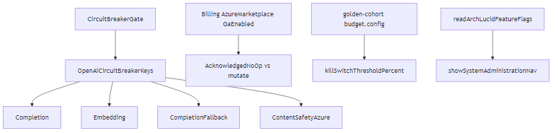

# 48. Outbound webhook delivery

Outbound customer delivery is dual-path: transactional integration-event outbox to Service Bus, and direct HMAC/CloudEvents HTTP posts via `IWebhookPoster`. Distinct from inbound webhook threat modeling.

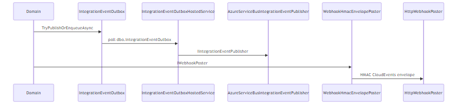

# 49. Audit event catalog

Durable operator and pipeline forensics centralize in `AuditEventTypes` → `dbo.AuditEvents`, spanning authority, governance, drafts, notifications, and product-learning signals, with hot-path list shapes and collision tests.

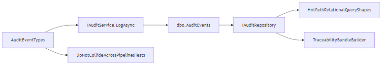

# 50. DbUp schema migration

SQL evolution is DbUp-first (system vs tenant planes, greenfield baseline stamp, then embedded scripts), followed by consolidated `ArchLucid.sql` bootstrap. `MigrateVerify` sentinel checks close the verification loop.

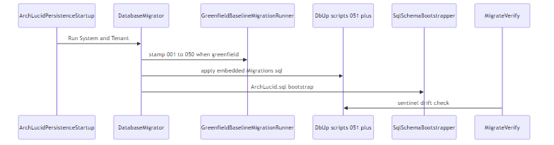

# 51. Cache layers

Caching is multi-plane: process `IMemoryCache`, optional Redis hot-path reads, LLM completion reuse, and graph snapshot projection caches—distinct from the hot-path *performance* chapter.

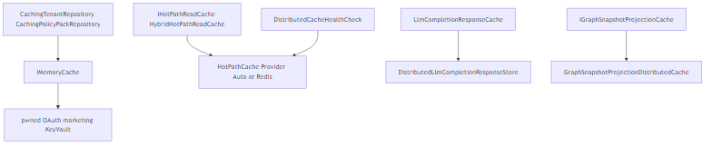

# 52. Blob content-addressed layout

Artifact blobs are tenant-prefixed and scope-segmented, with an explicit content-addressed `dedup/{sha256}` layout for reusable payloads and large-payload offload envelopes.

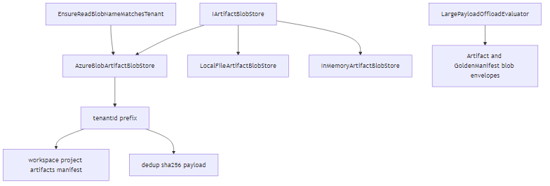

# 53. Notification channel matrix

Customer notifications are a preference matrix (email / Teams / outbound webhook) plus Teams trigger opt-in and email/Slack digest dispatch—not only the weekly digests hub. Logic Apps filter Teams fan-out server-side.

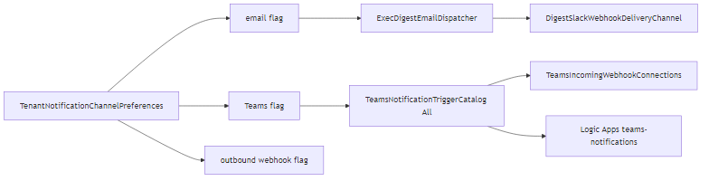

# 54. Rate limiting and throttling

ASP.NET rate policies gate fixed, expensive authority, replay, bulk evidence, OTP, and policy-pack dry-run surfaces with role/IP/tenant partitions. Quick Scan identity abuse is a separate admit gate that can also return rate-limited outcomes.

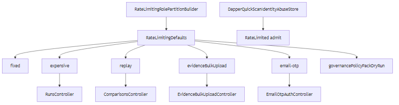

# 55. Private Link network

`infra/terraform-private` is the optional private data-plane root (VNet, PE subnet, SQL/Blob private endpoints and DNS), gated by `enable_private_data_plane`. Compute must VNet-integrate to reach `privatelink.*` hostnames.

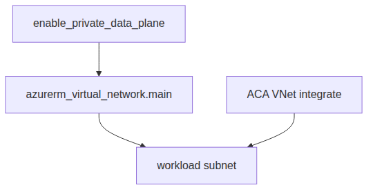

# 56. Container deploy units

One API Dockerfile publishes API, Worker, and Jobs CLI into a shared image; ACA revisions select entrypoints. The UI ships as a separate Next.js image. Pair with `Hosting:Role` so deploy units are visible beyond Terraform boxes.

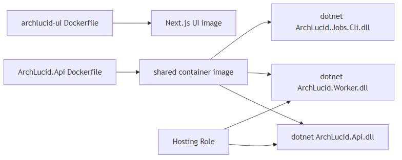

# 57. CI product pipeline

Product CI is a multi-lane DAG: secrets scan, path lanes, fast core, OpenAPI snapshots, prompt-injection regression, Terraform validates, then full regression shards. This chapter maps gate intent and blast radius, not every job name.

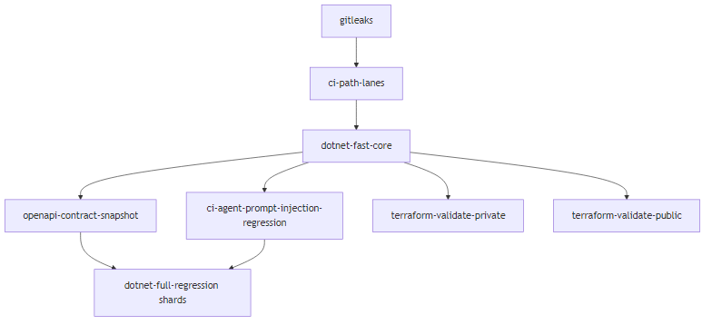

# 58. Golden cohort evaluation

The locked N=20 golden cohort JSON drives simulator drift automation and optional real-LLM nightly gates. `GoldenCohortFineTuningPromotionGate` compares faithfulness support ratios before model promotion—distinct from the agent-task simulator matrix.

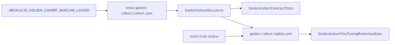

# 59. Workspace and project hierarchy

Scope is a three-level hierarchy (tenant → workspace → project) enforced in SQL and ambient `ScopeContext`. Projects soft-delete via `IsDeleted`/`DeletedUtc` with audit events and recycle restore—complementing tenant isolation without duplicating it.

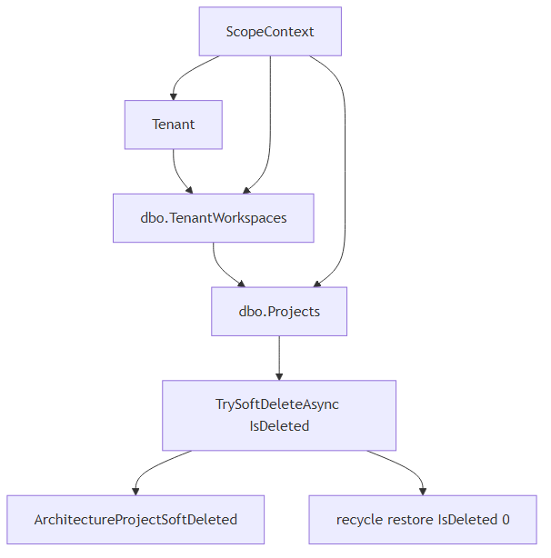

# 60. Entra role claims

Entra (or generic OIDC) app roles and SAML attributes are normalized onto `ArchLucidRoles` plus fine-grained `permission` claims. This is the claim-transform path behind the authn-route matrix—role sources, aliases, and diagnostics.

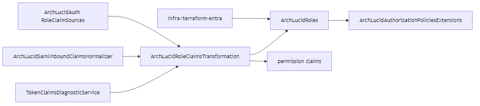

# 61. Correlation and tracing

Incoming `X-Correlation-Id` (validated) seeds request correlation; scope tags and Activity IDs flow into logs, audits, and outbox processors. Narrower than the observability map: end-to-end baggage from HTTP edge to worker activities.

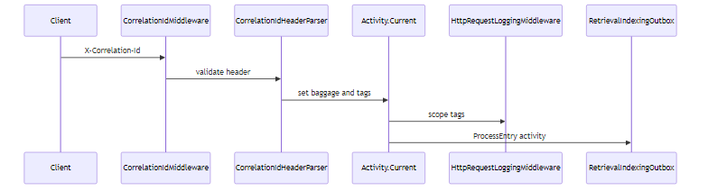

# 62. Content safety ingress

Ingress precheck on create-run, Azure AI Content Safety on completion I/O, evidence sanitizers, and prompt redaction form a layered trust boundary. Health probes and regression datasets make the posture diagrammable without claiming injection-proof.

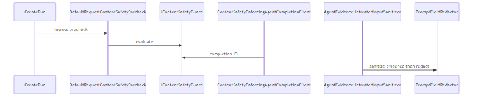

# 63. Health checks catalog

Liveness stays minimal; readiness and authenticated detailed surfaces register named checks (SQL, vector store, golden-manifest consistency, Content Safety, and more). Catalog which checks gate probes versus triage-only diagnostics.

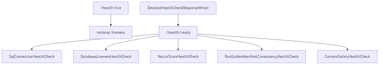

# 64. Hosting roles split

`Hosting:Role` selects Combined (default), Api (HTTP plus limited in-process work), or Worker (background loops, minimal health HTTP). Distinct from the hosted-services inventory (what loops exist) and azure-topology (where they run).

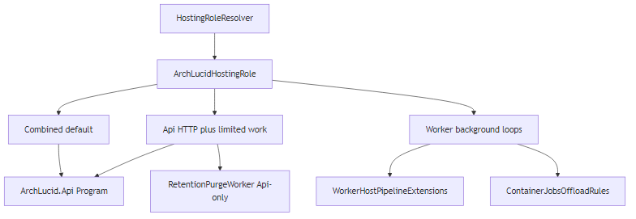

# 65. Mutating idempotency keys

Client `Idempotency-Key` is hashed and fingerprinted for create/commit (and required governance POSTs), with replay returning the same run/manifest without duplicate rows. The BFF forwards the header and surfaces `X-Idempotency-Replayed`.

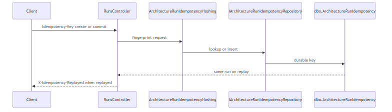

# 66. Soft-delete retention purge

Projects soft-delete via `IsDeleted`/`DeletedUtc`, then a hosted worker hard-deletes rows past retention days. SQL vs in-memory registrars swap real purge vs no-op so local hosts never hard-delete.

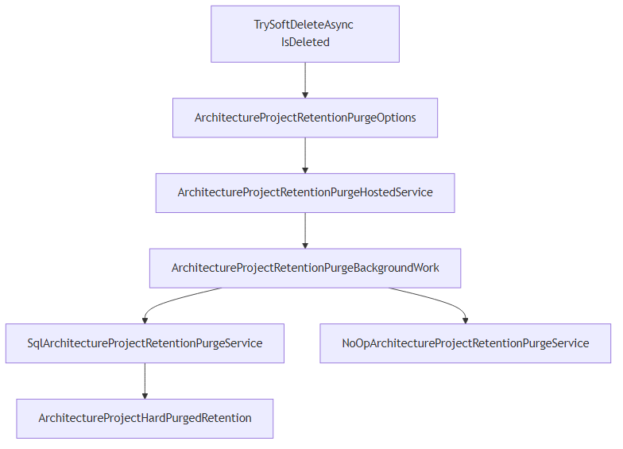

# 67. Manifest commit segregation of duties

Finalize runs through an optional pre-commit gate plus SoD that compares Entra-oid actor keys (not display names), blocking self-approval. This is submitter≠approver on approval requests—not a blanket “every pack blocks commit” rule.

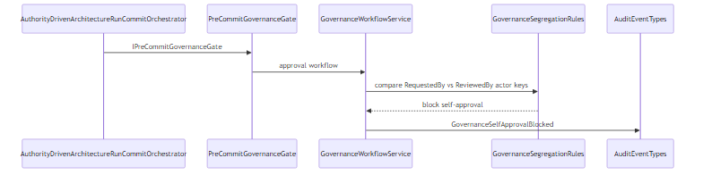

# 68. Export package formats

Board exports are format-switched (DOCX/PDF/HTML) while run packages assemble authority material plus a hashed export manifest via packaging. Async blob push reuses the same builder, distinct from replay/compare flows.

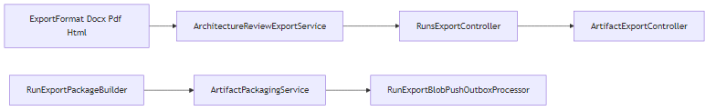

# 69. OpenAPI audience versioning

The public surface is ASP.NET API versioned at 1.0 and partitioned with `x-archlucid-audience` for buyer, operator, internal, and forensics docs. Transformers keep generated clients honest for auth and multipart evidence.

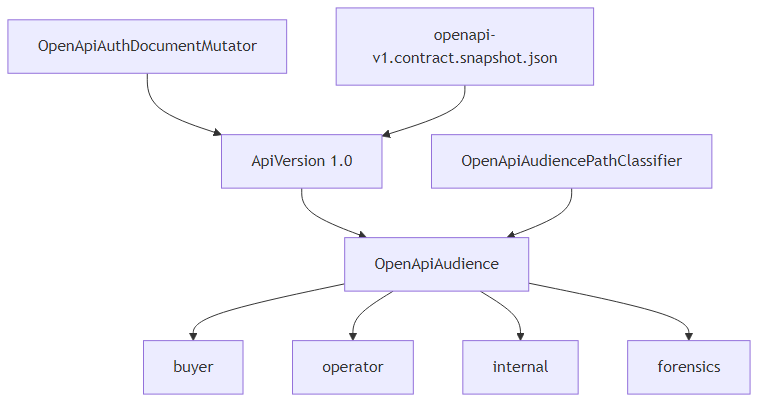

# 70. SQL open resilience

Transient SQL open/operation failures use Polly v8 exponential backoff with jitter, separate from product kill-switches. Read-replica and audit paths share the same transient detector so brownouts degrade to retries rather than silent partial writes.

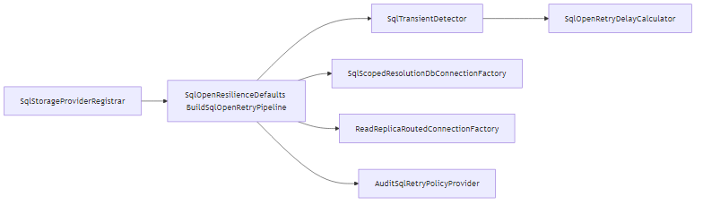

# 71. Billing provider adapters

`Billing:Provider` selects Stripe, Azure Marketplace, or no-op through one registry used by checkout/portal. Marketplace ChangePlan/ChangeQuantity can 202-ack without mutating when `GaEnabled` is false.

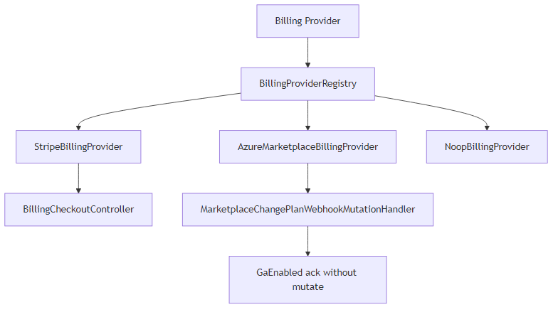

# 72. UI BFF proxy session

OIDC tokens live in browser `sessionStorage`; the Next BFF proxy attaches Authorization or server API key and scope headers to ArchLucid.Api. Marketing paths strip privileged upstream auth so anonymous funnels never inherit operator credentials.

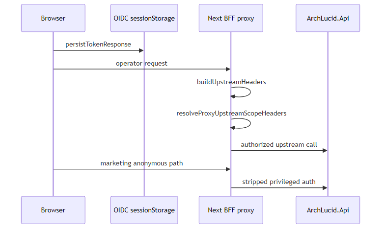

# 73. Agent allowed-tools dispatch

Handler dispatch is gated by per-task allowlists; production-like hosts deny empty allowlists unless `UnrestrictedDispatch` is explicit. Invocations are persisted so run queries can audit which tools actually ran.

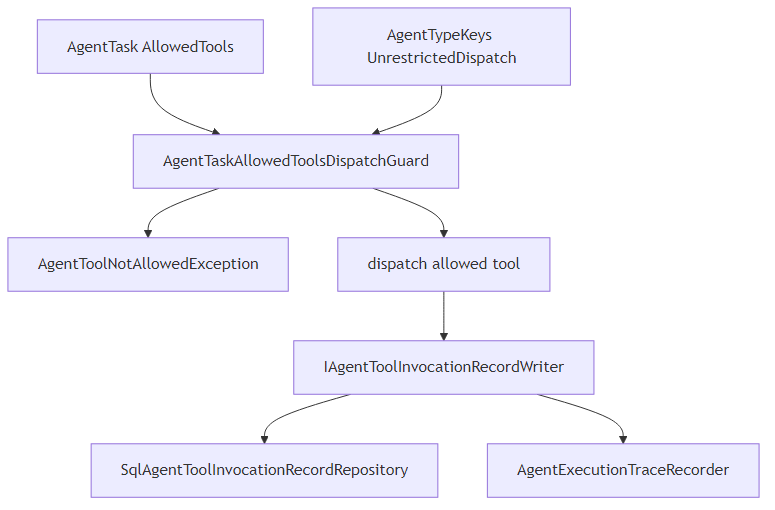

# 74. Technology ledger lifecycle

Run-scoped technology ledger entries are seeded from request/evidence/topology, then patched through a command service and replayed with authority state. A first-class evidence/decision surface beyond findings taxonomy or golden-manifest anatomy.

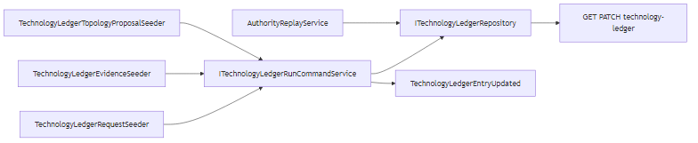

# Changelog (handbook)

| Version | Date | Notes |
|---------|------|-------|
| 2026.08.06i | 2026-08-06 | Security reviewer audience pack (tenancy through compliance honesty) + generate/release `-Pack Security`. |
| 2026.08.06h | 2026-08-06 | Expansion set 7: idempotency, retention purge, commit SoD, export formats, OpenAPI audiences, SQL resilience, billing adapters, BFF session, agent tools, technology ledger. |
| 2026.08.06g | 2026-08-06 | Expansion set 6: Private Link, container deploy units, CI pipeline, golden cohort, workspace hierarchy, Entra claims, correlation, content safety, health checks, hosting roles. |
| 2026.08.06f | 2026-08-06 | Expansion set 5: LLM adapters, Key Vault secrets, kill switches, outbound webhooks, audit catalog, DbUp migration, cache layers, blob CAS layout, notification channels, rate limiting. |
| 2026.08.06e | 2026-08-06 | Expansion set 4: cloud extractors, knowledge graph, findings taxonomy, artifact registry, comparison catalog, Ask lifecycle, hosted services, demo surfaces, CLI map, Terraform order. |
| 2026.08.06d | 2026-08-06 | Expansion set 3: intake through agent-task/simulator. |
| 2026.08.06c | 2026-08-06 | Expansion set 2: ER through API heatmap + release workflow. |
| 2026.08.06b | 2026-08-06 | Restored spine + stages/threats/buyer/drift. |
| living | prior | Original chapters 00–12 + 99. |

# References

| Need | Doc |
|------|-----|
| One-page poster | `docs/ARCHITECTURE_ON_ONE_PAGE.md` |
| C4 index | `docs/architecture/README.md` |
| Diagrams (Mermaid + SVG) | `docs/architecture/architecture_diagrams/` |
| Flows | `docs/library/ARCHITECTURE_FLOWS.md` |
| Containers | `docs/library/ARCHITECTURE_CONTAINERS.md` |
| Components | `docs/library/ARCHITECTURE_COMPONENTS.md` |
| ADRs | `docs/architecture/adrs/` |
| V1 scope | `docs/library/V1_SCOPE.md` |
| API contracts | `docs/library/API_CONTRACTS.md` |
| Tenant isolation | `docs/security/TENANT_ISOLATION_DEFENSE_IN_DEPTH.md` |
| Operator atlas | `docs/library/OPERATOR_ATLAS.md` |

