# 3. Tenant isolation (buyer)

**Primary control:** one product SQL catalog per tenant (`SystemWithPerTenantCatalogs`), resolved at connection time.  
**Not used in production:** SQL Row-Level Security (removed; ADR 0037).  
Defense-in-depth adds identity scope, HTTP route binding, scoped repositories, and tenant-prefixed blobs.

