# 3. Security model (security)

Ingress via browser/CLI (optional Front Door/APIM), Entra JWT or API keys, default-deny controllers with claims policies, production-like Key Vault / managed identity, and startup safety rules (including blocking single-catalog SQL in production-like hosts).



