# 4. Entra role claims (security)

Entra (or generic OIDC) app roles and SAML attributes are normalized onto `ArchLucidRoles` plus fine-grained `permission` claims. Role sources, Architect/Reviewer aliases, and token diagnostics sit behind the authn-route matrix.



