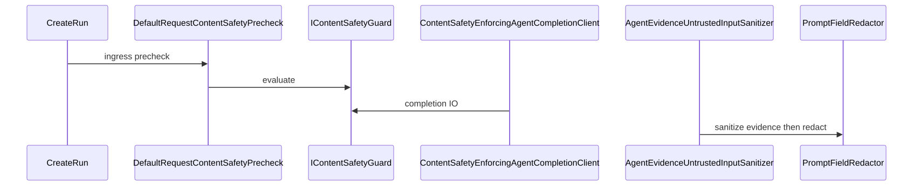

# 8. Content safety ingress (security)

Ingress precheck on create-run, Azure AI Content Safety on completion I/O, evidence sanitizers, and prompt redaction form a layered trust boundary. Health probes and regression datasets support the posture without claiming injection-proof.



