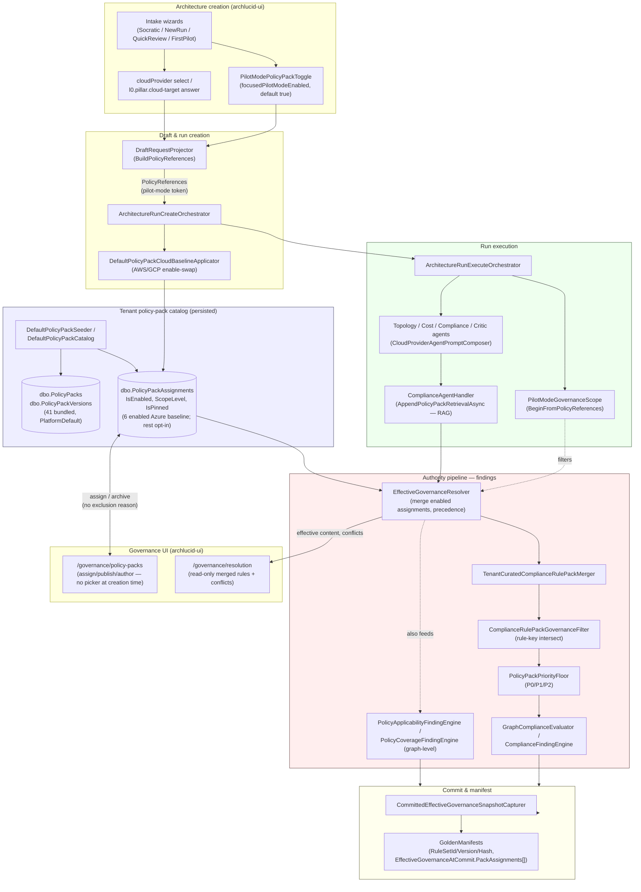

# Architecture-quality policy engine assessment

**Status:** Assessment only. No production code, tests, configuration, migrations, or documentation were modified while producing this file.

**Scope:** ArchLucid's policy-pack, architecture-generation, and architecture-review engines, assessed against the goal of adding a six-dimension provider-neutral architecture-quality baseline (Security, Reliability and resilience, Cost effectiveness, Performance and scalability, Operational excellence, Sustainability and resource efficiency) with organization-required packs, platform overlays, contextual recommendations, explicit exclusions, and defensible historical review scope.

**Method:** Read-only repository inspection (C# backend under `ArchLucid.*`, Next.js frontend under `archlucid-ui/`, SQL under `ArchLucid.Persistence/`, and `docs/`). Every claim below is grounded in a cited file and, where useful, a line range. Where documentation conflicts with shipped code, both are cited and the conflict is called out rather than silently resolved.

**Reading order:** Part A is grounded fact-finding (the 24 requested inspection points). Part B compares the three architecture options. Part C is the 19 requested deliverables, ending with the executive recommendation restated in one place and the open questions for the owner. If you only read one section, read **Part C.1 (executive recommendation)** and **Part C.19 (open questions)**.

---

## Correction to the background brief

The task brief states: *"ArchLucid currently defaults Security and Cost policy packs when generating or reviewing architectures... Security and Cost already have policy packs... ArchLucid does not currently have a Sustainability and Resource Efficiency policy pack. Reliability, Performance, and Operational Excellence packs may also be absent or incomplete."*

Repository evidence only partially supports this framing. It needs three corrections before any design work starts, because they change where the real gap is:

1. **The "Security and Cost default" is real, but it is a first-run governance-evaluation narrowing, not a generation content gap.** ArchLucid already seeds **41** curated policy packs to every tenant (`ArchLucid.Application/Governance/DefaultPolicyPacks/Bundled/bundled-policy-packs-v1.manifest.json`, `docs/go-to-market/DEFAULT_POLICY_PACKS_V1.md:7`), including packs whose *category* metadata is literally `"Reliability"` (Azure/AWS/GCP Resiliency & DR), `"Platform"` (AKS/EKS/GKE, landing zones), `"Operations"` (Observability & OpenTelemetry), and `"Architecture"` (Azure/AWS Well-Architected Framework, Google Cloud Architecture Framework — each of which already covers all six WAF-style pillars including *Performance efficiency* and *Sustainability* thematically, e.g. `docs/library/TECH_BACKLOG.md:20177`). What narrows a **new architecture run** to Security + Cost is **focused pilot mode** (`ArchLucid.Core/Governance/PolicyPacks/FocusedPilotModePolicyPacks.cs:6-21`), a first-pilot time-to-value UX default that is **on by default** in every intake wizard and can be turned off per run. It is not a hard architectural ceiling — it is a product default that happens to be the practical experience most users see.
2. **There is no first-class "Performance and scalability" or "Sustainability and resource efficiency" *dimension*, but there is substantial *related content* already shipped under different names** — Well-Architected-Framework-style packs (Azure/AWS/GCP) whose pillar summaries already enumerate "Reliability," "Cost Optimization," "Operational Excellence," "Performance Efficiency," and "Sustainability" as pillar names (`docs/templates/policy-packs/azure-well-architected-content.json:21`), and Azure/AWS/GCP Resiliency & DR packs for reliability specifically. None of this content is organized as an explicit "quality dimension" independent of a specific cloud framework, which is the real gap (see Part A.4).
3. **"Reliability, Performance, and Operational Excellence packs may also be absent or incomplete" undersells what exists** and, more importantly, misses the actual design problem: the content exists, scattered across provider-branded packs (Azure WAF, AWS WAF, GCP Architecture Framework), with **no provider-neutral version** of Reliability, Performance, or Operational Excellence that is not wrapped in a specific cloud's framework branding. Sustainability is the only dimension with **no** dedicated pack of any kind, provider-branded or neutral (Part A.4 confirms zero hits for a standalone sustainability/resource-efficiency pack).

This changes the framing from **"build four missing packs"** to **"factor a provider-neutral quality baseline out of content that is currently trapped inside provider-branded packs, author the one dimension (Sustainability) that has zero coverage, and change what is selected by default and what is disclosed as scope"** — which is a smaller, safer, and more honest description of the work, and it is why Option B (below) is recommended over writing four pack JSON files first.

---

# Part A — Repository inspection findings (24 items)

## A.1 Current policy-pack definitions and storage

Policy packs are a first-class domain concept with a normalized SQL model, not just JSON files.

**Domain model** (`ArchLucid.Contracts/Governance/PolicyPacks/`):

| Type | File | Purpose |
|---|---|---|
| `PolicyPack` | `PolicyPack.cs:4-77` | Pack header: `PolicyPackId`, `TenantId/WorkspaceId/ProjectId` scope, `Name`, `Description`, `PackType`, `Status`, `CurrentVersion` (default `"1.0.0"`), `IsDeleted`. |
| `PolicyPackType` | `PolicyPackType.cs:4-14` | String constants: `BuiltIn`, `PlatformDefault`, `TenantCustom`, `WorkspaceCustom`, `ProjectCustom`. |
| `PolicyPackStatus` | `PolicyPackStatus.cs:4-10` | `Draft`, `Active`, `Retired`. |
| `PolicyPackVersion` | `PolicyPackVersion.cs:4-40` | Immutable version snapshot: `Version` (string), `ContentJson`, `IsPublished`. |
| `PolicyPackAssignment` | `PolicyPackAssignment.cs:9-88` (read in full) | Binds a pack **version** to a scope (`TenantId/WorkspaceId/ProjectId`) with `IsEnabled` (default `true`), `ScopeLevel` (Tenant/Workspace/Project, default Project), `IsPinned` (precedence boost, default `false`), `AssignedUtc`/`ArchivedUtc`, and commit-gate fields `BlockCommitOnCritical` / `BlockCommitMinimumSeverity`. |
| `PolicyPackContentDocument` | `PolicyPackContentDocument.cs:13-77` | The on-disk/`ContentJson` shape: `complianceRuleIds`, `complianceRuleKeys`, `alertRuleIds`, `compositeAlertRuleIds`, `advisoryDefaults` (`Dictionary<string,string>`), `metadata` (`Dictionary<string,string>`), `elicitationQuestions`. |
| `ResolvedPolicyPack` / `EffectivePolicyPackSet` | same folder | Per-scope resolved pack list (no merge yet). |

**Persistence** (`ArchLucid.Persistence/Scripts/ArchLucid_Unified_Schema.sql`):

- `dbo.PolicyPacks` (`:2938-2952`) — no `IsRequired`, no `IsLocked`, no category column.
- `dbo.PolicyPackVersions` (`:2959-2971`) — `ContentJson`, `IsPublished`.
- `dbo.PolicyPackAssignments` (`:2978-2994`, altered `:3035-3044`) — `PolicyPackVersion` (pinned version string per assignment), `IsEnabled`, `ScopeLevel`, `IsPinned`, `RowVersionStamp` (optimistic concurrency), commit-gate columns. **No exclusion-reason column.**
- `dbo.PolicyPackChangeLog` (`:3001-3024`) — append-only mutation log (`ChangeType`, `ChangedBy`, `PreviousValue`, `NewValue`).
- `dbo.PolicyPackCatalogEntry` (`:6301-6325`) — cross-tenant promoted-catalog hub (separate from tenant assignments).

**Category is a metadata string, not a domain concept.** There is no C# enum or SQL column distinguishing "Security" from "Cost" from "Reliability." Category lives only as `metadata["pack.category"]` inside the JSON content (e.g. `"pack.category": "Security"` in `docs/samples/policy-packs/security-architecture-baseline.json:49`, `"pack.category": "Cost"` in `cost-optimization.json:19`), read by `ArchLucid.Application/Governance/PolicyPackRuleTemplatesService.cs:30-38` with a `"General"` fallback. **This is the load-bearing gap for a six-dimension baseline**: nothing today prevents a category value from being any free string, nothing validates it against a closed set, and nothing treats "this pack fulfills the Reliability dimension of the baseline" as a queryable fact — it is prose inside a JSON blob.

**On-disk content shapes** (`docs/samples/policy-packs/README.md:5-7`; verified against `security-architecture-baseline.json` and `cost-optimization-rules-v1.json`):
- `PolicyPackContentDocument` shape — the pack "header" (`advisoryDefaults`, `metadata`, `complianceRuleKeys`).
- Curated-rules shape (`archlucid.policyPack.curatedRules.v1`) — `CuratedRulesRuleEntry` fields: `id`, `title`, `description`, `severity`, `priority` (`P0`/`P1`/`P2`), `remediationGuidance`, `evidenceHints`, `frameworkMappings`.

## A.2 Current default-pack selection behavior

Two independent narrowing mechanisms exist, at two different scopes, and they are frequently conflated:

1. **Tenant provisioning (governance findings baseline, all packs):** `DefaultPolicyPackSeeder` (`ArchLucid.Application/Governance/DefaultPolicyPacks/DefaultPolicyPackSeeder.cs:28-79`) creates **all 41** bundled packs as `PlatformDefault` assignments for every net-new tenant. Of those 41, only a **standard baseline subset** starts `IsEnabled = true`: 4 cloud-neutral packs (Security Architecture Baseline, FinOps & Cloud Cost Optimization, AI Governance / Responsible AI, Zero Trust Architecture) plus 2 Azure-specific packs (Azure Well-Architected Framework, CIS Microsoft Azure Foundations Benchmark) — see `DefaultPolicyPackCatalog.cs:69-109` (read in full above). The other 35 packs are seeded but **disabled**, waiting for opt-in.
2. **Run-scoped narrowing (focused pilot mode, generation/first-review):** Independent of the above, `FocusedPilotModePolicyPacks` (`ArchLucid.Core/Governance/PolicyPacks/FocusedPilotModePolicyPacks.cs:6-21`, read in full above) allow-lists exactly two display names — **Security Architecture Baseline** and **FinOps & Cloud Cost Optimization** — for **effective governance evaluation during a specific run**, regardless of how many packs are enabled tenant-wide. This is what the task brief is describing as "defaults Security and Cost." It is driven by a single boolean, `focusedPilotModeEnabled`, defaulted to `true` in every intake wizard (`SocraticIntakeWizard.tsx:172`, `NewRunWizardClient.tsx:234`, `QuickReviewWizard.tsx`, `FirstPilotIntakeWizard.tsx:94`) and threaded through as a policy-reference token `"pilot-mode:security-baseline-cost-only"` (`archlucid-ui/src/lib/focused-pilot-mode-policy-packs.ts:4-10`) rather than as pack IDs.
3. **Cloud-specific auto-enable (independent of both above):** `DefaultPolicyPackCloudBaselineApplicator` (`ArchLucid.Application/Governance/DefaultPolicyPacks/DefaultPolicyPackCloudBaselineApplicator.cs:26-71`) swaps which cloud-specific packs are enabled when a run targets AWS or GCP, called from `ArchitectureRunCreateOrchestrator.cs:373-392`.

**Net effect:** "Security + Cost only" is the effective governance scope for a **focused-pilot** run unless the operator turns the toggle off — it is not the only content that exists, and it is not literally the only two *packs* (all 41 are provisioned; 6 are enabled tenant-wide). This is a UX default layered on top of a much broader, already-seeded catalog. Any new baseline design has to decide how the six always-on quality dimensions interact with this pre-existing, product-validated pilot-mode narrowing (see Part C.9 and C.19 Q1).

## A.3 Existing Security and Cost packs

Both exist as full `PlatformDefault` bundled packs with curated-rules corpora:

- **Security Architecture Baseline** — `docs/samples/policy-packs/security-architecture-baseline.json` + `security-architecture-baseline-rules-v1.json`; `pack.category: "Security"`; identity/network/encryption/logging/secure-SDLC themes aligned to CIS Azure Foundations and OWASP ASVS (`DefaultPolicyPackCatalog.cs:18-20`); `priorityFloor: "P0"`, `severityFloor: "warning"` (content JSON, verified `security-architecture-baseline.json:1-57`).
- **FinOps & Cloud Cost Optimization** — `docs/samples/policy-packs/cost-optimization.json` + `cost-optimization-rules-v1.json`; `pack.category: "Cost"`; rule ids `cost-opt-001`…`006`, extractor-aligned evidence hints (`DEFAULT_POLICY_PACKS_V1.md:38`).

Both are flagged as "multi-cloud grounded" by CI (`scripts/ci/check_policy_pack_content_quality.py:30-35,70-97`, requiring ≥90% of rules to cite ≥2 cloud-extractor prefixes or cloud-agnostic evidence hints for exactly these two packs), though a subagent spot-check found individual rule prose in the security pack still leans on Azure-specific concepts (e.g. Entra/Conditional Access) despite the multi-cloud evidence-hint requirement — a real but narrow neutrality gap in already-shipped content, not a structural one.

## A.4 Existing Reliability, Performance, Operational Excellence, or Sustainability content

No pack is *named* or *categorized* as a standalone, provider-neutral "Reliability," "Performance," "Operational Excellence," or "Sustainability" pillar. What exists instead, all provider-branded:

| Dimension | What exists today | Where |
|---|---|---|
| **Reliability** | Azure Resiliency & Disaster Recovery, AWS Resiliency & Disaster Recovery, GCP Resiliency & Disaster Recovery — three parallel, provider-specific packs, `pack.category: "Reliability"` (`DEFAULT_POLICY_PACKS_V1.md:45,65,66`) | `docs/samples/policy-packs/azure-resiliency-dr*.json`, `aws-resiliency-dr*.json`, `gcp-resiliency-dr*.json` |
| **Performance** | Only as a *pillar name inside* Azure/AWS Well-Architected Framework and Google Cloud Architecture Framework packs (`pillarSummary` embedded in `docs/templates/policy-packs/azure-well-architected-content.json:21`) — no standalone Performance pack, provider-branded or neutral | `azure-waf*.json`, `aws-waf*.json`, `gcp-architecture-framework*.json` |
| **Operational Excellence** | Observability & OpenTelemetry Baseline (`pack.category: "Operations"`), plus, again, as a WAF pillar name inside the three Well-Architected packs — no standalone "Operational Excellence" pack independent of a specific WAF | `docs/samples/policy-packs/observability-otel*.json`; WAF packs |
| **Sustainability** | **None.** No pack, no rule, no `pack.category`, no evidence hint anywhere in the repository names sustainability, resource efficiency, or carbon as a first-class concern. The only literal-phrase hits for the full six-dimension set are inside `docs/architecture/policy_pack_optimization.md` itself (the design/prompt doc for *this* initiative) and one incidental mention of "sustainability" as a WAF pillar name in `docs/templates/policy-packs/azure-well-architected-content.json:21` and `create-azure-waf-policy-pack.request.json:5` | — |

This is the one dimension the task brief's framing gets exactly right: **Sustainability and Resource Efficiency has zero existing content of any kind**, provider-branded or neutral. Reliability, Performance, and Operational Excellence have **real, shipped content**, but it is either (a) fragmented into three parallel per-cloud packs (Reliability) or (b) buried as an un-extracted pillar inside a cloud-specific WAF pack (Performance, Operational Excellence) rather than existing as an independently selectable, provider-neutral pack.

## A.5 Policy-pack versioning

- Three parallel version surfaces exist: `PolicyPack.CurrentVersion` (header, default `"1.0.0"`), `PolicyPackVersion.Version` (immutable snapshot string), and `PolicyPackAssignment.PolicyPackVersion` (the version string an assignment is pinned to).
- Version resolution is **exact string match**, not SemVer comparison — `PolicyPackResolver` (`ArchLucid.Decisioning/Governance/PolicyPacks/PolicyPackResolver.cs:59-61`) and `EffectiveGovernanceResolver` (`:107-109`) both call `GetByPackAndVersionAsync(packId, exactVersionString, ...)`.
- At **commit time**, the version actually used is frozen onto the golden manifest: `CommittedEffectiveGovernanceSnapshotCapturer.cs:86-92,110-121` writes `PolicyPackVersion` per assignment into `manifest.EffectiveGovernanceAtCommit.PackAssignments[]`, and separately `dbo.GoldenManifests` stores `RuleSetId`/`RuleSetVersion`/`RuleSetHash` (`Baseline/000_Baseline_2026_04_17.sql:1258-1270`). This is a real, working "version pinned at time of review" mechanism — it is the correct pattern to extend for the new baseline dimensions rather than replace.
- There is **no per-run `PolicyPackVersion` column outside the manifest snapshot** — an executed-but-not-yet-committed run has no durable record of which pack version it evaluated against beyond the transient `EffectiveGovernanceResolver` call, which matters for Part C.11/C.12 (draft/execute-time provenance vs. commit-time provenance).

## A.6 Rule applicability logic

The pipeline is real but is a **priority/severity floor and rule-key intersection**, not a workload-context gate:

1. `EffectiveGovernanceResolver.ResolveAsync` (`ArchLucid.Core/Governance/Resolution/` — resolver interface `IEffectiveGovernanceResolver.cs`; implementation confirmed via subagent at lines 46-163) merges enabled assignments across scope (project > workspace > tenant, `IsPinned` +100 rank, then recency) into one `PolicyPackContentDocument`.
2. `TenantCuratedComplianceRulePackMerger` (`ArchLucid.Core/Governance/PolicyPacks/CuratedRules/TenantCuratedComplianceRulePackMerger.cs`) merges curated-rule bodies from `metadata["pack.curatedRules.v1"]` into the file-based rule pack.
3. `ComplianceRulePackGovernanceFilter.Filter` (`ArchLucid.Core/Governance/PolicyPacks/ComplianceRulePackGovernanceFilter.cs:8-21`, read in full above) intersects rules against `effective.ComplianceRuleKeys`/`ComplianceRuleIds` — if both are empty, **no filtering happens at all** and every rule in the source pack applies.
4. `PolicyPackPriorityFloor.FilterRules` (`ArchLucid.Core/Governance/PolicyPacks/PolicyPackPriorityFloor.cs:19-29`, read in full above) drops rules whose `priority` tier rank exceeds the resolved `priorityFloor` (`P0`/`P1`/`P2`; unset floor defaults to include **all** tiers per `PolicyPackRulePriority.UnsetFloorIncludesAllTiers`).
5. Separately, at the **graph** level (not the rule-pack level), `PolicyApplicabilityFindingEngine` (`ArchLucid.Decisioning/Services/PolicyApplicabilityFindingEngine.cs`) and `PolicyCoverageFindingEngine` walk `APPLIES_TO` edges between `PolicyControl` and `TopologyResource` nodes and emit applicability/gap findings; `GraphComplianceEvaluator` (`ArchLucid.Decisioning/Compliance/Evaluators/GraphComplianceEvaluator.cs:19-29`) implicitly skips a rule when zero resources match `rule.AppliesToCategory` in the topology graph.

**What does not exist:** any notion of "this rule applies only if the workload is production-tier, handles PII, uses GPUs, or is internet-facing." Applicability today is either (a) a static priority/severity floor set on the *pack*, or (b) an implicit skip when the *topology graph* has no matching resource category. There is no rule-level condition language (e.g. `appliesIf: { lifecycleStage: "production" }`) anywhere in `CuratedRulesRuleEntry` or `PolicyPackContentDocument`. This is the second real gap (after the missing Sustainability content and the missing "quality dimension" concept): **rule-level, workload-context applicability must be designed new**, not extended from an existing mechanism.

## A.7 Organization-required policy support

**Does not exist in code.** Grepped for `IsRequired`, `IsLocked`, `Mandatory`, `OrgRequired` near policy-pack types — no hits. The closest existing concepts are:
- `PolicyPackAssignment.IsPinned` — raises **merge precedence** so a pinned assignment wins conflicts against lower-scope assignments; it does **not** prevent an operator from disabling or unassigning the pack (`PolicyPackAssignment.cs:59-63`).
- Bundled-default **republish lock** — the shipped HTTP surface rejects `PublishVersion` on `PlatformDefault` packs (`DEFAULT_POLICY_PACKS_V1.md:98`) — this locks the pack's *content* from operator edits, not its *selection state*.

There is no "cannot unselect this pack" concept anywhere in the assignment model, the API, or the UI (`archlucid-ui/src/app/(operator)/governance/policy-packs/_sections/PolicyPacksRegisteredListSection.tsx` shows only a read-only enabled/disabled chip — no lock semantics). This is a genuine, complete gap to design (Part C.6).

## A.8 Architecture-creation policy selection

No intake wizard exposes a policy-pack picker. All four wizards (`SocraticIntakeWizard.tsx`, `NewRunWizardClient.tsx`, `QuickReviewWizard.tsx`, `FirstPilotIntakeWizard.tsx`) expose exactly one control — the focused-pilot-mode toggle (`PilotModePolicyPackToggle.tsx`) — which is a binary "narrow to Security+Cost" vs. "use whatever's enabled tenant-wide" switch, not a per-pack selection surface. Cloud target is captured explicitly: a `cloudProvider` enum field in the full wizard (`WizardStepIdentity`, default `"None"`) or an L0 clarification question `l0.pillar.cloud-target` in the Socratic flow, projected server-side by `DraftRequestProjector.ResolveCloudProvider` (`DraftRequestProjector.cs:121-133`). There is currently **no** surface at architecture-creation time for organization-required packs, contextual recommendations, or exclusions, because none of those concepts exist yet.

## A.9 Review policy selection

Architecture review does not have its own separate pack-selection step distinct from creation — the same `PolicyReferences` (including the focused-pilot token, if present) set at run creation govern both the compliance-agent prompt retrieval during generation (`ComplianceAgentHandler.cs:109-114`) and the deterministic `ComplianceFindingEngine` evaluation during the authority pipeline's findings stage (`PolicyFilteredComplianceRulePackProvider.cs:35-43` → `ComplianceFindingEngine.cs:27-34`). A **re-run/replay** creates a **new run** (`ReplayRunService.cs:84-119`) and therefore can pick up a different effective governance set (e.g., if assignments changed since the original run) — there is no separate "select packs for this specific review pass" UI.

## A.10 Persistence of selected packs

`dbo.PolicyPackAssignments.IsEnabled` (bit) is the only durable "selected" signal (`ArchLucid_Unified_Schema.sql:2978-2994`). At **commit time**, the resolved set is additionally frozen onto the manifest (`EffectiveGovernanceAtCommit.PackAssignments[]`, `CommittedEffectiveGovernanceSnapshotDescriptor.cs`). There is no separate "selection reason" or "recommended vs. manually added" provenance column — an assignment's `IsEnabled = true` looks identical whether an operator explicitly enabled it, a seeder enabled it as part of the standard baseline, or (hypothetically) a future recommendation engine enabled it. This flat, unexplained boolean is the single biggest structural obstacle to satisfying the "explain every selection" requirement in the intended behavior list.

## A.11 Persistence of excluded packs and exclusion reasons

**Does not exist.** `DapperPolicyPackAssignmentRepository.UpdateAsync` only writes `IsEnabled` — no reason/justification field is captured, persisted, or exposed anywhere in the assignment DTO, the SQL schema, or the UI. There is also no dedicated **HTTP endpoint** to toggle `IsEnabled` at all in the current API surface (only an internal caller, `DefaultPolicyPackCloudBaselineApplicator`, invokes `UpdateAsync`) — operators change enablement only through the assign/archive lifecycle actions in `PolicyPacksLifecycleSection.tsx`, which create or archive an assignment row rather than flip a flag with a reason.

## A.12 Cloud-platform detection and selection

`CloudProvider` (`ArchLucid.Contracts/Common/CloudProvider.cs:3-17`, read in full above) has exactly four values: `None` (evidence-only), `Azure` (V1 deep analysis), `Aws`/`Gcp` (documented in the enum's own XML comments as "Phase 1 intent capture; deep cloud-aware analysis ships in V1.1"). Detection is **explicit, not inferred**: the wizard's `cloudProvider` select, an Azure-evidence-ZIP upload that force-sets `"Azure"` (`AzureExtractorPackageZipField.tsx:56,90`), or the L0 clarification answer — never a "weak incidental reference" heuristic (none exists to guard against, which is good, but also means there is no existing detection logic to reuse for higher-confidence inference later). `DefaultPolicyPackCloudBaselineApplicator` then toggles which cloud-specific packs are enabled based on this **explicit** value, already supporting Azure/AWS/GCP as documented peers at the pack-catalog level (`DefaultPolicyPackCatalog.cs:69-140`, read in full above — four cloud-neutral packs plus a dedicated `AzureCloudSpecificStandardBaselineDisplayNames` / `AwsCloudSpecificStandardBaselineDisplayNames` / `GcpCloudSpecificStandardBaselineDisplayNames` set each). **Important internal documentation conflict found:** `docs/library/V1_DEFERRED.md:355` (§6n, dated 2026-05-19) states *"`CloudProvider.Aws`/`CloudProvider.Gcp` on architecture requests — Out of V1. Enum and CLI today accept only Azure"* — this is stale relative to shipped code: the enum, the wizard schema (`archlucid-ui/src/lib/wizard-schema.ts:36-63`), and `DefaultPolicyPackCloudBaselineApplicator` all support AWS/GCP selection today, and `DEFAULT_POLICY_PACKS_V1.md` (dated later) documents the 41-pack manifest's 16 AWS/GCP peer packs as shipped. This doc/code drift is flagged as Open Question 2 (Part C.19) — it should not be re-litigated by this initiative, but any new work must not copy §6n's stale "Azure only" framing.

**Despite bundled-content parity, runtime behavior is Azure-skewed in two places that matter for a provider-neutral baseline:**
- `RunStarterTaskFactory.BuildPolicyRefs` (`ArchLucid.Application/Runs/Coordination/RunStarterTaskFactory.cs:80-89`) **hardcodes** `PolicyPackAzureSecurityBaseline` into starter evidence refs for every run regardless of `CloudProvider`, and its service-catalog refs (`:92-98`) are Azure-only (`catalog:azure-core-services`, `catalog:azure-sql`, …).
- The UI's "Standard baseline" badge (`archlucid-ui/src/lib/policy/policy-pack-standard-baseline.ts:2-11`) only flags Azure WAF/CIS-Azure as "standard" — it has no AWS/GCP WAF/CIS equivalents in its display logic, even though those packs exist and are bundled.
- Marketing copy is explicitly "Azure-first" by internal comment (`archlucid-ui/src/components/marketing/WelcomeMarketingUseCasesSection.tsx:11`).

Azure prompt-composition is not itself the odd one out: `CloudProviderAgentPromptComposer.cs:35-130` treats Azure as the *implicit default* (no addendum text) while AWS/GCP/None each get an explicit addendum — a modeling asymmetry worth correcting during overlay work (Part C.8), but not a blocker, since content-wise AWS and GCP are already full peers in the manifest.

## A.13 Project-context extraction

No structured `ProjectContext` type exists. What exists is a set of narrower mechanisms:
- `ContextIngestionService.IngestAsync` (`ContextIngestionService.cs:17-45`) turns uploaded IaC/evidence into `CanonicalObject` rows via connector-specific parsers (Terraform, Azure extractor ZIP); `TopologyResourceCanonicalEnricher.cs` infers a resource **category** (network/storage/compute/data) — not a business/regulatory fact.
- `RequestConstraintClassifier.cs` does substring matching on free-text constraints for private networking, encryption, managed identity, AI/search/SQL usage — closer to a fact extractor, but narrow and deterministic.
- L0 intake questions (`ArchLucid.Application/.../UniversalIntakeQuestions.cs:35-37`) explicitly **ask** the user about PII/PHI/PCI rather than inferring it.
- `TechnologyLedgerRequestSeeder.cs:29-52` seeds the **cloud platform** fact from `CloudProvider` — this is the one context fact that is both extracted and consumed by downstream pack logic today.
- An LLM-assisted, **non-persistent** advisory pass (`ArchitectureRequestDraftService.cs:12-17`) suggests constraints/capabilities/topology hints from free text but does not persist them or drive pack selection.

**Facts a contextual recommendation engine would need — AI usage, healthcare/PHI, PII, internet-facing, high availability, data residency — are not extracted as structured booleans anywhere today**, except where a user manually types them into an intake answer. This is a real gap to design (Part C.9), and it is a legitimate reason recommendation confidence should start conservative (deterministic triggers only, per the task brief's own adversarial requirement) rather than assume rich context is already available.

## A.14 Current recommendation logic

**Does not exist.** No `RecommendPolicyPack`-style service, interface, or component was found anywhere in the backend or `archlucid-ui`. The two things that could be mistaken for recommendation are deterministic, not context-driven: (a) `DefaultPolicyPackCloudBaselineApplicator`, which toggles enablement from the **explicit** `CloudProvider` value, and (b) the standard-baseline seed set, which is a fixed list applied at provisioning, not evaluated per architecture. A contextual-recommendation engine is 100% new work.

## A.15 Architecture-generation integration

The compliance agent is the only agent that pulls policy-pack content into its LLM prompt today: `ComplianceAgentHandler.AppendPolicyPackRetrievalAsync` (`ComplianceAgentHandler.cs:109-114,205-228`) runs a RAG search over policy content and appends formatted hits to the user prompt. The topology, cost, and critic agents receive cloud-provider-specific prompt addenda via `CloudProviderAgentPromptComposer` (`ArchLucid.AgentRuntime/Prompts/CloudProviderAgentPromptComposer.cs:35-130`) but **do not** retrieve policy-pack rule content directly — meaning today, only the compliance dimension actually reaches into pack content during generation; cost/topology/reliability-flavored guidance is not similarly retrieved per-pack. `PilotModeGovernanceScope.BeginFromPolicyReferences` (`ArchitectureRunExecuteOrchestrator.cs:266-267`) wraps the whole agent batch so the focused-pilot narrowing applies consistently to whichever agent asks for effective governance during that scope.

## A.16 Architecture-review integration

After agent execution, the authority pipeline's findings stage runs `ComplianceFindingEngine.AnalyzeAsync` against the **same** `PolicyFilteredComplianceRulePackProvider`-resolved rule pack (`ComplianceFindingEngine.cs:27-34`), plus the separate graph-level `PolicyApplicabilityFindingEngine` / `PolicyCoverageFindingEngine`. This is a real, working two-path model (agent-time RAG retrieval for narrative generation + deterministic graph-time rule evaluation for findings) that a new baseline should reuse rather than replace.

## A.17 Finding and evidence status models

There is **no single enum** matching `Satisfied | Failed | MissingEvidence | AcceptedRisk | NotApplicable | Excluded | NotAssessed`. Status is split across independent axes on `Finding` (`ArchLucid.Contracts/Findings/Finding.cs:3-40`):

| Axis | Enum | Values |
|---|---|---|
| Severity | `FindingSeverity` | `Info, Warning, Error, Critical` |
| Human review (AI/high-impact) | `FindingHumanReviewStatus` | `NotRequired, Pending, Approved, Rejected, Overridden` |
| Operator disposition (TB-058) | `FindingDisposition` (read in full above) | `Accepted, Deferred, NeedsEvidence, Remediated, RejectedAsNotApplicable` |
| Waiver (TB-059, separate entity) | `RiskExceptionStatus` on `RiskExceptionRecord` (read in full above) | `Active, Revoked, Expired` |

`FindingDisposition.Accepted` plus the standalone `RiskExceptionRecord` waiver entity together cover "accepted risk" reasonably well (`FindingDispositionValidation.cs:17-22` requires a rationale for `Accepted`/`Deferred`/`RejectedAsNotApplicable`). `RejectedAsNotApplicable` covers "not applicable." **What is missing** relative to the task brief's required distinctions: there is no `Excluded` (this pack/dimension was deliberately out of scope for this review) and no `NotAssessed` (this dimension exists but this review's pack selection never touched it) — both would need to be modeled as properties of the **review's scope record**, not the individual finding, since "excluded" and "not assessed" are facts about *what was evaluated*, not about *what a specific rule concluded*. This is an important design distinction (Part C.6): don't try to force these into the finding-disposition enum; they belong on a coverage/scope model instead.

## A.18 Review-package scope disclosure

Today's UI discloses a **single** `ruleSetId`/`ruleSetVersion` pair per finalized architecture package (`RunDetailPageView.tsx:204-210`, rendered by `ReviewDetailPolicyPackImpactCallout.tsx:66-75`) — it does not list the full `PackAssignments[]` array that is actually captured on `EffectiveGovernanceAtCommit` at finalize (API `commit`) time. The DOCX/PDF exports (`DocxExportService.cs:314-324`, `ArchitectureReviewBoardExportDocumentFactory.cs:205-227`) similarly surface the rule-set id/version and applied-rule counts, not a full pack/dimension breakdown. **The data needed for full scope disclosure already exists on the manifest** (`CommittedEffectiveGovernanceSnapshotDescriptor.PackAssignments`) — this is a UI/DTO surfacing gap, not a missing-data gap, which materially lowers the cost of Part C.11/C.14.

## A.19 Audit history

Policy-pack **mutations** (create, version-publish, assign, archive, duplicate, catalog promote/demote) are durably audited via dedicated `AuditEventTypes` (`ArchLucid.Core/Audit/AuditEventTypes.cs`, e.g. `PolicyPackAssigned = 407`, `PolicyPackAssignmentCreated = 408`). Governance dry-run requests are audited (`GovernanceDryRunRequested = 501`). Validation, LLM draft/generate, and bulk-simulate endpoints are **intentionally** not audited (`docs/library/AUDIT_COVERAGE_MATRIX.md:137-138,143-144` explicitly lists these as read-path/no-persistence exclusions — a documented product decision, not an oversight). **The one real gap:** there is no durable audit event fired specifically at "this run's governance scope was resolved to packs X, Y, Z" at **execute** time — that fact currently lives only in the transient in-memory `EffectiveGovernanceResolver` result until (and unless) the run is committed, at which point it is captured on the manifest. A run that is executed but never committed leaves no durable trace of what it was evaluated against beyond `Runs.EngineProvenanceJson` (which records `PolicyPackVersion` per `ReviewRunEngineProvenance.cs:30-35`, migration `252_Runs_EngineProvenanceJson.sql` — so there is *some* per-run record, just not a first-class audit event).

## A.20 Existing database migrations

Migrations are numbered sequentially and live under `ArchLucid.Persistence/Migrations/*.sql`, one file per change, named `<NNN>_<Description>.sql`. The highest existing number found is **271** (`271_AiUsageEvents.sql`, `270_TenantAiBudgetPolicy.sql`, `270_sp_FinalizeManifest_PreSealedAnchors.sql` — note two files share prefix `270`, both distinguishable by description; the next migration should use **272** and must be re-verified against the live directory at implementation time, since this assessment is a point-in-time read). Prior policy-pack-relevant migrations include `050_PolicyPackChangeLog.sql`, `057_PolicyPackAssignments_BlockCommitMinimumSeverity.sql`, `080_...PolicyPackVersions...` (per `Migration080PolicyPackVersionsSqlTests.cs`), `197_PolicyPacks_IsDeleted.sql`, `252_Runs_EngineProvenanceJson.sql`, `269_TechnologyLedgerEntries.sql` (a recently-added, structurally similar precedent — see Part C.5). All SQL DDL for the unified schema is additionally consolidated into `ArchLucid.Persistence/Scripts/ArchLucid_Unified_Schema.sql` and `ArchLucid.sql`, per this repository's own convention of keeping DDL centralized per database.

## A.21 Relevant APIs and DTOs

- `PolicyPacksController` (`ArchLucid.Api/Controllers/Governance/`, exact path not independently re-verified but referenced by `PolicyPacksAppService.cs` and `ROUTE_TIER_POLICY_NAV_MATRIX.md:187`) exposes `/v1/policy-packs` (list/create/publish/assign/archive/catalog) gated at **Standard** commercial tier + `ReadAuthority`.
- `GovernanceController` exposes `/v1/governance` (dry-run, resolution, approvals) at the same tier.
- The API returns `PolicyPackAssignment` (the Contracts entity) directly from `PolicyPacksController` (`:178`) — **there is no `PolicyPackAssignmentDto`**, so any new fields added to explain a selection (recommendation rationale, confidence, exclusion reason) will either need to extend the entity directly (simplest, but couples wire shape to persistence shape) or introduce the first dedicated assignment DTO (cleaner, but a bigger diff). This is an explicit design decision for Part C.13.
- No HTTP endpoint exists today to toggle `IsEnabled` for an existing assignment (only assign-new/archive-existing are exposed).

## A.22 Relevant UI routes and components

Canonical routes (`archlucid-ui/src/lib/governance/governance-route-paths.ts:2-10`): `/governance/policy-packs` (tenant pack registration/assignment/authoring — ~20 section components under `_sections/`), `/governance/standards-and-rules` (read-only merged-effective-rules and conflict-resolution view — a genuinely different concern from selection), `/governance/audit`, `/governance/alerts`, `/governance/alert-rules`. Architecture-creation wizards (`/reviews/new/*`) have their own, much narrower, focused-pilot-mode toggle, entirely separate from the tenant policy-packs settings page. No route today groups packs into required/recommended/optional tiers, shows "why recommended," or supports excluding a pack with a reason — confirmed by direct reading of `PolicyPacksRegisteredListSection.tsx`, `PolicyPacksActivePackSummaryCard.tsx`, and `PilotModePolicyPackToggle.tsx`.

## A.23 Existing automated tests

- `ArchLucid.Persistence.Tests/Governance/` — 8 files covering catalog/version repository CRUD, resolver caching/invalidation, and a migration-content test (`Migration080PolicyPackVersionsSqlTests.cs`).
- `ArchLucid.Application.Tests/Governance/DefaultPolicyPackBundledManifestTests.cs`, `DefaultPolicyPackSeederTests.cs`, `DefaultPolicyPackCoverageTests.cs`, `DefaultPolicyPackCatalogTests.cs` — assert the manifest count (currently **41**, matching the live manifest — despite the test **method name** still saying `returns_twenty_three_ga_bundles`, a harmless stale identifier, not a stale assertion), seeding idempotency, enabled-count-equals-standard-baseline-count, and AWS/GCP baseline exclusivity vs. Azure.
- `ArchLucid.Cli.Tests/PolicyPackKnownRuleKeyResolverTests.cs` — validates the CLI's known-rule-key loader used for deep `policy validate` checks.
- `scripts/ci/tests/test_check_policy_pack_content_quality.py` — validates the Python content-quality CI gate (duplicate keys, cloud-neutral grounding, certification-language guard, manifest/doc-count consistency).
- **No test today exercises**: rule-level workload-context applicability (because it doesn't exist), pack-selection exclusion-with-reason (doesn't exist), or a "did this dimension actually get considered in this specific review" scope-disclosure assertion beyond rule-set id/version.

## A.24 Existing documentation and terminology

The product has an established, consistent terminology spine that any new baseline must slot into rather than invent alongside:

- **"Thematic mapping, not certification"** is the load-bearing buyer-safe phrase repeated across every pack doc (`POLICY_PACK_ARC_AMPE_DESIGN.md`, `POLICY_PACK_APPENDIX_SECURITY_BASELINE_V1.md:7`, `POLICY_PACK_APPENDIX_AI_GOVERNANCE_V1.md:7`, `DEFAULT_POLICY_PACKS_V1.md:82`) — a new Sustainability pack's "no fabricated carbon numbers" requirement (task brief) is a natural extension of this existing posture, not a new one.
- **`frameworkMappingDisclaimer`**, **`priority` (P0/P1/P2)** + **`priorityFloor`**, **`severityFloor`**, **`evidenceHints`**, **`remediationGuidance`**, **`curatedRulesArtifact`** are all established JSON-content conventions (`POLICY_PACK_RULE_PRIORITY_MODEL.md`, `POLICY_PACK_METADATA_CONTRACT.md`) that new dimension packs should reuse verbatim rather than re-derive.
- **Owner-level product decision already on record:** `docs/go-to-market/GTM_BACKLOG.md § Closed hold decisions` (2026-06-16) explicitly **HOLDs** further policy-pack *breadth* expansion until paid pilots show a named-buyer-policy → measured-finding-gap need in ≥2 sessions, preferring pack *calibration* over pack *count*. This decision predates and does not contemplate the six-dimension architecture-quality-baseline initiative (which is a *quality-dimension* reorganization, not a breadth expansion of the compliance-framework catalog), but the owner should explicitly confirm this initiative is out of that hold's scope before implementation — flagged as Open Question 1 (Part C.19), because a literal reading of the hold could otherwise block Prompt 3 (Sustainability pack authoring).
- **Documentation drift already present and worth fixing opportunistically, but out of scope for this initiative:** `docs/library/V1_DEFERRED.md` §6j says "23 packs" and §6n says AWS/GCP are "Out of V1," both stale against the current 41-pack manifest and shipped AWS/GCP support; `docs/library/POLICY_PACK_ARC_AMPE_DESIGN.md` still frames the manifest as moving "23 → 24." None of this blocks the new baseline work, but a new baseline design should not copy these stale counts into new documentation.

---

# Part B — Architecture options comparison

## B.0 Restating the three options against what Part A actually found

- **Option A — extend the current policy-pack engine incrementally:** add a `Dimension` (or `QualityDimension`) field somewhere in the existing `PolicyPack`/`PolicyPackContentDocument`/`PolicyPackAssignment` model, author the four dimension packs as ordinary new bundled packs, and layer selection-state, applicability, and recommendation logic directly onto the existing assignment/resolver pipeline.
- **Option B — separate provider-neutral architecture-quality baseline engine, with policy packs retained as overlays:** introduce a new, small "coverage" concept (baseline dimension, org-required, platform overlay, contextual, optional) that sits *above* the existing pack catalog, with the existing `PolicyPack`/`PolicyPackAssignment` machinery still doing the actual rule storage/merge/evaluation work underneath it, unmodified in its core algorithm.
- **Option C — unified assurance engine, one rule model for everything:** replace or wrap policy packs, quality dimensions, provider overlays, and contextual packs in one common rule/coverage model with a single selection-state machine, likely requiring a new core abstraction that the existing 41 packs, the resolver, the filter, and the priority-floor logic would all need to be re-pointed at.

## B.1 Comparison matrix

| Criterion | Option A (extend in place) | Option B (separate baseline engine, packs as overlays) | Option C (unified assurance engine) |
|---|---|---|---|
| **Fit with existing repository** | High — no new abstraction; reuses `PolicyPack`, `PolicyPackAssignment`, `EffectiveGovernanceResolver` as-is | High — adds one new, small concept (`CoverageAssignment`/similar) that *wraps* the existing pack/assignment model rather than replacing it; existing resolver/filter/priority-floor code is untouched | Low — requires re-deriving or wrapping the resolver, the filter, and the priority-floor logic to speak a new common model; 41 already-shipped packs and their tests would need to be re-validated against the new abstraction |
| **Implementation complexity** | Low-Medium — mostly content authoring (Part A.4's Sustainability gap) plus a metadata/field addition | Medium — one new persistence surface (coverage/selection state) plus targeted read/write points into the existing resolver at well-defined seams (Part A.2's two existing narrowing mechanisms are exactly those seams) | High — touches every consumer of `PolicyPackContentDocument`/`ComplianceRulePackGovernanceFilter`, of which there are already several (compliance agent, `ComplianceFindingEngine`, dry-run service, CLI validate) |
| **Migration risk** | Low — additive field, no behavior change to existing assignments until a new dimension pack is authored | Low-Medium — new tables, but they *reference* existing `PolicyPackId`s rather than restructuring them; existing 41-pack seeding, focused-pilot-mode, and cloud-baseline-applicator behavior is provably unaffected because none of that code is touched | High — any refactor of `EffectiveGovernanceResolver`/`ComplianceRulePackGovernanceFilter` risks silently changing findings on the 41 already-shipped packs across every existing tenant; this is the exact "second parallel policy engine" and "policy-version drift" risk the task brief explicitly asks to be adversarial about |
| **Risk of duplicate concepts** | Medium — "category" (existing metadata string) and "dimension" (new field) will coexist and can drift unless one is explicitly deprecated in favor of the other | Low — dimension/coverage-type is a genuinely new axis (selection *reason*, not rule *category*); it composes with, rather than duplicates, the existing category metadata, provided the design explicitly states dimension supersedes `pack.category` for the six baseline packs and leaves `pack.category` alone for the other 35 framework packs | Medium-High — a single merged rule model strong enough to express both "SOC 2 control CC6.1" and "sustainability idle-capacity screening" tends to either over-generalize (losing the framework-specific richness curated packs already have, e.g. `frameworkMappings`) or duplicate fields under new names |
| **Ability to support generation and review** | Good — both consumers (`ComplianceAgentHandler`, `ComplianceFindingEngine`) already read from the same `EffectiveGovernanceResolver` output; a dimension field flows through for free | Good — same reason; Option B's new coverage layer determines *which pack assignments exist/are enabled*, and generation/review keep consuming assignments exactly as they do today | Good in theory, but only after the larger unification lands — higher near-term risk of generation/review temporarily diverging mid-refactor |
| **Explainability** | Weak by default — nothing forces a "why was this enabled" narrative; would need to be bolted on (same problem as today, Part A.10) | Strong — a dedicated coverage-assignment record is the natural place to store recommendation rationale/confidence/trigger/exclusion-reason without overloading `PolicyPackAssignment` | Strong once built, but the "everything is one model" approach makes the explain-why query harder to keep narrow (a single generic `RuleAssignment` table serving 45+ packs plus 6 dimensions plus N overlays needs very disciplined query design to avoid explaining too much or too little) |
| **Auditability** | Adequate — reuses existing `PolicyPackChangeLog`/`AuditEventTypes` pattern (Part A.19) | Adequate — same audit event pattern, plus one new audit event type for coverage decisions specifically | Adequate — but the "second parallel engine" risk directly threatens auditability if two systems ever disagree about what was actually evaluated |
| **Cross-cloud neutrality** | Neutral — doesn't touch `CloudProvider`/`DefaultPolicyPackCatalog` at all unless deliberately extended | Neutral, and actively **helps**: the overlay concept (Part C.8) gives a principled home for the Azure-skewed pieces found in Part A.12 (`RunStarterTaskFactory` hardcoding, "standard baseline" badge) to be fixed as an overlay-selection problem rather than scattered special cases | Neutral in principle, but the unification effort itself is a distraction from fixing the concrete, already-identified Azure-skew bugs in Part A.12 |
| **Performance** | No change — same resolver call path | Small addition — one extra lookup/merge step per run to resolve coverage → pack-assignment set before the existing resolver runs; bounded and cacheable the same way `CachingPolicyPackResolverTests.cs` already caches by tenant revision | Risk of regression until the unified query path is fully re-optimized; existing `CachingPolicyPackResolver` invalidation semantics would need to be re-derived |
| **Testing burden** | Low-Medium — new tests for the new field/packs, existing 400+ policy-pack-adjacent tests unaffected | Medium — new tests for the coverage layer, existing tests unaffected because existing code paths are untouched | High — every existing policy-pack test (`DefaultPolicyPackSeederTests`, `DefaultPolicyPackCatalogTests`, `CachingPolicyPackResolverTests`, `check_policy_pack_content_quality.py`, etc.) is a candidate for re-validation against the new unified model |
| **Long-term extensibility** | Medium — a metadata-string "dimension" tag is exactly as brittle long-term as `pack.category` already is (Part A.1) | High — a dedicated coverage/selection-state model, decoupled from rule storage, is the correct place to add future coverage types (e.g. a seventh dimension, or a new overlay provider) without touching rule evaluation at all | High once complete, but the path to "complete" is long and carries the most risk of the three |

## B.2 Recommendation

**Option B — a separate, small provider-neutral architecture-quality baseline / coverage-selection layer, with the existing policy-pack engine retained underneath, unmodified, as the rule-storage-and-evaluation overlay mechanism.**

This is the least-disruptive option that still supports every item in the "desired long-term behavior" list, for three reasons grounded directly in Part A:

1. **The existing resolver/filter/priority-floor pipeline (Part A.6) already works and is exercised by 41 shipped packs across real tenants.** Option C's core premise — unify everything into one rule model — requires touching that exact pipeline, which is the highest-risk, lowest-necessity part of this initiative. Nothing in the task brief's desired behavior actually requires SOC 2 rules and sustainability screening rules to share one wire format; it requires that *selection, applicability, and disclosure* work consistently across all of them, which is a layer *above* rule storage, not a replacement of it.
2. **Two real seams for this new layer already exist and are proven in production:** focused-pilot-mode's `PolicyReferences` token mechanism (Part A.2) and `DefaultPolicyPackCloudBaselineApplicator`'s explicit-`CloudProvider`-driven enable/disable (Part A.12) are both, structurally, exactly the "coverage decision resolves to a set of pack assignments" pattern Option B needs — they are precedent, not something to invent from scratch.
3. **The single biggest concrete gap (Part A.10/A.11 — no explainable, no-exclusion-reason selection state) is squarely a coverage/selection-layer problem, not a rule-engine problem.** Building it as a new, narrow layer (new tables that reference existing `PolicyPackId`s, new DTOs, no changes to `ComplianceRulePackGovernanceFilter` or `PolicyPackPriorityFloor`) directly fixes it without destabilizing anything the 41 existing packs depend on.

Option A is rejected as insufficient, not merely inferior: bolting a "dimension" string onto `PolicyPackContentDocument.metadata` (the same mechanism `pack.category` already uses) does not solve the explainability, exclusion-reason, or "always active / required-and-locked / recommended-but-excluded" selection-state requirements at all — it only solves the "does this pack belong to a named dimension" labeling problem, which is the smallest part of the brief. Option C is rejected for this pass because its cost is dominated by re-deriving already-correct, already-tested machinery, which is exactly the "second parallel policy engine" and "policy-version drift" risk the task brief asks to be adversarial about — ironically, attempting the *most* unified design is what would most likely produce *two* engines, temporarily or permanently, during the transition.

---

# Part C — Required deliverables

## C.1 Executive recommendation

Adopt **Option B**: build a new, small **coverage-selection layer** — a `CoverageAssignment` concept, persisted in new tables that *reference* existing `PolicyPackId`s — sitting above the untouched existing `PolicyPack`/`PolicyPackAssignment`/`EffectiveGovernanceResolver`/`ComplianceRulePackGovernanceFilter`/`PolicyPackPriorityFloor` pipeline. Do this in the following order, each step independently shippable and tested:

1. **Do not author any new pack JSON first.** Build the coverage/selection domain model and persistence first (it has to exist before "recommended," "excluded," and "required-and-locked" mean anything).
2. **Author Reliability, Performance, and Operational Excellence as provider-neutral packs by extracting and generalizing content that already exists** inside the Azure/AWS/GCP Resiliency-DR and Well-Architected-Framework packs (Part A.4) — this is real content-reuse, not net-new authoring, and it directly serves the "aggressive reuse" instinct that should govern this whole initiative.
3. **Author Sustainability and Resource Efficiency as genuinely new content** — it is the one dimension with zero existing material (Part A.4) — following the task brief's proportionality and no-fabricated-numbers constraints, which align cleanly with the existing "thematic mapping, not certification" posture (Part A.24).
4. **Wire the coverage layer into the two existing narrowing seams** (focused-pilot-mode's policy-reference-token mechanism and `DefaultPolicyPackCloudBaselineApplicator`'s explicit-cloud-provider mechanism) rather than inventing a third parallel mechanism.
5. **Build platform overlays as a coverage *type*, not new pack content** — Azure/AWS/GCP WAF-style packs already exist and are already peers in the manifest (Part A.12); the overlay work is about *selection and disclosure* of what's already there, plus fixing the two concrete Azure-skew bugs found in Part A.12 (`RunStarterTaskFactory` hardcoding, "standard baseline" badge). **Revised 2026-07-12 (C.19b):** step 2's extraction must also trim these overlay packs of rules now duplicated in the new neutral packs, to avoid double findings on the same project.
6. **Build the contextual-recommendation engine last, and deterministic-only at first** — Part A.13/A.14 show there is no rich structured project-context extraction to recommend from yet, so the engine's initial trigger set should be limited to facts that are already reliably captured today (explicit `CloudProvider`, explicit L0 intake answers), expanding later as more structured context extraction is built, exactly matching the task brief's own adversarial demand to avoid "AI hallucinating policy applicability."
7. **Preserve historical truthfulness by construction, not by convention:** every coverage-assignment record must carry an `EvaluationVersion`/`BaselineVersion` that a new run's coverage resolution stamps at execute time, and old runs/manifests are **never rewritten**. This is not a new pattern to invent — Part A.5's `EffectiveGovernanceAtCommit` snapshot-at-commit mechanism already does exactly this for pack assignments; the same freeze-on-commit discipline extends naturally to coverage.

Use Sonnet 5 for every implementation prompt in this sequence; reserve Fable 5 for one adversarial audit pass after the domain model (Prompt 1 equivalent) lands, per the model-cost guidance already recorded in `docs/architecture/policy_pack_optimization.md`.

## C.2 Current-state architecture map

**Reading the map:** there are exactly two places a "coverage decision" is made today — the intake wizard's binary pilot-mode toggle, and `DefaultPolicyPackCloudBaselineApplicator`'s cloud-driven enable/disable — and both act by mutating the same underlying `PolicyPackAssignments.IsEnabled` boolean (or, for pilot mode, a transient in-memory filter over it) that the tenant-wide governance UI also mutates. There is no dedicated "why is this pack in scope for this run" record anywhere in the map. That absence is precisely the shape of the new coverage layer.

## C.3 Relevant file and component inventory

**Domain / contracts:**
`ArchLucid.Contracts/Governance/PolicyPacks/PolicyPack.cs`, `PolicyPackType.cs`, `PolicyPackStatus.cs`, `PolicyPackVersion.cs`, `PolicyPackAssignment.cs`, `PolicyPackContentDocument.cs`, `ResolvedPolicyPack.cs`, `EffectivePolicyPackSet.cs`; `ArchLucid.Contracts/Governance/Resolution/*` (`GovernanceScopeLevel.cs`, `EffectiveGovernanceResolutionResult.cs`, `CommittedEffectiveGovernanceSnapshotDescriptor.cs`, `CommittedGovernancePackAssignmentSnapshot.cs`, `GovernanceConflictRecord.cs`, `GovernanceResolutionDecision.cs`); `ArchLucid.Contracts/Common/CloudProvider.cs`; `ArchLucid.Contracts/Findings/Finding.cs`, `FindingDisposition.cs`, `FindingSeverity.cs`, `FindingHumanReviewStatus.cs`; `ArchLucid.Contracts/Governance/RiskExceptionRecord.cs`, `RiskExceptionStatus.cs`.

**Core engine:**
`ArchLucid.Core/Governance/PolicyPacks/ComplianceRulePackGovernanceFilter.cs`, `PolicyPackPriorityFloor.cs`, `PolicyPackRulePriority.cs`, `PolicyPackGovernanceFilter.cs`, `FocusedPilotModePolicyPacks.cs`, `PilotModeGovernanceScope.cs`, `CuratedRules/TenantCuratedComplianceRulePackMerger.cs`, `CuratedRules/CuratedPolicyPackRulesDocument.cs`, `CuratedRules/CuratedRulesRuleEntry.cs`; `ArchLucid.Core/Persistence/Ports/IPolicyPackRepository.cs`, `IPolicyPackVersionRepository.cs`, `IPolicyPackAssignmentRepository.cs`, `IPolicyPackChangeLogRepository.cs`, `IPolicyPackCatalogRepository.cs`; `ArchLucid.Core/Governance/Resolution/IEffectiveGovernanceResolver.cs`.

**Application / orchestration:**
`ArchLucid.Application/Governance/DefaultPolicyPacks/DefaultPolicyPackCatalog.cs`, `DefaultPolicyPackSeeder.cs`, `DefaultPolicyPackCloudBaselineApplicator.cs`, `DefaultPolicyPackBundledManifest.cs`, `Bundled/bundled-policy-packs-v1.manifest.json`; `ArchLucid.Application/Governance/CommittedEffectiveGovernanceSnapshotCapturer.cs`; `ArchLucid.Application/Drafts/DraftRequestProjector.cs`, `DraftRequestService.cs`; `ArchLucid.Application/Runs/Orchestration/ArchitectureRunCreateOrchestrator.cs`, `ArchitectureRunExecuteOrchestrator.cs`, `AuthorityDrivenArchitectureRunCommitOrchestrator.cs`; `ArchLucid.Application/Runs/Coordination/RunStarterTaskFactory.cs`, `TechnologyLedgerObjectiveComposer.cs`; `ArchLucid.Application/Governance/TechnologyConsistencyFindingEngine.cs`; `ArchLucid.Application/Governance/FindingDisposition/FindingDispositionValidation.cs`.

**Decisioning / evaluation:**
`ArchLucid.Decisioning/Governance/PolicyPacks/PolicyPackResolver.cs`; `ArchLucid.Decisioning/Compliance/Evaluators/GraphComplianceEvaluator.cs`; `ArchLucid.Decisioning/Services/PolicyApplicabilityFindingEngine.cs`, `PolicyCoverageFindingEngine.cs`; `ArchLucid.Persistence/Coordination/Compliance/PolicyFilteredComplianceRulePackProvider.cs`; `ArchLucid.Persistence/Governance/DapperPolicyPackAssignmentRepository.cs`.

**Agent runtime:**
`ArchLucid.AgentRuntime/ComplianceAgentHandler.cs` (`AppendPolicyPackRetrievalAsync`), `TopologyAgentHandler.cs`, `CostAgentHandler.cs`, `CriticAgentHandler.cs`, `Prompts/CloudProviderAgentPromptComposer.cs`.

**API surface:**
`ArchLucid.Api/Controllers/Governance/PolicyPacksController.cs`, `GovernanceController.cs`, `GovernanceStickinessController.cs`.

**UI:**
`archlucid-ui/src/app/(operator)/governance/policy-packs/**` (~20 files, list in Part A.22's subagent inventory), `archlucid-ui/src/app/(operator)/governance/standards-and-rules/_sections/**`, `archlucid-ui/src/app/(operator)/reviews/new/*Wizard*.tsx`, `archlucid-ui/src/components/wizard/PilotModePolicyPackToggle.tsx`, `archlucid-ui/src/lib/focused-pilot-mode-policy-packs.ts`, `policy-pack-standard-baseline.ts`, `policy-pack-detail-resolver.ts`, `policy-pack-buyer-label.ts`, `governance-route-paths.ts`; `archlucid-ui/src/app/(operator)/reviews/[runId]/_sections/RunDetailPageView.tsx`, `ReviewDetailPolicyPackImpactCallout.tsx`.

**SQL:**
`ArchLucid.Persistence/Scripts/ArchLucid_Unified_Schema.sql` (tables `PolicyPacks`, `PolicyPackVersions`, `PolicyPackAssignments`, `PolicyPackChangeLog`, `PolicyPackCatalogEntry`, `Runs`, `FindingsSnapshots`, `FindingRecords`, `FindingReviewEvents`, `RiskExceptions`, `GoldenManifests`, `DecisioningTraces`); `ArchLucid.Persistence/Migrations/050_PolicyPackChangeLog.sql`, `057_PolicyPackAssignments_BlockCommitMinimumSeverity.sql`, `197_PolicyPacks_IsDeleted.sql`, `252_Runs_EngineProvenanceJson.sql`, `269_TechnologyLedgerEntries.sql` (structural precedent for C.5).

**Content:**
`docs/samples/policy-packs/*.json` (86 pack files across Azure/AWS/GCP/neutral/vendor-specific, per Part A.4/A.12), `ArchLucid.Application/Governance/DefaultPolicyPacks/Bundled/*.json`.

**Docs (terminology spine, do not fork):**
`docs/go-to-market/DEFAULT_POLICY_PACKS_V1.md`, `docs/library/POLICY_PACK_RULE_PRIORITY_MODEL.md`, `POLICY_PACK_METADATA_CONTRACT.md`, `POLICY_PACK_CONTENT_BACKLOG.md`, `GTM_BACKLOG.md § Closed hold decisions`, `AUDIT_COVERAGE_MATRIX.md`, `ROUTE_TIER_POLICY_NAV_MATRIX.md`.

## C.4 Current capability and gap matrix

| Capability the task brief requires | Exists today? | Evidence | Gap to close |
|---|---|---|---|
| Every architecture gets a provider-neutral quality baseline | **No** | No "dimension" concept exists (A.1); 3 of 6 dimensions have provider-branded-only content, 1 has none (A.4) | Author Sustainability; extract neutral Reliability/Performance/OpsExcellence from provider-branded packs; introduce the dimension concept itself |
| Baseline not presented as removable checkboxes | **N/A — no baseline UI exists yet** | A.22 | Design new UI grouping (C.14) |
| Provider-specific overlays recommended when platform known | **Partially** — packs exist and are enabled/disabled by explicit `CloudProvider`, but not "recommended with visible rationale," and enablement logic is scattered (cloud applicator + hardcoded Azure refs) | A.12 | Wrap existing enable/disable logic in an explainable recommendation record; fix `RunStarterTaskFactory` Azure hardcoding |
| Azure/AWS/GCP remain peers | **Mostly yes at content level, no at runtime-default/UX level** | A.12 (41-pack parity vs. Azure-skewed starter refs and "standard baseline" badge) | Fix the two concrete Azure-skew bugs as part of overlay work |
| Contextual packs recommended from project context | **No** | A.13, A.14 — no recommendation engine, no structured context extraction | Build both, in that dependency order, deterministic-only at first |
| High-confidence recommendations selected by default, excludable unless org-required | **No selection-state model at all** | A.1, A.7, A.10 | New selection-state model (C.6) |
| Exclusions visible, deliberate, persisted, reflected in scope statement | **No** | A.11, A.18 | New persistence field + new UI + reuse of existing manifest scope data |
| Organization-required packs locked | **No** | A.7 | New `IsLocked`/required concept, new UI enforcement |
| Selected packs affect generation and review, not just findings | **Partially** — only the compliance agent reads pack content during generation (A.15); review reads the same resolved set (A.16) | A.15, A.16 | Extend generation-time consumption beyond the compliance agent where the dimension calls for it (e.g. reliability/performance framing for the topology/cost agents) |
| Selected pack ≠ every rule applies blindly | **Partially** — priority/severity floor exists, graph-level applicability skip exists, but no workload-context rule condition | A.6 | New rule-level applicability condition model (C.7) |
| Reviews distinguish missing evidence / failed / accepted risk / N/A / excluded / unassessed | **Partially** — 4 of 6 exist (`NeedsEvidence`, failure via severity, `Accepted`/waiver, `RejectedAsNotApplicable`); `Excluded` and `NotAssessed` do not, and belong primarily on a scope record, not the finding | A.17 | Add scope-level `Excluded`/`NotAssessed` tracking as the primary mechanism (C.11); a narrow, secondary `FindingDisposition.OutOfScope` value may be added for the rare case a finding row predates its pack's exclusion, per C.19b — do not build logic to synthesize finding rows just to attach it |
| Conflicts surfaced as tradeoffs, not silently resolved | **No** — today's "conflict resolution" (`/governance/standards-and-rules`) picks a winner by precedence and shows the decision, but does not model cross-dimension tradeoffs (e.g. reliability vs. cost) | A.9, A.18 (governance resolution UI description) | New tradeoff/conflict model (out of this assessment's scope per the task brief's own prompt sequencing — flagged in C.18) |
| Historical reviews never retroactively gain new-dimension scope | **The pattern to do this correctly already exists** (commit-time snapshot freeze) | A.5, A.18 | Extend the same freeze pattern to coverage; do not backfill |

## C.5 Recommended domain model

Introduce a small, additive contracts surface under a new namespace, e.g. `ArchLucid.Contracts.Governance.Coverage`, modeled directly on the precedent of `ArchLucid.Contracts.Persistence.TechnologyLedger` (migration `269_TechnologyLedgerEntries.sql` is the most recent, structurally analogous precedent in this repository — a small, additive, per-run ledger of "what technology fills what role, from what source, with what confidence" — coverage needs the same shape for "what pack fills what dimension, from what source, with what confidence"):

- **`CoverageType`** (enum): `ProviderNeutralBaseline`, `OrganizationRequired`, `PlatformOverlay`, `ContextualRecommended`, `AdditionalOptional`. This is the coverage **type**, orthogonal to the existing `pack.category` metadata string (A.1) — do not conflate them; a pack keeps its existing `pack.category` for framework labeling and gains a `CoverageType` for selection-behavior purposes.
- **`QualityDimension`** (nullable enum, **column on `PolicyPack`**, not on the coverage-assignment row): `Security`, `ReliabilityAndResilience`, `CostEffectiveness`, `PerformanceAndScalability`, `OperationalExcellence`, `SustainabilityAndResourceEfficiency`. Closed set, six values, matching the task brief's baseline exactly. **Revised 2026-07-12 (second-round owner decision, C.19b):** this field is deliberately narrow — it identifies "the single provider-neutral baseline dimension this pack canonically implements," and is populated on exactly the six baseline packs. It is `null` on every other pack, including the Azure/AWS/GCP WAF-style and Resiliency-DR overlay packs, which touch multiple dimensions descriptively but do not get a multi-dimension mapping at this time (no demonstrated product need yet; revisit only if one emerges). A pack's `CoverageType` (below) is what marks it `PlatformOverlay`, independent of whether `QualityDimension` is populated.
- **`CoverageSelectionState`** (enum): `AlwaysActive`, `RequiredAndLocked`, `RecommendedAndSelected`, `RecommendedButExcluded`, `OptionalAndSelected`, `OptionalAndNotSelected`, `NotApplicable`, `Retired`. Matches the task brief's required states one-to-one.
- **`CoverageAssignment`** (entity, one row per pack-per-run-scope-decision — *not* a replacement for `PolicyPackAssignment`, a new record that references it): `CoverageAssignmentId`, `TenantId/WorkspaceId/ProjectId`, `RunId` (nullable — null for tenant-level defaults, set for a specific run's resolved coverage), `PolicyPackId`, `PolicyPackVersion` (string, mirrors `PolicyPackAssignment.PolicyPackVersion`), `CoverageType`, `SelectionState`, `RecommendationConfidence` (nullable enum: `High`/`Medium`/`Low`, only meaningful when `CoverageType == ContextualRecommended`), `RecommendationTrigger` (nullable string — which deterministic rule fired), `RecommendationRationale` (nullable string, human-readable), `TriggeringEvidenceRef` (nullable string — pointer to the intake answer/evidence that triggered it), `ExclusionReason` (nullable string, required by validation when `SelectionState == RecommendedButExcluded`), `ActorUserId`, `CreatedUtc`, `EvaluationVersion` (string — the baseline/recommendation-logic version that produced this row, distinct from `PolicyPackVersion`). **Revised 2026-07-12:** no longer carries its own `QualityDimensions` list — a row's dimension (if any) is resolved by joining to `PolicyPack.QualityDimension`, now the single source of truth.
- **`CoverageSummary`** (read DTO, not persisted): aggregates `CoverageAssignment` rows for one run/tenant into the "6 baseline dimensions, 2 org-required packs, 1 overlay, 3 contextual packs" summary shape the task brief's UI mock requires (C.14).

**Persistence:** one new table, `dbo.CoverageAssignments`, with a foreign key to `PolicyPacks.PolicyPackId` and a nullable foreign key to `Runs.RunId`. Migration number to be re-verified at implementation time; **272** based on the current highest (`271_AiUsageEvents.sql`, Part A.20) — do not hardcode this number from this assessment; re-list the migrations directory immediately before authoring the file. No changes to `PolicyPacks`, `PolicyPackVersions`, `PolicyPackAssignments`, `PolicyPackContentDocument`, or any resolver/filter/priority-floor code.

**Constraint check against the task brief's own adversarial requirements:** this design does not use a nullable boolean to carry multiple states (it uses two closed enums, `CoverageType` and `SelectionState`); it does not create a second `PolicyPack`-equivalent (it references `PolicyPackId`, never duplicates pack content); it is append-only per run (a re-run creates new `CoverageAssignment` rows scoped to the new `RunId`, never mutates old ones — see C.12).

## C.6 Recommended selection-state model

The eight `CoverageSelectionState` values above map directly to UI behavior and persistence rules:

| State | Meaning | Can the user change it? | Persisted exclusion reason required? |
|---|---|---|---|
| `AlwaysActive` | One of the six baseline dimensions | No — always considered, never a checkbox (per task brief) | N/A |
| `RequiredAndLocked` | Organization-mandated pack | No — locked, shown with explanation | N/A |
| `RecommendedAndSelected` | High-confidence contextual/overlay recommendation, currently on | Yes — user may move to `RecommendedButExcluded` | Yes, on transition |
| `RecommendedButExcluded` | User deliberately turned off a recommendation | Yes — user may re-select | Already recorded |
| `OptionalAndSelected` | User opted in to a non-recommended pack | Yes | No (not a recommendation, nothing to justify excluding) |
| `OptionalAndNotSelected` | Default state for the additional-pack catalog | Yes | No |
| `NotApplicable` | Rule-applicability or context determined this pack cannot apply to this workload | No — system-determined | N/A |
| `Retired` | Pack version superseded/withdrawn | No | N/A |

**Key design decision:** `NotApplicable` at this level means "the *pack* doesn't apply" (e.g. a Kubernetes pack when the workload has no Kubernetes evidence) and is distinct from rule-level applicability inside an applicable pack (C.7) — don't conflate pack-level and rule-level "not applicable," they answer different questions and the task brief explicitly asks for rule-level applicability review as well.

## C.7 Recommended rule-applicability model

Extend `CuratedRulesRuleEntry` (A.1) with an optional, additive `applicabilityConditions` field — a small, closed vocabulary of condition keys the engine already has facts for or will soon have facts for via the context-extraction work in C.9, e.g. `{ "lifecycleStage": ["production", "regulated"], "minCriticality": "high" }`. Evaluate it as a **new, additional filter stage** inserted between `ComplianceRulePackGovernanceFilter.Filter` (rule-key intersection) and `PolicyPackPriorityFloor.FilterRules` (priority tier) — i.e. `Filter → ApplicabilityFilter → WithPriorityFloor` — so the existing two stages are unmodified and the new stage is purely additive and independently testable. A rule with no `applicabilityConditions` behaves exactly as today (always applicable, subject to floor) — this guarantees zero behavior change for the 41 existing packs on day one. Do not attempt to retrofit this onto the graph-level `PolicyApplicabilityFindingEngine`/`GraphComplianceEvaluator` (A.6) — those already do resource-category-based applicability at a different layer and should be left alone; the new condition model is about *workload/project* context, not *topology graph* context, and the two are complementary, not overlapping.

## C.8 Recommended provider-overlay model

Model `CoverageType.PlatformOverlay` as a thin wrapper around the *already-shipped* Azure/AWS/GCP WAF-style and Resiliency-DR packs (A.4, A.12) — the overlay *mechanism* itself needs no new pack content, only new content is needed for the four net-new/generalized dimension packs (C.1 item 2, revised below). Concretely:
- A `CoverageAssignment` with `CoverageType == PlatformOverlay` and `PolicyPack.QualityDimension == null` (C.5, revised 2026-07-12) — overlay packs are not tagged with a single canonical dimension, since they touch several.
- **Revised 2026-07-12 (second-round owner decision, C.19b):** the four dimension packs (Reliability, Performance, Operational Excellence, Sustainability) are **new, first-class `PlatformDefault` packs** — not tags applied in place to the existing Azure/AWS/GCP packs — bringing the bundled catalog from 41 to 45. Their content is extracted and generalized from the existing provider-branded WAF/Resiliency-DR packs (Sustainability is net-new). Because the same project will typically have both a baseline dimension pack and a matching platform overlay pack active at once (e.g. an Azure project gets both the new neutral Reliability pack and the existing Azure Resiliency-DR pack), extraction must also **trim the source overlay packs**, removing rules that are now duplicated in the neutral pack and keeping only genuinely provider-specific requirements. This is corrective editing of existing packs, done once during the extraction step, not an ongoing dedup mechanism — do not build a runtime cross-pack dedup filter as an alternative to trimming.
- Selection driven by the existing explicit `CloudProvider` value (A.12) — do not build new inference logic; reuse `DefaultPolicyPackCloudBaselineApplicator`'s decision, wrapped in a `CoverageAssignment` row so it becomes explainable (fixing A.10's "flat unexplained boolean" problem for this one case for free).
- **Fix, as part of this work, not as a separate initiative:** `RunStarterTaskFactory.BuildPolicyRefs`'s hardcoded `PolicyPackAzureSecurityBaseline` (A.12) should become cloud-aware, selecting the overlay pack that matches the run's `CloudProvider`; and the "standard baseline" UI badge (`policy-pack-standard-baseline.ts`) should be extended with the already-shipped AWS/GCP peer packs so it stops being Azure-only. Both are small, contained fixes directly serving the "Azure/AWS/GCP must remain peers" requirement, using content that already exists.
- Multicloud: a project may have more than one `PlatformOverlay` `CoverageAssignment` active simultaneously (one per detected/selected `CloudProvider`) — no schema change needed, since `CoverageAssignment` is already one-row-per-pack.

## C.9 Recommended contextual-recommendation engine

A small, rule-based (not LLM-decided) service, `IContextualPolicyPackRecommender`, that consumes only facts the repository can already reliably produce today (A.13) — explicit `CloudProvider`, explicit L0 intake answers (PII/PHI/PCI, internet-facing, availability needs) — and maps them through a small, hardcoded, versioned table of `(trigger fact) → (existing pack id, confidence)` pairs to produce `CoverageAssignment` rows with `CoverageType.ContextualRecommended`. Per the task brief's own adversarial requirement, **AI may assist in extracting structured facts from free text, but the fact → recommendation mapping itself must remain deterministic and table-driven**, so every recommendation is explainable as "trigger X matched rule Y, which recommends existing pack Z" — never "the model decided pack Z was relevant." Do not build this before C.5/C.6 exist, since a recommendation has nowhere valid to be persisted until the selection-state model exists.

## C.10 Recommended generation integration

No change to the existing agent-execution shape (topology/cost/compliance/critic agents, `CloudProviderAgentPromptComposer`, A.15). Add one new read: before agent execution, resolve `CoverageAssignment` rows for the run (reusing/extending the existing `EffectiveGovernanceResolver` call site in `ArchitectureRunExecuteOrchestrator`, A.15/A.2) and make the resolved dimension set available to whichever agents need dimension-aware framing — most naturally the compliance agent (already retrieves pack content, A.15) and, if the task brief's later Sustainability/Reliability content warrants it, the topology and cost agents, via the same `CloudProviderAgentPromptComposer`-style addendum pattern already used for cloud-provider framing (A.12) rather than inventing a new prompt-composition mechanism.

## C.11 Recommended review integration

Same principle as C.10: the existing `PolicyFilteredComplianceRulePackProvider` → `ComplianceFindingEngine` path (A.16) is unmodified; `CoverageAssignment` resolution happens once per run/commit and its result — which packs, which dimensions, which exclusions — is what gets disclosed (C.14) and frozen (C.12), not a new parallel finding-evaluation mechanism. The `Excluded`/`NotAssessed` distinction the task brief requires (A.17) is expressed **primarily** at the `CoverageAssignment`/`CoverageSummary` level — a finding's disposition answers "what did we conclude about this specific rule," while coverage answers "did we even look here," and those must stay separate to avoid exactly the "narrow review appearing comprehensive" risk the task brief calls out. **Revised 2026-07-12 (second-round owner decision, C.19b, superseding the first-round Q5 answer):** a new `FindingDisposition.OutOfScope` value may still be added, but only as a rare, secondary marker for the edge case where a finding row already existed for a rule *before* its pack became excluded mid-run (so there is something to mark) — it is not the general mechanism, since excluding an entire pack normally means no finding row is ever generated for its rules in the first place, leaving nothing to attach a disposition to. Do not build logic to synthesize finding rows for excluded rules purely so a disposition can be attached; the coverage record alone is sufficient and authoritative for "was this even assessed."

## C.12 Recommended historical-data treatment

Extend the existing, already-correct commit-time freeze pattern (A.5, A.18: `CommittedEffectiveGovernanceSnapshotCapturer` → `EffectiveGovernanceAtCommit.PackAssignments[]` on `GoldenManifests`) to also snapshot the resolved `CoverageAssignment` set at the same moment, into the same descriptor (`CommittedEffectiveGovernanceSnapshotDescriptor` gains a `CoverageAssignments[]` array alongside the existing `PackAssignments[]`). This guarantees, by construction, that a manifest committed before the coverage feature existed simply has an empty/absent `CoverageAssignments[]` array — never a fabricated one — and a manifest committed after has an accurate one. No migration backfill of historical manifests. No migration backfill of historical `PolicyPackAssignments` rows either — old assignments simply have no corresponding `CoverageAssignment` row until a *new* run/coverage-resolution pass creates one, which is the correct behavior per the task brief's explicit "a rerun of an older review must create or record a new evaluation scope rather than rewriting the historical scope" requirement.

## C.13 Recommended API changes

- New, additive endpoints only: `GET /v1/coverage/{scope}` (resolve current coverage for a tenant/workspace/project, read-only), `GET /v1/runs/{runId}/coverage` (resolve/read coverage for a specific run), `PATCH /v1/coverage/{coverageAssignmentId}` (change `SelectionState`, required `ExclusionReason` when moving to `RecommendedButExcluded` — this is also the natural place to finally add the missing "toggle enablement via HTTP" capability the task brief implicitly needs, filling the A.11 API gap).
- No breaking changes to `PolicyPacksController` or `GovernanceController`.
- Introduce the first dedicated `CoverageAssignmentDto` (do not reuse the raw `CoverageAssignment` entity on the wire) — this is the one place this assessment recommends diverging from the existing `PolicyPackAssignment` precedent (A.21 noted the API returns the raw entity today), specifically because the task brief requires exposing recommendation rationale/confidence/trigger to the UI, which are internal-explanation fields that should not silently become part of a persisted-entity's public contract by accident.

## C.14 Recommended UI behavior

Add coverage grouping to the existing `/governance/policy-packs` page (do not build a brand-new page) and to a new, focused step in the architecture-creation wizards (extending, not replacing, `PilotModePolicyPackToggle.tsx`'s existing slot in each wizard, A.8): five visual groups matching `CoverageType` — **Architecture quality baseline** (always-shown, not checkboxes), **Required by your organization** (locked, explained), **Recommended for this architecture** (checkbox + rationale + confidence + "why recommended" + exclusion-reason prompt on uncheck), **Additional policy packs** (unselected optional catalog), **Excluded coverage** (explicit list with reasons, from `RecommendedButExcluded` rows). Reuse the existing `CoverageSummary` DTO (C.5) for the "6 baseline dimensions, 2 org-required, 1 overlay, 3 contextual" summary line. Reuse the existing manifest `EffectiveGovernanceAtCommit` data (already captured, A.18) to finally give `RunDetailPageView.tsx`'s policy-pack callout a full scope breakdown instead of today's single rule-set id/version line — this is a pure UI enhancement over data that already exists, safe to ship independently of the rest of this sequence.

## C.15 Recommended migration sequence

1. `dbo.CoverageAssignments` (new table only; FK to `PolicyPacks`, nullable FK to `Runs`) — additive, no data migration.
2. `dbo.GoldenManifests` / `CommittedEffectiveGovernanceSnapshotDescriptor` JSON shape gains `CoverageAssignments[]` — additive JSON field, no schema-breaking change (the descriptor is stored as JSON per A.18's citation pattern, so this is a serialization-shape change, not a new column, unless the repository's convention for this descriptor is a typed column — verify at implementation time).
3. No changes to `PolicyPacks`, `PolicyPackVersions`, `PolicyPackAssignments`, or any existing table.
4. Re-verify the next migration number against the live `ArchLucid.Persistence/Migrations/` directory immediately before authoring (this assessment found **271** as the current maximum; do not trust that number without re-checking, since other work may land migrations concurrently, per this repository's own migration-authoring convention already observed in the codebase's Technology Ledger precedent).

## C.16 Required tests

- Domain: `CoverageAssignment` validation (required `ExclusionReason` on `RecommendedButExcluded`; `QualityDimensions` non-empty for baseline-type rows).
- Persistence: repository CRUD + idempotent coverage-resolution-per-run, mirroring the existing `DefaultPolicyPackSeederTests`/`CachingPolicyPackResolverTests` patterns (A.23).
- Rule applicability: new `ApplicabilityFilter` stage tested independently with zero-condition (no-op, matches today's behavior exactly) and matched/unmatched condition cases (C.7).
- Recommendation engine: deterministic trigger → pack mapping, ambiguous/ no-trigger cases produce no recommendation (explicit false-positive tests per the task brief's own adversarial requirement).
- Overlay: Azure/AWS/GCP single-cloud and multicloud coverage resolution; assert `RunStarterTaskFactory` no longer hardcodes Azure once C.8's fix lands.
- Historical integrity: commit a manifest before the coverage feature exists (empty `CoverageAssignments[]`), commit one after (populated) — assert no backfill occurs and no test asserts a specific historical count that would break on legitimate future pack additions (a lesson directly drawn from A.23's observation about stale-but-harmless test names elsewhere in this codebase — keep new assertions structurally scoped, not magic-number-scoped, wherever avoidable).
- UI: coverage-grouping component tests following the existing `PolicyPacksPageView.*.test.tsx` pattern (A.22).
- Content-quality CI: extend `check_policy_pack_content_quality.py` (A.23) to validate the new Sustainability pack against the existing certification-language and disclaimer rules — do not write a parallel content-quality checker.

## C.17 Implementation sequence divided into small independently testable changes

**Revised 2026-07-12 (second-round owner decisions, C.19b):** restated below with the trimming step, the 41→45 pack count, and the focused-pilot copy-rewrite folded in. This is now organized as the seven phases from C.19b rather than the original twelve numbered prompts; see the corresponding rewrite of `docs/architecture/policy_pack_optimization.md`.

**Phase 1 — Coverage foundation:** coverage/selection domain model + persistence + API (C.5, C.6, C.13, C.15) with zero content changes — includes the nullable `PolicyPack.QualityDimension` column, populated on no packs yet.

**Phase 2 — Six-dimension neutral baseline:** four new `PlatformDefault` packs (Reliability and Resilience, Performance and Scalability, Operational Excellence — extracted/generalized from existing WAF/DR content; Sustainability and Resource Efficiency — net-new), bringing the bundled catalog from 41 to 45; **trim the source Azure/AWS/GCP WAF/Resiliency-DR packs** in the same step to remove now-duplicated generic rules (C.8); tag the six baseline packs (Security, Cost, plus the four new ones) with `PolicyPack.QualityDimension`.

**Phase 3 — Baseline and platform selection:** platform-overlay wiring (C.8) + the two Azure-skew bug fixes (`RunStarterTaskFactory`, "standard baseline" badge) + retire `FocusedPilotModePolicyPacks`' Security+Cost-only allow-list in favor of full six-dimension breadth with reduced depth (stricter priority floor, optional/contextual packs dropped) + rewrite the pilot-mode toggle's user-facing name/description so it no longer implies "Security and Cost only" (in scope now per C.19b). Azure/AWS/GCP overlay-authoring prompts run only if Phase 2's extraction reveals overlay-specific gaps beyond what already exists.

**Phase 4 — Rule applicability:** the smallest deterministic applicability-condition model (C.7) needed to stop every baseline rule applying to every project.

**Phase 5 — Coverage UI:** coverage-selection UI (C.14), including the six always-active baseline dimensions, required packs, selected overlays, contextual recommendations (from Phase 6's engine), optional packs, and explicit exclusions.

**Phase 6 — Generation and review integration:** contextual-recommendation engine (C.9, deterministic triggers only) + generation integration (C.10) + review integration (C.11), continuing to use the existing policy engine unmodified.

**Phase 7 — Reporting and final audit:** auditability/reporting extensions (extend `AuditEventTypes`/`AUDIT_COVERAGE_MATRIX.md` with the one real audit gap found in A.19 — a durable "run's coverage was resolved" event) + final adversarial audit, one Fable 5 pass, against this assessment's own risk list (below). Tradeoff/conflict handling remains explicitly deferred (C.18).

## C.18 Explicit features not to build yet

- **Do not build the unified assurance engine (Option C)** in this pass — Part B's comparison already rejects it; revisit only if, after C.5–C.9 ship, the coverage layer and the pack layer prove to need merging (unlikely given how cleanly the existing resolver already composes with a wrapping layer).
- **Do not build tradeoff/conflict detection (cost-vs-reliability, security-vs-performance, etc.) in the same pass as the baseline.** It is explicitly a separate, later capability in the task brief's own prompt sequence and depends on the dimension model existing first; building it early risks exactly the "excessive policy questions" and "overapplication of generic rules" risks called out below, because there is no real coverage data yet to detect conflicts over.
- **Do not build LLM-driven (non-deterministic) pack recommendation** in this pass (C.9) — start table-driven, revisit only with real usage evidence, consistent with the existing, owner-approved `GTM_BACKLOG.md § Closed hold decisions` posture of "calibrate before expanding" (A.24).
- **Do not attempt numeric carbon/emissions estimation** in the Sustainability pack (task brief's own explicit constraint) — screening and evidence-gap findings only.
- **Do not touch `ComplianceRulePackGovernanceFilter`, `PolicyPackPriorityFloor`, `EffectiveGovernanceResolver`'s core merge algorithm, or `TenantCuratedComplianceRulePackMerger`** — every recommendation above is designed to compose with these unmodified; if implementation discovers a need to modify one of them, stop and re-assess rather than proceeding, since that would signal the "second parallel policy engine" risk is materializing.
- **Do not re-litigate or "fix" the `V1_DEFERRED.md` §6j/§6n stale-count/stale-AWS-GCP-scope documentation drift as part of this initiative** — it is real (A.12, A.24) but orthogonal; note it for the owner (Q2 below) and let a separate, unrelated docs-hygiene pass handle it.
- **Do not expand the compliance-framework pack catalog beyond the four dimension packs** as part of this work — `GTM_BACKLOG.md § Closed hold decisions`'s hold is about the other 41-pack catalog's breadth, and this initiative should stay visibly distinct from it (see Q1 below).

## C.19 Questions or repository ambiguities requiring an owner decision

1. **Does the `GTM_BACKLOG.md § Closed hold decisions` hold (2026-06-16) apply to this initiative?** That doc holds "policy-pack breadth expansion" pending pilot evidence of a named-buyer-policy gap. This initiative is framed as a *quality-dimension reorganization* (extracting neutral content already inside Azure/AWS/GCP WAF packs, plus one net-new Sustainability pack) rather than a *compliance-framework breadth expansion* — but a literal reading of the hold could be read to block Prompt 3 (authoring net-new Sustainability content). Recommend the owner explicitly confirm this initiative is out of that hold's scope, or explicitly extend the hold to cover it, before Prompt 2/3 (pack authoring) begins.
2. **How should the `CloudProvider.Aws`/`Gcp` documentation conflict (A.12) be treated?** `V1_DEFERRED.md` §6n says AWS/GCP target analysis is "Out of V1" and the enum "today accept[s] only Azure," while shipped code (`CloudProvider` enum, wizard schema, `DefaultPolicyPackCloudBaselineApplicator`, the 41-pack manifest's 16 AWS/GCP peer packs, `DEFAULT_POLICY_PACKS_V1.md`) clearly supports AWS/GCP selection and pack enablement today. This assessment does not attempt to resolve which document is authoritative — it only flags that the overlay work (C.8) must be built against **actual shipped behavior**, not against the stale `V1_DEFERRED.md` framing, and the owner should decide whether §6n needs a dated correction note (separately from this initiative).
3. **Should `FocusedPilotModePolicyPacks`' hardcoded Security+FinOps allow-list be replaced by the new `CoverageType.AlwaysActive` baseline set, or kept as a distinct, narrower "first pilot" UX layer on top of the six-dimension baseline?** Part A.2 shows focused-pilot-mode is a deliberate, already-validated product decision (first-pilot time-to-value), not an oversight. This assessment recommends **keeping it as a distinct, narrower toggle** — a focused-pilot run would show Security + Cost as `AlwaysActive`-equivalent for that run while the other four baseline dimensions are visibly present but explicitly marked out-of-scope-for-this-focused-run (itself a legitimate use of the `Excluded`-at-scope-level concept from A.17/C.11) — but this is a product-UX call, not a purely technical one, and should be confirmed with the owner before C.14/C.17 step 7.
4. **What is the actual current migration number at implementation time?** This assessment found **271** as the highest existing migration (`271_AiUsageEvents.sql`) as of this read. Given the pace of concurrent work visible in this repository (e.g. two files sharing prefix `270`), this number must be re-verified, not copied from this document, immediately before the first migration in C.15 is authored.
5. **Should the four new/extracted quality-dimension packs be authored as genuinely new `PlatformDefault` bundled packs (adding to the 41-pack manifest, becoming 45), or should the *existing* Azure/AWS/GCP Resiliency-DR and WAF-style packs simply gain `QualityDimension` tags in place, with only Sustainability becoming a net-new 42nd manifest entry?** This assessment leans toward the latter (tag in place, one net-new pack) because it better serves "aggressive reuse" and avoids duplicate Reliability/Performance content existing in both a provider-neutral pack and the pre-existing provider-branded pack — but the owner should confirm this preference, since it affects whether existing per-cloud Reliability/DR pack content needs *any* rewriting versus purely additive tagging.

## C.19a Owner decisions (recorded 2026-07-12)

| # | Question | Owner decision |
|---|---|---|
| 1 | Does the `GTM_BACKLOG.md § Closed hold decisions` hold apply to this initiative? | **Out of scope of the hold.** Proceed with authoring the dimension packs (Prompts 2/3 are not blocked). |
| 2 | How should the `CloudProvider.Aws`/`Gcp` documentation conflict (A.12) be treated? | **AWS and GCP are fully, currently supported** — the doc was outdated. Corrected: the stale "Out of V1 / enum accepts only Azure" row in `V1_DEFERRED.md` §6n has been expunged (see `docs/library/V1_DEFERRED.md`, corrected 2026-07-12). Overlay work (C.8) must be built against actual shipped Azure+AWS+GCP behavior. |
| 3 | Should `FocusedPilotModePolicyPacks`' hardcoded Security+FinOps allow-list be replaced by the new baseline, or kept as a distinct narrower layer? | **Expand focused pilot mode to all six dimensions** once the dimension packs exist — reverses this assessment's C.17/step-7 lean toward keeping a narrower two-pack pilot allow-list. Implementation must update `FocusedPilotModePolicyPacks`' allow-list (and its tests) to include the four new/retagged dimension packs, not just Security+Cost, once they ship. |
| 4 | What is the actual current migration number at implementation time? | Not answered as a fixed number — **re-verify immediately before authoring the first migration in C.15**; do not copy `271`/`272` from this document without re-checking the migrations folder at implementation time. |
| 5 | Should the four dimension packs be new bundled packs (41→45) or tags on existing packs (41→42, Sustainability only net-new)? | **Superseded 2026-07-12 — see C.19b.** Resolved as: four new bundled packs (41→45); existing provider-branded packs remain overlays with content trimmed to remove duplicates. |

**Additional owner decisions volunteered beyond the five listed questions:**

- **Pack taxonomy representation:** the new `QualityDimension` concept must be a **first-class enum + column** on `PolicyPack` (not an extension of the existing free-text `category` string, and not a `packManifest.metadata` key). This directly settles C.4/C.5's open design choice in favor of the clean/queryable option. **Refined 2026-07-12 — see C.19b:** the column is nullable, single-valued, and populated only on the six canonical baseline packs.
- **Finding disposition for out-of-scope packs:** add a **new, distinct disposition state** (e.g. `OutOfScope`/`NotAssessed`) rather than reusing `RejectedAsNotApplicable` or modeling this purely as a run-level coverage record with no per-finding row. **Superseded 2026-07-12 — see C.19b:** the run-level coverage record is the primary/authoritative mechanism after all; the new `FindingDisposition` value survives only as a rare secondary marker.

## C.19b Second-round owner decisions — external (OpenAI) review of this assessment (recorded 2026-07-12)

An external model reviewed this assessment and the first-round owner decisions (C.19a). It endorsed Option B, the `QualityDimension` enum, and every item in C.18's deferral list without change. It also identified four points where either this assessment or the first-round decisions needed tightening, plus one open question about how to update `docs/architecture/policy_pack_optimization.md`. All five were put back to the owner; decisions below **supersede the conflicting parts of C.19/C.19a** cited in each row.

| # | Question | Owner decision |
|---|---|---|
| 1 | Extracting neutral content into 4 new packs while the existing Azure/AWS/GCP overlay packs remain active risks duplicate findings (e.g. an Azure project getting both the new neutral Reliability pack's RTO/RPO rule and the existing Azure Resiliency-DR pack's near-identical rule). How should this be prevented? | **Trim the source overlay packs during extraction** — remove now-duplicated generic rules from the Azure/AWS/GCP WAF/Resiliency-DR packs, leaving only genuinely provider-specific content. No runtime dedup filter; this is a one-time corrective edit done as part of Phase 2 (C.17, C.8). |
| 2 | This assessment's C.5/C.8 originally described `QualityDimensions` as a *list*, populated on every pack including overlays (a WAF pack could map to several dimensions). Should that stand, or should `PolicyPack.QualityDimension` be nullable, single-valued, and populated only on the six canonical baseline packs? | **Adopt the narrow version.** `PolicyPack.QualityDimension` is nullable, single-valued, and populated only on the six canonical baseline packs; overlay packs get `null` and no multi-dimension mapping until a demonstrated product need arises. C.5 and C.8 above have been revised to match; `CoverageAssignment.QualityDimensions` (the list field) is removed. |
| 3 | The first-round decision (C.19a) treated the new `FindingDisposition.OutOfScope` value as the answer to "how do we mark excluded-pack findings," but excluding a whole pack usually means no finding row exists to attach a disposition to — both this assessment's own C.11 and the external review argue the coverage record must be primary. How should this be resolved? | **Coverage record is primary and authoritative** ("was this pack even assessed"); the new `FindingDisposition` value is kept only as a rare, secondary marker for the edge case where a finding already existed before its pack became excluded mid-run. Do not build logic to synthesize finding rows for excluded rules merely to attach a disposition. C.11 and C.4's gap-matrix row above have been revised to match. |
| 4 | The first-round decision to widen focused pilot mode to all six dimensions (narrowing depth/optional-breadth instead of dimension count) makes the "Focused Pilot Mode" toggle's current name/description ("Security and Cost only") inaccurate once shipped. Should the copy/naming update be in scope for this initiative? | **In scope now** — rewrite the toggle's label/description as part of Phase 3 (C.17) so the UI never states something false, rather than deferring the copy fix to a separate pass. |
| 5 | How should `docs/architecture/policy_pack_optimization.md` be updated to reflect all of the above? | **Full rewrite into a seven-phase structure**, replacing the original twelve-prompt format entirely (done — see that document, revised 2026-07-12). |

---

# Part D — Adversarial risk register

The task brief asked this assessment to be explicitly adversarial about a named list of risks. Each is addressed against concrete repository evidence, not generically.

| Risk (from task brief) | Concrete exposure found in this repository | Mitigation baked into the recommendation |
|---|---|---|
| **Creating a second parallel policy engine** | `ComplianceRulePackGovernanceFilter`, `PolicyPackPriorityFloor`, `EffectiveGovernanceResolver` are real, tested, and load-bearing for 41 shipped packs (A.6, A.23) — the single biggest way this initiative could go wrong is building a second merge/filter/evaluate pipeline for "quality dimensions" that runs alongside, and can disagree with, the existing one | Option B is chosen specifically because it adds a layer *above* this pipeline, referencing existing `PolicyPackId`s, never re-implementing merge/filter/priority logic (C.5, C.18 explicitly forbids touching those four classes) |
| **Treating all architecture quality dimensions as ordinary optional packs** | Today, literally every pack — Security, Cost, ARC-AMPE, Sustainability-if-built-naively — would look identical in `PolicyPackAssignments` (A.1, A.7: no dimension/required concept exists) | `CoverageType.AlwaysActive` and `CoverageSelectionState` (C.6) make the six baseline dimensions structurally distinct from ordinary optional packs, not just labeled differently |
| **Hidden default selections** | Focused pilot mode is already a hidden-by-default selection today in the sense that it is a boolean the user must notice and un-check (A.2) — repeating this pattern for the new baseline would compound the problem | C.14 requires every `RecommendedAndSelected` row to visibly disclose that it was auto-selected and why; C.6 forbids a `AlwaysActive`/`RequiredAndLocked` state from ever being silently applied without UI disclosure |
| **Retrospective distortion of historical reviews** | The repository already has the *correct* pattern for this (commit-time snapshot freeze, A.5/A.18) — the risk is a naive implementation ignoring that precedent and computing "what packs would apply now" on demand for old runs, which would silently rewrite history | C.12 explicitly extends the existing freeze pattern rather than computing coverage retroactively; C.16 requires a test that commits before/after the feature exists and asserts no backfill |
| **Excessive policy questions** | Intake wizards today ask a bounded, fixed L0 question set (A.8, A.13) — adding six dimensions' worth of naive per-rule applicability questions could multiply intake friction dramatically | C.7's applicability model reuses facts already captured (A.13) rather than asking new questions per rule; C.9's recommendation engine is explicitly deterministic-and-narrow rather than exploratory; C.18 defers tradeoff-detection (a likely source of extra questions) to a later, separate pass |
| **Overapplication of generic rules** | `ComplianceRulePackGovernanceFilter` today applies every rule in an enabled pack unless a rule-key list narrows it (A.6) — a six-dimension baseline with no rule-level applicability would apply every WAF-derived rule to every project regardless of scale/criticality, exactly the "exhaustive enterprise certification exercise" the task brief warns against | C.7's new applicability-condition stage is designed specifically to prevent this, and is tested against a no-op baseline to guarantee it doesn't change today's behavior for existing packs |
| **Provider-specific standards replacing the neutral baseline** | Real, observed exposure: Azure is already the implicit default in `CloudProviderAgentPromptComposer` (gets no addendum) and `RunStarterTaskFactory` (hardcoded Azure refs), and the "standard baseline" UI badge only recognizes Azure WAF/CIS-Azure (A.12) | C.8 explicitly calls out fixing both concrete Azure-skew bugs as in-scope, low-risk work bundled with the overlay task, specifically because leaving them unfixed while adding a "provider-neutral baseline" next to them would be self-contradictory |
| **Untraceable AI recommendations** | No recommendation engine exists today to have this problem yet (A.14) — but building one carelessly (e.g. asking an LLM "does this pack apply?" per project) would immediately create it | C.9 mandates a deterministic, table-driven trigger→pack mapping; AI is scoped to fact-extraction only, never to the applicability decision itself |
| **Users removing important packs without understanding the consequences** | Today, removing coverage means archiving/disabling an assignment with zero required explanation (A.10, A.11) — this already exists as a live gap for the 41 shipped packs, not just a hypothetical for the new baseline | C.6/C.13 require an `ExclusionReason` specifically on the `RecommendedButExcluded` transition, and C.14's UI must state the consequence ("will appear as not assessed") before allowing the exclusion, satisfying the task brief's requirement directly |
| **Favorable review summaries despite intentionally narrow scope** | Confirmed live gap: `RunDetailPageView.tsx`'s policy-pack callout shows only a single rule-set id/version (A.18) — a reviewer cannot currently tell, from the UI, whether five dimensions or one was actually evaluated | C.11/C.14 require surfacing the full `CoverageSummary` (including `Excluded`/`NotAssessed`) everywhere a review result is shown, reusing data that is already captured on the manifest today (A.18) but not displayed |
| **Duplicated cost and sustainability findings** | Direct risk given FinOps already exists and Sustainability will be new (A.3, A.4) — e.g. "right-sizing" is a natural candidate for both a Cost rule and a Sustainability rule | The Sustainability pack authoring task (out of scope for this assessment, per the task brief's own Prompt 3, but flagged here) must explicitly cross-reference and deduplicate against `cost-optimization-rules-v1.json`'s existing rule ids, following the exact pattern the repository already uses for avoiding duplication between adjacent compliance packs (`POLICY_PACK_ARC_AMPE_DESIGN.md`'s "Cross-reference packs (no duplication)" table, A.24) |
| **Policy-version drift** | The repository already has a real, working version-pinning mechanism (exact-string-match resolution, commit-time freeze — A.5) — the risk is the new coverage layer inventing a second, incompatible versioning scheme | `CoverageAssignment.PolicyPackVersion` (C.5) mirrors `PolicyPackAssignment.PolicyPackVersion` exactly, reusing the same exact-match resolution semantics rather than introducing SemVer comparison or a second version field with different meaning |

---

*(End of assessment. No production code, tests, configuration, migrations, or documentation were modified. This file is the complete deliverable requested for this task.)*

