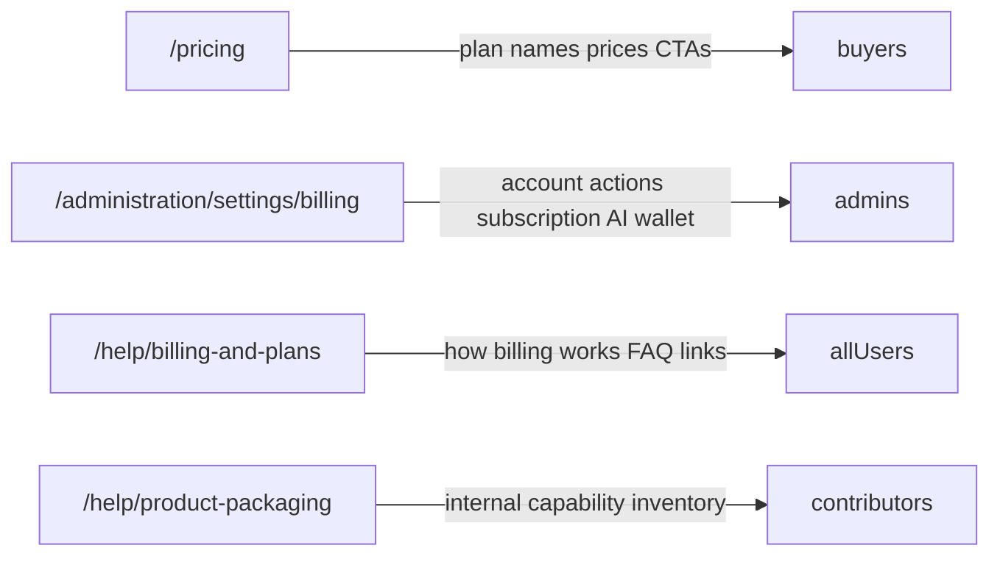

# Help `/help/billing-and-plans` redesign report

**Date:** 2026-07-12  
**Scope:** Customer help page only — no changes to `/pricing` or `/administration/settings/billing` workflows.

## Original page responsibility problems

The route `/help/billing-and-plans` was wired to render the full internal document [`docs/library/PRODUCT_PACKAGING.md`](../library/PRODUCT_PACKAGING.md) via the generic markdown help shell. That document is a **V1 capability inventory** for buyers, sales engineers, and contributors — not a billing help article. It explicitly states it is *not* a pricing or entitlement document.

Concrete mismatches:

| Problem | Evidence |
|---------|----------|
| Title/summary promised billing | Registry: "Team, Professional, and Enterprise packaging — plans, limits, and upgrade paths." |
| Body was product packaging | ~398 lines, 10 top-level `##` sections, 8 tables, engineering seam maps |
| Auto-generated TOC | ~30 headings → always-visible right-rail "On this page" |
| No billing actions | No link to `/administration/settings/billing`, no manage-billing CTA |
| No dedicated tests | Zero route-specific test coverage |
| Doc-index bug | "Product packaging" previously indexed to `/help` instead of a topic URL |

Three customer surfaces were conflated: public pricing, in-app billing, and internal packaging documentation all appeared to live on one help URL.

## Content disposition summary

| Former section / content | Disposition |
|--------------------------|-------------|
| Hosted SaaS entry URLs, 99.9% SLA | **Remove entirely** (operational/internal) |
| Why two buyer layers, narrative packaging | **Move to internal documentation** — stays in `PRODUCT_PACKAGING.md` at `/help/product-packaging` |
| Buyer vocabulary, UI progressive disclosure, role-based restriction, code seams, contributor drift guard | **Move to internal documentation** |
| Layer A / Layer B capability inventory tables (Pilot, Operate analysis/governance) | **Move to internal documentation** |
| Four boundary rules table (402/404/403, `RequiresCommercialTenantTier`) | **Remove from customer help** |
| Progressive disclosure summary table | **Move to internal documentation** |
| Packaging boundaries, future commercial enforcement, change control | **Move to internal documentation** |
| Plan names, prices, seat limits, AI credits | **Link to `/pricing`** (authoritative `pricing.json`) — **not** duplicated on help |
| Trial behavior (high level) | **Keep on help page** (no hard-coded day counts) |
| Subscription, payment method, invoices, cancellation | **Keep on help page** + link to `/administration/settings/billing` |
| Stripe checkout / portal implementation | **Move to in-app billing** — customer copy uses "Manage billing" only |
| Entitlement keys, API routes, config keys | **Remove entirely** from customer help |

`PRODUCT_PACKAGING.md` was **not deleted**. It remains available at `/help/product-packaging` (internal tier, not featured on the default help grid).

## Approximate visible content removed

| Metric | Before | After |
|--------|--------|-------|
| Top-level sections | 10 `##` | 3 `h2` |
| Tables | 8 | 0 |
| FAQ items | 0 | 8 (accordion) |
| Right-rail TOC | Always shown (~30 entries) | **Removed** |
| Estimated visible prose + tables | ~100% baseline | ~12–15% |

**Estimated reduction: ~85–88%** of previously visible content.

## Final page outline

1. **Header** — "Billing and plans" + one-line description
2. **Your workspace card** — compact context (plan, status, seats when available) + primary actions
3. **Overview** — one paragraph pointing to settings and pricing
4. **How billing works** — 5 short items (trial, subscription, seats, AI usage, changes/cancellation)
5. **Common questions** — 8 `<details>` FAQ entries
6. **Support** — billing support email + link to Billing and plans

No plan comparison matrix. No prices. No entitlement tables.

## Authoritative pricing and entitlement sources

| Concern | Authoritative source | Used on help page? |
|---------|---------------------|-------------------|
| Plan names & public prices | `docs/go-to-market/PRICING_PHILOSOPHY.md` → `archlucid-ui/public/pricing.json` | **Link only** (`/pricing`) |
| Trial status / days remaining | `GET /v1/tenant/trial-status` via `useTenantTrialStatusQuery` | **Dynamic** (days shown when API returns them) |
| Seat usage | `GET /v1/tenant/usage-status` via `fetchTenantUsageStatusCached` | **Dynamic** (omitted on fetch failure) |
| Current plan headline | `resolveOperatorBillingCurrentPlan` (trial/demo/no-paid) | **Dynamic** |
| Paid subscription tier in UI | `dbo.BillingSubscriptions` + subscription API | **Not shown** — `hasPaidPlan` is always `false` in resolver today |
| AI allowances (marketing credits) | `pricing.json` `monthlyAiCredits` | **Not shown** (display-only; not enforced) |
| AI usage (runtime) | `TenantAiBudgetPolicy` / LLM monthly budget APIs | **Not on help page** — referenced in FAQ, detailed in `/administration/settings/billing` |
| Feature entitlements | `dbo.Tenants.Tier` + `[RequiresCommercialTenantTier]` | **Not shown** on help |

## Links added

| Label | Target | When shown |
|-------|--------|------------|
| Manage billing | `/administration/settings/billing` | Workspace administrators |
| Manage billing (async) | Secure billing session via `POST /v1/tenant/billing/portal` | Administrators with `AdminAuthority` |
| View current pricing | `/pricing` | All users |
| Open Billing and plans | `/administration/settings/billing` | Non-administrators (read-only path) |
| Contact billing support | `mailto:support@archlucid.net?subject=Billing%20support` | All users |

## Role and permission behavior

| Principal | Behavior |
|-----------|----------|
| **Workspace administrator** (`AdminAuthority`, rank ≥ 3) | Sees "Manage billing" link + async "Manage billing" button; portal launch enabled |
| **Operator / Reader / Auditor** (rank < 3) | Sees permission hint; pricing link; read-only "Open Billing and plans" link; no portal button |
| **Trial user** | Context card shows "Trial" + days remaining when API provides them |
| **No paid plan** | Status shows "No active subscription" |
| **Signed-out** (JWT mode) | Help route remains reachable in architect workspace; trial/usage fetches skipped by existing client guards; context card degrades gracefully |

Billing mutation API remains gated by `AdminAuthority` on `BillingCheckoutController` — not by `Billing.Manage` custom permissions (defined but not wired to controllers).

## Stripe-related decisions

- **Customer copy:** "Manage billing", "secure billing session", "payment method", "invoices" — never "Stripe", "Checkout Session", "PaymentIntent", "webhook", or price/product IDs.
- **Implementation:** Reused existing `OperatorBillingManageBillingAction` → `startBillingPortal()` with `AsyncActionButton` pending state, duplicate-click prevention, and toast-based errors.
- **No new Stripe functionality** was added during this task.
- **Invoice access:** FAQ states invoices are available from Manage billing. This assumes the configured Stripe Billing Portal exposes invoice history — **not verified in code** (no in-app invoice list exists).

## Unsupported claims removed

The following are **not** stated on the new help page:

- Exact plan prices or tier comparison tables
- Trial length in days (doc/code drift: 30 days in GTM docs vs 14 days in bootstrap code)
- Seat or AI credit numeric limits from `pricing.json`
- Proration, refunds, tax handling, purchase orders, annual billing
- Cancellation timing guarantees
- Usage overages or automated plan transitions
- Enterprise procurement behavior beyond "contact billing support"
- V1 / V1.1 / V2 labels, entitlement keys, SKUs, API routes

## Files changed

| File | Change |
|------|--------|
| `docs/library/customer-facing/BILLING_AND_PLANS.md` | **Added** — registry/search source doc |
| `archlucid-ui/src/lib/billing-help-guide-content.ts` | **Added** — buyer-safe copy constants |
| `archlucid-ui/src/app/(operator)/help/_sections/HelpBillingCurrentPlanCard.tsx` | **Added** — context + actions card |
| `archlucid-ui/src/app/(operator)/help/_sections/HelpBillingAndPlansGuideView.tsx` | **Added** — bespoke help view |
| `archlucid-ui/src/app/(operator)/help/[...topic]/page.tsx` | Route `billing-and-plans` to new view |
| `archlucid-ui/src/lib/product-documentation-registry.ts` | Repointed billing entry; added `product-packaging` slug |
| `archlucid-ui/src/lib/product-documentation-content-kinds.ts` | Added `product-packaging` kind |
| `archlucid-ui/src/lib/in-app-doc-href.ts` | `product_packaging.md` → `/help/product-packaging` |
| `archlucid-ui/src/lib/help/help-center-catalog.ts` | `product-packaging` → internal tier |
| `archlucid-ui/src/lib/help/help-markdown-presentation.test.tsx` | Updated link rewrite expectations |
| `archlucid-ui/src/app/(operator)/help/HelpTopicBillingAndPlans.test.tsx` | **Added** — 10 test cases |
| `archlucid-ui/public/doc-index.json` | Regenerated (billing + product-packaging URLs fixed) |
| `docs/architecture/help_billing_and_plans_redesign.md` | **Added** — this report |

## Tests run

```text
npx vitest run \
  "src/app/(operator)/help/HelpTopicBillingAndPlans.test.tsx" \
  "src/lib/help/help-markdown-presentation.test.tsx"
```

## Test results

| Suite | Result |
|-------|--------|
| `HelpTopicBillingAndPlans.test.tsx` | **10/10 passed** |
| `help-markdown-presentation.test.tsx` | **23/23 passed** |
| **Total** | **33/33 passed** |

Coverage highlights:

- Reduced structure, no TOC
- `/pricing` and `/administration/settings/billing` links
- Trial and no-paid-plan context
- Admin vs non-admin permission behavior
- Portal pending state, duplicate prevention, failure recovery
- FAQ `<details>` keyboard interaction
- Banned internal/Stripe/pricing-matrix copy regression

## Compile check

`.\scripts\ci\agent-compile-check.ps1 -Ui` was attempted but **did not complete** in this environment (`Start-Process: %1 is not a valid Win32 application`). Vitest and IDE lints passed with no diagnostics on changed files.

## Remaining billing-product gaps

| Gap | Impact | Suggested owner |
|-----|--------|-----------------|
| `hasPaidPlan` always `false` in `operator-billing-current-plan.ts` | Help and billing pages cannot show paid tier name from subscription API | Engineering — wire `GET /v1/tenant/billing/subscription` into current-plan resolver |
| No in-app invoice list | Customers rely on portal for invoice history | Product — confirm portal config or add invoice surface |
| `Billing.Read` / `Billing.Manage` not enforced on API | Only coarse `AdminAuthority` gates billing mutations | Engineering — align custom RBAC with controllers |
| Trial length doc/code drift (30 vs 14 days) | Help intentionally omits day count; other surfaces may still drift | Product + engineering — reconcile `TRIAL_AND_SIGNUP.md` vs `TrialTenantBootstrapService` |
| Marketing AI credits vs runtime USD budgets | `pricing.json` credits are display-only | Product — align buyer messaging with enforced USD caps |
| Review/package monthly overage pricing | Catalog only; no backend meter | Product — defer or implement metering before buyer promises |
| Checkout buttons on billing page lack UI Admin gate | Non-admins see enabled checkout; API returns 403 | Engineering — mirror help page gating on `OperatorBillingPlansClient` |
| Invoice availability via portal | Assumed, not code-verified | Operations — validate Stripe Billing Portal configuration |

## Surface responsibility (post-redesign)



**Marketing pricing** owns public commercial catalog.  
**In-app Billing and plans** owns account-specific state and mutations.  
**Help billing-and-plans** owns orientation and links — not a second pricing catalog.
