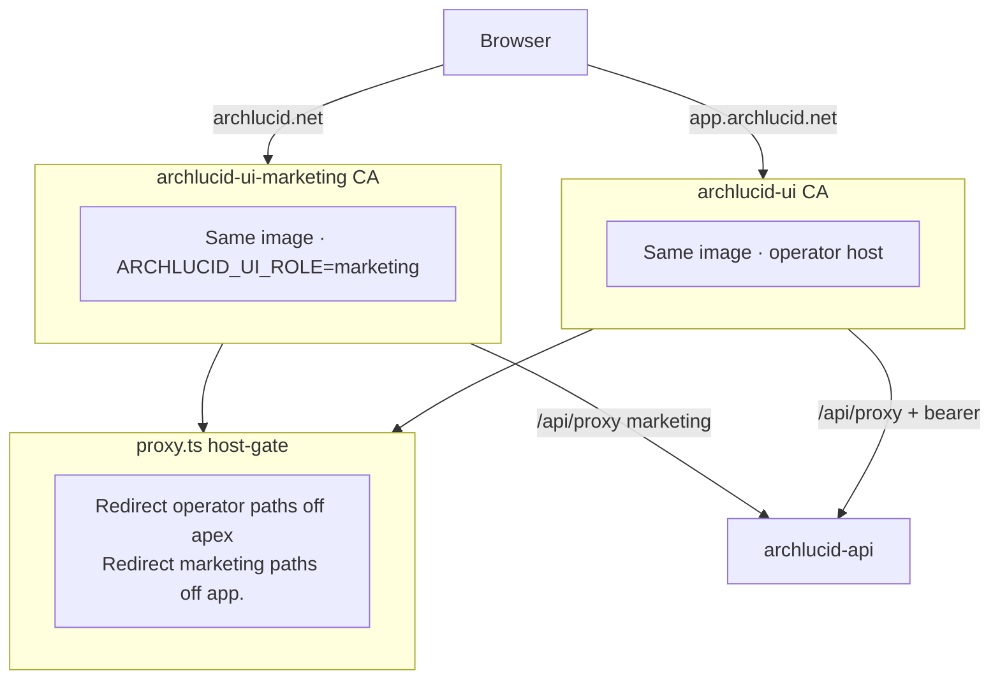
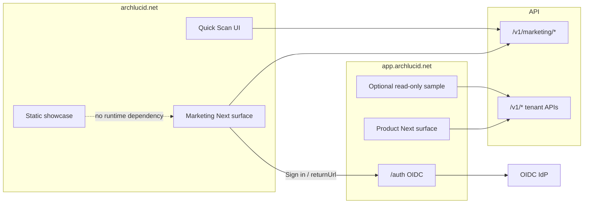

> **Scope:** Architecture decision — whether ArchLucid’s public marketing site and authenticated product UI remain one website / one deployment, and the target hostname split.  
> **Decision dates:** 2026-07-10 (initial “stay combined”); **2026-07-31** (owner override — dual Container App Option D); **2026-08-06** (re-assessment against current repo).  
> **Audience:** engineers, operators, and coding agents. Not a buyer document.  
> **Method:** Evidence-driven repository review (read-only). No code or infrastructure was changed in the 2026-08-06 pass.  
> **Related:** [`PUBLIC_MARKETING_SITE_TOPOLOGY.md`](../library/PUBLIC_MARKETING_SITE_TOPOLOGY.md) · [`MARKETING_PRODUCT_SEPARATION_ASSESSMENT.md`](../library/MARKETING_PRODUCT_SEPARATION_ASSESSMENT.md) · [`MARKETING_OPERATOR_HOST_CUTOVER.md`](../runbooks/MARKETING_OPERATOR_HOST_CUTOVER.md) · TECH_BACKLOG **TB-729–TB-731**, **TB-2016–TB-2020**, **TB-2028**, **TB-899 / TB-902**.

# Public marketing vs product application — architecture decision

## 1. Decision (authoritative)

**ArchLucid will not keep marketing and the authenticated product on a single UI Container App as the long-term design.**

**Chosen topology — Option D (owner override 2026-07-31):**

| Host | Container App | Image |
|------|---------------|-------|
| `archlucid.net` / `www` | `archlucid-ui-marketing` | `archlucid-ui` (same digest) |
| `app.archlucid.net` | `archlucid-ui` | same digest |
| API host | `archlucid-api` | unchanged |

Constraints that remain in force:

- **One Next.js codebase** (`archlucid-ui`) for now — not a second repository.
- **No new Front Door investment** for this split (custom domains on Container Apps).
- **Static-only marketing export** remains deferred (funnel / Quick Scan / ISR need Next runtime).
- **Separate repositories** are rejected at current maturity.

**Historical note:** The 2026-07-10 assessment recommended staying combined and shipping **TB-729–TB-731** (autoscaling, shell gate, re-split metrics). Those items remain **Done** and useful. The 2026-07-31 override adds **hard traffic isolation** via a second UI Container App. The 2026-08-06 re-assessment confirms Option D as the correct current target and identifies remaining gaps (cutover ops, CSP, First Load JS, import fences, Quick Scan GREEN path).

> **Doc hygiene:** The header of [`MARKETING_PRODUCT_SEPARATION_ASSESSMENT.md`](../library/MARKETING_PRODUCT_SEPARATION_ASSESSMENT.md) reflects the 2026-07-31 override. Body §§4–8 of that file still describe the pre-override “do not split” recommendation and should be treated as **historical** until rewritten. Prefer this file + [`PUBLIC_MARKETING_SITE_TOPOLOGY.md`](../library/PUBLIC_MARKETING_SITE_TOPOLOGY.md) for the live decision.

---

## 2. Why this decision

### Problems with a permanent single UI deployment

- Marketing traffic bursts and authenticated product traffic share one replica pool and one failure domain.
- A single origin forces one Content Security Policy; marketing third parties (e.g. Microsoft Clarity script host) are allowlisted on `/:path*` in `archlucid-ui/next.config.ts`.
- Enterprise buyers and procurement narratives expect a clear `app.` product boundary.
- Marketplace / billing fixtures already assume `https://app.archlucid.net/...`.

### Why Option D (dual CA, same image) instead of full app fork now

| Concern | Option D outcome |
|---------|------------------|
| Traffic isolation | Separate Container App replica pools without Front Door |
| Hostname trust boundary | Host-gate redirects wrong-host paths (`archlucid-ui/src/lib/host-gate.ts` + `src/proxy.ts`) |
| Founder / solo-team cost | One image, one CD digest, one codebase |
| Auth cookies | Unnecessary parent-domain cookies — OIDC tokens remain `sessionStorage` on the app host |
| Migration risk | Lower than splitting repositories or two Next builds immediately |

### What Option D does **not** fix (still open)

| Gap | Evidence | Severity |
|-----|----------|----------|
| Shared CSP allowlist (Clarity on all routes) | `next.config.ts` `securityHeaders` | High |
| Shared dependency graph / marketing First Load JS | `first-load-js-baseline.v1.json` — `/welcome` **736 KB**; **TB-2028** open | Medium |
| No marketing→operator import fence | `eslint.config.mjs` | Medium |
| One CD build for both CAs | `.github/workflows/cd.yml` | Medium (release coupling) |
| Production DNS / CORS / secret cutover | Runbook exists; live Azure state not in repo | High until proven |
| Quick Scan public live AI | **TB-902 YELLOW** sample-only; **TB-899** still open | Critical if enabled early |

---

## 3. Current architecture (as of 2026-08-06)

### Proven in repository

- Single Next.js App Router app: `archlucid-ui` with route groups `(marketing)`, `(operator)`, `(sponsor)`.
- Marketing UI Container App: `infra/terraform-container-apps/marketing_ui.tf` (**TB-2016** Done).
- Cross-host URL helpers: `archlucid-ui/src/lib/site-urls.ts` (**TB-2018** Done).
- Host gate: `archlucid-ui/src/lib/host-gate.ts` invoked from `archlucid-ui/src/proxy.ts` (**TB-2019** Done). No `middleware.ts`.
- CD dual roll + CORS check for `app.archlucid.net`: `.github/workflows/cd.yml` (**TB-2020** Done).
- Cutover: [`docs/runbooks/MARKETING_OPERATOR_HOST_CUTOVER.md`](../runbooks/MARKETING_OPERATOR_HOST_CUTOVER.md) + `scripts/ops/Invoke-MarketingOperatorHostCutover.ps1`.
- Auth: custom OIDC PKCE; tokens in **sessionStorage** (not HttpOnly cookies).
- Operator shell soft gate hardened (**TB-730** Done) — still client-side.
- Showcase: static-first Hybrid C on `/showcase/[runId]`.
- Quick Scan: marketing UI → `/v1/marketing/quick-scan*` via anonymous proxy paths.

### Not determined from repository alone

- Whether production (or a given staging env) has completed DNS bind, `CONTAINER_APP_MARKETING_UI_NAME`, and dual CORS allowlist.
- Whether Azure Front Door is enabled in any environment (optional; not required for Option D).

### Current-state diagram

---

## 4. Route ownership (target)

When split hosting is enabled (`ARCHLUCID_PUBLIC_SITE_URL` ≠ `ARCHLUCID_APP_SITE_URL`):

| Paths | Classification | Hostname | Indexing |
|-------|----------------|----------|----------|
| `/welcome`, `/pricing`, `/why`, `/see-it`, `/trust`, `/security-trust`, `/privacy`, `/accessibility`, `/compliance-journey`, `/get-started`, `/signup*` | Public marketing / funnel | `archlucid.net` | Sitemap where listed |
| `/showcase/[runId]` | Public showcase (Hybrid C) | `archlucid.net` | Canonical run indexed |
| `/quick-scan`, `/try`, `/live-demo`, `/faq` | Funnel / anon tools | `archlucid.net` | Mostly noindex or off-sitemap |
| `/auth/*` | Authentication | `app.archlucid.net` | Disallow |
| `/architecture/*`, `/reviews/*`, `/governance/*`, `/administration/*`, `/admin/*`, `/integrations/*`, `/internal-operations/*`, `/help/*` | Authenticated product / admin / Internal Ops / in-app help | `app.archlucid.net` | Disallow |

Canonical public homepage remains **`/welcome`**. Operator home remains **`/`** on the app host (host-gate maps marketing-host `/` → `/welcome`).

---

## 5. Showcase and Quick Scan decisions

### Showcase — Model C (Hybrid)

- **Public, precomputed (required):** `https://archlucid.net/showcase/claims-intake-modernization` — static-first, ISR, must remain usable if the product CA or sample workspace is down.
- **Optional interactive sample:** on `app.archlucid.net` under controlled anonymous / demo flags only; **noindex**.
- Marketing must not depend on live tenant APIs for the primary showcase path.

### Quick Scan

- **UI host:** marketing (`archlucid.net/quick-scan`).
- **API:** isolated anonymous `/v1/marketing/quick-scan*` only — **not** production tenant APIs.
- **Public release:** **YELLOW — sample-only** until **TB-902** prerequisites clear (**TB-899** telemetry still open; CAPTCHA **TB-897** Done). Do not enable live anonymous AI for public promotion without a GREEN gate.

---

## 6. Authentication and cookies

| Topic | Decision |
|-------|----------|
| Sign-in / callback | `app.archlucid.net/auth/*` |
| Token storage | Browser `sessionStorage` on the **app** origin |
| Cookie domain | **Host-only** — do **not** use `.archlucid.net` auth cookies |
| Marketing “Sign in” | Absolute link via `site-urls.ts` + safe `returnUrl` |
| OIDC redirect URIs | Register / dual-register `https://app.archlucid.net/auth/callback` during cutover |
| API CORS | Must allow both marketing and app origins |

---

## 7. Options compared (2026-08-06)

Weights: Security 14%, Reliability 12%, Public self-service 12%, Regulated enterprise 12%, Release independence 10%, Marketing performance 8%, Maintainability 8%, App performance 6%, Developer productivity 6%, Ops simplicity 4%, Migration safety 4%, Cost 2%, Controlled beta 2%.

| Option | Weighted | Role |
|--------|----------|------|
| 1 — Single CA, combined host | 52 | Legacy / tiny pilot only |
| 2 — Logical separation only (one CA) | 64 | Insufficient alone |
| **D — Dual CA, same image** | **78** | **Current owner target — finish cutover** |
| **3 — Dual CA + separate Next builds** | **84** | Next step after Option D is stable |
| 4 — Separate repositories | 62 | Rejected for now |

---

## 8. Target end-state (beyond Option D)

When Option D is stable in production and public self-service pressure warrants it:

1. Split **build artifacts** (`apps/marketing` + `apps/web-app` or equivalent) in the **same monorepo**.
2. Independent CSP (no Clarity / marketing tags on the app image).
3. Import fences so marketing cannot pull operator shell / tenant / admin modules.
4. Independent release cadence and rollback for marketing vs product **when** coordination cost is justified.

**Defer:** `docs.archlucid.net`, `status.archlucid.net`, and separate git repositories.

### Target diagram

---

## 9. Explicit answers (decision checklist)

1. **Continue one UI deployment forever?** — **No.** Dual CA (Option D) is the target; finish cutover.
2. **Acceptable for controlled beta?** — **Yes**, with Quick Scan sample-only. Prefer dual-CA live; single-CA remains tolerable for private beta only.
3. **Acceptable for public self-service?** — **Option D yes for traffic isolation.** Not sufficient alone for CSP / bundle / release independence — plan Option 3.
4. **Canonical domains `archlucid.net` + `app.archlucid.net`?** — **Yes.**
5. **Remain one monorepo?** — **Yes.**
6. **Independent deployment pipelines?** — **Partial now** (two CAs, one image). Full independent builds later.
7. **Auth cookies restricted to `app.`?** — **Yes** for any cookies; keep tokens on app-origin `sessionStorage`; never `.archlucid.net` auth cookies.
8. **Marketing access to production tenant APIs?** — **No.**
9. **Where does Quick Scan run?** — Marketing host + isolated `/v1/marketing/*` (sample-only until GREEN).
10. **Where does Claims Intake Modernization showcase run?** — `archlucid.net/showcase/claims-intake-modernization`.
11. **Showcase model?** — **Hybrid C** (static marketing base + optional app sample).
12. **What moves first?** — Prove cutover → host-aware CSP + **TB-2028** + import fence → then separate builds.
13. **Release blockers?** — Live anonymous Quick Scan AI; claiming dual-host without cutover; expanding marketing third-party scripts on the shared CSP.
14. **Lowest-risk migration path?** — Complete Option D cutover (same image) → harden → Option 3 builds later.
15. **What should not change yet?** — Separate repositories; `docs.` / `status.` hosts; parent-domain auth cookies; enabling live public Quick Scan AI; rewriting product IA solely for the split.

---

## 10. Release gates

### Controlled beta

- Quick Scan remains **sample-only** (TB-902 YELLOW).
- If split env is on: host-gate verified for apex vs `app.`.
- No new marketing third-party scripts until CSP is host-aware.
- Operator shell not painted for unsigned JWT sessions (TB-730).

### Before LinkedIn / public promotion

- Dual-host cutover **proven** in the promoted environment (DNS, CORS, OIDC redirect, CD secret).
- Host-aware CSP (no Clarity script host required on app responses).
- **TB-2028** (or equivalent) improves `/welcome` First Load JS.
- Showcase static path proven independent of product CA outage.
- Cross-host sign-in / `returnUrl` / showcase e2e green.

### Before public self-service

- Option D stable in production.
- Plan or ship separate Next builds (Option 3) if marketing release risk remains coupled.
- TB-902 **GREEN** only if live anonymous AI is intentionally enabled.

---

## 11. Prioritized follow-up backlog

| ID | Title | Priority | Timing | Status (2026-08-06) |
|----|-------|----------|--------|---------------------|
| SEP-20 | Prove dual-host cutover (DNS / CORS / `CONTAINER_APP_MARKETING_UI_NAME`) | P0 | Now | **Ops remaining** — runbook verify checklist expanded |
| SEP-21 | Rewrite stale §§4–8 in `MARKETING_PRODUCT_SEPARATION_ASSESSMENT.md` to match Option D | P0 | Now | **Done** (doc rewritten) |
| SEP-22 | Host-aware CSP (no Clarity on app host) | P0 | Before public promo | **Done** in code — `content-security-policy*.ts` + `proxy.ts`; prove on live hosts |
| SEP-23 | **TB-2028** — shed operator chunks from `/welcome` | P0 | Before public promo | Open |
| SEP-24 | Marketing→operator import fence (eslint / depcruise) | P1 | Before promo / Option 3 | **Done** — eslint `no-restricted-imports` on `(marketing)` |
| SEP-25 | Keep Quick Scan sample-only; close **TB-899** before any GREEN path | P0 | Blocker for live AI | Policy unchanged (YELLOW) |
| SEP-26 | Cross-host e2e (sign-in, returnUrl, showcase) | P0 | With cutover | Partial — Vitest CSP/host-gate; live e2e with cutover |
| SEP-27 | Separate marketing / app Next builds (Option 3) | P2 | After Option D stable | Not started |
| SEP-28 | Independent marketing release cadence | P2 | After Option 3 | Not started |
| SEP-29 | `docs.` / `status.` hosts | P3 | Optional later | Deferred |

Engineering tracking for the dual-CA implementation: **TB-2016–TB-2020** (Done). Performance follow-up: **TB-2028** (open).

---

## 12. Security, scalability, reliability, cost

| Pillar | Assessment |
|--------|------------|
| **Security** | Hostname split reduces marketing XSS → token theft after cutover. Request-time CSP omits Clarity on the app host (`proxy.ts`); shared image/deps remain until Option 3. Tenant isolation remains an API concern, not a marketing-host concern. |
| **Scalability** | Separate CA replica pools isolate marketing bursts from operator capacity (primary motive for Option D). |
| **Reliability** | Marketing deploy/revision pressure no longer shares the operator CA pool. Same digest still couples *release* risk until builds split. |
| **Cost** | Second Container App baseline cost; **no** Front Door required. Acceptable vs WAF/CDN dual-origin complexity under current owner constraint. |

---

## 13. Evidence appendix (key paths)

| Artifact | Path |
|----------|------|
| Topology (Option D) | `docs/library/PUBLIC_MARKETING_SITE_TOPOLOGY.md` |
| Separation assessment (header authoritative) | `docs/library/MARKETING_PRODUCT_SEPARATION_ASSESSMENT.md` |
| Cutover runbook | `docs/runbooks/MARKETING_OPERATOR_HOST_CUTOVER.md` |
| Marketing CA Terraform | `infra/terraform-container-apps/marketing_ui.tf` |
| Host gate | `archlucid-ui/src/lib/host-gate.ts`, `archlucid-ui/src/proxy.ts` |
| Site URLs | `archlucid-ui/src/lib/site-urls.ts` |
| CSP | `archlucid-ui/src/lib/content-security-policy.ts`, `content-security-policy-builders.ts`, `src/proxy.ts`, baseline in `next.config.ts` |
| SEO paths | `archlucid-ui/src/lib/marketing/public-marketing-seo-paths.ts` |
| First Load baseline | `archlucid-ui/performance/first-load-js-baseline.v1.json` |
| CD dual UI | `.github/workflows/cd.yml` |

---

## 14. Change log

| Date | Change |
|------|--------|
| 2026-07-10 | Initial assessment: stay combined; ship TB-729–TB-731. |
| 2026-07-31 | Owner override: Option D dual CA, same image, no Front Door (TB-2016–TB-2020). |
| 2026-08-06 | Re-assessment documented as this decision record; Option D affirmed; residual gaps and final checklist recorded. |
| 2026-08-06 | Implementation batch: assessment rewrite (SEP-21); request-time marketing/app CSP (SEP-22); marketing eslint import fence (SEP-24); cutover verify checklist. |
