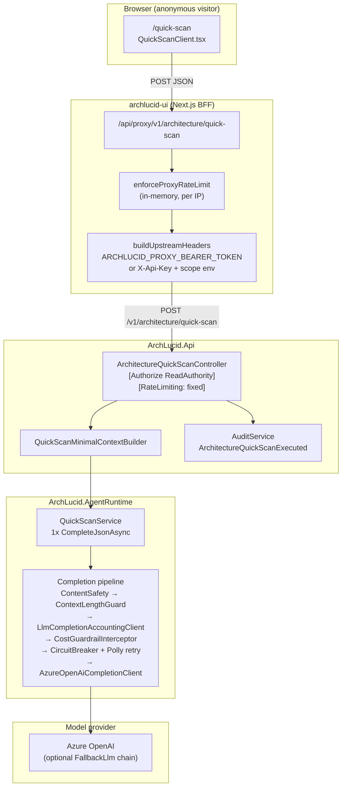
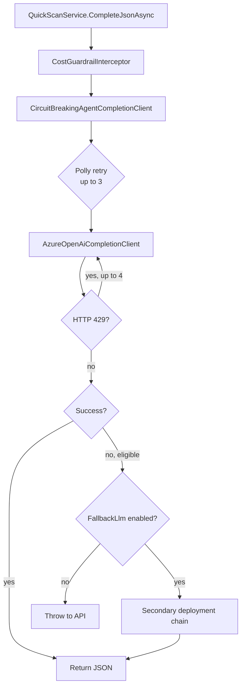

# Quick Scan — Budget & Abuse Safety Assessment

**Date:** 2026-07-19  
**Scope:** Public marketing route `/quick-scan` and backend path `POST /v1/architecture/quick-scan`  
**Method:** Read-only code, configuration, and test inspection (no production changes)  
**Assessor:** Coding agent (repository trace)

---

## Sponsor summary

Quick Scan is marketed as a **no-sign-in** experience, but it is **not a true anonymous public API**. The browser calls the Next.js BFF (`/api/proxy/...`), which attaches a **server-held bearer token or API key** and fixed tenant scope headers, then calls an API endpoint gated by **`ReadAuthority`** (authenticated principal required). Every visitor therefore shares **one service identity and one tenant budget bucket**, not per-visitor isolation.

The LLM path is intentionally simple (**one completion call**, no agent run lifecycle), but it rides the **full production agent completion stack** (content safety, context guard, accounting, tenant quotas, optional fallback deployments, Polly retries, Azure 429 retries). **Per-request `maxTokens` is explicitly `null`**, so output size follows **`AzureOpenAI:MaxCompletionTokens`** (default **4096**). Input size is bounded only by proxy body limit (**1 MB**) and context-window truncation—not by Quick Scan–specific field caps.

**Tenant-level** token and USD budgets exist and can block abuse *for that tenant*, but there is **no proven global hourly or daily spend ceiling** across all anonymous Quick Scan traffic. `AiUsageControls:PublicDemoDailyAiLimitUsd` is defined in configuration but **not referenced in enforcement code**. Proxy rate limiting is **in-process per UI instance** and **per IP**, which is bypassed if callers hit the API directly with the leaked proxy bearer.

**Conclusion: SAFE TO EXPOSE PUBLICLY: NO**

### Remediation tracking (added 2026-07-19)

| Artifact | Location |
|----------|----------|
| Rewritten implementation prompts | [`quick_scan_public_safety_prompts.md`](quick_scan_public_safety_prompts.md) |
| Tech backlog | **TB-892**–**TB-902** in [`docs/library/TECH_BACKLOG.md`](../library/TECH_BACKLOG.md) |
| GTM | **M-109** (sample copy), **M-110** (owner go/no-go), **G-QA-05** (release checklist) |

| TB | Control area | Config shipped? | Enforcement shipped? |
|----|--------------|-----------------|----------------------|
| TB-892 | `QuickScanSafetyOptions` | **Done** (2026-07-20) | N/A (config gate) |
| TB-893 | Pricing + pre-exec estimate | **Done** (2026-07-20) | **Done** |
| TB-894 | Global hourly/daily USD reservation | **Done** (2026-07-20) | **Done** |
| TB-895 | Anonymous endpoint + per-request bounds | **Done** (2026-07-20) | **Done** |
| TB-896 | Distributed concurrency + queue | **Done** (2026-07-20) | **Done** |
| TB-897 | Identity rate limits / CAPTCHA progression | **Done** (2026-08-03) — distributed counters + content-hash duplicate/burst + progressive CAPTCHA/sign-in codes; **abuse controls ≠ spend ceiling** (TB-894 remains authoritative for money) | **Done** |
| TB-898 | Emergency kill switch | **Done** (2026-07-20) | **Done** |
| TB-899 | Telemetry / dashboards / alerts | Not yet | **Not yet** |
| TB-900 | Sample fallback UX | **Done** (2026-07-21) | **Done** |
| TB-901 | Adversarial suite | N/A | **Done** (2026-07-21) |
| TB-902 | Public release gate (GREEN/YELLOW/RED) | N/A | **Done** (2026-07-21) — **YELLOW** sample-only |

**TB-902 gate (2026-07-21):** **YELLOW — SAMPLE-ONLY PUBLIC RELEASE.** Engineering controls TB-892–TB-901 are proven in code/tests; production keeps `AnonymousExecutionEnabled: false` with `SampleFallbackEnabled: true`. Full gate artifact: `.local/owner/quick_scan_public_release_gate.md`. Do not enable anonymous AI until TB-899, TB-897, and owner M-110 ratification.

---

## Current architecture diagram

---

## End-to-end request flow

| Step | Component | Behavior |
|------|-----------|----------|
| 1 | `QuickScanClient.tsx` | Client validates non-empty `systemName`, `cloudProvider`, `description`. Sets `submitting` to disable button. **No retry**, **no polling**, **no idempotency key**. |
| 2 | `fetch("/api/proxy/v1/architecture/quick-scan")` | `credentials: "include"`, `cache: "no-store"`. Single attempt; errors surface as generic message. |
| 3 | `proxy/[...path]/route.ts` | `enforceProxyRateLimit` → `forward` → upstream fetch with **60s** timeout (`PROXY_UPSTREAM_FETCH_TIMEOUT_MS`). Body capped at **1 MB** (`PROXY_MAX_BODY_BYTES`). |
| 4 | Upstream auth | Browser `Authorization` if present; else `ARCHLUCID_PROXY_BEARER_TOKEN`; else `X-Api-Key` from server env. Scope from `ARCHLUCID_PROXY_*` tenant/workspace/project (production-like posture ignores client scope headers). |
| 5 | `ArchitectureQuickScanController` | Requires authenticated user + `ReadAuthority`. Trims fields; rejects empty. **No max length** on description. **No `[AllowAnonymous]`**. |
| 6 | `QuickScanMinimalContextBuilder` | Builds one synthetic file `quick-scan-context.txt`. |
| 7 | `QuickScanService` | Serializes files to JSON user prompt; **one** `CompleteJsonAsync` with `maxTokens: null`. Parses JSON findings; generates new `FindingId` per item. |
| 8 | `ArchitectureQuickScanResponseMapper` | Caps HTTP response to **5** findings (severity order). |
| 9 | Audit | Logs metadata only (`descriptionLength`, not full description text). Returns `scanId` (GUID) to client. |

**Generated identifiers:** `scanId` = new GUID in `QuickScanResult`; correlation via `HttpContext.TraceIdentifier` / proxy `X-Correlation-ID`.

---

## Current model and pricing path

| Aspect | Finding |
|--------|---------|
| Model selection | Uses default scoped `IAgentCompletionClient` → primary `AzureOpenAI:DeploymentName` (not Quick Scan–specific tier). |
| Fallback models | If `ArchLucid:FallbackLlm:Enabled`, `FallbackAgentCompletionClient` tries secondary deployments on 429/5xx (each attempt is a billable completion if it succeeds). Default `appsettings.json`: **disabled**. |
| Calls per scan | **1** on success path. Optional **+1** if `AgentExecution:EvidenceSummarization:Enabled` and context exceeds threshold (default **disabled**). |
| Agent / critique loops | **None** for Quick Scan. |
| Tool calls / retrieval | **None**. |
| Streaming | **Not used** (`CompleteJsonAsync` only). |
| Background jobs | **None**; synchronous request/response. |
| Token metering | `LlmCompletionAccountingClient` records prompt/completion tokens when Azure returns usage. |
| Pre-call cost estimate | Monthly/daily trackers reserve using **assumed** per-request caps (`AssumedMaxTotalTokensPerRequest` = 65,536 daily; monthly USD assumptions 32,768 prompt + 8,192 completion). |
| Post-call cost | `ILlmCostEstimator` default rates: **$0.50 / 1M input**, **$1.50 / 1M output** (`AgentExecution:LlmCostEstimation`). Recorded via `AiBudgetPreCallGuard.RecordCompletionAsync`. |
| Configurable pricing | Yes — `LlmCostEstimationOptions` and per-deployment overrides. |
| Feature attribution | **Misclassified:** `AmbientAiUsageFeatureScope.Current` defaults to **`ReviewAnalysis`** (no Quick Scan feature); controller does not set scope. |
| Admin spend visibility | Tenant AI usage events and LLM budget status endpoints exist for operators; **not per anonymous visitor**. |

---

## Maximum plausible cost per request

**Assumptions (production-like Azure path, success on first attempt):**

- Input: up to ~**115,200** estimated tokens after context guard (`128,000 × 0.90` threshold; user prompt truncated/summarized if larger). Worst case near **1 MB** description in JSON (~250k+ chars) is truncated toward this ceiling—not rejected.
- Output: **`maxTokens: null`** → `AzureOpenAI:MaxCompletionTokens` or default **4096**.
- Default estimator rates: $0.50/M input, $1.50/M output.

**Approximate upper bound (single successful completion):**

| Component | Tokens (order of magnitude) | USD (est.) |
|-----------|----------------------------|------------|
| Input | ≤ 115,200 | ≤ ~$0.058 |
| Output | ≤ 4,096 | ≤ ~$0.006 |
| **Total** | ≤ ~119,000 | **≤ ~$0.065** |

**Multipliers (failure / retry paths — not additive on every happy path):**

- Polly LLM retry: default **3** attempts (`AzureOpenAI:MaxRetries` / `AgentExecution:Resilience`).
- Azure 429 loop: up to **4** attempts per Polly attempt (`AzureOpenAiTooManyRequestsRetry.MaxConsecutiveTooManyRequestsAttempts`).
- Fallback LLM: **+1 chain per fallback client** on eligible errors when enabled.
- `CostGuardrailInterceptor`: **`MaxCostPerRun` / `MaxTokensPerRun` default null** → no per-scan cap unless configured.

**Worst-case stacked failures:** In pathological retry+fallback scenarios, **multiple completions** could be charged before success or terminal error (High risk under provider instability, not under normal success).

---

## Maximum plausible cost per hour (under current controls)

Controls are **not aligned to a single bottleneck**; the **first binding limit wins** (varies by deployment).

| Control | Default / production-like | Effective Quick Scan ceiling (shared tenant) |
|---------|---------------------------|-----------------------------------------------|
| UI proxy rate limit | **120 req/min/IP** (in-process) | 120 × 60 = **7,200 req/hour/IP** (multi-instance: per replica; direct API bypasses) |
| API `fixed` rate limit | **100 req/min** × role multiplier | Authenticated proxy user typically **`reader` × 1** → **6,000 req/hour/tenant partition** |
| `LlmTokenQuota` (60 min window) | 2M prompt + 500k completion / tenant (Production) | Theoretical **~17–30+** max-size scans/hour before quota (reservation uses 32,768 + 8,192 assumed per call) |
| `LlmDailyTenantBudget` | 2M tokens / UTC day (Production, enabled) | ~**30** max-assumption scans/day (`2,000,000 / 65,536`) |
| `LlmMonthlyTenantDollarBudget` | $75 hard cutoff / month (SaaS overlay) | ~**1,150** scans/month at $0.065 — **not hourly** |
| `AiUsageControls` Public Demo tenant | $5/month if `DemoMode` + slug in `PublicDemoTenantSlugs` | ~**77** scans/month at $0.065 |
| **Global hourly USD cap** | — | **Not proven** |

**If only API rate limit bound (budgets disabled or already exhausted elsewhere):**  
6,000 × $0.065 ≈ **$390/hour** theoretical LLM spend — **Critical** gap.

**If Public Demo $5/month hard stop bound:** ≈ **$5 total per month**, not per hour — protects treasury but allows burst until monthly ledger catches up (reservation uses assumed cost per call).

---

## Maximum plausible cost per day (under current controls)

| Binding scenario | Approx. daily LLM spend ceiling |
|------------------|--------------------------------|
| Daily token budget (enabled, 2M tokens) | ~30 max-assumption scans × ~$0.065 ≈ **$2/day** (token-derived, not USD-native) |
| Public demo monthly $5 | **$5/month** total AI budget for workspace kind — **no proven daily USD enforcement** (`PublicDemoDailyAiLimitUsd` unused in code) |
| Paid tenant monthly $75 | **$75/month** shared across **all** proxy-authenticated marketing AI |
| No tenant budgets (misconfiguration) | Up to proxy+API rate limits × $0.065 ≈ **$9,300/day** at 6k/hour×24 (theoretical) |

**Hard global daily spend ceiling: NOT PROVEN.**

---

## Retry and fallback paths

| Layer | Policy | Quick Scan impact |
|-------|--------|-------------------|
| Browser | None | User can click again after failure |
| UI proxy | No retry on POST | 502 on upstream timeout (60s) |
| API controller | No retry | Exception → ProblemDetails |
| Polly (`CircuitBreakingAgentCompletionClient`) | Default 3 retries, exponential backoff | Retries **full completion** on transient errors |
| Azure 429 handler | Up to 4 consecutive throttle retries | Additional provider calls |
| `FallbackAgentCompletionClient` | Optional second deployment | Extra model call on primary failure |
| Idempotency | `operator-documented-safe-retry` posture | **No `Idempotency-Key` from UI**; duplicate submits = duplicate LLM calls |

---

## Existing controls that can be proven

| Control | Severity value | Evidence |
|---------|----------------|----------|
| Single LLM call per successful scan (no agent graph) | Medium | `QuickScanService.cs` — one `CompleteJsonAsync` |
| HTTP findings cap (5) | Low | `ArchitectureQuickScanResponseMapper.DefaultMaxFindings = 5` |
| UI submit debounce (`submitting` flag) | Low | `QuickScanClient.tsx` |
| Proxy body size limit 1 MB | Medium | `PROXY_MAX_BODY_BYTES` |
| Proxy per-IP rate limit (default 120/min) | Medium | `proxy-rate-limit.ts` (single-instance) |
| API `fixed` rate limit (default 100/min per tenant/IP) | Medium | `InfrastructureExtensions.cs`, controller attribute |
| Context length guard + truncation | Medium | `ContextLengthGuardAgentCompletionClient` |
| Prompt redaction before provider | Medium | `LlmCompletionAccountingClient` + `LlmPromptRedaction` |
| Per-tenant sliding token quota | Medium | `LlmTokenQuota` (Production enabled) |
| Per-tenant daily token budget | Medium | `LlmDailyTenantBudget` (Production enabled) |
| Per-tenant monthly USD budget | Medium | `LlmMonthlyTenantDollarBudget` (SaaS enabled) |
| Trial/demo hard stop via `AiBudgetPreCallGuard` | Medium | `TenantAiBudgetPolicyResolver` + `BlocksAdditionalLlmExecution` |
| Public demo demo-prompt cache (repeat identical prompts) | Medium | `AiBudgetPreCallGuard` + `DemoAiPromptCache` when `DemoMode` |
| Audit event without full description body | Medium | `ArchitectureQuickScanController` audit `descriptionLength` only |
| LLM quota → HTTP 429 mapping | Medium | `ApplicationProblemMapper` for `LlmTokenQuotaExceededException` |
| Simulator/fake mode (no provider cost) | Medium | `AgentExecution:Mode: Simulator` + `FakeQuickScanCompletionJson` |
| Azure OpenAI default max output 4096 | Medium | `AzureOpenAiOptions.DefaultMaxCompletionTokens` |
| Content safety wrapper (when enabled) | Medium | `ContentSafetyEnforcingAgentCompletionClient` (default off in base `appsettings.json`) |

---

## Missing controls

| Missing control | Severity |
|-----------------|----------|
| **Global hourly / daily USD spend ceiling** for anonymous Quick Scan aggregate | **Critical** |
| Dedicated **`[AllowAnonymous]`** endpoint with visitor-scoped budget (cf. `MarketingPricingQuoteRequestController`) | **Critical** |
| Per-visitor / per-session cost isolation (all visitors share proxy tenant + bearer identity) | **Critical** |
| Quick Scan–specific **`maxTokens`** and input field max lengths | **High** |
| Dedicated `AiUsageFeature.QuickScan` with enforced daily USD cap | **High** |
| Enforcement of `PublicDemoDailyAiLimitUsd` (config exists, **zero code references**) | **High** |
| Enforcement of `PublicDemoFeatureDailyLimitUsd` **>$0** (only blocks features with cap **≤ 0**) | **High** |
| `EnableRateLimiting("expensive")` on LLM marketing endpoints (Quick Scan uses weaker `fixed`) | **High** |
| CAPTCHA / bot challenge on Quick Scan (Turnstile exists only on sign-in OTP path) | **High** |
| Distributed rate limiting (Redis) for proxy and API | **High** |
| Duplicate-content / idempotency for identical scan payloads | **Medium** |
| Per-IP API rate limit when authenticated via shared service principal (partitions by `tenant_id`, not visitor IP) | **High** |
| Emergency global AI kill switch specific to public marketing | **Medium** (tenant hard stop exists; not global) |
| Persistence policy for prompts/responses (demo cache may retain completions when `DemoMode`) | **Medium** |
| Concurrency limit / queue for anonymous LLM | **Medium** |
| Pre-execution cost preview or refusal for oversized prompts | **Medium** |
| `CostGuardrailInterceptor` per-scan `MaxCostPerRun` for Quick Scan | **High** |

---

## High-risk findings

1. **Shared service identity (High):** All anonymous visitors authenticate to the API as the same proxy bearer / API key principal. API rate limits partition on **`tenant_id` claim**, not visitor IP — coordinated traffic presents as one client.

2. **Bearer secret exposure (High):** `ARCHLUCID_PROXY_BEARER_TOKEN` on the UI host is effectively a **shared API credential**. Leak or direct API access bypasses UI per-IP limits.

3. **No global spend ceiling (Critical):** Tenant budgets cap **one** tenant; misconfigured tenant (Paid, large monthly cap) or disabled budgets allows rate-limit-bound spend up to **hundreds of USD/hour** theoretically.

4. **`PublicDemoDailyAiLimitUsd` dead config (High):** Operators may believe a $2/day cap exists; it is **not enforced**.

5. **Unbounded description size at API (High):** Only proxy 1 MB limit; no `[MaxLength]` on `ArchitectureQuickScanRequest` fields.

6. **`maxTokens: null` (High):** Full deployment output budget (4096+ tokens) on every scan.

7. **Feature scope default `ReviewAnalysis` (Medium):** Misleading cost attribution and wrong feature gate semantics for budgeting analytics.

8. **Multi-layer retries (High):** Polly + Azure 429 + optional fallback can multiply provider calls during incidents.

9. **In-process proxy rate limit (High):** Horizontally scaled UI → limit × replica count; uneven protection.

10. **Not on `expensive` rate policy (High):** Quick Scan allows 100/min `fixed` vs 20/min `expensive` used by `QuickStartController` and run execution.

---

## Critical findings

| ID | Finding | Why critical |
|----|---------|--------------|
| C-1 | **No proven global hourly or daily spend ceiling** for anonymous Quick Scan aggregate | Unbounded org-wide exposure if tenant budgets misconfigured or shared tenant is Paid |
| C-2 | **Pseudo-anonymous architecture** — public UI, privileged backend credential | Single compromised secret → unbounded calls subject only to tenant limits |
| C-3 | **Endpoint requires `ReadAuthority`, not `AllowAnonymous`** with scoped public budget | Security and cost models are coupled to a long-lived service account, not visitor-scoped controls |
| C-4 | **Theoretical $390+/hour** LLM spend under rate limits alone (6k req × $0.065) when USD budgets do not bind | Meets “unexpectedly large spend” bar |

---

## Recommended implementation sequence

1. **Stop-ship / gate (P0):** Add **global** `PublicQuickScan` hourly + daily USD hard caps (config + distributed counter in Redis/SQL) checked **before** LLM call; fail closed with 429/503.
2. **P0:** Introduce `POST /v1/marketing/quick-scan` (or similar) with `[AllowAnonymous]`, dedicated **`AiUsageFeature.QuickScan`**, strict `[MaxLength]`, **`maxTokens`** override (e.g. 1024–2048), and **`EnableRateLimiting("registration")`**-style **per-IP** policy.
3. **P0:** Remove reliance on `ARCHLUCID_PROXY_BEARER_TOKEN` for Quick Scan; use anonymous endpoint + optional signed session cookie for rate limit key.
4. **P1:** Enforce `PublicDemoDailyAiLimitUsd` and per-feature daily USD (implement missing ledger queries).
5. **P1:** Set `CostGuardrailInterceptor` / dedicated `MaxCostPerRun` for Quick Scan (e.g. $0.05).
6. **P1:** Cloudflare Turnstile or equivalent on submit (mirror email OTP pattern).
7. **P1:** Move Quick Scan to `expensive` rate limit or new `public-llm` policy (≤5–10/min/IP).
8. **P2:** Distributed rate limiting for `/api/proxy` (Redis).
9. **P2:** Idempotency / content-hash dedupe window (5–15 min) to prevent double-submit cost.
10. **P2:** Disable demo prompt cache for non-demo tenants; redact PII in cache keys.
11. **P2:** Dashboards: global Quick Scan spend, throttle events, fallback/retry counts.

---

## Files and components that will require changes

### Frontend
- `archlucid-ui/src/app/(marketing)/quick-scan/QuickScanClient.tsx`
- `archlucid-ui/src/app/api/proxy/[...path]/route.ts` (or bypass proxy for new public route)
- `archlucid-ui/src/lib/proxy-rate-limit.ts`
- New: Turnstile integration for marketing LLM forms

### API
- `ArchLucid.Api/Controllers/Authority/ArchitectureQuickScanController.cs` (or new `Marketing/QuickScanController.cs`)
- `ArchLucid.Api/Startup/InfrastructureExtensions.cs` (new rate limit policy)
- `ArchLucid.Contracts/Architecture/ArchitectureQuickScanRequest.cs` (length constraints)

### Agent / cost
- `ArchLucid.AgentRuntime/QuickScan/QuickScanService.cs` (explicit `maxTokens`, feature scope)
- `ArchLucid.Core/AiUsage/AiUsageFeature.cs` (add `QuickScan`)
- `ArchLucid.Application/AiUsage/AiBudgetPreCallGuard.cs` (daily USD enforcement)
- `ArchLucid.Application/AiUsage/TenantAiBudgetPolicyResolver.cs` (global public cap resolver)
- New: `PublicQuickScanBudgetTracker` (global hourly/daily USD)

### Configuration
- `ArchLucid.Api/appsettings.SaaS.json` / `appsettings.Production.json`
- `archlucid-ui/.env.example` (document removal of bearer for quick scan)

### Tests
- `ArchLucid.Api.Tests/ArchitectureQuickScanIntegrationTests.cs`
- `archlucid-ui/tests/quick-scan.spec.ts`
- New: budget exhaustion, rate limit, max length, global cap integration tests

---

## Required database or cache changes

| Change | Purpose |
|--------|---------|
| **New table or Redis keys** `PublicQuickScanSpend` (hourly + daily UTC buckets, global + per-IP) | Enforce global ceilings |
| Extend `AiUsageEvent` feature enum + reporting | Accurate Quick Scan attribution |
| Optional: `QuickScanSubmissionHash` dedupe store | Duplicate content protection |
| Distributed rate limit backend (Redis) | Consistent limits across UI/API replicas |

---

## Required configuration and secrets

| Key | Notes |
|-----|-------|
| `PublicQuickScan:Enabled` | Kill switch |
| `PublicQuickScan:MaxInputCharsPerField` | e.g. 4,000–8,000 description |
| `PublicQuickScan:MaxOutputTokens` | e.g. 1024 |
| `PublicQuickScan:MaxCostPerRequestUsd` | Hard per request |
| `PublicQuickScan:GlobalDailyUsdHardCap` | Org-wide |
| `PublicQuickScan:GlobalHourlyUsdHardCap` | Org-wide |
| `PublicQuickScan:PerIpRequestsPerMinute` | e.g. 3–5 |
| `RateLimiting:PublicQuickScan:*` | API-side partition |
| Turnstile site/secret keys | Bot resistance |
| **Deprecate** reliance on `ARCHLUCID_PROXY_BEARER_TOKEN` for this route | Reduce shared-credential risk |

---

## Required tests

- [ ] Anonymous endpoint returns 401/404 when global daily cap exceeded
- [ ] Per-IP rate limit returns 429 across parallel clients
- [ ] Description > max length → 400 without LLM call (mock provider not invoked)
- [ ] `maxTokens` forwarded and honored in completion client
- [ ] Retry storm: simulated 429 does not exceed max billed calls (budget test double)
- [ ] Feature attributed as `QuickScan` in `AiUsageEvent` records
- [ ] Fallback disabled for public route (or budgeted separately)
- [ ] E2E: Quick Scan works without `ARCHLUCID_PROXY_BEARER_TOKEN`
- [ ] Load test: 1 hour sustained traffic respects **global hourly USD** cap

---

## Release-blocking findings

| Blocker | Rationale |
|---------|-----------|
| **C-1** No global hourly/daily spend ceiling | Owner acceptance criterion explicitly requires NO if not proven |
| **C-2** Shared bearer / tenant bucket for all visitors | Cannot attribute or contain per-abuser cost |
| **C-3** Missing dedicated anonymous contract | Current design contradicts “public” safety model |
| **H-5** `PublicDemoDailyAiLimitUsd` not enforced | False confidence in ops runbooks |

---

## Operational behavior

| Scenario | Current behavior |
|----------|------------------|
| LLM failure | Exception propagates; likely **500** unless mapped; UI shows raw error text |
| Provider quota exhaustion | 429 from Azure → retries; may fallback; eventual `LlmTokenQuotaExceededException` → **429** |
| Tenant budget exhaustion | `AiBudgetPreCallGuard` or monthly/daily tracker → **429** with message |
| Queue saturation | **No queue**; requests run inline |
| Model timeout | Proxy **60s** abort → **502**; Kestrel/Azure timeouts apply upstream |
| Provider outage | Circuit breaker + Polly; user sees error after retries |
| Expensive fallback | If `FallbackLlm` enabled, secondary deployment may be **more expensive** — not surfaced to visitor |
| Alerting | OTel counters (`LlmQuotaExceededTotal`, token usage); **no proven Quick Scan–specific alert** |

---

## Persistence and privacy

| Data | Stored? | Evidence |
|------|---------|----------|
| Full prompt / description | **Not in Quick Scan audit** | Audit logs `descriptionLength` only |
| Model response | **Not persisted** as review artifact | Ephemeral HTTP response |
| Provider logs | Depends on Azure/OpenAI tenant logging | Out of repo scope |
| `AiUsageEvent` rows | **Yes** — tokens, estimated USD, feature | `AiBudgetPreCallGuard.RecordCompletionAsync` |
| Demo prompt cache | **Yes when `DemoMode`** | `LlmCompletionAccountingClient` + `DemoAiPromptCache` |
| Analytics | Marketing Clarity on page (separate from scan payload) | Per `MARKETING_PRODUCT_SEPARATION_ASSESSMENT.md` |

**PII risk:** Users may paste regulated data into description; it is sent to the LLM provider and may sit in demo cache — **no DLP gate specific to Quick Scan**.

---

## Comparison: other marketing endpoints

| Endpoint | Auth | LLM | Rate limit |
|----------|------|-----|------------|
| `/v1/marketing/pricing/quote-request` | `[AllowAnonymous]` | **No** | `fixed` + honeypot |
| `/v1/architecture/quick-scan` | **`ReadAuthority`** | **Yes** | `fixed` only |

Quick Scan is the **only marketing funnel endpoint that invokes the full LLM stack** while pretending to be anonymous at the browser layer.

---

## Conclusion

### SAFE TO EXPOSE PUBLICLY: **NO**

Hard **global hourly and daily spend ceilings** cannot be proven from code, configuration, or tests. Anonymous visitors share a **privileged proxy credential and tenant budget**; tenant-level caps help but do not constitute a public-surface safety model. **`PublicDemoDailyAiLimitUsd` is not enforced.** Until a dedicated anonymous endpoint, per-visitor limits, explicit token/cost caps, and global spend kill switches exist, Quick Scan should be treated as **production LLM exposure with incomplete abuse containment**.

---

## Key file index

| Path | Role |
|------|------|
| `archlucid-ui/src/app/(marketing)/quick-scan/QuickScanClient.tsx` | Marketing UI |
| `archlucid-ui/src/app/api/proxy/[...path]/route.ts` | BFF proxy + auth |
| `archlucid-ui/src/lib/proxy-rate-limit.ts` | UI rate limit |
| `ArchLucid.Api/Controllers/Authority/ArchitectureQuickScanController.cs` | API entry |
| `ArchLucid.AgentRuntime/QuickScan/QuickScanService.cs` | LLM orchestration |
| `ArchLucid.Host.Composition/Startup/ServiceCollectionExtensions.AgentsGovernanceRetrieval.cs` | DI / completion chain |
| `ArchLucid.AgentRuntime/LlmCompletionAccountingClient.cs` | Token + budget accounting |
| `ArchLucid.Application/AiUsage/AiBudgetPreCallGuard.cs` | Pre-call budget gate |
| `ArchLucid.Application/AiUsage/TenantAiBudgetPolicyResolver.cs` | Workspace kind / monthly cap |
| `ArchLucid.Api/Startup/InfrastructureExtensions.cs` | Rate limiting policies |
| `ArchLucid.Core/Configuration/AiUsageControlsOptions.cs` | Demo/trial budget config |
| `ArchLucid.Api/appsettings.Production.json` | Production LLM quotas |
| `ArchLucid.Api/appsettings.SaaS.json` | SaaS demo + monthly USD |
