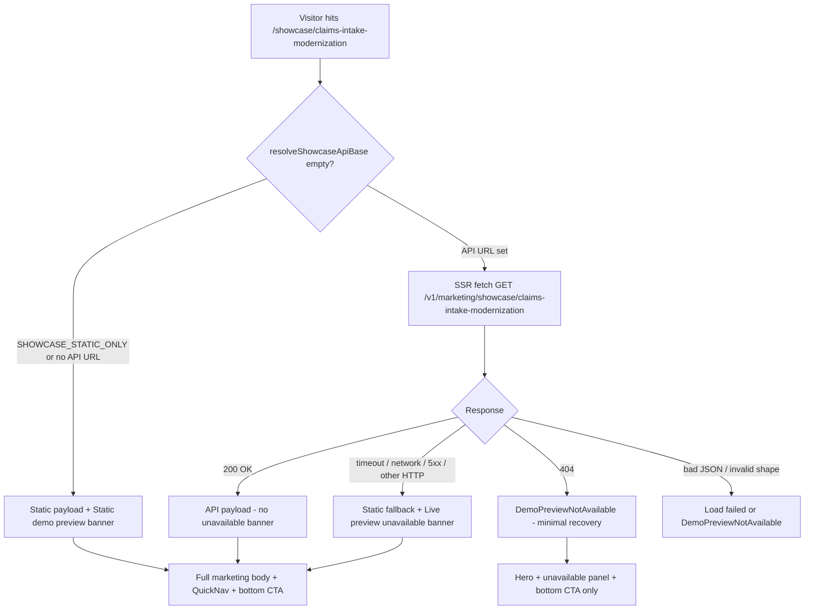

> **Scope:** Product and architecture assessment — public marketing showcase route `/showcase/claims-intake-modernization`, its live-vs-static behavior, entry points, dependencies, and conversion fitness. Audience: engineering, GTM, and platform owners. No code was modified during this pass.
>
> **Assessment date:** 2026-07-19  
> **Method:** Repository-wide evidence review (route implementation, static demo payload, marketing API controller, migrations, E2E/CI harness, GTM and exposure docs). No live production click-through was performed; unproven items are labeled explicitly.
>
> **Related:** [`ui_routes.md`](ui_routes.md) · [`DEMO_QUICKSTART.md#demo-preview-route-contract-and-safety`](../go-to-market/DEMO_QUICKSTART.md#demo-preview-route-contract-and-safety) · [`LATEST_EXPOSURE.md`](../assessments/LATEST_EXPOSURE.md) · [`LAUNCH_LOAD_DRILL.md`](LAUNCH_LOAD_DRILL.md) · [`information_architecture_assessment_and_backlog.md`](information_architecture_assessment_and_backlog.md) · [`PUBLIC_MARKETING_SITE_TOPOLOGY.md#seo-and-paid-web-acquisition`](../library/PUBLIC_MARKETING_SITE_TOPOLOGY.md#seo-and-paid-web-acquisition) (`SEO_AND_PAID_ACQUISITION.md` alias) · [`TECH_BACKLOG.md`](../library/TECH_BACKLOG.md) (**TB-887**–**TB-891**) · [`GTM_BACKLOG.md`](../go-to-market/GTM_BACKLOG.md) (**M-107**–**M-108**, **G-QA-04**)

# Showcase route assessment — Claims Intake Modernization (2026-07-19)

**Route:** `/showcase/claims-intake-modernization`  
**Static demo run id:** `claims-intake-modernization` (`SHOWCASE_STATIC_DEMO_RUN_ID`)

---

## 1. Sponsor conclusion

`/showcase/claims-intake-modernization` is a **public, SEO-indexed, read-only marketing surface** that renders a **curated static payload** (`archlucid-ui/src/lib/showcase-static-demo.ts`), not a live API-backed review. The page **can still show useful content** when the upstream marketing API is unreachable, but it surfaces an amber **“Live preview unavailable”** banner that implies failure when the static experience is often the **intended** production design.

There is a **structural slug mismatch**: the UI requests `GET /v1/marketing/showcase/claims-intake-modernization`, while the API only resolves **Contoso GUIDs** (`contoso-baseline`, `contoso-hardened`). When the API is reachable, that call returns **404**, which routes to **`DemoPreviewNotAvailable`** — **worse** than the static fallback path.

**Verdict:** The route is **not healthy as a primary “live preview” conversion surface** in API-connected deployments. It **is** viable as a **disclosed static example** if configuration and copy are aligned. The issue is primarily **architecture + configuration + UX labeling**, not missing sample data or AI budget.

| Decision | Recommendation |
|----------|----------------|
| Keep publicly linked now? | **Yes, with static-first behavior and honest copy** — not as “live preview” |
| Live preview operational? | **No** for this slug against the real API (**Proven**) |
| Remain primary example? | **Partially** — strong for healthcare SEO/paid, but **not** the documented canonical proof path |
| Target experience | **Explicit precomputed/static hybrid**; optional live path only for Contoso slugs |
| Blocks public exposure? | **High** — misleading “live” language + 404 path when API is up |

---

## 2. Intended user journey

### 2.1 Intended role (evidence-based)

| Source | What it establishes |
|--------|---------------------|
| `archlucid-ui/src/app/(marketing)/showcase/[runId]/page.tsx` | Public marketing projection; SSR fetch to marketing API or static fallback |
| `archlucid-ui/src/lib/showcase-static-demo.ts` | Curated Claims Intake payload; `isDemoData: true` |
| `docs/library/DEMO_PREVIEW.md` | Canonical anonymous proof path is **`/welcome` → `/demo/preview`** via **`GET /v1/demo/preview`** (Contoso seed) |
| `docs/architecture/ui_routes.md` | Tier 1 UI-only demo uses Claims Intake static payload; public showcase at `/showcase/claims-intake-modernization` |
| `docs/assessments/LATEST_EXPOSURE.md` | Public showcase is **static demo payload**, no per-visitor LLM |
| `docs/go-to-market/SEO_AND_PAID_ACQUISITION.md` | Paid/SEO can target `/showcase/{static_demo}` |
| `archlucid-ui/src/app/(marketing)/get-started/get-started-content.ts` | Healthcare vertical `publicSampleHref` → this route; other verticals → `/demo/preview` |

**Intended role:** combination of marketing page, read-only sample output, and bridge into architect workspace via deep links.

**Not intended:** live product workspace, per-visitor AI run, or the same backend path as `/v1/demo/preview` (Contoso).

### 2.2 User journeys

| Actor | Intended behavior |
|-------|-------------------|
| Anonymous visitor | View completed example; no sign-in on marketing page (`CUSTOMER_AUTH_PUBLIC_SAMPLE_NO_SIGN_IN`) |
| Signed-in user | Same marketing view; “Explore in workspace” may require auth |
| First-time visitor | Observe finalized output; CTAs → `/get-started`, `/signup`, `/auth/signin` |
| Conversion | Primary: **Create your own request**; secondary: guided evaluation / sign-in |

### 2.3 Persistence, AI, and availability

| Question | Answer |
|----------|--------|
| Persisted writes on this route? | **No** |
| AI execution? | **No** (static JSON; aligned with exposure assessment) |
| Continuous production availability expected? | **Yes** for conversion — **not enforced** in deployment gates |

---

## 3. Actual user journey



### 3.1 Typical production path (API URL configured)

1. Page loads hero and attempts API fetch (`ARCHLUCID_API_BASE_URL` is set in `docker-compose.yml` UI service).
2. API returns **404** (slug not recognized) → **`DemoPreviewNotAvailable`** — curated content **not shown**.
3. **Or** API unreachable → static content **with** “Live preview unavailable” banner.

### 3.2 CI / mock path

`archlucid-ui/e2e/start-e2e-with-mock.ts` sets `SHOWCASE_STATIC_ONLY=1` → static path only. Mock API returns 200 for any showcase slug, masking the production 404 behavior.

---

## 4. Exact cause of “Live preview unavailable”

| Attribute | Value |
|-----------|--------|
| **Exact UI string** | `Live preview unavailable.` + `Showing curated sample results instead — sample output generated from curated demo data.` |
| **Component** | `ShowcaseApiUnavailableBanner()` in `archlucid-ui/src/app/(marketing)/showcase/[runId]/page.tsx` |
| **Test id** | `showcase-api-unavailable-banner` |
| **Condition** | `fetchShowcasePayload` returns `http_error` or `missing` (not `404`) |
| **Execution** | **Server-side** RSC `fetch` with `MARKETING_UPSTREAM_FETCH_TIMEOUT_MS` (12s) |
| **Trigger chain** | `resolveShowcaseApiBase()` non-empty → fetch → catch or `!response.ok` (except 404) → `getShowcaseStaticDemoPayload()` + banner |

### 4.1 Related UI strings (different code paths)

| String | Path | Meaning |
|--------|------|---------|
| `Static demo preview.` | `!base` or `SHOWCASE_STATIC_ONLY` | Intentional static mode |
| `This live preview is not available on this site right now.` | `not_found` (404) | API rejected run key |
| `This showcase could not be loaded right now.` | `bad_json` | Parse failure |

### 4.2 Underlying technical causes

**For the amber “Live preview unavailable” banner:** UI server has an API base URL configured but cannot successfully complete `GET /v1/marketing/showcase/claims-intake-modernization` — timeout, connection failure, or non-404 HTTP error. Root cause is **not** surfaced to visitors.

**Separate critical defect:** When API **is** reachable, slug `claims-intake-modernization` is **not** resolved by `MarketingShowcaseController.TryResolveRunId` (only GUID, `contoso-baseline`, `contoso-hardened`, 32-char hex) → **404** → empty unavailable state, **not** static fallback.

---

## 5. Route and dependency map

```
/showcase/claims-intake-modernization (Next.js marketing layout)
├── Env: SHOWCASE_STATIC_ONLY / NEXT_PUBLIC_SHOWCASE_STATIC_ONLY → skip API
├── Env: ARCHLUCID_API_BASE_URL | NEXT_PUBLIC_DEMO_PREVIEW_API_BASE | NEXT_PUBLIC_ARCHLUCID_API_BASE_URL
├── SSR fetch → GET {base}/v1/marketing/showcase/claims-intake-modernization
│   └── ArchLucid.Api MarketingShowcaseController [AllowAnonymous, rate-limited]
│       └── PublicShowcaseCommitPageClient → demo scope SQL (IsPublicShowcase runs only)
│           └── Contoso GUIDs from migration 110 — NOT claims-intake slug
├── Fallback: getShowcaseStaticDemoPayload() (in-process TS)
├── UI: DemoPreviewMarketingBody (shared with /demo/preview)
├── QuickNav → /reviews/{runId}, /signed-records/{manifestId}, findings
└── CTAs → /get-started, /signup, /auth/signin
```

| Dependency | Required for “live” | Required for static |
|------------|---------------------|---------------------|
| Next.js UI | Yes | Yes |
| `ARCHLUCID_API_BASE_URL` | Only if not static-only | No |
| API `/v1/marketing/showcase/{runKey}` | Yes (and valid slug) | No |
| SQL + `IsPublicShowcase` Contoso rows | For live API path | No |
| `showcase-static-demo.ts` | Fallback | Primary |
| AI / model providers | No | No |
| Feature `Demo:Enabled` | No (showcase endpoint ungated) | No |

---

## 6. State matrix

| State | Renders | Message | Useful? | Tested? |
|-------|---------|---------|---------|---------|
| No API base / `SHOWCASE_STATIC_ONLY` | Full static showcase | `Static demo preview.` | Yes | E2E (mock env only) |
| API timeout / network | Full static + banner | `Live preview unavailable.` | Yes (if copy fixed) | **No** |
| API 404 (reachable, bad slug) | Hero + `DemoPreviewNotAvailable` | “not available on this site” | **No** | **No** |
| API 200 (Contoso slugs only today) | Live-shaped JSON | None | Yes | Live API test uses `contoso-baseline` |
| `NEXT_PUBLIC_DEMO_MODE=true` | Same as above | Banners suppressed | Yes | CI demo builds |
| Anonymous + QuickNav click | Operator routes | Varies by demo flags | Partial | `demo-readiness.spec.ts` (mock) |
| AI budget exhausted | No effect | — | N/A | N/A |

---

## 7. Entry-point map

| Source | Label / path | Audience | Promise vs delivery |
|--------|--------------|----------|---------------------|
| `/get-started` (Healthcare) | Industry sample link | Evaluators | Showcase — OK if static loads |
| `WelcomeBanner` (non-buyer-polished) | “See completed example” | Operators | Showcase |
| `/welcome` | “See it in 30 seconds” | Public | **`/see-it` → `/demo/preview`** (Contoso), not showcase |
| `/demo/preview` failure recovery | “View example output” | Public | Points here — may hit 404 path |
| SEO sitemap (`public-marketing-seo-paths.ts`) | Indexed | Crawlers | Claims indexable completed output |
| `SEO_AND_PAID_ACQUISITION.md` | Paid → `/showcase/…` | Paid traffic | **Live preview implied** — mismatch |
| `/try` | Frictionless trial | Public | Lands **`/reviews/claims-intake-modernization`**, not showcase |
| `CORE_PILOT.md` | “Open sample review” | Operators | **`/reviews/...`**, not showcase |
| `reviews/[runId]/error` | “View sample review” | Operators | Showcase |
| `ShareableReviewLinkButton` | Share URL | Mixed | Showcase for static demo run IDs |

**IA note:** Primary marketing funnel (`/see-it`, `/demo/preview`) uses **Contoso live API**; showcase uses **Claims Intake static** — two parallel “primary examples.”

---

## 8. Authentication findings

| Finding | Severity | Confidence |
|---------|----------|------------|
| Marketing route is public (no auth gate in marketing layout) | Informational | Proven |
| Page copy: no sign-in for sample (`customer-auth-messaging.ts`) | OK for marketing shell | Proven |
| QuickNav discloses sign-in may be required | Good | Proven |
| Deep links hit architect workspace; static fallback needs demo env flags | **High** | Strong evidence |
| `/try` uses client-only frictionless session → `/reviews/...` | Medium | Proven |

**Trap risk:** Visitor reads “no sign-in” on get-started, opens showcase (works), clicks “Review” → architect workspace without demo mode → 401/empty/error (**Likely**, **unproven** in production).

---

## 9. Sample-data findings

| Finding | Severity | Confidence |
|---------|----------|------------|
| Source is in-repo TypeScript, not DB seed | Informational | Proven |
| Hard-coded IDs: run, manifest, finding, tenant label | Informational | Proven |
| **Not** flagged `IsPublicShowcase` in SQL (migration 110 flags Contoso GUIDs only) | **Critical** (live API path) | Proven |
| Shared across all visitors; read-only | OK | Proven |
| Survives deployments (bundled) | Strong | Proven |
| Static counts may disagree with architect workspace (TB-048, BDA-083) | Medium | Strong evidence |
| No slug mapping for claims-intake in API | High | Proven |
| Mock API returns static for any showcase slug | Masks prod bug in CI | Proven |

---

## 10. Feature-flag and configuration findings

| Name | Default (typical prod) | Effect on showcase |
|------|------------------------|-------------------|
| `SHOWCASE_STATIC_ONLY` / `NEXT_PUBLIC_SHOWCASE_STATIC_ONLY` | Unset; `1` in E2E only | Forces static when set |
| `ARCHLUCID_API_BASE_URL` | Set in Docker / Container Apps | Enables API fetch → **404 for this slug** |
| `NEXT_PUBLIC_DEMO_PREVIEW_API_BASE` | Optional | Same fetch chain |
| `NEXT_PUBLIC_DEMO_MODE` | `true` in CI/demo scripts | Hides unavailable banners |
| `NEXT_PUBLIC_DEMO_STATIC_OPERATOR` | Demo deploys | Operator static fallback for deep links |
| `Demo:Enabled` | API config | Gates `/v1/demo/preview`, **not** marketing showcase |
| `NEXT_PUBLIC_MARKETING_LIVE_DEMO` | Off | `/live-demo` header only |

**Readiness model:** No single flag — loosely coupled env vars produce four different behaviors.

---

## 11. AI and cost findings

| Finding | Confidence |
|---------|------------|
| Showcase SSR does **not** invoke LLMs | **Proven** |
| No per-visitor AI cost on this route | **Proven** |
| Rate limiting on marketing API (`EnableRateLimiting("fixed")`) | **Proven** |

**Not release-blocking** for AI cost on this surface.

---

## 12. Reliability findings

| Dependency | Timeout | Fallback | Alerting |
|------------|---------|----------|----------|
| Marketing API fetch | 12s | Static + banner | None for showcase |
| Static payload | N/A | Always available | None |
| `hosted-saas-probe.yml` | 30–45s | — | **API `/health/*` only** — not showcase |

**Critical:** Reachable API + wrong slug = **worse** UX than total API failure (no static fallback on 404).

---

## 13. UX promise vs reality

| Claim / implication | Reality |
|---------------------|---------|
| “Live preview” (banner) | **Static curated data** when banner shows |
| “Reviewed architecture output” (hero) | **True** for static narrative |
| “No sign-in required” (get-started) | **True** for showcase page only |
| “Explore in workspace” | **Simulated** unless demo env / static operator |
| Same experience as `/demo/preview` | **False** — different scenario and API |

**Terminology drift:** showcase vs demo preview vs sample review vs evaluation — used interchangeably across routes.

---

## 14. Conversion findings

| Item | Assessment |
|------|------------|
| Primary CTA | “Create your own request” → `/get-started` (bottom section) |
| Preview above fold | Hero + sponsor summary — partial product value |
| 30-second value | **Yes** if static path loads; **No** on 404 path |
| Differentiators shown | Findings, manifest, governance in `DemoPreviewMarketingBody` |
| Architecture creation | **Underrepresented** — completed review only |
| Analytics | **No** dedicated showcase events |
| Missing telemetry | `showcase_viewed`, `showcase_api_fallback`, `showcase_404`, QuickNav clicks |

---

## 15. Security findings

| Finding | Severity |
|---------|----------|
| All showcase data fabricated (`isDemoData: true`) | OK |
| Public anonymous marketing endpoint | OK |
| Writable shared sample on showcase page | **No** — read-only SSR |
| QuickNav exposes architect workspace | Low if demo mode; medium without static operator |
| Cross-tenant risk on marketing fetch | Low — pinned demo scope server-side |

---

## 16. Performance findings

| Item | Notes |
|------|-------|
| SSR blocking fetch | Up to **12s** when API configured |
| ISR | `revalidate = 300` (5 minutes) |
| Critical path | API fetch should not block static showcase |
| k6 drill | `scripts/load/public-showcase-burst.js` includes this path; p95 &lt; 8s |

---

## 17. Test-coverage findings

**Covered (mock):**

- `archlucid-ui/e2e/demo-readiness.spec.ts` — heading, QuickNav deep links
- `archlucid-ui/e2e/smoke.spec.ts` — heading visible
- `archlucid-ui/e2e/live-api-marketing-showcase.spec.ts` — **`contoso-baseline` only**

**Not covered:**

- `showcase-api-unavailable-banner` / `showcase-static-demo-banner`
- API-connected production path for `claims-intake-modernization`
- 404 → `DemoPreviewNotAvailable` regression
- Anonymous QuickNav without demo flags
- Production smoke after deploy

**Minimum production smoke test:**

1. `GET /showcase/claims-intake-modernization` → 200
2. Body contains sponsor summary or outcome cards
3. Must **not** contain “not available on this site”
4. Optional: no “Live preview unavailable” unless explicitly labeled illustrative-only

---

## 18. Operational ownership

| Area | Owner today |
|------|-------------|
| Page implementation | `archlucid-ui` marketing route |
| Static payload content | `showcase-static-demo.ts` |
| Live API path | `MarketingShowcaseController` + migration 110 |
| Health checks | `hosted-saas-probe` — API only |
| Deployment gate | **Does not fail** when showcase broken |

**Can silently fail:** **Yes** — especially the 404 path.

---

## 19. Should Claims Intake remain the main example?

| Criterion | Assessment |
|-----------|------------|
| Full ArchLucid value | **Partial** — strong review/governance/evidence; weak on creation |
| Cross-industry clarity | **Weak** — healthcare/PHI/HIPAA heavy |
| Regulated-enterprise value | **Strong** |
| Realistic complexity | **Good** — may overwhelm first-time visitors |
| Azure/healthcare bias | **Present** |

**Recommendation:** Keep Claims Intake as **one** canonical static example, not the **only** primary path. Pair with `/see-it` → `/demo/preview` (Contoso) for live-shaped proof. Do not replace solely due to complexity — vertical depth is a strength for regulated ICP if labeled honestly.

---

## 20. Recommended target behavior

1. **Static-first for `claims-intake-modernization`:** Do not call the marketing API for this slug; serve `getShowcaseStaticDemoPayload()` with clear **“Illustrative sample”** disclosure.
2. **Reserve live API** for `contoso-baseline` / `contoso-hardened`, or add slug resolution in the API if a live path is required.
3. **On API failure for other slugs:** Keep static fallback; distinguish **offline illustrative mode** from **error**.
4. **Never 404-empty** when a static payload exists for the slug.
5. **Align entry points** or document two intentional funnels (showcase vs demo/preview).
6. **Production smoke + alert** on showcase body presence after every UI deploy.
7. **Telemetry:** `showcase_viewed`, `showcase_render_mode` (`static` | `api` | `failed`).

---

## 21. Prioritized remediation backlog

Canonical tracking: engineering **`docs/library/TECH_BACKLOG.md`** (**TB-887**–**TB-891**); GTM **`docs/go-to-market/GTM_BACKLOG.md`** (**M-107**–**M-108**, **G-QA-04**).

| P | ID | Finding | Recommended action | Canonical backlog | Blocks public? |
|---|-----|---------|-------------------|-------------------|----------------|
| **P0** | SC-01 | API 404 for `claims-intake-modernization` hides static content | Static-first or map slug; 404 → static fallback | **TB-887** | **Yes** |
| **P0** | SC-02 | “Live preview unavailable” mislabels intentional static | Rename to “Illustrative sample”; remove “live” | **TB-888** | **Yes** |
| **P1** | SC-03 | No production showcase smoke test | Add post-deploy check | **TB-889**, **G-QA-04** | **Yes** |
| **P1** | SC-04 | Dual primary examples (showcase vs demo/preview) | IA decision + link alignment | **M-107** | Medium |
| **P1** | SC-05 | QuickNav auth trap | Gate links or public read-only demo for sample IDs | **TB-890** | Medium |
| **P2** | SC-06 | No showcase analytics | Add render-mode events | **TB-891** | No |
| **P2** | SC-07 | Static count drift (TB-048, BDA-083) | Single source of truth or “example” labels | *(existing TB-048)* | No |
| **P2** | SC-08 | 12s SSR blocking fetch | Skip fetch for known static slugs | **TB-887** | No |
| **P3** | SC-09 | Document `SHOWCASE_STATIC_ONLY=1` in prod if static is policy | Deploy runbook | **TB-887** | No |

---

## 22. Required decisions

| Question | Answer | Confidence |
|----------|--------|------------|
| Remain publicly linked now? | **Yes**, as static illustrative sample with honest copy | Strong |
| Live preview operational? | **No** for this slug with connected API | **Proven** |
| Remain primary example? | **Co-primary** with `/see-it`/`/demo/preview` | Strong |
| Live vs static vs hybrid? | **Static primary**; live optional for Contoso only | Strong |
| Anonymous access safe? | **Yes** on marketing page; **conditional** on deep links | Strong |
| AI in critical path? | **No** | Proven |
| Sample init reliable for prod? | **Yes** (bundled static); **no** for API live path | Proven |
| Static fallback required? | **Yes** — should be primary, not failure UI | Strong |
| Route consolidation required? | **Partial** | Strong |
| Deploy fail when showcase down? | **Recommended** | Strong |
| Primary issue type | **Architecture + configuration + UX** | Proven |

---

## 23. Evidence appendix

| Topic | Location |
|-------|----------|
| Page logic + banners | `archlucid-ui/src/app/(marketing)/showcase/[runId]/page.tsx` |
| Static payload | `archlucid-ui/src/lib/showcase-static-demo.ts` |
| API slug resolution | `ArchLucid.Api/Controllers/Marketing/MarketingShowcaseController.cs` |
| `IsPublicShowcase` seed | `ArchLucid.Persistence/Migrations/110_Runs_IsPublicShowcase.sql` |
| Demo preview (Contoso live) | `docs/library/DEMO_PREVIEW.md`, `archlucid-ui/src/app/(marketing)/demo/preview/page.tsx` |
| E2E static override | `archlucid-ui/e2e/start-e2e-with-mock.ts` |
| Exposure assessment | `docs/assessments/LATEST_EXPOSURE.md` |
| Route catalog | `docs/architecture/ui_routes.md` |
| SEO / paid | `docs/go-to-market/SEO_AND_PAID_ACQUISITION.md` |
| Load test | `scripts/load/public-showcase-burst.js` |
| Hosted probe (no showcase) | `.github/workflows/hosted-saas-probe.yml` |

---

## 24. Assessment standard (health criteria)

Do **not** mark this route healthy merely because:

- The page renders a hero
- A static description appears
- The sample works locally or in mock E2E
- An employee can access it after manual setup
- It works when signed in or in only one environment
- The fallback message is technically accurate

For this showcase to be considered **healthy**, prove that:

- [ ] Anonymous production visitors reach useful content without manual intervention
- [ ] Experience matches entry-point promises
- [ ] Required sample data is present and valid (static bundle or live API)
- [ ] Failures degrade gracefully — never 404-empty when static exists
- [ ] No uncontrolled AI cost
- [ ] No private data exposure
- [ ] Primary CTA works
- [ ] Production smoke test covers the route after deploy
- [ ] Operational monitoring detects failure

**Status as of 2026-07-19:** Items above are **not all proven** for API-connected production hosts.

---

## 25. Unproven items (follow-up)

| Item | Why unproven |
|------|--------------|
| Exact banner/state on deployed production host | No live fetch during this pass |
| Anonymous QuickNav without demo flags | Environment-dependent |
| Whether production sets `SHOWCASE_STATIC_ONLY` | Not in Docker/CI env grep |

**Follow-up:** Run read-only `GET` against the public UI base URL and record render mode (`static` | `api` | `404-empty` | `unavailable-banner`).
