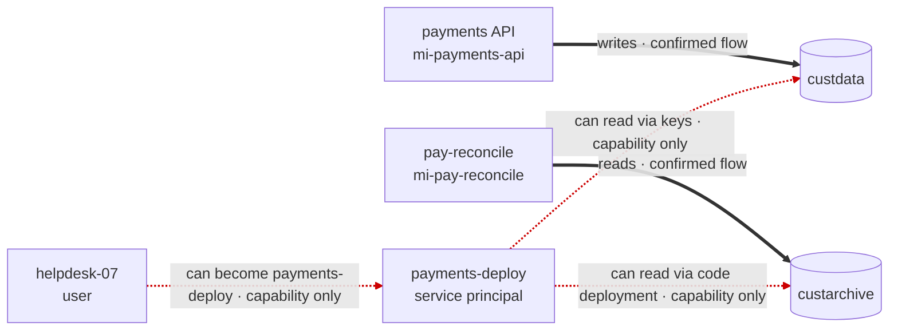

> **Scope:** Chapter 6 revised draft for the book draft *Managing Azure Security with AI*. Author working text; not product documentation, not legal advice, and not a description of any vendor's internals.
> **Status:** draft — revised (revision pass 1, 2026-10-10)

# Chapter 6 — Data flow: may access vs did access

**Spine:** [`../README.md`](../README.md) · **Outline:** [`../OUTLINE.md`](../OUTLINE.md)

> *Draft status: revised (revision pass 1, 2026-10-10). Target 6,000 words. Facts about Azure log schemas, retention, and defaults were checked against Microsoft documentation in October 2026; re-check them before submission. Nothing here is legal advice; breach and notification definitions vary by jurisdiction and contract.*

---

## Two days of incident response for a sentence

In this fictional scenario, Contoso's quarterly risk report included a line from the identity review in Chapter 4:

> A help-desk user may access the customer archive.

The chief operating officer read it on a Friday evening and called the CISO. "May access" sounded like "might have accessed". By Saturday morning, an incident had been declared, outside counsel had been engaged, and two engineers were pulling logs.

On Monday afternoon, the team reported back. The help-desk user held a directory role that *could* add credentials to the deployment identity, which *could* deploy code to a Function App, which *could* read the archive. There was no sign that anyone had done any of it. The incident was closed. The report's author had meant "can", in the permission sense. The reader had heard "might have", in the possibility sense. Both are ordinary meanings of "may".

Three months later, the opposite happened. An auditor asked whether anyone outside the payments team had read customer archive data in the past year. A different engineer checked the storage account, found no access logs showing any such reads, and answered: "No unauthorized access occurred." The auditor asked to see the logs. There weren't any. Read logging had never been enabled on `custarchive`. The answer should have been: "We can't determine that; read logging was not enabled during the period."

The first mistake turned a capability into an event. The second turned an absence of evidence into evidence of absence (Chapter 2's zero trap). Both came from not having distinct words, and distinct evidence, for three different things:

- what an identity **can** do,
- what data is **designed** to move where,
- what **actually** happened.

This chapter separates them, shows how to collect evidence for each, and gives you language that executives, auditors, and lawyers can't misread.

---

## 6.1 Capability, flow, and access

Three terms carry the chapter:

- A **capability** is something a path makes possible. "`helpdesk-07` can read `custarchive`" is a capability: Chapters 4 and 5 computed it from roles, credentials, and reachability. It says nothing about intent or history.
- A **flow** is a movement of data that a system is built to perform. "`pay-reconcile` reads `custarchive` every night to reconcile settlements" is a flow. It says what the system does in normal operation.
- An **access event** is a specific operation that happened at a specific time. "On 2026-09-14 at 02:10 UTC, `mi-pay-reconcile` read 412 blobs from `custarchive`" is an access event, taken from a log.

They answer different questions:

| Term | Question | Typical source | Typical reader |
|------|----------|----------------|----------------|
| Capability | What could happen? | Identity and network evidence (Chapters 4, 5) | Security architects, risk owners |
| Flow | What is supposed to happen? | Configuration, design, owners | Architects, data protection, auditors |
| Access event | What did happen? | Logs | Incident responders, auditors, counsel |

A complete picture of any sensitive data store has all three, and the useful findings are where they disagree. A capability with no corresponding flow is privilege nobody needs. A flow nobody declared is either undocumented design or something worse. An access event outside any declared flow is the first thing an incident responder wants to know about.

---

## 6.2 Four kinds of flow

Flows come with evidence of varying strength. Chapter 5 separated intended, configured, observed, and confirmed reachability. Flows need the same treatment:

| Kind | Meaning | Evidence category (Chapter 2) | Examples |
|------|---------|-------------------------------|----------|
| **Declared** | Configuration says the system is set up to move this data | Observed fact (of configuration) | App setting naming a storage account; data role granted to a workload identity; Data Factory linked service; diagnostic setting |
| **Probable** | Something suggests the flow exists, but configuration doesn't state it | Deterministic inference or AI inference | Naming patterns; code that references a store; a workload and a store in the same resource group with no other consumer |
| **Observed** | Logs show the data moved | Observed fact (of activity) | Storage resource logs, Key Vault audit events, SQL auditing |
| **Confirmed** | A person responsible for the system states the flow exists and is intended | Human assertion | Owner statement, data processing record, architecture decision record |

### Declared flows

Declared flows are the cheapest to collect. Most are in configuration a Reader-only collector already sees. One important source isn't:

- **App settings and connection string names.** An app setting named `ARCHIVE_ACCOUNT` with the value `custarchive`, or a connection string entry named `CustomerDb`, declares that the app talks to that store. A Key Vault reference (`@Microsoft.KeyVault(...)`) declares a flow to the vault and, by name, hints at the target. Reader can't list app settings, though. Listing them is a separate action that returns every value, secrets included, so you can't fetch the names without the secrets, and Chapter 3's rule says never collect secret values. Read them instead from the infrastructure as code that created the app, where they're reviewed, and where secrets should already be Key Vault references rather than literals. Appendix B, section B.6, covers the options.
- **Data-plane role assignments to workload identities.** When `mi-pay-reconcile` holds Storage Blob Data Reader on `custarchive`, someone granted that access for a reason. It's a capability, but for a workload identity it's also a strong declaration of design intent.
- **Integration configuration.** Data Factory and Synapse linked services, Event Grid subscriptions, Service Bus and Event Hubs consumers, Logic App connections, and diagnostic settings that send logs to a workspace or storage account all declare flows.
- **Private endpoints and firewall rules.** A private endpoint for `custdata` in the payments application subnet declares that something in that subnet is meant to reach it (Chapter 5).

A declared flow is an observed fact *about configuration*. It isn't an observation that data moved. An app setting can point at a store the code never uses. Treat declared flows as strong evidence of intent and weak evidence of activity.

### Probable flows

Probable flows fill in what configuration doesn't state. Some are deterministic inferences: "the only workload with network reach and a data role on this store is `pay-reconcile`, so if anything reads it in normal operation, that's probably what does." Others are AI inferences: a model reads a repository and reports that a function appears to write reconciliation output to the archive.

Both are useful as **questions for owners**. Neither should appear in a report as a flow without its label. Section 6.7 covers how to use models here safely.

### Observed flows

Observed flows come from logs that record data-plane operations. Section 6.4 covers what those logs can and can't tell you.

### Confirmed flows

A confirmed flow is an owner saying, on the record, "yes, this is supposed to happen". It's the flow equivalent of Chapter 5's intended reachability and Chapter 2's data classification. Record who confirmed it, when, and when the confirmation expires.

Confirmed flows are what turn "capability without flow" into a finding you can act on. If the owner of `custdata` confirms that only the payments API writes to it and only the reporting job reads it, every other capability to read it is excess, and Chapter 9's cut-point analysis can remove it with confidence.

---

## 6.3 Comparing capability with flow

The Contoso payments estate from earlier chapters has two customer data stores and several identities. In this chapter we add one component the earlier chapters didn't need: the **payments API**, an App Service app whose managed identity `mi-payments-api` holds Storage Blob Data Contributor on `custdata` and writes customer records there.

Put capability and flow side by side for each store:

| Identity | Store | Capability | Declared flow | Observed | Confirmed |
|----------|-------|-----------|---------------|----------|-----------|
| `mi-payments-api` | `custdata` | Read and write (data role) | Yes: app setting `CUSTOMER_ACCOUNT=custdata`, data role, private endpoint | Not available (logging off) | Yes, payments platform lead |
| `payments-deploy` | `custdata` | Read, via key listing (Chapter 4) | None | Not available | Not required for deployment, payments platform lead |
| `mi-pay-reconcile` | `custarchive` | Read (data role) | Yes: app setting `ARCHIVE_ACCOUNT=custarchive`, data role | Not available | Yes, payments platform lead |
| `payments-deploy` | `custarchive` | Read, via code deployment to `pay-reconcile` (Chapter 4) | None | Not available | — |
| `helpdesk-07` | both | Read, via `payments-deploy` (Chapter 4) | None | Not available | — |

Four patterns appear in tables like this, and each is a different kind of finding:

| Capability | Flow | Meaning | Action |
|-----------|------|---------|--------|
| Yes | Declared or confirmed | Expected access | Keep; make sure it's least privilege |
| Yes | None | **Excess capability**: access nobody needs | Remove, or explain with a confirmed flow |
| No | Declared | Broken or stale configuration, or a collection gap | Investigate before concluding |
| No | Observed | **Your model is wrong**, or something is using access you didn't collect | Investigate urgently |

Most of the rows in the Contoso table fall into the second pattern. Every one of the six paths from Chapter 4 ends in excess capability: none of `payments-deploy`, `dev-lead`, or `helpdesk-07` has a business reason to read customer data. That's what the flow evidence adds to the path analysis. Chapter 4 showed six ways to reach the data. This chapter shows that none of them corresponds to anything the business does, which makes them much easier to remove.

The fourth pattern deserves emphasis. An observed read by an identity your capability model says can't read the store means your model is missing an edge: a role at a scope you didn't collect, a SAS token issued long ago, a key copied somewhere. Treat it the way Chapter 5 treated observed-but-not-configured traffic: as a defect in your analysis until proven otherwise.

### Flow edges in the graph

In the path graph, flows become a new edge type, `flowsTo`, from a workload or identity to a data store, with its kind (declared, probable, observed, confirmed) and evidence. They aren't traversed by `find_paths`. They're annotations on the paths it finds:

- A path whose final `grants` edge has a matching declared or confirmed flow is **expected access**.
- A path whose final edge has no matching flow is **excess capability**, which is usually the finding.
- A path whose final edge has a matching *observed* flow from an unexpected identity is **an access event to investigate**.

---

## 6.4 What it takes to say "did access"

"Did access" is an observed fact about activity. Stating it requires evidence with four properties:

1. **Coverage.** Logging was enabled on the right resource, for the right operations, for the whole period in question.
2. **Retention.** The logs from that period still exist.
3. **Attribution.** The logs identify who performed the operation.
4. **Operation semantics.** The logged operation is actually a read of data, not a listing, a metadata request, or a failed attempt.

Missing any of these changes what you can say.

### Coverage and retention

Data-plane logs on Azure PaaS services are generally **off by default**. For storage, you enable them with a diagnostic setting per service (blob, file, queue, table) and send them to a Log Analytics workspace, a storage account, or an event hub. Key Vault audit events, SQL auditing, and Cosmos DB data-plane logs each have their own settings. For Key Vault, the diagnostic category is `AuditEvent`, which lands in the `AZKVAuditLogs` table when the setting uses resource-specific tables.

Retention is set per destination, and it's often shorter than the questions people ask. A Log Analytics workspace keeps most tables for 30 days unless someone changes it. An auditor asking about "the past year" needs a year of retained logs. A breach investigation may need longer. Record, for each sensitive store, when logging started and how long it's retained. Those two dates bound every "did access" statement you can make.
### Attribution

Storage blob logs record how each request was authenticated. That one field decides whether you can say *who* read the data:

- **Entra ID (OAuth)**: the log records the caller's object ID, and for users, a user principal name. You can attribute reads to a specific identity.
- **Account key**: the log records that the account key was used. It doesn't record who held the key. Anyone with a copy looks the same.
- **Shared access signature (SAS)**: the log records that a SAS was used. For a user delegation SAS, `AuthenticationType` is `DelegationSas` and the log carries the identity whose delegation key signed the token. That's who issued it, not necessarily who used it. For account and service SAS tokens signed with the account key, you know a token was used, not who used it.

This is the strongest argument for disabling shared key access that the book makes. Chapter 4 showed that keys turn Contributor into data access. This chapter adds that keys also **destroy attribution**. If `custdata` allows shared key access, and the logs show reads authenticated with the account key from an address you don't recognize, the honest statement is: "An unidentified holder of the account key read data from this address." You can't rule out any identity that could list the keys, which, from Chapter 4, includes everyone who can become `payments-deploy`.

Control-plane logs help partially. Listing a storage account's keys is an ARM operation, recorded in the Azure Activity Log with the caller's identity. If you find a suspicious key-authenticated read, the Activity Log can tell you who listed the keys recently. It can't tell you who they gave them to, or whether the key was copied years ago.
### Operation semantics

Not every logged operation is a data read. For blob storage:

- **GetBlob** reads blob content. This is "read data".
- **GetBlobProperties** and **GetBlobMetadata** read metadata. They reveal that a blob exists and its properties, which can itself be sensitive, but not its content.
- **ListBlobs** enumerates blob names. Names often carry meaning, such as customer IDs or dates.
- **Failed requests** (authorization failures, network rejections) are attempts, not access. They're interesting for other reasons.

When you write "read", mean `GetBlob` with a success status, or the equivalent for the service. When you mean listing, say listing.

### What you can say in each case

Put together, the evidence state decides the statement:

| Evidence state | What you can say |
|----------------|------------------|
| No logging during the period | "Whether [identity] read data in [store] between [start] and [end] can't be determined. Read logging was not enabled." |
| Logging, but retained only from a later date | "No determination is possible before [retention start]. From [retention start] to [end], ..." (then one of the rows below) |
| Logging, Entra-authenticated reads only, none by the identity | "No reads by [identity] were recorded between [start] and [end]." |
| Logging, reads by the identity | "[Identity] read [n] blobs in [container] between [start] and [end]." |
| Logging, key or SAS-authenticated reads present | "[n] reads authenticated with the account key were recorded from [addresses] between [start] and [end]. The key holder can't be identified from these logs." |

Notice what's missing from that table: "[identity] never accessed [store]." Even with perfect logging, the strongest negative statement is bounded by a time window and by what the logs record. "No reads were recorded" is a fact. "No access occurred" is a conclusion that goes beyond it.

---

## 6.5 Words that executives, auditors, and lawyers can't misread

The opening story's problem was a single word. Security writing is full of words like it:

- **"May access"** means either "is permitted to" or "possibly did". Readers pick the meaning that matches their worry.
- **"Exposed"** means either "reachable" or "disclosed". In a news headline, it means the second.
- **"Access"** as a noun ("the help desk has access") can mean a permission or an event.
- **"Compromised"** implies an attacker has control, which is almost never what a path analysis shows.

Breach notification laws, contracts, and regulations often turn on words like "access", "acquisition", and "disclosure", with definitions that vary. That's a reason to keep your security reports unambiguous, and to involve counsel before any document uses those words about a real event. This book can't tell you what triggers a notification obligation where you operate.

A controlled vocabulary solves most of the problem. Agree on it once, put it in your reporting template, and enforce it with the validator from Chapter 7:

| Use | When | Instead of |
|-----|------|------------|
| **can read**, **can write** | Capability from a path | may access, has access, is exposed to |
| **is designed to read** | Declared or confirmed flow | uses, accesses |
| **probably reads (AI-inferred)** or **probably reads (inferred from ...)** | Probable flow | reads, uses |
| **read**, **wrote** (past tense, with window) | Observed access event | accessed, was exposed, compromised |
| **can't be determined** | No usable evidence | no access, not accessed |
| **no reads were recorded** | Logs exist, nothing matched | never accessed, no access occurred |

The title of this chapter uses "may access" deliberately, because that's the phrase readers will meet in the wild. In your own reports, prefer "can read". It has only one meaning.

---

## 6.6 Diagrams with an evidence legend

Data flow diagrams are where "may" and "did" blur most easily, because a line between two boxes looks the same whatever evidence is behind it. An arrow from `helpdesk-07` to `custarchive` reads as "the help desk uses the archive" to almost everyone.

Give every line an evidence kind, and show it two ways: in the line style and in the label text. The label matters more. Line styles disappear when diagrams are printed in grayscale, described aloud, read by a screen reader, or pasted into a model. Labels survive.

This book uses **Mermaid**, a text format for diagrams. It renders in many documentation tools, it diffs cleanly in source control, and it can be generated from your path data deterministically. A legend that works within Mermaid's line styles:

| Line | Meaning |
|------|---------|
| Solid (`-->`) | Observed access |
| Thick (`==>`) | Confirmed flow |
| Dotted (`-.->`) | Declared or probable flow, with the kind in the label |
| Dotted, highlighted | Capability only: no declared, observed, or confirmed flow |

The payments estate, drawn that way:



No line in that diagram is solid, because no access has been observed: logging is off. That's the honest picture, and it's also the most useful one for a decision. It shows two intended flows and three capability-only lines that nobody needs.

Generate diagrams like this from the path graph and flow records, never by hand and never by a model. A diagram is a claim. If a person or a model draws it, it's a claim nobody can trace back to evidence.

> **As of 2026-10:** `linkStyle` indices count links from zero in the order they're declared, so adding a line shifts every style after it. Rendering depends on the Mermaid version your documentation tool bundles. Check the output after upgrading either.

---

## 6.7 Where AI fits

### Finding probable flows

Language models are genuinely helpful for proposing probable flows, because the evidence is scattered and textual: repository code, app setting names, pipeline definitions, runbooks. A model reading the `pay-reconcile` repository can report that the reconciliation function lists blobs in a container called `settlements` and writes results to a table. That's a useful lead.

Treat every such proposal as an AI inference:

- Label it "probable (AI-inferred)" wherever it appears.
- Send it to the owner as a question: "Does `pay-reconcile` read `custarchive/settlements` nightly?"
- Promote it to a confirmed flow only when the owner answers, and record the answer as a human assertion.

Never let an AI-inferred flow make a capability look expected. If a model's guess says the help desk "probably needs" archive access, and that guess suppresses an excess-capability finding, the model has made a security decision.

### Summarizing logs

Counting, filtering, and grouping log records is a query's job, not a model's. "How many reads did `mi-pay-reconcile` make last month?" is a Kusto Query Language (KQL) query. Ask a model to count rows in a pasted log extract and you'll get a plausible number. Run the query, put its results in an evidence pack with their time window, and let the model explain them (Chapter 7).

### Keeping "may" from becoming "did"

Chapter 7's validator rejects activity words such as "accessed" and "has been exposed" unless a cited item records observed activity. With flows and access events in the pack, make that rule exact: activity verbs are allowed only when a sentence cites an item whose category is **observed activity**, and the sentence must carry that item's time window.

```python
import re

ACTIVITY_WORDS = re.compile(
    r"\b(?:read|wrote|accessed|downloaded|exfiltrat\w*|exposed|stole|stolen|breach\w*|compromised)\b|\bwas used\b",
    re.IGNORECASE,
)


def activity_problems(index: int, sentence: dict, items: dict) -> list[str]:
    """Activity wording needs a cited observed-activity item, and its time window in the sentence."""
    text = sentence.get("text") or ""

    if not ACTIVITY_WORDS.search(text):
        return []

    cited = [items[c] for raw in sentence.get("cites", []) for c in expand_range(raw) if c in items]
    observed = [item for item in cited if item.get("category") == "observed activity"]

    if not observed:
        return [f"Sentence {index}: activity wording without a cited observed-activity item."]

    problems: list[str] = []

    for item in observed:
        window = item.get("window") or {}
        start = window.get("start")
        end = window.get("end")

        if not start or not end or start not in text or end not in text:
            problems.append(f"Sentence {index}: activity from {item['id']} stated without its window.")

    return problems
```

This reuses `expand_range` from Chapter 7 and replaces its simpler activity check. "Read" is ambiguous in English: it's also the present tense, as in "`pay-reconcile` is designed to read". The check flags it anyway. That's deliberate. A false alarm costs a reviewer a few seconds. A missed "did" can cost a weekend, as the opening story showed. Tune it with your controlled vocabulary: allow "can read" and "designed to read" explicitly if the false alarms become noise.

An observed-activity item in the pack looks like this:

```json
{
  "id": "A1",
  "claim": "mi-pay-reconcile read 412 blobs from custarchive.",
  "category": "observed activity",
  "window": { "start": "2026-09-01", "end": "2026-09-30" },
  "source": "StorageBlobLogs, GetBlob, success, Entra-authenticated"
}
```

---

## 6.8 Lab: from capability to evidence

This lab builds the capability-versus-flow table for the payments estate, observes what it can, and grades how a model describes the result. It uses the companion lab tenant (Appendix A).

**Step 1 — Collect declared flows.** Take the app settings from the lab's Terraform, not from the live apps: `payments.tf` declares `ARCHIVE_ACCOUNT` on `pay-reconcile` and `CUSTOMER_ACCOUNT` on the payments API. In the manifest, record that this evidence came from code, and which commit you read. From the snapshot, take the data-plane role assignments to managed identities and the compute identity attachments. Collect diagnostic settings through Azure Resource Manager, because Resource Graph doesn't hold them (Appendix B, section B.8), and record which stores have read logging enabled, and since when.

**Step 2 — Build the table.** For every path from Chapter 4's lab, find the final `grants` edge and look for a matching declared flow. Produce the table from section 6.3, and classify each row with the four patterns.

**Step 3 — Confirm.** Write down, as the lab's "owner", which flows are intended. Record each as a human assertion with your name, the date, and an expiry. Mark every path without a confirmed flow as excess capability.

**Step 4 — Observe.** Enable blob read logging on `custarchive` and `custdata`, sending it to a Log Analytics workspace. Trigger `pay-reconcile` and the payments API. Then, from your own machine, read one blob from `custdata` using the account key. Query the results:

```kusto
StorageBlobLogs
| where TimeGenerated > ago(1d)
| where AccountName in ("custdata", "custarchive")
| where OperationName == "GetBlob" and StatusText == "Success"
| summarize reads = count(), first = min(TimeGenerated), last = max(TimeGenerated)
    by AccountName, AuthenticationType, RequesterObjectId, CallerIpAddress
```

Confirm that the managed identity reads are attributed to their object IDs, and that your key-authenticated read shows the account key and your address, with no identity.

**Step 5 — Look for key listing.** Query the Activity Log for key-listing operations on `custdata` in the same window, and find your own. Note what it does and doesn't tell you about who used the key.

```kusto
AzureActivity
| where TimeGenerated > ago(1d)
| where OperationNameValue =~ "MICROSOFT.STORAGE/STORAGEACCOUNTS/LISTKEYS/ACTION"
| project TimeGenerated, Caller, ResourceGroup, _ResourceId, ActivityStatusValue
```

**Step 6 — Draw the diagram.** Generate the Mermaid diagram from section 6.6 from your table, not by hand. Now that logging is on, the managed identity lines can become observed. Your key-authenticated read appears as an observed access by an unidentified key holder.

**Step 7 — Grade the wording.** Build an evidence pack containing the capabilities, flows, and access events, with their categories and windows. Ask a model for a short summary for an auditor. Run Chapter 7's validator with `activity_problems` in place of its activity check. Then ask the same model, without the pack, to "describe this diagram" from a screenshot, and compare the wording against section 6.5's vocabulary.

**What you should see.** The capability-versus-flow table turns six paths into six excess capabilities nobody needs, which is a far easier conversation with the payments team than "six attack paths". The logs attribute managed identity reads cleanly and your key read not at all. That's the argument for disabling shared key access, made with your own data. The ungrounded diagram description almost always uses "accesses" or "uses" for the capability-only lines. The grounded summary, checked by the validator, doesn't.

---

## Summary

- Keep three things separate: **capability** (what can happen, from paths), **flow** (what the system is designed to do), and **access events** (what happened, from logs).
- Flows come in four kinds: **declared** (configuration), **probable** (inferred, including by AI), **observed** (logs), and **confirmed** (owner assertions).
- Comparing capability with flow yields the useful findings: **excess capability** (access nobody needs), stale configuration, and **observed access your model can't explain**.
- Saying **"did access"** needs coverage, retention, attribution, and correct operation semantics. Without them, the honest answer is **"can't be determined"**, never "no access".
- **Shared keys and key-signed SAS tokens destroy attribution.** Logs show that the key was used, not by whom.
- Use a **controlled vocabulary**: "can read" for capability, "is designed to read" for flow, past tense with a window for observed events. Avoid "may access", "exposed", and "compromised".
- Draw diagrams with an **evidence legend** in both line style and label text, generated from evidence, never by hand or by a model.
- Use AI to **propose probable flows** for owners to confirm and to explain query results. Count with queries, and validate that activity wording cites observed activity with its window.

## Key terms

- **Capability** — an action a path makes possible, regardless of intent or history.
- **Flow** — a movement of data a system is designed to perform.
- **Access event** — a specific logged operation at a specific time.
- **Declared, probable, observed, and confirmed flow** — flow evidence from configuration, inference, logs, and owners.
- **Excess capability** — a capability with no corresponding declared or confirmed flow.
- **Attribution** — the ability to tie a logged operation to a specific identity.
- **Controlled vocabulary** — an agreed set of words for capability, flow, and activity, enforced in reports.
- **Evidence legend** — a diagram key that shows the evidence kind of every line.

---

## Author notes (remove before submission)

- The opening incident, the auditor exchange, and the payments API component are fictional; the payments API is new in this chapter and is built by the Appendix A lab module (`payments-api-<suffix>`, `mi-payments-api`).
- Verified 2026-10-10 (revision pass 1): storage diagnostic categories and `StorageBlobLogs` fields, including `DelegationSas`; the `LISTKEYS/ACTION` operation and `AzureActivity` columns; Key Vault `AuditEvent` / `AZKVAuditLogs`; 30-day default workspace retention; code samples execute cleanly.
- Still to do: exercise `activity_problems` with Chapter 7's validator on the A1 example, and check the `linkStyle` indices (links 2, 3, 4 are the capability-only lines) in a renderer.
- Have counsel review section 6.5's framing so it stays clear of legal advice.
- Add the Chapter 6 fact checks to GTM **M-306** when it is picked up.
- Confirm before submission that Reader still can't list App Service app settings (`Microsoft.Web/sites/config/list/action`). Section 6.2 and Step 1 depend on it.
