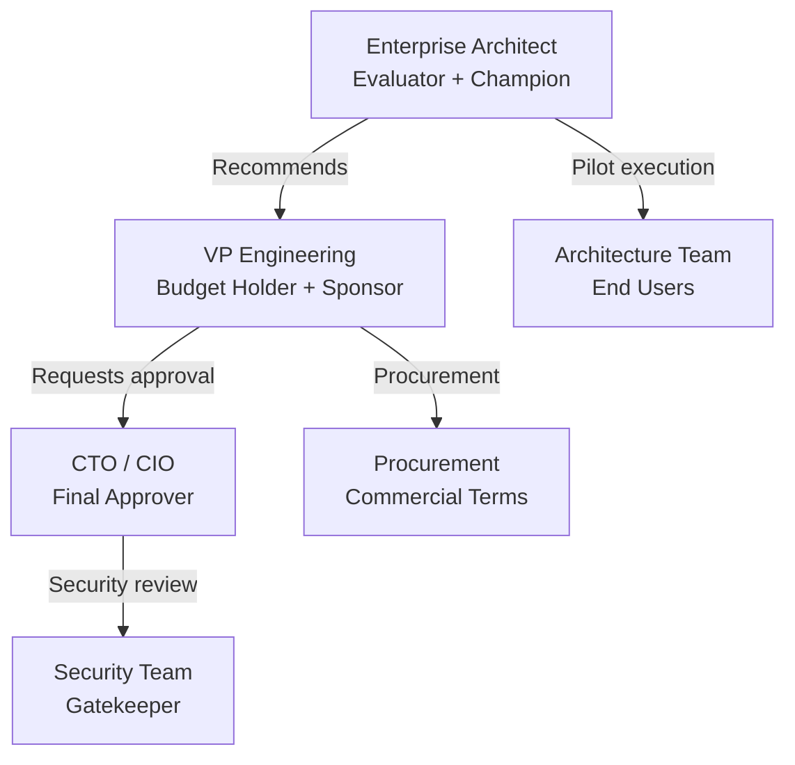

> **Reviewed:** 2026-08-26

> **Scope:** ArchLucid buyer personas and ideal customer profile (ICP) — who buys, firmographic fit, and how they evaluate — plus buyer self-routing / should-you-evaluate (formerly `SHOULD_YOU_EVALUATE.md`), and the design-partner / pilot recruiting pipeline (formerly the body of `PILOT_RECRUITING_PIPELINE.md`; that filename remains a path-stable alias). Full detail in the sections below.

> **Spine doc:** [`START_HERE.md`](../START_HERE.md).

# ArchLucid buyer personas

**Audience:** Product, sales, and marketing teams who need a shared understanding of who buys ArchLucid, why, and how they evaluate it.

**Last reviewed:** 2026-08-26

**Grounding rule:** Capabilities and limitations referenced here reflect the V1 codebase per [V1_SCOPE.md](../library/V1_SCOPE.md) and [CUSTOMER_TRUST_AND_ACCESS.md](../library/CUSTOMER_TRUST_AND_ACCESS.md). ICP thresholds also ground in [ROI_MODEL.md](ROI_MODEL.md) (break-even at ~180 architect-hours/year) and [COMPETITIVE_LANDSCAPE.md](COMPETITIVE_LANDSCAPE.md).

**Pilot recruiting (founder-led):** [`#pilot-recruiting-pipeline`](#pilot-recruiting-pipeline) (`PILOT_RECRUITING_PIPELINE.md` alias).

---

## How to use this document

1. **Sales:** Use personas to qualify leads quickly. If the prospect does not match at least one persona, the deal is likely a poor fit for V1. Score firmographics with the [ICP scoring matrix](#icp-scoring-matrix) in under five minutes.
2. **Marketing:** Use pain points and language to craft messaging that resonates.
3. **Product:** Use evaluation criteria and objections to prioritize roadmap items.
4. **Demo prep:** Tailor the demo to the persona in the room — each values different features.

Buyer self-routing: [`#should-you-evaluate`](#should-you-evaluate) (includes [not-a-fit filter](#when-archlucid-is-not-a-fit)).

---

## Buyer journey (field motion)

Help enterprise architecture and platform leaders **hire ArchLucid** to turn messy architecture requests into **reviewable, versioned manifests, evidence, and governance-ready artifacts** in weeks instead of quarters — without replacing their existing EA tools wholesale.

**Assumptions:** Buyer has Confluence/Jira and some formal governance; Entra (or equivalent) exists; value maps to release risk, audit evidence, or review cycle time (budget line may not say “AI architecture”).

**Constraints:** Multi-stakeholder sales (EA, security, SRE, procurement); LLM outputs are not legal proof; data residency / tenant isolation are stop conditions when unsupported (see [not-a-fit](#when-archlucid-is-not-a-fit)).

| Stage | Buyer touchpoints | Proof artifacts |
|-------|-------------------|-----------------|
| **Discovery** | Sponsor sponsor brief, pilot ROI companion, demo script | [`EXECUTIVE_SPONSOR_BRIEF.md`](EXECUTIVE_SPONSOR_BRIEF.md), [`PILOT_ROI_MODEL.md`](../library/PILOT_ROI_MODEL.md) |
| **Pilot (30/60/90)** | Architect workspace + CLI, API keys or Entra JWT | Architecture packages, OTel trace ids, export records, audit events |
| **Expand** | Governance approvals, integration events | `GovernanceApprovalRequests`, [`INTEGRATION_EVENTS_AND_WEBHOOKS.md`](../library/INTEGRATION_EVENTS_AND_WEBHOOKS.md) |

**Pilot success metrics (set X in charter):** median time-to-first finalized package; 100% of pilot reviews have OTel + package + findings for sponsor demo; at least one exportable governance/policy outcome when Enterprise layer is in scope.

Canonical **buyer pitch** remains in [`EXECUTIVE_SPONSOR_BRIEF.md`](EXECUTIVE_SPONSOR_BRIEF.md) — this section aligns **field motion** to **persisted artifacts**.

---

## Ideal customer profile (ICP)

The ICP describes the **company profile** where ArchLucid delivers **maximum value** and has the **highest win probability** in V1. Qualifying against the ICP prevents wasted effort on poor-fit prospects.

### Firmographic criteria

| Criterion | Ideal range | Reasoning |
|-----------|------------|-----------|
| **Company size** | 500–10,000 employees | Large enough to have a formal architecture practice; small enough that ArchLucid can serve as the primary tool (not competing with entrenched EAM suites at 50K+ orgs) |
| **Industry verticals** | Financial services, technology, healthcare | Compliance pressure (FS, HC) drives governance adoption; technology companies value speed and consistency |
| **Geography** | English-speaking markets (US, UK, ANZ, Western Europe) | V1 is English-only; Azure presence is strong in these regions |
| **Architecture team size** | 3+ architects | Below 3, the ROI model break-even (180 hours/year) is difficult to reach; above 3, each additional architect multiplies savings |
| **Cloud posture** | Azure-primary or Azure-significant | V1 topology, cost, and compliance engines are deepest on Azure; AWS/GCP-target reviews ship in V1 with inventory ZIP / Tier 2 poll / Terraform ingest and thinner heuristic costing |
| **Architecture practice maturity** | Established (not aspirational) | Active reviews happening today — even if manual and inconsistent. ArchLucid improves existing practice; it does not create one |

### Behavioral / situational criteria

| Signal | Why it matters |
|--------|---------------|
| **Active architecture review cadence** | If they review designs regularly, ArchLucid accelerates an existing workflow — highest value |
| **Compliance or audit pressure** | Governance workflow and audit trail are immediate differentiators; compliance-driven buyers have budget |
| **Growth or modernization initiative** | More architecture decisions = more reviews = more value from ArchLucid |
| **Pain from inconsistency** | "Different architects say different things" — multi-agent consistency is the hero feature |
| **Documentation debt** | "We don't document architecture decisions" — ArchLucid's artifacts fill the gap |

### Disqualifiers (poor fit for V1)

| Disqualifier | Reason |
|-------------|--------|
| **No established architecture practice** | ArchLucid accelerates reviews; it does not teach architecture from scratch |
| **Require air-gapped / on-premises without a documented equivalent** | Default delivery is SaaS; forks must own operational burden (see [not-a-fit](#when-archlucid-is-not-a-fit)) |
| **Fewer than 3 architects** | ROI threshold unlikely to be met per the model (< 180 architect-hours/year) |
| **Evaluating for EAM repository replacement** | ArchLucid is not a modeling/documentation tool (LeanIX, Ardoq competitor); it is an AI analysis platform |
| **No budget authority at architecture level** | If architecture tools require CIO-level approval and no champion exists, cycle will stall |

### ICP scoring matrix

Use this to qualify leads in < 5 minutes.

| Criterion | Weight | 3 (Strong fit) | 2 (Moderate) | 1 (Weak) | 0 (Disqualifier) |
|-----------|--------|----------------|--------------|----------|-------------------|
| **Company size** | 2 | 500–10K | 200–500 or 10K–50K | < 200 or > 50K | — |
| **Industry** | 2 | FS, tech, healthcare | Other regulated | Consumer, media | — |
| **Architecture team** | 3 | 5+ architects | 3–4 architects | 1–2 architects | 0 architects |
| **Cloud posture** | 2 | Azure-primary | Azure + other | Multi-cloud no Azure | No cloud evidence / IaC |
| **Review practice** | 3 | Active, > 10/year | Active, 5–10/year | Aspirational | None planned |
| **Compliance pressure** | 2 | Regulatory mandate | Internal audit | Optional | None |
| **Pain articulation** | 1 | Champion names specific pain | General interest | "Just exploring AI" | — |

**Maximum score: 45.** Qualification thresholds:

| Score | Qualification | Action |
|-------|--------------|--------|
| **35–45** | **Strong fit** | Prioritize; offer guided pilot |
| **25–34** | **Moderate fit** | Pursue if capacity allows; self-serve trial |
| **15–24** | **Weak fit** | Nurture; revisit when multi-cloud or other gaps close |
| **< 15** | **Poor fit** | Decline politely; suggest alternatives |

### Persona mapping (ICP → roles)

| ICP firmographic | Primary champion | Economic buyer | Technical evaluator |
|-----------------|-----------------|----------------|---------------------|
| Mid-market (500–2K), compliance-driven | Persona 1 (Enterprise Architect) | CTO / VP Engineering | Persona 2 (Platform Eng Lead) |
| Tech company (200–5K), modernization | Persona 2 (Platform Eng Lead) | VP Engineering | Senior engineers |
| Large enterprise (5K–10K), governance mandate | Persona 1 (Enterprise Architect) | CTO | Persona 3 (CTO/VP peer review) |

---

## Should you evaluate ArchLucid? {#should-you-evaluate}

Former standalone: `docs/go-to-market/SHOULD_YOU_EVALUATE.md` → this section (and [not-a-fit](#when-archlucid-is-not-a-fit) below).

Work through the questions in order.

### Decision tree

**Q1.** Does your team produce architecture packages for stakeholders?

- **No** → ArchLucid may not be a fit today. See [When ArchLucid is not a fit](#when-archlucid-is-not-a-fit).
- **Yes** → Continue.

**Q2.** Do you run workloads on Azure (or plan to within 6 months)?

- **No** → ArchLucid V1 can review **AWS/GCP-target** architectures when you supply Terraform state JSON, inventory ZIP, or equivalent evidence. **Azure-primary** remains the deepest path (cost catalog, classification). [Contact us](https://archlucid.net/contact) if you need a unified multi-cloud graph in a single review — that is not offered today.
- **Yes** → Continue.

**Q3.** Do you spend 20+ hours per architecture review cycle?

- **No** → You may still benefit from governance and compliance features. Start with a quick scan.
- **Yes** → Strong fit — proceed to evaluation.

**Q4.** Do you need governance, audit trails, or compliance evidence from architecture reviews?

- **Yes** → [Start with the Operate layer evaluation](/governance).
- **No** → [Start with Pilot (pre-fills greenfield preset)](/architecture/reviews/new?preset=greenfield) — request → commit → review.

**Q5.** Does your team have at least 3 architects or engineers who regularly author architecture decisions?

- **No** → ArchLucid may be early — try a single pilot review to validate fit.
- **Yes** → You are well-positioned for a full pilot.

### 15-minute evaluation path

**Hosted SaaS:** Sign up at [archlucid.net/trial](https://archlucid.net/trial) → quick scan → review findings → commit manifest.

If sign-up is not yet available, [request a guided demo](https://archlucid.net/contact).

**Self-hosted:** From the repo root: `archlucid doctor && archlucid new --quick-scan` → review findings (about 15 minutes).

### Strong fit signals

You are likely a strong fit if:

- Your last architecture review involved ≥2 weeks of preparation time
- You have had a compliance finding surface in production rather than during design
- You are Azure-primary or planning to be within 6 months
- Your organization has a formal architecture review board or CAB
- You need to produce audit-trail evidence for a regulator, insurer, or CTO sign-off

---

## When ArchLucid is not a fit {#when-archlucid-is-not-a-fit}

Blunt filter — save buyers and our team time. Disqualify early; do **not** promise roadmap to close bad-fit deals.

### Product / scope

- Teams that **only** need **diagrams** or **wiki pages** with **no** intention to adopt a **manifest-led** workflow.
- Organizations that **cannot** use **Azure** (hosting, identity, or data residency) for a pilot **and** will not accept a **bring-your-own-Azure** model aligned to [`FIRST_AZURE_DEPLOYMENT.md`](../library/FIRST_AZURE_DEPLOYMENT.md).
- Buyers expecting **100% automated compliance sign-off** — ArchLucid produces **evidence and structured outputs**; **human accountability** remains (see [`EXECUTIVE_SPONSOR_BRIEF.md`](EXECUTIVE_SPONSOR_BRIEF.md)).

### Security / compliance posture

- **Unacceptable** tenant isolation (e.g. refusing scoped credentials, shared “god” SQL logins for all tenants in SaaS patterns).
- Requirements for **on-prem only** without a **documented** equivalent deployment story (fork must own **all** operational burden).
- **Mandatory SMB/SMB-on-internet** for primary artifacts — conflicts with product security stance (use private endpoints).

### Commercial / maturity

- **No named sponsor** and **no success metrics** for a pilot — success cannot be reviewed.
- Expectation of **full production HA** on **minimal pilot** budget — start with [`PILOT_PROFILE.md`](../deployment/PILOT_PROFILE.md) *or* align spend before enterprise HA ([`REFERENCE_SAAS_STACK_ORDER.md`](../library/REFERENCE_SAAS_STACK_ORDER.md)).
- Demands for **features outside V1** without acceptance of [`V1_SCOPE.md`](../library/V1_SCOPE.md) and [`V1_DEFERRED.md`](../library/V1_DEFERRED.md).

### When to re-open the conversation

- Sponsor assigned; **Core Pilot** metrics agreed (time-to-manifest, traceability, optional governance).
- Azure subscription + identity path accepted; security review **scheduled**, not vague “later”.

---

## Persona 1: The Enterprise Architect / Chief Architect

### Profile

| Attribute | Detail |
|-----------|--------|
| **Title** | Enterprise Architect, Chief Architect, Principal Architect, Head of Architecture |
| **Reports to** | CTO or VP Engineering |
| **Team size** | 3–15 architects in a central practice or federated across business units |
| **Organization** | 500–10,000+ employee enterprise with established architecture practice |
| **Technical depth** | Deep — reads and writes architecture documentation, reviews designs, defines standards |
| **Budget authority** | Can recommend and influence ($50K–$250K range); needs CTO/VP approval for larger commitments |

### Responsibilities and goals

- Define and enforce architecture standards across the organization
- Review proposed system designs for compliance with principles and policies
- Maintain a current view of the technology landscape (what we run, where, why)
- Advise project teams on technology selection and design trade-offs
- Ensure architecture decisions are documented and traceable for auditors

### Pain points ArchLucid addresses

| Pain point | How ArchLucid helps | Evidence in product |
|-----------|---------------------|---------------------|
| **Architecture reviews are inconsistent** — different architects apply different standards, and reviews are oral conversations with no artifact trail | Multi-agent pipeline applies the same finding engines across every review. Every finding has an `ExplainabilityTrace`. Architecture packages (API: golden manifests) are versioned and comparable. | 10 finding engines, `ExplainabilityTrace` (5 fields per finding), `dbo.GoldenManifests` with `ROWVERSION` |
| **No audit trail for architecture decisions** — auditors ask "who approved this design?" and the answer is "someone in a meeting" | 78 typed audit events with append-only SQL enforcement. Governance approval workflow with segregation of duties. Provenance graph linking evidence to decisions. | `dbo.AuditEvents`, `GovernanceApprovalRequests`, `ProvenanceBuilder` |
| **Compliance checking is manual** — architects manually verify designs against policy, and gaps are found late (or in production) | Pre-finalize governance gate blocks architecture-package finalize when findings at or above a configurable severity exist. Policy packs with versioned compliance rules. | `PreCommitGovernanceGate`, `PolicyPackContentDocument`, `BlockCommitMinimumSeverity` |
| **Architecture drift goes undetected** — the system evolves but no one tracks how the design changes between iterations | Two-run comparison with structured deltas. Comparison replay with drift verification mode. Compliance drift trend chart. | `ComparisonRecords`, replay verify mode (422 on drift), `ComplianceDriftTrendService` |

### How they evaluate tools

- **Criteria priority:** (1) Quality and depth of analysis output, (2) Governance and compliance workflow, (3) Integration with existing architecture practice (ArchiMate, TOGAF), (4) Audit trail completeness, (5) Price relative to team size
- **Evaluation process:** 4–8 week pilot with 2–3 real architecture reviews. Success = "findings I would have identified myself, plus some I would have missed, with full traceability."
- **Decision timeline:** 3–6 months from first contact to purchase

### What would make them champion ArchLucid

- The finding engines identify a real compliance gap that the manual review process missed
- The provenance graph shows the complete decision chain from context to finding to architecture-package entry
- The DOCX export produces a stakeholder-ready report that replaces their manual template
- The comparison feature shows meaningful architectural drift between two iterations

### What would make them reject ArchLucid

- Cannot import existing ArchiMate/TOGAF models (no modeling-tool import; IaC declaration ingest is not a substitute)
- Findings are generic or low-quality compared to their expert judgment
- Needs CMDB/CSDM as the architecture system of record (ServiceNow **ticket** connectors exist; CMDB import does not)
- AWS-primary FinOps that needs Azure-catalog cost depth (AWS/GCP-target reviews ship; costing is thinner)
- The UI is too rough for them to present to non-technical stakeholders

### Key objections and responses

| Objection | Response |
|-----------|----------|
| "We already have LeanIX/Ardoq for architecture management" | ArchLucid does not replace your architecture repository — it adds **AI-driven analysis and governance** on top of your architecture decisions. LeanIX catalogs what you have; ArchLucid evaluates whether what you plan is sound. |
| "Can AI really do architecture review?" | ArchLucid's agents are not replacing architects — they are automating the repetitive parts (checking coverage, identifying policy gaps, flagging cost constraints) and providing a structured starting point. Every finding is explainable and traceable, not a black-box suggestion. |
| "We need ArchiMate import" | V1 does **not** import ArchiMate or TOGAF models. It accepts structured architecture requests with **infrastructure declarations** (`json`, Terraform, Bicep, ARM, rendered Kubernetes), documents, inventory ZIP, and policy references. LeanIX/ArchiMate remain the catalog; ArchLucid reviews a package you submit. |

### Demo priorities (what to show first)

1. Pre-loaded run with findings — focus on `ExplainabilityTrace` depth
2. Pre-finalize governance gate blocking a non-compliant finalize
3. Two-run comparison showing architectural drift
4. DOCX export with embedded diagram
5. Provenance graph visualization

---

## Persona 2: The VP Engineering / Head of Platform Engineering

### Profile

| Attribute | Detail |
|-----------|--------|
| **Title** | VP Engineering, Director of Engineering, Head of Platform Engineering, Principal Engineer |
| **Reports to** | CTO or SVP Engineering |
| **Team size** | 50–500 engineers across multiple squads |
| **Organization** | Technology company or technology-heavy enterprise with platform engineering practice |
| **Technical depth** | Moderate-to-deep — sets technical direction but delegates implementation |
| **Budget authority** | Direct authority for tooling budget ($100K–$500K range); does not need C-suite approval for developer tools |

### Responsibilities and goals

- Increase engineering velocity without sacrificing quality
- Reduce toil and manual gates in the software delivery pipeline
- Standardize practices across squads and reduce "reinventing the wheel"
- Ensure compliance and security are shifted left (caught before production, not after)
- Justify tooling investments with measurable ROI (time saved, incidents prevented)

### Pain points ArchLucid addresses

| Pain point | How ArchLucid helps | Evidence in product |
|-----------|---------------------|---------------------|
| **Architecture review is a bottleneck** — every design must go through a small team of architects, creating a queue | AI agents perform the initial analysis automatically. Architects review findings rather than conducting the entire review from scratch. | `IAuthorityRunOrchestrator` pipeline: context → graph → findings → decisioning → artifacts |
| **No architecture-as-code** — infrastructure has Terraform, code has CI/CD, but architecture decisions are in wikis and slides | Architecture requests are structured JSON. Architecture packages are versioned artifacts. The CLI supports automation. | `ArchitectureRequest` API, `archlucid run`, `archlucid commit` (finalize), `archlucid artifacts --save` |
| **Compliance is reactive** — security and compliance findings surface in post-deployment audits, not during design | Pre-finalize governance gate. Policy packs with compliance rules evaluated during the review pipeline. Findings by severity with configurable blocking thresholds. | `PreCommitGovernanceGate`, `FindingSeverity`, `PolicyPackAssignment.BlockCommitMinimumSeverity` |
| **Cannot measure architecture quality** — no metrics on review throughput, finding patterns, or decision consistency | 30+ OTel metrics including runs created, findings by severity, LLM usage per run, agent output quality scores, and explanation cache effectiveness. | `ArchLucidInstrumentation`, Grafana dashboards committed in repo |

### How they evaluate tools

- **Criteria priority:** (1) Automation and CI/CD integration, (2) Time-to-value for engineering teams, (3) API-first design, (4) Measurable impact on velocity, (5) Reasonable per-run economics
- **Evaluation process:** 2–4 week proof of concept. Success = "my team ran 10 architecture reviews in the time it used to take to do 2, and the quality was comparable."
- **Decision timeline:** 1–3 months (faster than enterprise architects — they are used to buying developer tools)

### What would make them champion ArchLucid

- Architecture review as a pipeline step: a PR triggers an ArchLucid run, findings appear as PR comments, governance blocks merge if critical
- The CLI and API enable full automation without touching the UI
- Metrics show measurable reduction in review cycle time
- The simulator mode lets teams experiment without LLM costs

### What would make them reject ArchLucid

- No CI/CD pipeline examples (currently no GitHub Actions or Azure DevOps templates)
- Cannot run without Azure infrastructure (SQL Server dependency, Azure OpenAI)
- No Python or JavaScript SDK (their team is not .NET)
- Setup takes more than an hour (current Docker setup requires multiple configuration steps)
- Per-run LLM costs are not trackable or predictable

### Key objections and responses

| Objection | Response |
|-----------|----------|
| "We can just use ChatGPT/Copilot for architecture advice" | ChatGPT gives you an answer. ArchLucid gives you a **governed, auditable, repeatable process** with structured findings, version-controlled architecture packages, and drift detection. When your auditor asks "who reviewed this design and what did they find?", ArchLucid has the answer. |
| "Our engineers are not .NET developers" | ArchLucid's API is REST/JSON. The CLI is a single binary. The OpenAPI spec can generate clients in any language. V1 ships a .NET client; Python and JavaScript SDKs are on the roadmap. |
| "How do I justify the cost?" | Each architecture review that currently takes 40 hours of senior architect time can be reduced to a 2-hour review of AI-generated findings. At $150/hour fully loaded, that is $5,700 saved per review. Run 10 reviews per quarter and the tool pays for itself. |

### Demo priorities (what to show first)

1. CLI `run --quick` → `artifacts` pipeline (30 seconds to an architecture package)
2. API flow: Swagger → create review → execute → finalize (`commit`) → get architecture package
3. OTel metrics in Grafana (runs, findings, agent quality)
4. Health checks and `doctor` command (operational readiness)
5. Compare two reviews to show drift detection

---

## Persona 3: The CTO / CIO at a Regulated Enterprise

### Profile

| Attribute | Detail |
|-----------|--------|
| **Title** | Chief Technology Officer, Chief Information Officer, VP Technology |
| **Reports to** | CEO or COO |
| **Team size** | Oversees 100–5,000+ technical staff |
| **Organization** | Regulated enterprise (financial services, healthcare, government, energy) |
| **Technical depth** | Strategic — sets direction but does not review code or operate systems directly |
| **Budget authority** | Full authority ($500K+); final approver for enterprise platform decisions |

### Responsibilities and goals

- Ensure technology decisions are defensible to regulators and auditors
- Reduce operational risk from undocumented or ungoverned architecture changes
- Demonstrate to the board that technology investments are managed with discipline
- Enable digital transformation while maintaining compliance posture
- Reduce the cost and cycle time of internal and external audits

### Pain points ArchLucid addresses

| Pain point | How ArchLucid helps | Evidence in product |
|-----------|---------------------|---------------------|
| **Audit exposure** — auditors ask for evidence of architecture review and the answer is scattered emails and slides | 78 typed audit events in an append-only SQL store. Every finding traced to evidence. Governance approvals with segregation of duties. Export to JSON/CSV for auditor consumption. | `dbo.AuditEvents`, `DENY UPDATE/DELETE`, `GovernanceApprovalRequests`, audit export endpoints |
| **Ungoverned architecture decisions** — project teams make technology choices without formal review, creating compliance risk | Policy packs with configurable enforcement. Pre-finalize gate blocks architecture packages with critical findings. Approval workflow with SLA tracking and escalation. | `PreCommitGovernanceGate`, `ApprovalSlaMonitor`, `GovernanceApprovalSlaBreached` audit event |
| **No visibility into architecture quality across the portfolio** — each team reviews differently (or not at all) | Standardized findings from consistent engines. Comparison and trend analysis across runs. Advisory scans with trace completeness metrics. | Finding engines, `ComplianceDriftTrendService`, `ExplainabilityTraceCompletenessAnalyzer` |
| **Regulatory questionnaires take weeks** — compliance teams manually gather evidence for SOC 2, ISO 27001, and industry audits | Durable audit trail, governance workflow evidence, and findings mapped to compliance concerns. Export capabilities for evidence packages. | Audit export (JSON/CSV), DOCX consulting export, artifact bundles |

### How they evaluate tools

- **Criteria priority:** (1) Security and compliance posture of the tool itself, (2) Audit trail and governance depth, (3) Vendor viability and support, (4) Integration with existing security and identity infrastructure, (5) Total cost of ownership
- **Evaluation process:** Security review → proof of concept (led by their architecture team) → business case → procurement. 6–12 months.
- **Decision timeline:** 6–12 months (enterprise procurement cycle)

### What would make them champion ArchLucid

- The STRIDE threat model and security architecture documentation demonstrate that the vendor takes security seriously
- Entra ID integration means their users sign in with existing credentials
- The audit trail satisfies their compliance team's evidence requirements
- Private endpoints and WAF show enterprise-grade deployment options
- The governance workflow mirrors their existing approval process

### What would make them reject ArchLucid

- No SOC 2 Type II report or equivalent third-party attestation
- No GDPR/CCPA data processing agreement
- Single-vendor identity that is **neither** OIDC **nor** SAML (Okta/Auth0/Ping via OIDC or SAML SP are in V1; Entra remains the default hosted path)
- No SLA commitment (only aspirational targets)
- Vendor is too small / too early to bet on for a regulated environment
- No on-premises deployment option (some regulated industries cannot use cloud)

### Key objections and responses

| Objection | Response |
|-----------|----------|
| "Do you have SOC 2?" | ArchLucid is **vendor-operated SaaS** on Azure. We publish a Trust Center, DPA-aligned subprocessors, and an interim SOC 2 posture (self-assessment today; external Type I/II when funded — see **`docs/PENDING_QUESTIONS.md`**). The product includes RBAC, **database-per-tenant** catalog isolation (ADR 0037), append-only audit enforcement, and private endpoint patterns in our hosted stack. We provide security architecture and STRIDE threat-model documentation for your review team. |
| "We use Okta, not Entra" | V1 workforce SSO is **Entra JWT by default**, plus **generic OIDC** (`ArchLucidAuth:Authority` against a standards-compliant issuer — Okta, Auth0, Ping, Keycloak-style) and a **SAML 2.0 SP**. Map IdP claims to `ArchLucidRoles`. API keys remain an automation path where the environment allows them. |
| "How do we know you will be around in 2 years?" | ArchLucid is **operated as SaaS**; tenant data is processed in **contracted Azure regions** with clear data-processing terms. The codebase and documentation are structured for long-term maintainability (ADRs, Trust Center, CI). If procurement needs stronger assurance, we can discuss **source escrow** and roadmap commitments. |
| "Can this satisfy our compliance framework?" | ArchLucid's findings can be mapped to compliance controls. Policy packs are configurable to match your specific regulatory requirements. The governance workflow provides the approval chain evidence that auditors expect. We are working on pre-built control mappings for SOC 2 and ISO 27001. |

### Demo priorities (what to show first)

1. Governance approval workflow with segregation of duties
2. Audit event log with search and export
3. Pre-finalize governance gate blocking a non-compliant finalize
4. CUSTOMER_TRUST_AND_ACCESS architecture diagram (security posture)
5. DOCX export with structured evidence

---

## Cross-persona buying dynamics

In most deals, multiple personas are involved:

| Phase | Primary persona | Key action |
|-------|----------------|------------|
| Discovery | Enterprise Architect | Finds ArchLucid, evaluates it against manual process and competitors |
| Pilot | Enterprise Architect + Architecture Team | Runs 3–5 real reviews, compares output quality to manual reviews |
| Business case | VP Engineering | Quantifies time saved, builds ROI model, requests budget |
| Security review | Security Team + CTO | Reviews STRIDE model, auth architecture, data handling |
| Procurement | Procurement + CTO | Negotiates terms, requires SLA and DPA |
| Deployment | Platform Engineering / SRE | Deploys to Azure with Terraform, configures auth and monitoring |

---

## Design partner and pilot recruiting pipeline {#pilot-recruiting-pipeline}

Former standalone body: `docs/go-to-market/PILOT_RECRUITING_PIPELINE.md` → this section (filename kept as a path-stable alias).

**Audience:** Founder, sales engineer, and any team member sourcing and qualifying pilot accounts. This is a founder-led pipeline, not an automated sales CRM.

**Related:** [`QUOTE_TO_PROOF_PACKET.md#productized-service-offers`](QUOTE_TO_PROOF_PACKET.md#productized-service-offers), [`EXECUTIVE_SPONSOR_BRIEF.md`](EXECUTIVE_SPONSOR_BRIEF.md), [`PILOT_SUCCESS_SCORECARD.md`](PILOT_SUCCESS_SCORECARD.md), [`PILOT_ACCEPTANCE_THRESHOLDS.md`](PILOT_ACCEPTANCE_THRESHOLDS.md).

### 1. Target account profile (TAP)

Use this profile to qualify inbound leads and prioritize outreach. All three primary signals should be present for a strong-fit prospect. Pair with the [ICP](#ideal-customer-profile-icp) above for firmographic depth.

#### 1.1 Primary signals (all three preferred)

| Signal | Description |
| --- | --- |
| **Active architecture review process** | The account conducts periodic architecture reviews, ARB sessions, or cloud design reviews — even if the current process is manual and ad hoc |
| **Azure-centric cloud footprint** | Primary or growing Azure workloads; cloud-native or cloud-migrating teams |
| **Decision-maker accessible** | CTO, VP Engineering, Principal Architect, or fractional CTO can evaluate and sponsor the pilot within 30 days |

#### 1.2 Amplifying signals (increase priority)

- Mid-market or regulated enterprise (healthcare, financial services, government-adjacent): highest compliance sensitivity and clearest ROI framing
- Active or recent SOC 2 / HIPAA / ISO audit pressure
- Architecture team headcount ≥ 2 and growing
- Existing pain point: slow reviews, scattered evidence, manual documentation, post-hoc governance

#### 1.3 Disqualifiers (do not advance without owner exception)

| Disqualifier | Reason |
| --- | --- |
| Requires SOC 2 CPA or ISO before pilot start | V1 cannot provide; DEFERRED_SCOPE — do not force fit |
| Requires named public reference before engaging | V1.1 GTM item; do not promise |
| Requires live Azure Marketplace or Stripe checkout | V1.1 / V2; do not promise |
| No Azure footprint and unwilling to use Azure OpenAI | V1 AI path is Azure OpenAI; no workaround in V1 |
| Autonomous infrastructure modification expected | ArchLucid is decision-support; does not push changes |
| Immediate multi-region active/active SLA required | Not available in V1 |

### 2. Buyer persona map (recruiting summary)

| Persona | Title examples | Primary pain | Winning message |
| --- | --- | --- | --- |
| **Architecture lead** | Principal Architect, Head of Architecture, VP Cloud | Reviews take too long; evidence is scattered; governance is inconsistent | "Replace ad hoc documentation with a structured, defensible architecture package built from the evidence you already have." |
| **CTO / VP Engineering** | CTO, VP Engineering, fractional CTO | Cannot scale architecture reviews without adding headcount | "Evidence-backed reviews in a fraction of the time, with an audit trail your board and auditors can read." |
| **GRC / Compliance lead** | CISO, Compliance Manager, Risk Officer | Architecture decisions lack audit trail; governance gaps before prod deploys | "Pre-finalize governance gate and structured audit event trail aligned to your policy packs." |
| **Cloud consultant / boutique firm** | Principal Consultant, Solution Architect | Delivering architecture review reports is manual and hard to scale | "ArchLucid as your delivery infrastructure — bring your own evidence, produce a whitelabel report." |

Detailed profiles: [Persona 1](#persona-1-the-enterprise-architect--chief-architect) · [Persona 2](#persona-2-the-vp-engineering--head-of-platform-engineering) · [Persona 3](#persona-3-the-cto--cio-at-a-regulated-enterprise).

### 3. Qualification criteria (BANT-aligned)

Score each dimension 1–3 before advancing to intake.

| Dimension | 1 — Weak | 2 — Moderate | 3 — Strong |
| --- | --- | --- | --- |
| **Budget** | No budget signal; all free/trial only | Budget exploration; director or below | Defined pilot budget or services line item; CTO/CFO aware |
| **Authority** | No sponsor identified | Technical champion; sponsor TBD | Sponsor sponsor identified and engaged |
| **Need** | Nice to have; no current pain | Current manual process; aware of the problem | Active pain: slow reviews, compliance gap, scaling failure |
| **Timeline** | >6 months or indefinite | 3–6 months | Ready to start within 30 days |

**Advance to intake when total score ≥ 8.** Scores below 8 → nurture or no-fit per prospect classification below.

### 4. Prospect classification

| Class | Criteria | Next action |
| --- | --- | --- |
| **Qualified** | TAP signals present; BANT score ≥ 8; no hard disqualifiers | Schedule intake call; begin pilot intake form |
| **Nurture** | Moderate fit; BANT 5–7; or one disqualifier that may resolve | Stay in contact; share EXECUTIVE_SPONSOR_BRIEF; re-qualify in 60 days |
| **No-fit** | Hard disqualifier present; BANT < 5; or TAP mismatch | Record reason; do not advance; revisit only if circumstances change |

### 5. Outreach artifacts

| Stage | Artifact | Notes |
| --- | --- | --- |
| Cold/warm outreach | [`EXECUTIVE_SPONSOR_BRIEF.md`](EXECUTIVE_SPONSOR_BRIEF.md) one-pager | Link or attach; do not attach full procurement pack unsolicited |
| Discovery call follow-up | [`#should-you-evaluate`](#should-you-evaluate) | Helps prospect self-qualify |
| Qualification confirmed | [`QUOTE_TO_PROOF_PACKET.md#productized-service-offers`](QUOTE_TO_PROOF_PACKET.md#productized-service-offers) SKU summary + [`QUOTE_TO_PROOF_PACKET.md#paid-pilot-offers-draft`](QUOTE_TO_PROOF_PACKET.md#paid-pilot-offers-draft) talk track | Name the offer; do not just say "ArchLucid platform" |
| Pilot proposal | [`QUOTE_TO_PROOF_PACKET.md#paid-pilot-offers-draft`](QUOTE_TO_PROOF_PACKET.md#paid-pilot-offers-draft) Option A or B → [`QUOTE_TO_PROOF_PACKET.md#private-quote--sow-template`](QUOTE_TO_PROOF_PACKET.md#private-quote--sow-template) | Owner reviews each SOW before sending; convert with [`ORDER_FORM_TEMPLATE.md`](ORDER_FORM_TEMPLATE.md) Addendum D |

### 6. Pilot intake form

Collect all of the following before confirming a pilot start date.

#### 6.1 Prospect and engagement information

- Account name:
- Primary contact name, title, email:
- Sponsor sponsor name, title, email:
- Account BANT score (from BANT table above):
- TAP signals confirmed (list):
- Disqualifiers reviewed — none present? (Yes / No / Exception noted):

#### 6.2 Offer and scope

- Selected offer SKU (from [`QUOTE_TO_PROOF_PACKET.md#productized-service-offers`](QUOTE_TO_PROOF_PACKET.md#productized-service-offers)):
- Agreed scope summary (3–5 sentences):
- Planned start date:
- Planned end date:
- Target number of architecture reviews during pilot:

#### 6.3 Data and proof permissions

> **Do not begin a pilot without capturing these permissions.** Proof claims cannot be reused beyond their permission boundary.

- [ ] **Data boundary agreement captured:** Buyer confirms what evidence can be uploaded to ArchLucid (e.g., sanitized Azure exports, redacted diagrams, full internal evidence)
- [ ] **Proof-capture permission scope confirmed:**
  - [ ] Proof can be used internally (ArchLucid operations only)
  - [ ] Proof can be used in anonymized/synthetic form for ArchLucid marketing
  - [ ] Proof can be used as a named case study (requires separate signed release — see [`REFERENCE_PUBLICATION_RUNBOOK.md#named-reference-customer-capture`](reference-customers/README.md#named-reference-customer-capture))
  - [ ] Proof **cannot** be used outside this engagement (restrict to operations only)
- [ ] **Public / private reference expectation settled:**
  - [ ] Buyer may be a public reference in the future (subject to separate permission — see [`REFERENCE_PUBLICATION_RUNBOOK.md#named-reference-customer-capture`](reference-customers/README.md#named-reference-customer-capture))
  - [ ] Buyer prefers to remain anonymous; any proof used in external materials must be anonymized
  - [ ] Buyer does not consent to any external reference use

#### 6.4 Expected buyer outcomes

Record the buyer's stated success criteria so pilot results can be evaluated against pre-agreed expectations.

- Primary outcome the buyer expects from the pilot:
- Specific metrics the buyer will use to judge success:
- Commercial next step if pilot meets criteria:

#### 6.5 Intake approval

- Intake reviewed by founder / owner: Yes / No
- Date:
- Any exceptions or non-standard terms noted:

### 7. Public-reference ask routing

If a prospect asks to become a public reference, or if you want to request reference permission:

1. Do not make an informal commitment. Route to [`REFERENCE_PUBLICATION_RUNBOOK.md#named-reference-customer-capture`](reference-customers/README.md#named-reference-customer-capture) for the formal checklist.
2. Record the request in the intake form under proof-capture permissions.
3. Public references are a V1.1 GTM item — they do not affect the V1 pilot score or release headline readiness.

### 8. Pipeline tracking (minimum viable)

Maintain a simple record for each active prospect:

| Field | Description |
| --- | --- |
| Account | Account name |
| Status | Qualified / Nurture / No-fit / Intake / Active Pilot / Commercial Close |
| Offer SKU | Selected service offer |
| BANT score | 1–12 |
| Proof permission | Internal / Anonymized / Named (pending release) / Restricted |
| Next action | Specific next step with date |
| Owner | Who is driving this account |

### Recruiting references

| Document | Purpose |
| --- | --- |
| [`QUOTE_TO_PROOF_PACKET.md#productized-service-offers`](QUOTE_TO_PROOF_PACKET.md#productized-service-offers) · [`SERVICE_LED_OFFERS.md`](SERVICE_LED_OFFERS.md) (alias) | Named offer SKUs |
| [`EXECUTIVE_SPONSOR_BRIEF.md`](EXECUTIVE_SPONSOR_BRIEF.md) | Outreach one-pager |
| [`PILOT_SUCCESS_SCORECARD.md`](PILOT_SUCCESS_SCORECARD.md) | Pilot measurement framework |
| [`PILOT_ACCEPTANCE_THRESHOLDS.md`](PILOT_ACCEPTANCE_THRESHOLDS.md) | PASS/HOLD criteria |
| [`REFERENCE_PUBLICATION_RUNBOOK.md#named-reference-customer-capture`](reference-customers/README.md#named-reference-customer-capture) | Public reference permission process |
| [`#should-you-evaluate`](#should-you-evaluate) | Prospect self-qualification guide |
| [`#ideal-customer-profile-icp`](#ideal-customer-profile-icp) | ICP detail |
| [`PUBLIC_CLAIM_BOUNDARY_GUIDE.md#gtm-do-not-promise`](../library/PUBLIC_CLAIM_BOUNDARY_GUIDE.md#gtm-do-not-promise) | GTM overclaim guardrails |

---

## Related documents

| Doc | Use |
|-----|-----|
| [`#should-you-evaluate`](#should-you-evaluate) | Buyer self-routing + [not-a-fit filter](#when-archlucid-is-not-a-fit) |
| [`#pilot-recruiting-pipeline`](#pilot-recruiting-pipeline) · [`PILOT_RECRUITING_PIPELINE.md`](PILOT_RECRUITING_PIPELINE.md) (alias) | Design-partner / pilot recruiting TAP, BANT, intake |
| [COMPETITIVE_LANDSCAPE.md](COMPETITIVE_LANDSCAPE.md) | Competitor-by-competitor analysis |
| [POSITIONING.md](POSITIONING.md) | Positioning statement and elevator pitches |
| [ROI_MODEL.md](ROI_MODEL.md) | Break-even analysis grounding ICP thresholds |
| [PRICING_PHILOSOPHY.md](PRICING_PHILOSOPHY.md) | Tier alignment with ICP segments |
| [REFERENCE_NARRATIVE_TEMPLATE.md](REFERENCE_NARRATIVE_TEMPLATE.md) | Case study templates per ICP segment |
| [../PILOT_GUIDE.md](../library/customer-facing/PILOT_GUIDE.md) | Technical pilot onboarding |
| [../CUSTOMER_TRUST_AND_ACCESS.md](../library/CUSTOMER_TRUST_AND_ACCESS.md) | Security posture for enterprise buyers |
| [../archive/../assessments/LATEST_GPT55.md](../archive/../assessments/LATEST_GPT55.md) | Full marketability quality assessment (archived series)
