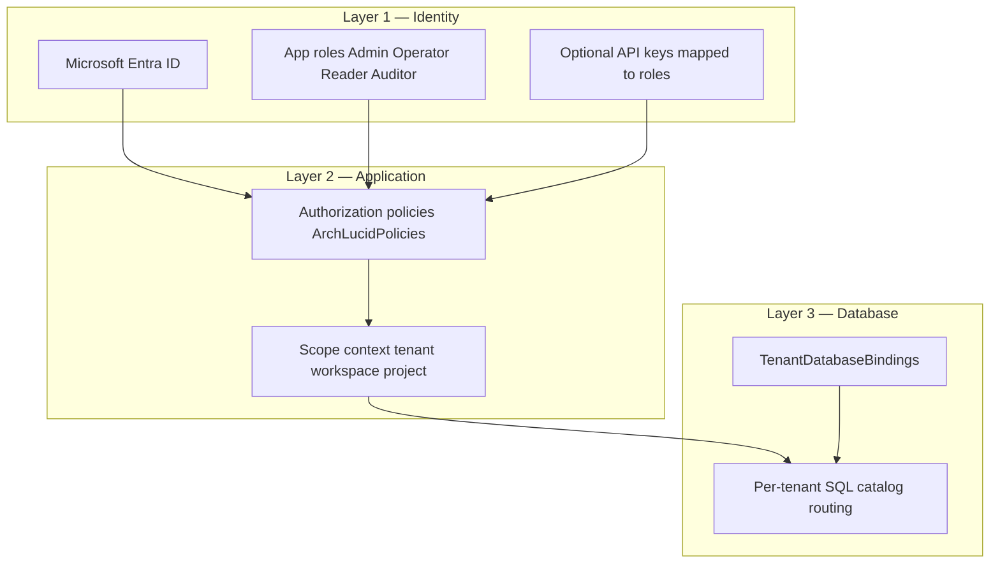

> **Reviewed:** 2026-07-27

> **Scope:** Buyer-safe security and procurement question-answer packet for V1 controlled pilots, plus the principal-architect falsification script (formerly `PRINCIPAL_ARCHITECT_FALSIFICATION_SCRIPT.md`), the Azure extractor InfoSec pre-read (formerly `AZURE_EXTRACTOR_INFOSEC_PREREAD.md`), the enterprise procurement FAQ (formerly `PROCUREMENT_FAQ.md`), the tenant isolation buyer overview (formerly the body of `TENANT_ISOLATION.md`; that filename remains a path-stable pack alias), the procurement response accelerator / SIG–CAIQ map (formerly the body of `PROCUREMENT_RESPONSE_ACCELERATOR.md`; that filename remains a path-stable alias), the security reviewer one-pager (formerly the body of `SECURITY_REVIEWER_ONE_PAGER.md`; that filename remains a path-stable pack alias), and the procurement objection playbook / controlled-pilot drill (formerly the body of `PROCUREMENT_OBJECTION_PLAYBOOK.md`; that filename remains a path-stable alias for proof-language CI). This packet only describes existing controls and evidence. It does **not** claim SOC 2 CPA, third-party penetration test, ISO 27001, or any unavailable external assurance.

> **Spine doc:** [`START_HERE.md`](../START_HERE.md).

# Buyer security and procurement packet

**Audience:** Procurement reviewers, security reviewers, GRC teams, CISOs, and enterprise buyers evaluating ArchLucid for a controlled pilot.

**Last reviewed:** 2026-07-27

**Review checklist owner:** Founder / ArchLucid operator. Re-validate before each new buyer conversation.

---

## Isolation one-pager (M-114) {#isolation-one-pager-m-114}

**Claim (G3):** Authenticated identity binds tenant/workspace scope; client-supplied scope headers cannot override that binding on production-like hosts.

| Statement | Meaning |
| --- | --- |
| Identity wins | JWT or API-key subject resolves tenant/workspace; forged `x-tenant-id` and actor headers do not steer reads or writes |
| Database-per-tenant default | Customer data uses a tenant-scoped database catalog where configured |
| SingleCatalog boundary | CI, local, and controlled demo only; not the default production isolation story |
| Fail closed | Scope-sensitive APIs deny (typically **403**) when headers disagree with identity |

Reviewer check: authenticate as Tenant A on a JwtBearer or ApiKey host, submit a scope-sensitive request with a forged Tenant B header, and expect a denial rather than Tenant B payload. Ask for the latest **TB-948** isolation evidence artifact where an attachment is required. Do not treat DevBypass or test actor headers as production-safe; production-like hosts must reject them (**TB-949**).

| Concern | Posture |
| --- | --- |
| Security | Least privilege: identity is authoritative; headers cannot expand scope |
| Scalability | Per-tenant catalogs scale independently |
| Reliability | Mismatches fail closed rather than serving mixed scope |
| Cost | Middleware and catalog routing; no third-party isolation SaaS required for this V1 claim |

Full technical narrative: [Tenant isolation (buyer overview)](#tenant-isolation-buyer-overview). Live review: [principal architect falsification script](#principal-architect-falsification-script-m-113) below.

## Tenant isolation (buyer overview) {#tenant-isolation-buyer-overview}

Former standalone body: `docs/go-to-market/TENANT_ISOLATION.md` → this section (`TENANT_ISOLATION.md` remains a path-stable procurement-pack alias).

**Audience:** Security reviewers who need a **short** explanation before diving into engineering docs.

**Headline:** Your data is **logically isolated** at **identity**, **application**, and **database** layers when ArchLucid is deployed with the recommended Azure posture. This section summarizes; deep references are linked below.

**Healthcare / PHI:** ArchLucid is for **architecture and governance evidence** about systems you describe; **do not upload PHI** into product briefs or unstructured context fields. Posture and contractual questions (including BAA) are summarized under **[`trust-center.md`](trust-center.md)** (**Healthcare and PHI**); inquiries → **`sales@archlucid.net`**.

### Three layers {#tenant-isolation-three-layers}



- **Layer 1 — Identity:** Prefer **Entra-issued JWTs** with **app roles**; API keys are server-side secrets mapped to **limited** roles ([SECURITY.md](../library/contributor-reference/SECURITY.md)).
- **Layer 2 — Application:** Controllers enforce **policies**; orchestration sets **tenant / workspace / project** scope before data access ([../security/MULTI_TENANT_RLS.md](../security/MULTI_TENANT_RLS.md) §5).
- **Layer 3 — Database:** In `SystemWithPerTenantCatalogs` (production) mode each tenant organization receives a **dedicated product SQL catalog** resolved via `TenantDatabaseBindings`. **SQL RLS is not used** ([ADR 0037](../architecture/adrs/0037-tenant-isolation-without-rls-defense-in-depth.md)). Application repositories still apply scope predicates within the catalog. Deep reference: [`TENANT_ISOLATION_DEFENSE_IN_DEPTH.md`](../security/TENANT_ISOLATION_DEFENSE_IN_DEPTH.md).

### Encryption {#tenant-isolation-encryption}

- **In transit:** TLS to the API; TLS to Azure services per Microsoft’s stack.
- **At rest:** Azure SQL (TDE) and blob encryption are standard Azure controls; see [../CUSTOMER_TRUST_AND_ACCESS.md](../library/CUSTOMER_TRUST_AND_ACCESS.md).
- **Secrets:** Prefer **Key Vault** references in hosted configs ([../CONFIGURATION_KEY_VAULT.md](../library/CONFIGURATION_KEY_VAULT.md)).

### Network {#tenant-isolation-network}

Optional **Front Door + WAF**, optional **APIM**, and **private endpoints** for SQL and blob reduce exposure ([../CUSTOMER_TRUST_AND_ACCESS.md](../library/CUSTOMER_TRUST_AND_ACCESS.md)). **SMB (445)** is not used for tenant data at the API boundary (workspace security rule).

### Audit and accountability {#tenant-isolation-audit-and-accountability}

Durable **append-only** audit events and correlation IDs support forensic review ([../AUDIT_COVERAGE_MATRIX.md](../library/AUDIT_COVERAGE_MATRIX.md), [SECURITY.md](../library/contributor-reference/SECURITY.md)).

### What we do not claim here {#tenant-isolation-what-we-do-not-claim}

Hosted **trial** tenants and **commercial** pilots use ArchLucid's **single supported multitenant data-plane model**: **`SystemWithPerTenantCatalogs`** (**database-per-tenant** routing via **`TenantDatabaseBindings`** — one product catalog per tenant organization). `SingleCatalog` may exist only for narrow **developer/CI convenience** and is **not** the hosted SaaS posture; deep detail: **[`../library/TENANT_DATABASE_TOPOLOGY.md`](../library/TENANT_DATABASE_TOPOLOGY.md)**, **[`trust-center.md`](trust-center.md)** (*Data isolation*).

Unless separately contracted and documented:

- **Dedicated compute / silo SKU per tenant** — not implied for standard SaaS.
- **Customer-managed keys (BYOK)** — not stated; confirm in roadmap or security pack if offered.

Be explicit in sales and security packs to avoid over-claiming.

### Verification pack (generated) {#tenant-isolation-verification-pack}

Generate a buyer-safe metadata pack (no tenant data, no secrets):

```bash
python scripts/generate_tenant_isolation_verification_pack.py
```

Outputs under `dist/tenant-isolation-verification-pack/`:

- `tenant-isolation-verification.json` — topology, layer summary, test inventory, redaction notes
- `tenant-isolation-verification.md` — human-readable mirror for procurement/support bundles

CI validates references with `--dry-run`.

### Deep dives {#tenant-isolation-deep-dives}

| Doc | Content |
|-----|---------|
| [../security/TENANT_ISOLATION_DEFENSE_IN_DEPTH.md](../security/TENANT_ISOLATION_DEFENSE_IN_DEPTH.md) | Defense-in-depth architecture per ADR 0037; database-per-tenant + app-layer scope predicates |
| [../security/SYSTEM_THREAT_MODEL.md](../security/SYSTEM_THREAT_MODEL.md) | STRIDE, trust boundaries |
| [../CUSTOMER_TRUST_AND_ACCESS.md](../library/CUSTOMER_TRUST_AND_ACCESS.md) | Edge, identity, private connectivity |
| [SECURITY.md](../library/contributor-reference/SECURITY.md) | RBAC, rate limiting, CI security tests, PII |

## Principal architect falsification script (M-113)

**Audience:** Founder / SE running a procurement technical review with a skeptical principal architect (or security reviewer).  
**Duration:** 30–45 minutes.  
**Goal:** Let them try to break three highest-stakes V1 claims; walk out with pass/fail notes and artifact links.  
**Spine:** [`CLAIM_READINESS_STATUS.md`](CLAIM_READINESS_STATUS.md) · [`GTM_BACKLOG.md`](GTM_BACKLOG.md) **M-113**

**Do not** use this script to substitute for **G-REAL-06** / **G-REAL-07** (real-mode proof packets). Use a **Real** committed run when possible; if you must use Simulator/seed, label it loudly and do not claim G4/G5.

### Preflight (5 min)

| Check | Pass criteria |
|-------|----------------|
| Auth mode | Staging/demo host is **JwtBearer** (or ApiKey), **not** DevelopmentBypass |
| Scope headers | `AllowTestActorHeaders` is **false** on this host (**TB-949**) |
| Sample run | One finalized review the visitor can open (prefer Real) |
| Artifacts ready | Isolation one-pager above, export/verify docs (**TB-886**), optional **TB-948** harness output |

### Claim 1 — Tenant isolation (identity wins)

**Claim:** Forged `x-tenant-id` / workspace headers cannot steer scope away from the JWT tenant.

| Step | Action | Pass |
|------|--------|------|
| 1.1 | Authenticate as Tenant A | Session shows Tenant A |
| 1.2 | Call a scope-sensitive API (e.g. `GET /v1/scope` or invitations list) with forged Tenant B header | **403** (or equivalent deny), not 200 with B’s data |
| 1.3 | Optional: Ask / Search with B’s identifiers while A is authenticated | No cross-tenant hits |
| 1.4 | Show one-pager | [Isolation one-pager (M-114)](#isolation-one-pager-m-114) |

**Talk track:** Database-per-tenant + identity-bound scope; SingleCatalog is CI/dev only; production-like hosts reject DevBypass / header bake.

**Engineering:** **TB-925** (Done), **TB-948** (harness artifact), **TB-949** (posture reject).

### Claim 2 — Audit chain + hash-verified manifest

**Claim:** Findings are evidence-linked; committed package hash can be verified (application-layer lineage, not WORM/PKI).

| Step | Action | Pass |
|------|--------|------|
| 2.1 | Open a finding with citations | Evidence refs / policy rule visible |
| 2.2 | Trace Explainability / evidence trail | Visitor can answer “what was examined?” |
| 2.3 | Run export verify (`GET /v1/authority/runs/{runId}/export/verify`) or UI CTA (**TB-950**) | Match / Mismatch / NotAttested with honest copy |
| 2.4 | State ADR 0040 posture | “Hash lineage, not immutable storage / not certificate-signed” |

**Talk track:** Use “audit chain” + “signed manifest” only as defined in [`POSITIONING.md`](POSITIONING.md) (ExplainabilityTrace + AuditEvents; ManifestHash).

**Engineering:** **TB-886**, **TB-950**, **TB-307** (Done).

### Claim 3 — Real vs Simulator honesty

**Claim:** Sponsor-facing surfaces label execution mode; PilotStrict does not forward Simulator as enterprise proof.

| Step | Action | Pass |
|------|--------|------|
| 3.1 | Show run detail mode badge | `Real` / `Simulator` / `Fallback` / `Mixed` visible |
| 3.2 | Open first-value report or export | Same mode vocabulary present |
| 3.3 | If Simulator/seed: say so explicitly | No “live multi-agent” overclaim |
| 3.4 | Point to G5 / G4 evidence | Gate JSON (**G-REAL-01**) and/or proof packets (**G-REAL-06/07**) |

**Talk track:** Stage 0 allows controlled demos; Stage 1 selling needs G1–G4 green for ≥3 real packets.

**Engineering:** **TB-951** (export mode CI); GTM **G-REAL-06** / **G-REAL-07**.

### Close-out

1. Record pass/fail per claim in the deal notes or defect log (**M-101**).
2. If Claim 1 failed → stop the deal path until **TB-948**/**TB-949** green on that host.
3. If Claim 2/3 weak → schedule **TB-886**/**TB-950** or a Real run before the next PA review.
4. Update [`CLAIM_READINESS_STATUS.md`](CLAIM_READINESS_STATUS.md) evidence links when new artifacts land.

**Out of scope for this script:** CPA SOC 2, third-party pen test, Marketplace (**G-REAL-05** / **G-ASSURANCE-02** — V1.1).

## Azure extractor — InfoSec pre-read

**Audience:** Customer security, cloud platform, and procurement reviewers who must approve running `Get-ArchLucidAzurePackage.ps1` or uploading its ZIP output to ArchLucid.  
**Status:** V1 GA — aligns with [`V1_SCOPE.md`](../library/V1_SCOPE.md) §2.16 and [`trust-center.md`](trust-center.md) Azure connectivity posture.  
**Related:** [`AZURE_EXTRACTOR.md`](../library/AZURE_EXTRACTOR.md) · [`AZURE_EXTRACTOR_INGEST.md`](../runbooks/AZURE_EXTRACTOR_INGEST.md) · [`FIRST_PILOT_OPERATOR_PATH.md`](../runbooks/FIRST_PILOT_OPERATOR_PATH.md) Phase B · [`EXECUTIVE_SPONSOR_BRIEF.md`](EXECUTIVE_SPONSOR_BRIEF.md)

Not legal attestation.

### Decision summary (30 seconds)

| Question | Answer |
| --- | --- |
| Does ArchLucid need credentials in our Azure tenant for Tier 1? | **No.** The script runs **in your environment** under **your** operator identity. |
| What Azure permissions does the script need? | **Read-only** ARM access to list resources in the scoped subscription or resource group; optional **Cost Management Reader** when `-IncludeCost` is used. |
| What leaves our tenant? | A **schema-versioned ZIP** the operator chooses to upload — not live API keys or Key Vault secrets. |
| What if we cannot approve the script? | Use an **evidence-only** architecture review (`CloudProvider.None`) — upload briefs, diagrams, and documents without extractor output. |

### Tier 1 — customer-run collector (default V1 path)

1. Your team downloads and reviews **`scripts/azure/Get-ArchLucidAzurePackage.ps1`** from the ArchLucid distribution you received (or repository tag aligned to your pilot build).
2. An authorized operator runs the script **inside your Azure context** (Azure PowerShell / Cloud Shell / approved automation runner).
3. The architect inspects the ZIP locally, then uploads it to ArchLucid via **`POST /v1/azure-extractor/upload`** (architect workspace or API) associated with an architecture **review**.

ArchLucid does **not** execute the script in your tenant and does **not** receive your Azure login session or refresh tokens from Tier 1.

| Payload (when switches enabled) | Purpose |
| --- | --- |
| `manifest.json` | Schema version, script version, collection timestamp (UTC), subscription id, scope, switches used |
| `resources.json` | ARM resource inventory for scoped subscription or resource group |
| `cost-actual.json` / `cost-amortized.json` | Cost Management exports (only with `-IncludeCost`) |
| `advisor-cost.json` | Advisor cost recommendations (only with `-IncludeCost`) |
| `orphan-candidates.json` | Orphan / unattached resource candidates (only with `-IncludeCost`) |
| `retail-prices.json` | Public Azure Retail Prices API rows for SKUs seen in inventory (no customer secret) |
| `README.txt` | Human-readable collection summary |

**Never collects:** Key Vault contents, certificates, private keys, connection strings, storage keys, SAS tokens, Entra directory secrets, user passwords, or credential material from application configuration.

Treat the uploaded ZIP as **tenant confidential configuration metadata** — scope retention to your deployment backup and data-lifecycle policy once ingested.

| Role | When required |
| --- | --- |
| **`Reader`** on subscription or resource group | Always (ARM inventory) |
| **`Cost Management Reader`** on subscription or resource group | When `-IncludeCost` is used |

Scope the run to the **smallest** subscription or resource group that represents the architecture under review.

**Roles ArchLucid will never request** (per trust-center and V1_SCOPE §2.16): **`Global Reader`**, **`Owner`**, **`Contributor`**, **`User Access Administrator`**, any write/deploy/destructive role, or any role that would let ArchLucid **apply** or **destroy** infrastructure. Terraform emit is **advisory-only**.

### Upload and audit trail (ArchLucid side)

- Package stored in tenant-scoped SQL/blob per deployment ([`trust-center.md`](trust-center.md) data residency table).
- Durable audit events include **`AzureExtractorPackage.Uploaded`**, **`AzureExtractorPackage.IngestSucceeded`**, and rejection events when schema validation fails — see [`AUDIT_COVERAGE_MATRIX.md`](../library/AUDIT_COVERAGE_MATRIX.md).
- Unsupported **`schemaVersion`** values are **rejected** (no silent parsing).

**API:** `POST /v1/azure-extractor/upload` — requires **ExecuteAuthority**; optional `runId` associates the package with an existing architecture review.

### Tier 2 — optional hosted collection (separate approval)

Tier 2 is **opt-in** and **not required** for V1 pilots. If enabled later: customer provisions a dedicated read-only service principal with **`Reader`** + **`Cost Management Reader`** only; federated workload identity preferred; ArchLucid stores only `{ customerTenantId, customerAppId, subscriptionId, includeCost }` — **never** customer client secrets. Detail: [`AZURE_EXTRACTOR.md`](../library/AZURE_EXTRACTOR.md) Tier 2 section.

### Alternative when the script is blocked

1. Run an **evidence-only** review (`CloudProvider.None`).
2. Use **demo evidence** for internal evaluator dry-runs only (label **demo-derived**; do not quote externally).
3. Revisit Tier 1 after sandbox approval or use a **narrow resource-group scope** on a non-production subscription.

First-pilot path: [`FIRST_PILOT_OPERATOR_PATH.md`](../runbooks/FIRST_PILOT_OPERATOR_PATH.md) Phase B step B2.

### Reviewer checklist

| # | Check | Pass criteria |
| --- | --- | --- |
| 1 | Script source reviewed | Team inspected `Get-ArchLucidAzurePackage.ps1` for the pilot build tag |
| 2 | Scope minimized | Subscription or RG scope matches the architecture under review only |
| 3 | RBAC least privilege | Only **Reader** (+ **Cost Management Reader** if cost enabled) |
| 4 | Output inspected pre-upload | Operator opened ZIP; no unexpected files |
| 5 | Upload path authorized | `POST /v1/azure-extractor/upload` allowed to ArchLucid tenant URL only |
| 6 | Fallback documented | Evidence-only path documented if production script denied |

### FAQ (security reviewers)

**Can ArchLucid call back into our tenant after upload?** Tier 1: **No standing access** from upload alone. Tier 2: only if you separately configure hosted extractor (opt-in).

**Is the ZIP encrypted in transit?** Upload uses HTTPS to the ArchLucid API endpoint in your deployment region.

**Does ArchLucid train models on our ZIP?** Hosted Azure OpenAI inference does not use customer content for foundation-model training per Microsoft DPA posture in [`trust-center.md`](trust-center.md). Treat ZIP as confidential tenant data regardless.

**What if PowerShell execution policy blocks the script?** See [`EXTRACTOR_EXECUTION_POLICY_BYPASS.md`](../runbooks/EXTRACTOR_EXECUTION_POLICY_BYPASS.md) — customer-controlled remediation, not ArchLucid remote execution.

### Change control

When extractor schema, RBAC posture, or trust-center rows change, update this pre-read and [`trust-center.md`](trust-center.md) § Azure connectivity in the same change.

## Evidence routing map

| Reviewer | Start with | Decision focus |
| --- | --- | --- |
| CIO / executive sponsor | [Executive Sponsor Brief](EXECUTIVE_SPONSOR_BRIEF.md) · [Core Pilot](../CORE_PILOT.md) · [Pilot Success Scorecard](PILOT_SUCCESS_SCORECARD.md) | Cycle time, defensible package, proof for broader use |
| Architecture review board | [Architecture on one page](../ARCHITECTURE_ON_ONE_PAGE.md) · [V1 Scope](../library/V1_SCOPE.md) · [Core Pilot](../CORE_PILOT.md) | Findings, decisions, evidence, governance fit |
| Security / GRC / procurement | [Trust Center](trust-center.md) · [Procurement Pack Index](PROCUREMENT_PACK_INDEX.md) · [Procurement Response Accelerator](#procurement-response-accelerator) · [DPA](DPA_TEMPLATE.md) | Current controls, evidence boundaries, deferred scope |
| Pilot owner / sales engineer | [Core Pilot](../CORE_PILOT.md) · [Pilot Success Scorecard](PILOT_SUCCESS_SCORECARD.md) · [Second Run](../library/SECOND_RUN.md) | First-session path, baseline inputs, honest ROI |

## 1. How to use this packet

1. Send this packet to the buyer's security or procurement contact.
2. Before sending, run through **Section 7 (staleness and accuracy checklist)** to confirm no dates or status fields are outdated.
3. Mark items that are **draft / not yet available** clearly rather than leaving them blank.
4. Do not add or remove assurance claims without owner review.

---

## 2. Company and product summary

| Item | Answer |
| --- | --- |
| Product name | ArchLucid |
| Product category | AI-assisted architecture workflow system (decision-support, not autonomous infrastructure change) |
| Deployment model | V1: single-region Azure deployment (customer tenant or ArchLucid-hosted controlled pilot) |
| Customer data boundary | Each tenant is logically isolated. See [Tenant isolation (buyer overview)](#tenant-isolation-buyer-overview). |
| Architecture at a glance | See [`../ARCHITECTURE_ON_ONE_PAGE.md`](../ARCHITECTURE_ON_ONE_PAGE.md) |
| V1 scope and deferred items | [`../library/V1_SCOPE.md`](../library/V1_SCOPE.md), [`../library/V1_DEFERRED.md`](../library/V1_DEFERRED.md) |

---

## 3. Security controls (shipped V1)

| Control area | Status | Evidence |
| --- | --- | --- |
| Authentication | Shipped — Azure Entra ID OIDC/SAML; app-level JWT validation | [`../library/contributor-reference/SECURITY.md`](../library/contributor-reference/SECURITY.md) |
| Tenant isolation | Shipped — **database-per-tenant** catalogs plus application-layer scope predicates (SQL RLS is not the production boundary; ADR 0037) | [`#tenant-isolation-buyer-overview`](#tenant-isolation-buyer-overview) |
| Audit trail | Shipped — structured audit events, append-only audit log | [`../library/AUDIT_COVERAGE_MATRIX.md`](../library/AUDIT_COVERAGE_MATRIX.md) |
| Encryption at rest | Shipped — Azure SQL TDE, Azure Blob encryption enabled | [`trust-center.md`](trust-center.md) |
| Encryption in transit | Shipped — TLS 1.2+ enforced on all API endpoints | [`trust-center.md`](trust-center.md) |
| Secrets management | Shipped — Azure Key Vault for connection strings and API keys | [`trust-center.md`](trust-center.md) |
| RBAC / least-privilege | Shipped — role-based access controls; governance approval separation | [`../library/contributor-reference/SECURITY.md`](../library/contributor-reference/SECURITY.md) |
| Pre-finalize governance gate | Shipped — policy-pack enforcement before architecture-package finalize (API: pre-commit / manifest commit) | [`../library/V1_SCOPE.md`](../library/V1_SCOPE.md) |
| Data retention posture | Draft — configurable retention policy; formal retention schedule owner review required | [`trust-center.md`](trust-center.md) |
| Vulnerability management | Owner-conducted — tooling in place; formal program cadence owner-defined | [`PEN_TEST_SUMMARY_PROCUREMENT_INTERIM.md`](PEN_TEST_SUMMARY_PROCUREMENT_INTERIM.md) |
| Incident response plan | Draft — incident communications policy documented; formal IR plan is owner-drafted | [`INCIDENT_COMMUNICATIONS_POLICY.md`](INCIDENT_COMMUNICATIONS_POLICY.md) |

---

## 4. Assurance status — explicit

> **Reading this table:** Status values are **Shipped**, **Self-assessed**, **Roadmap / V1.1**, or **Not available**. Do not treat Roadmap items as current capabilities.

| Assurance item | Status | Notes |
| --- | --- | --- |
| SOC 2 Type II (CPA) | **Not available — V1.1 backlog** | Self-assessment narrative and CAIQ/SIG answers available. CPA program parked in V1.1 backlog (TB-135). |
| Third-party penetration test | **Not available — V1.1 backlog** | Owner-conducted security posture review exists. Third-party vendor program is V1.1 (TB-136). |
| ISO 27001 | **Not available** | Not in current roadmap. |
| CAIQ / SIG answers | **Self-assessed — available on request** | [`#procurement-response-accelerator`](#procurement-response-accelerator) |
| DPA (Data Processing Addendum) | **Template available — owner signature required** | [`DPA_TEMPLATE.md`](DPA_TEMPLATE.md) (incl. [`§10 cross-tenant opt-in`](DPA_TEMPLATE.md#10-cross-tenant-patterns-opt-in)) |
| Sub-processor list | **Available** | [`SUBPROCESSORS.md`](SUBPROCESSORS.md) |
| Owner-conducted security assessment | **Available (redacted)** | [`OWNER_SECURITY_ASSESSMENT_REDACTED_FOR_PACK.md`](OWNER_SECURITY_ASSESSMENT_REDACTED_FOR_PACK.md) |
| SOC 2 self-assessment | **Self-assessed** | [`../security/SOC2_SELF_ASSESSMENT_2026.md`](../security/SOC2_SELF_ASSESSMENT_2026.md) |
| Trust Center | **Published** | [`trust-center.md`](trust-center.md) |

---

## 5. Approved security questionnaire answers

Use these answers verbatim or adapted in buyer questionnaires. Do not deviate from the assurance scope without owner approval.

### 5.1 Authentication and access control

**Q: How does ArchLucid authenticate users?**
A: ArchLucid uses Azure Entra ID via OIDC/SAML for human authentication. Machine clients use service principals or API keys. App-level JWT validation is enforced on all API paths.

**Q: Does ArchLucid support SSO?**
A: Yes, via Azure Entra ID / SAML federation. SCIM provisioning is available in V1 for basic lifecycle management.

**Q: How is access controlled within the product?**
A: Role-based access controls govern which users can run reviews, approve architecture packages, access audit events, and manage governance settings. Approval and governance actions require explicit assignment.

### 5.2 Data isolation and tenant boundaries

**Q: Is customer data isolated from other customers?**
A: Yes. Hosted posture uses **database-per-tenant** product catalogs with identity-bound scope and application-layer predicates. Tenants cannot access each other's reviews, architecture packages, findings, or evidence. See [Tenant isolation (buyer overview)](#tenant-isolation-buyer-overview).

**Q: Where is customer data stored?**
A: In Azure SQL and Azure Blob Storage within the designated Azure region. Data does not leave the configured region boundary except for Azure OpenAI calls (configurable endpoint).

### 5.3 Data handling and retention

**Q: How long is customer data retained?**
A: Retention posture is documented and configurable. A formal data-retention schedule is a draft artifact pending owner review. See [`trust-center.md`](trust-center.md).

**Q: Does ArchLucid use customer data to train AI models?**
A: No. Customer architecture evidence and run outputs are not used to train Azure OpenAI models or any third-party model.

### 5.4 Encryption

**Q: Is data encrypted at rest?**
A: Yes. Azure SQL Transparent Data Encryption (TDE) and Azure Blob Storage encryption are enabled by default.

**Q: Is data encrypted in transit?**
A: Yes. TLS 1.2 or higher is enforced on all API endpoints.

### 5.5 Audit and logging

**Q: Does ArchLucid produce an audit trail?**
A: Yes. All material user and system actions produce structured audit events in an append-only audit log. The audit coverage model is documented in [`../library/AUDIT_COVERAGE_MATRIX.md`](../library/AUDIT_COVERAGE_MATRIX.md).

### 5.6 Incident response

**Q: Does ArchLucid have an incident response plan?**
A: An incident communications policy is documented at [`INCIDENT_COMMUNICATIONS_POLICY.md`](INCIDENT_COMMUNICATIONS_POLICY.md). A formal IR plan is a draft artifact pending owner review. Pilot buyers will be contacted within 24 hours of a confirmed incident affecting their data.

### 5.7 Vendor and sub-processor risk

**Q: What third-party sub-processors does ArchLucid use?**
A: Current sub-processors are listed in [`SUBPROCESSORS.md`](SUBPROCESSORS.md). Material additions will be communicated per the DPA template.

---

## 6. Buyer-risk questions and honest answers

| Buyer concern | Honest answer |
| --- | --- |
| "Will this pass our formal SOC 2 vendor review?" | Likely not for reviewers who require a CPA-issued SOC 2 Type II report. A self-assessment narrative, CAIQ/SIG answers, and trust-center materials are available. SOC 2 CPA is a V1.1 program item. |
| "Has a third party tested your security?" | An owner-conducted security review is documented. An independent third-party pen-test report is not yet available (V1.1 backlog). |
| "Do you have any paying customers we can reference?" | Controlled pilot references are available subject to buyer permission. Named public references are not yet approved (V1.1 GTM item). |
| "Can we buy via Azure Marketplace?" | Not yet. Current purchase path is invoice / SOW. Marketplace listing is a V1.1 / V2 item. See [`TRANSACTABLE_PROCUREMENT_PATH.md`](TRANSACTABLE_PROCUREMENT_PATH.md). |
| "Can you sign our standard DPA?" | Yes, with owner legal review and adaptation. Starting template at [`DPA_TEMPLATE.md`](DPA_TEMPLATE.md). |

---

## Q & A {#enterprise-procurement-faq}

Former standalone: `docs/go-to-market/PROCUREMENT_FAQ.md` → this section (Enterprise procurement FAQ).

**Audience:** procurement, InfoSec questionnaires, resilience reviews preparing **SOC 2** / SIG / CAIQ spreadsheets.

**Evidence index:** **[Security and trust](/help/security-trust)** · [trust-center.md](trust-center.md)

**Canonical assurance wording:** **[ASSURANCE_STATUS_CANONICAL.md](ASSURANCE_STATUS_CANONICAL.md)**

**SIG / CAIQ row acceleration:** **[Procurement response accelerator](#procurement-response-accelerator)** — fifty Shared-Assessments-style prompts mapped to **in-repo** evidence links and honesty labels (**Implemented / Self-asserted / Deferred V1.1 / Deferred V2**); **SOC 2 Type II “issued” is not claimed** there—see **[SOC2_STATUS_PROCUREMENT.md](SOC2_STATUS_PROCUREMENT.md)**.

### 1. Do you have SOC 2 Type II?

**Answer:** Today we publish a **SOC 2 self-assessment** and control mapping—SOC 2 **Type II** CPA attestation is **not currently issued** ([SOC 2 self-assessment](/help/soc2-self-assessment)). Type **I** followed by Type **II** is the typical SaaS roadmap once operating evidence exists alongside budget.

### 2. Can we see the latest penetration-test report?

**Answer:** **V1** uses **owner-conducted** penetration-style testing and internal assessments (see [`2026-Q2-OWNER-CONDUCTED.md`](../security/pen-test-summaries/2026-Q2-OWNER-CONDUCTED.md)). A **third-party** vendor engagement is **planned, not yet scheduled**; when funded, it follows an SoW shaped like **[2026-Q2-SOW.md](../security/pen-test-summaries/2026-Q2-SOW.md)** (template until a vendor is selected). There is **no** awarded external vendor today (**owner 2026-05-30**). Redacted assessor summaries, when they exist, are distributed **under NDA** per **`docs/PENDING_QUESTIONS.md`** and [`V1_DEFERRED.md`](../library/V1_DEFERRED.md) §6c. **V1 quality assessments must not** penalize the product for lacking a third-party report.

### 3. Where is customer **data processed / stored**?

**Answer:** **Vendor-hosted** Azure workloads (region choices depend on contracted Azure regions and private-connectivity setup). For buyer-facing isolation and residency messaging, see [Data handling and tenant isolation](/help/data-handling-tenant-isolation). Architectural networking guidance: **[CUSTOMER_TRUST_AND_ACCESS.md](../library/CUSTOMER_TRUST_AND_ACCESS.md)** and infra modules under **`infra/`**.

<details>
<summary>Administrator details — residency keys and blob configuration</summary>

**Provisioned tenancy:** **`dbo.Tenants.DataRegion`** stores a lowercase residency key negotiated at onboarding (default **`default`** for single-home deployments). Platform administrators map non-default regions to dedicated storage accounts via **`ArtifactLargePayload:AzureBlobServiceUriByRegion`** (JSON object of region → HTTPS blob service URI). Canonical buyer-friendly allowlist defaults: **`eastus`**, **`westeurope`**, **`uksouth`**, **`default`**, and additional keys listed in **`ArchLucid.Core.Tenancy.TenantDataRegions.PlatformDefaultSupportedRegions`**; administrators can constrain further with **`TenantProvisioning:SupportedDataRegions`**.

**Tenant-selected residency keys:** Provisioning stores a lowercase Azure-style region identifier on **`dbo.Tenants.DataRegion`**. Unless configuration narrows it, allowed keys match product defaults: **`default`** (follow the deployment’s primary **`ArtifactLargePayload`** blob URI), **`eastus`**, **`eastus2`**, **`westus2`**, **`centralus`**, **`westeurope`**, **`northeurope`**, **`uksouth`**, **`southeastasia`**, **`australiaeast`**, **`centralindia`**, and **`brazilsouth`**. Administrators may replace that allowlist via **`TenantProvisioning:SupportedDataRegions`**. For any non-**`default`** key, **`ArtifactLargePayload:AzureBlobServiceUriByRegion`** must map that key to a regional Blob service URI so large artifact payloads resolve to storage in the chosen geography—otherwise provisioning or blob access fails fast by design.

</details>

### 4. Can we authenticate with **Okta / Ping / Auth0** instead of Microsoft Entra ID?

**Answer:** **Yes — V1 GA.** **[V1_SCOPE.md](../library/V1_SCOPE.md) §2.12** commits **`JwtBearer`** against **configurable OIDC issuers** (metadata discovery + JWKS), including non-Microsoft IdPs; **`ArchLucidAuth:Authority`** / audience and **role claim mapping** are documented in **[SECURITY.md](../library/contributor-reference/SECURITY.md)** and **[CONFIGURATION_REFERENCE.md](../library/CONFIGURATION_REFERENCE.md)**. **Microsoft Entra ID** remains the **reference** path in Terraform samples (**[`infra/terraform-entra/`](../../infra/terraform-entra/)**). **Native SAML 2.0 Service Provider** workforce SSO (ArchLucid as SAML **SP**) is **also in V1 GA scope** (**owner 2026-05-15**) — alongside OIDC **`JwtBearer`**; configuration keys and assertion→role mapping land in **`SECURITY.md`** / **`CONFIGURATION_REFERENCE.md`** with implementation. Buyers may still prefer OIDC-only or brokered SAML→OIDC where IdP policy favors those paths. Capture your issuer URLs, audience/metadata, and claim shapes in questionnaire follow-ups; for **SAML SP** cutovers use the IdP-specific mapping tables in **[HOSTED_ENTERPRISE_ONBOARDING_CHECKLIST.md §2.1](../library/HOSTED_ENTERPRISE_ONBOARDING_CHECKLIST.md#saml-claim-mapping-reference)** (Entra, Okta, Ping) and offline validation via **`archlucid auth validate-saml`** (Improvement archived **#4**). Lead times depend on IdP-specific federation work on **your** side.

### 5. What **SLA** do you publish?

**Answer:** Targets are documented (**[SLA_TARGETS.md](../library/SLA_TARGETS.md)**, **[SLA_SUMMARY.md](SLA_SUMMARY.md)**). Contractual SLA language is finalized per **Order Form** (**[ORDER_FORM_TEMPLATE.md](ORDER_FORM_TEMPLATE.md)**)—pre-contract **targets**, not unconditional guarantees until executed.

### 6. Can we execute the **Data Processing Agreement**?

**Answer:** Yes — start from the in-app **[DPA template](/help/dpa-template)** (negotiation template, not a countersigned agreement) and **[Subprocessors](/help/subprocessors)**.

### 7. What **subprocessors** apply?

**Answer:** See **[Subprocessors](/help/subprocessors)** (maintained quarterly); aligns with contractual notification windows in the **[DPA template](/help/dpa-template)**.

### 8. What happens if ArchLucid **ceases trading**?

**Answer:** Operational continuity hinges on contractual **termination assistance**, **export rights**, negotiated ** escrow** arrangements, and staged **migration** timelines—**explicit source-code escrow** is negotiable rather than universally bundled in starter paper. Start from **[MSA_TEMPLATE.md](MSA_TEMPLATE.md)** / Order Form playbook.

### 9. Do you maintain **cyber insurance**?

**Answer:** Procurement should request current **coverage limits**, **carrier**, renewal date, and **claims history** directly from Vendor during diligence—figures change year to year (**do not cite an unsigned MD as proof**).

### 10. Can we speak with **reference customers**?

**Answer:** **Public Published** references are tracked (**[reference-customers/README.md](reference-customers/README.md)**) with **Status** placeholders until **V1.1-program** approvals—coordinate via sales for **permissioned pilots**.

### 11. How do we get **extended audit retention** (e.g. 7 years)?

**Answer:** Per-tier defaults are **90 days (Team)**, **1 year (Professional)**, and **custom (Enterprise)** — see [`PRICING_PHILOSOPHY.md`](PRICING_PHILOSOPHY.md). Extended retention is an **Enterprise-negotiated** add-on documented in [`AUDIT_RETENTION_EXTENSION.md`](../library/AUDIT_RETENTION_EXTENSION.md): scheduled CSV exports to customer-controlled immutable blob storage plus an agreed hot SQL window — not a universal 7-year default in the interactive database.

### 12. Can we **commission custom policy packs** beyond bundled defaults?

**Answer:** **Yes — V1 professional services.** ArchLucid ships **productized Custom Policy Pack Authoring** SKUs (Starter / Standard / Program) with customer-exclusive or ArchLucid-owned IP tiers. Scope, delivery windows, and canonical USD list prices are in **[PRICING_PHILOSOPHY.md §4.2](PRICING_PHILOSOPHY.md#42-custom-policy-pack-authoring-professional-services)**; the public **`/pricing`** page surfaces the SKU matrix and links to the **[SoW template](CUSTOM_POLICY_PACK_AUTHORING_SOW_TEMPLATE.md)** and **[Order Form Addendum C](ORDER_FORM_TEMPLATE.md#addendum-c--custom-policy-pack-authoring-professional-services)**. Submit a quote with tier interest **Custom policy pack (professional services)** or use **`/pricing?interest=custom-policy-pack#pricing-quote-request`**. Engagements are **owner-delivered only** for V1 — not a self-serve product feature.

---

## Trust progression timeline (informal)

| Window | Checkpoint |
|--------|-----------|
| V2 (when funded) | **Third-party pen-test programme** — templates: **[Trust Center posture](trust-center.md)**, **[V1_DEFERRED.md §6c](../library/V1_DEFERRED.md)** |
| Rolling | **Owner-conducted** pen testing + **self-assessment** updates (**[SOC2_SELF_ASSESSMENT_2026.md](../security/SOC2_SELF_ASSESSMENT_2026.md)**), **[2026-Q2-OWNER-CONDUCTED.md](../security/pen-test-summaries/2026-Q2-OWNER-CONDUCTED.md)** |
| Deferred (funding-gated) | **SOC 2 Type I readiness** milestone |
| Subsequent | **SOC 2 Type II** (~6–12 months operating effectiveness evidence) |

**Note:** Dates are illustrative—bind via executed Order Form milestones when procuring regulated workloads. Stripped from `/help/procurement` buyer presentation (internal enablement).

---

## 7. Staleness and accuracy checklist

Run before each new buyer send:

- [ ] All "Last reviewed" dates are within 90 days.
- [ ] Sub-processor list matches current Azure services in use.
- [ ] No claim has been upgraded from "Not available" or "Draft" without a new evidence link.
- [ ] Assurance status table matches the current state in [`ASSURANCE_STATUS_CANONICAL.md`](ASSURANCE_STATUS_CANONICAL.md) if that file has been updated.
- [ ] DPA template version is the most recent in the repo.
- [ ] No SOC 2 CPA, ISO, or third-party pen-test completion is implied.
- [ ] Incident response contact information is current.
- [ ] Owner has reviewed and approved the packet for this buyer context.

---

## Procurement response accelerator {#procurement-response-accelerator}

Former standalone body: `docs/go-to-market/PROCUREMENT_RESPONSE_ACCELERATOR.md` → this section (filename kept as a path-stable alias).

**Audience:** Teams pasting questionnaire rows (SIG / CAIQ-style) into spreadsheets who need **fast, honest** citations into this repository.

**How to use:** Copy the question text into customer worksheets; cite the **Evidence** links as append-only references. **`Status`** is one of **`Implemented`** (engineering / shipped behavior documented), **`Self-asserted`** (internal narrative or matrices), **`Planned, not yet scheduled`** (future external program or gated publication per linked docs), or **`Deferred`** (out-of-current scope)—**not** a third-party auditor label.

**Canonical procurement artefact/status table:** **[`PROCUREMENT_PACK_INDEX.md`](PROCUREMENT_PACK_INDEX.md)** — CI validates paths, **Implemented** review-age freshness, and **Procurement artifact status map** tokens (`scripts/ci/check_procurement_pack_index.py`).

**Canonical assurance wording:** [ASSURANCE_STATUS_CANONICAL.md](ASSURANCE_STATUS_CANONICAL.md)

**Rules:** Never represent **`Self-asserted`** or **`Implemented`** docs as SOC 2 **Type II** **audit opinions**. For SOC 2 programme status see **[SOC2_STATUS_PROCUREMENT.md](SOC2_STATUS_PROCUREMENT.md)** and **[SOC2_SELF_ASSESSMENT_2026.md](../security/SOC2_SELF_ASSESSMENT_2026.md)**.

### Status legend

| Label | Meaning in this accelerator |
|------|-------------------------------|
| **Implemented** | Shipped behaviour or CI automation described in linked engineering / security artefacts. |
| **Self-asserted** | Owner-maintained narratives, inventories, matrices, or templates—not CPA / pen-test attestations. |
| **Deferred V2** | Explicitly out of V1 and planned for V2 release window. |
| **Deferred V1.1** | Deferred publication, engagement class, or follow-on milestone per **`V1_DEFERRED`** or linked procurement notes. |

### Questions (SIG-aligned families — 50 prompts)

Answers are pointers only; pull quotations from targets during diligence.

#### A — Governance & programme

| # | Prompt | Status | Evidence |
|---|--------|--------|----------|
| 1 | Does the vendor publish an information-security / trust index for procurement? | Self-asserted | [trust-center.md](trust-center.md) |
| 2 | Is there a SOC 2 **self-assessment** (explicitly **not** a CPA Type II opinion)? | Self-asserted | [SOC2_SELF_ASSESSMENT_2026.md](../security/SOC2_SELF_ASSESSMENT_2026.md) |
| 3 | What is the procurement-facing SOC 2 **Type II issuance** posture? (**Do not answer “issued” unless the linked procurement statement says so.**) | Self-asserted | [SOC2_STATUS_PROCUREMENT.md](SOC2_STATUS_PROCUREMENT.md) |
| 4 | Where is the CAIQ-lite pre-fill for cloud questionnaires? | Self-asserted | [CAIQ_LITE_2026.md](../security/CAIQ_LITE_2026.md) |
| 5 | Where is the SIG **Core**-style mapping pre-fill? | Self-asserted | [SIG_CORE_2026.md](../security/SIG_CORE_2026.md) |
| 6 | Is there an internal mapping of controls / obligations to engineering evidence? | Self-asserted | [COMPLIANCE_MATRIX.md](../security/COMPLIANCE_MATRIX.md) |

#### B — Risk management & assurance

| # | Prompt | Status | Evidence |
|---|--------|--------|----------|
| 7 | Is there an architecture / STRIDE threat model for the product boundary? | Self-asserted | [SYSTEM_THREAT_MODEL.md](../security/SYSTEM_THREAT_MODEL.md) |
| 8 | Is there threat analysis for Ask / retrieval (RAG) flows? | Self-asserted | [ASK_RAG_THREAT_MODEL.md](../security/ASK_RAG_THREAT_MODEL.md) |
| 9 | Is there threat analysis for SCIM surfaces? | Self-asserted | [SCIM_THREAT_MODEL.md](../security/SCIM_THREAT_MODEL.md) |
| 10 | Is an independent penetration test **engagement** underway or scoped? | Deferred V2 | [2026-Q2-SOW.md](../security/pen-test-summaries/2026-Q2-SOW.md) · [trust-center.md](trust-center.md) |
|11 | Where is remediation tracking for penetration-test findings described? | Self-asserted | [REMEDIATION_TRACKER.md](../security/pen-test-summaries/REMEDIATION_TRACKER.md) |
|12 | Are governance simulation / dry-run mitigations documented? | Self-asserted | [GOVERNANCE_DRY_RUN_MITIGATIONS.md](../security/GOVERNANCE_DRY_RUN_MITIGATIONS.md) |

#### C — People & organizational security

| # | Prompt | Status | Evidence |
|---|--------|--------|----------|
|13 | How should HR-related controls be answered against CAIQ / SIG (personnel security)? | Self-asserted | [CAIQ_LITE_2026.md](../security/CAIQ_LITE_2026.md) · [SOC2_SELF_ASSESSMENT_2026.md](../security/SOC2_SELF_ASSESSMENT_2026.md) |
|14 | Where is **SIG Core** summarizing personnel-security expectations? | Self-asserted | [SIG_CORE_2026.md](../security/SIG_CORE_2026.md) § family C |
|15 | Owner security self-assessment (internal) posture? | Self-asserted | [OWNER_SECURITY_ASSESSMENT_2026_Q2.md](../security/OWNER_SECURITY_ASSESSMENT_2026_Q2.md) |

#### D — Technical security controls

| # | Prompt | Status | Evidence |
|---|--------|--------|----------|
|16 | What is the high-level API / platform security stance? | Self-asserted | [SECURITY.md](../library/contributor-reference/SECURITY.md) |
|17 | Trial / identity edge auth behaviour? | Self-asserted | [TRIAL_AUTH.md](../security/TRIAL_AUTH.md) |
|18 | Tenant isolation narrative for buyers (logical)? | Self-asserted | [#tenant-isolation-buyer-overview](#tenant-isolation-buyer-overview) · pack alias [TENANT_ISOLATION.md](TENANT_ISOLATION.md) |
|19 | Detailed customer trust / connectivity discussion? | Self-asserted | [CUSTOMER_TRUST_AND_ACCESS.md](../library/CUSTOMER_TRUST_AND_ACCESS.md) |
| 20 | Database-per-tenant SQL isolation? | Implemented | [ADR 0037](../architecture/adrs/0037-tenant-isolation-without-rls-defense-in-depth.md) |
|21 | Tenant table isolation classifications? | Self-asserted | [TENANT_TABLE_ISOLATION_CLASSIFICATION.md](../security/TENANT_TABLE_ISOLATION_CLASSIFICATION.md) |
|22 | Implementation notes for defense-in-depth? | Self-asserted | [TENANT_ISOLATION_DEFENSE_IN_DEPTH.md](../security/TENANT_ISOLATION_DEFENSE_IN_DEPTH.md) |
|23 | Managed identities for SQL/Blob boundaries? | Self-asserted | [MANAGED_IDENTITY_SQL_BLOB.md](../security/MANAGED_IDENTITY_SQL_BLOB.md) |
|24 | Authorization-boundary regression inventory? | Self-asserted | [AUTHORIZATION_BOUNDARY_TEST_INVENTORY.md](../security/AUTHORIZATION_BOUNDARY_TEST_INVENTORY.md) |
|25 | Secret-scanning guidance (supply chain hygiene)? | Self-asserted | [GITLEAKS_PRE_RECEIVE.md](../security/GITLEAKS_PRE_RECEIVE.md) |

#### E — Assets, configuration & change

| # | Prompt | Status | Evidence |
|---|--------|--------|----------|
|26 | Where does documentation point for infrastructure-as-code posture? | Self-asserted | [SIG_CORE_2026.md](../security/SIG_CORE_2026.md) · [`infra/README.md`](../../infra/README.md) |
|27 | Procurement evidence-pack overview (controlled artefact index)? | Self-asserted | [EVIDENCE_PACK.md](../security/EVIDENCE_PACK.md) |
|28 | Evidence-pack download / HTTP behaviours (trust surface)? | Self-asserted | [trust-center.md](trust-center.md) |

#### F — Physical / data-center inheritance

| # | Prompt | Status | Evidence |
|---|--------|--------|----------|
|29 | Cloud **shared responsibility** / inherited DC controls wording (SIG-aligned)? | Self-asserted | [SIG_CORE_2026.md](../security/SIG_CORE_2026.md) § family F |
|30 | Cross-cloud compliance framing (matrix)? | Self-asserted | [COMPLIANCE_MATRIX.md](../security/COMPLIANCE_MATRIX.md) |

#### G — Operational resilience & monitoring

| # | Prompt | Status | Evidence |
|---|--------|--------|----------|
|31 | Audit event coverage matrix (catalog of auditable domains)? | Self-asserted | [AUDIT_COVERAGE_MATRIX.md](../library/AUDIT_COVERAGE_MATRIX.md) |
|32 | Incident / customer communications policy draft? | Self-asserted | [INCIDENT_COMMUNICATIONS_POLICY.md](INCIDENT_COMMUNICATIONS_POLICY.md) |
|33 | Data Subject Access Request (DSAR) operator process? | Self-asserted | [DSAR_PROCESS.md](../security/DSAR_PROCESS.md) |
|34 | SLA **targets** (pre-contract narrative)? | Self-asserted | [SLA_TARGETS.md](../library/SLA_TARGETS.md) · [SLA_SUMMARY.md](SLA_SUMMARY.md) |
|35 | API SLO framing? | Self-asserted | [API_SLOS.md](../library/API_SLOS.md) |
|36 | Scalability / load-test narrative for buyers? | Self-asserted | [BUYER_SCALABILITY_FAQ.md](../library/BUYER_SCALABILITY_FAQ.md) |
| 37 | Dynamic application security scanning (baseline rules narrative)? | Implemented | [ZAP_BASELINE_RULES.md](../security/ZAP_BASELINE_RULES.md) · [`infra/zap/README.md`](../security/ZAP_BASELINE_RULES.md) |
|38 | External penetration-test **UI / scope** checklist? | Self-asserted | [PENTEST_EXTERNAL_UI_CHECKLIST.md](../security/PENTEST_EXTERNAL_UI_CHECKLIST.md) |

#### H — Privacy, communications & contractual drafts

| # | Prompt | Status | Evidence |
|---|--------|--------|----------|
|39 | PHI / healthcare positioning (what **not** to upload)? | Self-asserted | [trust-center.md](trust-center.md) § Healthcare · [POLICY_PACK_HEALTHCARE_CLAIMS_PILOT.md](../library/walkthroughs/POLICY_PACK_HEALTHCARE_CLAIMS_PILOT.md#healthcare-vertical-positioning-sales--architecture) |
|40 | Trial limits (abuse / cost guardrails)? | Self-asserted | [TRIAL_LIMITS.md](../security/TRIAL_LIMITS.md) |
|41 | Privacy note (internal-facing)? | Self-asserted | [PRIVACY_NOTE.md](../security/PRIVACY_NOTE.md) |
|42 | Email / PII handling notes? | Self-asserted | [PII_EMAIL.md](../security/PII_EMAIL.md) |
|43 | Conversation retention / PII? | Self-asserted | [PII_RETENTION_CONVERSATIONS.md](../security/PII_RETENTION_CONVERSATIONS.md) |
|44 | Subprocessor register draft? | Self-asserted | [SUBPROCESSORS.md](SUBPROCESSORS.md) |
|45 | DPA template draft? | Self-asserted | [DPA_TEMPLATE.md](DPA_TEMPLATE.md) |
|46 | Accessibility conformance evidence map? | Self-asserted | [VPAT_EVIDENCE_MAP.md](../security/VPAT_EVIDENCE_MAP.md) · [VPAT_2_5_WCAG_2_1_AA.md](../security/VPAT_2_5_WCAG_2_1_AA.md) · [ACCESSIBILITY_MAILBOX.md](../security/ACCESSIBILITY_MAILBOX.md) |
|47 | Redacted pen-test summary **publication** posture? | Deferred V2 | [V1_DEFERRED.md](../library/V1_DEFERRED.md) · [trust-center.md](trust-center.md) |
|48 | What is intentionally **not** in the default evidence ZIP? | Self-asserted | [trust-center.md](trust-center.md) · [PROCUREMENT_PACK_INDEX.md](PROCUREMENT_PACK_INDEX.md#additional-navigation) |
|49 | How buyers request procurement materials / pen-test artefacts? | Self-asserted | [PROCUREMENT_PACK_INDEX.md](PROCUREMENT_PACK_INDEX.md#how-to-request-and-build-the-pack) · [#enterprise-procurement-faq](#enterprise-procurement-faq) |
|50 | Formal deferrals register beyond trust-center summary? | Deferred V1.1 | [V1_DEFERRED.md](../library/V1_DEFERRED.md) |

---

## Security reviewer one-pager {#security-reviewer-one-pager}

Former standalone body: `docs/go-to-market/SECURITY_REVIEWER_ONE_PAGER.md` → this section (filename kept as a path-stable pack alias).

> **Not a certification.** This section summarizes current documented posture vs deferred formal assurance. Full buyer Q&A and evidence routing live in the rest of this packet.

**Posture:** Self-assessed controls and documented engineering evidence — not CPA SOC 2, ISO certification, or third-party pen-test attestation today. Canonical wording: [`ASSURANCE_STATUS_CANONICAL.md`](ASSURANCE_STATUS_CANONICAL.md).

### Current controls (V1 evidence today)

- Tenant-scoped auth (OIDC/SAML/API key) with least-privilege operator ranks
- Append-only audit events and correlation IDs on API failures
- Config summary and config lint without returning secrets
- Policy packs and governance workflows (optional after first commit)
- DPA/SIG/CAIQ-style templates in procurement pack — templates, not legal guarantees

### Deferred / informational only (not V1 blockers)

- CPA SOC 2 Type I/II report
- Third-party penetration test publication
- No ISO or statutory certification automation in V1 (deferred)
- Live marketplace checkout as procurement gate

### We will never ask you to paste

- Production database connection strings in tickets
- API keys, SAML secrets, or Key Vault values in email
- Unredacted LLM prompts in buyer-safe attachments
- Customer-operated webhook secrets in V1 required path

### Control-to-evidence map {#control-to-evidence-map}

| Control | Evidence path | Status (V1) | Deferred boundary |
| --- | --- | --- | --- |
| Identity (OIDC/SAML) + API keys | `docs/library/CONFIGURATION_REFERENCE.md` · `ArchLucid.Api` auth middleware | Implemented | Customer IdP config owner-required |
| RBAC + tenant scope | `docs/library/API_CONTRACTS.md` · policy matrix | Implemented | Custom roles V1.1 |
| Database-per-tenant catalogs | `docs/library/DATA_CONSISTENCY_MATRIX.md` | Implemented | Cross-region DR active/active V2 |
| Audit (append-only) | `docs/library/AUDIT_COVERAGE_MATRIX.md` · audit export API | Implemented | CPA SOC 2 report **not issued** |
| Secrets (Key Vault) | `docs/engineering/SAAS_INFRA_VALIDATION.md` · Terraform roots | Implemented | Customer BYOK patterns owner-required |
| LLM prompt redaction | `docs/library/AGENT_OUTPUT_EVALUATION.md` | Implemented | Raw prompt retention policy owner-required |
| Azure AI Content Safety | `CONFIGURATION_REFERENCE.md` production-like lint | Implemented when enabled | Bypass blocked in production-like profile |
| Vulnerability scanning (CI) | `.github/workflows/ci.yml` | Implemented | Third-party pen-test summary **planned, not yet scheduled** |
| Incident communications | [`trust-center.md`](trust-center.md) | Documented | Customer-specific IR playbooks owner-required |
| Deletion / offboarding | DPA · subprocessor list in procurement pack | Documented | Customer data purge runbooks operator-owned |
| Procurement pack | `scripts/build_procurement_pack.py --deal-ready` | Implemented | SOC 2 CPA **deferred (B)** |

**Not issued (do not imply):** SOC 2 Type I/II CPA report · third-party penetration test attestation · public customer reference.

### Example audit walkthrough (one finalized review) {#example-audit-walkthrough-one-finalized-review}

Assume review id `runId` and tenant scope already established. Uses existing routes and exports only.

| Step | What to inspect | Surface |
| --- | --- | --- |
| 1 | Confirm review is **Finalized** (API status: Committed) | `GET /v1/architecture/run/{runId}` or architect workspace `/reviews/{runId}` |
| 2 | Record **architecture package id** and finalize timestamp | Review detail · `GoldenManifest.Metadata.CreatedUtc` |
| 3 | Export or query **audit events** for the run window | `GET /v1/audit/events` (scoped) · CSV export · SIEM path in [`../library/AUDIT_COVERAGE_MATRIX.md`](../library/AUDIT_COVERAGE_MATRIX.md) |
| 4 | Capture **correlation id** from a failed or successful API call | Response header `X-Correlation-ID` |
| 5 | Open **top finding evidence chain** | First-value report evidence card · finding evidence-chain endpoints per [`../library/API_CONTRACTS.md`](../library/API_CONTRACTS.md) |
| 6 | Verify **artifact descriptors** for the finalized architecture package | Review detail artifacts table · evidence bundle `artifact-manifest.json` |
| 7 | Attach **procurement pack** when buyer review requires policies | `python scripts/build_procurement_pack.py --deal-ready` — [`PROCUREMENT_PACK_INDEX.md`](PROCUREMENT_PACK_INDEX.md#how-to-request-and-build-the-pack) |

**Walkthrough limits:** Audit volume can be large — filter by run id, time window, and event type. Retention follows environment configuration ([`../library/AUDIT_RETENTION_EXTENSION.md`](../library/AUDIT_RETENTION_EXTENSION.md)). Primary isolation is database-per-tenant ([`#tenant-isolation-buyer-overview`](#tenant-isolation-buyer-overview)); SQL RLS is not the production isolation story.

### One-pager source documents

- [`trust-center.md`](trust-center.md) — Trust center narrative
- [`../security/SOC2_SELF_ASSESSMENT_2026.md`](../security/SOC2_SELF_ASSESSMENT_2026.md) — SOC 2 self-assessment (not CPA attestation)
- [`ASSURANCE_STATUS_CANONICAL.md#soc-2-readiness-roadmap`](ASSURANCE_STATUS_CANONICAL.md#soc-2-readiness-roadmap) — SOC 2 roadmap (deferred CPA program)
- [`../library/V1_DEFERRED.md`](../library/V1_DEFERRED.md) — Explicit V1 deferrals

---

## Procurement objection playbook {#procurement-objection-playbook}

Former standalone body: `docs/go-to-market/PROCUREMENT_OBJECTION_PLAYBOOK.md` → this section (filename kept as a path-stable alias for proof-language CI). High-frequency procurement objection responses with approved short/long answers, evidence links, and escalation triggers; designed to reduce deal-cycle friction while avoiding over-claims.

**Audience:** Sales engineering, security contacts, and procurement responders.

### Usage

- Use the short answer first.
- Expand with the long answer when reviewers request detail.
- Escalate when the trigger condition is met.
- Keep claims aligned with `ASSURANCE_STATUS_CANONICAL.md`.

### Objections

#### 1) "Do you have SOC2 Type II today?"

- **Short answer:** No. We provide a SOC2 self-assessment and technical evidence pack; external attestation is not currently issued.
- **Long answer:** SOC2 Type II is not issued. Current posture is explicit self-assessment plus control evidence in-repo. We do not represent this as a CPA opinion.
- **Evidence:** [SOC2_STATUS_PROCUREMENT.md](SOC2_STATUS_PROCUREMENT.md), [../security/SOC2_SELF_ASSESSMENT_2026.md](../security/SOC2_SELF_ASSESSMENT_2026.md), [ASSURANCE_STATUS_CANONICAL.md](ASSURANCE_STATUS_CANONICAL.md)
- **Escalate when:** Buyer requires contractual attestation date commitment.

#### 2) "Where is the third-party pen-test report?"

- **Short answer:** V1 uses owner-conducted penetration-style testing; third-party engagement is planned, not yet scheduled.
- **Long answer:** We provide owner-conducted testing evidence and external-engagement templates. We do not claim an external assessor report today.
- **Evidence:** [trust-center.md](trust-center.md), [../security/pen-test-summaries/2026-Q2-OWNER-CONDUCTED.md](../security/pen-test-summaries/2026-Q2-OWNER-CONDUCTED.md), [../library/V1_DEFERRED.md](../library/V1_DEFERRED.md)
- **Escalate when:** Buyer demands NDA package from an external assessor.

#### 3) "Your DPA has placeholders. Is it executable?"

- **Short answer:** The template is negotiation-ready but still requires legal review before execution.
- **Long answer:** Core obligations are defined; negotiable variables are consolidated in the template checklist. Cross-tenant optional processing references a dedicated addendum.
- **Evidence:** [DPA_TEMPLATE.md §10](DPA_TEMPLATE.md#10-cross-tenant-patterns-opt-in)
- **Escalate when:** Buyer requests custom clauses or regional legal amendments.

#### 4) "How do we know incident communication is real?"

- **Short answer:** Incident timelines and channels are documented with explicit severity-based response windows.
- **Long answer:** We publish response timing targets and fallback communication channels for status incidents, with policy links from SLA and trust docs.
- **Evidence:** [INCIDENT_COMMUNICATIONS_POLICY.md](INCIDENT_COMMUNICATIONS_POLICY.md), [SLA_SUMMARY.md](SLA_SUMMARY.md), [INCIDENT_COMMUNICATIONS_POLICY.md §8](INCIDENT_COMMUNICATIONS_POLICY.md#8-operational-transparency--status-page-plan)
- **Escalate when:** Buyer requires contractual service-credit language.

#### 5) "What are your data residency commitments?"

- **Short answer:** Region is deployment-scoped and confirmed in order-form/security pack terms.
- **Long answer:** ArchLucid is Azure-region scoped. Region commitments are finalized in commercial docs per deployment model.
- **Evidence:** [SUBPROCESSORS.md](SUBPROCESSORS.md), [DPA_TEMPLATE.md](DPA_TEMPLATE.md)
- **Escalate when:** Buyer requires multi-region active-active commitments.

#### 6) "How often are these trust docs reviewed?"

- **Short answer:** Key procurement docs are on a cadence and checked in CI for staleness.
- **Long answer:** Review ownership and frequency are documented; CI warns on stale dates for key buyer-facing documents.
- **Evidence:** [ASSURANCE_STATUS_CANONICAL.md](ASSURANCE_STATUS_CANONICAL.md#procurement-documentation-review-cadence), [trust-center.md](trust-center.md)
- **Escalate when:** Buyer requests named individual owners rather than role ownership.

#### 7) "Can we trust that docs are consistent?"

- **Short answer:** We added a claim-coherence check to detect contradictory procurement statements.
- **Long answer:** CI now validates high-risk assurance phrases across trust, FAQ, and status docs to reduce contradiction drift.
- **Evidence:** `scripts/ci/check_procurement_claim_coherence.py`, [ASSURANCE_STATUS_CANONICAL.md](ASSURANCE_STATUS_CANONICAL.md)
- **Escalate when:** Buyer requests independent legal attestation of document controls.

#### 8) "How do we know this pack is complete?"

- **Short answer:** Pack generation is deterministic with manifest hashes and canonical source checks.
- **Long answer:** Build emits file hashes, version metadata, and redaction report; deal-ready mode adds stricter quality gates.
- **Evidence:** [PROCUREMENT_PACK_INDEX.md](PROCUREMENT_PACK_INDEX.md#how-to-request-and-build-the-pack), `scripts/build_procurement_pack.py`
- **Escalate when:** Buyer requires customer-specific annexes outside canonical pack.

#### 9) "Do you support legal fallback if support channels fail?"

- **Short answer:** Yes. Security mailbox remains the hard fallback when operational channels are degraded.
- **Long answer:** Service channels are primary; `security@archlucid.net` is fallback for incident and security communications.
- **Evidence:** [INCIDENT_COMMUNICATIONS_POLICY.md](INCIDENT_COMMUNICATIONS_POLICY.md), [trust-center.md](trust-center.md)
- **Escalate when:** Buyer requires named 24x7 phone escalation.

#### 10) "Is optional cross-tenant processing mandatory?"

- **Short answer:** No. It is OFF by default and requires explicit tenant opt-in.
- **Long answer:** Optional processing only uses non-identifying aggregates and enforces minimum cohort thresholds; tenant can withdraw.
- **Evidence:** [DPA_TEMPLATE.md §10](DPA_TEMPLATE.md#10-cross-tenant-patterns-opt-in)
- **Escalate when:** Buyer requests tenant-specific opt-in contract riders.

#### 11) "Are SLA numbers contractual?"

- **Short answer:** They are objectives unless an SLA addendum is executed in the Order Form.
- **Long answer:** Published SLOs define operational targets and incident policy. Contractual credits/commitments are negotiated in commercial terms.
- **Evidence:** [SLA_SUMMARY.md](SLA_SUMMARY.md), [MSA_TEMPLATE.md](MSA_TEMPLATE.md), [ORDER_FORM_TEMPLATE.md](ORDER_FORM_TEMPLATE.md)
- **Escalate when:** Buyer requests fixed credit schedule in base agreement.

#### 12) "Do you have a public status page now?"

- **Short answer:** We publish incident communication channels now and keep status-page implementation explicit in the transparency plan.
- **Long answer:** Current model includes operational channels plus fallback policy. Status endpoint rollout remains tracked as an operational transparency task.
- **Evidence:** [INCIDENT_COMMUNICATIONS_POLICY.md §8](INCIDENT_COMMUNICATIONS_POLICY.md#8-operational-transparency--status-page-plan), [INCIDENT_COMMUNICATIONS_POLICY.md](INCIDENT_COMMUNICATIONS_POLICY.md)
- **Escalate when:** Buyer blocks onboarding on public status URL publication.

#### 13) "How do we validate subprocessor changes?"

- **Short answer:** We commit to advance notice and maintain a versioned register.
- **Long answer:** Subprocessor register and DPA process define change notifications and legal path for objections.
- **Evidence:** [SUBPROCESSORS.md](SUBPROCESSORS.md), [DPA_TEMPLATE.md](DPA_TEMPLATE.md)
- **Escalate when:** Buyer requires tenant-specific notification windows.

#### 14) "Can we rely on your procurement responses in questionnaires?"

- **Short answer:** Yes, with the status labels and evidence links preserved.
- **Long answer:** Accelerator answers are evidence-linked and labeled to prevent over-claiming; they must not be rewritten as external attestations.
- **Evidence:** [#procurement-response-accelerator](#procurement-response-accelerator), [ASSURANCE_STATUS_CANONICAL.md](ASSURANCE_STATUS_CANONICAL.md)
- **Escalate when:** Buyer asks for signed legal representation beyond provided terms.

#### 15) "What if your statements conflict across docs?"

- **Short answer:** Canonical status and CI coherence guard are the controls to prevent that.
- **Long answer:** We centralized assurance status and added an automated contradiction check. If any mismatch is found, we update all impacted docs in one change.
- **Evidence:** [ASSURANCE_STATUS_CANONICAL.md](ASSURANCE_STATUS_CANONICAL.md), `scripts/ci/check_procurement_claim_coherence.py`
- **Escalate when:** Buyer requests a controlled-document policy attestation.

### Controlled pilot drill {#controlled-pilot-drill}

**Duration:** 45–60 minutes (solo or with a colleague playing procurement). Rehearse top V1 objections without over-claiming deferred assurance (SOC 2 CPA, third-party pen test).

#### Setup

1. Keep this playbook section open; assign **Responder** and **Procurement reviewer** roles.
2. Keep [`ASSURANCE_STATUS_CANONICAL.md`](ASSURANCE_STATUS_CANONICAL.md) and [`trust-center.md`](trust-center.md) open for evidence links only — do not invent new claims.

#### Drill rounds (minimum four)

| Round | Objection (playbook #) | Pass criteria |
| --- | --- | --- |
| 1 | SOC 2 Type II (#1) | Short answer states self-assessment; no CPA claim; cites SOC2 status doc |
| 2 | Third-party pen test (#2) | Owner-conducted testing named; external report not claimed |
| 3 | Pack completeness (#8) | Manifest hashes / deterministic pack generation mentioned |
| 4 | Real-mode AI evidence | Simulator vs real-mode boundary stated; RC claim gate referenced |

Optional fifth round: data residency (#5) or DPA placeholders (#3).

#### Scoring sheet

| Round | Short answer without over-claim | Evidence link named | Escalation trigger identified | Notes |
| --- | --- | --- | --- | --- |
| 1 | ☐ | ☐ | ☐ | |
| 2 | ☐ | ☐ | ☐ | |
| 3 | ☐ | ☐ | ☐ | |
| 4 | ☐ | ☐ | ☐ | |

**Pass:** All four rounds score yes on short answer + evidence link.  
**Hold:** Any round invents assurance not in canonical docs — rewrite before the buyer call.

#### After the drill

- Update private deal notes with objections that still felt weak.
- Do **not** commit buyer-specific responses to the repository.
- If the buyer requires CPA SOC 2 or external pen-test publication, route to GTM **G-REAL-05** / **G-ASSURANCE-02** — do not promise dates in the pilot.

---

## 8. References

| Document | Purpose |
| --- | --- |
| [`trust-center.md`](trust-center.md) | Master trust and assurance index |
| [`#security-reviewer-one-pager`](#security-reviewer-one-pager) · [`SECURITY_REVIEWER_ONE_PAGER.md`](SECURITY_REVIEWER_ONE_PAGER.md) (alias) | Security reviewer one-pager |
| [`../security/SOC2_SELF_ASSESSMENT_2026.md`](../security/SOC2_SELF_ASSESSMENT_2026.md) | SOC 2 self-assessment narrative |
| [`ASSURANCE_STATUS_CANONICAL.md#soc-2-readiness-roadmap`](ASSURANCE_STATUS_CANONICAL.md#soc-2-readiness-roadmap) | SOC 2 CPA roadmap (V1.1) |
| [`#procurement-response-accelerator`](#procurement-response-accelerator) · [`PROCUREMENT_RESPONSE_ACCELERATOR.md`](PROCUREMENT_RESPONSE_ACCELERATOR.md) (alias) | CAIQ / SIG question-answer map |
| [`#procurement-objection-playbook`](#procurement-objection-playbook) · [`PROCUREMENT_OBJECTION_PLAYBOOK.md`](PROCUREMENT_OBJECTION_PLAYBOOK.md) (alias) | Objection talk-tracks + controlled-pilot drill |
| [`DPA_TEMPLATE.md`](DPA_TEMPLATE.md) | Data Processing Addendum template |
| [`SUBPROCESSORS.md`](SUBPROCESSORS.md) | Sub-processor list |
| [`#tenant-isolation-buyer-overview`](#tenant-isolation-buyer-overview) · [`TENANT_ISOLATION.md`](TENANT_ISOLATION.md) (pack alias) | Tenant isolation model |
| [`OWNER_SECURITY_ASSESSMENT_REDACTED_FOR_PACK.md`](OWNER_SECURITY_ASSESSMENT_REDACTED_FOR_PACK.md) | Owner-conducted security assessment (redacted) |
| [`PEN_TEST_SUMMARY_PROCUREMENT_INTERIM.md`](PEN_TEST_SUMMARY_PROCUREMENT_INTERIM.md) | Pen test interim procurement summary |
| [`INCIDENT_COMMUNICATIONS_POLICY.md`](INCIDENT_COMMUNICATIONS_POLICY.md) | Incident communications posture |
| [`PUBLIC_CLAIM_BOUNDARY_GUIDE.md#gtm-do-not-promise`](../library/PUBLIC_CLAIM_BOUNDARY_GUIDE.md#gtm-do-not-promise) | GTM overclaim guardrails |
| [`CLAIM_READINESS_STATUS.md`](CLAIM_READINESS_STATUS.md) | Claim gates — refresh after falsification runs |

Former standalone script: `docs/go-to-market/PRINCIPAL_ARCHITECT_FALSIFICATION_SCRIPT.md` → [falsification script](#principal-architect-falsification-script-m-113).  
Former standalone pre-read: `docs/go-to-market/AZURE_EXTRACTOR_INFOSEC_PREREAD.md` → [Azure extractor InfoSec pre-read](#azure-extractor--infosec-pre-read).  
Former standalone FAQ: `docs/go-to-market/PROCUREMENT_FAQ.md` → [Q & A / enterprise procurement FAQ](#enterprise-procurement-faq).  
Former standalone body: `docs/go-to-market/TENANT_ISOLATION.md` → [tenant isolation buyer overview](#tenant-isolation-buyer-overview) (filename kept as pack alias).  
Former standalone body: `docs/go-to-market/PROCUREMENT_RESPONSE_ACCELERATOR.md` → [procurement response accelerator](#procurement-response-accelerator) (filename kept as path-stable alias).  
Former standalone body: `docs/go-to-market/SECURITY_REVIEWER_ONE_PAGER.md` → [security reviewer one-pager](#security-reviewer-one-pager) (filename kept as path-stable pack alias).  
Former standalone body: `docs/go-to-market/PROCUREMENT_OBJECTION_PLAYBOOK.md` → [procurement objection playbook](#procurement-objection-playbook) (filename kept as path-stable alias).
