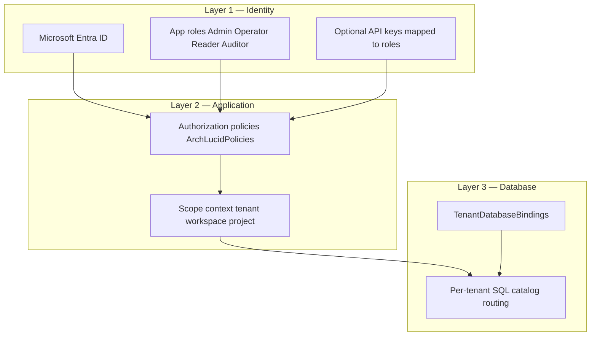

> **Reviewed:** 2026-07-29


> **Scope:** Buyer-safe security and procurement question-answer packet for V1 controlled pilots, plus the principal-architect falsification script (formerly `PRINCIPAL_ARCHITECT_FALSIFICATION_SCRIPT.md`), the Azure extractor InfoSec pre-read (formerly `AZURE_EXTRACTOR_INFOSEC_PREREAD.md`), the enterprise procurement FAQ (formerly `PROCUREMENT_FAQ.md`), the tenant isolation buyer overview (formerly the body of `TENANT_ISOLATION.md`; that filename remains a path-stable pack alias), the procurement response accelerator / SIG–CAIQ map (formerly the body of `PROCUREMENT_RESPONSE_ACCELERATOR.md`; that filename remains a path-stable alias), the security reviewer one-pager (formerly the body of `SECURITY_REVIEWER_ONE_PAGER.md`; that filename remains a path-stable pack alias), the procurement objection playbook / controlled-pilot drill (formerly the body of `PROCUREMENT_OBJECTION_PLAYBOOK.md`; that filename remains a path-stable alias for proof-language CI), the inbound-webhook security-reviewer handout (formerly the body of `SECURITY_REVIEWER_INBOUND_WEBHOOK_ONE_PAGER.md`; that filename remains a path-stable alias for GTM **M-126**), the prompt-injection resistance buyer one-pager (formerly the body of `PROMPT_INJECTION_RESISTANCE_BUYER_ONE_PAGER.md`; that filename remains a path-stable alias for GTM **M-115**), the security-reviewer audit-trail one-pager (formerly the body of `SECURITY_REVIEWER_AUDIT_TRAIL_ONE_PAGER.md`; that filename remains a path-stable alias for GTM **M-118**), the tenant-identity single-derivation PA one-pager (formerly the body of `TENANT_IDENTITY_SINGLE_DERIVATION_PA_ONE_PAGER.md`; that filename remains a path-stable alias for GTM **M-151**), the minimum pilot trust packet without CPA/3P pen test (formerly the body of `MINIMUM_PILOT_TRUST_PACKET_WITHOUT_CPA_PA_ONE_PAGER.md`; that filename remains a path-stable alias for GTM **M-191**), the model-failed vs quality-rejected one-pager (formerly the body of `MODEL_FAILED_VS_QUALITY_REJECTED_ONE_PAGER.md`; that filename remains a path-stable alias for GTM **M-124**), the execution-mode honesty one-pager (formerly the body of `EXECUTION_MODE_HONESTY_ONE_PAGER.md`; that filename remains a path-stable alias for GTM **M-128**), the Simulator-ROI sponsor forbid one-pager (formerly the body of `SIMULATOR_ROI_SPONSOR_FORBID_ONE_PAGER.md`; that filename remains a path-stable alias for GTM **M-139**), the interrupted-review buyer one-pager (formerly the body of `INTERRUPTED_REVIEW_BUYER_ONE_PAGER.md`; that filename remains a path-stable alias for GTM **M-122**), the first-security-review PA one-pager ship order (formerly the body of `FIRST_SECURITY_REVIEW_PA_ONE_PAGER_SHIP_ORDER_PA_ONE_PAGER.md`; that filename remains a path-stable alias for GTM **M-193**), the SOC 2 / pen-test honest procurement talk-track (formerly the body of `SOC2_PENTEST_HONEST_PROCUREMENT_TALK_TRACK_PA_ONE_PAGER.md`; that filename remains a path-stable alias for GTM **M-197**), the isolation-claims vs INV-001 / ADR 0037 handout (formerly the body of `ISOLATION_CLAIMS_VS_INV001_ADR0037_PA_ONE_PAGER.md`; that filename remains a path-stable alias for GTM **M-195**), the retrieval tenancy hit-guarantee handout (formerly the body of `RETRIEVAL_TENANCY_HIT_GUARANTEE_PA_ONE_PAGER.md`; that filename remains a path-stable alias for GTM **M-153**), the PilotStrict vs execution-mode handout (formerly the body of `PILOTSTRICT_VS_EXECUTION_MODE_PA_ONE_PAGER.md`; that filename remains a path-stable alias for GTM **M-167**), the committed golden-manifest unit-of-truth handout (formerly the body of `COMMITTED_GOLDEN_MANIFEST_UNIT_OF_TRUTH_PA_ONE_PAGER.md`; that filename remains a path-stable alias for GTM **M-155**), the operator primary-object + nav-collapse handout (formerly the body of `OPERATOR_PRIMARY_OBJECT_NAV_COLLAPSE_PA_ONE_PAGER.md`; that filename remains a path-stable alias for GTM **M-177**), the append-only / sealed-evidence handout (formerly the body of `APPEND_ONLY_SEALED_EVIDENCE_PA_ONE_PAGER.md`; that filename remains a path-stable alias for GTM **M-161**), and the Authority vs AgentTask loop handout (formerly the body of `AUTHORITY_VS_AGENTTASK_LOOP_PA_ONE_PAGER.md`; that filename remains a path-stable alias for GTM **M-159**), and the transactional finalize vs outbox handout (formerly the body of `TRANSACTIONAL_FINALIZE_VS_OUTBOX_PA_ONE_PAGER.md`; that filename remains a path-stable alias for GTM **M-163**), and the quality-gate versioning handout (formerly the body of `QUALITY_GATE_VERSIONING_PA_ONE_PAGER.md`; that filename remains a path-stable alias for GTM **M-130**), and the read-after-write client readiness handout (formerly the body of `READ_AFTER_WRITE_CLIENT_PA_ONE_PAGER.md`; that filename remains a path-stable alias for GTM **M-165**), and the finding disposition concurrency handout (formerly the body of `FINDING_CONCURRENT_DISPOSITION_RACE_PA_ONE_PAGER.md`; that filename remains a path-stable alias for GTM **M-141**), and the outbox replay vs idempotency handout (formerly the body of `TRANSACTIONAL_OUTBOX_REPLAY_IDEMPOTENCY_PA_ONE_PAGER.md`; that filename remains a path-stable alias for GTM **M-145**), and the LLM trust-boundary ingress handout (formerly the body of `LLM_TRUST_BOUNDARY_INGRESS_PA_ONE_PAGER.md`; that filename remains a path-stable alias for GTM **M-149**), and the Polly vs run-completeness handout (formerly the body of `POLLY_VS_RUN_LEVEL_SURFACE_PA_ONE_PAGER.md`; that filename remains a path-stable alias for GTM **M-147**), and the solo-operator pages vs support-email handout (formerly the body of `SOLO_OPERATOR_PAGES_VS_SUPPORT_EMAIL_PA_ONE_PAGER.md`; that filename remains a path-stable alias for GTM **M-143**), and the LLM budget reserve/settle handout (formerly the body of `LLM_BUDGET_RESERVE_SETTLE_PA_ONE_PAGER.md`; that filename remains a path-stable alias for GTM **M-132**), and the empty-scope catalog routing handout (formerly the body of `EMPTY_SCOPE_CATALOG_ROUTING_PA_ONE_PAGER.md`; that filename remains a path-stable alias for GTM **M-169**), and the process vs provider LLM idempotency handout (formerly the body of `AGENT_TASK_PROCESS_VS_PROVIDER_IDEMPOTENCY_PA_ONE_PAGER.md`; that filename remains a path-stable alias for GTM **M-171**), and the pre-finalize gate / SoD handout (formerly the body of `PRE_FINALIZE_GATE_BLOCK_VS_ADVISORY_SOD_PA_ONE_PAGER.md`; that filename remains a path-stable alias for GTM **M-173**), and the concurrent execute + commit race handout (formerly the body of `CONCURRENT_EXECUTE_AND_COMMIT_RACE_PA_ONE_PAGER.md`; that filename remains a path-stable alias for GTM **M-222**), and the GoldenManifest content-schema evolution handout (formerly the body of `MANIFEST_CONTENT_SCHEMA_EVOLUTION_PA_ONE_PAGER.md`; that filename remains a path-stable alias for GTM **M-224**), and the mature LLM cost-control plane handout (formerly the body of `LLM_COST_CONTROL_PLANE_PA_ONE_PAGER.md`; that filename remains a path-stable alias for GTM **M-226**), and the fine-tuning promotion decision record handout (formerly the body of `FINE_TUNING_PROMOTION_DECISION_RECORD_PA_ONE_PAGER.md`; that filename remains a path-stable alias for GTM **M-228**), and the Real-execute AOAI throttle policy handout (formerly the body of `REAL_EXECUTE_AOAI_THROTTLE_POLICY_PA_ONE_PAGER.md`; that filename remains a path-stable alias for GTM **M-230**), and the async orchestration first-force handout (formerly the body of `ASYNC_ORCHESTRATION_FIRST_FORCE_AND_RUN_STATE_MACHINE_PA_ONE_PAGER.md`; that filename remains a path-stable alias for GTM **M-232**), and the Container Apps Terraform authority + drift handout (formerly the body of `CONTAINER_APPS_TERRAFORM_AUTHORITY_AND_DRIFT_PA_ONE_PAGER.md`; that filename remains a path-stable alias for GTM **M-234**), and the policy-pack evaluation hybrid handout (formerly the body of `POLICY_PACK_EVALUATION_COMPILED_VS_DATA_PLANE_PA_ONE_PAGER.md`; that filename remains a path-stable alias for GTM **M-236**), and the 100× review-volume capacity handout (formerly the body of `REVIEW_VOLUME_100X_FAILURE_ORDER_AND_OPTION_PRESERVING_CAPACITY_PA_ONE_PAGER.md`; that filename remains a path-stable alias for GTM **M-238**), and the WNTP → UI buyer-risk matrix handout (formerly the body of `WHAT_NOT_TO_PROMISE_UI_BUYER_RISK_MATRIX_PA_ONE_PAGER.md`; that filename remains a path-stable alias for GTM **M-240**), and the Core Pilot happy-path stick/empty handout (formerly the body of `CORE_PILOT_HAPPY_PATH_STICK_AND_EMPTY_STATE_PA_ONE_PAGER.md`; that filename remains a path-stable alias for GTM **M-242**), and the why-not-ChatGPT/Copilot 2-min anchors handout (formerly the body of `WHY_NOT_CHATGPT_COPILOT_2MIN_LIVE_ANCHORS_PA_ONE_PAGER.md`; that filename remains a path-stable alias for GTM **M-244**), and the elevator pitch V1 claim-audit handout (formerly the body of `ELEVATOR_PITCH_V1_CLAIM_AUDIT_PA_ONE_PAGER.md`; that filename remains a path-stable alias for GTM **M-246**), and the AgentTask→decisioning ungated leak-seams handout (formerly the body of `AGENTTASK_DECISIONING_UNGATED_LEAK_SEAMS_PA_ONE_PAGER.md`; that filename remains a path-stable alias for GTM **M-248**), and the TB-881 org-registration race ship-blocker classification handout (formerly the body of `TB881_ORG_REGISTRATION_RACE_SHIP_BLOCKER_CLASSIFICATION_PA_ONE_PAGER.md`; that filename remains a path-stable alias for GTM **M-250**), and the owner ≤~50 specialty-help chrome handout (formerly the body of `OWNER_SCREENSHOT_BELOW_50_SPECIALTY_HELP_CHROME_PA_ONE_PAGER.md`; that filename remains a path-stable alias for GTM **M-252**), and the INV-001 / decide-once / committed-manifest triad handout (formerly the body of `INV001_DECIDE_ONCE_COMMITTED_MANIFEST_PA_TRIAD_ONE_PAGER.md`; that filename remains a path-stable alias for GTM **M-254**), and the tenant isolation DiD structural vs convention handout (formerly the body of `TENANT_ISOLATION_STRUCTURAL_VS_CONVENTION_PA_ONE_PAGER.md`; that filename remains a path-stable alias for GTM **M-256**), and the integration not-configured empty-state handout (formerly the body of `INTEGRATION_NOT_CONFIGURED_EMPTY_STATE_PA_ONE_PAGER.md`; that filename remains a path-stable alias for GTM **M-258**), and the `/live-demo` vs `/see-it` safe-ladder handout (formerly the body of `LIVE_DEMO_SEE_IT_LADDER_PA_ONE_PAGER.md`; that filename remains a path-stable alias for GTM **M-260**), and the bake-off 15-min loser-sequence handout (formerly the body of `BAKEOFF_15MIN_LOSER_SEQUENCE_PA_ONE_PAGER.md`; that filename remains a path-stable alias for GTM **M-262**), and the weekly buyer-claim drift SEND/REWRITE handout (formerly the body of `WEEKLY_BUYER_CLAIM_DRIFT_PA_ONE_PAGER.md`; that filename remains a path-stable alias for GTM **M-264**), and the GDPR erasure vs append-only handout (formerly the body of `GDPR_ERASURE_VS_APPEND_ONLY_PA_ONE_PAGER.md`; that filename remains a path-stable alias for GTM **M-266**), and the offline-verifiable export portability handout (formerly the body of `OFFLINE_VERIFIABLE_EXPORT_PORTABILITY_PA_ONE_PAGER.md`; that filename remains a path-stable alias for GTM **M-268**), and the evidence backup/restore vs tamper handout (formerly the body of `EVIDENCE_BACKUP_RESTORE_INVARIANT_PA_ONE_PAGER.md`; that filename remains a path-stable alias for GTM **M-270**), and the project soft-delete vs sealed-evidence residue handout (formerly the body of `PROJECT_SOFT_DELETE_SEALED_EVIDENCE_PA_ONE_PAGER.md`; that filename remains a path-stable alias for GTM **M-272**), and the AOAI model-retirement claim-survival handout (formerly the body of `AOAI_MODEL_RETIREMENT_REPRO_PA_ONE_PAGER.md`; that filename remains a path-stable alias for GTM **M-274**; `AOAI_RETIREMENT_CLAIM_SURVIVAL_PA_ONE_PAGER.md` is a secondary path-stable alias), and the paying-tenant spend-storm + metering reconciliation handout (formerly the body of `PAYING_TENANT_LLM_SPEND_STORM_PA_ONE_PAGER.md`; that filename remains a path-stable alias for GTM **M-295**; `PAYING_TENANT_SPEND_CONTROLS_METERING_RECONCILIATION_PA_ONE_PAGER.md` is a secondary path-stable alias), and the shared AOAI TPM noisy-neighbor fairness handout (formerly the body of `SHARED_AOAI_TPM_NOISY_NEIGHBOR_PA_ONE_PAGER.md`; that filename remains a path-stable alias for GTM **M-297**; `SHARED_TPM_FAIRNESS_PA_ONE_PAGER.md` is a secondary path-stable alias), and the customer policy-pack sandbox / pin / blast-radius handout (formerly the body of `POLICY_PACK_CUSTOMER_RULE_SANDBOX_PA_ONE_PAGER.md`; that filename remains a path-stable alias for GTM **M-299**; `CUSTOMER_POLICY_PACK_SANDBOX_PIN_BLAST_RADIUS_PA_ONE_PAGER.md` is a secondary path-stable alias), and the launch-load failure-order + graceful degradation handout (formerly the body of `LAUNCH_LOAD_FAILURE_ORDER_DEGRADATION_PA_ONE_PAGER.md`; that filename remains a path-stable alias for GTM **M-183**), and the marketing static vs anonymous-live vs tenant boundary handout (formerly the body of `MARKETING_STATIC_VS_LIVE_DEMO_BOUNDARY_PA_ONE_PAGER.md`; that filename remains a path-stable alias for GTM **M-179**), and the strangler next-slice / `/result` sunset handout (formerly the body of `STRANGLER_NEXT_SLICE_RESULT_SUNSET_PA_ONE_PAGER.md`; that filename remains a path-stable alias for GTM **M-185**), and the competitive deal-loss + closing-evidence handout (formerly the body of `COMPETITIVE_DEAL_LOSS_CLOSING_EVIDENCE_PA_ONE_PAGER.md`; that filename remains a path-stable alias for GTM **M-187**), and the Stage 0 claim allowlist vs oversell handout (formerly the body of `STAGE_0_CLAIM_ALLOWLIST_VS_OVERSELL_PA_ONE_PAGER.md`; that filename remains a path-stable alias for GTM **M-189**), and the residual layer-leak / irreversible-bug ranking handout (formerly the body of `LAYER_BOUNDARY_IRREVERSIBLE_LEAK_PA_ONE_PAGER.md`; that filename remains a path-stable alias for GTM **M-157**), and the comparison/replay immutable-snapshot handout (formerly the body of `COMPARISON_REPLAY_IMMUTABLE_SNAPSHOT_PA_ONE_PAGER.md`; that filename remains a path-stable alias for GTM **M-175**), and the first-15 / package-spine IA handout (formerly the body of `PA_FIRST_15_PACKAGE_SPINE_IA_PA_ONE_PAGER.md`; that filename remains a path-stable alias for GTM **M-181**), and the shared hallucination defense-plane handout (formerly the body of `SHARED_HALLUCINATION_DEFENSE_PLANE_PA_ONE_PAGER.md`; that filename remains a path-stable alias for GTM **M-212**), and the demo/anonymous read-plane structural isolation handout (formerly the body of `DEMO_ANONYMOUS_READ_PLANE_PA_ONE_PAGER.md`; that filename remains a path-stable alias for GTM **M-218**), and the decision-grade finding provenance fail-closed handout (formerly the body of `DECISION_GRADE_FINDING_PROVENANCE_FAIL_CLOSED_PA_ONE_PAGER.md`; that filename remains a path-stable alias for GTM **M-208**), and the faithfulness/support-ratio scoring-lane positioning handout (formerly the body of `FAITHFULNESS_SUPPORT_RATIO_SCORING_LANE_POSITIONING_PA_ONE_PAGER.md`; that filename remains a path-stable alias for GTM **M-210**), and the tenant DiD erosion / beyond-predicate enforcement handout (formerly the body of `TENANT_DID_EROSION_BEYOND_PREDICATES_PA_ONE_PAGER.md`; that filename remains a path-stable alias for GTM **M-214**), and the Azure workload privilege-escalation seam handout (formerly the body of `AZURE_WORKLOAD_PRIVILEGE_ESCALATION_SEAM_PA_ONE_PAGER.md`; that filename remains a path-stable alias for GTM **M-216**), and the Dapper/DDL/satellite breakdown signals + strategy-ladder handout (formerly the body of `DAPPER_DDL_SATELLITE_BREAKDOWN_SIGNALS_PA_ONE_PAGER.md`; that filename remains a path-stable alias for GTM **M-220**), and the agent→decisioning Real-variance isolation handout (formerly the body of `AGENT_OUTPUT_DECISIONING_REAL_VARIANCE_ISOLATION_PA_ONE_PAGER.md`; that filename remains a path-stable alias for GTM **M-204**), and the golden-cohort re-lock vs rubber-stamp handout (formerly the body of `GOLDEN_COHORT_RELOCK_VS_RUBBER_STAMP_PA_ONE_PAGER.md`; that filename remains a path-stable alias for GTM **M-202**), and the post-strangler residual coupling / discipline-test retirement handout (formerly the body of `POST_STRANGLER_RESIDUAL_COUPLING_DISCIPLINE_TEST_RETIREMENT_PA_ONE_PAGER.md`; that filename remains a path-stable alias for GTM **M-206**), and the architecture reasoning system / honest-uncertainty / benchmark-integrity handout (formerly the body of `ARCHITECTURE_REASONING_SYSTEM_PA_ONE_PAGER.md`; that filename remains a path-stable alias for GTM **M-300** / **M-303** / **M-304**), and the dual hasher / projection evolution handout (formerly the body of `MANIFEST_DUAL_HASHER_PROJECTION_EVOLUTION_PA_ONE_PAGER.md`; that filename remains a path-stable alias for GTM **M-199**). This packet only describes existing controls and evidence. It does **not** claim SOC 2 CPA, third-party penetration test, ISO 27001, or any unavailable external assurance.

> **Spine doc:** [`START_HERE.md`](../START_HERE.md).

# Buyer security and procurement packet

**Audience:** Procurement reviewers, security reviewers, GRC teams, CISOs, and enterprise buyers evaluating ArchLucid for a controlled pilot.

**Last reviewed:** 2026-07-29

**Review checklist owner:** Founder / ArchLucid operator. Re-validate before each new buyer conversation.

---

## Isolation one-pager (M-114) {#isolation-one-pager-m-114}

**Claim (G3):** Authenticated identity binds tenant/workspace scope; client-supplied scope headers cannot override that binding on production-like hosts.

| Statement | Meaning |
| --- | --- |
| Identity wins | JWT or API-key subject resolves tenant/workspace; forged `x-tenant-id` and actor headers do not steer reads or writes |
| Database-per-tenant default | Customer data uses a tenant-scoped database catalog where configured |
| SingleCatalog boundary | CI, local, and controlled demo only; not the default production isolation story |
| Fail closed | Scope-sensitive APIs deny (typically **403**) when headers disagree with identity |

Reviewer check: authenticate as Tenant A on a JwtBearer or ApiKey host, submit a scope-sensitive request with a forged Tenant B header, and expect a denial rather than Tenant B payload. Ask for the latest **TB-948** isolation evidence artifact where an attachment is required. Do not treat DevBypass or test actor headers as production-safe; production-like hosts must reject them (**TB-949**).

| Concern | Posture |
| --- | --- |
| Security | Least privilege: identity is authoritative; headers cannot expand scope |
| Scalability | Per-tenant catalogs scale independently |
| Reliability | Mismatches fail closed rather than serving mixed scope |
| Cost | Middleware and catalog routing; no third-party isolation SaaS required for this V1 claim |

Full technical narrative: [Tenant isolation (buyer overview)](#tenant-isolation-buyer-overview). Live review: [principal architect falsification script](#principal-architect-falsification-script-m-113) below.

## Tenant identity single derivation (M-151) {#tenant-identity-single-derivation-m-151}

Former standalone body: `docs/go-to-market/TENANT_IDENTITY_SINGLE_DERIVATION_PA_ONE_PAGER.md` → this section (filename kept as a path-stable alias for GTM **M-151**). **Must** before first security review per **M-192** / **TB-1120**. Complements [Isolation one-pager (M-114)](#isolation-one-pager-m-114). Layer B of tenant isolation. Not an assurance attestation.

**Path-stable alias:** [`TENANT_IDENTITY_SINGLE_DERIVATION_PA_ONE_PAGER.md`](TENANT_IDENTITY_SINGLE_DERIVATION_PA_ONE_PAGER.md).

**Audience:** Principal architects and security reviewers probing multi-tenant identity binding.

**Claim:** Production-like hosts derive tenant/workspace/project **once** at the host boundary into typed `ScopeContext`. Client `x-tenant-id` (and peer headers) do **not** establish production tenant identity. Application and Persistence layers must **not** re-parse JWT/headers for tenant. SQL RLS is **not** a deployed control (ADR 0037).

### Statement / meaning

| Statement | Meaning |
| --- | --- |
| Decide once | Host middleware / auth resolves scope from trusted identity (JWT app roles or mapped API key) into `ScopeContext` before application and persistence work |
| Trusted production sources | JWT/API-key claims and explicit background-job ambient scope are trusted |
| Headers are not authority | Forged or mismatched `x-tenant-id` / workspace / project headers fail closed on production-like hosts (**M-114** / **TB-925**); they cannot establish scope |
| Typed handoff | `IScopeContextProvider` or explicit parameters carry the resolved scope downward |
| Forbidden layers | Application/Persistence must not touch `HttpContext` / `ClaimsPrincipal` to re-derive tenant (ARCH001 / **TB-999**) |
| Jobs / ambient | Background work carries explicit or ambient scope from the enqueue boundary — not a fresh header parse |
| Route `{tenantId}` | Route values are validated against identity scope; they are not a second source of truth |

### Boundary matrix

| Layer | Allowed | Forbidden |
| --- | --- | --- |
| Host / API boundary | Resolve identity claims and route binding | Accept header-only scope in production-like hosts |
| Application / Persistence | Consume `ScopeContext` | Re-derive tenant identity from `HttpContext` or `ClaimsPrincipal` |
| Background job | Use `AmbientScopeContext` override | Use development default scope as production authority |

### Too strong vs safe

| Too strong | Safe |
| --- | --- |
| “`x-tenant-id` selects the tenant” | Identity wins; headers cannot expand scope |
| “NetArchTest / layer tests prove isolation” | DAG guards help; isolation is catalogs + INV-001 + retrieval filters (**M-156**) |
| “SQL RLS isolates tenants” | ADR 0037 — RLS is non-control; database-per-tenant + predicates |
| “Empty TenantId returns no rows” | Empty/untyped scope routing risks — see [Empty-scope catalog routing (M-169)](#empty-scope-catalog-routing-m-169) |

### Reviewer check

1. Authenticate as Tenant A; send a scope-sensitive API call with a forged Tenant B header → expect **403** / denial, not Tenant B data (**M-113** Claim-1).
2. Ask which assemblies may read `HttpContext` for tenant — expect host-only list.
3. Confirm route `{tenantId}` binding is checked against resolved identity scope.
4. Ask how background jobs receive scope: explicit ambient scope from enqueue, not request headers.
5. Confirm DevBypass / test actor headers are rejected on production-like hosts (**TB-949** residual language).

### Posture

| Concern | Posture |
| --- | --- |
| Security | Least privilege; single derivation reduces confused-deputy / header-steering classes |
| Scalability | Per-tenant catalogs; typed scope propagates without a separate identity lookup per repository call |
| Reliability | Fail closed on mismatch; no silent header override on production-like hosts |
| Cost | Middleware / host logic only; no per-tenant IdP or SQL RLS product required for this V1 claim |

### Residuals (honest)

Engineering SoT: [`TENANT_IDENTITY_SINGLE_DERIVATION_CONTRACT.md`](../library/TENANT_IDENTITY_SINGLE_DERIVATION_CONTRACT.md) (**TB-999** Done). **INV-001** and Layer B are implemented; **ARCH001** prohibits lower assemblies from using `HttpContext`/`ClaimsPrincipal` for this purpose. Follow-on claim CI: **TB-1000**. Too-strong inventory / stale RLS purge: **M-194** / **TB-1122**. DiD erosion after provider exists: **M-213** / **TB-1232** — see [Tenant DiD erosion (M-214)](#tenant-did-erosion-beyond-predicates-m-214). Retrieval hit tenancy (Search `$filter`): **M-152** / **M-153**. This is Layer B defense in depth; Layer A database-per-tenant routing remains the primary paying-client isolation boundary.

**Deep reference:** [`../library/TENANT_IDENTITY_SINGLE_DERIVATION_CONTRACT.md`](../library/TENANT_IDENTITY_SINGLE_DERIVATION_CONTRACT.md) · [`../security/TENANT_ISOLATION_DEFENSE_IN_DEPTH.md`](../security/TENANT_ISOLATION_DEFENSE_IN_DEPTH.md) Layer B · [Isolation one-pager (M-114)](#isolation-one-pager-m-114) · [Empty-scope catalog routing (M-169)](#empty-scope-catalog-routing-m-169) · [Isolation claims vs INV-001 / ADR 0037 (M-195)](#isolation-claims-vs-inv001-adr0037-m-195) · [Tenant DiD erosion (M-214)](#tenant-did-erosion-beyond-predicates-m-214) · [Tenant isolation (buyer overview)](#tenant-isolation-buyer-overview) · [`PA_CLAIM_HONESTY_INDEX.md`](PA_CLAIM_HONESTY_INDEX.md).

## Empty scope and catalog routing (M-169) {#empty-scope-catalog-routing-m-169}

Former standalone body: `docs/go-to-market/EMPTY_SCOPE_CATALOG_ROUTING_PA_ONE_PAGER.md` → this section (filename kept as a path-stable alias for GTM **M-169** / **TB-1018**). Complements [Tenant identity (M-151)](#tenant-identity-single-derivation-m-151) and [Isolation claims (M-195)](#isolation-claims-vs-inv001-adr0037-m-195). Not an assurance attestation.

**Path-stable alias:** [`EMPTY_SCOPE_CATALOG_ROUTING_PA_ONE_PAGER.md`](EMPTY_SCOPE_CATALOG_ROUTING_PA_ONE_PAGER.md).

**Audience:** Principal architects and security reviewers.

**Decision:** Database-per-tenant catalogs are structural isolation; empty or omitted scope can still route to the system catalog or omit predicates — not “no data.”

### Routing failure modes

| Condition | Current behavior | Risk |
| --- | --- | --- |
| Empty `TenantId` on per-tenant deployment | Routes to system catalog | Cross-tenant data if query lacks predicate |
| SingleCatalog mode | Predicate-only boundary | Omitted `WHERE TenantId` exposes rows |
| `AllowUnscopedRoute` exceptions | Explicit unscoped paths | Must be inventoried and justified |
| Wrong catalog binding | Silent wrong-database access | Irreversible cross-tenant exposure |

Typed `ScopeContext` and `ScopedRoutingSqlConnectionFactory` enforce intended routing when scope is present. They do not make unscoped SQL safe.

### PA test

1. Trace scope from identity through to SQL connection factory selection.
2. Attempt an empty-scope product query and expect fail-closed or explicit system-catalog behavior — not silent broad reads.
3. Inspect SingleCatalog queries for mandatory tenant predicates.
4. List allowlisted unscoped routes and confirm each is documented.

### Claim boundary

Do not say “database-per-tenant means unscoped queries return nothing,” “empty TenantId is safe,” or “SQL RLS protects production.” Say typed scope is required for product SQL and name Empty→system-catalog and predicate-only risks.

### Residuals (honest)

- **TB-1018** maps catalog-routing failure modes.
- **TB-1019** guards claim drift.
- Demo/anonymous structural target remains **M-217** / **TB-1251** — see [Demo/anonymous read plane (M-218)](#demo-anonymous-read-plane-m-218).

**Related:** [Tenant identity (M-151)](#tenant-identity-single-derivation-m-151) · [Isolation claims (M-195)](#isolation-claims-vs-inv001-adr0037-m-195) · [Demo/anonymous read plane (M-218)](#demo-anonymous-read-plane-m-218) · [Layer residual / irreversible leak (M-157)](#layer-boundary-irreversible-leak-m-157) · [Isolation one-pager (M-114)](#isolation-one-pager-m-114) · [ADR 0037](../architecture/adrs/0037-tenant-isolation-without-rls-defense-in-depth.md) · [`../security/TENANT_ISOLATION_DEFENSE_IN_DEPTH.md`](../security/TENANT_ISOLATION_DEFENSE_IN_DEPTH.md) · [Tenant isolation (buyer overview)](#tenant-isolation-buyer-overview) · [`PA_CLAIM_HONESTY_INDEX.md`](PA_CLAIM_HONESTY_INDEX.md).

## Isolation claims vs INV-001 / ADR 0037 (M-195) {#isolation-claims-vs-inv001-adr0037-m-195}

Former standalone body: `docs/go-to-market/ISOLATION_CLAIMS_VS_INV001_ADR0037_PA_ONE_PAGER.md` → this section (filename kept as a path-stable alias for GTM **M-195** / **TB-1122**). Complements [Isolation one-pager (M-114)](#isolation-one-pager-m-114) and [Tenant identity (M-151)](#tenant-identity-single-derivation-m-151). Does not reopen SQL RLS as a production control.

**Path-stable alias:** [`ISOLATION_CLAIMS_VS_INV001_ADR0037_PA_ONE_PAGER.md`](ISOLATION_CLAIMS_VS_INV001_ADR0037_PA_ONE_PAGER.md).

**Audience:** Security reviewers and principal architects challenging tenancy language.

**Claim:** Safe pin = **database-per-tenant** + **INV-001 decide-once** + **M-114** identity-wins. Do **not** cite SQL RLS as a deployed production control. Do not treat workspace/project as the paying-client security boundary. Do not claim G3 as cryptographically proven isolation — G3 means catalog + decide-once + Search filter DiD are reviewable (see **TB-1122**). Do not promise per-tenant Search index / crypto-proof retrieval / NetArchTest-alone isolation.

**Engineering SoT:** [`../library/ISOLATION_CLAIMS_TOO_STRONG_VS_INV001_ADR0037_CONTRACT.md`](../library/ISOLATION_CLAIMS_TOO_STRONG_VS_INV001_ADR0037_CONTRACT.md) (**TB-1122**). Honesty CI: **TB-1123** (**Done** — `check_isolation_claims_too_strong_honesty.py`).

### Too strong vs safe

| Too strong | Safe |
| --- | --- |
| “SQL RLS isolates tenants” | ADR 0037 — RLS is non-control |
| “NetArchTest proves isolation” | Compile-time DAG ≠ runtime tenancy (**M-156**) |
| “Per-tenant Search index / crypto-proof retrieval” | Mandatory OData `$filter` (**M-152**/**M-153**) |
| “Empty TenantId returns no data” | Empty-scope routing risks — [M-169](#empty-scope-catalog-routing-m-169) |
| “G3 PASS = fully proven isolation” | Soften: catalog + decide-once shipped; residual DiD erosion **TB-1233** (**TB-1123** honesty CI Done) |

### Stale language purge

Remove buyer-facing “RLS protects production” / “headers select tenant” / “architecture tests = isolation proof.” Point to [`../security/TENANT_ISOLATION_DEFENSE_IN_DEPTH.md`](../security/TENANT_ISOLATION_DEFENSE_IN_DEPTH.md) + [Isolation one-pager (M-114)](#isolation-one-pager-m-114).

**Related:** [Tenant identity (M-151)](#tenant-identity-single-derivation-m-151) · [Retrieval tenancy hit guarantee (M-153)](#retrieval-tenancy-hit-guarantee-m-153) · [Tenant DiD erosion (M-214)](#tenant-did-erosion-beyond-predicates-m-214) · **M-255** (DiD classification) · [`PA_CLAIM_HONESTY_INDEX.md`](PA_CLAIM_HONESTY_INDEX.md).

## Retrieval tenancy — what a hit guarantees (M-153) {#retrieval-tenancy-hit-guarantee-m-153}

Former standalone body: `docs/go-to-market/RETRIEVAL_TENANCY_HIT_GUARANTEE_PA_ONE_PAGER.md` → this section (filename kept as a path-stable alias for GTM **M-153** / **TB-1001**). Complements [Isolation one-pager (M-114)](#isolation-one-pager-m-114) and [Isolation claims (M-195)](#isolation-claims-vs-inv001-adr0037-m-195). Not an assurance attestation.

**Path-stable alias:** [`RETRIEVAL_TENANCY_HIT_GUARANTEE_PA_ONE_PAGER.md`](RETRIEVAL_TENANCY_HIT_GUARANTEE_PA_ONE_PAGER.md).

**Audience:** Principal architects and security reviewers.

**Claim:** Ask, Azure AI Search, and Graph-RAG require the same identity-bound scope; they do **not** use a per-tenant Search index or cryptographic proof of isolation. A hit cannot be another paying tenant’s chunk when filters are enforced.

### Control path

| Step | Current control | Boundary |
| --- | --- | --- |
| Query | Required OData tenant/workspace/project filter | Empty scope throws |
| Upsert | Scope mismatch fails closed | Not a separate index |
| Graph expansion | `GetByIdAsync(scope, …)` reuses scope | No unscoped second search |
| Platform corpus | `Guid.Empty` denotes intentional shared content | Must be explicitly labelled |

Done **TB-071** builds required filters and Done **TB-604** rejects scope-mismatched writes. These controls complement database-per-tenant catalog routing; they do not replace it.

### Reviewer check

1. Query as Tenant A with a forged Tenant B identifier.
2. Confirm the required filter is derived from authoritative scope.
3. Attempt an empty or mismatched scope and expect a failure, not broad retrieval.
4. Identify intentional platform corpus hits separately from tenant content.

### Too strong vs safe

| Too strong | Safe |
| --- | --- |
| “Each tenant has a dedicated Search index” | Shared index + mandatory scope `$filter` |
| “Filters are optional” | Empty / mismatched scope fails closed |
| “A Search hit is cryptographic isolation proof” | Identity-bound filter + fail-closed upsert; not crypto tenancy |

### Residuals (honest)

Engineering SoT: [`RETRIEVAL_TENANCY_HIT_GUARANTEE_CONTRACT.md`](../library/RETRIEVAL_TENANCY_HIT_GUARANTEE_CONTRACT.md) (**TB-1001** Done). Query filter (**TB-071**), upsert validation (**TB-604**), and scoped Graph-RAG expand are implemented; platform `Guid.Empty` corpus is intentional shared content. Follow-on claim CI: **TB-1002**. DiD erosion / wrong-scope upstream: **M-213** / **TB-1232**. Complements Layer A catalogs and INV-001; does not claim a per-tenant Search service or cryptographic isolation.

| Open work | Purpose |
| --- | --- |
| **TB-1002** | Claim-drift regression guard (anti per-tenant-index / filter-optional) |

**Related:** [`../library/RETRIEVAL_TENANCY_HIT_GUARANTEE_CONTRACT.md`](../library/RETRIEVAL_TENANCY_HIT_GUARANTEE_CONTRACT.md) · [`../security/ASK_RAG_THREAT_MODEL.md`](../security/ASK_RAG_THREAT_MODEL.md) · [`../security/TENANT_ISOLATION_DEFENSE_IN_DEPTH.md`](../security/TENANT_ISOLATION_DEFENSE_IN_DEPTH.md) · [ADR 0037](../architecture/adrs/0037-tenant-isolation-without-rls-defense-in-depth.md) · [Isolation claims (M-195)](#isolation-claims-vs-inv001-adr0037-m-195) · [`PA_CLAIM_HONESTY_INDEX.md`](PA_CLAIM_HONESTY_INDEX.md).

## Prompt-injection resistance (M-115) {#prompt-injection-resistance-m-115}

Former standalone body: `docs/go-to-market/PROMPT_INJECTION_RESISTANCE_BUYER_ONE_PAGER.md` → this section (filename kept as a path-stable alias for GTM **M-115**). Complements [Isolation one-pager (M-114)](#isolation-one-pager-m-114). Not an assurance attestation.

**Path-stable alias:** [`PROMPT_INJECTION_RESISTANCE_BUYER_ONE_PAGER.md`](PROMPT_INJECTION_RESISTANCE_BUYER_ONE_PAGER.md).

**Audience:** Security reviewers, principal architects, CISOs evaluating ArchLucid AI review agents.

**Claim:** Customer docs and repo content are treated as **DATA**. Resistance is **host confinement** (structured ingress, tool allowlists, no model-driven exfil loop) — not “we sanitize every PDF.” Residual injection risk is stated; Azure AI Content Safety is a **gate**, not the product.

### Statement / meaning

| Statement | Meaning |
| --- | --- |
| Data, not instructions | Architecture briefs, uploaded docs, and repo excerpts enter the model as untrusted content inside host-composed prompts |
| Confinement over filtering | Safety comes from what the host allows the agent to *do* (tools, side effects, egress), not from promising perfect prompt hygiene |
| Content Safety ≠ product | Azure AI Content Safety (and related) may block or label unsafe content; that does not make ArchLucid “injection-proof” |
| Residual risk | A determined injector can still influence **finding text**; they must not gain HTTP/shell/ITSM tool loops or cross-tenant reads via the model |

### Too strong vs safe

| Too strong | Safe |
| --- | --- |
| “Prompt-injection proof” / “we sanitize architecture PDFs” | Host-composed ingress + structured evidence paths; residual influence on prose |
| “Empty AllowedTools means the agent can do anything” | Tool dispatch is constrained (**TB-082**); production-like hosts deny empty/null allowlists (**TB-950** Done); unrestricted requires an explicit `*` sentinel |
| “Content Safety makes us enterprise-safe alone” | Content Safety is one gate; isolation + audit + mode labels remain separate claims |

### Reviewer check

1. Ask which surfaces feed the model (brief, attachments, retrieval chunks) and confirm they are labeled/quarantined as DATA in the composer contract (**TB-949**).
2. Ask whether the model can open arbitrary URLs, shells, or create ITSM tickets via a tool loop — expect **no** unconstrained tool-loop for those side effects (**M-149** / **TB-997**).
3. Do **not** accept “we filter the PDF” as the primary control story.

### Posture

| Concern | Posture |
| --- | --- |
| Security | Least privilege on tools; identity/scope still wins (**M-114**); injection ≠ tenant escape |
| Scalability | Confinement is per-request host logic; no per-doc manual sanitize farm |
| Reliability | Fail closed on unsafe tool use; finding-text influence remains a quality/audit concern |
| Cost | Content Safety + token spend; no third-party “prompt firewall” product required for this claim |

### Residuals (honest)

- Engineering **TB-949** (**Done** — composer DATA delimiters / hygiene contract). **TB-950** (**Done** — production-like empty `AllowedTools` fail-closed). **TB-951** (**Done** — indirect doc/README corpus + honest `expectedContained` residual). Residual open: **TB-952** (side-effect inventory).
- Extend claim guardrails: **M-116**; deeper ingress vs impossible matrix: [LLM trust boundary (M-149)](#llm-trust-boundary-ingress-m-149).

**Related:** [Isolation one-pager (M-114)](#isolation-one-pager-m-114) · [LLM trust boundary (M-149)](#llm-trust-boundary-ingress-m-149) · [`PA_CLAIM_HONESTY_INDEX.md`](PA_CLAIM_HONESTY_INDEX.md) · [`PUBLIC_CLAIM_BOUNDARY_GUIDE.md#gtm-do-not-promise`](../library/PUBLIC_CLAIM_BOUNDARY_GUIDE.md#gtm-do-not-promise).

## LLM trust boundary — ingress vs impossible (M-149) {#llm-trust-boundary-ingress-m-149}

Former standalone body: `docs/go-to-market/LLM_TRUST_BOUNDARY_INGRESS_PA_ONE_PAGER.md` → this section (filename kept as a path-stable alias for GTM **M-149** / **TB-997**). Extends [Prompt-injection resistance (M-115)](#prompt-injection-resistance-m-115). Not an assurance attestation.

**Path-stable alias:** [`LLM_TRUST_BOUNDARY_INGRESS_PA_ONE_PAGER.md`](LLM_TRUST_BOUNDARY_INGRESS_PA_ONE_PAGER.md).

**Audience:** Principal architects and security reviewers assessing AI agent boundaries.

**Claim:** Promise **host-composed ingress** and **no model tool-loop** for HTTP/shell/ITSM side effects. Do **not** promise injection-proof customer docs or that the model cannot influence findings text. Empty `AllowedTools` on production-like hosts is fail-closed (**TB-950** Done).

### Ingress / impossible matrix

| Boundary question | Current posture |
| --- | --- |
| What enters the model? | Host-selected request data, evidence package, technology ledger, and retrieval context |
| Can model output alter finding prose? | Yes; output quality and governance controls must evaluate it |
| Can it call arbitrary HTTP or shell tools? | No model-driven tool loop for those capabilities |
| Can it create ITSM work directly? | No model-driven ITSM side-effect loop |
| Are all tool states fail-closed? | Yes on production-like hosts: empty/null `AllowedTools` denies dispatch (**TB-950**); unrestricted requires explicit `*` sentinel |

### What enters the model

| Ingress | Treatment |
| --- | --- |
| Brief / attachments / repo excerpts | Untrusted DATA in host-composed prompts |
| Retrieval chunks | Scoped hits only (**M-152** / **M-153**) |
| Prior agent prose | May influence later findings — quarantine vs package rules |

### Structurally impossible (intent)

| Side effect | Expectation |
| --- | --- |
| Arbitrary HTTP/shell from model tool-loop | Not allowed |
| ITSM create via unconstrained model tools | Not allowed |
| Cross-tenant read via prompt alone | Blocked by identity/scope (**M-114** / **M-151**) — not by “filtering the PDF” |

### Too strong vs safe

| Too strong | Safe |
| --- | --- |
| “Customer documents are injection-proof” | Untrusted content enters a host-composed, confined model boundary |
| “The model cannot influence findings” | It can influence generated text; it cannot directly invoke the listed side-effect loops |
| “Tool allowlists are complete” / “Empty AllowedTools is unsafe forever” | Dispatch guarding is shipped (**TB-082** Done); production-like empty/null `AllowedTools` fail-closed (**TB-950** Done); unrestricted requires explicit `*` |

### Reviewer check

1. Identify the host-owned inputs to a representative completion request.
2. Ask whether output can invoke HTTP, shell, or ITSM actions without host code.
3. Confirm the treatment of an empty `AllowedTools` list before accepting an allowlist claim.

### Posture

| Concern | Posture |
| --- | --- |
| Security | Host-composed ingress and constrained tools reduce model-directed side effects |
| Scalability | Boundary enforcement is host-side and applies consistently per completion |
| Reliability | Content Safety can gate content but does not eliminate influence on text |
| Cost | No claim of a separate prompt-firewall service; model use still consumes tokens |

### Residuals (honest)

Engineering SoT: [`LLM_TRUST_BOUNDARY_INGRESS_CONFINEMENT_CONTRACT.md`](../library/LLM_TRUST_BOUNDARY_INGRESS_CONFINEMENT_CONTRACT.md) (**TB-997** Done). **TB-082** / **TB-949** / **TB-950** / **TB-951** are Done; residual side-effect inventory remains **TB-952**. Follow-on claim CI: **TB-998**. This does not promise prompt-injection proof; see [M-115](#prompt-injection-resistance-m-115) / **M-116**.

**Related:** [Prompt-injection resistance (M-115)](#prompt-injection-resistance-m-115) · [Retrieval tenancy (M-153)](#retrieval-tenancy-hit-guarantee-m-153) · [`../library/LLM_TRUST_BOUNDARY_INGRESS_CONFINEMENT_CONTRACT.md`](../library/LLM_TRUST_BOUNDARY_INGRESS_CONFINEMENT_CONTRACT.md) · [`../security/SYSTEM_THREAT_MODEL.md`](../security/SYSTEM_THREAT_MODEL.md) · [`PUBLIC_CLAIM_BOUNDARY_GUIDE.md#gtm-do-not-promise`](../library/PUBLIC_CLAIM_BOUNDARY_GUIDE.md#gtm-do-not-promise) · [`PA_CLAIM_HONESTY_INDEX.md`](PA_CLAIM_HONESTY_INDEX.md).

## Security reviewer audit trail (M-118) {#security-reviewer-audit-trail-m-118}

Former standalone body: `docs/go-to-market/SECURITY_REVIEWER_AUDIT_TRAIL_ONE_PAGER.md` → this section (filename kept as a path-stable alias for GTM **M-118**). **Must** before first security review per **M-192** / **TB-1120**. Complements [Isolation one-pager (M-114)](#isolation-one-pager-m-114). Not an assurance attestation.

**Path-stable alias:** [`SECURITY_REVIEWER_AUDIT_TRAIL_ONE_PAGER.md`](SECURITY_REVIEWER_AUDIT_TRAIL_ONE_PAGER.md).

**Audience:** Security reviewers and principal architects verifying governance dispositions leave a durable trail.

**Claim:** **Required** governance / finalize / identity / export events use fail-closed durable audit write (**TB-953** Done — `LogOrThrow`). Cost, projection, and funnel telemetry may remain **informational / best-effort** (**TB-001** posture). Not every audit event is same-transaction with the domain write until **TB-956**.

### Statement / meaning

| Statement | Meaning |
| --- | --- |
| Required = fail-closed | Indefensible paths (approve/reject/waive, finalize/promote, identity/role, export attest) must leave a durable `AuditEvents` row or the operation fails |
| Informational = best-effort | Cost/projection/funnel-style events may use retry-then-swallow; losing them is undesirable, not a governance integrity break |
| Append-only trail | Corrections append; do not promise an editable audit log — see [Append-only and sealed evidence (M-161)](#append-only-sealed-evidence-m-161) |
| Dual-write residual | Domain success with missing Required row is the defect class **TB-954**/**TB-955** harden; same-TX / outbox for hottest paths is **TB-956** |

### Too strong vs safe

| Too strong | Safe |
| --- | --- |
| “Every audit event is transactional” | Required set is fail-closed durable; informational may be best-effort |
| “Approve always left a trail even before TB-953” | Pre-migration `TryLogAsync` swallow risk — **TB-953** closed that for Required paths |
| “Same database transaction as the disposition today” | Durable write + retry; same-TX / transactional outbox is **TB-956** (open) |
| “Append-only means immutable external storage” | Application audit trail — not WORM storage or a PKI-signed ledger |

### Reviewer check

1. Perform (or witness) a governance disposition on a pilot host; confirm an `AuditEvents` row for that action type.
2. Ask for the Required vs informational split (INV-003 / **TB-953** tip) — do not accept “all telemetry is equally durable.”
3. For export/attest paths, confirm failure if the Required audit write cannot complete.
4. Do not extrapolate this check to cost or funnel telemetry.

### Posture

| Concern | Posture |
| --- | --- |
| Security | Fail-closed on indefensible events; least privilege on who can dispose |
| Scalability | Append-only log; probe/alert for orphans (**TB-955**); informational telemetry can degrade independently |
| Reliability | Required abandon is pageable; informational loss does not block product path; dual-write window remains until **TB-956** |
| Cost | Extra write latency on Required paths; no external SIEM / immutable-ledger service required for this V1 claim |

### Residuals (honest)

- **TB-953** is Done: `LogOrThrow` establishes the required-event fail-closed path.
- **TB-954** Required type registry + arch test; **TB-955** abandon alert / orphan probe; **TB-956** same-TX (open).
- Finding disposition race ≠ approval-request CAS — see [Finding disposition concurrency (M-141)](#finding-disposition-concurrency-m-141).
- Claim honesty bullets: **M-117**.

**Related:** [Prompt-injection resistance (M-115)](#prompt-injection-resistance-m-115) · [Finding disposition concurrency (M-141)](#finding-disposition-concurrency-m-141) · [`AUDIT_COVERAGE_MATRIX.md`](../library/AUDIT_COVERAGE_MATRIX.md) · [Append-only and sealed evidence (M-161)](#append-only-sealed-evidence-m-161) · [Tenant identity single derivation (M-151)](#tenant-identity-single-derivation-m-151) · [`PA_CLAIM_HONESTY_INDEX.md`](PA_CLAIM_HONESTY_INDEX.md) · [`PUBLIC_CLAIM_BOUNDARY_GUIDE.md#gtm-do-not-promise`](../library/PUBLIC_CLAIM_BOUNDARY_GUIDE.md#gtm-do-not-promise).

## Finding disposition concurrency (M-141) {#finding-disposition-concurrency-m-141}

Former standalone body: `docs/go-to-market/FINDING_CONCURRENT_DISPOSITION_RACE_PA_ONE_PAGER.md` → this section (filename kept as a path-stable alias for GTM **M-141** / **TB-986**). Complements [Security reviewer audit trail (M-118)](#security-reviewer-audit-trail-m-118). Does not alter governance approval-request CAS. Not an assurance attestation.

**Path-stable alias:** [`FINDING_CONCURRENT_DISPOSITION_RACE_PA_ONE_PAGER.md`](FINDING_CONCURRENT_DISPOSITION_RACE_PA_ONE_PAGER.md).

**Audience:** Principal architects and governance reviewers.

**Decision:** A finding-disposition trail is append-only history; it is not the same concurrency contract as a governance approval request.

### Current semantics

| Object | Concurrent behavior | Buyer-safe description |
| --- | --- | --- |
| Finding disposition | Both writes can succeed; latest `OccurredAtUtc` is current | Append-only review history |
| ITSM human review status | Plain update; last writer wins | Integration state, not CAS-protected approval |
| Governance approval request | First transition wins; loser receives 409 | Conflict-aware approval decision |

Engineering SoT: [`FINDING_CONCURRENT_DISPOSITION_CONFLICT_CONTRACT.md`](../library/FINDING_CONCURRENT_DISPOSITION_CONFLICT_CONTRACT.md) (**TB-986** **Done**). `FindingDispositionService` appends through `FindingReviewTrailAppendService` into `dbo.FindingReviewEvents`. The current view is selected by timestamp; it is not a mutex or compare-and-swap decision.

### PA review script

1. Start two approve/reject actions against the same finding.
2. Confirm both events remain visible in the review trail.
3. Confirm the UI identifies the current outcome and does not hide a concurrent conflict.
4. Contrast that result with an approval-request transition, where the second actor receives a conflict.

### What not to claim

- Do not say every approval or disposition is first-wins.
- Do not equate append-only history with conflict prevention.
- Do not say the current disposition is immutable when a later disposition event can supersede it.
- Do not treat an ITSM status update as a durable approval trail.

### Residuals (honest)

| Gap | Planned item |
| --- | --- |
| One explicit finding-versus-approval contract | **TB-986** **Done** (2026-08-10) — [`FINDING_CONCURRENT_DISPOSITION_CONFLICT_CONTRACT.md`](../library/FINDING_CONCURRENT_DISPOSITION_CONFLICT_CONTRACT.md) |
| Concurrent-update UX and divergence disclosure | **TB-987** |
| Approve/reject race regression coverage | **TB-988** |

No mutex is implied, and this work does not alter the existing governance approval-request CAS behavior.

**Related:** [Security reviewer audit trail (M-118)](#security-reviewer-audit-trail-m-118) · [Pre-finalize gate / SoD (M-173)](#pre-finalize-gate-sod-m-173) · [Append-only and sealed evidence (M-161)](#append-only-sealed-evidence-m-161) · [`../library/AUDIT_COVERAGE_MATRIX.md`](../library/AUDIT_COVERAGE_MATRIX.md) · [`../library/V1_SCOPE.md`](../library/V1_SCOPE.md) · [`PUBLIC_CLAIM_BOUNDARY_GUIDE.md#gtm-do-not-promise`](../library/PUBLIC_CLAIM_BOUNDARY_GUIDE.md#gtm-do-not-promise) · [`PA_CLAIM_HONESTY_INDEX.md`](PA_CLAIM_HONESTY_INDEX.md).

## Pre-finalize gate — block versus advisory and SoD (M-173) {#pre-finalize-gate-sod-m-173}

Former standalone body: `docs/go-to-market/PRE_FINALIZE_GATE_BLOCK_VS_ADVISORY_SOD_PA_ONE_PAGER.md` → this section (filename kept as a path-stable alias for GTM **M-173** / **TB-1022**). Complements [Finding disposition concurrency (M-141)](#finding-disposition-concurrency-m-141). Not an assurance attestation.

**Path-stable alias:** [`PRE_FINALIZE_GATE_BLOCK_VS_ADVISORY_SOD_PA_ONE_PAGER.md`](PRE_FINALIZE_GATE_BLOCK_VS_ADVISORY_SOD_PA_ONE_PAGER.md).

**Audience:** Principal architects, governance reviewers, and procurement.

**Decision:** The pre-finalize governance gate is optional; Advisory/warn-only packs do not block commit; separation of duties is approval submitter≠approver — not a different committer requirement.

### Gate matrix

| Control | Blocks finalize? | Notes |
| --- | --- | --- |
| Enforcing policy pack (when gate on) | Yes | Assignment thresholds apply |
| Advisory / warn-only pack | No | Surface warnings only |
| `priorityFloor` alone | No | Not a commit gate |
| Gate disabled / not configured | No | Finalize proceeds per other rules |
| Pack presence | No | Packs are not certifications |

### SoD ownership

| Actor | Platform SoD rule | Customer org role |
| --- | --- | --- |
| Approval submitter | Cannot approve own request | Org policy may add constraints |
| Committer | Not required to differ from approver | Unless customer assigns separately |
| Finding disposition | Append-only last-by-time | ≠ approval-request CAS |

### PA review

1. Confirm whether the gate is enabled for the tenant and which packs are enforcing vs advisory.
2. Do not describe packs as third-party certifications or default-on blocks.
3. Contrast finding approve/reject trail with governance approval-queue CAS (**M-140** / [M-141](#finding-disposition-concurrency-m-141)).
4. Route pack evaluation architecture questions to [M-236](#policy-pack-evaluation-hybrid-m-236), not this gate talk-track.

### Claim boundary

Do not say “every policy pack blocks finalize,” “SoD requires a different committer,” or “the gate is always on.” Say optional gate + enforcing thresholds; Advisory does not block; SoD = submitter≠approver on approval requests.

### Residuals (honest)

Engineering SoT: [`PRE_FINALIZE_GATE_BLOCK_VS_ADVISORY_SOD_CONTRACT.md`](../library/PRE_FINALIZE_GATE_BLOCK_VS_ADVISORY_SOD_CONTRACT.md) (**TB-1022** Done). Block vs advisory vs SoD ownership and lifecycle order are published. Follow-on claim CI: **TB-1023**. Deep dive: [`../library/PRE_COMMIT_GOVERNANCE_GATE.md`](../library/PRE_COMMIT_GOVERNANCE_GATE.md). Does not claim packs are certifications or that the gate is always on.

| Open work | Purpose |
| --- | --- |
| **TB-1023** | Anti-pack-equals-certification / priorityFloor-blocks / SoD-on-commit claim-drift guard |

**Related:** [Finding disposition concurrency (M-141)](#finding-disposition-concurrency-m-141) · [Security reviewer audit trail (M-118)](#security-reviewer-audit-trail-m-118) · [Committed golden manifest (M-155)](#committed-golden-manifest-unit-of-truth-m-155) · [Policy-pack evaluation hybrid (M-236)](#policy-pack-evaluation-hybrid-m-236) · [`../library/PRE_FINALIZE_GATE_BLOCK_VS_ADVISORY_SOD_CONTRACT.md`](../library/PRE_FINALIZE_GATE_BLOCK_VS_ADVISORY_SOD_CONTRACT.md) · [`../library/PRE_COMMIT_GOVERNANCE_GATE.md`](../library/PRE_COMMIT_GOVERNANCE_GATE.md) · [ADR 0034 (SoD actor keys)](../architecture/adrs/0034-segregation-of-duties-entra-oid-actor-keys.md) · [`PUBLIC_CLAIM_BOUNDARY_GUIDE.md#gtm-do-not-promise`](../library/PUBLIC_CLAIM_BOUNDARY_GUIDE.md#gtm-do-not-promise) · [`PA_CLAIM_HONESTY_INDEX.md`](PA_CLAIM_HONESTY_INDEX.md).

## Policy-pack evaluation — compiled vs data plane (M-236) {#policy-pack-evaluation-hybrid-m-236}

Former standalone body: `docs/go-to-market/POLICY_PACK_EVALUATION_COMPILED_VS_DATA_PLANE_PA_ONE_PAGER.md` → this section (filename kept as a path-stable alias for GTM **M-235** / **M-236** / **TB-1324**). Complements [Pre-finalize gate / SoD (M-173)](#pre-finalize-gate-sod-m-173) without replacing gate talk-tracks. Not an assurance attestation.

**Path-stable alias:** [`POLICY_PACK_EVALUATION_COMPILED_VS_DATA_PLANE_PA_ONE_PAGER.md`](POLICY_PACK_EVALUATION_COMPILED_VS_DATA_PLANE_PA_ONE_PAGER.md).

**Audience:** Principal architects, governance / compliance reviewers, and platform owners.

**Decision:** Policy evaluation is a hybrid: versioned pack/rule **data plane** for framework content (CIS/HIPAA/etc.), plus a **compiled interpreter** and typed finding engines for stable semantics. New packs do not each require a new C# decisioning engine, and pack JSON is not a Turing-complete certification language.

### Hybrid split (buyer-safe)

| Layer | Role | Scale / testability |
| --- | --- | --- |
| Pack / rule data plane | Framework content, versioned rules | Content scale via **G-CONTENT-01**; golden JSON fixtures |
| Compiled interpreter (`RuleBasedDecisionEngine`) | Stable evaluation semantics | Compile once; not per-pack engines |
| Typed finding engines | Structured finding emission | Unit-testable without a pack DSL |
| Merge / priority | `TenantCuratedComplianceRulePackMerger` + priority model | See [`../library/POLICY_PACK_RULE_PRIORITY_MODEL.md`](../library/POLICY_PACK_RULE_PRIORITY_MODEL.md) |
| Pins | `RuleSetHash` / effective-governance pins | Repro of which rules applied at commit |
| Pre-finalize gate | Optional block vs advisory | Separate from evaluation architecture ([M-173](#pre-finalize-gate-sod-m-173)) |

### Testability cost (honest)

| Approach | Cost / risk |
| --- | --- |
| Compile-per-pack C# engines | High ship cost; rejects content-scale packs |
| Data-plane goldens + shared interpreter | Preferred hybrid; fixture maintenance |
| Expressive pack DSL as “programmable policy” | Test explosion; not V1 posture |

### PA review

1. Ask whether a new framework pack needs new compiled C# or only data-plane content.
2. Confirm packs are not sold as certifications or default-on finalize blocks ([M-173](#pre-finalize-gate-sod-m-173)).
3. Confirm `RuleSetHash` / effective-governance pins appear in sealed evidence talk-tracks.
4. Treat “pack JSON is a Turing-complete policy engine” as a review finding.

### Claim boundary

Do not say each new CIS/HIPAA pack needs a compiled C# decisioning engine, that pack JSON is a programmable certification language, or that more packs equal certification / default-on finalize blocks. Say hybrid data-plane content + compiled semantics, with pins and gate behavior disclosed separately.

### Residuals (honest)

- **TB-1324** / **TB-1325** own the hybrid contract and language guards.
- Complements **M-172** / **M-173**; does not reopen Done multi-cloud pack content **TB-701**–**TB-719**.
- ADR [0007](../architecture/adrs/0007-effective-governance-merge.md) for effective-governance merge.
- This handout does not claim CPA SOC 2 or a published third-party penetration test.

**Related:** [Pre-finalize gate / SoD (M-173)](#pre-finalize-gate-sod-m-173) · [`../library/POLICY_PACK_RULE_PRIORITY_MODEL.md`](../library/POLICY_PACK_RULE_PRIORITY_MODEL.md) · [ADR 0007](../architecture/adrs/0007-effective-governance-merge.md) · [`PUBLIC_CLAIM_BOUNDARY_GUIDE.md#gtm-do-not-promise`](../library/PUBLIC_CLAIM_BOUNDARY_GUIDE.md#gtm-do-not-promise) · [`PA_CLAIM_HONESTY_INDEX.md`](PA_CLAIM_HONESTY_INDEX.md).

## Append-only and sealed evidence (M-161) {#append-only-sealed-evidence-m-161}

Former standalone body: `docs/go-to-market/APPEND_ONLY_SEALED_EVIDENCE_PA_ONE_PAGER.md` → this section (filename kept as a path-stable alias for GTM **M-161** / **TB-1009**). Complements [Security reviewer audit trail (M-118)](#security-reviewer-audit-trail-m-118) and [Committed golden manifest (M-155)](#committed-golden-manifest-unit-of-truth-m-155). Does not reopen Done **TB-303**, **TB-307**, or **TB-310**. Not an assurance attestation and not platform WORM (ADR 0040).

**Path-stable alias:** [`APPEND_ONLY_SEALED_EVIDENCE_PA_ONE_PAGER.md`](APPEND_ONLY_SEALED_EVIDENCE_PA_ONE_PAGER.md).

**Audience:** Principal architects, auditors, and procurement reviewers.

**Claim:** Specific audit and committed-evidence records are append-only or sealed; mutable overlays remain by design, and the platform is not claimed as WORM storage.

### Inventory

| Data class | Posture | Why it matters |
| --- | --- | --- |
| `dbo.AuditEvents` | Append-only / denied updates | Preserves audit history |
| Sealed evidence registry | Commit-sealed | Preserves committed package inputs |
| Run-header anchors | Committed state | Anchors finalized lifecycle |
| Finding review events | Append-only | Preserves disposition history |
| Enrichments, drafts, lifecycle fields | Mutable | Supports active work |

The presence of a mutable field does not invalidate an append-only event trail. The risk is exposing a generic `Update*` API over a record whose historical meaning must remain intact.

### Reviewer check

1. Identify whether the object is an event, sealed evidence, a committed anchor, or a mutable overlay.
2. Attempt the prohibited update path for audit events.
3. Verify corrections create an appended event or superseding record when required.
4. Run export verification and describe the result as application-layer hash lineage.

### Too strong vs safe

| Too strong | Safe |
| --- | --- |
| “Every product table is immutable” | Named append-only / sealed classes only |
| “An auditor can edit the audit log” | Corrections append; updates denied on `AuditEvents` |
| “A committed finding can be corrected in place” | Append new events or enrichment overlay |
| “Manifest hashing is platform WORM or PKI signing” | Application-layer hash lineage (ADR 0040) |

### Residuals (honest)

Engineering SoT: [`APPEND_ONLY_AND_SEALED_EVIDENCE_CONTRACT.md`](../library/APPEND_ONLY_AND_SEALED_EVIDENCE_CONTRACT.md) (**TB-1009** Done). Append-only / sealed vs mutable inventory and Update-destruction matrix are published with **enforcement tiers** (SQL DENY + registry for sealed evidence/audit; repository-shape append for `FindingReviewEvents`). Follow-on claim CI: **TB-1010**. Deep dive: [`../library/EVIDENCE_IMMUTABILITY.md`](../library/EVIDENCE_IMMUTABILITY.md). Does not claim platform WORM (ADR 0040).

| Open work | Purpose |
| --- | --- |
| **TB-1010** | Anti-editable-audit / in-place-seal-rewrite / platform-WORM claim-drift guard |

**Related:** [Security reviewer audit trail (M-118)](#security-reviewer-audit-trail-m-118) · [Committed golden manifest (M-155)](#committed-golden-manifest-unit-of-truth-m-155) · [Comparison/replay snapshot (M-175)](#comparison-replay-immutable-snapshot-m-175) · [Authority vs AgentTask loop (M-159)](#authority-vs-agenttask-loop-m-159) · [ADR 0039](../architecture/adrs/0039-commit-sealed-evidence-immutability.md) · [ADR 0040](../architecture/adrs/0040-tamper-evident-lineage-without-worm-storage.md) · [`../library/APPEND_ONLY_AND_SEALED_EVIDENCE_CONTRACT.md`](../library/APPEND_ONLY_AND_SEALED_EVIDENCE_CONTRACT.md) · [`../library/EVIDENCE_IMMUTABILITY.md`](../library/EVIDENCE_IMMUTABILITY.md) · [`../library/AUDIT_COVERAGE_MATRIX.md`](../library/AUDIT_COVERAGE_MATRIX.md) · [`PA_CLAIM_HONESTY_INDEX.md`](PA_CLAIM_HONESTY_INDEX.md).

## Authority pipeline versus AgentTask loop (M-159) {#authority-vs-agenttask-loop-m-159}

Former standalone body: `docs/go-to-market/AUTHORITY_VS_AGENTTASK_LOOP_PA_ONE_PAGER.md` → this section (filename kept as a path-stable alias for GTM **M-159** / **TB-1007**). Complements [Committed golden manifest (M-155)](#committed-golden-manifest-unit-of-truth-m-155). Does not reopen Done **TB-305**/**TB-919**. Not an assurance attestation.

**Path-stable alias:** [`AUTHORITY_VS_AGENTTASK_LOOP_PA_ONE_PAGER.md`](AUTHORITY_VS_AGENTTASK_LOOP_PA_ONE_PAGER.md).

**Audience:** Principal architects and integration developers.

**Claim:** New product surfaces use the Authority pipeline; `execute` / `result` / `commit` remain a task-loop contract, not the default next step after every create.

### Canonical path

`POST /v1/architecture/request` → `IAuthorityRunOrchestrator` → `AuthorityPipelineStagesExecutor` → `FinalizeCommittedPipelineAsync`

Dual coordinator storage and orchestrators were retired through ADR 0030. The current HTTP write family is `v1/architecture/*`.

### When AgentTask endpoints remain valid

| Use | Valid? | Boundary |
| --- | --- | --- |
| Task-driven agents and external result push | Yes | AgentTask lifecycle |
| Trial / QuickStart or selective re-execute | Yes | Task state permits it |
| Finish a finalized Authority run | No | Already finalized |
| Async queued run without context snapshot | No | Do not force task-loop completion |
| `result` outside generated/waiting/partial-recovery states | No | Invalid lifecycle |

### Reviewer check

1. Identify whether the surface initiates an Authority request or a task-loop action.
2. Follow the state machine before using `result`.
3. Confirm an Authority-finalized run does not receive a second finish path.
4. Keep “legacy coordinator” as a vocabulary warning, not evidence of dual live storage.

### Too strong vs safe

| Too strong | Safe |
| --- | --- |
| “Always execute after create” | Authority path finalizes without a mandatory peer execute step |
| “Old and new pipelines are both default” | Authority is product-default; AgentTask is intentional extension-loop |
| “`/result` is retired” | Valid in AgentTask lifecycle states; forbidden as a second finish on Authority-finalized runs |

### Residuals (honest)

Engineering SoT: [`AUTHORITY_VS_AGENTTASK_LOOP_CANONICAL_PATH_CONTRACT.md`](../library/AUTHORITY_VS_AGENTTASK_LOOP_CANONICAL_PATH_CONTRACT.md) (**TB-1007** Done). Authority is product-default; AgentTask verbs are an intentional extension loop, not a second storage pipeline. Follow-on claim CI: **TB-1008**. Next strangler slice language: [M-185](#strangler-next-slice-result-sunset-m-185) / **TB-1034**. Soft-bridge retirement: **TB-1204**. Does not reopen Done **TB-305**/**TB-919**.

| Open work | Purpose |
| --- | --- |
| **TB-1008** | Anti-always-execute / dual-pipeline-alive claim-drift guard |

**Related:** [`../library/AUTHORITY_VS_AGENTTASK_LOOP_CANONICAL_PATH_CONTRACT.md`](../library/AUTHORITY_VS_AGENTTASK_LOOP_CANONICAL_PATH_CONTRACT.md) · [Committed golden manifest (M-155)](#committed-golden-manifest-unit-of-truth-m-155) · [Strangler next slice (M-185)](#strangler-next-slice-result-sunset-m-185) · [Transactional finalize vs outbox (M-163)](#transactional-finalize-vs-outbox-m-163) · [ADR 0030](../architecture/adrs/0030-coordinator-authority-pipeline-unification.md) · [ADR 0042](../architecture/adrs/0042-canonical-run-write-surface.md) · [`../library/API_CONTRACTS.md`](../library/API_CONTRACTS.md) · [`../library/ARCHITECTURE_FLOWS.md`](../library/ARCHITECTURE_FLOWS.md) · [`PA_CLAIM_HONESTY_INDEX.md`](PA_CLAIM_HONESTY_INDEX.md).

## Transactional finalize versus async outbox (M-163) {#transactional-finalize-vs-outbox-m-163}

Former standalone body: `docs/go-to-market/TRANSACTIONAL_FINALIZE_VS_OUTBOX_PA_ONE_PAGER.md` → this section (filename kept as a path-stable alias for GTM **M-163** / **TB-1011**). Complements [Committed golden manifest (M-155)](#committed-golden-manifest-unit-of-truth-m-155) and [Append-only / sealed evidence (M-161)](#append-only-sealed-evidence-m-161). Does not claim Durable Task Framework exactly-once (**TB-924**). Not an assurance attestation.

**Path-stable alias:** [`TRANSACTIONAL_FINALIZE_VS_OUTBOX_PA_ONE_PAGER.md`](TRANSACTIONAL_FINALIZE_VS_OUTBOX_PA_ONE_PAGER.md).

**Audience:** Principal architects and integration reviewers.

**Decision:** A committed package proves finalize state; it does not prove that asynchronous indexing, exports, or delivery have completed.

### State boundary

| State | Meaning | Not implied |
| --- | --- | --- |
| Finalized / committed | Package transaction succeeded | Search index updated |
| Required audit persisted | Required local audit condition met | Every audit destination delivered |
| Outbox pending | Async work recorded | Consumer processed it |
| Delivery acknowledged | Named consumer receipt | All downstream effects |

Use the committed manifest to establish the architecture-package record. Use delivery telemetry or acknowledgments to establish each asynchronous outcome.

### Never silent vs disclosed best-effort

| Class | Examples |
| --- | --- |
| Never silent best-effort | Sealed package commit; Required audit where classified (INV-003 / **TB-953**); **retrieval** outbox enqueue with commit (ADR 0004); tenant isolation / hard budget |
| Disclosed best-effort OK | Informational audit; metering secondary writes; cache/metrics; actual delivery lag (at-least-once — **TB-992**); integration-event enqueue via `TryPublishOrEnqueue` fail-open residual (see engineering SoT §6) |

Transactional finalize (same UoW / ADR 0004 / `AuthorityCommittedPipelineFinalizer`) owns committed golden manifest, sealed evidence, run anchors, and **retrieval** outbox enqueue. Integration fan-out enqueue is preferred-but-see-residual. Outbox/async workers own Search indexing, SB/webhook delivery, Cosmos/export-blob push, and post-commit projections.

### PA review

1. Commit a package and capture its manifest ID and hash.
2. Inspect pending outbox messages separately from commit status.
3. Verify indexed/ITSM/export readiness from its own state or receipt.
4. Retry a dispatcher and confirm the description remains at-least-once.

### Claim boundary

Do not say “committed means delivered,” “Required audit means all audit sinks succeeded,” or “finalize makes Ask immediately current.” Describe the named state and the consumer that has acknowledged it.

### Residuals (honest)

Engineering SoT: [`TRANSACTIONAL_FINALIZE_VS_OUTBOX_CONTRACT.md`](../library/TRANSACTIONAL_FINALIZE_VS_OUTBOX_CONTRACT.md) (**TB-1011** Done). Finalize UoW vs outbox/async split and never-silent vs disclosed best-effort matrix are published (including Authority vs AgentTask audit-path and integration `Try*` enqueue residuals). Follow-on claim CI: **TB-1012**. Does not turn asynchronous delivery into a synchronous guarantee; does not claim DTF exactly-once (**TB-924**).

| Open work | Purpose |
| --- | --- |
| **TB-1012** | Anti-committed-equals-indexed / all-audit-transactional claim-drift guard |

**Related:** [Committed golden manifest (M-155)](#committed-golden-manifest-unit-of-truth-m-155) · [Append-only / sealed evidence (M-161)](#append-only-sealed-evidence-m-161) · [Outbox replay vs idempotency (M-145)](#outbox-replay-vs-idempotency-m-145) · [Read-after-write client readiness (M-165)](#read-after-write-client-m-165) · [Security reviewer audit trail (M-118)](#security-reviewer-audit-trail-m-118) · [Authority vs AgentTask loop (M-159)](#authority-vs-agenttask-loop-m-159) · [ADR 0004](../architecture/adrs/0004-transactional-outbox-retrieval-indexing.md) · [`../library/TRANSACTIONAL_FINALIZE_VS_OUTBOX_CONTRACT.md`](../library/TRANSACTIONAL_FINALIZE_VS_OUTBOX_CONTRACT.md) · [`../library/DATA_CONSISTENCY_MATRIX.md`](../library/DATA_CONSISTENCY_MATRIX.md) · [`../library/ITSM_OUTBOX_DLQ_DELIVERY_GUARANTEE_MAP.md`](../library/ITSM_OUTBOX_DLQ_DELIVERY_GUARANTEE_MAP.md) · [`../library/AUDIT_COVERAGE_MATRIX.md`](../library/AUDIT_COVERAGE_MATRIX.md) · [`PA_CLAIM_HONESTY_INDEX.md`](PA_CLAIM_HONESTY_INDEX.md).

## Transactional outbox — replay versus idempotency (M-145) {#outbox-replay-vs-idempotency-m-145}

Former standalone body: `docs/go-to-market/TRANSACTIONAL_OUTBOX_REPLAY_IDEMPOTENCY_PA_ONE_PAGER.md` → this section (filename kept as a path-stable alias for GTM **M-145** / **TB-992**). Complements [Transactional finalize vs outbox (M-163)](#transactional-finalize-vs-outbox-m-163). Does not claim exactly-once delivery. Not an assurance attestation.

**Engineering SoT:** [`../library/TRANSACTIONAL_OUTBOX_REPLAY_VS_IDEMPOTENCY_CONTRACT.md`](../library/TRANSACTIONAL_OUTBOX_REPLAY_VS_IDEMPOTENCY_CONTRACT.md) (**TB-992** Done).

**Path-stable alias:** [`TRANSACTIONAL_OUTBOX_REPLAY_IDEMPOTENCY_PA_ONE_PAGER.md`](TRANSACTIONAL_OUTBOX_REPLAY_IDEMPOTENCY_PA_ONE_PAGER.md).

**Audience:** Principal architects and integration reviewers.

**Decision:** A transactional outbox preserves a local intent with the transaction; it does not provide exactly-once delivery or make consumers idempotent.

### Separation of guarantees

| Concern | What the outbox can provide | What it cannot provide alone |
| --- | --- | --- |
| Local write + intent | Atomic persistence of the business change and pending message | Remote delivery |
| Worker retry | At-least-once dispatch attempts | One and only one consumer effect |
| Consumer behavior | Replay input for a consumer idempotency key | Consumer deduplication |
| Ordering | Per-stream design choice | Global causal order |

An outbox protects the database-side handoff from a process crash between business commit and enqueue. A retry can legitimately deliver the same message more than once.

### PA review

1. Identify the producer transaction and its outbox record.
2. Kill or retry a dispatcher after persistence and before acknowledgment.
3. Verify a replay is safe only when the downstream consumer owns an idempotency contract.
4. Inspect dead-letter and operator handling rather than assuming silent eventual success.

### Claim boundary

Use “at-least-once delivery with replay” and “consumer idempotency required.”

Do not use “exactly once,” “duplicate-proof eventing,” or “a committed record means the provider received it.” A completed local transaction is not a remote acknowledgment.

### Residuals (honest)

| Decision needed | Evidence to request |
| --- | --- |
| Consumer idempotency key | Provider or consumer contract |
| Retry/DLQ handling | Operator runbook and delivery telemetry |
| Ordered side effects | Explicit stream ordering contract |
| External proof | Delivery receipt, not just outbox state |

**Related:** [Transactional finalize vs outbox (M-163)](#transactional-finalize-vs-outbox-m-163) · [Read-after-write client readiness (M-165)](#read-after-write-client-m-165) · [ADR 0004](../architecture/adrs/0004-transactional-outbox-retrieval-indexing.md) · [`../library/ITSM_OUTBOX_DLQ_DELIVERY_GUARANTEE_MAP.md`](../library/ITSM_OUTBOX_DLQ_DELIVERY_GUARANTEE_MAP.md) · [`../library/DATA_CONSISTENCY_MATRIX.md`](../library/DATA_CONSISTENCY_MATRIX.md) · [`PUBLIC_CLAIM_BOUNDARY_GUIDE.md#gtm-do-not-promise`](../library/PUBLIC_CLAIM_BOUNDARY_GUIDE.md#gtm-do-not-promise) · [`PA_CLAIM_HONESTY_INDEX.md`](PA_CLAIM_HONESTY_INDEX.md).

## Read-after-write — client readiness is explicit (M-165) {#read-after-write-client-m-165}

Former standalone body: `docs/go-to-market/READ_AFTER_WRITE_CLIENT_PA_ONE_PAGER.md` → this section (filename kept as a path-stable alias for GTM **M-165** / **TB-1013**). Complements [Transactional finalize vs outbox (M-163)](#transactional-finalize-vs-outbox-m-163). Does not re-implement the architect workspace. Not an assurance attestation.

**Path-stable alias:** [`READ_AFTER_WRITE_CLIENT_PA_ONE_PAGER.md`](READ_AFTER_WRITE_CLIENT_PA_ONE_PAGER.md).

**Audience:** Principal architects, UI reviewers, and pilot operators.

**Decision:** Create, commit, index, Ask, export, and ITSM readiness are separate observable states.

### Readiness matrix

| User action | What it confirms | What must be checked next |
| --- | --- | --- |
| Create review | Request accepted / draft exists | Execution state |
| Execute | Task or pipeline processing | Quality and completion |
| Commit | Finalized package exists | Async projections |
| Open Ask | Read plane responds | Index freshness / source scope |
| Export or ITSM | Consumer-specific result | Delivery receipt/status |

The client must not infer a later state from an earlier write. A status badge should name the object that is ready rather than using a generic “complete.” Prefer poll/SSE until golden manifest for package readiness; disclose outbox and replica lag for projections.

### PA test

1. Create a run and immediately inspect package availability.
2. Commit it and inspect search/Ask readiness independently.
3. Trigger an export or ITSM action and observe delivery status.
4. Confirm retry guidance does not duplicate an action without an idempotency key.

### Claim boundary

Do not say “create means package ready,” “commit means Ask is current,” or “an accepted request is delivered to ITSM.” Say “committed,” “indexed,” “export generated,” or “delivery acknowledged,” as applicable.

### Residuals (honest)

- **TB-1013** defines read-after-write expectations for APIs and UI.
- **TB-1014** makes readiness state visible and protects against generic-complete copy.

**Related:** [Transactional finalize vs outbox (M-163)](#transactional-finalize-vs-outbox-m-163) · [Committed golden manifest (M-155)](#committed-golden-manifest-unit-of-truth-m-155) · [Authority vs AgentTask loop (M-159)](#authority-vs-agenttask-loop-m-159) · [ADR 0038](../architecture/adrs/0038-run-durability-multi-store-outbox-production-secrets.md) · [`../library/API_CONTRACTS.md`](../library/API_CONTRACTS.md) · [`../library/DATA_CONSISTENCY_MATRIX.md`](../library/DATA_CONSISTENCY_MATRIX.md) · [`../library/ITSM_OUTBOX_DLQ_DELIVERY_GUARANTEE_MAP.md`](../library/ITSM_OUTBOX_DLQ_DELIVERY_GUARANTEE_MAP.md) · [`PA_CLAIM_HONESTY_INDEX.md`](PA_CLAIM_HONESTY_INDEX.md).

## Security reviewer inbound webhook (M-126) {#security-reviewer-inbound-webhook-m-126}

Former standalone body: `docs/go-to-market/SECURITY_REVIEWER_INBOUND_WEBHOOK_ONE_PAGER.md` → this section (filename kept as a path-stable alias for GTM **M-126** / **TB-966**). Complements [Isolation one-pager (M-114)](#isolation-one-pager-m-114).

**Path-stable alias:** [`SECURITY_REVIEWER_INBOUND_WEBHOOK_ONE_PAGER.md`](SECURITY_REVIEWER_INBOUND_WEBHOOK_ONE_PAGER.md).

**Audience:** Security reviewers probing ITSM, Stripe, Marketplace, and similar inbound hooks.

**Claim:** Documented pipeline order is not “internet-safe by itself.” **Signed ≠ replay/DoS hardened.** Prefer: rate → size → verify → parse.

### Control order

| Step | Intent |
| --- | --- |
| Rate | Edge / app rate limits before expensive work |
| Size | Bound body (`Content-Length` / pre-read max) before HMAC (**TB-967** Done) |
| Verify | Signature / authenticity |
| Parse | Only after verify + size |

### Too strong vs safe

| Too strong | Safe |
| --- | --- |
| “Signed webhooks are fully hardened” | Signed authenticity ≠ replay/idempotency/freshness |
| “Front Door Network Protection completes app-layer” | Edge helps; app still needs size/verify/replay |
| “ITSM inbound is replay-safe today” | In-memory 24h replay guard per API host (**TB-968** Done); not a cross-instance durable ledger |

**Residuals:** Engineering SoT [`INBOUND_WEBHOOK_HOSTILE_TRAFFIC.md`](../library/INBOUND_WEBHOOK_HOSTILE_TRAFFIC.md) (**TB-966**/**TB-967**/**TB-968** Done); ITSM replay is per-process memory — cite [`ITSM_INBOUND_WEBHOOK_REPLAY_GUARD.md`](../runbooks/ITSM_INBOUND_WEBHOOK_REPLAY_GUARD.md). Cite INV-015 / Done **TB-012** without overclaim.

**Related:** [`PA_CLAIM_HONESTY_INDEX.md`](PA_CLAIM_HONESTY_INDEX.md) · [`PUBLIC_CLAIM_BOUNDARY_GUIDE.md#gtm-do-not-promise`](../library/PUBLIC_CLAIM_BOUNDARY_GUIDE.md#gtm-do-not-promise).

## Minimum pilot trust packet without CPA / 3P pen test (M-191) {#minimum-pilot-trust-packet-m-191}

Former standalone body: `docs/go-to-market/MINIMUM_PILOT_TRUST_PACKET_WITHOUT_CPA_PA_ONE_PAGER.md` → this section (filename kept as a path-stable alias for GTM **M-191** / **TB-1112**). Engineering SoT: [`../library/MINIMUM_PILOT_TRUST_PACKET_WITHOUT_CPA_CONTRACT.md`](../library/MINIMUM_PILOT_TRUST_PACKET_WITHOUT_CPA_CONTRACT.md). Does **not** reopen Done **TB-135**/**TB-136**. Complements [§4 Assurance status](#4-assurance-status--explicit). Not an assurance attestation.

**Path-stable alias:** [`MINIMUM_PILOT_TRUST_PACKET_WITHOUT_CPA_PA_ONE_PAGER.md`](MINIMUM_PILOT_TRUST_PACKET_WITHOUT_CPA_PA_ONE_PAGER.md).

**Audience:** Procurement and security reviewers for a **controlled pilot**; founder assembling the packet.

**Claim:** The Stage 0 pilot trust bar is a **six-element Real SEND executive packet** plus **labeled self-attested** assurance substitutes — not a CPA-issued SOC 2 report and not a published third-party pen-test summary.

### Include (minimum bar)

| Element | Meaning |
| --- | --- |
| Committed package | Golden manifest + `ManifestHash` on a Real (or honestly labeled) run — see [Committed golden manifest (M-155)](#committed-golden-manifest-unit-of-truth-m-155) |
| Mode label | Execution mode on sponsor surfaces (**M-128**) |
| Evidence-linked findings | Findings with evidence refs / provenance story (**M-207** when in scope) |
| Mode-labeled export | Export/verify path; no silent Simulator-as-production |
| Source-classified ROI | Estimates labeled; no Simulator-as-customer-savings (**M-138**/**M-139**) |
| Self-attested assurance | Trust Center + SOC self-assessment + owner-conducted pen-style summary as labeled substitutes |

### Drop / defer (not required for single-pilot Stage 0 bar)

| Item | Where it lives |
| --- | --- |
| CPA-issued SOC 2 report | **G-REAL-05** (owner) |
| Published third-party pen test | **G-ASSURANCE-02** (owner) |
| Stage 1 / G4 ≥3 pilot proof rows | **G-REAL-06** / **G-REAL-07** (does not substitute this packet) |
| Named public reference customer | GTM owner clearance |

### Too strong vs safe

| Too strong | Safe |
| --- | --- |
| “We hold a CPA-issued SOC 2 report” / “third-party pen tested” | Self-attested / owner-conducted / program deferred |
| “Trust Center equals CPA attestation” | Trust Center is honesty + evidence pointers |
| Mock-review FAIL because CPA missing | Mock PASS may accept deferred `(B)` as scope |

**Talk-track ladder:** [SOC 2 / pen-test honest procurement talk-track (M-197)](#soc2-pentest-honest-talk-track-m-197) · [Stage 0 claim allowlist (M-189)](#stage-0-claim-allowlist-vs-oversell-m-189).

**Related:** [`../library/MINIMUM_PILOT_TRUST_PACKET_WITHOUT_CPA_CONTRACT.md`](../library/MINIMUM_PILOT_TRUST_PACKET_WITHOUT_CPA_CONTRACT.md) · [`QUOTE_TO_PROOF_PACKET.md`](QUOTE_TO_PROOF_PACKET.md) · [`ASSURANCE_STATUS_CANONICAL.md`](ASSURANCE_STATUS_CANONICAL.md) · [§4 Assurance status](#4-assurance-status--explicit) · [Committed golden manifest (M-155)](#committed-golden-manifest-unit-of-truth-m-155) · [Stage 0 claim allowlist (M-189)](#stage-0-claim-allowlist-vs-oversell-m-189) · [`PA_CLAIM_HONESTY_INDEX.md`](PA_CLAIM_HONESTY_INDEX.md).

## Committed golden manifest — unit of truth (M-155) {#committed-golden-manifest-unit-of-truth-m-155}

Former standalone body: `docs/go-to-market/COMMITTED_GOLDEN_MANIFEST_UNIT_OF_TRUTH_PA_ONE_PAGER.md` → this section (filename kept as a path-stable alias for GTM **M-155** / **TB-1003**). Complements [Minimum pilot trust packet (M-191)](#minimum-pilot-trust-packet-m-191). Does not claim WORM or PKI beyond app-layer hash lineage. Not an assurance attestation.

**Path-stable alias:** [`COMMITTED_GOLDEN_MANIFEST_UNIT_OF_TRUTH_PA_ONE_PAGER.md`](COMMITTED_GOLDEN_MANIFEST_UNIT_OF_TRUTH_PA_ONE_PAGER.md).

**Audience:** Principal architects, sponsors, and reviewers.

**Claim:** The buyer-facing record is the committed `dbo.GoldenManifests` row linked from `Runs.GoldenManifestId` with its `ManifestHash`.

### Truth versus useful context

| Item | May support discussion | May be called finalized record |
| --- | --- | --- |
| Committed golden manifest | Yes | Yes |
| Uncommitted run or draft | Yes | No |
| Findings / agent results | Yes | No |
| Ask response or chat | Yes | No |
| Simulator demo or UI summary | Yes, labelled | No |

Buyer-facing terms are “finalized architecture package” or “signed review record” only after commit. `review-backed` in the proof-language audit refers to that committed package.

### Chain integrity

Evidence, findings, manifest, artifacts, and audit events each have a role. A new surface may project or summarize an earlier link, but it must not skip the manifest and pretend it is the finalized record.

| Surface | Required label when not committed |
| --- | --- |
| Draft | Draft |
| Chat / Ask | Conversational |
| Demo | Illustrative |
| Projection | Projection |
| Working findings | Working, not finalized |

### Reviewer check

1. Open the run and record its manifest identifier and hash.
2. Verify commit before describing a package as final.
3. Trace a finding back to its evidence and forward to the package artifact.
4. Verify export integrity separately; a hash is not WORM or PKI signing.

### Residuals (honest)

Engineering SoT: [`COMMITTED_GOLDEN_MANIFEST_UNIT_OF_TRUTH_CONTRACT.md`](../library/COMMITTED_GOLDEN_MANIFEST_UNIT_OF_TRUTH_CONTRACT.md) (**TB-1003** Done). Commit path, `ManifestHash`, and proof-language taxonomy are implemented; hop-skip surfaces must use honest labels. Follow-on claim CI: **TB-1004**. Sealed evidence inventory: **TB-1009** Done ([`APPEND_ONLY_AND_SEALED_EVIDENCE_CONTRACT.md`](../library/APPEND_ONLY_AND_SEALED_EVIDENCE_CONTRACT.md)). Decision-grade finding provenance: **TB-1221**. Does not claim WORM or PKI beyond app-layer hash lineage.

| Open work | Purpose |
| --- | --- |
| **TB-1004** | Anti-substitute / fake-chain-hop claim-drift guard |

**Related:** [`../library/COMMITTED_GOLDEN_MANIFEST_UNIT_OF_TRUTH_CONTRACT.md`](../library/COMMITTED_GOLDEN_MANIFEST_UNIT_OF_TRUTH_CONTRACT.md) · [`../library/PUBLIC_CLAIM_BOUNDARY_GUIDE.md`](../library/PUBLIC_CLAIM_BOUNDARY_GUIDE.md) · [ADR 0040](../architecture/adrs/0040-tamper-evident-lineage-without-worm-storage.md) · [`../library/AUDIT_COVERAGE_MATRIX.md`](../library/AUDIT_COVERAGE_MATRIX.md) · [Operator primary object (M-177)](#operator-primary-object-nav-collapse-m-177) · [Minimum pilot trust packet (M-191)](#minimum-pilot-trust-packet-m-191) · [`PA_CLAIM_HONESTY_INDEX.md`](PA_CLAIM_HONESTY_INDEX.md).

## Operator primary object and navigation collapse (M-177) {#operator-primary-object-nav-collapse-m-177}

Former standalone body: `docs/go-to-market/OPERATOR_PRIMARY_OBJECT_NAV_COLLAPSE_PA_ONE_PAGER.md` → this section (filename kept as a path-stable alias for GTM **M-177** / **TB-1026**). Complements [Committed golden manifest (M-155)](#committed-golden-manifest-unit-of-truth-m-155). Does not mandate renaming every “Reviews” UI label. Not an assurance attestation.

**Path-stable alias:** [`OPERATOR_PRIMARY_OBJECT_NAV_COLLAPSE_PA_ONE_PAGER.md`](OPERATOR_PRIMARY_OBJECT_NAV_COLLAPSE_PA_ONE_PAGER.md).

**Audience:** Principal architects, product reviewers, and GTM copy owners.

**Claim:** The hireable unit is the **architecture package** (committed golden manifest + evidence trail); findings and decisions are children; create and review are lifecycle verbs — not two equal products.

### Object hierarchy

| Noun | Role | Collapse risk |
| --- | --- | --- |
| Architecture package | Primary product object | Substituted by findings list |
| Review / run | Lifecycle container | Bare `run` in buyer copy |
| Finding | Child signal | Treated as unit of truth |
| Decision | Governance child | Equated to finalized package |
| Create / Review | Verbs on package spine | Dual headline as two products |

Canonical operator spine: `/reviews` and `/reviews/{runId}` package context. `/governance/findings` as default home collapses the primary object.

### Reviewer check

1. Walk first-session navigation: does the PA reach finalize + export from the package spine?
2. Flag surfaces that headline findings or dual create/review products.
3. Confirm buyer copy uses “architecture package” for finalized deliverables.
4. Do not mandate renaming every “Reviews” UI label — fix collapse patterns first.

### Too strong vs safe

| Too strong | Safe |
| --- | --- |
| Findings or decisions are the hireable unit | Architecture package is primary; findings/decisions are children |
| Create and review are two equal products | Create / review are verbs on the package spine |

### Residuals (honest)

Engineering SoT: [`OPERATOR_PRIMARY_OBJECT_NAV_COLLAPSE_CONTRACT.md`](../library/OPERATOR_PRIMARY_OBJECT_NAV_COLLAPSE_CONTRACT.md) (**TB-1026** Done). Primary-object hierarchy, canonical `/reviews` spine, and collapse surfaces are published. Follow-on claim CI: **TB-1027**. Full vocab rewrite is out of scope.

| Open work | Purpose |
| --- | --- |
| **TB-1027** | Anti-finding-as-primary / dual-product-create-review claim-drift guard |

**Related:** [Committed golden manifest (M-155)](#committed-golden-manifest-unit-of-truth-m-155) · [`../library/OPERATOR_PRIMARY_OBJECT_NAV_COLLAPSE_CONTRACT.md`](../library/OPERATOR_PRIMARY_OBJECT_NAV_COLLAPSE_CONTRACT.md) · [`UI_GLOSSARY_V1.md`](UI_GLOSSARY_V1.md) · [`POSITIONING.md#create-vs-review--adversarial-evaluation-closed`](POSITIONING.md#create-vs-review--adversarial-evaluation-closed) · [`PA_CLAIM_HONESTY_INDEX.md`](PA_CLAIM_HONESTY_INDEX.md).

## SOC 2 / pen-test — honest procurement talk-track (M-197) {#soc2-pentest-honest-talk-track-m-197}

Former standalone body: `docs/go-to-market/SOC2_PENTEST_HONEST_PROCUREMENT_TALK_TRACK_PA_ONE_PAGER.md` → this section (filename kept as a path-stable alias for GTM **M-197** / **TB-1144**). Complements [Minimum pilot trust packet (M-191)](#minimum-pilot-trust-packet-m-191). Does **not** reopen Done **TB-135**/**TB-136**.

**Path-stable alias:** [`SOC2_PENTEST_HONEST_PROCUREMENT_TALK_TRACK_PA_ONE_PAGER.md`](SOC2_PENTEST_HONEST_PROCUREMENT_TALK_TRACK_PA_ONE_PAGER.md).

**Contributor contract:** [`SOC2_PENTEST_HONEST_PROCUREMENT_TALK_TRACK_CONTRACT.md`](../library/SOC2_PENTEST_HONEST_PROCUREMENT_TALK_TRACK_CONTRACT.md). Honesty CI: **TB-1145** (follow-on).

**Audience:** Founder and SE in live procurement dialogue.

**Claim:** Do not lead with “no SOC 2 / no pen test.” Do not hedge “SOC 2 ready/almost/in process” or “pen test in flight” when only self-assessment / owner-conducted / SoW template exists.

### Conversation ladder

1. **Intent** — what decision are they making (controlled pilot vs production attestation)?
2. **Evidence-type label** — self-attested vs CPA vs third-party.
3. **Pack** — Trust Center + this buyer security packet + [falsification script](#principal-architect-falsification-script-m-113).
4. **Defer** — CPA / 3P with funding trigger (**G-REAL-05** / **G-ASSURANCE-02**).
5. **Controlled-pilot exception** — Stage 0 bar per [M-191](#minimum-pilot-trust-packet-m-191).

### Safe vs forbidden phrases

| Forbidden | Safe |
| --- | --- |
| “Claiming SOC 2 certification / almost / in process” (without CPA) | “SOC self-assessment + control narrative; CPA program not started” |
| “Pen test underway” (without vendor engagement) | “Owner-conducted testing + SoW template; third-party program deferred” |
| Leading with absence | Lead with what *is* verifiable this week |

**Live rehearsal** remains GTM V1.1 **M-91** (do not pull forward unless owner directs).

**Related:** [Minimum pilot trust packet (M-191)](#minimum-pilot-trust-packet-m-191) · [§4 Assurance status](#4-assurance-status--explicit) · [`ASSURANCE_STATUS_CANONICAL.md`](ASSURANCE_STATUS_CANONICAL.md) · [`PA_CLAIM_HONESTY_INDEX.md`](PA_CLAIM_HONESTY_INDEX.md).

## Model-failed vs quality-rejected (M-124) {#model-failed-vs-quality-rejected-m-124}

Former standalone body: `docs/go-to-market/MODEL_FAILED_VS_QUALITY_REJECTED_ONE_PAGER.md` → this section (filename kept as a path-stable alias for GTM **M-124**). **Should** before first security review if AI trust is in scope (**M-192** / **TB-1120**). Not an assurance attestation.

**Path-stable alias:** [`MODEL_FAILED_VS_QUALITY_REJECTED_ONE_PAGER.md`](MODEL_FAILED_VS_QUALITY_REJECTED_ONE_PAGER.md).

**Engineering SoT:** [`LLM_EXECUTION_VS_QUALITY_OUTCOME.md`](../library/LLM_EXECUTION_VS_QUALITY_OUTCOME.md) (**TB-963**).

**Audience:** Principal architects, operators, and security reviewers reading run outcomes.

**Claim:** **HOLD / quality reject is not a platform outage.** Transport, parse, and timeout failures are a different axis from quality-gate reject. Do not promise “perfect AI quality.”

### Two-axis matrix

| Axis | Examples | Buyer-facing meaning |
| --- | --- | --- |
| Execution failure | Timeout, provider 5xx, parse failure, cancel | Model/path did not complete successfully |
| Quality outcome | Quality gate reject, faithfulness HOLD, policy floor | Run completed enough to evaluate and **failed the bar** |

### Statement / meaning

| Statement | Meaning |
| --- | --- |
| Model failed | The execution could not produce an acceptable machine-readable result (timeout, parse/schema, transport, cancel, quota) |
| Quality rejected | Execution completed enough to evaluate, but output failed a quality/grounding/faithfulness bar (not schema/parse — that is model-failed / execution) |
| HOLD | A governed decision state; it does not claim the platform is unavailable |
| Auditability | Outcomes and failure classes are persisted where available; complete durable reconstruction remains open work |

### Too strong vs safe

| Too strong | Safe |
| --- | --- |
| “Any HOLD is an LLM outage” / “LLM error” for every red run | Separate model-failed vs quality-rejected in UI/docs (**TB-965**) |
| “The quality gate guarantees correct AI” / “pass = correct forever” | Pass is as-of gate definition (**M-129** / **M-130**); gate is a control, not perpetual correctness |
| “PilotStrict green = Real sponsor proof” | Orthogonal to execution mode (**M-166** / **M-167**) |
| “Every score and threshold is reconstructible today” | Taxonomy SoT shipped (**TB-963**); durable completeness remains **TB-964**; UX **TB-965** |

### What should persist for audit

- Scores / reject category / gate mode / floors when quality path runs (**TB-964**)
- Execution outcome vocabulary on run detail (partial / failed partial — Done **TB-937**)
- Do not require raw LLM bodies to reconstruct triage identity

### Reviewer check

1. Compare an example timeout/parse event with a quality-rejected completed output.
2. Confirm the operator surface does not label the latter as a generic “LLM error.”
3. Ask which failure class and quality outcome were recorded for the reviewed run.

### Posture

| Concern | Posture |
| --- | --- |
| Security | Distinguishing failure from quality outcome avoids silently treating untrusted output as accepted |
| Scalability | Classification is per execution and does not require manual triage for every run |
| Reliability | A quality rejection is an explicit controlled outcome, not evidence of service availability |
| Cost | Rejected completions can still consume model tokens; no refund or zero-waste promise |

### Residuals (honest)

- Engineering SoT: [LLM_EXECUTION_VS_QUALITY_OUTCOME.md](../library/LLM_EXECUTION_VS_QUALITY_OUTCOME.md) (**TB-963** **Done**). Persistence (**TB-964**) and buyer UX (**TB-965**) remain open.
- Done **TB-684** PilotStrict defaults are not a claim that quality gates are perfect.
- Optional **M-113** Claim-4 addendum after **M-115**.
- Do not promise complete historical quality reconstruction until open persistence work ships.

**Related:** [Execution-mode honesty (M-128)](#execution-mode-honesty-m-128) · [Quality-gate versioning (M-130)](#quality-gate-versioning-m-130) · [principal architect falsification script](#principal-architect-falsification-script-m-113) · [`PA_CLAIM_HONESTY_INDEX.md`](PA_CLAIM_HONESTY_INDEX.md) · [`PUBLIC_CLAIM_BOUNDARY_GUIDE.md#gtm-do-not-promise`](../library/PUBLIC_CLAIM_BOUNDARY_GUIDE.md#gtm-do-not-promise).

## Quality-gate versioning (M-130) {#quality-gate-versioning-m-130}

Former standalone body: `docs/go-to-market/QUALITY_GATE_VERSIONING_PA_ONE_PAGER.md` → this section (filename kept as a path-stable alias for GTM **M-130** / **TB-972**). Complements [Model-failed vs quality-rejected (M-124)](#model-failed-vs-quality-rejected-m-124). Does **not** claim perfect gate calibration. Not an assurance attestation.

**Path-stable alias:** [`QUALITY_GATE_VERSIONING_PA_ONE_PAGER.md`](QUALITY_GATE_VERSIONING_PA_ONE_PAGER.md).

**Audience:** Principal architects, security reviewers, and governance owners.

**Claim:** A quality pass is **as-of the gate definition version**, not eternal AI correctness. Threshold upgrades must **not** silently re-grade history. Advisory “as if today” ≠ recorded decision.

### Statement / meaning

| Statement | Meaning |
| --- | --- |
| Recorded decision | The quality result produced at execution time under then-applicable rules (with gate version/hash when persisted — **TB-973**) |
| Advisory current | A later comparison using current thresholds; visibly distinct from history — not an authoritative rewrite |
| Versioned gate | Definition version/hash and floors are needed to reconstruct the recorded decision |
| Wrong definition | Correct through deprecation, re-execution, or append-only supersession (**TB-974**), never a silent UPDATE |

### Wrong-definition remediation

| Allowed | Forbidden |
| --- | --- |
| Deprecate version; selective re-execute; append-only supersede | Silent UPDATE of historical outcomes |

### Too strong vs safe

| Too strong | Safe |
| --- | --- |
| “Passed once means permanently correct” | A pass is as-of its gate definition, not proof of eternal AI correctness |
| “We re-grade all history after an upgrade” | Historical decisions remain immutable; later evaluation is advisory unless formally superseded |
| “Current API evaluation is the recorded decision” | Existing summaries can recompute with current host floors and are not a durable historical record |

### Reviewer check

1. Ask for the gate version/hash and floors associated with a reviewed outcome.
2. Distinguish the recorded outcome from a current-threshold advisory comparison.
3. Request the remediation record if a gate definition was found incorrect.

### Posture

| Concern | Posture |
| --- | --- |
| Security | Preserves accountable, reviewable governance decisions |
| Scalability | Versioned definitions avoid mass destructive rewrites of historical runs |
| Reliability | Explicit supersession makes remediation traceable rather than silent |
| Cost | Re-execution may incur model cost; no automatic re-grade promise is made |

### Residuals (honest)

- **TB-972** **Done** — versioning + historical immutability contract: [`QUALITY_GATE_DEFINITION_VERSIONING_CONTRACT.md`](../library/QUALITY_GATE_DEFINITION_VERSIONING_CONTRACT.md).
- **TB-973** **Done** — durable version/hash on traces + `recorded` vs `advisoryCurrent` API split ([`AGENT_OUTPUT_EVALUATION.md`](../library/AGENT_OUTPUT_EVALUATION.md)).
- **TB-974** **Done** — wrong-gate remediation playbook: [`QUALITY_GATE_WRONG_DEFINITION_MIGRATION_PLAYBOOK.md`](../library/QUALITY_GATE_WRONG_DEFINITION_MIGRATION_PLAYBOOK.md).
- **TB-964** separately owns durable quality-outcome completeness.
- Do not claim perfect gate calibration or full historical immutability **implementation** before **TB-973** ships.

**Related:** [Model-failed vs quality-rejected (M-124)](#model-failed-vs-quality-rejected-m-124) · [LLM budget reserve/settle (M-132)](#llm-budget-reserve-settle-m-132) · [`CLAIM_READINESS_STATUS.md`](CLAIM_READINESS_STATUS.md) · [`PUBLIC_CLAIM_BOUNDARY_GUIDE.md#gtm-do-not-promise`](../library/PUBLIC_CLAIM_BOUNDARY_GUIDE.md#gtm-do-not-promise) · [`PA_CLAIM_HONESTY_INDEX.md`](PA_CLAIM_HONESTY_INDEX.md).

## LLM budget — reserve / settle (M-132) {#llm-budget-reserve-settle-m-132}

Former standalone body: `docs/go-to-market/LLM_BUDGET_RESERVE_SETTLE_PA_ONE_PAGER.md` → this section (filename kept as a path-stable alias for GTM **M-132** / **TB-975**). Engineering SoT: [`../library/INV004_RESERVE_SETTLE_LIFECYCLE_CONTRACT.md`](../library/INV004_RESERVE_SETTLE_LIFECYCLE_CONTRACT.md). Complements [Interrupted review (M-122)](#interrupted-review-m-122). Not an assurance attestation.

**Path-stable alias:** [`LLM_BUDGET_RESERVE_SETTLE_PA_ONE_PAGER.md`](LLM_BUDGET_RESERVE_SETTLE_PA_ONE_PAGER.md).

**Audience:** Principal architects, FinOps reviewers, and security reviewers.

**Claim:** Durable SQL state and optimistic concurrency prevent concurrent replicas from bypassing the configured hard cap. They do not yet guarantee crash-proof settlement, zero orphan reservations, or immunity from assumed-max reservation pressure.

### Statement / meaning

| Statement | Meaning |
| --- | --- |
| Reserve | Reserve assumed spend before a provider call against the tenant/month budget state |
| Settle | Replace or account for the reservation after the call outcome where the process completes |
| Hard cap | Concurrent writers use row-version concurrency to block overspend beyond the configured cap |
| Soft scarcity | A crash or racing requests can retain assumed reservations and deny later work without exceeding the cap |

### Guaranteed today vs residual

| Guaranteed (intent) | Residual (open eng) |
| --- | --- |
| Cap-correct admission under concurrency | Orphan reserved USD after crash — **TB-976** |
| In-flight admission fairness before monthly reserve (**TB-977** Done) | Daily period keys still app `TimeProvider` — daily follow-on |
| Quick Scan pattern exists (**TB-894** Done) | Mature cost plane beyond gates — [M-226](#llm-cost-control-plane-m-226) (**TB-1287** Done) |

### Too strong vs safe

| Too strong | Safe |
| --- | --- |
| “Provider calls are billed exactly once” / “Exactly-once provider billing” | Budget logic controls product admission; process skip after persist is separate (**M-170**) |
| “A crash always releases reserved USD” / “Crash-proof settle” | A crash can orphan reservation state until lifecycle reconciliation is implemented |
| “Tenants cannot pressure the budget path” / “No race soft-DoS” | They cannot bypass the hard cap, but assumed-max races can create soft denial pressure |
| “Metering = Azure invoice” | Estimates only (**M-294** / **M-295**) |

### Reviewer check

1. Inspect `SpentUsd`, `ReservedAssumedUsd`, and row-version concurrency in the tenant/month state.
2. Ask what occurs if the replica dies between reserve and settle.
3. Ask how month-boundary time and stale reservations are reconciled.

### Posture

| Concern | Posture |
| --- | --- |
| Security | Concurrency control prevents simple multi-replica cap bypass |
| Scalability | A single durable state supports competing replicas without in-memory coordination alone |
| Reliability | Crash, clock-boundary, and reconciliation semantics remain open |
| Cost | Admission cap is enforced; true provider spend and stale reservations can differ temporarily |

### Residuals (honest)

- **INV-004** and **TB-011** are Done for durable optimistic-concurrency cap enforcement.
- **TB-894** is Done for Quick Scan reservation-id reserve/commit/release patterns.
- **TB-975** is Done — lifecycle guarantees vs residuals are in [`INV004_RESERVE_SETTLE_LIFECYCLE_CONTRACT.md`](../library/INV004_RESERVE_SETTLE_LIFECYCLE_CONTRACT.md).
- **TB-976** remains open for orphan reclaim and per-reservation leases.
- **TB-977** is **Done** (2026-08-11) — SQL-owned UTC month period + in-flight admission fairness.

**Related:** [Interrupted review (M-122)](#interrupted-review-m-122) · [LLM cost-control plane (M-226)](#llm-cost-control-plane-m-226) · [Polly vs run completeness (M-147)](#polly-vs-run-completeness-m-147) · [`../library/LLM_RETRY_AND_CIRCUIT_BREAKER.md`](../library/LLM_RETRY_AND_CIRCUIT_BREAKER.md) · [`CLAIM_READINESS_STATUS.md`](CLAIM_READINESS_STATUS.md) · [`PUBLIC_CLAIM_BOUNDARY_GUIDE.md#gtm-do-not-promise`](../library/PUBLIC_CLAIM_BOUNDARY_GUIDE.md#gtm-do-not-promise) · [`PA_CLAIM_HONESTY_INDEX.md`](PA_CLAIM_HONESTY_INDEX.md).

## Mature LLM cost-control plane (M-226) {#llm-cost-control-plane-m-226}

Former standalone body: `docs/go-to-market/LLM_COST_CONTROL_PLANE_PA_ONE_PAGER.md` → this section (filename kept as a path-stable alias for GTM **M-225** / **M-226** / **TB-1287**). Complements [LLM budget reserve/settle (M-132)](#llm-budget-reserve-settle-m-132) and [Process vs provider idempotency (M-171)](#process-vs-provider-idempotency-m-171). **Defer from first security review** per **M-192** / **TB-1120** (FinOps / second pass). Not an assurance attestation.

**Path-stable alias:** [`LLM_COST_CONTROL_PLANE_PA_ONE_PAGER.md`](LLM_COST_CONTROL_PLANE_PA_ONE_PAGER.md).

**Audience:** Principal architects, FinOps reviewers, and platform owners.

**Decision:** Mature cost control is a decorator-chokepoint accounting plane plus gates, leases, run caps, cache/tier, and showback — not warn/kill + monthly cap alone. Product hosts must not call the Azure OpenAI SDK outside DI `LlmCompletionAccountingClient`.

### Plane layers (buyer-safe)

| Layer | Role | Not sufficient alone |
| --- | --- | --- |
| Decorator chokepoint (`LlmCompletionAccountingClient`) | Single admission + accounting path | Call-site reserve without DI |
| Warn / kill + monthly cap | Cohort/product admission gates | Mature FinOps by itself |
| Durable leases + run caps | Bound concurrent / per-run spend pressure | Crash-proof settle (see [M-132](#llm-budget-reserve-settle-m-132)) |
| Cache / tier | Reduce duplicate provider calls | Same as TaskId process skip |
| Showback | Operator-visible estimates | Azure invoice reconciliation |
| Process ≠ provider | Skip after persist; provider at-least-once | Zero duplicate spend ([M-171](#process-vs-provider-idempotency-m-171)) |

### Bypass forbid list

Do not approve product hosts that:

1. Call Azure OpenAI SDK clients outside DI `LlmCompletionAccountingClient`.
2. Treat call-site reserve as a substitute for the chokepoint.
3. Re-assert a stale cohort **$50** hard cap (owner pin **$15** since 2026-06-06; ratios 80/95).

### Engineering pointers

- Accounting client + INV-004 posture; ADR **0005** where cited from cost/budget docs.
- Cohort budget pin: [`../runbooks/GOLDEN_COHORT_BUDGET.md`](../runbooks/GOLDEN_COHORT_BUDGET.md).
- Reserve/settle residuals remain [M-132](#llm-budget-reserve-settle-m-132).

### PA review

1. Trace a Real completion and confirm it crosses the accounting decorator.
2. Ask which hosts are forbidden from direct SDK use.
3. Separate cohort budget language from product ledger claims.
4. Treat “caps alone = mature FinOps” as a review finding.

### Claim boundary

Do not say warn/kill + monthly cap alone are mature FinOps, that call-site reserve prevents bypass, or that metering equals the Azure invoice. Say accounting lives at the decorator chokepoint and disclose process≠provider plus settle residuals.

### Residuals (honest)

- **TB-1287** **Done** (2026-08-11) — engineering SoT [`../library/LLM_COST_CONTROL_PLANE_BEYOND_BUDGET_GATES_CONTRACT.md`](../library/LLM_COST_CONTROL_PLANE_BEYOND_BUDGET_GATES_CONTRACT.md). **TB-1288** owns honesty CI guards.
- Complements **M-131** / **M-170** / **M-121** without replacing those contracts.
- Does not reopen Done **TB-011** / **TB-039** / **TB-894**.
- This handout does not claim CPA SOC 2 or a published third-party penetration test.

**Related:** [LLM budget reserve/settle (M-132)](#llm-budget-reserve-settle-m-132) · [Process vs provider idempotency (M-171)](#process-vs-provider-idempotency-m-171) · [Fine-tuning promotion decision record (M-228)](#ft-promotion-decision-record-m-228) · [Interrupted review (M-122)](#interrupted-review-m-122) · [`../runbooks/GOLDEN_COHORT_BUDGET.md`](../runbooks/GOLDEN_COHORT_BUDGET.md) · [`PUBLIC_CLAIM_BOUNDARY_GUIDE.md#gtm-do-not-promise`](../library/PUBLIC_CLAIM_BOUNDARY_GUIDE.md#gtm-do-not-promise) · [`PA_CLAIM_HONESTY_INDEX.md`](PA_CLAIM_HONESTY_INDEX.md).

## Fine-tuning promotion decision record (M-228) {#ft-promotion-decision-record-m-228}

Former standalone body: `docs/go-to-market/FINE_TUNING_PROMOTION_DECISION_RECORD_PA_ONE_PAGER.md` → this section (filename kept as a path-stable alias for GTM **M-227** / **M-228** / **TB-1292**). Complements [LLM cost-control plane (M-226)](#llm-cost-control-plane-m-226). Does not replace [`MANIFEST_FINE_TUNING_ADDENDUM.md`](MANIFEST_FINE_TUNING_ADDENDUM.md). Not an assurance attestation.

**Path-stable alias:** [`FINE_TUNING_PROMOTION_DECISION_RECORD_PA_ONE_PAGER.md`](FINE_TUNING_PROMOTION_DECISION_RECORD_PA_ONE_PAGER.md).

**Audience:** Principal architects, FinOps / ML ops reviewers, and security reviewers.

**Decision:** Fine-tuned model promote / reject / rollback must leave an append-only decision record with prior-active pointer and gate data. Timestamps alone (`PromotedUtc` / `RolledBackUtc`) plus a single support ratio are not rollback-grade governance.

### Required decision fields (buyer-safe)

| Field | Why it matters |
| --- | --- |
| Prior-active model pointer | Rollback restores a known prior, not “whatever is warm” |
| Both support ratios + floor | Gate evidence, not a single headline ratio |
| Cohort pin | Ties the decision to the golden-cohort budget / eval pin |
| Training / consent pin | Separates training eligibility from runtime promotion |
| Actor | Who approved Promote / Reject / Rollback |
| Gate reason | Why the gate passed or failed |

### Too strong vs safe

| Too strong | Safe |
| --- | --- |
| “FT promote/rollback is as auditable as a code rollback” | Only when the append-only decision record fields above are present |
| “Cache eviction is the audit record” | Eviction is operational; the decision record is the audit artifact |
| “Governance manifest promotion = FT model promotion” | Different lanes; do not conflate |
| “Promotion lane is a commit gate” | Semantic / FT promotion ≠ structural commit gate (**M-209**) |

### Engineering pointers

- `GoldenCohortFineTuningPromotionGate`, `FineTunedModelRegistryEntry`; ADR [0056](../architecture/adrs/0056-manifest-online-fine-tuning-governance.md).
- Buyer addendum (KEEP, not folded here): [`MANIFEST_FINE_TUNING_ADDENDUM.md`](MANIFEST_FINE_TUNING_ADDENDUM.md).

### PA review

1. Inspect a Promote and a Rollback path; confirm prior-active is restored.
2. Confirm Reject leaves a durable reason, not only a UI state.
3. Separate FT model decisions from architecture-manifest governance promotions.
4. Treat timestamp-only “auditability” as a review finding.

### Claim boundary

Do not say timestamps + one ratio equal rollback-grade governance, or that cache eviction is the audit record. Say append-only decision records carry prior-active, ratios/floor, cohort/consent pins, actor, and gate reason.

### Residuals (honest)

- **TB-1292** / **TB-1293** own the decision-record contract and language guards.
- Complements **M-209**/**M-210** without making promotion a commit gate.
- Does not reopen Done **TB-594**.
- This handout does not claim CPA SOC 2 or a published third-party penetration test.

**Related:** [LLM cost-control plane (M-226)](#llm-cost-control-plane-m-226) · [Faithfulness / support-ratio lanes (M-210)](#faithfulness-support-ratio-scoring-lanes-m-210) · [`FINE_TUNING_PROMOTION_DECISION_RECORD_CONTRACT.md`](../library/FINE_TUNING_PROMOTION_DECISION_RECORD_CONTRACT.md) (**TB-1292**) · [`MANIFEST_FINE_TUNING_ADDENDUM.md`](MANIFEST_FINE_TUNING_ADDENDUM.md) · [ADR 0056](../architecture/adrs/0056-manifest-online-fine-tuning-governance.md) · [`PUBLIC_CLAIM_BOUNDARY_GUIDE.md#gtm-do-not-promise`](../library/PUBLIC_CLAIM_BOUNDARY_GUIDE.md#gtm-do-not-promise) · [`PA_CLAIM_HONESTY_INDEX.md`](PA_CLAIM_HONESTY_INDEX.md).

## Execution-mode honesty (M-128) {#execution-mode-honesty-m-128}

Former standalone body: `docs/go-to-market/EXECUTION_MODE_HONESTY_ONE_PAGER.md` → this section (filename kept as a path-stable alias for GTM **M-128**). Complements **M-113** Claim-3. Does **not** replace **G-REAL-06**/**G-REAL-07**. Not an assurance attestation.

**Path-stable alias:** [`EXECUTION_MODE_HONESTY_ONE_PAGER.md`](EXECUTION_MODE_HONESTY_ONE_PAGER.md).

**Audience:** Sponsors, principal architects, operators, and security reviewers reading packages and ROI footnotes.

**Claim:** Packages must disclose **Real / Mixed / Simulator / Fallback**. Cache-served ≠ Simulator. Never promote Mixed/Fallback → Real. Within-run Mixed ≠ ROI period mix (**TB-239**). Mode labels describe how a run was produced — not customer outcomes.

### How to read a package

| Label | Meaning |
| --- | --- |
| Real | Live model path for disclosed agents; not a universal quality or ROI guarantee |
| Simulator | Offline / fixture / non-live path — not production AI proof; must stay visibly labeled |
| Mixed | Per-outcome mix inside a run (partial Real + other) — reserved rules (**TB-969**); never surfaced as Real |
| Fallback | Explicit degraded path — not silent Real |
| Cache served | Prior result reuse — disclose; do not relabel as Simulator or Real; needs aggregate-contract treatment |

### Too strong vs safe

| Too strong | Safe |
| --- | --- |
| “The package is Real because some agents were Real” | A mixed or fallback constituent cannot be promoted to Real |
| “Quality green ⇒ Real” | PilotStrict ≠ Real (**M-166**) |
| “Mixed ROI means this run was Mixed” / “Mixed run = Real for ROI charts” | ROI `IsMixedMode` is a period across runs; within-run Mixed ≠ period-mix footnotes |
| “A mode badge proves customer outcomes” | Badge identifies execution provenance; outcome claims need their own evidence |
| “AOAI 429 silently became Simulator” | Fail-closed vs labeled-sim allowlist is [M-230](#real-execute-aoai-throttle-m-230) / **TB-1299** |

### Reviewer check

1. Compare the run-detail mode label with the first-value report or export (**M-113** Claim-3).
2. Ask how cache hits, retries, and selective resume affect the run roll-up.
3. Read ROI period-mix footnotes separately from the package’s within-run label.

### Posture

| Concern | Posture |
| --- | --- |
| Security | Mode labels prevent simulator/fallback evidence from being misrepresented as real execution |
| Scalability | Per-task provenance is the basis for accurate run aggregation |
| Reliability | Retry and resume can change outcomes; stale roll-ups remain an open risk |
| Cost | Cached or fallback work can affect spend differently; label alone is not a cost guarantee |

### Residuals (honest)

- **TB-239** is Done for ROI period-mix semantics.
- **TB-969** **Done** (2026-08-08) — within-run aggregation contract [`INV002_EXECUTION_MODE_AGGREGATION_CONTRACT.md`](../library/INV002_EXECUTION_MODE_AGGREGATION_CONTRACT.md).
- **TB-970**–**TB-971** remain open for persisted per-task mode + cross-surface guards.
- This handout complements, but does not replace, Real-mode proof packets **G-REAL-06** and **G-REAL-07**.

**Related:** [Model-failed vs quality-rejected (M-124)](#model-failed-vs-quality-rejected-m-124) · [PilotStrict vs execution mode (M-167)](#pilotstrict-vs-execution-mode-m-167) · [Real-execute AOAI throttle (M-230)](#real-execute-aoai-throttle-m-230) · [Simulator ROI sponsor forbid (M-139)](#simulator-roi-sponsor-forbid-m-139) · [principal architect falsification script](#principal-architect-falsification-script-m-113) · [`PA_CLAIM_HONESTY_INDEX.md`](PA_CLAIM_HONESTY_INDEX.md).

## Real-execute AOAI throttle policy (M-230) {#real-execute-aoai-throttle-m-230}

Former standalone body: `docs/go-to-market/REAL_EXECUTE_AOAI_THROTTLE_POLICY_PA_ONE_PAGER.md` → this section (filename kept as a path-stable alias for GTM **M-229** / **M-230** / **TB-1299**). Complements [Execution-mode honesty (M-128)](#execution-mode-honesty-m-128) and [Polly vs run completeness (M-147)](#polly-vs-run-completeness-m-147). Not an assurance attestation.

**Path-stable alias:** [`REAL_EXECUTE_AOAI_THROTTLE_POLICY_PA_ONE_PAGER.md`](REAL_EXECUTE_AOAI_THROTTLE_POLICY_PA_ONE_PAGER.md).

**Audience:** Principal architects, SRE reviewers, and pilot sponsors evaluating Real-mode proof.

**Decision:** On AOAI throttle (429 / capacity), product Real execute retries, may try an optional secondary AOAI deployment, then fails closed as Partial or Failed. It does not silently become Simulator success, and a deferred queue is not Real success.

### Triad (buyer-safe)

| Path | Meaning | Not promised |
| --- | --- | --- |
| Retry (+ optional secondary AOAI) | Stay on live-model path while capacity recovers | Unlimited wait that still counts as Real green |
| Fail closed (`Partial` / `Failed`) | Honest incomplete Real attempt | Silent Simulator substitution |
| Labeled Simulator | Explicit non-proof / allowlisted paths only | Buyer live-model proof |
| Deferred queue | Operational deferral | Successful Real execute |
| AOAI secondary-deployment Fallback | Still AOAI live path when configured | Same as `DeterministicAgentSimulator` |
| CLI `RealModeFellBackToSimulator` / seed-fake | Non-product / non-proof exception | Sponsor Real evidence |

### Engineering pointers

- `FallbackAgentCompletionClient`, `StructuralExecutionModeResolver`; INV-002 never promote → Real.
- Degraded-mode map: [`../library/DEGRADED_MODE.md`](../library/DEGRADED_MODE.md).
- Transport retries ≠ run completeness: [M-147](#polly-vs-run-completeness-m-147).

### PA review

1. Ask what a 429 on Real execute returns in the product host (not CLI seed paths).
2. Confirm secondary AOAI Fallback is not sold as DeterministicAgentSimulator.
3. Confirm queued / deferred work is not labeled Real success.
4. Treat silent Simulator-on-429 as a review finding.

### Claim boundary

Do not say product Real execute silently falls back to Simulator on 429, that a deferred queue is Real success, or that CLI seed-fake paths are buyer live-model proof. Say retry → optional secondary AOAI → fail closed (Partial/Failed), with labeled Simulator only on explicit non-proof paths.

### Residuals (honest)

- **TB-1299** / **TB-1300** own the throttle policy contract and language guards.
- Complements **M-182** (load-shape order) and **M-127** (mode aggregation).
- Does not reopen Done **TB-937**.
- This handout does not claim CPA SOC 2 or a published third-party penetration test.

**Related:** [Execution-mode honesty (M-128)](#execution-mode-honesty-m-128) · [Polly vs run completeness (M-147)](#polly-vs-run-completeness-m-147) · [Async orchestration first-force (M-232)](#async-orchestration-first-force-m-232) · [Simulator ROI sponsor forbid (M-139)](#simulator-roi-sponsor-forbid-m-139) · [`../library/DEGRADED_MODE.md`](../library/DEGRADED_MODE.md) · [`../library/LLM_RETRY_AND_CIRCUIT_BREAKER.md`](../library/LLM_RETRY_AND_CIRCUIT_BREAKER.md) · [`PUBLIC_CLAIM_BOUNDARY_GUIDE.md#gtm-do-not-promise`](../library/PUBLIC_CLAIM_BOUNDARY_GUIDE.md#gtm-do-not-promise) · [`PA_CLAIM_HONESTY_INDEX.md`](PA_CLAIM_HONESTY_INDEX.md).

## Async orchestration first-force + commit-safe state machine (M-232) {#async-orchestration-first-force-m-232}

Former standalone body: `docs/go-to-market/ASYNC_ORCHESTRATION_FIRST_FORCE_AND_RUN_STATE_MACHINE_PA_ONE_PAGER.md` → this section (filename kept as a path-stable alias for GTM **M-231** / **M-232** / **TB-1311**). Complements [Authority vs AgentTask (M-159)](#authority-vs-agenttask-loop-m-159), [Finalize vs outbox (M-163)](#transactional-finalize-vs-outbox-m-163), and [Concurrent execute + commit race (M-222)](#concurrent-execute-commit-race-m-222). Not an assurance attestation.

**Path-stable alias:** [`ASYNC_ORCHESTRATION_FIRST_FORCE_AND_RUN_STATE_MACHINE_PA_ONE_PAGER.md`](ASYNC_ORCHESTRATION_FIRST_FORCE_AND_RUN_STATE_MACHINE_PA_ONE_PAGER.md).

**Audience:** Principal architects, platform reviewers, and integration developers.

**Decision:** Authority work is already SQL-queued (ADR 0038). The first agent-side force is request-lifetime Real execute → SQL outbox/Worker — not Durable Task Framework or Service Bus as a V1 requirement. Commit/finalize stays a separate CAS verb, never folded into orchestrator activities.

### Force ranking (buyer-safe)

| Plane | Today | Not the V1 default |
| --- | --- | --- |
| Authority pipeline | SQL queue / Worker (`AuthorityPipelineWorkOutbox`) | In-process-only authority |
| Agent execute (first force) | Request-lifetime Real execute → outbox/Worker | DTF / Service Bus agent orchestration |
| Integration-event Service Bus | Downstream notifications / indexing events | Agent orchestration fabric |
| Commit / finalize | Separate CAS (`sp_FinalizeManifest`) | Orchestrator activity that seals the package |
| DTF | Only if **TB-921** (≥2 criteria; SLA auto-act **TB-923** candidate) | Mandatory V1 agent runtime |

### PA review

1. Separate “authority already queued” from “agents still need DTF.”
2. Confirm commit is not described as an orchestrator activity.
3. Confirm integration-event Service Bus is not sold as the agent orchestration plane.
4. Treat “everything still in-process” or “V1 requires DTF” as a review finding.

### Claim boundary

Do not say everything still runs in-process, that V1 requires DTF/Service Bus for agents, that integration-event Service Bus is agent orchestration, or that commit/finalize is an orchestrator activity. Say first agent force = request-lifetime Real execute → SQL outbox/Worker, and commit stays a separate CAS verb.

### Residuals (honest)

- **TB-1311** / **TB-1312** own the first-force / state-machine freeze contract and language guards.
- **TB-921** gates any DTF pull; does not pull gated **TB-924**.
- Complements **M-145** / **M-162** / **M-221** without replacing those contracts.
- This handout does not claim CPA SOC 2 or a published third-party penetration test.

**Related:** [Authority vs AgentTask (M-159)](#authority-vs-agenttask-loop-m-159) · [Finalize vs outbox (M-163)](#transactional-finalize-vs-outbox-m-163) · [Outbox replay vs idempotency (M-145)](#outbox-replay-vs-idempotency-m-145) · [Concurrent execute + commit race (M-222)](#concurrent-execute-commit-race-m-222) · [Container Apps Terraform authority (M-234)](#container-apps-terraform-authority-m-234) · [ADR 0038](../architecture/adrs/0038-run-durability-multi-store-outbox-production-secrets.md) · [`PUBLIC_CLAIM_BOUNDARY_GUIDE.md#gtm-do-not-promise`](../library/PUBLIC_CLAIM_BOUNDARY_GUIDE.md#gtm-do-not-promise) · [`PA_CLAIM_HONESTY_INDEX.md`](PA_CLAIM_HONESTY_INDEX.md).

## Container Apps Terraform authority + drift (M-234) {#container-apps-terraform-authority-m-234}

Former standalone body: `docs/go-to-market/CONTAINER_APPS_TERRAFORM_AUTHORITY_AND_DRIFT_PA_ONE_PAGER.md` → this section (filename kept as a path-stable alias for GTM **M-233** / **M-234** / **TB-1317**). Complements Done **TB-657** / **TB-658** and **G-OPS-01**. Not an assurance attestation.

**Path-stable alias:** [`CONTAINER_APPS_TERRAFORM_AUTHORITY_AND_DRIFT_PA_ONE_PAGER.md`](CONTAINER_APPS_TERRAFORM_AUTHORITY_AND_DRIFT_PA_ONE_PAGER.md).

**Audience:** Principal architects, platform / SRE reviewers, and security reviewers of Azure hosting posture.

**Decision:** Terraform state is not the sole source of truth for Container Apps while image/env/secret `ignore_changes`, portal revision/scale edits, and Key Vault values outside state persist. Authority is proven per surface via plan exit code plus live Azure compare of TF-owned properties — not by a static drift preflight alone.

### Ownership / escape matrix (buyer-safe)

| Surface | Typical owner | Escape / residual |
| --- | --- | --- |
| ACA image / env with `ignore_changes` | CD pipeline may move image/env outside TF apply | TF state lags live revision |
| Portal revision / scale edits | Operator / emergency change | Drift vs intended IaC |
| Secrets in Key Vault | KV + app reference | Values not fully in TF state |
| TF-owned networking / identity / base app | Terraform | Plan + live compare proves this slice |
| Static drift preflight script | CI guardrail | Not a substitute for live plan proof |

### Proof ladder

1. `terraform plan` exit code on the owned module (`terraform-container-apps` lifecycle).
2. Live Azure compare of TF-owned properties (not portal-only eyeballing).
3. CD vs TF vs KV ownership called out in [`../library/DEPLOYMENT_CD_PIPELINE.md`](../library/DEPLOYMENT_CD_PIPELINE.md).
4. Preflight helper (`Assert-TerraformDeploymentDriftPreflight.ps1`) remains a gate, not full authority proof.

### PA review

1. Ask which properties are intentionally outside TF (`ignore_changes`, KV, portal scale).
2. Confirm “green preflight” is not sold as “no drift in Azure.”
3. Separate CD image moves from TF base-app authority.
4. Treat “TF state alone is SoT” as a review finding.

### Claim boundary

Do not say Terraform state alone is authoritative while ignore_changes / portal / KV escapes exist, or that static drift preflight equals live plan proof. Say ownership is per surface and proof is plan exit code plus live TF-owned compare.

### Residuals (honest)

- **TB-1317** / **TB-1318** own the authority matrix and language guards.
- Complements Done **TB-657** / **TB-658** / **G-OPS-01**; does not reopen Done image-ownership.
- This handout does not claim CPA SOC 2 or a published third-party penetration test.

**Related:** [Async orchestration first-force (M-232)](#async-orchestration-first-force-m-232) · [Azure workload privilege seam (M-216)](#azure-workload-privilege-escalation-seam-m-216) · [100× review-volume capacity (M-238)](#review-volume-100x-capacity-m-238) · [`../library/DEPLOYMENT_CD_PIPELINE.md`](../library/DEPLOYMENT_CD_PIPELINE.md) · [`PUBLIC_CLAIM_BOUNDARY_GUIDE.md#gtm-do-not-promise`](../library/PUBLIC_CLAIM_BOUNDARY_GUIDE.md#gtm-do-not-promise) · [`PA_CLAIM_HONESTY_INDEX.md`](PA_CLAIM_HONESTY_INDEX.md).

## Configuration architecture — precedence, validation, drift (M-291) {#configuration-architecture-precedence-validation-drift-m-291}

Former standalone body: `docs/go-to-market/CONFIGURATION_ARCHITECTURE_PRECEDENCE_VALIDATION_DRIFT_PA_ONE_PAGER.md` → this section (filename kept as a path-stable alias for GTM **M-290** / **M-291** / **TB-1561**). Engineering map: [`../library/CONFIGURATION_ARCHITECTURE_PRECEDENCE_VALIDATION_DRIFT_CLAIM_MAP.md`](../library/CONFIGURATION_ARCHITECTURE_PRECEDENCE_VALIDATION_DRIFT_CLAIM_MAP.md). Complements Done **TB-881**, open **TB-1371**/**TB-1317** / **M-249**/**M-233**/**M-234**. Does not reopen Done **TB-881** as a pilot ship gate. Not an assurance attestation.

**Path-stable alias:** [`CONFIGURATION_ARCHITECTURE_PRECEDENCE_VALIDATION_DRIFT_PA_ONE_PAGER.md`](CONFIGURATION_ARCHITECTURE_PRECEDENCE_VALIDATION_DRIFT_PA_ONE_PAGER.md).

**Audience:** Principal architects, platform / SRE reviewers, and security reviewers evaluating config precedence, startup validation coverage, and environment drift detection.

**Decision:** Configuration is a **layered `IConfiguration` composition** (appsettings → Advanced/SaaS overlays → **environment variables win** → in-memory bridges). Fail-fast is **selective** (`ArchLucidConfigurationRules` + chosen `ValidateOnStart`), not universal binding coverage. Drift proof is **fragmented** (static TF preflight + SQL MigrateVerify) — **no** live cross-env config parity SoT. Done **TB-881** was a **CI process-env / parallel-test** defect, not a production precedence race or pilot ship gate.

### Precedence ladder (API host)

| Order | Layer |
| --- | --- |
| 1 | `WebApplication.CreateBuilder` defaults |
| 2 | Optional `appsettings.Advanced.json` / `appsettings.SaaS.json` |
| 3 | Explicit `AddEnvironmentVariables()` — **env beats overlays** |
| 4 | In-memory bridges when nested keys unset |
| 5 | Platform Key Vault references → env before process start |

Per-key catalog rows in [`../library/CONFIGURATION_REFERENCE.md`](../library/CONFIGURATION_REFERENCE.md) document keys — they do **not** replace this ladder.

### Startup validation vs runtime reads

| Fail-fast (startup) | Deferred / runtime |
| --- | --- |
| `ArchLucidConfigurationRules.CollectErrors` before DbUp | `IOptionsMonitor<T>` dominant |
| Production dangerous misconfig lint | Feature flags / `IFeatureFlags` |
| Selective `ValidateOnStart` + `IValidateOptions<T>` | No Azure App Configuration sentinel (ADR 0017) → most knobs restart-bound |
| Auth bypass guard at DI | `ConfigurationHealthProbe` = connectivity, not expected-vs-actual matrix |

### Drift detection classes

| Exists | Does **not** exist |
| --- | --- |
| Static TF/CD preflight (`Assert-TerraformDeploymentDriftPreflight`) | Live expected-vs-actual **config** health across Staging/Prod |
| SQL schema MigrateVerify sentinels | Automated per-env appsettings/env parity suite |
| Catalog ↔ lint key parity tests | Merge-gated continuous `terraform plan` live compare |
| `IAC_RUNTIME_PARITY.md` (advisory mapping) | Azure App Configuration revision SoT (deferred) |
| CA `ignore_changes` escape docs (**TB-1317**) | “TF state alone = CA runtime SoT” (**TB-1318**) |

### TB-881 class (do not conflate)

| Class | Status | Meaning |
| --- | --- | --- |
| **TB-881** | **Done** | CI/test: process-wide env pins raced under parallel xUnit |
| Pilot path | Sequential guided provision | Not the TB-881 race class |
| Signup stress (residual) | Product residual | Concurrent same-name TOCTOU — not a V1 pilot gate |

### Claim boundary

Do not say appsettings.json is deployment SoT, Terraform state is Container Apps config SoT, drift preflight proves live Azure matches TF, startup validation covers all config, `IOptionsMonitor` implies production hot-reload without App Config, or an open RC registration env-var race blocks pilots / requires reopening Done **TB-881**. Say: env (and CA-injected secrets) win after overlays; selective fail-fast for dangerous keys; drift proof is class-specific and incomplete; **TB-881** **Done** = CI isolation.

### PA review

1. Ask which layer wins for deployment overrides (env vs JSON overlays).
2. Confirm “green preflight” is not sold as live config parity across environments.
3. Separate startup validation coverage from runtime `IOptionsMonitor` reads.
4. Classify **TB-881** as Done CI/test — do not reopen for pilots.

### Residuals (honest)

- **TB-1562** / **TB-1372** / **TB-1318** own honesty CI and language guards.
- Open **TB-1371** / **TB-1317** own ship-blocker classification and CA Terraform escape matrices.
- Optional follow-ons: expand `ValidateOnStart`, live config parity probe, App Config (**ADR 0017** deferred).
- This handout does not claim CPA SOC 2 or a published third-party penetration test.

**Related:** [TB-881 ship-blocker class (M-250)](#tb881-org-registration-race-ship-blocker-m-250) · [Container Apps Terraform authority (M-234)](#container-apps-terraform-authority-m-234) · [`../library/CONFIGURATION_REFERENCE.md#host-configuration-precedence-api`](../library/CONFIGURATION_REFERENCE.md#host-configuration-precedence-api) · [`PUBLIC_CLAIM_BOUNDARY_GUIDE.md#gtm-do-not-promise`](../library/PUBLIC_CLAIM_BOUNDARY_GUIDE.md#gtm-do-not-promise) · [`PA_CLAIM_HONESTY_INDEX.md`](PA_CLAIM_HONESTY_INDEX.md).

## Mid-run authority revocation (M-283) {#mid-run-authority-revocation-m-283}

Former standalone body: `docs/go-to-market/MID_RUN_AUTHORITY_REVOCATION_PA_ONE_PAGER.md` → this section (filename kept as a path-stable alias for GTM **M-282** / **M-283** / **TB-1537**). Engineering map: [`../library/MID_RUN_AUTHORITY_REVOCATION_CLAIM_MAP.md`](../library/MID_RUN_AUTHORITY_REVOCATION_CLAIM_MAP.md). Complements Done **TB-1523**/**M-277** (crash recovery) and open **TB-1530**/**M-280** (ITSM/outbox delivery) without conflating delivery guarantees with actor revoke. Does not claim Entra CAE, token introspection, or cooperative in-flight cancel. Not an assurance attestation.

**Path-stable alias:** [`MID_RUN_AUTHORITY_REVOCATION_PA_ONE_PAGER.md`](MID_RUN_AUTHORITY_REVOCATION_PA_ONE_PAGER.md).

**Audience:** Principal architects, identity/IAM reviewers, and security reviewers evaluating role downgrade, API key revoke, SCIM deprovision, and background work timing.

**Decision:** Authority for **new HTTP** stops at the **next** authz boundary (structural per request). **In-flight** sync execute/commit and **already-queued** Worker/outbox/ITSM/webhook work continue under **tenant scope**, not a live principal — eventual, not instant global stop.

### Structural vs eventual (buyer summary)

| Surface | When authority stops | Structural or eventual? |
| --- | --- | --- |
| New authenticated API calls (`execute`, `commit`, other `[Authorize]`) | Next request after policy sees downgrade | **Structural** (per-request) |
| In-flight sync execute/commit (already inside action) | Does **not** stop mid-pipeline | **Eventual** (request completion) |
| Worker outbox / retrieval / post-commit jobs | No initiator re-check; ambient tenant scope | **Eventual** (queue drain) |
| ITSM create job already `202` enqueued | No principal re-check at worker | **Eventual** |
| Integration outbox → Service Bus / webhooks already queued | Connector/HMAC identity, not architect | **Eventual** |
| API key removed / expired in config | Next `X-Api-Key` authenticate after config reload | **Structural** after reload |
| ArchLucid-issued JWT + AuthVersion rotate | Next Bearer validate fails | **Structural** |
| Entra workforce JWT role downgrade | Until IdP issues new token / `exp` | **Eventual** |
| SCIM `Active=false` only (no directory removal) | JWT roles largely unchanged | **Eventual** / weak |
| UI `/me` proxy cache (~60s) + sessionStorage | Nav/UI lag only | **Eventual** (server still enforces) |

### Claim boundary

| Do not promise | Do promise |
| --- | --- |
| “Revoke instantly stops in-flight LLM execute” | Stops **new** HTTP; in-flight continues until request end |
| “SCIM disable instantly kills Entra JWT roles” | `Active=false` alone does not; Entra roles until new token |
| “Queued webhooks/ITSM re-check architect before delivery” | Tenant-scoped at-least-once delivery; no principal re-check |
| “API keys stay valid for minutes after revoke” | Live config read — next request fail-closed after reload |
| “AuthVersion covers Entra tokens” | AuthVersion applies to ArchLucid-issued JWT path only |

### PA diligence prompts

1. Ask which surfaces are **structural** (next HTTP / next key authenticate) vs **eventual** (in-flight + queued).
2. Separate **actor revoke** from **ITSM/outbox delivery** and from **crash recovery** — do not sell one as the other.
3. For compromised API keys, pair with [Paying-tenant spend storm (M-295)](#paying-tenant-llm-spend-storm-m-295): tenant headroom until key removed; not per-key spend isolation.

### Residuals (honest)

- **TB-1538** owns honesty CI for instant-global-revoke overclaims.
- Done **TB-1523** / open **TB-1530** own crash and ITSM delivery matrices — cite without conflating.
- Optional product follow-ons: SCIM `active=false` vs `DirectoryRemovedUtc` gap, cooperative execute cancel — not claimed as shipped.
- This handout does not claim CPA SOC 2 or a published third-party penetration test.

**Related:** [`CRASH_RECOVERY_LONG_RUNNING_REVIEW_CLAIM_MAP.md`](../library/CRASH_RECOVERY_LONG_RUNNING_REVIEW_CLAIM_MAP.md) (**TB-1523** / **M-277**) · [`ITSM_OUTBOX_DLQ_DELIVERY_GUARANTEE_MAP.md`](../library/ITSM_OUTBOX_DLQ_DELIVERY_GUARANTEE_MAP.md) (**TB-1530** / **M-280**) · [Paying-tenant spend storm (M-295)](#paying-tenant-llm-spend-storm-m-295) · [`PUBLIC_CLAIM_BOUNDARY_GUIDE.md#gtm-do-not-promise`](../library/PUBLIC_CLAIM_BOUNDARY_GUIDE.md#gtm-do-not-promise) · [`PA_CLAIM_HONESTY_INDEX.md`](PA_CLAIM_HONESTY_INDEX.md).

## Evidence / audit ordering & causality (M-285) {#evidence-audit-ordering-causality-m-285}

Former standalone body: `docs/go-to-market/EVIDENCE_AUDIT_ORDERING_CAUSALITY_PA_ONE_PAGER.md` → this section (filename kept as a path-stable alias for GTM **M-284** / **M-285** / **TB-1550**). Engineering map: [`../library/EVIDENCE_AUDIT_ORDERING_CAUSALITY_CLAIM_MAP.md`](../library/EVIDENCE_AUDIT_ORDERING_CAUSALITY_CLAIM_MAP.md). Complements open **TB-1009**/**M-160** (append-only), Done **TB-953** (required audit durability), and Done **TB-1470**/**TB-1490** (erasure/backup planes) without conflating immutability with causal order. Does not claim Lamport clocks, SQL `SEQUENCE`, or per-row Merkle audit chains. Not an assurance attestation.

**Path-stable alias:** [`EVIDENCE_AUDIT_ORDERING_CAUSALITY_PA_ONE_PAGER.md`](EVIDENCE_AUDIT_ORDERING_CAUSALITY_PA_ONE_PAGER.md).

**Audience:** Principal architects, compliance reviewers, and security reviewers evaluating audit-trail ordering, temporal integrity, and procurement “was approval before or after evidence changed?” questions.

**Decision:** List/export order is **application wall-clock `OccurredUtc`** with **`EventId` GUID tie-break** on primary paths — **not** database `IDENTITY`/`SEQUENCE`, commit LSN, or Lamport causality. Under clock skew, durable retries that preserve earlier stamps, dual trail/audit writes, and **buyer-polished lifecycle re-sort**, the presented trail **can misrepresent causality**. Append-only and sealed evidence are orthogonal guarantees.

### Order keys (buyer summary)

| Surface | Order key | Causal / sequence clock? |
| --- | --- | --- |
| `AuditEvents` list / filtered search | `OccurredUtc DESC, EventId DESC` | No — wall-clock + random GUID |
| Filtered CSV/JSON export | `OccurredUtc ASC, EventId ASC` | Same |
| Legacy range export | `OccurredUtc ASC` only | No `EventId` — unstable same-ms ties |
| Run pipeline audit timeline API | `OccurredUtc`, then `EventId` | Same wall-clock model |
| Finding review events | `OccurredAtUtc DESC` only | No event-id tie-break |
| Buyer-polished audit UI | Lifecycle sort key first, then `occurredUtc` | **Narrative order can override timestamps** |
| Outbox delivery queues | `CreatedUtc, OutboxId` | Delivery order ≠ audit causality |

### What stamps the clock

| Path | Generator |
| --- | --- |
| `AuditEvent.OccurredUtc` | `TimeProvider` at construct — **not** SQL `SYSUTCDATETIME()` for tenant audit |
| Durable retry / drain queue | Retries preserve earlier stamp — late persist can invert perceived order |
| Finding trail → `AuditEvents` dual-write | Trail and companion audit row stamps can **diverge** |

### Claim boundary

| Do not promise | Do promise |
| --- | --- |
| “Audit order is DB sequence / insert order / Lamport causality” | Best-effort wall-clock + GUID tie-break |
| “Timestamps are SQL commit time for all tenant audit rows” | App `TimeProvider` stamps tenant audit |
| “Retry/outbox cannot reorder relative causality” | Late persist with earlier stamp can invert perceived order |
| “Buyer UI timeline = forensic chronological order” | Lifecycle re-sort may override timestamps |
| “Append-only + DENY UPDATE/DELETE ⇒ causal / hash-chained audit rows” | Immutability ≠ causal order; package/export hash is ADR 0040 |

### PA diligence prompts

1. Ask which surfaces use **forensic time order** vs **lifecycle narrative order** (UI vs export).
2. Separate **append-only immutability** (**TB-1009**) and **required audit durability** (**TB-953**) from **causal ordering** — do not sell one as the other.
3. For “approval before evidence changed?” questions, pair with offline export verification (**M-267**) — ordering honesty is necessary but not sufficient.

### Residuals (honest)

- **TB-1551** owns honesty CI for DB-sequence/Lamport/UI-as-forensic overclaims.
- Open **TB-1009** / **TB-956** own append-only and same-TX audit matrices.
- Optional product follow-ons: forensic UI mode, legacy export `EventId` tie-break, commit-LSN column — not claimed as shipped.
- This handout does not claim CPA SOC 2 or a published third-party penetration test.

**Related:** [`APPEND_ONLY_AND_SEALED_EVIDENCE_CONTRACT.md`](../library/APPEND_ONLY_AND_SEALED_EVIDENCE_CONTRACT.md) (**TB-1009** / **M-160**) · [`GDPR_ERASURE_VS_APPEND_ONLY_MAP.md`](../library/GDPR_ERASURE_VS_APPEND_ONLY_MAP.md) (**TB-1470** / **M-265**) · [`EVIDENCE_BACKUP_RESTORE_INVARIANT_MAP.md`](../library/EVIDENCE_BACKUP_RESTORE_INVARIANT_MAP.md) (**TB-1490** / **M-269**) · [`PUBLIC_CLAIM_BOUNDARY_GUIDE.md#gtm-do-not-promise`](../library/PUBLIC_CLAIM_BOUNDARY_GUIDE.md#gtm-do-not-promise) · [`PA_CLAIM_HONESTY_INDEX.md`](PA_CLAIM_HONESTY_INDEX.md).

## Zero-downtime SQL migration (M-287) {#zero-downtime-sql-migration-m-287}

Former standalone body: `docs/go-to-market/ZERO_DOWNTIME_SQL_MIGRATION_PA_ONE_PAGER.md` → this section (filename kept as a path-stable alias for GTM **M-286** / **M-287** / **TB-1557**). Engineering map: [`../library/ZERO_DOWNTIME_SQL_MIGRATION_CLAIM_MAP.md`](../library/ZERO_DOWNTIME_SQL_MIGRATION_CLAIM_MAP.md). Complements open **TB-1244**/**M-215** (bootstrap vs runtime SQL MI) without duplicating its PE matrix. Does not claim a dedicated migrator job, automatic rolling ZDT for all DDL, or DbUp down migrations. Not an assurance attestation.

**Path-stable alias:** [`ZERO_DOWNTIME_SQL_MIGRATION_PA_ONE_PAGER.md`](ZERO_DOWNTIME_SQL_MIGRATION_PA_ONE_PAGER.md).

**Audience:** Principal architects, platform/SRE reviewers, and security reviewers evaluating DDL execution model, SQL identity, and rolling-deploy schema risk.

**Decision:** Production brownfield DDL is **DbUp on API/Worker (and Jobs.Cli) process startup** — **not** a separate CD/SQL migrator job. Consolidated `ArchLucid.sql` / `ArchLucid.System.sql` are the **single-file reference + bootstrap** per logical database; brownfield evolves via ordered DbUp scripts. Zero-downtime is **expand/contract discipline + CI lint**, not automatic. SQL identity today is still **bootstrap/`db_owner`-equivalent on the API managed identity** unless operators opt into an unwired runtime split.

### DDL source of truth vs production apply

| Plane | Consolidated file | Brownfield upgrades |
| --- | --- | --- |
| Tenant / product | `ArchLucid.sql` | `Migrations/NNN_*.sql` via DbUp |
| System / control | `ArchLucid.System.sql` | `Migrations/System/*.sql` via DbUp |
| IaC snapshot | `ArchLucid_Unified_Schema.sql` (generated) | **Not** applied by DbUp |

**Order:** DbUp first → then `SqlSchemaBootstrapper` (idempotent IF NOT EXISTS). Greenfield may baseline-stamp early scripts then DbUp **051+**.

### Who executes DDL (and with what identity)

| Actor | Role |
| --- | --- |
| API / Worker / Jobs.Cli startup | `ArchLucidPersistenceStartup` → `DatabaseMigrator` (DbUp) → `SqlSchemaBootstrapper` |
| Tenant provision / warm pool | `SqlTenantSqlCatalogProvisioner` when upgrade required |
| CI verify | `ArchLucid.Persistence.MigrateVerify` (+ sentinel drift) |
| GitHub Actions / Azure Pipeline / Terraform | Deploy images/infra — **do not** apply schema |

| Identity | Reality |
| --- | --- |
| Intended query role | Database role `[ArchLucidApp]` (least-privilege DML + DENYs) |
| Default production bootstrap | API **system-assigned MI** treated as **`db_owner`-equivalent** for schema |
| Optional split | `enable_api_sql_runtime_identity` + `ArchLucidRuntime` connection — **not app-wired by default** (**TB-1244**) |

### Old code × new schema (rolling deploy)

| Machine | Behavior |
| --- | --- |
| **A — Expand** (nullable / new table) | Old pods ignore new objects; safe mid-roll |
| **B — Contract too early** (`NOT NULL` / CHECK / UNIQUE) | Old writers fail until scaled off — **coordinated** |
| **C — New revision starts** | That process runs DbUp before readiness; schema advances while old revisions still traffic |
| **D — Migration failure** | New revision fails ready (unless break-glass degraded-startup) |
| **E — App rollback after non-additive DDL** | CD schema gate **blocks** automatic revision rollback; DB rollback = PITR / forward-fix |

There is **no** “migration job completes before any pod starts” gate in the default CD path.

### Claim boundary

| Do not promise | Do promise |
| --- | --- |
| “Single SQL file is the only production schema mechanism” | Consolidated reference + DbUp deltas |
| “Migrations run in a separate least-privilege CD/SQL job” | In-process DbUp on API/Worker startup |
| “Production API SQL is least-privilege / non-db_owner” | Only if runtime UAMI split is **on and wired** |
| “Rolling deploys are always zero-downtime for schema” | Expand/contract required; some migrations coordinated |
| “DbUp has automatic down migrations” | Forward-only; PITR / forward-fix / manual Rollback scripts |
| “Terraform applies schema” | Explicitly false |

### PA diligence prompts

1. Ask **who** runs DDL (process startup, not CD SQL job) and **as which identity** (bootstrap MI vs wired runtime split).
2. Separate **single-file DDL hygiene** (Done **TB-359**) from **rolling ZDT** — expand/contract is discipline, not automatic.
3. For rollback questions, pair with [`MIGRATION_ROLLBACK.md`](../library/MIGRATION_ROLLBACK.md) — app rollback after non-additive DDL is gated.

### Residuals (honest)

- **TB-1558** owns honesty CI for separate-migrator / always-ZDT / least-privilege-while-bootstrap overclaims.
- Open **TB-1244** owns bootstrap vs runtime SQL MI seam — cite without duplicating.
- Optional product follow-ons: dedicated migrator job, wire `ArchLucidRuntime` — not claimed as shipped.
- This handout does not claim CPA SOC 2 or a published third-party penetration test.

**Related:** [Azure workload privilege seam (M-216)](#azure-workload-privilege-escalation-seam-m-216) · [`MIGRATION_ROLLBACK.md`](../library/MIGRATION_ROLLBACK.md) · [`DEPLOYMENT_CD_PIPELINE.md`](../library/DEPLOYMENT_CD_PIPELINE.md) · [`PUBLIC_CLAIM_BOUNDARY_GUIDE.md#gtm-do-not-promise`](../library/PUBLIC_CLAIM_BOUNDARY_GUIDE.md#gtm-do-not-promise) · [`PA_CLAIM_HONESTY_INDEX.md`](PA_CLAIM_HONESTY_INDEX.md).

## REST + CLI breaking-change compatibility (M-289) {#rest-cli-breaking-change-compatibility-m-289}

Former standalone body: `docs/go-to-market/REST_CLI_BREAKING_CHANGE_COMPATIBILITY_PA_ONE_PAGER.md` → this section (filename kept as a path-stable alias for GTM **M-288** / **M-289** / **TB-1559**). Engineering map: [`../library/REST_CLI_BREAKING_CHANGE_COMPATIBILITY_CLAIM_MAP.md`](../library/REST_CLI_BREAKING_CHANGE_COMPATIBILITY_CLAIM_MAP.md). Complements Done **TB-285**/**TB-286** (buyer OpenAPI slice) and **TB-318** (CLI handoff) without conflating audience filtering with semver enforcement. Does not claim `oasdiff`, CLI surface freeze, or always-on Sunset headers. Not an assurance attestation.

**Path-stable alias:** [`REST_CLI_BREAKING_CHANGE_COMPATIBILITY_PA_ONE_PAGER.md`](REST_CLI_BREAKING_CHANGE_COMPATIBILITY_PA_ONE_PAGER.md).

**Audience:** Principal architects, integration engineers, and security reviewers evaluating pilot scripting surfaces (`/v1` REST + `archlucid` CLI).

**Decision:** A **written** break/non-break + sunset policy exists (ADR 0006 / `API_CONTRACTS.md`); structural enforcement is **OpenAPI exact-snapshot drift + client/UI codegen sync**, **not** semantic backward-compat analysis or dual-version coexistence. Pilots script **`/v1` + `archlucid` CLI**; regenerating the snapshot can still ship a breaking change under the same major.

### Policy (what we say)

| Rule | Source |
| --- | --- |
| Major version in URL path (`/v1/...`) | ADR 0006 |
| Breaking → new major; additive OK on same major | ADR 0006 + `API_CONTRACTS.md` |
| Formal sunset ≥ **6 calendar months** + RFC 8594 `Sunset` when implemented | ADR 0006 |
| Contract of record | `GET /openapi/v1.json` (not Swashbuckle `/swagger/v1`) |

### Structural vs convention

| Mechanism | Structural? | Enforces |
| --- | --- | --- |
| OpenAPI v1 snapshot CI | Yes | Exact JSON equality — accidental drift |
| Buyer OpenAPI slice + forbidden-property tests | Yes | Audience leakage (**TB-285**/**TB-286**) |
| NSwag + `openapi-typescript` in-sync asserts | Yes | Generated clients match snapshot |
| Semantic break detector (`oasdiff` / Spectral breaking) | **No** | Absent |
| Live `/v2` + dual-version runtime | **No** | Policy text only |
| `ApiDeprecation` Sunset headers | Config present | **Default off** |
| CLI command/flag/exit-code freeze | **No** | Docs + behavioral tests only |

### Pilot-first-class surfaces

| Surface | First-class for pilots? |
| --- | --- |
| `POST/GET …/v1/architecture/*` lifecycle (request → execute → commit) | Yes |
| `archlucid` CLI calling those routes | Yes |
| Pilots/export/ROI / pre-commit simulate | Yes |
| `/v1/internal/*`, `/v1/admin/*`, forensics | No |
| `Jobs.Cli` / `Backfill.Cli` | No — ops, not pilot contract |
| SCIM `/scim/v2/*` | Separate protocol |

### Claim boundary

| Do not promise | Do promise |
| --- | --- |
| “CI proves backward compatibility / semver for `/v1`” | CI proves OpenAPI snapshot equality |
| “Breaking changes always require `/v2` and are machine-enforced” | Should per policy; regen can break `/v1` |
| “Sunset / Deprecation headers always published” | Feature-flagged; default off |
| “Multiple REST majors coexist in production” | Only `1.0` / `/v1` shipped |
| “CLI is versioned/stable independently of API” | CLI tracks `/v1` HTTP; no CLI compat gate |
| “Swashbuckle `/swagger/v1` is the contract” | Explicitly non-authoritative |

### PA diligence prompts

1. Ask what CI **actually** gates (snapshot equality) vs what policy **intends** (break → new major).
2. Separate buyer OpenAPI slice from full pilot lifecycle routes — pilots use operator `/v1/architecture/*`.
3. For route sunset questions, pair with open **TB-1034**/**M-184** (strangler) — distinct from REST major versioning.

### Residuals (honest)

- **TB-1560** owns honesty CI for CI-guarantees-compat / Sunset-always-on overclaims.
- Optional product follow-ons: `oasdiff`, CLI surface snapshot, enable Sunset in prod — not claimed as shipped.
- This handout does not claim CPA SOC 2 or a published third-party penetration test.

**Related:** [`API_CONTRACTS.md`](../library/API_CONTRACTS.md) · [`OPENAPI_CONTRACT_DRIFT.md`](../library/OPENAPI_CONTRACT_DRIFT.md) · [`PUBLIC_CLAIM_BOUNDARY_GUIDE.md#gtm-do-not-promise`](../library/PUBLIC_CLAIM_BOUNDARY_GUIDE.md#gtm-do-not-promise) · [`PA_CLAIM_HONESTY_INDEX.md`](PA_CLAIM_HONESTY_INDEX.md).

## Azure workload privilege-escalation seam (M-216) {#azure-workload-privilege-escalation-seam-m-216}

Former standalone body: `docs/go-to-market/AZURE_WORKLOAD_PRIVILEGE_ESCALATION_SEAM_PA_ONE_PAGER.md` → this section (filename kept as a path-stable alias for GTM **M-215** / **M-216** / **TB-1244**). Contributor contract: [`AZURE_WORKLOAD_PRIVILEGE_ESCALATION_SEAM_CONTRACT.md`](../library/AZURE_WORKLOAD_PRIVILEGE_ESCALATION_SEAM_CONTRACT.md) (**TB-1244** **Done**). Complements [Container Apps Terraform authority (M-234)](#container-apps-terraform-authority-m-234) and [Tenant DiD erosion (M-214)](#tenant-did-erosion-beyond-predicates-m-214). Does not reopen Done **TB-080** / **TB-091** / **TB-092**. Not an assurance attestation.

**Path-stable alias:** [`AZURE_WORKLOAD_PRIVILEGE_ESCALATION_SEAM_PA_ONE_PAGER.md`](AZURE_WORKLOAD_PRIVILEGE_ESCALATION_SEAM_PA_ONE_PAGER.md).

**Audience:** Principal architects and Azure security reviewers of CA + SQL + AOAI production posture.

**Decision:** Headline seam = compromised API managed identity with bootstrap / elevated SQL privilege on the request path. Do not claim production API SQL is least-privilege / non-`db_owner` while bootstrap privilege stays on the request-path MI and runtime UAMI is off or unwired. Private endpoints alone are not a private data plane. Intended AOAI role is OpenAI **User**, not Contributor.

### Ranked seams (CA + SQL + AOAI)

| Rank | Seam | Buyer impact if abused |
| --- | --- | --- |
| 1 | Compromised API MI with bootstrap / elevated SQL on request path | DDL / break-glass SQL from product host |
| 2 | Runtime UAMI off or unwired while copy claims least-privilege SQL | False least-privilege story |
| 3 | AOAI role overclaim (Contributor vs User) | Broader cognitive-service blast radius than intended |
| 4 | Private endpoints without identity / data-plane discipline | Network private ≠ least privilege |
| 5 | Key Vault / Blob MI residuals | Secret or blob access beyond stated boundary |

### Bootstrap vs runtime SQL

| Path | Intended role | Too-strong claim |
| --- | --- | --- |
| Bootstrap / migrate / break-glass | Elevated SQL when explicitly enabled for ops | Same MI is “production least privilege” |
| Runtime API SQL (`enable_api_sql_runtime_identity` / UAMI) | Narrower data-plane identity when wired on | Always on / always least privilege |
| Unwired runtime UAMI + bootstrap on request path | Residual headline seam (**TB-1244**) | “API SQL is non-`db_owner` in prod” |

### PE / KV / Blob residuals

| Surface | Safe pin | Do not say |
| --- | --- | --- |
| Private endpoints (SQL/Blob) | Reduce public exposure | PE alone = private data plane / least privilege |
| Key Vault references | Secrets outside TF state / app refs | KV presence closes MI escalation |
| Blob MI | Documented in [`../security/MANAGED_IDENTITY_SQL_BLOB.md`](../security/MANAGED_IDENTITY_SQL_BLOB.md) | Blob MI proves SQL least privilege |

### Allow / forbid

| Claim / pattern | Status |
| --- | --- |
| Disclose bootstrap vs runtime SQL identity split and residuals | **Allow** |
| Pin intended AOAI role = OpenAI **User** | **Allow** |
| Production API SQL is least-privilege / non-`db_owner` while bootstrap MI still on request path | **Forbid** |
| Private endpoints alone = private data plane | **Forbid** |
| ArchLucid intended AOAI role = Contributor | **Forbid** |

### Claim boundary

Do not claim production API SQL is least-privilege / non-`db_owner` while bootstrap privilege stays on the request-path MI and runtime UAMI is off or unwired; do not equate private endpoints alone with a private data plane; do not sell ArchLucid’s intended AOAI role as Contributor. Say: headline seam is compromised API MI → DDL/break-glass SQL; separate bootstrap vs runtime identity; AOAI User; PE is network reduction only.

### Safe pin

> The ranked Azure seam is a compromised API managed identity that still carries bootstrap SQL privilege on the request path. Private endpoints and “we use managed identity” do not prove least-privilege runtime SQL or close Key Vault / Blob residuals — treat “prod API is non-db_owner” without a wired runtime UAMI as a review finding.

### PA review

1. Ask whether runtime SQL UAMI is on and bootstrap privilege is off the request path.
2. Confirm intended AOAI role is User, not Contributor.
3. Confirm PE is not sold as least privilege.
4. Treat “compromised API cannot DDL” without the identity split as a review finding.

### Residuals (honest)

- **TB-1244** contract **Done** — [`AZURE_WORKLOAD_PRIVILEGE_ESCALATION_SEAM_CONTRACT.md`](../library/AZURE_WORKLOAD_PRIVILEGE_ESCALATION_SEAM_CONTRACT.md); runtime UAMI default-on + app wiring remains follow-on.
- **TB-1245** honesty CI (open) hardens buyer/proof stubs.
- Cite `enable_api_sql_runtime_identity`, [`../security/MANAGED_IDENTITY_SQL_BLOB.md`](../security/MANAGED_IDENTITY_SQL_BLOB.md), OpenAI User RBAC, ADR 0020.
- Complements **M-213**/**M-214**, **TB-903**/**TB-906**; pairs claim-honesty **M-215**.
- This handout does not claim CPA SOC 2 or a published third-party penetration test.

**Related:** [Container Apps Terraform authority (M-234)](#container-apps-terraform-authority-m-234) · [Tenant DiD erosion (M-214)](#tenant-did-erosion-beyond-predicates-m-214) · [Isolation claims (M-195)](#isolation-claims-vs-inv001-adr0037-m-195) · [`../security/MANAGED_IDENTITY_SQL_BLOB.md`](../security/MANAGED_IDENTITY_SQL_BLOB.md) · [`../library/CUSTOMER_TRUST_AND_ACCESS.md`](../library/CUSTOMER_TRUST_AND_ACCESS.md) · [`PUBLIC_CLAIM_BOUNDARY_GUIDE.md#gtm-do-not-promise`](../library/PUBLIC_CLAIM_BOUNDARY_GUIDE.md#gtm-do-not-promise) · [`PA_CLAIM_HONESTY_INDEX.md`](PA_CLAIM_HONESTY_INDEX.md).

## 100× review-volume fail-first + capacity ledger (M-238) {#review-volume-100x-capacity-m-238}

Former standalone body: `docs/go-to-market/REVIEW_VOLUME_100X_FAILURE_ORDER_AND_OPTION_PRESERVING_CAPACITY_PA_ONE_PAGER.md` → this section (filename kept as a path-stable alias for GTM **M-237** / **M-238** / **TB-1336**). Complements launch-load talk-tracks (**M-182** / **M-183**) without equating them to sustained 100× growth. Not an assurance attestation.

**Path-stable alias:** [`REVIEW_VOLUME_100X_FAILURE_ORDER_AND_OPTION_PRESERVING_CAPACITY_PA_ONE_PAGER.md`](REVIEW_VOLUME_100X_FAILURE_ORDER_AND_OPTION_PRESERVING_CAPACITY_PA_ONE_PAGER.md).

**Audience:** Principal architects, SRE / capacity reviewers, and FinOps sponsors.

**Decision:** At sustained 100× Real review success volume, LLM / AOAI quota is the hard-first limiter. API/worker scale-out does not create more TPM. SQL storage is a slow-burn, not the first fail. Premature blob offload or DTF is not the required next step.

### Failure-order ledger (buyer-safe)

| Class | Limiter | Option-preserving response |
| --- | --- | --- |
| Hard-first | LLM / AOAI TPM & concurrency | TPM/concurrency-aware admission |
| Soft / SLA | Orchestration latency | Observe; scale workers only with measured need |
| Slow-burn | SQL manifest / storage growth | Measure before blob offload (**TB-932** open) |
| Not first | “SQL fails first at 100×” | Do not lead with storage as the bottleneck story |
| Not automatic | DTF / Service Bus for agents | Gated (**TB-921**); see [M-232](#async-orchestration-first-force-m-232) |

### Cheapest move now

Triple SLI ledger + TPM/concurrency-aware admission — keeps TPM uplift, worker scale, and measured **TB-932** open rather than freezing a premature architecture bet. See [`../library/SCALE_THRESHOLD_RUNBOOK.md`](../library/SCALE_THRESHOLD_RUNBOOK.md).

### Contrast: launch-load vs 100× growth

Launch-load drills (**G-SCALE-01** / **G-SCALE-02**, **M-182** / **M-183**) prove a cut-day shape. They do not prove sustained 100× Real review volume or that HTTP scale-out removes 429s.

### PA review

1. Ask which limiter fails first under sustained Real success volume (expect TPM).
2. Confirm scale-out is not sold as more AOAI quota.
3. Confirm blob offload / DTF are not framed as mandatory next steps.
4. Treat “SQL manifests fail first at 100×” as a review finding.

### Claim boundary

Do not say SQL fails first at 100× success volume, that premature blob offload or DTF is required, or that API/worker scale-out creates more AOAI TPM. Say hard-first = LLM quota; cheapest now = SLI ledger + TPM-aware admission.

### Residuals (honest)

- **TB-1336** / **TB-1337** own the capacity ledger and language guards.
- Related eng: **TB-1032**, **TB-915** / **TB-947**, measured **TB-932**.
- Complements **M-182** / **M-183** without replacing launch-load contracts.
- This handout does not claim CPA SOC 2 or a published third-party penetration test.

**Related:** [Real-execute AOAI throttle (M-230)](#real-execute-aoai-throttle-m-230) · [Async orchestration first-force (M-232)](#async-orchestration-first-force-m-232) · [Container Apps Terraform authority (M-234)](#container-apps-terraform-authority-m-234) · [WNTP → UI buyer-risk matrix (M-240)](#wntp-ui-buyer-risk-matrix-m-240) · [`../library/SCALE_THRESHOLD_RUNBOOK.md`](../library/SCALE_THRESHOLD_RUNBOOK.md) · [`PUBLIC_CLAIM_BOUNDARY_GUIDE.md#gtm-do-not-promise`](../library/PUBLIC_CLAIM_BOUNDARY_GUIDE.md#gtm-do-not-promise) · [`PA_CLAIM_HONESTY_INDEX.md`](PA_CLAIM_HONESTY_INDEX.md).

## WNTP → UI buyer-risk page matrix (M-240) {#wntp-ui-buyer-risk-matrix-m-240}

Former standalone body: `docs/go-to-market/WHAT_NOT_TO_PROMISE_UI_BUYER_RISK_MATRIX_PA_ONE_PAGER.md` → this section (filename kept as a path-stable alias for GTM **M-239** / **M-240** / **TB-1343**). Complements [`PUBLIC_CLAIM_BOUNDARY_GUIDE.md#gtm-do-not-promise`](../library/PUBLIC_CLAIM_BOUNDARY_GUIDE.md#gtm-do-not-promise) (formerly `WHAT_NOT_TO_PROMISE.md`) and Done **TB-134**. Not an assurance attestation.

**Path-stable alias:** [`WHAT_NOT_TO_PROMISE_UI_BUYER_RISK_MATRIX_PA_ONE_PAGER.md`](WHAT_NOT_TO_PROMISE_UI_BUYER_RISK_MATRIX_PA_ONE_PAGER.md).

**Audience:** Principal architects, GTM reviewers, and anyone signing off buyer-facing UI copy.

**Decision:** Doc-only phrase scanners do not cover buyer UI. Ranked buyer-facing pages must be reviewed against the WNTP / gtm-do-not-promise rows, with named residual owners — especially trust, pricing, and billing help.

### Ranked surfaces (buyer-safe)

| Rank | Surface | High-risk over-promises to block |
| --- | --- | --- |
| 1 | Trust center / assurance pages | Do not lead with “SOC 2 CPA report” or published 3P pen test (route **G-REAL-05** / **G-ASSURANCE-02**; tech **TB-135**/**TB-136** Done tracking only) |
| 2 | Pricing / commercial | Do not claim guaranteed savings, Marketplace buy today, or invoice-accurate COGS |
| 3 | Billing / checkout help | Always-on self-serve checkout while commerce is deferred |
| 4 | Integrations help | Stale “native Jira/Teams not in V1” after `V1_SCOPE` GA |
| 5 | Marketing / `/see-it` / demo | Simulator-as-production; anonymous = tenant-accurate |
| 6 | Operator empty states / help | Sponsor-ready to empty dashboards; CLI-first first session |

### Coverage rule

| Control | Covers | Does not cover |
| --- | --- | --- |
| Doc phrase scanners (**TB-134**) | Markdown / docs corpus | Buyer UI strings, help markdown in app, pricing pages |
| Ranked UI review + owners | In-app and marketing surfaces above | Every future A/B experiment without re-review |
| Claim guide table | Paste-ready do-not / do-promise | Live UI proof by itself |

### PA review

1. Ask which pages were reviewed against WNTP rows for this cut.
2. Confirm billing help does not imply always-on checkout if self-serve is deferred.
3. Confirm trust copy does not invent CPA SOC 2 or published 3P pen test.
4. Treat “docs scanner green = UI safe” as a review finding.

### Claim boundary

Do not say doc-only scanners cover buyer UI, or lead with SOC 2 CPA report claims / published 3P pen test / Marketplace buy today / guaranteed savings / invoice-accurate COGS. Say ranked page review with named owners against the gtm-do-not-promise table.

### Residuals (honest)

- **TB-1343** / **TB-1344** own the UI matrix and language guards.
- Complements **M-190** / **M-196** / **M-138** / **M-178** / **M-200**.
- Does not reopen Done **TB-135** / **TB-136**.
- This handout does not claim CPA SOC 2 or a published third-party penetration test.

**Related:** [SOC 2 / pen-test talk-track (M-197)](#soc2-pentest-honest-talk-track-m-197) · [Minimum pilot trust packet (M-191)](#minimum-pilot-trust-packet-m-191) · [Core Pilot happy-path (M-242)](#core-pilot-happy-path-m-242) · [`PUBLIC_CLAIM_BOUNDARY_GUIDE.md#gtm-do-not-promise`](../library/PUBLIC_CLAIM_BOUNDARY_GUIDE.md#gtm-do-not-promise) · [`trust-center.md`](trust-center.md) · [`PA_CLAIM_HONESTY_INDEX.md`](PA_CLAIM_HONESTY_INDEX.md).

## Core Pilot happy-path stick + empty states (M-242) {#core-pilot-happy-path-m-242}

Former standalone body: `docs/go-to-market/CORE_PILOT_HAPPY_PATH_STICK_AND_EMPTY_STATE_PA_ONE_PAGER.md` → this section (filename kept as a path-stable alias for GTM **M-241** / **M-242** / **TB-1355**). Complements [Authority vs AgentTask (M-159)](#authority-vs-agenttask-loop-m-159), [Operator primary object (M-177)](#operator-primary-object-nav-collapse-m-177), and [PilotStrict vs execution mode (M-167)](#pilotstrict-vs-execution-mode-m-167). Not an assurance attestation.

**Path-stable alias:** [`CORE_PILOT_HAPPY_PATH_STICK_AND_EMPTY_STATE_PA_ONE_PAGER.md`](CORE_PILOT_HAPPY_PATH_STICK_AND_EMPTY_STATE_PA_ONE_PAGER.md).

**Audience:** Principal architects, SE / pilot facilitators, and first-session UI reviewers.

**Decision:** First-session Core Pilot stick is Authority request → pipeline → Finalize → in-app sponsor exports. Do not teach create→execute→commit as the default peer path, send “sponsor-ready” to an empty `/dashboard`, label future checkpoints **Needs attention**, or lead sponsor handoff with CLI/PowerShell.

### Stick path (buyer-safe)

| Step | Honest guidance | Dishonest empty / anti-pattern |
| --- | --- | --- |
| Start | Authority request / reviews-new | AgentTask create→execute→commit as equal default |
| Progress | Pipeline / run detail with real state | Future checkpoints labeled **Needs attention** |
| Seal | Finalize / commit golden package | “Done” without finalize |
| Sponsor | In-app sponsor export / packet | Empty `/dashboard` as sponsor-ready |
| Handoff | In-product exports + labeled proof | CLI-first (`archlucid` / `collect-first-pilot-proof`) on first session |

### Engineering pointers

- [`../CORE_PILOT.md`](../CORE_PILOT.md); `CorePilotNextStepsCard`.
- Done empty-state hygiene **TB-1036**–**TB-1039**.

### PA review

1. Walk first-session home and confirm Authority → Finalize → sponsor export is the taught spine.
2. Confirm empty dashboard is not labeled sponsor-ready.
3. Confirm CLI proof collection is not the primary first-session handoff.
4. Treat create→execute→commit as default peer guidance as a review finding.

### Claim boundary

Do not teach create→execute→commit as the default peer to Authority on first-session home, label future checkpoints **Needs attention**, send sponsor-ready to empty `/dashboard`, or lead first-session sponsor handoff with CLI/PowerShell. Say request → pipeline → Finalize → in-app sponsor exports.

### Residuals (honest)

- **TB-1355**–**TB-1359** own the stick/empty contract and language guards.
- Complements **M-180** / **M-158** / **M-166**.
- This handout does not claim CPA SOC 2 or a published third-party penetration test.

**Related:** [Authority vs AgentTask (M-159)](#authority-vs-agenttask-loop-m-159) · [Operator primary object (M-177)](#operator-primary-object-nav-collapse-m-177) · [First-15 / package spine (M-181)](#pa-first-15-package-spine-ia-m-181) · [PilotStrict vs execution mode (M-167)](#pilotstrict-vs-execution-mode-m-167) · [WNTP → UI buyer-risk matrix (M-240)](#wntp-ui-buyer-risk-matrix-m-240) · [Why-not-ChatGPT/Copilot (M-244)](#why-not-chatgpt-copilot-m-244) · [Elevator pitch V1 claim audit (M-246)](#elevator-pitch-v1-claim-audit-m-246) · [`../CORE_PILOT.md`](../CORE_PILOT.md) · [`PUBLIC_CLAIM_BOUNDARY_GUIDE.md#gtm-do-not-promise`](../library/PUBLIC_CLAIM_BOUNDARY_GUIDE.md#gtm-do-not-promise) · [`PA_CLAIM_HONESTY_INDEX.md`](PA_CLAIM_HONESTY_INDEX.md).

## Why-not-ChatGPT/Copilot — 2-min live anchors (M-244) {#why-not-chatgpt-copilot-m-244}

Former standalone body: `docs/go-to-market/WHY_NOT_CHATGPT_COPILOT_2MIN_LIVE_ANCHORS_PA_ONE_PAGER.md` → this section (filename kept as a path-stable alias for GTM **M-243** / **M-244** / **TB-1365**). Complements [`DIFFERENTIATION_PROOF_PACKET.md`](DIFFERENTIATION_PROOF_PACKET.md) (KEEP; not folded). Not an assurance attestation and not a measured win over frontier models.

**Path-stable alias:** [`WHY_NOT_CHATGPT_COPILOT_2MIN_LIVE_ANCHORS_PA_ONE_PAGER.md`](WHY_NOT_CHATGPT_COPILOT_2MIN_LIVE_ANCHORS_PA_ONE_PAGER.md).

**Audience:** Principal architects, SE facilitators, and buyers asking “why not ChatGPT / Copilot?”

**Decision:** Seats draft; ArchLucid proves. Differentiation is the finalized package, evidence refs, audit trail, optional governance gate, sponsor export, and labeled ROI — not universal speed/novelty/TCO superiority or a pre-**M-42** “beats ChatGPT” claim.

### 2-minute talk-track (buyer-safe)

| Beat | Say | Do not say |
| --- | --- | --- |
| Framing | Copilot/ChatGPT draft; ArchLucid produces a governed review package | “Always faster / cheaper / smarter than frontier AI” |
| Package | Committed golden manifest + hash lineage | Diagram bakeoff as the product |
| Evidence | Findings with citations / provenance where gated | Universal explainability on every finding |
| Audit / gate | Append-only audit; optional pre-finalize gate | Always-on certification engine |
| Sponsor | In-app sponsor export with mode labels | Unlabeled Simulator as live-model proof |
| ROI | Labeled / source-classified only | Guaranteed $ or cheaper than Copilot seats |
| Cohort | Defer “beats ChatGPT” until **M-42** synthesis | Publish win claims from anecdote |

### Live click-order (anchors)

1. `/why` FAQ (positioning)
2. Finalized review / signed package UI
3. Evidence-linked finding inspect
4. `/trust` + [SOC 2 / pen-test talk-track (M-197)](#soc2-pentest-honest-talk-track-m-197) honesty
5. [`DIFFERENTIATION_PROOF_PACKET.md`](DIFFERENTIATION_PROOF_PACKET.md#model-seats-counter-positioning-message-test) for the longer seats counter-position

### PA review

1. Ask which committed run the 2-minute demo will open.
2. Confirm no TCO-beats-Copilot or always-beats-frontier claims.
3. Confirm bakeoffs are not the lead artifact.
4. Treat pre-**M-42** “beats ChatGPT” copy as a review finding.

### Claim boundary

Do not claim ArchLucid always beats frontier AI on speed/novelty/cost-per-query, cheaper TCO than Copilot seats, or “beats ChatGPT” before **M-42**. Say seats draft / ArchLucid proves via finalized package, evidence, audit, optional gate, sponsor export, and labeled ROI.

### Residuals (honest)

- **TB-1365** / **TB-1366** own the talk-track contract and language guards.
- Complements **M-42** / **M-186** / [M-187](#competitive-deal-loss-closing-evidence-m-187); Done **TB-265** stays closed.
- This handout does not claim CPA SOC 2 or a published third-party penetration test.

**Related:** [Core Pilot happy-path (M-242)](#core-pilot-happy-path-m-242) · [Competitive deal-loss (M-187)](#competitive-deal-loss-closing-evidence-m-187) · [Elevator pitch V1 claim audit (M-246)](#elevator-pitch-v1-claim-audit-m-246) · [WNTP → UI buyer-risk matrix (M-240)](#wntp-ui-buyer-risk-matrix-m-240) · [`DIFFERENTIATION_PROOF_PACKET.md`](DIFFERENTIATION_PROOF_PACKET.md) · [`PUBLIC_CLAIM_BOUNDARY_GUIDE.md#gtm-do-not-promise`](../library/PUBLIC_CLAIM_BOUNDARY_GUIDE.md#gtm-do-not-promise) · [`PA_CLAIM_HONESTY_INDEX.md`](PA_CLAIM_HONESTY_INDEX.md).

## Elevator pitch V1 — cut / hedge / prove (M-246) {#elevator-pitch-v1-claim-audit-m-246}

Former standalone body: `docs/go-to-market/ELEVATOR_PITCH_V1_CLAIM_AUDIT_PA_ONE_PAGER.md` → this section (filename kept as a path-stable alias for GTM **M-245** / **M-246** / **TB-1367**). Complements [`ELEVATOR_PITCH.md`](ELEVATOR_PITCH.md) and KEEP [`EXECUTIVE_SPONSOR_BRIEF.md`](EXECUTIVE_SPONSOR_BRIEF.md) §4 (not folded). Not an assurance attestation.

**Path-stable alias:** [`ELEVATOR_PITCH_V1_CLAIM_AUDIT_PA_ONE_PAGER.md`](ELEVATOR_PITCH_V1_CLAIM_AUDIT_PA_ONE_PAGER.md).

**Audience:** Founder / SE pitching V1; principal architects stress-testing pitch claims.

**Decision:** Pitch only what a committed run can demonstrate. Cut absolute time-savings and always-on control claims; hedge mode/gate language; prove with a committed architecture package.

### Cut / hedge / prove

| Class | Examples to cut or hedge | Prove-with-committed-run |
| --- | --- | --- |
| Cut | Do not say “Two weeks → two hours” or guaranteed savings | N/A — do not say |
| Cut | Every finding always has an explainability trace | Evidence-cited findings where gates enforce |
| Hedge | “Replayable” as absolute architecture stability | Comparison/replay against committed manifests (claim-guide **M-174** honesty) |
| Hedge | Pre-commit gates “always on” | Optional gate; Advisory does not block ([M-173](#pre-finalize-gate-sod-m-173)) |
| Refresh | Stale “no connectors” vs `V1_SCOPE` §2.13–§2.15 | Cite current connector / ITSM scope |
| Prove | — | Architecture package; signed review + audit chain |
| Prove | — | Multi-agent Topology / Cost / Compliance / Critic |
| Prove | — | DOCX/PDF (+ whitelabel) + service-led motion |

### PA review

1. Open the pitch and mark each absolute as cut, hedge, or prove.
2. Confirm pitch and sponsor brief §4 do not diverge on gates/connectors.
3. Confirm a live committed run backs every “prove” line.
4. Treat universal time-savings as a review finding.

### Claim boundary

Do not say reviews that took two weeks now take two hours, that every finding always has an explainability trace, that replayable means absolute architecture stability, or that pre-commit gates are always on. Say only what a committed run demonstrates: package, audit chain, multi-agent roles, evidence-cited findings, exports, service-led motion.

### Residuals (honest)

- **TB-1367** / **TB-1368** own the cut/hedge/prove contract and language guards.
- Complements Done **M-02** / **M-138** / **M-154** / **M-174** / **M-243** / **M-239**.
- This handout does not claim CPA SOC 2 or a published third-party penetration test.

**Related:** [Why-not-ChatGPT/Copilot (M-244)](#why-not-chatgpt-copilot-m-244) · [Core Pilot happy-path (M-242)](#core-pilot-happy-path-m-242) · [AgentTask→decisioning leak seams (M-248)](#agenttask-decisioning-ungated-leak-seams-m-248) · [`ELEVATOR_PITCH.md`](ELEVATOR_PITCH.md) · [`EXECUTIVE_SPONSOR_BRIEF.md`](EXECUTIVE_SPONSOR_BRIEF.md) · [`../library/V1_SCOPE.md`](../library/V1_SCOPE.md) · [`PUBLIC_CLAIM_BOUNDARY_GUIDE.md#gtm-do-not-promise`](../library/PUBLIC_CLAIM_BOUNDARY_GUIDE.md#gtm-do-not-promise) · [`PA_CLAIM_HONESTY_INDEX.md`](PA_CLAIM_HONESTY_INDEX.md).

## AgentTask→decisioning ungated leak seams (M-248) {#agenttask-decisioning-ungated-leak-seams-m-248}

Former standalone body: `docs/go-to-market/AGENTTASK_DECISIONING_UNGATED_LEAK_SEAMS_PA_ONE_PAGER.md` → this section (filename kept as a path-stable alias for GTM **M-247** / **M-248** / **TB-1369**). Complements [Authority vs AgentTask (M-159)](#authority-vs-agenttask-loop-m-159) and [PilotStrict vs execution mode (M-167)](#pilotstrict-vs-execution-mode-m-167). Not an assurance attestation and not a claim that Real and Simulator use different decide stacks.

**Path-stable alias:** [`AGENTTASK_DECISIONING_UNGATED_LEAK_SEAMS_PA_ONE_PAGER.md`](AGENTTASK_DECISIONING_UNGATED_LEAK_SEAMS_PA_ONE_PAGER.md).

**Audience:** Principal architects, AI/platform reviewers, and procurement reviewers stress-testing AgentTask→decisioning claims.

**Decision:** Authority typed-findings decide is the intended chokepoint. Several AgentTask influence surfaces remain mode-blind (same code for Simulator and Real). Schema validation (`DecisionMergeInputGate`) is not typed/provenance gating. INV-002 mode labels do not add gates.

### Leak-seam matrix (path × mode × gate)

| Seam | Code path | Sim vs Real | Gate today | Buyer impact | Residual owner |
| --- | --- | --- | --- | --- | --- |
| Commit graph overlay | `AuthorityDrivenArchitectureRunCommitOrchestrator` → `AgentTopologyProposalGraphMerge.WithMergedTopologyProposals` | Same (mode-blind) | None (no domain validate-before-overlay) | Topology `ProposedChanges` / `ReasoningTrace` overlay into committed graph | **TB-1196** / **M-203** |
| AgentTask merge / ComplianceTags lift | `DecisionEngineService.MergeResults` → `AgentProposalManifestMerger` (+ replay / golden corpus) | Same | Schema-only `DecisionMergeInputGate`; then merges services/datastores/controls; `ApplyFindingsToGovernance` lifts Compliance `Message` → `Governance.ComplianceTags` | Schema-valid AgentResult treated as decision-grade | **TB-1369** / **TB-1196** |
| AcceptPrior confidence | `DecisionEngineV2` AcceptPrior strategies | Same | Consumes agent calibrated/raw confidence into decision nodes | Confidence can shape post-commit decision materialization | **TB-1369** |
| Finding dual pipeline | LLM `ArchitectureFinding` + Critic mutation | Same | Empty `EvidenceRefs` / citations possible (**TB-1221**) | Findings without fail-closed per-finding provenance | **TB-1221** / **TB-1230** |
| Quality WarnOnly | PilotStrict / quality green | Same | Green ≠ typed overlay gate | “Quality passed” misread as provenance-closed | **M-166** / **TB-1196** |

### PA review

1. Ask which seam the buyer is worried about — overlay, ComplianceTags lift, confidence, or empty EvidenceRefs.
2. Confirm Simulator is not sold as fail-closed differently from Real on these seams.
3. Confirm `DecisionMergeInputGate` is not equated with typed/provenance gates.
4. Treat “typed-findings-only decide with no AgentTask overlay” as a review finding while **TB-1196** residuals remain open.

### Claim boundary

Do not say Simulator decide is gated differently from Real for topology overlay / ComplianceTags lift / proposal merge, that schema-validated AgentResult equals provenance-gated decision input, or that mode labels close AgentTask leak seams. Say Authority typed-findings decide is the chokepoint and cite the ranked mode-blind residual matrix above.

### Residuals (honest)

- **TB-1369** / **TB-1370** own the leak matrix contract and language guards.
- Complements **M-203** / **M-204** / **M-166** / **M-207** / **M-208** / **M-211**; does not replace validate-before-overlay ship (**TB-1196**).
- Does not reopen Done **TB-684** PilotStrict floors.
- This handout does not claim CPA SOC 2 or a published third-party penetration test.

**Related:** [Authority vs AgentTask (M-159)](#authority-vs-agenttask-loop-m-159) · [PilotStrict vs execution mode (M-167)](#pilotstrict-vs-execution-mode-m-167) · [Agent→decisioning Real-variance (M-204)](#agent-output-decisioning-real-variance-m-204) · [Decision-grade finding provenance (M-208)](#decision-grade-finding-provenance-m-208) · [Shared hallucination defense plane (M-212)](#shared-hallucination-defense-plane-m-212) · [Elevator pitch V1 claim audit (M-246)](#elevator-pitch-v1-claim-audit-m-246) · [TB-881 ship-blocker class (M-250)](#tb881-org-registration-race-ship-blocker-m-250) · [Committed golden manifest (M-155)](#committed-golden-manifest-unit-of-truth-m-155) · [`PUBLIC_CLAIM_BOUNDARY_GUIDE.md#gtm-do-not-promise`](../library/PUBLIC_CLAIM_BOUNDARY_GUIDE.md#gtm-do-not-promise) · [`PA_CLAIM_HONESTY_INDEX.md`](PA_CLAIM_HONESTY_INDEX.md).

## Agent→decisioning Real-variance isolation (M-204) {#agent-output-decisioning-real-variance-m-204}

Former standalone body: `docs/go-to-market/AGENT_OUTPUT_DECISIONING_REAL_VARIANCE_ISOLATION_PA_ONE_PAGER.md` → this section (filename kept as a path-stable alias for GTM **M-203** / **M-204** / **TB-1196**). Complements [AgentTask→decisioning leak seams (M-248)](#agenttask-decisioning-ungated-leak-seams-m-248), [Authority vs AgentTask (M-159)](#authority-vs-agenttask-loop-m-159), and [PilotStrict vs execution mode (M-167)](#pilotstrict-vs-execution-mode-m-167). Does not reopen Done **TB-684**. Not an assurance attestation.

**Path-stable alias:** [`AGENT_OUTPUT_DECISIONING_REAL_VARIANCE_ISOLATION_PA_ONE_PAGER.md`](AGENT_OUTPUT_DECISIONING_REAL_VARIANCE_ISOLATION_PA_ONE_PAGER.md).

**Audience:** Principal architects stress-testing whether agent prose becomes the signed architecture package.

**Decision:** Decide from **typed findings + sealed graph**. Agent free text / unvalidated `ProposedChanges` are advisory until schema **and** domain validate-before-overlay ships. Prose is quarantined to audit. PilotStrict green does **not** make Real overlays corruption-proof. INV-002 mode labels are required — they do not close overlay gates.

### Simulator vs Real variance

| Surface | Buyer-safe pin |
| --- | --- |
| Simulator / Real decide path | Same Authority typed-findings chokepoint intent; residuals are mode-blind until gated |
| Quality Enforce/Block | May hold bad outputs — not a substitute for typed overlay validation |
| Commit topology overlay | May still merge agent proposals via `AgentTopologyProposalGraphMerge` until **TB-1196** |
| Mode labels (INV-002) | Disclose which path ran; do not equate label with overlay closure |

### Typed-proposal / validate-before-overlay

| Layer | Role today | Target |
| --- | --- | --- |
| `DecisionMergeInputGate` | Schema-only gate | Not domain/provenance closure |
| `RuleBasedDecisionEngine` | Typed findings decide | Keep as decide chokepoint |
| `AgentTopologyProposalGraphMerge` | Can overlay topology proposals | Validate-before-overlay (**TB-1196**) |
| Agent free text / ReasoningTrace | Audit / explainability | Not signed package content |

### Allow / forbid

| Claim / pattern | Status |
| --- | --- |
| Decide from typed findings + sealed graph; proposals advisory until validated | **Allow** |
| Disclose overlay residual while **TB-1196** open | **Allow** |
| Agent free text / unvalidated ProposedChanges = signed package | **Forbid** |
| PilotStrict green ⇒ Real overlays corruption-proof | **Forbid** |
| Omit commit topology overlay residual | **Forbid** |

### Claim boundary

Do not sell agent free text / unvalidated `ProposedChanges` as the signed architecture package; do not claim PilotStrict green makes Real overlays corruption-proof; do not omit that commit topology may still overlay agent proposals until validate-before-overlay ships. Say: typed findings + sealed graph decide; proposals advisory until schema+domain validation at commit; prose quarantined to audit.

### Safe pin

> The signed package is not “whatever the agent wrote.” Typed findings and the sealed graph decide; unvalidated proposals stay advisory until validate-before-overlay lands — treat “PilotStrict green closed AgentTask overlay risk” as a review finding.

### PA review

1. Ask whether decide inputs are typed findings + sealed graph or free-text proposals.
2. Confirm validate-before-overlay status (**TB-1196**).
3. Confirm mode labels are present and not sold as overlay gates.
4. Treat “agent prose is the signed architecture” as a review finding.

### Residuals (honest)

- **TB-1196** **Done** — [`AGENT_OUTPUT_DECISIONING_REAL_VARIANCE_ISOLATION_CONTRACT.md`](../library/AGENT_OUTPUT_DECISIONING_REAL_VARIANCE_ISOLATION_CONTRACT.md); **TB-1197** honesty CI (open).
- Cite `AgentTopologyProposalGraphMerge`, `RuleBasedDecisionEngine`, `DecisionMergeInputGate`, quality Enforce/Block.
- Complements **M-154**, **M-158**/**M-159**, **M-166**/**M-167**, **M-247**/**M-248**; pairs claim-honesty **M-203**.
- This handout does not claim CPA SOC 2 or a published third-party penetration test.

**Related:** [AgentTask→decisioning leak seams (M-248)](#agenttask-decisioning-ungated-leak-seams-m-248) · [Authority vs AgentTask (M-159)](#authority-vs-agenttask-loop-m-159) · [PilotStrict vs execution mode (M-167)](#pilotstrict-vs-execution-mode-m-167) · [Committed golden manifest (M-155)](#committed-golden-manifest-unit-of-truth-m-155) · [Decision-grade finding provenance (M-208)](#decision-grade-finding-provenance-m-208) · [Golden-cohort re-lock (M-202)](#golden-cohort-relock-vs-rubber-stamp-m-202) · [`AGENT_OUTPUT_DECISIONING_REAL_VARIANCE_ISOLATION_CONTRACT.md`](../library/AGENT_OUTPUT_DECISIONING_REAL_VARIANCE_ISOLATION_CONTRACT.md) (**TB-1196**) · [`PUBLIC_CLAIM_BOUNDARY_GUIDE.md#gtm-do-not-promise`](../library/PUBLIC_CLAIM_BOUNDARY_GUIDE.md#gtm-do-not-promise) · [`PA_CLAIM_HONESTY_INDEX.md`](PA_CLAIM_HONESTY_INDEX.md).

## Golden-cohort re-lock vs rubber-stamp (M-202) {#golden-cohort-relock-vs-rubber-stamp-m-202}

Former standalone body: `docs/go-to-market/GOLDEN_COHORT_RELOCK_VS_RUBBER_STAMP_PA_ONE_PAGER.md` → this section (filename kept as a path-stable alias for GTM **M-201** / **M-202** / **TB-1172**). Complements [Committed golden manifest (M-155)](#committed-golden-manifest-unit-of-truth-m-155) and [AOAI model retirement (M-274)](#aoai-model-retirement-repro-m-274). Does not reopen Done **TB-266** / **TB-307**. Not an assurance attestation.

**Path-stable alias:** [`GOLDEN_COHORT_RELOCK_VS_RUBBER_STAMP_PA_ONE_PAGER.md`](GOLDEN_COHORT_RELOCK_VS_RUBBER_STAMP_PA_ONE_PAGER.md).

**Audience:** Principal architects and release engineers reading golden-cohort / ManifestHash proof language.

**Decision:** Intentional content re-lock with rationale is allowed (exemplar: 2026-07-25 intentional 20/20). A 20/20 re-lock can still be a **guard** — rubber-stamp when mass rewrite silences drift without owning the product change. Never-re-lockable invariants stay listed per **TB-1172**. Cohort re-lock does **not** heal production `ManifestHash` / export verify. Do not capture Real-mode as Simulator baseline.

### When 20/20 re-lock is still a guard

| Pattern | Status | Pin |
| --- | --- | --- |
| Intentional content change + recorded rationale + owned product delta | **Allow** | Exemplar intentional 20/20 |
| Mass SHA rewrite that silences drift without owning the change | **Rubber-stamp (forbid as proof)** | Not regression proof |
| Healing production export verify via cohort re-lock | **Forbid** | Eval baselines ≠ prod ManifestHash |
| Real captured as Simulator baseline | **Forbid** | Mode honesty (**M-128**) |
| Touch never-re-lockable list (**TB-1172** **Done**) | **Forbid** without explicit contract change | Invariants stay pinned |

### Never-re-lockable (buyer-safe)

| Class | Meaning |
| --- | --- |
| Production sealed `ManifestHash` identity | Historical commits are not rewritten by cohort ritual |
| Mode-truth baselines | Simulator ≠ Real capture |
| Dual-hasher named surfaces (**TB-1156** / **M-198**) | Re-lock must name which hash surface moved |

### Allow / forbid

| Claim / pattern | Status |
| --- | --- |
| Intentional re-lock with rationale | **Allow** |
| Disclose rubber-stamp smells and never-re-lockable list | **Allow** |
| Unexplained mass SHA rewrite = regression proof | **Forbid** |
| Cohort re-lock heals production ManifestHash / export verify | **Forbid** |
| Real-mode as Simulator baseline | **Forbid** |

### Claim boundary

Do not treat unexplained mass SHA rewrites as regression proof; do not sell cohort re-lock as healing production `ManifestHash` / export verify; do not capture Real-mode as Simulator baseline. Say: intentional content re-lock OK with rationale; rubber-stamp when mass rewrite silences drift without owning the product change; never-re-lockable list per **TB-1172** **Done** contract.

### Safe pin

> Golden-cohort re-lock is an eval-baseline ritual with recorded intent — not a magic heal for production package hashes. A clean 20/20 after a mass unexplained rewrite is a rubber-stamp smell, not proof the product is stable.

### PA review

1. Ask whether a cited re-lock has recorded rationale and owned product delta.
2. Confirm it is not sold as production ManifestHash repair.
3. Confirm never-re-lockable invariants were not touched casually.
4. Treat unexplained mass SHA rewrite as a review finding.

### Residuals (honest)

- **TB-1172** **Done** — [`GOLDEN_COHORT_RELOCK_VS_RUBBER_STAMP_CONTRACT.md`](../library/GOLDEN_COHORT_RELOCK_VS_RUBBER_STAMP_CONTRACT.md); **TB-1173** owns anti-rubber-stamp CI.
- Cite `tests/golden-cohort/README.md` lock ritual + **TB-1156** **Done** dual-hasher contract.
- Complements **M-154**, **M-198**/**M-199**, **M-274**; pairs claim-honesty **M-201**.
- This handout does not claim CPA SOC 2 or a published third-party penetration test.

**Related:** [Committed golden manifest (M-155)](#committed-golden-manifest-unit-of-truth-m-155) · [Dual hasher / projection evolution (M-199)](#manifest-dual-hasher-projection-evolution-m-199) · [Agent→decisioning Real-variance (M-204)](#agent-output-decisioning-real-variance-m-204) · [AOAI model retirement (M-274)](#aoai-model-retirement-repro-m-274) · [Execution-mode honesty (M-128)](#execution-mode-honesty-m-128) · [Comparison/replay snapshot (M-175)](#comparison-replay-immutable-snapshot-m-175) · [`../../tests/golden-cohort/README.md`](../../tests/golden-cohort/README.md) · [`PUBLIC_CLAIM_BOUNDARY_GUIDE.md#gtm-do-not-promise`](../library/PUBLIC_CLAIM_BOUNDARY_GUIDE.md#gtm-do-not-promise) · [`PA_CLAIM_HONESTY_INDEX.md`](PA_CLAIM_HONESTY_INDEX.md).

## Dual hasher / projection evolution (M-199) {#manifest-dual-hasher-projection-evolution-m-199}

Former standalone body: `docs/go-to-market/MANIFEST_DUAL_HASHER_PROJECTION_EVOLUTION_PA_ONE_PAGER.md` → this section (filename kept as a path-stable alias for GTM **M-198** / **M-199** / **TB-1156**). Complements [Committed golden manifest (M-155)](#committed-golden-manifest-unit-of-truth-m-155) and [Golden-cohort re-lock (M-202)](#golden-cohort-relock-vs-rubber-stamp-m-202). Does not reopen Done **TB-307**. Not an assurance attestation and not a platform-WORM claim (ADR 0040).

**Path-stable alias:** [`MANIFEST_DUAL_HASHER_PROJECTION_EVOLUTION_PA_ONE_PAGER.md`](MANIFEST_DUAL_HASHER_PROJECTION_EVOLUTION_PA_ONE_PAGER.md).

**Audience:** Principal architects and release engineers reading ManifestHash / cohort SHA / verify language.

**Decision:** Name the hash surface. Production `ManifestHash` (authority) is not the golden-cohort content fingerprint. “Deterministic drift” requires naming hasher + re-lock ritual. Silent hasher subset changes do **not** keep historical verify green. Cohort lock-baseline re-lock and production deliberate re-lock (**TB-1157**) are different rituals. Projection evolution (`AuthorityCommitProjectionBuilder`) must not be sold as rewriting sealed packages.

### Which surface uses which hasher

| Surface | Hasher / identity | Buyer-safe pin |
| --- | --- | --- |
| Production committed package | `ManifestHashService` → `ManifestHash` | Unit of truth for signed packages (**M-155**) |
| Contract / content fingerprint | `GoldenManifestFingerprint` | Cohort / fixture content SHA — not production verify |
| Commit projections | `AuthorityCommitProjectionBuilder` | Projection of sealed content — not a second SoR |
| Golden-cohort lock baselines | Cohort content SHA + lock ritual | Eval baselines; re-lock needs rationale (**M-202**) |

### Failure-mode matrix

| Failure / claim smell | Status | Required response |
| --- | --- | --- |
| Equate cohort content SHA with production `ManifestHash` | **Forbid** | Name both surfaces |
| “Deterministic drift” without hasher + ritual named | **Forbid** | Cite hasher + re-lock owner |
| Silent hasher subset change ⇒ historical verify still green | **Forbid** | Deliberate re-lock / version disclosure |
| Cohort re-lock heals production export verify | **Forbid** | Separate rituals (**M-202**) |
| Projection evolution rewrites sealed packages | **Forbid** | Tolerant readers / no sealed rewrite (**M-224**) |
| Named dual-hasher + deliberate production re-lock evidence | **Allow** | **TB-1157** path |

### Cohort vs production re-lock

| Ritual | When required | Not a substitute for |
| --- | --- | --- |
| Cohort lock-baseline re-lock | Intentional content/hasher change in eval fixtures | Production `ManifestHash` continuity |
| Production deliberate re-lock | Hash-affecting authority/hasher change with recorded intent | Rubber-stamp mass SHA rewrite (**M-202**) |
| Schema/projection dual-write window | Storage-layout compat only | Content migration of sealed manifests |

### Claim boundary

Do not equate golden-cohort content SHA with production `ManifestHash`; do not claim “deterministic drift” without naming hasher + re-lock ritual; do not imply silent hasher subset changes keep historical verify green. Say: authority hash vs contract content fingerprint; cohort lock-baseline vs production deliberate re-lock; name which surface moved.

### Safe pin

> Two hash families, two rituals. Cohort content fingerprints prove eval baselines; production `ManifestHash` proves the signed package. Treat “the cohort SHA matches so export verify is fine” or an unnamed hasher change as a review finding.

### PA review

1. Ask which hasher surface a cited SHA belongs to.
2. Confirm re-lock (if any) names cohort vs production ritual.
3. Confirm projection/schema evolution is not sold as sealed rewrite.
4. Treat silent hasher subset changes as a review finding.

### Residuals (honest)

- **TB-1156** **Done** — [`MANIFEST_DUAL_HASHER_PROJECTION_EVOLUTION_CONTRACT.md`](../library/MANIFEST_DUAL_HASHER_PROJECTION_EVOLUTION_CONTRACT.md); **TB-1157** owns production re-lock CI.
- Cite `ManifestHashService`, `GoldenManifestFingerprint`, `AuthorityCommitProjectionBuilder`, ADR 0040, Done **TB-307**.
- Complements **M-154**/**M-155**, **M-160**, **M-201**/**M-202**, **M-223**/**M-224**; pairs claim-honesty **M-198**.
- This handout does not claim CPA SOC 2, a published third-party penetration test, or platform WORM.

**Related:** [Committed golden manifest (M-155)](#committed-golden-manifest-unit-of-truth-m-155) · [Golden-cohort re-lock (M-202)](#golden-cohort-relock-vs-rubber-stamp-m-202) · [Manifest content-schema evolution (M-224)](#manifest-content-schema-evolution-m-224) · [Offline-verifiable export (M-268)](#offline-verifiable-export-portability-m-268) · [AOAI model retirement (M-274)](#aoai-model-retirement-repro-m-274) · [Append-only / sealed evidence (M-161)](#append-only-sealed-evidence-m-161) · [`../library/EVIDENCE_IMMUTABILITY.md`](../library/EVIDENCE_IMMUTABILITY.md) · [`PUBLIC_CLAIM_BOUNDARY_GUIDE.md#gtm-do-not-promise`](../library/PUBLIC_CLAIM_BOUNDARY_GUIDE.md#gtm-do-not-promise) · [`PA_CLAIM_HONESTY_INDEX.md`](PA_CLAIM_HONESTY_INDEX.md).

## Decision-grade finding provenance fail-closed (M-208) {#decision-grade-finding-provenance-m-208}

Former standalone body: `docs/go-to-market/DECISION_GRADE_FINDING_PROVENANCE_FAIL_CLOSED_PA_ONE_PAGER.md` → this section (filename kept as a path-stable alias for GTM **M-207** / **M-208** / **TB-1221**). Contributor contract: [`DECISION_GRADE_FINDING_PROVENANCE_FAIL_CLOSED_CONTRACT.md`](../library/DECISION_GRADE_FINDING_PROVENANCE_FAIL_CLOSED_CONTRACT.md) (**TB-1221** **Done**). Complements [AgentTask→decisioning leak seams (M-248)](#agenttask-decisioning-ungated-leak-seams-m-248), [Committed golden manifest (M-155)](#committed-golden-manifest-unit-of-truth-m-155), and [Shared hallucination defense plane (M-212)](#shared-hallucination-defense-plane-m-212). Does not reopen Done **TB-033**–**TB-037**. Not an assurance attestation and not a semantic-faithfulness claim (**M-210**).

**Path-stable alias:** [`DECISION_GRADE_FINDING_PROVENANCE_FAIL_CLOSED_PA_ONE_PAGER.md`](DECISION_GRADE_FINDING_PROVENANCE_FAIL_CLOSED_PA_ONE_PAGER.md).

**Audience:** Principal architects evaluating “evidence-grounded findings” and citation claims.

**Decision:** Decision-grade findings need **structural** provenance (`ProvenanceKind` + emission/commit gates). Prompt instructions, Critic Low labels, and top-level agent evidence refs are **not** a per-finding architectural guarantee while empty `EvidenceRefs` can still emit. Checklist / advisory findings may be exempt. Semantic faithfulness / support-ratio scoring is a separate lane (**M-209**/**M-210**).

### What architecture can guarantee vs not

| Layer | Can structurally enforce | Cannot treat as fail-closed alone |
| --- | --- | --- |
| Emission gate | Reject / hold findings missing required provenance kinds | Prompt “always cite evidence” |
| Commit / quality gate | Block decision-grade paths without refs when gate is enforcing | Critic Low confidence as proof of citation |
| Top-level agent evidence bag | Run-level context | Per-finding `EvidenceRefs` populated |
| Schema / parse | Well-formed finding payload | Semantic support / faithfulness score |

### ProvenanceKind (buyer-safe pins)

| Kind / class | Buyer-safe pin |
| --- | --- |
| Structural / gate-enforced | Decision-grade only when emission + commit gates require it (**TB-1221**) |
| Prompt / probabilistic | Instructed citations — not a hard guarantee |
| Checklist / exempt | May ship without decision-grade provenance contract |
| Semantic faithfulness | Separate scoring lane — do not fuse with structural refs |

### Allow / forbid

| Claim / pattern | Status |
| --- | --- |
| Decision-grade needs structural ProvenanceKind + emission/commit gates | **Allow** |
| Disclose empty `EvidenceRefs` residual until emission/commit gates ship | **Allow** |
| All findings are citation-bound / evidence-grounded | **Forbid** (while empty refs persist) |
| Critic Low or top-level agent refs = per-finding guarantee | **Forbid** |
| Prompt instructions = fail-closed provenance | **Forbid** |
| Committed package proves every finding is cited | **Forbid** |

### Claim boundary

Do not claim all findings are citation-bound or evidence-grounded while empty `EvidenceRefs` persist; do not treat Critic Low or top-level agent evidence refs as a per-finding architectural guarantee; do not sell prompt instructions as fail-closed provenance. Say: decision-grade needs structural ProvenanceKind plus emission/commit gates; checklist exempt; semantic faithfulness is separate (**M-210**).

### Safe pin

> Decision-grade findings are fail-closed only where emission and commit gates enforce structural provenance (**TB-1221** contract). Empty EvidenceRefs, prompt-only “cite your sources,” and Critic confidence are not that guarantee — treat “every finding is evidence-grounded” as a review finding until gates ship.

### PA review

1. Ask whether the buyer means structural provenance or semantic faithfulness.
2. Confirm empty `EvidenceRefs` is disclosed for decision-grade paths.
3. Confirm prompt/Critic language is not sold as the gate.
4. Treat “all findings are citation-bound” as a review finding until emission/commit gates ship.

### Residuals (honest)

- **TB-1221** contract **Done** — [`DECISION_GRADE_FINDING_PROVENANCE_FAIL_CLOSED_CONTRACT.md`](../library/DECISION_GRADE_FINDING_PROVENANCE_FAIL_CLOSED_CONTRACT.md); emission/commit validator wiring remains follow-on.
- **TB-1222** honesty CI (open) hardens buyer/proof stubs.
- Score-lane positioning is **M-209**/**M-210** / **TB-1228** — see [Faithfulness / support-ratio lanes (M-210)](#faithfulness-support-ratio-scoring-lanes-m-210); shared defense plane is **M-212** / **TB-1230**.
- Cite `FindingFactory`, `AgentResultParser`, `FindingPayloadValidator`, `AgentOutputQualityGate`.
- Complements **M-154**, **M-203**, **M-247**/**M-248**; pairs claim-honesty **M-207**.
- This handout does not claim CPA SOC 2, a published third-party penetration test, or hallucination-proof output.

**Related:** [AgentTask→decisioning leak seams (M-248)](#agenttask-decisioning-ungated-leak-seams-m-248) · [Faithfulness / support-ratio lanes (M-210)](#faithfulness-support-ratio-scoring-lanes-m-210) · [Committed golden manifest (M-155)](#committed-golden-manifest-unit-of-truth-m-155) · [Shared hallucination defense plane (M-212)](#shared-hallucination-defense-plane-m-212) · [INV-001 / decide-once / committed triad (M-254)](#inv001-decide-once-committed-manifest-triad-m-254) · [Model-failed vs quality-rejected (M-124)](#model-failed-vs-quality-rejected-m-124) · [`PUBLIC_CLAIM_BOUNDARY_GUIDE.md#gtm-do-not-promise`](../library/PUBLIC_CLAIM_BOUNDARY_GUIDE.md#gtm-do-not-promise) · [`PA_CLAIM_HONESTY_INDEX.md`](PA_CLAIM_HONESTY_INDEX.md).

## Faithfulness / support-ratio scoring lanes (M-210) {#faithfulness-support-ratio-scoring-lanes-m-210}

Former standalone body: `docs/go-to-market/FAITHFULNESS_SUPPORT_RATIO_SCORING_LANE_POSITIONING_PA_ONE_PAGER.md` → this section (filename kept as a path-stable alias for GTM **M-209** / **M-210** / **TB-1228**). Complements [Decision-grade finding provenance (M-208)](#decision-grade-finding-provenance-m-208), [PilotStrict vs execution mode (M-167)](#pilotstrict-vs-execution-mode-m-167), and [FT promotion decision record (M-228)](#ft-promotion-decision-record-m-228). Does not reopen Done **TB-684** / **TB-021**. Not an assurance attestation. Do not fork code-rollback-grade FT decision fields here (**M-227**/**TB-1292**).

**Path-stable alias:** [`FAITHFULNESS_SUPPORT_RATIO_SCORING_LANE_POSITIONING_PA_ONE_PAGER.md`](FAITHFULNESS_SUPPORT_RATIO_SCORING_LANE_POSITIONING_PA_ONE_PAGER.md).

**Audience:** Principal architects placing RAG support-ratio, LLM faithfulness, nightly eval, and cohort promotion scores in the product.

**Decision:** Three scoring lanes (V1 default split per **TB-1228**). Do not fuse them into one “AI quality gate” that seals the golden manifest.

### Three lanes (V1 default)

| Lane | What it measures | When it runs | Role vs commit |
| --- | --- | --- | --- |
| Structural / light-heuristic | Schema, parse, PilotStrict-style floors, light heuristics (`AgentOutputQualityGate`) | Inline on execute→commit path | May gate execute/commit when configured |
| Semantic / RAG faithfulness | Evidence support / retrieval faithfulness (`AgentResultEvidenceFaithfulnessChecker`, `RetrievalFaithfulnessEvaluator`) | Prefer **async** / post-path eval | Not the golden-manifest commit gate by default |
| Cohort / promotion ratios | Model-promotion cohort support ratios (`GoldenCohortFineTuningPromotionGate`) | Promotion / registry decisions | Model lane — not per-run package safety |

### Inline vs async vs promotion

| Placement | Trade-off | Buyer-safe pin |
| --- | --- | --- |
| Inline structural/heuristic | Latency + false blocks if over-tuned | Safe as execute→commit discipline |
| Async semantic/RAG | Lag vs package seal; needs labeled HOLD/warn | Do not sell as silent commit blocker |
| Promotion cohort ratios | Offline / cohort window | Do not equate with this-run package truth |

### Allow / forbid

| Claim / pattern | Status |
| --- | --- |
| Three-lane split: structural → commit path; semantic → async; cohort → promotion | **Allow** |
| Disclose which lane a cited score used | **Allow** |
| RAG / LLM faithfulness / nightly eval / embedding cosine = commit gate | **Forbid** |
| PilotStrict heuristic floors = semantic legal truth | **Forbid** |
| Model-promotion cohort ratios = per-run package safety | **Forbid** |
| One fused “faithfulness score” seals the package | **Forbid** |

### Claim boundary

Do not claim RAG support-ratio, LLM faithfulness, nightly eval, or embedding cosine is the golden-manifest commit gate; do not equate PilotStrict heuristic floors with semantic legal truth; do not sell model-promotion cohort ratios as per-run package safety. Say: structural/light-heuristic on execute→commit; semantic/RAG async; cohort ratios for model promotion only.

### Safe pin

> Faithfulness and support-ratio scores live in three lanes. Structural/heuristic checks may sit on execute→commit; semantic/RAG faithfulness is async by default; cohort ratios govern model promotion — not “this package is semantically true because the nightly score was green.”

### PA review

1. Ask which lane a cited score belongs to — structural, semantic/RAG, or promotion.
2. Confirm semantic scores are not sold as the commit gate.
3. Confirm PilotStrict green is not equated with legal/semantic truth.
4. Treat fused “one faithfulness number seals the package” copy as a review finding.

### Residuals (honest)

- **TB-1228** **Done** — [`FAITHFULNESS_SUPPORT_RATIO_SCORING_LANE_POSITIONING_CONTRACT.md`](../library/FAITHFULNESS_SUPPORT_RATIO_SCORING_LANE_POSITIONING_CONTRACT.md); **TB-1229** honesty CI (open).
- Shared defense-plane ownership is **M-212** / **TB-1230**; structural provenance is **M-207**/**M-208**; FT decision-record fields are **M-227**/**M-228** (do not fork).
- Cite `AgentOutputQualityGate`, `AgentResultEvidenceFaithfulnessChecker`, `RetrievalFaithfulnessEvaluator`, `GoldenCohortFineTuningPromotionGate`.
- Complements **M-166**/**M-167**; pairs claim-honesty **M-209**.
- This handout does not claim CPA SOC 2, a published third-party penetration test, or hallucination-proof output.

**Related:** [Decision-grade finding provenance (M-208)](#decision-grade-finding-provenance-m-208) · [Shared hallucination defense plane (M-212)](#shared-hallucination-defense-plane-m-212) · [PilotStrict vs execution mode (M-167)](#pilotstrict-vs-execution-mode-m-167) · [FT promotion decision record (M-228)](#ft-promotion-decision-record-m-228) · [Model-failed vs quality-rejected (M-124)](#model-failed-vs-quality-rejected-m-124) · [`FAITHFULNESS_SUPPORT_RATIO_SCORING_LANE_POSITIONING_CONTRACT.md`](../library/FAITHFULNESS_SUPPORT_RATIO_SCORING_LANE_POSITIONING_CONTRACT.md) (**TB-1228**) · [`PUBLIC_CLAIM_BOUNDARY_GUIDE.md#gtm-do-not-promise`](../library/PUBLIC_CLAIM_BOUNDARY_GUIDE.md#gtm-do-not-promise) · [`PA_CLAIM_HONESTY_INDEX.md`](PA_CLAIM_HONESTY_INDEX.md).

## TB-881 org-registration race — ship-blocker classification (M-250) {#tb881-org-registration-race-ship-blocker-m-250}

Former standalone body: `docs/go-to-market/TB881_ORG_REGISTRATION_RACE_SHIP_BLOCKER_CLASSIFICATION_PA_ONE_PAGER.md` → this section (filename kept as a path-stable alias for GTM **M-249** / **M-250** / **TB-1371**). Engineering SoT: [`../library/TB881_ORG_REGISTRATION_RACE_SHIP_BLOCKER_CLASSIFICATION_CONTRACT.md`](../library/TB881_ORG_REGISTRATION_RACE_SHIP_BLOCKER_CLASSIFICATION_CONTRACT.md). Complements Done **TB-881** (CI/test isolation). Not an assurance attestation and not a reopen of Done **TB-881**.

**Path-stable alias:** [`TB881_ORG_REGISTRATION_RACE_SHIP_BLOCKER_CLASSIFICATION_PA_ONE_PAGER.md`](TB881_ORG_REGISTRATION_RACE_SHIP_BLOCKER_CLASSIFICATION_PA_ONE_PAGER.md).

**Audience:** Principal architects, pilot sponsors, and release/readiness reviewers classifying RC12 registration findings.

**Decision:** Done **TB-881** is a CI/test isolation defect, not a V1/pilot ship gate. Production pilots are founder-led / guided sequential org provision on one catalog. Residual concurrent same-name TOCTOU is multi-tenant signup stress only — do not reopen Done **TB-881** for pilots.

### Classification table (buyer-safe)

| Class | What it is | Blocks pilots? | Residual / owner |
| --- | --- | --- | --- |
| CI / test (Done **TB-881**) | Parallel xUnit + `IntegrationTestSqlCatalogEnvironment` process-env pins → second `/v1/register` saw a different ephemeral catalog | No | Closed 2026-07-21; cite `AssemblyAttributes.cs`, `RegistrationDuplicateOrganizationRegressionTests` |
| Pilot path | Sequential single-catalog org provision (guided / founder-led) | No (not the TB-881 race class) | Pilot readiness uses sequential provision, not parallel catalog pins |
| Signup stress (residual) | Concurrent same-name TOCTOU under multi-tenant self-serve signup | Not a V1 pilot gate | App-level name check; `UQ_Tenants_Slug` exists; no unique Name index — signup-stress only; do not reopen **TB-881** |

### PA review

1. Ask whether the concern is CI flakiness, pilot registration, or concurrent self-serve signup.
2. Confirm OPEN inventories do not list TB-881 as an open RC12 pilot blocker.
3. Confirm Done **TB-881** is not reopened “for pilots.”
4. Treat “org registration broken in production” backed only by the RC12 parallel-test race as a review finding.

### Claim boundary

Do not treat Done **TB-881** as an open V1/pilot ship gate, equate the RC12 CI env-pin / parallel-test race with production pilot registration failure, or reopen Done **TB-881** for pilots. Say TB-881 = CI/test isolation (Done); pilots = sequential single-catalog provision; residual concurrent same-name TOCTOU = multi-tenant signup stress only.

### Residuals (honest)

- **TB-1372** owns anti–“TB-881 blocks pilots” language guards and OPEN hygiene (**TB-1371** contract is **Done**).
- Does not reopen Done **TB-881**; out of scope: unique Name index / distributed signup locks.
- This handout does not claim CPA SOC 2 or a published third-party penetration test.

**Related:** [AgentTask→decisioning leak seams (M-248)](#agenttask-decisioning-ungated-leak-seams-m-248) · [Specialty help chrome ≤~50 (M-252)](#owner-screenshot-below-50-specialty-help-chrome-m-252) · [Empty-scope catalog routing (M-169)](#empty-scope-catalog-routing-m-169) · [`../library/TECH_BACKLOG.md`](../library/TECH_BACKLOG.md) (`## TB-881`) · [`PUBLIC_CLAIM_BOUNDARY_GUIDE.md#gtm-do-not-promise`](../library/PUBLIC_CLAIM_BOUNDARY_GUIDE.md#gtm-do-not-promise) · [`PA_CLAIM_HONESTY_INDEX.md`](PA_CLAIM_HONESTY_INDEX.md).

## Owner ≤~50 specialty-help chrome scoreboard (M-252) {#owner-screenshot-below-50-specialty-help-chrome-m-252}

Former standalone body: `docs/go-to-market/OWNER_SCREENSHOT_BELOW_50_SPECIALTY_HELP_CHROME_PA_ONE_PAGER.md` → this section (filename kept as a path-stable alias for GTM **M-251** / **M-252** / **TB-1414**). Complements Done **TB-735** (Admin technical-help gating) without claiming it covers every slug. Not an assurance attestation.

**Path-stable alias:** [`OWNER_SCREENSHOT_BELOW_50_SPECIALTY_HELP_CHROME_PA_ONE_PAGER.md`](OWNER_SCREENSHOT_BELOW_50_SPECIALTY_HELP_CHROME_PA_ONE_PAGER.md).

**Audience:** Principal architects, UX/product reviewers, and owners scoring help routes.

**Decision:** Fix specialty chrome once (hero + one in-app CTA + tier/gate + leak strip), then apply per slug. Do not invent a second presentation system per help route. Bare `HelpTopicMarkdownView` over contributor markdown is not specialty-guided help.

### Shared chrome contract (buyer-safe)

| Slot | Required | Not enough |
| --- | --- | --- |
| First-viewport hero | Specialty companion framing | Print/PDF-only dump |
| Primary CTA | One in-app product route | Multiple competing CTAs / none |
| Tier / `contentKind` | Product-help vs Admin-gated technical/runbook | Ungated `technical-documentation` in product search |
| Leak strip | No `.md` / CLI / TB / repo paths in primary body | Contributor markdown as buyer body |
| Related density | Cap secondary links | Empty theater of zero-state widgets |

### ≤~50 inventory (ranked)

| Score (approx) | Route | Owning cluster |
| --- | --- | --- |
| ~32 | `/help/developer-troubleshooting` | **TB-1246**–**TB-1250** |
| ~33 | `/help/api-contracts` | **TB-1384**–**TB-1388** |
| ~39 | `/help/configuration-reference` | **TB-1326**–**TB-1330** |
| ~40 | `/help/repeat-review-loop` | **TB-1394**–**TB-1398** |
| ~42 | `/help/evaluator-workbook` | **TB-1345**–**TB-1349** |
| ~42 | `/help/executive-summary#pilot-roi-measurement` (folded from pilot-roi-model) | **TB-1389**–**TB-1393** **Done** |
| ~46 | `/help/first-hour-operator-path` | **TB-1374**–**TB-1378** |
| ~49 | `/help/procurement` | **TB-1253**–**TB-1257** |

Reuse exemplars: `HelpCorePilotGuideView`, Azure connect specialty. Generic markdown remains fallback only for true internal docs after gate.

### PA review

1. Ask which ≤~50 slug is in scope and which TB cluster owns it.
2. Confirm claims of “specialty-guided help” do not cover bare `HelpTopicMarkdownView` inventory rows.
3. Confirm **TB-735** is not sold as gating all `technical-documentation` while ungated search entries remain.
4. Treat a new per-slug presentation system as a review finding.

### Claim boundary

Do not claim product help is specialty-guided / Start-CTA ready while ≤~50 inventory still falls through bare `HelpTopicMarkdownView`, that **TB-735** gates all technical help while `contentKind: technical-documentation` remains ungated in search, or invent a second presentation system per slug. Say shared specialty chrome (hero + one in-app CTA + tier/gate + leak strip); per-route clusters implement the contract.

### Residuals (honest)

- **TB-1414** / **TB-1415** own the shared chrome contract and language guards.
- Per-route clusters own shipping chrome for each row; this handout does not replace those P0s.
- Out of scope: integration empty/not-configured theater (**M-257**/**M-258**).
- This handout does not claim CPA SOC 2 or a published third-party penetration test.

**Related:** [TB-881 ship-blocker class (M-250)](#tb881-org-registration-race-ship-blocker-m-250) · [INV-001 / decide-once / committed triad (M-254)](#inv001-decide-once-committed-manifest-triad-m-254) · [Core Pilot happy-path (M-242)](#core-pilot-happy-path-m-242) · [`PUBLIC_CLAIM_BOUNDARY_GUIDE.md#gtm-do-not-promise`](../library/PUBLIC_CLAIM_BOUNDARY_GUIDE.md#gtm-do-not-promise) · [`PA_CLAIM_HONESTY_INDEX.md`](PA_CLAIM_HONESTY_INDEX.md).

## INV-001 / decide-once / committed-manifest triad (M-254) {#inv001-decide-once-committed-manifest-triad-m-254}

Former standalone body: `docs/go-to-market/INV001_DECIDE_ONCE_COMMITTED_MANIFEST_PA_TRIAD_ONE_PAGER.md` → this section (filename kept as a path-stable alias for GTM **M-253** / **M-254** / **TB-1416**). Complements [Tenant identity (M-151)](#tenant-identity-single-derivation-m-151), [Committed golden manifest (M-155)](#committed-golden-manifest-unit-of-truth-m-155), and [AgentTask→decisioning leak seams (M-248)](#agenttask-decisioning-ungated-leak-seams-m-248). Not an assurance attestation.

**Path-stable alias:** [`INV001_DECIDE_ONCE_COMMITTED_MANIFEST_PA_TRIAD_ONE_PAGER.md`](INV001_DECIDE_ONCE_COMMITTED_MANIFEST_PA_TRIAD_ONE_PAGER.md).

**Audience:** Principal architects and procurement reviewers who fuse tenant, decide, and commit stories.

**Decision:** Keep three vocabularies separate. Committed golden manifest proves **finalization identity + hash lineage**, not semantic faithfulness, zero AgentTask overlay, or crypto tenant isolation. Tenant single-derivation (**TB-999**) and committed-manifest unit-of-truth (**TB-1003**) matrices are shipped; fused triad matrix (**TB-1416**) is shipped in [`INV001_DECIDE_ONCE_COMMITTED_MANIFEST_PA_TRIAD_CHALLENGE_MATRIX.md`](../library/INV001_DECIDE_ONCE_COMMITTED_MANIFEST_PA_TRIAD_CHALLENGE_MATRIX.md). Do not sell the triad as closed while honesty CI (**TB-1000** / **TB-1004** / **TB-1417**) or residual slice contracts (**TB-1122**, **TB-1196**, **TB-1369**, **TB-1277**, **TB-1018**) remain open.

### Vocabulary (do not fuse)

| Term | Means | Does not mean |
| --- | --- | --- |
| INV-001 decide-once | Tenant/scope resolved once at host (`ScopeContext`); no deep-layer re-derive | Architecture “decided once” into a package |
| Authority / AgentTask decide | Decisioning over findings / proposals | Tenant identity establishment |
| INV-012 quality-gate decide-once | Quality-gate definition binding for a run | Commit seal or tenant isolation |
| Committed golden manifest (**TB-1003**) | Finalization identity + hash lineage | Content purity / no overlay / crypto isolation |

### PA challenge → owner cluster

| PA challenge | Owner |
| --- | --- |
| Headers / deep-layer HttpContext re-derive tenant | **TB-999** / **M-150** |
| RLS / NetArchTest / WHERE-TenantId = isolation | **TB-1122** / **M-194**, **TB-1232** / **M-213** |
| Empty→system catalog / ambient job drift | **TB-1232**, **TB-1018** / **M-168** |
| Findings / Ask / draft / Simulator = signed package | **TB-1003** / **M-154** |
| Committed package still has ungated AgentTask overlay | **TB-1196** / **M-203**, **TB-1369** / **M-247** |
| Empty EvidenceRefs / uncited decision-grade findings | **TB-1221** / **M-207** / [M-208](#decision-grade-finding-provenance-m-208) |
| Dual hasher / which ManifestHash | **TB-1156** / **M-198** |
| SchemaVersion rewrites sealed content | **TB-1277** / **M-223** |
| Demo / anonymous reads tenant data | **TB-1251** / **M-217** |

### PA review

1. Ask which “decide-once” the buyer means — tenant, quality gate, or architecture commit.
2. Confirm committed ≠ evidence-grounded / no-overlay / crypto-isolated.
3. Confirm triad is not sold as closed while honesty CI (**TB-1000** / **TB-1004** / **TB-1417**) or residual slice owners remain open (tenant **TB-999**, committed-manifest **TB-1003**, DiD erosion **TB-1232**, and fused matrix **TB-1416** are Done).
4. Treat a fourth fused “decide” story as a review finding.

### Claim boundary

Do not equate INV-001 tenant decide-once with architecture decided once or INV-012 quality-gate decide-once; do not claim committed golden manifest proves semantic faithfulness, zero AgentTask overlay, or crypto tenant isolation; do not sell the triad as closed while residual owner contracts remain Not started. Say separately bounded invariants and named owners; committed = finalization identity + hash lineage.

### Residuals (honest)

- **TB-1416** **Done** — fused matrix: [`INV001_DECIDE_ONCE_COMMITTED_MANIFEST_PA_TRIAD_CHALLENGE_MATRIX.md`](../library/INV001_DECIDE_ONCE_COMMITTED_MANIFEST_PA_TRIAD_CHALLENGE_MATRIX.md).
- **TB-1417** **Open** — anti triad-conflation / triad-closed honesty CI (GTM **M-253**).
- Ship-order hint among open honesty: **TB-1000** + **TB-1004**, then **TB-1417**; residual slices **TB-1122** / **TB-1196** / **TB-1369** / **TB-1277** / **TB-1018**.
- Complements **M-150** / **M-154** / **M-194** / **M-203** / **M-207** / **M-213** / **M-198** / **M-247**.
- This handout does not claim CPA SOC 2 or a published third-party penetration test.

**Related:** [Specialty help chrome ≤~50 (M-252)](#owner-screenshot-below-50-specialty-help-chrome-m-252) · [DiD structural vs convention (M-256)](#tenant-isolation-structural-vs-convention-m-256) · [Tenant identity (M-151)](#tenant-identity-single-derivation-m-151) · [Committed golden manifest (M-155)](#committed-golden-manifest-unit-of-truth-m-155) · [AgentTask→decisioning leak seams (M-248)](#agenttask-decisioning-ungated-leak-seams-m-248) · [`PUBLIC_CLAIM_BOUNDARY_GUIDE.md#gtm-do-not-promise`](../library/PUBLIC_CLAIM_BOUNDARY_GUIDE.md#gtm-do-not-promise) · [`PA_CLAIM_HONESTY_INDEX.md`](PA_CLAIM_HONESTY_INDEX.md).

## Tenant isolation DiD — structural vs convention (M-256) {#tenant-isolation-structural-vs-convention-m-256}

Former standalone body: `docs/go-to-market/TENANT_ISOLATION_STRUCTURAL_VS_CONVENTION_PA_ONE_PAGER.md` → this section (filename kept as a path-stable alias for GTM **M-255** / **M-256** / **TB-1418**). Complements [Isolation claims (M-195)](#isolation-claims-vs-inv001-adr0037-m-195), [Isolation one-pager (M-114)](#isolation-one-pager-m-114), and [Tenant identity (M-151)](#tenant-identity-single-derivation-m-151). Does not reopen ADR 0037 / SQL RLS as a production control.

**Path-stable alias:** [`TENANT_ISOLATION_STRUCTURAL_VS_CONVENTION_PA_ONE_PAGER.md`](TENANT_ISOLATION_STRUCTURAL_VS_CONVENTION_PA_ONE_PAGER.md).

**Audience:** Principal architects, security reviewers, and procurement reviewers classifying isolation controls.

**Decision:** Paying-client boundary is Layer A per-tenant catalogs + identity-wins scope (INV-001). Classify every other surface as enforced DiD, convention, non-control, or explicit exception — do not sell `WHERE TenantId` / workspace labels / RLS as the boundary.

### Classification table (buyer-safe)

| Class | Surfaces | Safe claim | Too-strong claim |
| --- | --- | --- | --- |
| Structural | Layer A per-tenant catalogs (`SystemWithPerTenantCatalogs`) | Database-per-tenant is the paying-client boundary | “Any SQL predicate equals tenant isolation” |
| Enforced DiD | Layer B INV-001 / identity-wins; Layer C route-tenant; Search/retrieval filters | Defense-in-depth on ingress + retrieval | “Headers establish tenant” / “NetArchTest alone proves isolation” |
| Convention | Layer D `WHERE TenantId` / scope threading; blob path prefixes; ambient job discipline | Helpful product discipline inside a catalog | “WHERE TenantId is the paying-client boundary” |
| Non-control | SQL RLS / SESSION_CONTEXT (ADR 0037) | RLS is not deployed or required | “RLS protects production” |
| Exception / residual | Platform cross-tenant ops; demo/anonymous pin (**TB-1251** **Done** — factory wiring follow-on); workspace/project | Named exceptions with authority | “Demo pin is structural” / “workspace = paying client” |

### PA review

1. Ask which class the buyer is probing — catalog, identity, SQL predicate, RLS, or demo.
2. Confirm RLS is not cited as a production DiD control.
3. Confirm demo/anonymous is not sold as structural isolation (contract **TB-1251** **Done**; dedicated demo factory/catalog wiring may still be follow-on).
4. Treat “WHERE TenantId = tenant boundary” as a review finding.

### Claim boundary

Do not sell `WHERE TenantId` / scope threading as the paying-client boundary, cite SQL RLS as deployed or required DiD, call demo pin structural isolation (factory/catalog wiring may still be follow-on per **TB-1251** contract), or treat workspace/project as paying-client security. Say Layer A catalogs are structural; B/C/Search are enforced DiD; D/blob/ambient are convention; RLS is a non-control (ADR 0037).

### Residuals (honest)

- **TB-1418** / **TB-1419** own the classification map and language guards.
- Orchestrates **TB-1122** / **TB-1232** / **TB-999** / **TB-1251** (contract **Done**; factory wiring follow-on) without replacing those contracts.
- Complements **M-194** / **M-213** / **M-214** / **M-150** / **M-168** / **M-217** / **M-218**.
- This handout does not claim CPA SOC 2 or a published third-party penetration test.

**Related:** [INV-001 / decide-once / committed triad (M-254)](#inv001-decide-once-committed-manifest-triad-m-254) · [Tenant DiD erosion (M-214)](#tenant-did-erosion-beyond-predicates-m-214) · [Demo/anonymous read plane (M-218)](#demo-anonymous-read-plane-m-218) · [Integration not-configured empty state (M-258)](#integration-not-configured-empty-state-m-258) · [Isolation claims (M-195)](#isolation-claims-vs-inv001-adr0037-m-195) · [Isolation one-pager (M-114)](#isolation-one-pager-m-114) · [Tenant identity (M-151)](#tenant-identity-single-derivation-m-151) · [ADR 0037](../architecture/adrs/0037-tenant-isolation-without-rls-defense-in-depth.md) · [`../security/TENANT_ISOLATION_DEFENSE_IN_DEPTH.md`](../security/TENANT_ISOLATION_DEFENSE_IN_DEPTH.md) · [`PUBLIC_CLAIM_BOUNDARY_GUIDE.md#gtm-do-not-promise`](../library/PUBLIC_CLAIM_BOUNDARY_GUIDE.md#gtm-do-not-promise) · [`PA_CLAIM_HONESTY_INDEX.md`](PA_CLAIM_HONESTY_INDEX.md).

## Tenant DiD erosion beyond predicates (M-214) {#tenant-did-erosion-beyond-predicates-m-214}

Former standalone body: `docs/go-to-market/TENANT_DID_EROSION_BEYOND_PREDICATES_PA_ONE_PAGER.md` → this section (filename kept as a path-stable alias for GTM **M-213** / **M-214** / **TB-1232**). Contributor contract: [`TENANT_DID_EROSION_AND_ENFORCEMENT_BEYOND_PREDICATES_CONTRACT.md`](../library/TENANT_DID_EROSION_AND_ENFORCEMENT_BEYOND_PREDICATES_CONTRACT.md) (**TB-1232** **Done**). Complements [DiD structural vs convention (M-256)](#tenant-isolation-structural-vs-convention-m-256), [Isolation claims (M-195)](#isolation-claims-vs-inv001-adr0037-m-195), [Empty-scope catalog routing (M-169)](#empty-scope-catalog-routing-m-169), and [Tenant identity (M-151)](#tenant-identity-single-derivation-m-151). Does not reopen Done **M-114** or reinstate SQL RLS. Not an assurance attestation.

**Path-stable alias:** [`TENANT_DID_EROSION_BEYOND_PREDICATES_PA_ONE_PAGER.md`](TENANT_DID_EROSION_BEYOND_PREDICATES_PA_ONE_PAGER.md).

**Audience:** Principal architects stress-testing tenancy after a scope provider exists.

**Decision:** Primary paying-client boundary remains Layer A database-per-tenant + INV-001 decide-once. Layer D `WHERE TenantId` / scope threading is **DiD that erodes**. ARCH001/ARCH006 / NetArchTest green alone does not prove isolation. SQL RLS is not the missing beyond-predicate control (ADR 0037).

### Primary vs DiD

| Class | Control | Buyer-safe pin |
| --- | --- | --- |
| Primary | Layer A per-tenant catalogs + INV-001 host `ScopeContext` | Paying-client boundary |
| Enforced DiD | Route-tenant checks; Search OData scope filter when required | Depth — not a substitute for Layer A |
| Erodible DiD / convention | Repository `WHERE TenantId`; ambient job scope; optional Search filter | Can fail open via unscoped paths |
| Non-control | SQL RLS / SESSION_CONTEXT | Not deployed or required |

### Classic erosion modes

| Mode | How it shows up | Residual owners |
| --- | --- | --- |
| Unscoped product SQL | Query omits tenant predicate inside a catalog | **TB-1232**, **TB-999** |
| Ambient / job drift | Background work loses typed scope (`AmbientScopeContext`) | **TB-1232**, **TB-1018** |
| Empty → system catalog | Empty scope routes to system DB | [M-169](#empty-scope-catalog-routing-m-169) |
| Search filter optional | Upsert/query without mandatory OData scope | [M-153](#retrieval-tenancy-hit-guarantee-m-153) |
| Exemption creep | Allowlisted unscoped routes expand without inventory | **TB-1232** |
| Analyzer green ≠ isolation | ARCH001/ARCH006 / NetArchTest pass without catalog proof | **M-194** / **TB-1122** |

### Beyond-predicate enforcement (compile / test / CI)

| Mechanism | Role | Not enough alone |
| --- | --- | --- |
| `IScopeContextProvider` / typed scope | Host decide-once | Deep-layer re-derive |
| `ScopedRoutingSqlConnectionFactory` | Catalog selection when scope present | Unscoped SQL safety |
| ARCH001 / ARCH006 | Ban HttpContext tenant re-derive in lower layers | Database-per-tenant proof |
| `AzureSearchTenantScopeFilterBuilder` | Mandatory Search scope filter pattern | Optional call sites |
| Honesty CI (**TB-1233**) | Anti overclaim language | Runtime seal |

### Allow / forbid

| Claim / pattern | Status |
| --- | --- |
| Layer A + INV-001 as primary; predicates as erodible DiD | **Allow** |
| Name erosion modes and residual owners | **Allow** |
| `WHERE TenantId` / scope threading alone = paying-client isolation | **Forbid** |
| ARCH001/ARCH006 / NetArchTest green alone proves isolation | **Forbid** |
| SQL RLS as the beyond-predicate fix | **Forbid** |

### Claim boundary

Do not equate repository `WHERE TenantId = @scope` or scope-provider threading alone with production paying-client isolation; do not claim ARCH001/ARCH006 / NetArchTest green alone proves isolation; do not sell SQL RLS as the missing beyond-predicate control. Say: Layer A database-per-tenant + INV-001 decide-once; Layer D predicates erode via unscoped queries, ambient/job drift, empty→system catalog, optional Search filter, and exemption creep.

### Safe pin

> After a scope provider exists, isolation still erodes through unscoped SQL, ambient jobs, empty→system catalog, and optional Search filters. Predicates and NetArchTest green are defense-in-depth — not proof that paying-client catalogs cannot leak.

### PA review

1. Ask what is primary (catalog + INV-001) vs DiD (predicates / analyzers).
2. Walk at least two erosion modes from the table above.
3. Confirm RLS is not proposed as the fix.
4. Treat “WHERE TenantId proves tenant isolation” as a review finding.

### Residuals (honest)

- **TB-1232** contract **Done** — [`TENANT_DID_EROSION_AND_ENFORCEMENT_BEYOND_PREDICATES_CONTRACT.md`](../library/TENANT_DID_EROSION_AND_ENFORCEMENT_BEYOND_PREDICATES_CONTRACT.md); exemption budget / ambient job guards remain follow-on.
- **TB-1233** honesty CI (open) hardens buyer/proof stubs.
- Cite `IScopeContextProvider`, `AmbientScopeContext`, `ScopedRoutingSqlConnectionFactory`, ARCH001/ARCH006, `AzureSearchTenantScopeFilterBuilder`, ADR 0037.
- Complements **M-150**/**M-152**/**M-156**/**M-194**/**M-256**; pairs claim-honesty **M-213**.
- This handout does not claim CPA SOC 2 or a published third-party penetration test.

**Related:** [DiD structural vs convention (M-256)](#tenant-isolation-structural-vs-convention-m-256) · [Isolation claims (M-195)](#isolation-claims-vs-inv001-adr0037-m-195) · [Empty-scope catalog routing (M-169)](#empty-scope-catalog-routing-m-169) · [Tenant identity (M-151)](#tenant-identity-single-derivation-m-151) · [Retrieval tenancy (M-153)](#retrieval-tenancy-hit-guarantee-m-153) · [Demo/anonymous read plane (M-218)](#demo-anonymous-read-plane-m-218) · [Layer residual / irreversible leak (M-157)](#layer-boundary-irreversible-leak-m-157) · [`PUBLIC_CLAIM_BOUNDARY_GUIDE.md#gtm-do-not-promise`](../library/PUBLIC_CLAIM_BOUNDARY_GUIDE.md#gtm-do-not-promise) · [`PA_CLAIM_HONESTY_INDEX.md`](PA_CLAIM_HONESTY_INDEX.md).

## Demo / anonymous read plane (M-218) {#demo-anonymous-read-plane-m-218}

Former standalone body: `docs/go-to-market/DEMO_ANONYMOUS_READ_PLANE_PA_ONE_PAGER.md` → this section (filename kept as a path-stable alias for GTM **M-217** / **M-218** / **TB-1251**). Contributor contract: [`DEMO_ANONYMOUS_READ_PLANE_CONTRACT.md`](../library/DEMO_ANONYMOUS_READ_PLANE_CONTRACT.md) (**TB-1251** **Done**). Complements [Empty-scope catalog routing (M-169)](#empty-scope-catalog-routing-m-169), [DiD structural vs convention (M-256)](#tenant-isolation-structural-vs-convention-m-256), and [Marketing static vs live boundary (M-179)](#marketing-static-vs-live-demo-boundary-m-179). Does not reopen Done **TB-887**–**TB-890** / Quick Scan safety. Not an assurance attestation.

**Path-stable alias:** [`DEMO_ANONYMOUS_READ_PLANE_PA_ONE_PAGER.md`](DEMO_ANONYMOUS_READ_PLANE_PA_ONE_PAGER.md).

**Audience:** Principal architects and security reviewers probing anonymous demo vs paying-tenant isolation.

**Decision:** Treat **tenant**, **system**, and **demo** as distinct read planes. `[AllowAnonymous]`, read-only demo UI, and `DemoScopes` hard-pin alone do **not** prove structural isolation from paying-tenant data. Structural **target** (contract **TB-1251** **Done**; factory/catalog wiring follow-on): dedicated demo factory/catalog **or** static-only surfaces; production live demo SQL off. Query filters are discipline, not the demo boundary.

### Planes

| Plane | Who reads | Boundary class |
| --- | --- | --- |
| Paying tenant | Authenticated customer workspace | Layer A catalogs + INV-001 (structural / enforced DiD) |
| System catalog | Platform / empty-scope risk path | Explicit exception — not “no data” ([M-169](#empty-scope-catalog-routing-m-169)) |
| Demo / anonymous | Public or unauthenticated sample paths | Exception / residual — structural target named (**TB-1251** **Done**); factory/catalog wiring follow-on |

### Surfaces (cite, do not oversell)

| Surface | Role | Not a structural proof of |
| --- | --- | --- |
| `DemoScopes` hard-pin | Convention / pin ambient demo scope | Paying-tenant catalog isolation |
| `DemoExplainController` / `DemoReadModelClient` | Demo explain + read-model path | Cross-tenant SQL deny |
| `ScopedRoutingSqlConnectionFactory` | Routes when scope is typed | Empty/demo ambient = empty result set |
| `ProductionSafetyRules` | Prod safety gates (e.g. live demo SQL off) | Anonymous = safe by attribute alone |
| ADR 0037 / ADR 0027 | No RLS as prod control; demo preview contract | RLS / filter = demo boundary |

### Allow / forbid

| Claim / pattern | Status |
| --- | --- |
| Separate tenant / system / demo planes in talk-tracks | **Allow** |
| Structural target: demo factory/catalog or static-only; prod live demo SQL off | **Allow** |
| `[AllowAnonymous]` / read-only demo ⇒ cannot read paying-tenant data | **Forbid** |
| `DemoScopes` pin alone = structural isolation | **Forbid** |
| Empty demo ambient scope ⇒ “no data” | **Forbid** |
| Query filters / `WHERE` as the demo boundary | **Forbid** |

### Claim boundary

Do not claim `[AllowAnonymous]`, read-only demo, or `DemoScopes` hard-pin alone prevents reading paying-tenant data; do not equate empty demo ambient scope with “no data” (system catalog risk); do not sell query filters as the demo boundary. Say: three planes; structural target is dedicated demo factory/catalog or static-only with prod live demo SQL off; cite **TB-1251** contract for plane matrix; dedicated factory wiring remains follow-on.

### Safe pin

> Anonymous and demo reads are a named exception plane, not Layer A tenant isolation. Until the structural demo factory/catalog (or static-only) pin lands, do not sell AllowAnonymous, DemoScopes, or SQL filters as proof that demo cannot touch paying-tenant data.

### PA review

1. Ask which plane a cited demo surface uses — tenant, system, or demo.
2. Confirm AllowAnonymous / DemoScopes are not sold as structural isolation (contract **TB-1251** names targets; factory wiring may still be open).
3. Confirm empty demo ambient is not equated with “no rows.”
4. Treat “demo pin is structural isolation” as a review finding.

### Residuals (honest)

- **TB-1251** contract **Done** — [`DEMO_ANONYMOUS_READ_PLANE_CONTRACT.md`](../library/DEMO_ANONYMOUS_READ_PLANE_CONTRACT.md); dedicated demo factory/catalog wiring + **TB-1252** honesty CI remain follow-on.
- Complements **M-168**/**M-169**, **M-178**/**M-179**, **M-213**/**M-256**; pairs claim-honesty **M-217**.
- Cite `DemoScopes`, `DemoExplainController`, `DemoReadModelClient`, `ScopedRoutingSqlConnectionFactory`, `ProductionSafetyRules`, ADR 0037 / ADR 0027.
- This handout does not claim CPA SOC 2 or a published third-party penetration test.

**Related:** [Empty-scope catalog routing (M-169)](#empty-scope-catalog-routing-m-169) · [DiD structural vs convention (M-256)](#tenant-isolation-structural-vs-convention-m-256) · [Marketing static vs live boundary (M-179)](#marketing-static-vs-live-demo-boundary-m-179) · [Isolation claims (M-195)](#isolation-claims-vs-inv001-adr0037-m-195) · [Tenant identity (M-151)](#tenant-identity-single-derivation-m-151) · [`DEMO_QUICKSTART.md#demo-preview-route-contract-and-safety`](DEMO_QUICKSTART.md#demo-preview-route-contract-and-safety) · [`PUBLIC_CLAIM_BOUNDARY_GUIDE.md#gtm-do-not-promise`](../library/PUBLIC_CLAIM_BOUNDARY_GUIDE.md#gtm-do-not-promise) · [`PA_CLAIM_HONESTY_INDEX.md`](PA_CLAIM_HONESTY_INDEX.md).

## Integration not-configured empty state (M-258) {#integration-not-configured-empty-state-m-258}

Former standalone body: `docs/go-to-market/INTEGRATION_NOT_CONFIGURED_EMPTY_STATE_PA_ONE_PAGER.md` → this section (filename kept as a path-stable alias for GTM **M-257** / **M-258** / **TB-1420**). Complements specialty-help chrome secondary class (**M-251** / **M-252**). Cite KEEP [`INTEGRATION_CATALOG.md`](INTEGRATION_CATALOG.md) for connector inventory — do not fold that catalog away. Not an assurance attestation.

**Path-stable alias:** [`INTEGRATION_NOT_CONFIGURED_EMPTY_STATE_PA_ONE_PAGER.md`](INTEGRATION_NOT_CONFIGURED_EMPTY_STATE_PA_ONE_PAGER.md).

**Audience:** Principal architects, SE facilitators, and UX reviewers of connector admin empty states.

**Decision:** One guided, configuration-aware empty-state contract for not-configured integrations. Do not invent maturity from divergent empty theaters, and do not sell stacked empty pages as “integrations ready.”

### 5-slot composition (buyer-safe)

| Slot | Required | Not enough |
| --- | --- | --- |
| Status | Design-system **StatusTag** (not-configured / error / ready) | Bare prose “no data” |
| Primary CTA | One guided configure / wizard CTA | Multiple competing forms |
| Forms | Demote credential forms until configure starts | Full forms as the empty theater |
| Zero theater | Suppress stacked empty widgets / fake readiness | Multi-card empty collage |
| Load errors | Isolate + sanitize per-slice load failures | Fail whole page / leak internals |

### State matrix

| State | Show | Do not claim |
| --- | --- | --- |
| Not configured | StatusTag + one CTA | “Integration ready” |
| Partial / load error | Per-slice error + Retry | Catalog-wide outage from one connector |
| Configured / healthy | Ready StatusTag + operate CTA | Maturity from empty-state chrome alone |
| Divergent surface | Map to owning TB (below) | “Unified empty-state already shipped everywhere” |

### Per-surface orchestration (owners)

| Surface | Owning cluster |
| --- | --- |
| Jira | **TB-1146** |
| ServiceNow | **TB-1161** |
| Teams | **TB-1174** |
| Slack | **TB-1186** |
| Webhooks | **TB-1192** |

### PA review

1. Ask which connector page is in the demo and whether credentials are configured.
2. Confirm empty pages are not narrated as “integrations ready.”
3. Confirm Jira/SN/Teams/Slack/webhooks are not claimed unified while they diverge from the 5-slot contract.
4. Treat per-connector maturity inferred from empty-theater differences as a review finding.

### Claim boundary

Do not sell stacked empty integration pages as “integrations ready,” invent per-connector maturity from empty-theater differences, or claim a unified empty-state while Jira/SN/Teams/Slack/webhooks diverge from the 5-slot contract. Say StatusTag + one guided CTA + demote forms + suppress zero theater + isolate/sanitize load errors (**TB-1420**).

### Residuals (honest)

- **TB-1420** / **TB-1421** own the canonical contract and language guards.
- Per-surface P0s own shipping the 5 slots; this handout does not replace them.
- Complements **M-251** (help chrome) as a secondary empty-theater class.
- This handout does not claim CPA SOC 2 or a published third-party penetration test.

**Related:** [DiD structural vs convention (M-256)](#tenant-isolation-structural-vs-convention-m-256) · [`/live-demo` vs `/see-it` ladder (M-260)](#live-demo-see-it-ladder-m-260) · [Specialty help chrome ≤~50 (M-252)](#owner-screenshot-below-50-specialty-help-chrome-m-252) · [`INTEGRATION_CATALOG.md`](INTEGRATION_CATALOG.md) · [`PUBLIC_CLAIM_BOUNDARY_GUIDE.md#gtm-do-not-promise`](../library/PUBLIC_CLAIM_BOUNDARY_GUIDE.md#gtm-do-not-promise) · [`PA_CLAIM_HONESTY_INDEX.md`](PA_CLAIM_HONESTY_INDEX.md).

## `/live-demo` vs `/see-it` safe ladder (M-260) {#live-demo-see-it-ladder-m-260}

Former standalone body: `docs/go-to-market/LIVE_DEMO_SEE_IT_LADDER_PA_ONE_PAGER.md` → this section (filename kept as a path-stable alias for GTM **M-259** / **M-260** / **TB-1427**). Engineering contract: [`../library/LIVE_DEMO_SEE_IT_LADDER_HONESTY.md`](../library/LIVE_DEMO_SEE_IT_LADDER_HONESTY.md). Complements **M-178** / **M-107** / **M-134**. Not an assurance attestation and not an authenticated live product demo.

**Path-stable alias:** [`LIVE_DEMO_SEE_IT_LADDER_PA_ONE_PAGER.md`](LIVE_DEMO_SEE_IT_LADDER_PA_ONE_PAGER.md).

**Audience:** Principal architects, SE facilitators, and marketing reviewers of public proof CTAs.

**Decision / verdict today:** `/live-demo` title honesty is **shipped** (**TB-1265** Done — H1/metadata/Resources use “Guided sample walkthrough”), but the page remains **conditionally hurting** when mode chip is absent, offline fallback is narrated as a live API session, ladder UI between `/see-it` and `/live-demo` is missing (**TB-1267** / **TB-1282**), or Contoso payload sits under Claims chrome. Keep it as rung 2 of a labeled see-it ladder with universe/mode pins.

### 3-rung ladder (buyer-safe)

| Rung | Route | Honest job | Forbidden |
| --- | --- | --- | --- |
| 1 | `/see-it` | Universe-honest quick proof (prefer Claims-static Option A per **TB-1028**) | Contoso payload under Claims chrome; “live tenant” |
| 2 | `/live-demo` | Guided **fabricated sample walkthrough** (H1: “Guided sample walkthrough” per **TB-1265**) | “Live demo/product”; imply Real execute / customer record |
| 3 | Eval / enterprise CTA | Authenticated trial or sales-led demo | Presenting rungs 1–2 as the evaluation |

### Mode + universe pins (rung 2)

| Pin | Required |
| --- | --- |
| Mode chip | `Offline curated sample` vs `Anonymous public sample API` — never silent fallback that still says Live |
| Universe | Same sample-definition as `/see-it` after **M-107** / **TB-1028**; fail closed on Contoso≠Claims mismatch |
| Copy | Demote “Review integrity” / sponsor-governance readiness on sample data |

### PA review

1. Ask which rung the buyer will open and whether ladder UI labels the `/see-it` ↔ `/live-demo` relationship (**TB-1267** / **TB-1282**).
2. Confirm offline curated fallback is not narrated as a live API session.
3. Confirm Contoso payload is not under Claims chrome.
4. Treat “ladder done” while **TB-1267** / **TB-1282** / **TB-1029** remain open as a review finding.

### Claim boundary

Do not sell `/live-demo` as a live product/tenant demo, treat offline curated fallback as a live API session, present rungs 1–2 without ladder labels (**TB-1267** / **TB-1282**), or put Contoso preview under Claims chrome. Say see-it (rung 1) → guided fabricated sample walkthrough (rung 2) → eval/enterprise CTA, with mode chip and universe pin.

### Residuals (honest)

- **TB-1427** **Done** (2026-08-09) — fused ladder + claim-honesty contract published in [`../library/LIVE_DEMO_SEE_IT_LADDER_HONESTY.md`](../library/LIVE_DEMO_SEE_IT_LADDER_HONESTY.md).
- **TB-1428** owns anti-live-demo-as-live / ladder-closed language guards (depends on **TB-1427**).
- UI ship remains on **TB-1266**–**TB-1269** / **TB-1281**–**TB-1282**; title-honesty rows **TB-1265** / **TB-1280** / **TB-1283** are Done.
- Does not reopen Done **M-107** / **TB-1028** / **TB-1279**.
- This handout does not claim CPA SOC 2 or a published third-party penetration test.

**Related:** [Integration not-configured empty state (M-258)](#integration-not-configured-empty-state-m-258) · [Marketing static vs live boundary (M-179)](#marketing-static-vs-live-demo-boundary-m-179) · [Bake-off 15-min loser sequence (M-262)](#bakeoff-15min-loser-sequence-m-262) · [`../library/LIVE_DEMO_SEE_IT_LADDER_HONESTY.md`](../library/LIVE_DEMO_SEE_IT_LADDER_HONESTY.md) · [`PUBLIC_CLAIM_BOUNDARY_GUIDE.md#gtm-do-not-promise`](../library/PUBLIC_CLAIM_BOUNDARY_GUIDE.md#gtm-do-not-promise) · [`PA_CLAIM_HONESTY_INDEX.md`](PA_CLAIM_HONESTY_INDEX.md).

## Bake-off: who loses first + 15-min sequence (M-262) {#bakeoff-15min-loser-sequence-m-262}

Former standalone body: `docs/go-to-market/BAKEOFF_15MIN_LOSER_SEQUENCE_PA_ONE_PAGER.md` → this section (filename kept as a path-stable alias for GTM **M-261** / **M-262** / **TB-1456**). Engineering contract: [`../library/BAKEOFF_15MIN_LOSER_SEQUENCE.md`](../library/BAKEOFF_15MIN_LOSER_SEQUENCE.md). Complements [Why-not-ChatGPT/Copilot (M-244)](#why-not-chatgpt-copilot-m-244) and KEEP [`DIFFERENTIATION_PROOF_PACKET.md`](DIFFERENTIATION_PROOF_PACKET.md). Not a measured win-rate claim (**M-20**) and not an assurance attestation.

**Path-stable alias:** [`BAKEOFF_15MIN_LOSER_SEQUENCE_PA_ONE_PAGER.md`](BAKEOFF_15MIN_LOSER_SEQUENCE_PA_ONE_PAGER.md).

**Audience:** Principal architects, SE facilitators, and competitive reviewers of 15-minute bake-offs.

**Decision / verdict:** **Manual ARB / status-quo packaging loses first** in a fair 15-minute head-to-head. Generic LLM loses second on packaging/audit only. EA/LeanIX is out of the 15-minute bake-off (complement / SoR).

### Loser order (buyer-safe)

| Alternative | 15-min outcome | Why |
| --- | --- | --- |
| Manual ARB (wiki + slides + email + spreadsheet) | **Loses first** | Cannot produce a committed architecture package with evidence-linked finding, audit correlation, and unaided sponsor export in the box |
| Generic LLM (ChatGPT / Copilot / Claude seats) | **Loses second** — packaging/audit only | May win first-draft speed; do **not** claim smarter/cheaper |
| EA tooling (LeanIX / portfolio / CMDB-class) | **Out of bake-off** | Different category; setup blows the box — frame as complement |

### 15-minute sequence

| Min | Action | Prove |
| --- | --- | --- |
| 0–2 | Name three alternatives; today’s kill = **manual ARB packaging** | Framing honesty |
| 2–5 | ARB checklist gap (decision + evidence + owners + export) | Manual loses first |
| 5–10 | `/reviews/{runId}`: finding → evidence → `goldenManifestId` → sponsor export | Package spine |
| 10–12 | LLM contrast: seats draft prose; show mode label + audit + commit they lack | LLM loses on packaging |
| 12–14 | EA/portfolio is SoR; ArchLucid feeds it | EA out of bake-off |
| 14–15 | Close ask; defer CPA SOC 2 / 3P pen test to GTM owner rows | Honesty close |

**Pre-req:** One committed sample package ready (universe-honest — **TB-1028**). Do not cold-start a full execute unless the room already has a warm run.

### PA review

1. Confirm the kill framed is manual packaging, not “smarter AI” or EA loss.
2. Confirm no pre-**M-42** “beats ChatGPT” or cheaper-TCO-than-seats claims.
3. Confirm Simulator/fabricated sample is not sold as live customer proof.
4. Treat measured kill-rate claims without **M-20** as a review finding.

### Claim boundary

Do not stage EA/LeanIX as a 15-minute bake-off loser, claim smarter/cheaper than ChatGPT/Copilot or publish beats-ChatGPT before **M-42**, or claim measured manual/diagram/GRC kill rates without **M-20**. Say manual ARB packaging loses first; generic LLM loses on packaging/audit only; EA is complement/SoR.

### Residuals (honest)

- **TB-1456** / **TB-1457** own the fused loser+sequence contract and language guards.
- Complements **M-186** / **M-243** / **M-180** / **M-20** / **M-42**; does not reopen V1.1 **M-43** / **M-44**.
- This handout does not claim CPA SOC 2 or a published third-party penetration test.

**Related:** [`/live-demo` vs `/see-it` ladder (M-260)](#live-demo-see-it-ladder-m-260) · [Weekly buyer-claim drift (M-264)](#weekly-buyer-claim-drift-m-264) · [Why-not-ChatGPT/Copilot (M-244)](#why-not-chatgpt-copilot-m-244) · [Competitive deal-loss (M-187)](#competitive-deal-loss-closing-evidence-m-187) · [`../library/BAKEOFF_15MIN_LOSER_SEQUENCE.md`](../library/BAKEOFF_15MIN_LOSER_SEQUENCE.md) · [`DIFFERENTIATION_PROOF_PACKET.md`](DIFFERENTIATION_PROOF_PACKET.md) · [`PUBLIC_CLAIM_BOUNDARY_GUIDE.md#gtm-do-not-promise`](../library/PUBLIC_CLAIM_BOUNDARY_GUIDE.md#gtm-do-not-promise) · [`PA_CLAIM_HONESTY_INDEX.md`](PA_CLAIM_HONESTY_INDEX.md).

## Weekly buyer-claim drift — SEND vs REWRITE (M-264) {#weekly-buyer-claim-drift-m-264}

Former standalone body: `docs/go-to-market/WEEKLY_BUYER_CLAIM_DRIFT_PA_ONE_PAGER.md` → this section (filename kept as a path-stable alias for GTM **M-263** / **M-264** / **TB-1463**). Full inventory: [`../library/WEEKLY_BUYER_CLAIM_DRIFT_2026_07_27.md`](../library/WEEKLY_BUYER_CLAIM_DRIFT_2026_07_27.md). Complements [Elevator pitch V1 (M-246)](#elevator-pitch-v1-claim-audit-m-246), [`/live-demo` ladder (M-260)](#live-demo-see-it-ladder-m-260), and [Bake-off sequence (M-262)](#bakeoff-15min-loser-sequence-m-262). Does not reopen Done **TB-135** / **TB-136**. Not an assurance attestation.

**Path-stable alias:** [`WEEKLY_BUYER_CLAIM_DRIFT_PA_ONE_PAGER.md`](WEEKLY_BUYER_CLAIM_DRIFT_PA_ONE_PAGER.md).

**Audience:** Founder / SE preparing sponsor or procurement SEND; principal architects spot-checking drift.

**Decision:** Do not SEND packets that still carry Critical (C1–C6) drift. Use SEND / REWRITE / HOLD discipline; route owner work without inventing CPA SOC 2 or published 3P pen-test claims.

### Legend

| Action | Meaning |
| --- | --- |
| **REWRITE** | Change copy/UI now — false, stale, or unhedged oversell |
| **SEND** | Keep only with Real committed-run / labeled artifact / measured cohort |
| **HOLD** | Do not put in sponsor/procurement SEND until owner evidence exists |

### Critical (must clear before SEND)

| # | Drift | Action | Owner |
| --- | --- | --- | --- |
| C1 | “Connectors not in V1” vs `V1_SCOPE` GA | **REWRITE** | **TB-1367** / **TB-1343** / **TB-1420** |
| C2 | SOC row still cites open **TB-135** | **REWRITE** — tech Done; CPA = **G-REAL-05** | **TB-1343** / **M-190** |
| C3 | Unguarded “two weeks → two hours” | **REWRITE** or **SEND** with measured cohort | **TB-1367** / **M-245** |
| C4 | `/live-demo` as live product + integrity overclaim | **REWRITE** | **TB-1265** / **TB-1427** |
| C5 | See-it “30 seconds” / “evidence bundle” PDF lie | **REWRITE** | **TB-1280** / **TB-1283** |
| C6 | Contoso under Claims chrome | **REWRITE** fail-closed | **TB-1279** / **TB-1028** |

### High (SEND only when labeled)

| # | Drift | Action | Owner |
| --- | --- | --- | --- |
| H1 | Assurance calendar as commitment | **HOLD** / **REWRITE** | **G-REAL-05** / **G-ASSURANCE-02** |
| H2 | Trust Center pen-test / SOC self-assessment | **SEND** with exact labels only | Trust Center honesty |
| H3 | Contoso ROI dollars as customer ROI | **SEND** as SYNTHETIC only | **M-138** |
| H4 | “Honest bakeoffs” as completed cohort | **HOLD** until scoreboard | **M-40** / **M-42** |
| H5 | Contoso “live” positioning | **REWRITE** universe + mode | **TB-1028** |
| H6 | Self-serve checkout theater | **REWRITE** if implied | **M-200** |
| H7 | EA lost bake-off / beats ChatGPT | **REWRITE** / forbid | **M-261** |

### PA review

1. Scan the SEND packet against C1–C6 before sponsor/procurement use.
2. Confirm Contoso dollars and bakeoff protocol are not unlabeled customer proof.
3. Confirm Done **TB-135** / **TB-136** are not reopened as engineering gaps.
4. Treat Critical drift still in the packet as a review finding.

### Claim boundary

Do not SEND sponsor/procurement packets that still carry Critical drift (stale connectors-not-in-V1, unguarded two-weeks→two-hours, Live demo as live product, see-it 30s/evidence-bundle lies, Contoso-under-Claims, Contoso dollars as customer ROI, bakeoff protocol as completed cohort). Say use the weekly SEND vs REWRITE table and named owners.

### Residuals (honest)

- **TB-1463** / **TB-1464** own inventory currency and language guards.
- Full tables: [`../library/WEEKLY_BUYER_CLAIM_DRIFT_2026_07_27.md`](../library/WEEKLY_BUYER_CLAIM_DRIFT_2026_07_27.md).
- Does not reopen Done **TB-135** / **TB-136**; CPA / 3P pen test remain GTM owner rows.
- This handout does not claim CPA SOC 2 or a published third-party penetration test.

**Related:** [Bake-off 15-min loser sequence (M-262)](#bakeoff-15min-loser-sequence-m-262) · [GDPR erasure vs append-only (M-266)](#gdpr-erasure-vs-append-only-m-266) · [Elevator pitch V1 (M-246)](#elevator-pitch-v1-claim-audit-m-246) · [`/live-demo` vs `/see-it` ladder (M-260)](#live-demo-see-it-ladder-m-260) · [`../library/WEEKLY_BUYER_CLAIM_DRIFT_2026_07_27.md`](../library/WEEKLY_BUYER_CLAIM_DRIFT_2026_07_27.md) · [`PUBLIC_CLAIM_BOUNDARY_GUIDE.md#gtm-do-not-promise`](../library/PUBLIC_CLAIM_BOUNDARY_GUIDE.md#gtm-do-not-promise) · [`PA_CLAIM_HONESTY_INDEX.md`](PA_CLAIM_HONESTY_INDEX.md).

## GDPR erasure vs append-only sealed evidence (M-266) {#gdpr-erasure-vs-append-only-m-266}

Former standalone body: `docs/go-to-market/GDPR_ERASURE_VS_APPEND_ONLY_PA_ONE_PAGER.md` → this section (filename kept as a path-stable alias for GTM **M-265** / **M-266** / **TB-1470**). Engineering map: [`../library/GDPR_ERASURE_VS_APPEND_ONLY_MAP.md`](../library/GDPR_ERASURE_VS_APPEND_ONLY_MAP.md). Complements [Append-only / sealed evidence (M-161)](#append-only-sealed-evidence-m-161). Does not reopen Done **TB-303** / **TB-071** / **TB-135** / **TB-136**. Not an assurance attestation.

**Path-stable alias:** [`GDPR_ERASURE_VS_APPEND_ONLY_PA_ONE_PAGER.md`](GDPR_ERASURE_VS_APPEND_ONLY_PA_ONE_PAGER.md).

**Audience:** Principal architects, privacy counsel, and procurement reviewers of DSAR / offboard claims.

**Decision:** Sealed-in-life vs Admin-approved hard purge are compatible when scoped. Do not fuse per-user Art. 17 with tenant hard purge, and do not claim complete erasure of Search/backups/telemetry on day one.

### Two requests (do not fuse)

| Request | Typical path | Sealed / audit behavior |
| --- | --- | --- |
| Per-user GDPR Art. 17 | [`../security/DSAR_PROCESS.md`](../security/DSAR_PROCESS.md) — often **pseudonymize** actors | Prefer retention / pseudonymization over row delete |
| Tenant offboard / full deletion | Quarantine → Admin `TenantErasureApprovedUtc` → `TenantDeletionService` | Hard purge **can** DELETE tenant-scoped audit when policy flag is on |

Fully automated quarantine→purge pipeline remains **V2** (`V1_DEFERRED` §6m). V1 still has operator/trial hard purge — do not claim “no deletion.”

### Plane delete / retain (hard purge)

| Plane | Deleted on Admin-approved hard purge? | Residual |
| --- | --- | --- |
| SQL runs / manifests / snapshots / agent tasks | Yes | — |
| SQL tenant-scoped allowlist + tenant audit (flag) | Yes | App DENY does not block elevated purge |
| Tenant blob prefixes | Yes | — |
| Content-addressed `artifact-contents` | No (by design) | Shared dedup |
| Platform audit `TenantDataDeleted` | No | Controller accountability |
| Azure AI Search index | **Not in purge orchestration** | Residual until wired |
| Backups / PITR / geo-replicas | No (immediate) | Expire per retention / DPA window |
| App Insights / AOAI / subprocessors | No (product purge) | Disclose |

### Claim boundary

Do not sell sealed evidence as undeletable after offboard, “complete erasure including Search/backups/telemetry,” fuse Art. 17 with tenant hard purge, claim V1 has no deletion, or claim V1 ships a fully automated §6m pipeline. Say sealed-in-life for the app principal; lifecycle hard purge after Admin approval; Search/backup/telemetry residuals disclosed.

### PA review

1. Ask whether the buyer means per-user DSAR or tenant offboard.
2. Confirm “append-only forever” is not in the packet.
3. Confirm Search residual is disclosed until purge is wired.
4. Treat “everything deleted everywhere instantly” as a review finding.

### Residuals (honest)

- **TB-1470** **Done** (2026-08-10) — plane map published; **TB-1471** owns honesty CI guards.
- Complements **M-160** / **M-161**; does not reopen Done **TB-303** / **TB-071**.
- Full map: [`../library/GDPR_ERASURE_VS_APPEND_ONLY_MAP.md`](../library/GDPR_ERASURE_VS_APPEND_ONLY_MAP.md).
- This handout does not claim CPA SOC 2 or a published third-party penetration test.

**Related:** [Weekly buyer-claim drift (M-264)](#weekly-buyer-claim-drift-m-264) · [Offline-verifiable export portability (M-268)](#offline-verifiable-export-portability-m-268) · [Append-only / sealed evidence (M-161)](#append-only-sealed-evidence-m-161) · [`../library/GDPR_ERASURE_VS_APPEND_ONLY_MAP.md`](../library/GDPR_ERASURE_VS_APPEND_ONLY_MAP.md) · [`../security/DSAR_PROCESS.md`](../security/DSAR_PROCESS.md) · [`PUBLIC_CLAIM_BOUNDARY_GUIDE.md#gtm-do-not-promise`](../library/PUBLIC_CLAIM_BOUNDARY_GUIDE.md#gtm-do-not-promise) · [`PA_CLAIM_HONESTY_INDEX.md`](PA_CLAIM_HONESTY_INDEX.md).

## Offline-verifiable export portability (M-268) {#offline-verifiable-export-portability-m-268}

Former standalone body: `docs/go-to-market/OFFLINE_VERIFIABLE_EXPORT_PORTABILITY_PA_ONE_PAGER.md` → this section (filename kept as a path-stable alias for GTM **M-267** / **M-268** / **TB-1488**). Engineering map: [`../library/OFFLINE_VERIFIABLE_EXPORT_PORTABILITY.md`](../library/OFFLINE_VERIFIABLE_EXPORT_PORTABILITY.md). Complements [GDPR erasure vs append-only (M-266)](#gdpr-erasure-vs-append-only-m-266) and [Append-only / sealed evidence (M-161)](#append-only-sealed-evidence-m-161). Does not reopen Done **TB-307**. Not an assurance attestation and not PKI code-signing.

**Path-stable alias:** [`OFFLINE_VERIFIABLE_EXPORT_PORTABILITY_PA_ONE_PAGER.md`](OFFLINE_VERIFIABLE_EXPORT_PORTABILITY_PA_ONE_PAGER.md).

**Audience:** Principal architects, privacy counsel, and procurement reviewers of export / Art. 20 portability claims.

**Decision:** Offline = file SHA-256 via `export-manifest.json`. Lineage = live `/export/verify` (or a saved verify receipt) while the tenant exists. WORM of exported copies is the customer’s responsibility.

### Offline vs online

| Capability | Offline without ArchLucid? |
| --- | --- |
| Committed-run export ZIP bytes | Yes (after download) |
| Per-file SHA-256 vs `export-manifest.json` | **Yes** — standard SHA-256 tools |
| Golden manifest JSON in ZIP | Portable JSON; not “hash = SHA256(file bytes)” for ManifestHash |
| ManifestHash ↔ commit-audit lineage | **No** — needs live verify (`RunExportLineageVerifier` + `ManifestHashService`) |
| Art. 20 ZIP/DOCX/CSV | Machine-readable portability; **not** lineage-complete |
| PKI / code-signing of packages | **Not claimed** — “signed” = hash-anchored |
| Platform WORM of exports | **Not claimed** (ADR 0040) — customer applies WORM |

### Departing-tenant checklist

1. **Before** Admin-approved hard purge: export committed-run ZIPs; optionally call `/export/verify` and archive the response with each ZIP.
2. **After** hard purge: SQL audit anchors and verify API for that tenant are gone — offline value = ZIP + file checksums + any saved verify receipts.
3. There is no shipped first-class offline ManifestHash CLI today.

### Claim boundary

Do not sell “fully offline ManifestHash verify forever,” equate Art. 20 ZIP/DOCX with commit-audit lineage, call packages PKI-signed, or imply `/export/verify` works after hard purge. Say offline file integrity via `export-manifest.json`; lineage via live verify (or saved receipt) while the tenant exists; WORM = customer.

### PA review

1. Ask whether the buyer needs file integrity offline or commit-audit lineage.
2. Confirm export-before-purge is in the offboard talk-track.
3. Confirm dual-hasher residual (**TB-1156**) is not sold as closed.
4. Treat “sha256sum recomputes ManifestHash” as a review finding.

### Residuals (honest)

- **TB-1488** **Done** (2026-08-10) — engineering portability map [`../library/OFFLINE_VERIFIABLE_EXPORT_PORTABILITY.md`](../library/OFFLINE_VERIFIABLE_EXPORT_PORTABILITY.md). **TB-1489** owns language guards CI.
- Complements **M-160** / **M-198** / **M-265**; open **TB-886** (surface verify in buyer materials) remains separate.
- Does not reopen Done **TB-307** / ADR 0040.
- This handout does not claim CPA SOC 2 or a published third-party penetration test.

**Related:** [GDPR erasure vs append-only (M-266)](#gdpr-erasure-vs-append-only-m-266) · [Evidence backup/restore (M-270)](#evidence-backup-restore-invariant-m-270) · [Append-only / sealed evidence (M-161)](#append-only-sealed-evidence-m-161) · [Committed golden manifest (M-155)](#committed-golden-manifest-unit-of-truth-m-155) · [`../library/OFFLINE_VERIFIABLE_EXPORT_PORTABILITY.md`](../library/OFFLINE_VERIFIABLE_EXPORT_PORTABILITY.md) · [ADR 0040](../architecture/adrs/0040-tamper-evident-lineage-without-worm-storage.md) · [`PUBLIC_CLAIM_BOUNDARY_GUIDE.md#gtm-do-not-promise`](../library/PUBLIC_CLAIM_BOUNDARY_GUIDE.md#gtm-do-not-promise) · [`PA_CLAIM_HONESTY_INDEX.md`](PA_CLAIM_HONESTY_INDEX.md).

## Evidence backup/restore vs append-only / tamper (M-270) {#evidence-backup-restore-invariant-m-270}

Former standalone body: `docs/go-to-market/EVIDENCE_BACKUP_RESTORE_INVARIANT_PA_ONE_PAGER.md` → this section (filename kept as a path-stable alias for GTM **M-269** / **M-270** / **TB-1490**). Engineering map: [`../library/EVIDENCE_BACKUP_RESTORE_INVARIANT_MAP.md`](../library/EVIDENCE_BACKUP_RESTORE_INVARIANT_MAP.md). Complements [Offline-verifiable export (M-268)](#offline-verifiable-export-portability-m-268) and [Append-only / sealed evidence (M-161)](#append-only-sealed-evidence-m-161). Does not reopen Done **TB-303** / **TB-307**. Not an assurance attestation.

**Path-stable alias:** [`EVIDENCE_BACKUP_RESTORE_INVARIANT_PA_ONE_PAGER.md`](EVIDENCE_BACKUP_RESTORE_INVARIANT_PA_ONE_PAGER.md).

**Audience:** Principal architects, SRE / DR reviewers, and procurement reviewers of backup/restore claims.

**Decision:** Backup/restore is Azure SQL PITR/LTR/geo + separate blob durability — not an in-product “evidence restore” API. Restore is a **controlled discontinuity**. Distinguish restore vs tamper via **external** export anchors + Azure/ops audit — not SQL state alone.

### Restore vs tamper matrix

| Signal | Distinguishes restore vs hostile rewrite? |
| --- | --- |
| SQL row contents alone after overwrite | **No** |
| App DENY still present after restore | **No** |
| Live `/export/verify` after restore | Matches restored SQL — not continuity with pre-restore tip |
| Externally retained export ZIP + verify receipt from before the event | **Yes** — mismatch ⇒ tamper or wrong restore point |
| Azure / ops activity logs (who restored, target time) | Ops attribution — not embedded in tenant evidence tables |
| Cryptographic “restored at UTC…” row in tenant audit | **Not shipped** |

### Continuity residuals

| Question | Answer |
| --- | --- |
| PITR via app UPDATE/DELETE? | **No** — Azure replaces the DB image |
| Internally consistent at time *T*? | **Yes** for SQL (clean restore) |
| Append-only across wall-clock forever? | **No** — later appends after *T* disappear |
| SQL↔blob skew? | **Yes (residual)** — separate continuity clocks |
| Can restore undo hard purge? | **Yes within backup retention** |

### Claim boundary

Do not sell append-only as “backups cannot rewrite history,” claim restored tenants are cryptographically distinguishable from tampered ones by SQL alone, or claim SQL+blob perfect PITR. Say restore preserves point-in-time commit-sealed consistency; treat as controlled discontinuity; distinguish via external export anchors + Azure/ops audit.

### PA review

1. Ask whether the buyer means SQL recoverability or tamper detection.
2. Confirm external export anchors are in the DR talk-track.
3. Confirm SQL/blob skew is disclosed.
4. Treat “restored ≠ tampered by SQL alone” as a review finding.

### Residuals (honest)

- **TB-1490** **Done** (2026-08-10) — engineering invariant map [`../library/EVIDENCE_BACKUP_RESTORE_INVARIANT_MAP.md`](../library/EVIDENCE_BACKUP_RESTORE_INVARIANT_MAP.md). **TB-1491** owns language guards CI.
- Complements **M-160** / **M-267** / **M-265**; cite [`../runbooks/BACKUP_RESTORE_DRILL.md`](../runbooks/BACKUP_RESTORE_DRILL.md).
- Does not reopen Done **TB-303** / **TB-307**.
- This handout does not claim CPA SOC 2 or a published third-party penetration test.

**Related:** [Offline-verifiable export (M-268)](#offline-verifiable-export-portability-m-268) · [GDPR erasure vs append-only (M-266)](#gdpr-erasure-vs-append-only-m-266) · [Project soft-delete residue (M-272)](#project-soft-delete-sealed-evidence-m-272) · [Append-only / sealed evidence (M-161)](#append-only-sealed-evidence-m-161) · [`../library/EVIDENCE_BACKUP_RESTORE_INVARIANT_MAP.md`](../library/EVIDENCE_BACKUP_RESTORE_INVARIANT_MAP.md) · [ADR 0040](../architecture/adrs/0040-tamper-evident-lineage-without-worm-storage.md) · [`PUBLIC_CLAIM_BOUNDARY_GUIDE.md#gtm-do-not-promise`](../library/PUBLIC_CLAIM_BOUNDARY_GUIDE.md#gtm-do-not-promise) · [`PA_CLAIM_HONESTY_INDEX.md`](PA_CLAIM_HONESTY_INDEX.md).

## Project soft-delete vs sealed-evidence residue (M-272) {#project-soft-delete-sealed-evidence-m-272}

Former standalone body: `docs/go-to-market/PROJECT_SOFT_DELETE_SEALED_EVIDENCE_PA_ONE_PAGER.md` → this section (filename kept as a path-stable alias for GTM **M-271** / **M-272** / **TB-1497**). Engineering map: [`../library/PROJECT_SOFT_DELETE_SEALED_EVIDENCE_MAP.md`](../library/PROJECT_SOFT_DELETE_SEALED_EVIDENCE_MAP.md). Complements [GDPR erasure vs append-only (M-266)](#gdpr-erasure-vs-append-only-m-266) and [Append-only / sealed evidence (M-161)](#append-only-sealed-evidence-m-161). Does not reopen Done **TB-303**. Not an assurance attestation.

**Path-stable alias:** [`PROJECT_SOFT_DELETE_SEALED_EVIDENCE_PA_ONE_PAGER.md`](PROJECT_SOFT_DELETE_SEALED_EVIDENCE_PA_ONE_PAGER.md).

**Audience:** Principal architects, privacy/procurement reviewers, and recycle-bin / retention diligence.

**Decision:** Soft-delete + retention hard purge removes the **`dbo.Projects` catalog row** (and appends audit). It does **not** cascade into sealed runs, golden manifests, artifact blobs, AI Search chunks, or historical audit — those remain as **permanent residue** keyed by `ProjectId` until tenant hard purge / offboard (or a future explicit evidence-cascade product).

### Cascade table

| Plane | Soft delete | Retention hard purge (default 30d) |
| --- | --- | --- |
| `dbo.Projects` row | Hidden (`IsDeleted`) | **Deleted** |
| Sealed runs / snapshots / golden manifests / agent results | Unchanged | Unchanged — no cascade DELETE |
| Artifact blobs (tenant-prefixed) | Unchanged | Unchanged |
| AI Search chunks | Unchanged | Unchanged |
| Historical `AuditEvents` | Soft-delete **adds** a row | Hard purge **adds** a row; prior events kept |
| Tenant hard purge (`TenantDeletionService`) | N/A | Separate offboard path — see [GDPR erasure (M-266)](#gdpr-erasure-vs-append-only-m-266) |

### Claim boundary

Do not sell “delete project deletes all its evidence,” equate recycle-bin purge with GDPR Art. 17 / tenant erasure, or claim “no trace after purge.” Say: project record only; committed packages, runs, sealed evidence, and audit remain until broader tenant offboard. Soft-delete mutates mutable `Projects` flags — sealed tables are not rewritten (Done **TB-303** DENY).

### Safe pin

> Moving a project to the recycle bin hides it from active lists for a configured retention window (default 30 days). When retention expires, ArchLucid permanently removes the **project record**. Committed architecture packages, runs, sealed evidence, and audit history for that project are **not** erased by project purge — they remain in the tenant until broader tenant offboarding/hard-purge (or a future explicit evidence-cascade product, if ever shipped). Soft-delete and hard-purge themselves are recorded as append-only audit events.

### PA review

1. Ask whether the buyer means catalog delete or evidence erasure.
2. Confirm recycle-bin / help copy does not imply purge erases packages (**TB-1180**).
3. Confirm project retention ≠ tenant Art. 17 / offboard.
4. Treat “no residue after purge” as a review finding.

### Residuals (honest)

- **TB-1497** **Done** (2026-08-10) — engineering residue map [`../library/PROJECT_SOFT_DELETE_SEALED_EVIDENCE_MAP.md`](../library/PROJECT_SOFT_DELETE_SEALED_EVIDENCE_MAP.md). **TB-1498** owns language guards CI.
- UX / transparency gaps remain open (**TB-1179**–**TB-1182**, **TB-1289**–**TB-1291**) — this handout is semantics, not UX ship status.
- Complements **M-160** / **M-265**; does not reopen Done **TB-303**.
- This handout does not claim CPA SOC 2 or a published third-party penetration test.

**Related:** [Evidence backup/restore (M-270)](#evidence-backup-restore-invariant-m-270) · [GDPR erasure vs append-only (M-266)](#gdpr-erasure-vs-append-only-m-266) · [AOAI retirement claim survival (M-274)](#aoai-model-retirement-repro-m-274) · [Append-only / sealed evidence (M-161)](#append-only-sealed-evidence-m-161) · [`../library/PROJECT_SOFT_DELETE_SEALED_EVIDENCE_MAP.md`](../library/PROJECT_SOFT_DELETE_SEALED_EVIDENCE_MAP.md) · [`PUBLIC_CLAIM_BOUNDARY_GUIDE.md#gtm-do-not-promise`](../library/PUBLIC_CLAIM_BOUNDARY_GUIDE.md#gtm-do-not-promise) · [`PA_CLAIM_HONESTY_INDEX.md`](PA_CLAIM_HONESTY_INDEX.md).

## AOAI model retirement — which claims survive (M-274) {#aoai-model-retirement-repro-m-274}

Former standalone body: `docs/go-to-market/AOAI_MODEL_RETIREMENT_REPRO_PA_ONE_PAGER.md` → this section (filename kept as a path-stable alias for GTM **M-273** / **M-274** / **TB-1499**). Secondary alias: [`AOAI_RETIREMENT_CLAIM_SURVIVAL_PA_ONE_PAGER.md`](AOAI_RETIREMENT_CLAIM_SURVIVAL_PA_ONE_PAGER.md). Engineering map: [`../library/AOAI_MODEL_RETIREMENT_REPRO_CLAIM_MAP.md`](../library/AOAI_MODEL_RETIREMENT_REPRO_CLAIM_MAP.md). Complements comparison/replay (**M-174**/**M-175**), hasher / cohort re-lock (**M-198**/**M-201**), and FT promotion (**M-227**). Does not reopen Done **TB-307** / **TB-594**. Not an assurance attestation.

**Path-stable alias:** [`AOAI_MODEL_RETIREMENT_REPRO_PA_ONE_PAGER.md`](AOAI_MODEL_RETIREMENT_REPRO_PA_ONE_PAGER.md).

**Audience:** Principal architects, SRE, and buyer diligence on replay/reproducibility.

**Decision:** Committed packages and comparison **artifact / stored-source** replay stay true after Microsoft retires a model version. Claims that imply **re-running Real agents on the same pin** become false or fail — silently if the deployment **auto-upgrades**.

### What Microsoft does at retirement

| Deployment upgrade policy | At retirement |
| --- | --- |
| Auto-upgrade (new default / on expiry) | Deployment keeps answering on a **different** model version |
| No auto-upgrade | Inference returns errors (e.g. **410 Gone**) |

ArchLucid typically addresses a **deployment name** in config; the underlying **model version** is Microsoft-controlled. Traces may persist `ModelDeploymentName` / `ModelVersion` for attribution — that is history, not a guarantee the pin still serves.

### Survival matrix

| Claim / capability | Survives pin disappearance? |
| --- | --- |
| Committed golden manifest + `ManifestHash` | **Yes** — hash over sealed content; no LLM call |
| Export lineage / `/export/verify` | **Yes** — SQL + stored manifest |
| Comparison `artifact` + stored-source regenerate/verify | **Yes** — rebuilds from persisted packages; does not re-call AOAI |
| Simulator / offline cohort baselines | **Yes** — fixtures; no live pin |
| Hasher / cohort SHA re-lock ritual | **Yes as process** — intentional content change, not model migration |
| Bit-identical Real re-execute → same `ManifestHash` | **No** — new completions ≠ historical pin; auto-upgrade quietly false |
| Live Real golden-cohort gate on retired pin | **No** — hard fail (410) or silent score drift after auto-upgrade |
| Fine-tuned deployment on retired base | **No** — FT has its own retirement schedule |
| Embedding / RAG re-index “same retrieval” | **At risk** — separate embedding deployment retirement |

### Re-lock vs rubber stamp

| Situation | Honest action |
| --- | --- |
| Pin retires; auto-upgrade lands | Treat as **new model cohort** — measure, document, optionally re-lock **eval** baselines; do **not** rewrite historical production `ManifestHash` |
| Nightly Real cohort goes red after upgrade | Expected until baselines/promotion gate updated — not “product broken” by itself |
| Mass SHA re-lock to silence model-driven drift without naming the upgrade | **Rubber stamp** — forbidden |

### Claim boundary

Do not sell golden cohort as perpetual model reproducibility, claim “replay always re-runs the same model,” equate auto-upgrade with `ManifestHash` continuity, or treat verify-mode drift as a live model oracle. Say: committed packages remain hash-verifiable relative to stored bytes; stored-source replay detects drift without calling AOAI; bit-identical Real re-execution is **not** promised across retirements or silent upgrades.

### Safe pin

> Committed architecture packages remain hash-verifiable forever relative to stored bytes. Comparison **artifact** and **stored-source regenerate/verify** detect drift in **persisted** packages without calling Azure OpenAI. **Bit-identical re-execution** of Real agents is **not** promised across Azure OpenAI model retirements or silent deployment upgrades. When a pin retires, migrate deployments deliberately and re-baseline live eval/FT gates — do not imply the old model still ran.

### PA review

1. Ask whether the buyer means stored replay or live Real re-execute.
2. Confirm auto-upgrade is disclosed as availability, not output identity.
3. Confirm re-lock rituals name the model change (no rubber stamp).
4. Treat “ManifestHash survives auto-upgrade” as a review finding.

### Residuals (honest)

- **TB-1499** **Done** (2026-08-10) — engineering claim map [`../library/AOAI_MODEL_RETIREMENT_REPRO_CLAIM_MAP.md`](../library/AOAI_MODEL_RETIREMENT_REPRO_CLAIM_MAP.md). **TB-1500** **Done** (2026-08-10) — language guards CI (`check_aoai_retirement_repro_honesty.py`).
- Complements **M-174** / **M-198** / **M-201** / **M-209** / **M-227**; **TB-688** stays V2 cadence.
- Cite [`../library/RUNBOOK_REPLAY_DRIFT.md`](../library/RUNBOOK_REPLAY_DRIFT.md).
- Does not reopen Done **TB-307** / **TB-594**.
- This handout does not claim CPA SOC 2 or a published third-party penetration test.

**Related:** [Project soft-delete residue (M-272)](#project-soft-delete-sealed-evidence-m-272) · [Live vs nightly tripwire (M-276)](#live-vs-nightly-finding-quality-tripwire-m-276) · [Paying-tenant spend storm (M-295)](#paying-tenant-llm-spend-storm-m-295) · [Real-execute AOAI throttle (M-230)](#real-execute-aoai-throttle-m-230) · [Fine-tuning promotion (M-228)](#ft-promotion-decision-record-m-228) · [`../library/AOAI_MODEL_RETIREMENT_REPRO_CLAIM_MAP.md`](../library/AOAI_MODEL_RETIREMENT_REPRO_CLAIM_MAP.md) · [`../library/RUNBOOK_REPLAY_DRIFT.md`](../library/RUNBOOK_REPLAY_DRIFT.md) · [`PUBLIC_CLAIM_BOUNDARY_GUIDE.md#gtm-do-not-promise`](../library/PUBLIC_CLAIM_BOUNDARY_GUIDE.md#gtm-do-not-promise) · [`PA_CLAIM_HONESTY_INDEX.md`](PA_CLAIM_HONESTY_INDEX.md).

## Live vs nightly finding-quality tripwire (M-276) {#live-vs-nightly-finding-quality-tripwire-m-276}

Former standalone body: `docs/go-to-market/LIVE_VS_NIGHTLY_FINDING_QUALITY_TRIPWIRE_PA_ONE_PAGER.md` → this section (filename kept as a path-stable alias for GTM **M-275** / **M-276** / **TB-1506**). Engineering map: [`../library/LIVE_VS_NIGHTLY_FINDING_QUALITY_TRIPWIRE_MAP.md`](../library/LIVE_VS_NIGHTLY_FINDING_QUALITY_TRIPWIRE_MAP.md). Complements [AOAI model retirement (M-274)](#aoai-model-retirement-repro-m-274) and [Faithfulness scoring lanes (M-208)](#decision-grade-finding-provenance-m-208). Does not reopen Done **TB-683** as broken — clarifies scope. Not an assurance attestation.

**Audience:** Principal architects, SRE, and buyer diligence on silent Azure model revs.

**Decision:** **TB-683 nightly** re-scores frozen `*.real.json` exemplars in CI — it does **not** call production Azure OpenAI. Live defense is **per-execute quality/faithfulness gates + optional Prometheus rate alerts** on customer traffic. There is **no** shipped scheduled live canary that detects quality degradation before customers.

### Nightly vs live (one table)

| Signal | Calls prod AOAI? | Catches silent minor rev before customers? |
| --- | --- | --- |
| `real-mode-eval-nightly` (**TB-683**) | **No** | **No** — fixture corpus / scorer regression |
| QualityGate + Phase B faithfulness | On Real execute | **During** customer traffic, not a fixed canary clock |
| Prometheus agent-output alerts | When monitoring applied | Rate shifts after traffic; no ModelVersion tripwire |
| G-REAL-01 / release gate | When owner runs | Point-in-time, not 24×7 |

### Claim boundary

Do not call TB-683 “live real-mode monitoring,” claim nightly eval catches Azure model revs, or say Prometheus alone proves degradation before customers. Say: nightly is offline exemplar scoring; live gates defend customer traffic; pre-customer canary is a documented gap.

### Safe pin

> Per-execute quality and faithfulness gates plus optional Prometheus alerts defend live customer traffic. Nightly real-mode eval does **not** call Azure OpenAI — it re-scores committed exemplars. Detecting silent model quality drops **before** customers requires an explicit live canary loop (not shipped today).

### Residuals (honest)

- **TB-1506** **Done** (2026-08-10) — engineering map [`../library/LIVE_VS_NIGHTLY_FINDING_QUALITY_TRIPWIRE_MAP.md`](../library/LIVE_VS_NIGHTLY_FINDING_QUALITY_TRIPWIRE_MAP.md). **TB-1507** **Done** (2026-08-10) — language guards CI (`check_live_vs_nightly_tripwire_honesty.py`).
- Optional canary + ModelVersion alert remain follow-ons; **TB-688** stays V2 cadence.
- This handout does not claim CPA SOC 2 or a published third-party penetration test.

**Related:** [AOAI retirement (M-274)](#aoai-model-retirement-repro-m-274) · [Faithfulness scoring lanes (M-208)](#decision-grade-finding-provenance-m-208) · [`../library/AGENT_EVAL_CORPUS.md`](../library/AGENT_EVAL_CORPUS.md) · [`../library/AGENT_OUTPUT_EVALUATION.md`](../library/AGENT_OUTPUT_EVALUATION.md) · [`PUBLIC_CLAIM_BOUNDARY_GUIDE.md#gtm-do-not-promise`](../library/PUBLIC_CLAIM_BOUNDARY_GUIDE.md#gtm-do-not-promise) · [`PA_CLAIM_HONESTY_INDEX.md`](PA_CLAIM_HONESTY_INDEX.md).

## Paying-tenant spend storm + metering reconciliation (M-295) {#paying-tenant-llm-spend-storm-m-295}

Former standalone body: `docs/go-to-market/PAYING_TENANT_LLM_SPEND_STORM_PA_ONE_PAGER.md` → this section (filename kept as a path-stable alias for GTM **M-294** / **M-295** / **TB-1570**). Secondary alias: [`PAYING_TENANT_SPEND_CONTROLS_METERING_RECONCILIATION_PA_ONE_PAGER.md`](PAYING_TENANT_SPEND_CONTROLS_METERING_RECONCILIATION_PA_ONE_PAGER.md). Engineering map: [`../library/PAYING_TENANT_LLM_SPEND_STORM_AND_BILLING_DISPUTE_CLAIM_MAP.md`](../library/PAYING_TENANT_LLM_SPEND_STORM_AND_BILLING_DISPUTE_CLAIM_MAP.md). Complements [LLM cost-control plane (M-226)](#llm-cost-control-plane-m-226) and [LLM budget reserve/settle (M-132)](#llm-budget-reserve-settle-m-132). Distinct from TPM fairness (**M-296**/**M-297**). Does not reopen Done Quick Scan **TB-892**–**TB-896**. Not an assurance attestation.

**Path-stable alias:** [`PAYING_TENANT_LLM_SPEND_STORM_PA_ONE_PAGER.md`](PAYING_TENANT_LLM_SPEND_STORM_PA_ONE_PAGER.md).

**Audience:** FinOps, security (compromised key), and principal architects.

**Decision:** Paying tenants are **not** unbounded like anonymous Quick Scan — layered **HTTP / token / (optional) monthly estimated-USD / run-admit** gates fail-closed on further Real completions — but a **compromised API key can burn the tenant’s remaining headroom until revoke**, and product **AI metering is estimated tokens/USD, not dispute-grade reconciliation to Azure OpenAI invoices**.

### What stops a paying-tenant / stolen-key spend storm

| Control | Scope | Exceeded | Per API key? |
| --- | --- | --- | --- |
| HTTP fixed-window rate limit | Authenticated: `tenant_id` | HTTP 429 | **No** — tenant bucket |
| `LlmTokenQuota` (Prod on) | Sliding window tokens | Fail-closed | No |
| `LlmDailyTenantBudget` (Prod on) | UTC-day tokens | Fail-closed | No |
| `LlmMonthlyTenantDollarBudget` (INV-004) | UTC-month **estimated** USD | Fail-closed when enabled | No — on in SaaS overlay; default off in Production.json |
| `AiBudgetPreCallGuard` / run-scoped reservation | Workspace / run admit | Fail-closed when hard-stop | No |
| Per-run `MaxTokensPerRun` / `MaxCostPerRun` | Architecture run | CostLimit / partial | No |
| Polly + circuit breaker | Provider transport | Rejects on open | N/A — **not** a spend cap |
| Azure RG consumption budget (TF) | Resource group AOAI | **Email notify** | Does **not** hard-stop product LLM |
| Quick Scan global USD reserve | Anonymous marketing | Fail-closed | **Different plane** |

**Compromised API key:** Full tenant principal until removed from config (next request fail-closed after reload; requests already in progress may still complete — [Mid-run authority revocation (M-283)](#mid-run-authority-revocation-m-283)). Can spend up to **tenant** quotas/budgets (and AOAI TPM). **Not** unbounded forever; **not** per-key spend isolation.

### Metering vs Azure OpenAI billing

| Question | Finding |
| --- | --- |
| What does ArchLucid meter? | Provider token counts; **estimated** USD from configured `$/M` rates; optional usage events / admin showback |
| Automated invoice reconcile? | **No** product pipeline tenant ledger ↔ Azure Cost Management / invoice lines |
| Eng evidence? | Manual / incomplete Cost Management lag (24–48h+) |
| Estimator honesty | Defaults can **under-estimate** list rates; negotiated rates ≠ product config |
| Dispute-grade export? | Showback + traces + SQL budget state — **not** signed per-tenant export keyed to Azure meter IDs |

### Claim boundary

Do not sell Quick Scan anonymous gates as paid-tenant protection, claim stolen keys cannot burn money or that spend is per-key isolated, equate product AI usage with Azure OpenAI invoices, claim automated dispute reconciliation ships, or claim Azure RG consumption budgets hard-stop product LLM. Say: tenant HTTP/token/(optional) monthly estimated-USD fail-closed gates; stolen key burns remaining headroom until revoke; metering is estimated showback — reconcile to Azure for money truth.

### Safe pin

> Paying tenants use layered HTTP, token, and (when enabled) monthly estimated-USD fail-closed gates — not the Quick Scan anonymous plane. A stolen API key can burn remaining **tenant** headroom until revoke (no per-key spend isolation). Product AI usage figures are **estimates** from tokens × configured rates; dispute money truth requires Azure Cost Management / invoice evidence. Automated invoice match is **not** shipped.

### PA review

1. Ask whether the buyer means product showback or Azure invoice reconciliation.
2. Confirm Quick Scan is not sold as the paying-tenant gate plane.
3. Confirm monthly USD budget enablement (SaaS overlay vs Production.json default) is disclosed when relevant.
4. Treat “metering reconciles to Azure invoice” or “per-key spend isolation” as review findings.

### Residuals (honest)

- **TB-1570** / **TB-1571** own the claim map and language guards.
- Mature cost-control plane residual: **M-225** / **TB-1287**.
- INV-004 reserve/settle orphans: **M-131**/**M-132**.
- Distinct from TPM fairness: **M-296**/**M-297**.
- Does not reopen Done Quick Scan **TB-892**–**TB-896**.
- This handout does not claim CPA SOC 2 or a published third-party penetration test.

**Related:** [AOAI retirement claim survival (M-274)](#aoai-model-retirement-repro-m-274) · [Shared TPM fairness (M-297)](#shared-aoai-tpm-noisy-neighbor-m-297) · [LLM cost-control plane (M-226)](#llm-cost-control-plane-m-226) · [LLM budget reserve/settle (M-132)](#llm-budget-reserve-settle-m-132) · [Real-execute AOAI throttle (M-230)](#real-execute-aoai-throttle-m-230) · [`../library/PAYING_TENANT_LLM_SPEND_STORM_AND_BILLING_DISPUTE_CLAIM_MAP.md`](../library/PAYING_TENANT_LLM_SPEND_STORM_AND_BILLING_DISPUTE_CLAIM_MAP.md) · [`PUBLIC_CLAIM_BOUNDARY_GUIDE.md#gtm-do-not-promise`](../library/PUBLIC_CLAIM_BOUNDARY_GUIDE.md#gtm-do-not-promise) · [`PA_CLAIM_HONESTY_INDEX.md`](PA_CLAIM_HONESTY_INDEX.md).

## Shared AOAI TPM — noisy-neighbor fairness (M-297) {#shared-aoai-tpm-noisy-neighbor-m-297}

Former standalone body: `docs/go-to-market/SHARED_AOAI_TPM_NOISY_NEIGHBOR_PA_ONE_PAGER.md` → this section (filename kept as a path-stable alias for GTM **M-296** / **M-297** / **TB-1577**). Secondary alias: [`SHARED_TPM_FAIRNESS_PA_ONE_PAGER.md`](SHARED_TPM_FAIRNESS_PA_ONE_PAGER.md). Engineering map: [`../library/SHARED_AOAI_TPM_NOISY_NEIGHBOR_FAIRNESS_CLAIM_MAP.md`](../library/SHARED_AOAI_TPM_NOISY_NEIGHBOR_FAIRNESS_CLAIM_MAP.md). Complements [Paying-tenant spend storm (M-295)](#paying-tenant-llm-spend-storm-m-295), [Real-execute AOAI throttle (M-230)](#real-execute-aoai-throttle-m-230), and [100× review-volume capacity (M-238)](#review-volume-100x-capacity-m-238). Distinct from spend-storm (**M-294**). Not an assurance attestation.

**Path-stable alias:** [`SHARED_AOAI_TPM_NOISY_NEIGHBOR_PA_ONE_PAGER.md`](SHARED_AOAI_TPM_NOISY_NEIGHBOR_PA_ONE_PAGER.md).

**Audience:** Principal architects evaluating multi-tenant capacity fairness.

**Decision:** There is **no cross-tenant fair share of shared Azure OpenAI TPM** today — only per-tenant **spend/abuse caps** and per-tenant HTTP rate limits. When tenant A saturates the deployment, tenant B shares Polly **429 → optional secondary AOAI → shared circuit breaker → Partial/Failed** (not fair-queue, not silent “slow success”).

### Fairness vs spend controls

| Control | Scope | Fairness of shared TPM? |
| --- | --- | --- |
| `LlmTokenQuota` / daily / monthly estimated-USD | Per-tenant spend/abuse | **No** — own caps only |
| Run-scoped admit | Per-run vs own headroom | **No** — not peer TPM |
| HTTP fixed-window rate limit | Per `tenant_id` | Request storm brake only — does **not** sense AOAI TPM |
| `AgentHandlerConcurrencyGate` | Process-wide semaphore | **Anti-isolation** under load — shared across tenants on replica |
| AOAI Polly + circuit breaker | Deployment / gate | **Couples** A→B — A’s 429s can open breaker for all on host |
| Authority pipeline concurrency | Per-tenant slots | SQL/authority stages only — **not** LLM TPM fairness |
| Fair queue / WFQ / TPM-aware admission | — | **Not shipped** (**TB-1336** open) |
| Container Apps scale | Shared API/Worker | More replicas ≠ more TPM |

**Spend ≠ fairness:** [M-295](#paying-tenant-llm-spend-storm-m-295) covers compromised-key spend storms and metering disputes. This handout covers **multi-tenant TPM contention**.

### What tenant B experiences when A saturates TPM

| Stage | B’s experience |
| --- | --- |
| Shared deployment | A and B compete for the **same** AOAI TPM quota |
| Transient 429 | Polly retries (backoff); latency up |
| Sustained throttle | Optional secondary AOAI; then **shared breaker** fail-fast for tenants on that host |
| Product Real | After chain: **Partial / Failed**; not silent Simulator; queue ≠ Real success |
| Silent starvation? | **No** silent success — failures/partials/slower retries |
| Own budgets still apply | B can hit own token/$ caps even when TPM recovers; B can also be TPM-blocked **before** own spend caps if A filled the deployment |

### Claim boundary

Do not sell per-tenant fair share of shared TPM, claim token budgets isolate tenants from each other’s AOAI load, claim more CA replicas fix noisy-neighbor LLM, claim 429 yields graceful Real success / queued Real, equate authority per-tenant slots with LLM fairness, or conflate spend-storm controls with TPM fairness. Say: spend/HTTP caps only; shared TPM + shared breaker; contention surfaces as Partial/Failed.

### Safe pin

> On shared AOAI, there is **no** cross-tenant TPM fair share. Noisy neighbors can induce throttling and Partial/Failed runs for others. Capacity planning and admission controls mitigate; they do not create per-tenant TPM fairness on a shared deployment. HTTP scale-out does not raise the TPM ceiling.

### PA review

1. Ask whether the buyer means spend caps or TPM fair share.
2. Confirm scale-out is not sold as more AOAI TPM.
3. Confirm 429 paths end in Partial/Failed — not silent Simulator or queued Real success.
4. Treat “fair shared AOAI TPM across tenants” as a review finding.

### Residuals (honest)

- **TB-1577** **Done** (claim map); **TB-1578** **Done** (`check_shared_aoai_tpm_noisy_neighbor_honesty.py` language guards).
- TPM-aware admission remains open (**TB-1336** / **M-237**/**M-238**).
- Complements **M-229**/**M-230**, **M-182**/**M-183**, **G-SCALE-01**/**G-SCALE-02**.
- Distinct from spend-storm **M-294**/**M-295**.
- This handout does not claim CPA SOC 2 or a published third-party penetration test.

**Related:** [Paying-tenant spend storm (M-295)](#paying-tenant-llm-spend-storm-m-295) · [Customer policy-pack sandbox (M-299)](#policy-pack-customer-rule-sandbox-m-299) · [Real-execute AOAI throttle (M-230)](#real-execute-aoai-throttle-m-230) · [100× review-volume capacity (M-238)](#review-volume-100x-capacity-m-238) · [`../library/SHARED_AOAI_TPM_NOISY_NEIGHBOR_FAIRNESS_CLAIM_MAP.md`](../library/SHARED_AOAI_TPM_NOISY_NEIGHBOR_FAIRNESS_CLAIM_MAP.md) · [`PUBLIC_CLAIM_BOUNDARY_GUIDE.md#gtm-do-not-promise`](../library/PUBLIC_CLAIM_BOUNDARY_GUIDE.md#gtm-do-not-promise) · [`PA_CLAIM_HONESTY_INDEX.md`](PA_CLAIM_HONESTY_INDEX.md).

## Customer policy-pack rules — sandbox, pin, blast radius (M-299) {#policy-pack-customer-rule-sandbox-m-299}

Former standalone body: `docs/go-to-market/POLICY_PACK_CUSTOMER_RULE_SANDBOX_PA_ONE_PAGER.md` → this section (filename kept as a path-stable alias for GTM **M-298** / **M-299** / **TB-1624**). Secondary alias: [`CUSTOMER_POLICY_PACK_SANDBOX_PIN_BLAST_RADIUS_PA_ONE_PAGER.md`](CUSTOMER_POLICY_PACK_SANDBOX_PIN_BLAST_RADIUS_PA_ONE_PAGER.md). Engineering map: [`../library/POLICY_PACK_CUSTOMER_RULE_SANDBOX_PIN_BLAST_RADIUS_CLAIM_MAP.md`](../library/POLICY_PACK_CUSTOMER_RULE_SANDBOX_PIN_BLAST_RADIUS_CLAIM_MAP.md). Complements [Policy-pack evaluation hybrid (M-236)](#policy-pack-evaluation-hybrid-m-236) and [Pre-finalize gate / SoD (M-173)](#pre-finalize-gate-sod-m-173). Not an assurance attestation.

**Path-stable alias:** [`POLICY_PACK_CUSTOMER_RULE_SANDBOX_PA_ONE_PAGER.md`](POLICY_PACK_CUSTOMER_RULE_SANDBOX_PA_ONE_PAGER.md).

**Audience:** Principal architects evaluating pack extensibility risk.

**Decision:** Customer-authored rules are **declarative data** interpreted by a **bounded in-process criteria/action engine** — **not** a WASM/script sandbox — pinned at commit via **`PolicyPackVersion` + `RuleSetHash` + `EffectiveGovernanceAtCommit`**; a broken or “malicious” pack degrades **that tenant’s** reviews (noise, wrong gates), **not** other tenants’ data plane or platform code execution.

### What “sandboxes” rule execution

| Layer | What it is | What it is not |
| --- | --- | --- |
| Pack / curated rule JSON | Versioned **data plane** | Arbitrary code / plugins |
| `DecisionRuleCriteriaEvaluator` / `RuleBasedDecisionEngine` | **Bounded** field-path + string-match → compiled action semantics | Turing-complete DSL / `eval` |
| Typed `IFindingEngine`s | Compiled finding producers | Per-customer engine upload |
| `ComplianceRulePackValidator` | Structural checks (ids, duplicates) | Semantic security / resource sandbox |
| Process / container | Shared API/Worker process | Per-rule WASM, Firecracker, or job isolation |
| Agent tool allowlists | Agent surface — **different plane** | Does **not** sandbox policy-pack JSON |

### How versions pin into committed manifests

| Pin surface | When | Contents |
| --- | --- | --- |
| `PolicyPackAssignment.PolicyPackVersion` | Assignment / resolve | Exact version string (not SemVer range) |
| `CommittedEffectiveGovernanceSnapshotCapturer` | **Commit** | `EffectiveGovernanceAtCommit.PackAssignments[]` with id + version + scope |
| Golden manifest `RuleSetId` / `RuleSetVersion` / `RuleSetHash` | Commit / persist | Decision rule-set identity hash for replay/export |
| `ComplianceRuleKeys` on commit snapshot | Commit | Effective key list frozen with conflicts count |

**Gap (documented):** Draft/execute before commit has **no** separate durable per-run pack-version column outside resolver — pin is **commit-time** on the golden manifest. Later assignment changes do **not** rewrite sealed commits.

### Blast radius

| Threat | Mitigation today | Residual |
| --- | --- | --- |
| Cross-tenant data / pack bleed | Tenant-scoped packs + assignment `TenantId` checks | Shared process resources |
| RCE / arbitrary code via pack JSON | No script host — declarative criteria only | If a future Turing DSL ships, this map is void |
| Degrade **all** tenants’ review quality | **No** — bad rules apply only where assigned | Authoring tenant **can** self-degrade |
| Shared-process DoS (huge rule lists) | Soft — O(rules×findings) string work | No per-tenant CPU quota on pack eval |
| Change sealed history | Commit snapshot + `RuleSetHash` immutability | Re-run/replay can pick **new** effective set |

### Claim boundary

Do not sell WASM/script sandbox, unconstrained programmable policy language, “broken packs cannot affect reviews,” “malicious pack takes down the platform / other tenants,” execute-time durable pack-version pins, or pack-as-certification. Say: bounded declarative interpreter; commit-time pin; tenant-local blast radius; shared-process CPU residual.

### Safe pin

> Customer-authored rules are data evaluated in-process under host bounds, pinned into the committed package via pack version + `RuleSetHash`, with blast radius limited to the assigning tenant. Do not sell WASM isolation or pack-as-certification. Self-degrade (noise, wrong gates) is possible for that tenant; cross-tenant data plane / RCE via pack JSON is not the product path.

### PA review

1. Ask whether the buyer means WASM isolation or declarative in-process evaluation.
2. Confirm pin is commit-time, not a durable execute-time column.
3. Confirm “platform-wide” is not equated with “that tenant’s reviews.”
4. Treat “WASM sandbox” or “broken rule takes down all tenants” as review findings.

### Residuals (honest)

- **TB-1624** **Done** (claim map); **TB-1625** **Done** (`check_policy_pack_customer_rule_sandbox_honesty.py` language guards).
- Complements **M-235**/**M-236** (eval hybrid) and **M-172**/**M-173** (gate vs advisory).
- Shared-process CPU residual under pathological packs remains.
- This handout does not claim CPA SOC 2 or a published third-party penetration test.

**Related:** [Shared TPM fairness (M-297)](#shared-aoai-tpm-noisy-neighbor-m-297) · [Launch-load failure order (M-183)](#launch-load-failure-order-m-183) · [Policy-pack evaluation hybrid (M-236)](#policy-pack-evaluation-hybrid-m-236) · [Pre-finalize gate / SoD (M-173)](#pre-finalize-gate-sod-m-173) · [`../library/POLICY_PACK_CUSTOMER_RULE_SANDBOX_PIN_BLAST_RADIUS_CLAIM_MAP.md`](../library/POLICY_PACK_CUSTOMER_RULE_SANDBOX_PIN_BLAST_RADIUS_CLAIM_MAP.md) · [`PUBLIC_CLAIM_BOUNDARY_GUIDE.md#gtm-do-not-promise`](../library/PUBLIC_CLAIM_BOUNDARY_GUIDE.md#gtm-do-not-promise) · [`PA_CLAIM_HONESTY_INDEX.md`](PA_CLAIM_HONESTY_INDEX.md).

## Launch-load failure order + graceful degradation (M-183) {#launch-load-failure-order-m-183}

Former standalone body: `docs/go-to-market/LAUNCH_LOAD_FAILURE_ORDER_DEGRADATION_PA_ONE_PAGER.md` → this section (filename kept as a path-stable alias for GTM **M-182** / **M-183** / **TB-1032**). Complements [100× review-volume capacity (M-238)](#review-volume-100x-capacity-m-238), [Shared TPM fairness (M-297)](#shared-aoai-tpm-noisy-neighbor-m-297), and [Real-execute AOAI throttle (M-230)](#real-execute-aoai-throttle-m-230). Measured dominant-path evidence remains owner **G-SCALE-02** (drill pending). Not an assurance attestation.

**Path-stable alias:** [`LAUNCH_LOAD_FAILURE_ORDER_DEGRADATION_PA_ONE_PAGER.md`](LAUNCH_LOAD_FAILURE_ORDER_DEGRADATION_PA_ONE_PAGER.md).

**Audience:** Principal architects, SRE reviewers, and launch owners.

**Decision:** For a launch burst, synchronous HTTP admission fails before worker or outbox lag; Real execution then reaches the Azure OpenAI TPM ceiling. Degradation must preserve committed packages and label non-Real alternatives. HTTP scale-out ≠ more AOAI TPM.

### Failure-order matrix (designed)

| Stage | What fails / saturates first | What it does not mean |
| --- | --- | --- |
| Marketing / static burst | Sync HTTP admission / edge capacity | Worker or outbox is the first sync admit failure |
| Authenticated Real execute | Azure OpenAI TPM / concurrency ceiling | API replica count created more TPM |
| Worker / outbox lag | Projection / async delivery delay | Committed finalize record lost |
| Degradation path | Partial/Failed or labeled non-Real | Silent Simulator success as Real |

### Claim boundary

Do not sell API scale-out as removing AOAI 429/TPM limits, claim launch load is “proven” while `LAUNCH_LOAD_DRILL.md` Latest run is pending, or imply worker/outbox lag loses committed packages or is the first sync admit failure under marketing burst. Say: HTTP-first launch vs AOAI-ceiling Real execute; committed packages durable; worker lag affects projections, not finalize record. Sustained 100× growth is a separate [M-238](#review-volume-100x-capacity-m-238) question.

### Safe pin

> For a launch burst, synchronous HTTP admission fails before worker or outbox lag; Real execution then reaches the Azure OpenAI TPM ceiling. Degradation must preserve committed packages and label non-Real alternatives. Measured dominant-path evidence remains **G-SCALE-02** — design contracts (**TB-1032**) do not substitute the drill.

### PA review

1. Ask whether the buyer means cut-day launch burst or sustained 100× growth.
2. Confirm scale-out is not sold as more AOAI TPM.
3. Confirm commit durability under worker lag is stated separately from admit failure order.
4. Treat “launch load proven” without **G-SCALE-02** as a review finding.

### Residuals (honest)

- **TB-1032** **Done** — [`LAUNCH_LOAD_FAILURE_ORDER_DEGRADATION_CONTRACT.md`](../library/LAUNCH_LOAD_FAILURE_ORDER_DEGRADATION_CONTRACT.md); **TB-1033** language guards (open).
- Measured evidence: owner **G-SCALE-01** / **G-SCALE-02**; cite [`../architecture/LAUNCH_LOAD_DRILL.md`](../architecture/LAUNCH_LOAD_DRILL.md) + [`../library/DEGRADED_MODE.md`](../library/DEGRADED_MODE.md).
- Complements **M-229**/**M-230** (execute throttle) and **M-237**/**M-238** (100× — do not fold into launch-burst talk-track).
- This handout does not claim CPA SOC 2 or a published third-party penetration test.

**Related:** [Customer policy-pack sandbox (M-299)](#policy-pack-customer-rule-sandbox-m-299) · [Marketing static vs live boundary (M-179)](#marketing-static-vs-live-demo-boundary-m-179) · [100× review-volume capacity (M-238)](#review-volume-100x-capacity-m-238) · [Shared TPM fairness (M-297)](#shared-aoai-tpm-noisy-neighbor-m-297) · [Real-execute AOAI throttle (M-230)](#real-execute-aoai-throttle-m-230) · [`LAUNCH_LOAD_FAILURE_ORDER_DEGRADATION_CONTRACT.md`](../library/LAUNCH_LOAD_FAILURE_ORDER_DEGRADATION_CONTRACT.md) (**TB-1032**) · [`../architecture/LAUNCH_LOAD_DRILL.md`](../architecture/LAUNCH_LOAD_DRILL.md) · [`../library/DEGRADED_MODE.md`](../library/DEGRADED_MODE.md) · [`PUBLIC_CLAIM_BOUNDARY_GUIDE.md#gtm-do-not-promise`](../library/PUBLIC_CLAIM_BOUNDARY_GUIDE.md#gtm-do-not-promise) · [`PA_CLAIM_HONESTY_INDEX.md`](PA_CLAIM_HONESTY_INDEX.md).

## Marketing static vs anonymous-live vs tenant boundary (M-179) {#marketing-static-vs-live-demo-boundary-m-179}

Former standalone body: `docs/go-to-market/MARKETING_STATIC_VS_LIVE_DEMO_BOUNDARY_PA_ONE_PAGER.md` → this section (filename kept as a path-stable alias for GTM **M-178** / **M-179** / **TB-1028**). Complements [`/live-demo` vs `/see-it` ladder (M-260)](#live-demo-see-it-ladder-m-260), funnel IA (**M-107** / **M-134**), and ADR 0027. Does not claim Contoso SQL rename / Option D. Not an assurance attestation.

**Path-stable alias:** [`MARKETING_STATIC_VS_LIVE_DEMO_BOUNDARY_PA_ONE_PAGER.md`](MARKETING_STATIC_VS_LIVE_DEMO_BOUNDARY_PA_ONE_PAGER.md).

**Audience:** Principal architects, security reviewers, and demo owners.

**Decision:** Keep the static pitch, anonymous sample, and signed-in tenant planes visibly separate. The welcome→`/see-it`→CTA path must use either a Claims-only static route (**Option A**) or an explicitly Contoso-labeled live route (**Option B**); a universe mismatch fails closed. Northwind remains off-funnel.

### Four layers

| Layer | What it is | Must not imply |
| --- | --- | --- |
| Static pitch | Marketing / welcome copy | Live tenant data or Real execute |
| Static package / showcase | Claims-static anonymous proof (canonical per **M-107**) | Contoso payload under Claims chrome |
| Anonymous seed / preview | Contoso-backed `GET /v1/demo/preview` when labeled | Tenant-accurate live demo; Claims universe |
| Signed-in tenant | Authenticated customer workspace | That rungs 1–2 already proved the tenant |

### `/see-it` options (PA Q21 minimum)

| Option | Welcome→`/see-it`→CTA | Status for Q21 bar |
| --- | --- | --- |
| **A** | Claims-static; no Contoso preview CTA | **Minimum bar** (shipped) |
| **B** | Contoso-labeled live; chrome matches universe | Acceptable minimum |
| **C** | Dual / mixed universes without fail-closed | **Forbidden** for primary funnel |

### Claim boundary

Do not promise Healthcare Claims sample while serving Contoso `demo/preview`, imply anonymous preview is tenant-accurate, or claim Contoso SQL rename / Option D / Northwind purge is required before the Q21 bar. Say: one universe per page + fail-closed mismatch; Q21 minimum = Option A or B on welcome→`/see-it`→CTA.

### Safe pin

> Keep the static pitch, anonymous sample, and signed-in tenant planes visibly separate. The welcome-to-see-it-to-CTA path must use either a Claims-only static route or an explicitly Contoso-labeled live route; a universe mismatch fails closed. Anonymous preview is not tenant data; Northwind remains off-funnel.

### PA review

1. Ask which universe the primary funnel serves and whether chrome matches payload.
2. Confirm Contoso preview is not under Claims labels.
3. Confirm Option A or B on welcome→`/see-it`→CTA (not dual-universe C).
4. Treat “tenant-accurate anonymous live demo” as a review finding.

### Residuals (honest)

- **TB-1028** **Done** (engineering contract + Option A CTA purity). **TB-1029** owns language / honesty CI guards.
- Cite ADR 0027 + `ui_routes.md` Tier 1/2; sample matrix [`DEMO_QUICKSTART.md#sample-package-funnel-id-matrix`](DEMO_QUICKSTART.md#sample-package-funnel-id-matrix) (`SAMPLE_PACKAGE_FUNNEL_ID_MATRIX.md` alias).
- Complements **M-260** (ladder) without replacing rung rename / Resources copy work.
- Does not reopen Done **M-107** / **M-134**.
- This handout does not claim CPA SOC 2 or a published third-party penetration test.

**Related:** [`/live-demo` vs `/see-it` ladder (M-260)](#live-demo-see-it-ladder-m-260) · [Demo/anonymous read plane (M-218)](#demo-anonymous-read-plane-m-218) · [Launch-load failure order (M-183)](#launch-load-failure-order-m-183) · [Strangler next slice (M-185)](#strangler-next-slice-result-sunset-m-185) · [`DEMO_QUICKSTART.md#sample-package-funnel-id-matrix`](DEMO_QUICKSTART.md#sample-package-funnel-id-matrix) · [`PUBLIC_CLAIM_BOUNDARY_GUIDE.md#gtm-do-not-promise`](../library/PUBLIC_CLAIM_BOUNDARY_GUIDE.md#gtm-do-not-promise) · [`PA_CLAIM_HONESTY_INDEX.md`](PA_CLAIM_HONESTY_INDEX.md).

## Strangler next slice — Authority freeze + `/result` sunset (M-185) {#strangler-next-slice-result-sunset-m-185}

Former standalone body: `docs/go-to-market/STRANGLER_NEXT_SLICE_RESULT_SUNSET_PA_ONE_PAGER.md` → this section (filename kept as a path-stable alias for GTM **M-184** / **M-185** / **TB-1034**). Engineering inventory: [`../architecture/COORDINATOR_STRANGLER_INVENTORY.md`](../architecture/COORDINATOR_STRANGLER_INVENTORY.md). Complements [Authority vs AgentTask (M-159)](#authority-vs-agenttask-loop-m-159). Does not reopen Done **TB-305** / **TB-919**. Does not delete `execute`. Not an assurance attestation.

**Path-stable alias:** [`STRANGLER_NEXT_SLICE_RESULT_SUNSET_PA_ONE_PAGER.md`](STRANGLER_NEXT_SLICE_RESULT_SUNSET_PA_ONE_PAGER.md).

**Audience:** Principal architects and integration developers evaluating run-lifecycle claims.

**Decision:** Authority is the **product-default** run lifecycle. Dual coordinator storage is **gone** (ADR 0030). Deprecated `v1/runs/*` / `v1/requests` aliases are **deleted** (**TB-919**). AgentTask `execute` / selective re-execute remain an **extension loop**. `POST …/result` does **not** finalize or commit an Authority run — it is not a peer finish path after Authority finalize.

### Storage vs residual loop

| Plane | Status | Buyer-safe pin |
| --- | --- | --- |
| Dual coordinator repositories / `GoldenManifestVersions` | **Removed** | Do not claim dual live storage |
| `AuthorityDrivenArchitectureRunCommitOrchestrator` | **Canonical** | Product-default commit path |
| Deprecated run-lifecycle aliases | **Deleted** (**TB-919**) | Do not teach alias routes |
| AgentTask `execute` | **Kept** | Intentional extension / selective re-execute |
| `POST …/result` as Authority finish | **Forbidden** | Does not finalize/commit Authority |
| `POST …/result` in AgentTask lifecycle states | **Valid when state permits** | Not a second finish on Authority-finalized runs |

### Claim boundary

Do not teach create→execute→commit as the default peer lifecycle to Authority, claim dual coordinator storage still ships, or imply `POST …/result` finalizes/commits. Say: Authority product-default; AgentTask is the extension loop; keep execute/selective; `/result` does not commit Authority packages.

### Safe pin

> New product surfaces use the Authority pipeline. Dual coordinator storage is retired. AgentTask execute remains for intentional task-loop work. `POST …/result` never finalizes an Authority-committed package — treat “create then always execute/result/commit” as a review finding.

### PA review

1. Ask whether the integrator is on Authority create/finalize or AgentTask lifecycle.
2. Confirm dual-storage vocabulary is not used as evidence of two live write paths.
3. Confirm `/result` is not sold as Authority finish.
4. Treat “create→execute→commit is the default peer lifecycle” as a review finding.

### Residuals (honest)

- **TB-1034** / **TB-1035** own strangler next-slice language guards.
- Complements **M-158**/**M-159** forbid matrix; does not reopen Done **TB-919**.
- Cite [`../architecture/COORDINATOR_STRANGLER_INVENTORY.md`](../architecture/COORDINATOR_STRANGLER_INVENTORY.md), ADR 0030, ADR 0042.
- This handout does not claim CPA SOC 2 or a published third-party penetration test.

**Related:** [Authority vs AgentTask (M-159)](#authority-vs-agenttask-loop-m-159) · [Post-strangler residual coupling (M-206)](#post-strangler-residual-coupling-m-206) · [Marketing static vs live boundary (M-179)](#marketing-static-vs-live-demo-boundary-m-179) · [Competitive deal-loss (M-187)](#competitive-deal-loss-closing-evidence-m-187) · [Async orchestration first-force (M-232)](#async-orchestration-first-force-m-232) · [`../architecture/COORDINATOR_STRANGLER_INVENTORY.md`](../architecture/COORDINATOR_STRANGLER_INVENTORY.md) · [ADR 0030](../architecture/adrs/0030-coordinator-authority-pipeline-unification.md) · [ADR 0042](../architecture/adrs/0042-canonical-run-write-surface.md) · [`PUBLIC_CLAIM_BOUNDARY_GUIDE.md#gtm-do-not-promise`](../library/PUBLIC_CLAIM_BOUNDARY_GUIDE.md#gtm-do-not-promise) · [`PA_CLAIM_HONESTY_INDEX.md`](PA_CLAIM_HONESTY_INDEX.md).

## Post-strangler residual coupling / discipline-test retirement (M-206) {#post-strangler-residual-coupling-m-206}

Former standalone body: `docs/go-to-market/POST_STRANGLER_RESIDUAL_COUPLING_DISCIPLINE_TEST_RETIREMENT_PA_ONE_PAGER.md` → this section (filename kept as a path-stable alias for GTM **M-205** / **M-206** / **TB-1204**). Complements [Strangler next slice (M-185)](#strangler-next-slice-result-sunset-m-185) and [Authority vs AgentTask (M-159)](#authority-vs-agenttask-loop-m-159). Does not reopen Done **TB-919**. Not an assurance attestation.

**Path-stable alias:** [`POST_STRANGLER_RESIDUAL_COUPLING_DISCIPLINE_TEST_RETIREMENT_PA_ONE_PAGER.md`](POST_STRANGLER_RESIDUAL_COUPLING_DISCIPLINE_TEST_RETIREMENT_PA_ONE_PAGER.md).

**Audience:** Principal architects and maintainers reading “strangler complete” language.

**Decision:** Dual coordinator **storage** is gone. AgentTask verbs and Contracts↔Authority mappers are **not** dual repositories. Hunt soft bridges and mental-model dualism after storage completion. Keep DualPipeline / CoordinatorStrangler discipline tests and anti-resurrection pins until **TB-1204** gates allow retirement — inventory / **TB-919** “complete” alone does not authorize deletion.

### Storage complete ≠ residual closed

| Surface | Status | Buyer-safe pin |
| --- | --- | --- |
| Dual coordinator repositories / dual live write paths | **Removed** | Do not claim dual storage still ships |
| AgentTask `execute` / selective re-execute | **Kept** | Extension loop — not a second repo |
| Contracts↔Authority mappers / DTO bridges | **Expected** | Mapping ≠ dual SoR |
| Soft bridges / mental-model dualism | **Hunt** | Docs, DI, dual registration smells |
| `DualPipelineRegistrationDisciplineTests` / `CoordinatorStranglerCompletionArchitectureTests` | **Keep until TB-1204** | Anti-resurrection pins |

### When pins may retire vs must stay

| Pattern | Status |
| --- | --- |
| Retire after explicit **TB-1204** gate + replacement guard | **Allow** |
| Delete discipline tests solely because inventory / **TB-919** says complete | **Forbid** |
| Equate AgentTask verbs or mappers with dual repos | **Forbid** |
| Claim “no residual coupling” from storage removal alone | **Forbid** |

### Allow / forbid

| Claim / pattern | Status |
| --- | --- |
| Dual coordinator storage retired; Authority product-default | **Allow** |
| Disclose soft-bridge hunts and pin-retirement gates | **Allow** |
| Dual coordinator storage still ships | **Forbid** |
| AgentTask verbs / mappers = dual repos | **Forbid** |
| Delete DualPipeline/CoordinatorStrangler tests without **TB-1204** | **Forbid** |

### Claim boundary

Do not claim dual coordinator storage still ships; do not equate AgentTask verbs or Contracts↔Authority mappers with dual repos; do not delete DualPipeline/CoordinatorStrangler discipline tests solely because inventory / **TB-919** says complete. Say: hunt soft bridges + mental-model dualism; keep anti-resurrection pins until **TB-1204** gates.

### Safe pin

> Storage strangler completion is not residual-coupling closure. Keep discipline tests that block dual-pipeline resurrection until the retirement gate owns their removal — treat “TB-919 complete so we can delete DualPipeline tests” as a review finding.

### PA review

1. Ask whether “complete” means storage removal or residual-coupling closure.
2. Confirm AgentTask / mapper language is not sold as dual SoR.
3. Confirm discipline-test retirement cites **TB-1204**, not inventory alone.
4. Treat casual deletion of anti-resurrection pins as a review finding.

### Residuals (honest)

- **TB-1204** / **TB-1205** own residual-coupling / discipline-test retirement contract and honesty CI.
- Cite ADR 0030/0042, `DualPipelineRegistrationDisciplineTests`, `CoordinatorStranglerCompletionArchitectureTests`, ceiling script.
- Complements **M-158**/**M-159**, **M-184**/**M-185**; pairs claim-honesty **M-205**.
- This handout does not claim CPA SOC 2 or a published third-party penetration test.

**Related:** [Strangler next slice (M-185)](#strangler-next-slice-result-sunset-m-185) · [Authority vs AgentTask (M-159)](#authority-vs-agenttask-loop-m-159) · [Layer residual / irreversible leak (M-157)](#layer-boundary-irreversible-leak-m-157) · [Agent→decisioning Real-variance (M-204)](#agent-output-decisioning-real-variance-m-204) · [`../architecture/COORDINATOR_STRANGLER_INVENTORY.md`](../architecture/COORDINATOR_STRANGLER_INVENTORY.md) · [ADR 0030](../architecture/adrs/0030-coordinator-authority-pipeline-unification.md) · [ADR 0042](../architecture/adrs/0042-canonical-run-write-surface.md) · [`PUBLIC_CLAIM_BOUNDARY_GUIDE.md#gtm-do-not-promise`](../library/PUBLIC_CLAIM_BOUNDARY_GUIDE.md#gtm-do-not-promise) · [`PA_CLAIM_HONESTY_INDEX.md`](PA_CLAIM_HONESTY_INDEX.md).

## Competitive deal-loss + closing evidence + 60s stack (M-187) {#competitive-deal-loss-closing-evidence-m-187}

Former standalone body: `docs/go-to-market/COMPETITIVE_DEAL_LOSS_CLOSING_EVIDENCE_PA_ONE_PAGER.md` → this section (filename kept as a path-stable alias for GTM **M-186** / **M-187** / **TB-1055**). Cite (do not fold) KEEP [`COMPETITIVE_POSITIONING.md`](COMPETITIVE_POSITIONING.md) and [`DIFFERENTIATION_PROOF_PACKET.md`](DIFFERENTIATION_PROOF_PACKET.md). Complements [Why-not-ChatGPT/Copilot (M-244)](#why-not-chatgpt-copilot-m-244) and [Bake-off 15-min loser sequence (M-262)](#bakeoff-15min-loser-sequence-m-262). Measured kill frequency remains **M-20**; live seats validation remains **M-42**. Not an assurance attestation.

**Path-stable alias:** [`COMPETITIVE_DEAL_LOSS_CLOSING_EVIDENCE_PA_ONE_PAGER.md`](COMPETITIVE_DEAL_LOSS_CLOSING_EVIDENCE_PA_ONE_PAGER.md).

**Audience:** Principal architects and SEs closing competitive objections.

**Decision:** Treat status-quo / manual packaging as the **hypothesis** primary deal-killer until **M-20** measures frequency. Frame Confluence, Miro, ServiceNow, and enterprise GRC as **complements**, not replacements. Close with a side-by-side committed package + evidence refs + sponsor export (+ optional gate). Win on manifest + trail; lose on familiarity + paid seats + slides-only / no-finalize. Pivot: seats draft / ArchLucid proves.

### Kill-order (hypothesis vs measured)

| Rival class | Hypothesis rank | Buyer-safe pin |
| --- | --- | --- |
| Status-quo / manual packaging (docs + slides + email) | **Most often** (hypothesis) | Do not claim measured % without **M-20** |
| Diagram / whiteboard SoR (Visio, Miro bakeoff lead) | Secondary | Do not lead primary differentiation as a diagram bakeoff |
| Enterprise GRC / ITSM suites | Tertiary | Complement frame — not replace ServiceNow GRC |

### Adjacent vs complement

| Tool | Frame | Forbidden claim |
| --- | --- | --- |
| Confluence / wiki ADRs | Complement for narrative | “ArchLucid replaces Confluence” |
| Miro / Visio / Structurizr | Adjacent diagramming | “Primary win = better diagrams” |
| ServiceNow / Jira Align / GRC | Complement for tickets / policy | “ArchLucid replaces enterprise GRC” |
| Copilot / frontier seats | Drafting seats | “Cheaper TCO than Copilot seats” |

### Closing-evidence checklist

1. Committed architecture package (manifest id + run id).
2. Evidence-linked findings (provenance where gated).
3. Append-only / reconstructable trail.
4. Mode-labeled sponsor export.
5. Optional pre-finalize governance gate (when in scope).
6. Side-by-side vs status-quo packaging — not vs Visio first.

### ≤60s stack script (Confluence + Miro + ServiceNow)

> “Keep Confluence for narrative, Miro for workshops, and ServiceNow for tickets. ArchLucid is the **proof package** between them: a finalized manifest, evidence-linked findings, and a sponsor export your ARB can reopen later. We do not replace those systems — we stop the deal from dying in slides-and-email packaging.”

### Manifest-win vs seats/familiarity-lose

| Outcome | Signals | Buyer-safe language |
| --- | --- | --- |
| **Win** | Manifest + trail + compare + mode-labeled export | “Seats draft; ArchLucid proves” |
| **Lose** | Familiarity + paid seats + slides-only / no-finalize | Acknowledge; do not force diagram bakeoff |
| **Pivot** | Sponsor wants chat speed only | Qualify out or bakeoff-only if formal review pain also exists |

### What not to demo first

- Visio/Miro bakeoff as the open.
- “Beats ChatGPT” before **M-42** synthesis.
- Measured win/loss % among manual/diagram/GRC before **M-20**.
- TCO cheaper than Copilot/frontier seats.

### Claim boundary

Do not claim measured win/loss without **M-20**, promise ArchLucid replaces Confluence/Miro/ServiceNow/GRC, lead with a Visio bakeoff, or claim cheaper TCO than Copilot seats. Say: hypothesis kill-order favors manual packaging; close with committed package + evidence + export; complement stack tools; win = manifest + trail.

### PA review

1. Ask which rival class is actually killing the deal (manual vs diagram vs GRC vs seats).
2. Confirm closing path shows a committed package, not a diagram bakeoff.
3. Confirm complement language for Confluence/Miro/ServiceNow.
4. Treat measured kill-rate or “replaces ServiceNow” copy as a review finding.

### Residuals (honest)

- **TB-1055** / **TB-1056** own deal-loss closing-evidence language guards.
- Measured frequency remains **M-20**; seats cohort remains **M-42**.
- Cite [`COMPETITIVE_POSITIONING.md`](COMPETITIVE_POSITIONING.md), [`DIFFERENTIATION_PROOF_PACKET.md#model-seats-counter-positioning-message-test`](DIFFERENTIATION_PROOF_PACKET.md#model-seats-counter-positioning-message-test), [`../library/BAKEOFF_15MIN_LOSER_SEQUENCE.md`](../library/BAKEOFF_15MIN_LOSER_SEQUENCE.md).
- This handout does not claim CPA SOC 2 or a published third-party penetration test.

**Related:** [Why-not-ChatGPT/Copilot (M-244)](#why-not-chatgpt-copilot-m-244) · [Bake-off 15-min loser sequence (M-262)](#bakeoff-15min-loser-sequence-m-262) · [Strangler next slice (M-185)](#strangler-next-slice-result-sunset-m-185) · [Stage 0 claim allowlist (M-189)](#stage-0-claim-allowlist-vs-oversell-m-189) · [`COMPETITIVE_POSITIONING.md`](COMPETITIVE_POSITIONING.md) · [`DIFFERENTIATION_PROOF_PACKET.md`](DIFFERENTIATION_PROOF_PACKET.md) · [`PUBLIC_CLAIM_BOUNDARY_GUIDE.md#gtm-do-not-promise`](../library/PUBLIC_CLAIM_BOUNDARY_GUIDE.md#gtm-do-not-promise) · [`PA_CLAIM_HONESTY_INDEX.md`](PA_CLAIM_HONESTY_INDEX.md).

## Stage 0 claim allowlist vs oversell (M-189) {#stage-0-claim-allowlist-vs-oversell-m-189}

Former standalone body: `docs/go-to-market/STAGE_0_CLAIM_ALLOWLIST_VS_OVERSELL_PA_ONE_PAGER.md` → this section (filename kept as a path-stable alias for GTM **M-188** / **M-189** / **TB-1072**). Cite [`CLAIM_READINESS_STATUS.md`](CLAIM_READINESS_STATUS.md), [`WHAT_NOT_TO_PROMISE.md`](WHAT_NOT_TO_PROMISE.md), and [`../library/PUBLIC_CLAIM_BOUNDARY_GUIDE.md`](../library/PUBLIC_CLAIM_BOUNDARY_GUIDE.md). Complements [Minimum pilot trust packet (M-191)](#minimum-pilot-trust-packet-m-191). G4 evidence remains **G-REAL-06** / **G-REAL-07**. Does not reopen Done claim tracker. Not an assurance attestation.

**Path-stable alias:** [`STAGE_0_CLAIM_ALLOWLIST_VS_OVERSELL_PA_ONE_PAGER.md`](STAGE_0_CLAIM_ALLOWLIST_VS_OVERSELL_PA_ONE_PAGER.md).

**Audience:** Founders, SEs, and principal architects reviewing Stage 0 buyer copy.

**Decision:** Authorized stage is **Stage 0 — Controlled pilots**. **G4** (repeatable proof packet) is **HOLD** until ≥3 qualifying Real proof-packet rows. Sell only the allowlist below. Do not use Stage 1 “evidence-backed selling” language, pilot-count proof claims, Marketplace-buy-today, named references, or assurance certifications while G4 is HOLD.

### Allowlist (true / buyer-verifiable / mode-labeled today)

| Claim class | Buyer-safe pin |
| --- | --- |
| Committed package | Golden manifest + `ManifestHash` on a labeled run |
| Mode label | Real / Simulator / Fallback / Mixed on sponsor surfaces |
| Evidence-linked findings | Findings with evidence refs where gated |
| Mode-labeled export | Export/verify without silent Simulator-as-production |
| Source-classified ROI | Estimates labeled; no Simulator-as-customer-savings |
| Trust honesty | Self-attested Trust Center / SOC self-assessment; no CPA / published 3P pen-test claims |

### Oversell phrases (forbid while Stage 0 + G4 HOLD)

| Oversell | Why forbidden |
| --- | --- |
| Stage 1 “evidence-backed selling” | Stage exit not authorized |
| “Proven across N pilots” | Needs G4 ≥3 + founder signoff |
| Unlabeled / Simulator-as-production AI | Violates G1 execution-mode honesty |
| Guaranteed or public quantified $ | ROI must be source-classified |
| SOC 2 CPA report claim | No CPA report; see **G-REAL-05** |
| “Marketplace buy today” | Offer not the Stage 0 bar |
| Named public references | Owner clearance only |

### Stage 0 → Stage 1 exit

| Gate | Role |
| --- | --- |
| **G1** | Execution-mode honesty **PASS** |
| **G2** | ROI source integrity **PASS** |
| **G3** | Tenant isolation (catalog + decide-once) **PASS** (with residuals — **TB-1122** / **M-195**) |
| **G4** | ≥3 distinct Real clean proof-packet rows (**G-REAL-06** / **G-REAL-07**) |
| Founder signoff | Dated approval even when G1–G4 are green; else **HOLD_FOR_OWNER_SIGNOFF** |

Until that exit: stay on the allowlist. Pair packet composition with [M-191](#minimum-pilot-trust-packet-m-191) — do not invent a higher Stage 0 bar.

### Safe pin

> We are in Stage 0 controlled pilots. What we can prove today is a mode-labeled committed package with evidence-linked findings, mode-labeled export, source-classified ROI, and honest trust substitutes. We do not claim Stage 1 evidence-backed selling, N-pilot proof, Marketplace buy today, named references, or CPA SOC 2 / published third-party pen test while G4 is HOLD.

### PA review

1. Ask which authorized stage [`CLAIM_READINESS_STATUS.md`](CLAIM_READINESS_STATUS.md) shows.
2. Confirm G4 status before any “proven across pilots” language.
3. Confirm LinkedIn / demo copy stays on the allowlist.
4. Treat Stage 1 or certification language under G4 HOLD as a review finding.

### Residuals (honest)

- **TB-1072** / **TB-1073** own Stage 0 allowlist language guards.
- G3 residual: DiD erosion **TB-1233** (honesty CI **TB-1123** Done) — not “fully proven isolation.”
- G4 evidence remains **G-REAL-06** / **G-REAL-07**; does not substitute those runs.
- Pilot-packet composition without CPA/3P is [M-191](#minimum-pilot-trust-packet-m-191).
- This handout does not claim CPA SOC 2 or a published third-party penetration test.

**Related:** [Minimum pilot trust packet (M-191)](#minimum-pilot-trust-packet-m-191) · [Competitive deal-loss (M-187)](#competitive-deal-loss-closing-evidence-m-187) · [Layer residual / irreversible leak (M-157)](#layer-boundary-irreversible-leak-m-157) · [SOC 2 / pen-test talk-track (M-197)](#soc2-pentest-honest-talk-track-m-197) · [`CLAIM_READINESS_STATUS.md`](CLAIM_READINESS_STATUS.md) · [`WHAT_NOT_TO_PROMISE.md`](WHAT_NOT_TO_PROMISE.md) · [`PUBLIC_CLAIM_BOUNDARY_GUIDE.md#gtm-do-not-promise`](../library/PUBLIC_CLAIM_BOUNDARY_GUIDE.md#gtm-do-not-promise) · [`PA_CLAIM_HONESTY_INDEX.md`](PA_CLAIM_HONESTY_INDEX.md).

## Layer residual leaks + irreversible-bug ranking (M-157) {#layer-boundary-irreversible-leak-m-157}

Former standalone body: `docs/go-to-market/LAYER_BOUNDARY_IRREVERSIBLE_LEAK_PA_ONE_PAGER.md` → this section (filename kept as a path-stable alias for GTM **M-156** / **M-157** / **TB-1005**). Cite [`../library/ARCHITECTURE_CONSTRAINTS.md`](../library/ARCHITECTURE_CONSTRAINTS.md) + `DependencyConstraintTests`. Complements [Isolation claims (M-195)](#isolation-claims-vs-inv001-adr0037-m-195), [Empty-scope catalog routing (M-169)](#empty-scope-catalog-routing-m-169), [Tenant identity (M-151)](#tenant-identity-single-derivation-m-151), and [Retrieval tenancy (M-153)](#retrieval-tenancy-hit-guarantee-m-153). Does not reopen Done dependency-graph **TB-027**–**TB-032**. Not an assurance attestation.

**Path-stable alias:** [`LAYER_BOUNDARY_IRREVERSIBLE_LEAK_PA_ONE_PAGER.md`](LAYER_BOUNDARY_IRREVERSIBLE_LEAK_PA_ONE_PAGER.md).

**Audience:** Principal architects evaluating whether NetArchTest / layer tests equal isolation.

**Decision:** Compile-time DAG guards (`DependencyConstraintTests` / NetArchTest) reduce accidental coupling. They do **not** prove multi-tenant isolation or make cross-tenant leaks impossible. Isolation is catalogs + INV-001 + retrieval filters + runtime discipline. Name residual irreversible classes and the owning open TB for each.

### What NetArchTest holds

| Held edge | Mechanism |
| --- | --- |
| Core / Contracts must not pull hosts or SQL facades | Tier 1 NetArchTest |
| Persistence submodule sibling references | Tier 2 assembly metadata |
| Domain modules vs `ArchLucid.Persistence` facade | Tier 3 NetArchTest |
| Operator CLI vs API host / persistence | Tier 4 rules |
| Documented maintenance-host exceptions | Explicit allowlists (e.g. `Backfill.Cli`) |

### Allowlisted exceptions (not silent)

| Exception | Why disclosed |
| --- | --- |
| `Backfill.Cli` → Persistence | One-time migration host; allowlisted |
| Composition-root hosts | Documented exclusion lists |
| Future seam allowlists | Must be inventoried — silent allowlists are a review finding (**TB-1006**) |

### Ranked runtime residuals (irreversible class)

| Rank | Residual | Why irreversible / high blast | Owner |
| --- | --- | --- | --- |
| 1 | Wrong catalog / unscoped product SQL path | Cross-tenant data exposure | **TB-999** / **TB-1018** · [M-151](#tenant-identity-single-derivation-m-151) · [M-169](#empty-scope-catalog-routing-m-169) |
| 2 | Retrieval filter / upsert / expand miss | Cross-tenant chunk hit | **TB-1001** · [M-153](#retrieval-tenancy-hit-guarantee-m-153) |
| 3 | Empty / unrestricted `AllowedTools` hole | Model-influenced side-effect surface | **TB-950** · [LLM trust boundary (M-149)](#llm-trust-boundary-ingress-m-149) |
| 4 | INV-001 header / ambient re-derive | Wrong tenant identity at depth | **TB-999** · [M-151](#tenant-identity-single-derivation-m-151) |
| 5 | Substitute for committed golden manifest | Claim / integrity theater | **TB-1003** · [M-155](#committed-golden-manifest-unit-of-truth-m-155) |
| 6 | Fat persistence shapes on buyer routes | DTO-boundary regression | Done DTO boundary (do not reopen lightly) |
| Related | Predicate-only / convention DiD erosion | “WHERE TenantId=” as sole story | **TB-1232** · [DiD structural (M-256)](#tenant-isolation-structural-vs-convention-m-256) |

### Claim boundary

Do not promise that assembly/layer architecture tests alone prove multi-tenant isolation or make cross-tenant leaks impossible. Say: compile-time DAG + Layer A catalogs + INV-001 + retrieval filters; name residual irreversible classes (wrong catalog / unscoped path) and the **TB-950** tool hole. Engineering SoT: [`LAYER_BOUNDARY_IRREVERSIBLE_LEAK_MATRIX.md`](../library/LAYER_BOUNDARY_IRREVERSIBLE_LEAK_MATRIX.md).

### Safe pin

> NetArchTest guards the dependency DAG. Isolation is catalogs, decide-once identity, and retrieval filters at runtime. A green architecture-test suite does not close wrong-catalog, unscoped SQL, or empty-`AllowedTools` residuals — treat “NetArchTest proves isolation” as a review finding.

### PA review

1. Ask which residual class is in scope (catalog, retrieval, tools, DiD erosion, claim integrity).
2. Confirm NetArchTest is not sold as the isolation proof.
3. Confirm allowlisted exceptions are named, not silent.
4. Treat “architecture tests make leaks impossible” as a review finding.

### Residuals (honest)

Engineering SoT: [`LAYER_BOUNDARY_IRREVERSIBLE_LEAK_MATRIX.md`](../library/LAYER_BOUNDARY_IRREVERSIBLE_LEAK_MATRIX.md) (**TB-1005** Done). Compile-time DAG guards are implemented; they do **not** close ranked runtime residuals. Follow-on claim CI: **TB-1006**. Does not reopen Done **TB-027**–**TB-032**. Does not claim CPA SOC 2 or a published third-party penetration test.

| Open work | Purpose |
| --- | --- |
| **TB-1006** | Anti-NetArchTest-equals-isolation / silent-allowlist claim-drift guard |

**Related:** [`../library/LAYER_BOUNDARY_IRREVERSIBLE_LEAK_MATRIX.md`](../library/LAYER_BOUNDARY_IRREVERSIBLE_LEAK_MATRIX.md) · [Isolation claims (M-195)](#isolation-claims-vs-inv001-adr0037-m-195) · [Empty-scope catalog routing (M-169)](#empty-scope-catalog-routing-m-169) · [Tenant identity (M-151)](#tenant-identity-single-derivation-m-151) · [Retrieval tenancy (M-153)](#retrieval-tenancy-hit-guarantee-m-153) · [Comparison/replay snapshot (M-175)](#comparison-replay-immutable-snapshot-m-175) · [DiD structural vs convention (M-256)](#tenant-isolation-structural-vs-convention-m-256) · [LLM trust boundary (M-149)](#llm-trust-boundary-ingress-m-149) · [`../library/ARCHITECTURE_CONSTRAINTS.md`](../library/ARCHITECTURE_CONSTRAINTS.md) · [`PUBLIC_CLAIM_BOUNDARY_GUIDE.md#gtm-do-not-promise`](../library/PUBLIC_CLAIM_BOUNDARY_GUIDE.md#gtm-do-not-promise) · [`PA_CLAIM_HONESTY_INDEX.md`](PA_CLAIM_HONESTY_INDEX.md).

## Comparison/replay — minimal immutable snapshot (M-175) {#comparison-replay-immutable-snapshot-m-175}

Former standalone body: `docs/go-to-market/COMPARISON_REPLAY_IMMUTABLE_SNAPSHOT_PA_ONE_PAGER.md` → this section (filename kept as a path-stable alias for GTM **M-174** / **M-175** / **TB-1024**). Cite Flow C in [`../library/ARCHITECTURE_FLOWS.md`](../library/ARCHITECTURE_FLOWS.md) + [`../library/API_CONTRACTS.md`](../library/API_CONTRACTS.md) verify §. Complements [Committed golden manifest (M-155)](#committed-golden-manifest-unit-of-truth-m-155) and [Append-only / sealed evidence (M-161)](#append-only-sealed-evidence-m-161). Does not claim platform WORM on comparison rows (ADR 0040). Not an assurance attestation.

**Path-stable alias:** [`COMPARISON_REPLAY_IMMUTABLE_SNAPSHOT_PA_ONE_PAGER.md`](COMPARISON_REPLAY_IMMUTABLE_SNAPSHOT_PA_ONE_PAGER.md).

**Audience:** Principal architects and integrators evaluating drift / “architecture unchanged” claims.

**Decision:** Buyer “drifted / stable” claims require persisted `ComparisonRecord` + committed manifests on both sides and **verify** mode (422 on mismatch). Artifact-mode replay is a replay of the **stored delta**, not proof that live architecture is unchanged. Live mutable UI side-by-side is not verify.

### Minimal immutable snapshot

| Element | Role |
| --- | --- |
| `ComparisonRecord` | Persisted comparison row (`persist=true`) |
| `PayloadJson` | Serialized report / diff at compare time |
| Committed manifests (both sides) | Unit of truth for each run — [M-155](#committed-golden-manifest-unit-of-truth-m-155) |
| Sealed per-run sources | Evidence / export inputs still available for regenerate |

### Replay modes

| Mode | Behavior | Buyer-safe pin |
| --- | --- | --- |
| **artifact** (default) | Rehydrate `PayloadJson` and export as-is | Stored delta replay — not live stability proof |
| **regenerate** | Rebuild from source runs/exports, then export | Requires sources still exist |
| **verify** | Regenerate and compare to stored payload | **422** + problem `#comparison-verification-failed` on drift |

### Illusion surfaces (forbid as verify)

| Surface | Why it is not verify |
| --- | --- |
| Artifact-only replay | Replays stored delta; does not re-compare live packages |
| Live mutable UI side-by-side | Mutable view; no 422 drift contract |
| Uncommitted / draft runs | Not committed-manifest unit of truth |
| Simulator / demo summaries | Illustrative — label, do not call stable |

### Claim boundary

Do not promise that artifact-mode replay proves architecture is unchanged, or that a live mutable UI side-by-side equals verify. Say: persisted `ComparisonRecord` + committed manifests on both sides; use **verify** for buyer drift/stable claims; label artifact-only as stored-delta replay.

### Safe pin

> A comparison is durable when persisted with `PayloadJson` against committed manifests. “Unchanged since last review” requires verify mode — treat artifact replay or a live UI side-by-side as a review finding if sold as drift proof.

### PA review

1. Ask whether the demo uses artifact, regenerate, or verify.
2. Confirm both sides have committed manifests.
3. Confirm buyer drift language cites verify (422), not UI eyeballing.
4. Treat “artifact replay proves unchanged” as a review finding.

### Residuals (honest)

Engineering SoT: [`COMPARISON_REPLAY_IMMUTABLE_SNAPSHOT_CONTRACT.md`](../library/COMPARISON_REPLAY_IMMUTABLE_SNAPSHOT_CONTRACT.md) (**TB-1024** Done). Minimal immutable snapshot set, replay modes, and illusion surfaces are published. Follow-on claim CI: **TB-1025**. Does not claim platform WORM on comparison rows (ADR 0040). Cite Flow C + [`../library/API_CONTRACTS.md`](../library/API_CONTRACTS.md) comparison-replay verify §. This handout does not claim CPA SOC 2 or a published third-party penetration test.

| Open work | Purpose |
| --- | --- |
| **TB-1025** | Anti-artifact-mode-equals-stable / live-UI-verify claim-drift guard |

**Related:** [Committed golden manifest (M-155)](#committed-golden-manifest-unit-of-truth-m-155) · [Append-only / sealed evidence (M-161)](#append-only-sealed-evidence-m-161) · [First-15 / package spine (M-181)](#pa-first-15-package-spine-ia-m-181) · [Offline-verifiable export (M-268)](#offline-verifiable-export-portability-m-268) · [Layer residual / irreversible leak (M-157)](#layer-boundary-irreversible-leak-m-157) · [`../library/COMPARISON_REPLAY_IMMUTABLE_SNAPSHOT_CONTRACT.md`](../library/COMPARISON_REPLAY_IMMUTABLE_SNAPSHOT_CONTRACT.md) · [`../library/ARCHITECTURE_FLOWS.md`](../library/ARCHITECTURE_FLOWS.md) · [`../library/API_CONTRACTS.md`](../library/API_CONTRACTS.md) · [`PUBLIC_CLAIM_BOUNDARY_GUIDE.md#gtm-do-not-promise`](../library/PUBLIC_CLAIM_BOUNDARY_GUIDE.md#gtm-do-not-promise) · [`PA_CLAIM_HONESTY_INDEX.md`](PA_CLAIM_HONESTY_INDEX.md).

## First-15 + package-spine IA + dismissal-reducing see-list (M-181) {#pa-first-15-package-spine-ia-m-181}

Former standalone body: `docs/go-to-market/PA_FIRST_15_PACKAGE_SPINE_IA_PA_ONE_PAGER.md` → this section (filename kept as a path-stable alias for GTM **M-180** / **M-181** / **TB-1030**). Cite [`../library/CANONICAL_FIRST_RUN_PATH.md#expert-principal-architect-15-minute-lane`](../library/CANONICAL_FIRST_RUN_PATH.md#expert-principal-architect-15-minute-lane) + [`FIRST_SESSION_COGNITIVE_LOAD_OBSERVATION.md`](FIRST_SESSION_COGNITIVE_LOAD_OBSERVATION.md). Complements [Operator primary object (M-177)](#operator-primary-object-nav-collapse-m-177) and [Core Pilot happy-path (M-242)](#core-pilot-happy-path-m-242). Live validation remains **M-44** / **M-48** (V1.1 — do not reopen). Not an assurance attestation.

**Path-stable alias:** [`PA_FIRST_15_PACKAGE_SPINE_IA_PA_ONE_PAGER.md`](PA_FIRST_15_PACKAGE_SPINE_IA_PA_ONE_PAGER.md).

**Audience:** Principal architects and SEs designing the first-value path.

**Decision:** First value is a **decision signal** on the package spine — not completing every UI surface. IA unlock = Finalize + sponsor export co-located on `/reviews/{runId}`. Minute-12 non-obvious+evidence checkpoint is mandatory. Operate / Graph / Compare are not required first clicks. Absent **M-44** cohort results are not proof the path is product-led.

### Must-complete decision-signal set (PA Q10 see list)

| Signal | Success |
| --- | --- |
| Non-obvious finding + evidence | At least one finding not already concluded from the brief, with a defendable evidence trail |
| Commit | `goldenManifestId` present after checkpoint passes |
| Unaided export | Sponsor export / architecture package found without narration |

### Minute-12 checkpoint

At **minute 12**, both must be true to continue:

1. At least one finding is **non-obvious**.
2. That finding links to an **evidence trail** defendable to a sponsor.

If either fails: **stop** — do not commit; record dismissal codes per [`FIRST_SESSION_COGNITIVE_LOAD_OBSERVATION.md`](FIRST_SESSION_COGNITIVE_LOAD_OBSERVATION.md).

### Package-spine IA unlock

| Required co-location | Forbidden as first-click requirement |
| --- | --- |
| Finalize on `/reviews/{runId}` | Operate routes |
| Sponsor export on same run detail | Graph / Compare / Replay |
| Committed package as primary noun | Governance dashboards / policy-pack config |

### Explicit skips (first 15 minutes)

| Skip | Why |
| --- | --- |
| Operate: Graph, Compare, Replay | Not required for first value signal |
| Governance / policy-pack configuration | After commit |
| ROI scorecard / procurement pack | Post-handoff |
| Full V1 scope / integration catalog | Expert lane assumes provisioned platform |

### Narration-forcing residuals (honest)

| Residual | Pin |
| --- | --- |
| Founder narration dependency | Measure via **M-44** cohort — do not claim “no SE required” without it |
| Product-explanation leaks | Count as narration leak in observation protocol |
| Absent cohort proof | Do not treat missing **M-44** / **M-48** as product-led evidence |

### Claim boundary

Do not promise “15 minutes without founder narration,” “product-led first value,” “no SE required,” or “won’t dismiss” without package spine + minute-12 checkpoint; do not treat absent **M-44** as proof. Say: Finalize + sponsor export co-located; non-obvious finding + evidence → commit → unaided export.

### Safe pin

> In the first 15 minutes, stay on run detail: find a non-obvious evidence-linked finding by minute 12, then commit and locate sponsor export unaided. Treat Operate/Graph/Compare-first demos and “won’t dismiss without cohort” claims as review findings.

### PA review

1. Ask whether Finalize and sponsor export are co-located on `/reviews/{runId}`.
2. Confirm the minute-12 checkpoint is in the script.
3. Confirm Operate/Graph/Compare are not first clicks.
4. Treat pre-**M-44** “won’t dismiss” / “no SE” copy as a review finding.

### Residuals (honest)

Engineering SoT: [`../library/PA_FIRST_15_PACKAGE_SPINE_IA_CONTRACT.md`](../library/PA_FIRST_15_PACKAGE_SPINE_IA_CONTRACT.md) (**TB-1030** Done). Must-complete set, package-spine IA unlock, minute-12 checkpoint, and narration-forcing residuals are published. Follow-on claim CI: **TB-1031**. Live validation remains **M-44** / **M-48**; does not reopen those V1.1 rows. Expert-lane ceremony: [`../library/CANONICAL_FIRST_RUN_PATH.md#expert-principal-architect-15-minute-lane`](../library/CANONICAL_FIRST_RUN_PATH.md#expert-principal-architect-15-minute-lane) + [`FIRST_SESSION_COGNITIVE_LOAD_OBSERVATION.md`](FIRST_SESSION_COGNITIVE_LOAD_OBSERVATION.md). This handout does not claim CPA SOC 2 or a published third-party penetration test.

**Related:** [Operator primary object (M-177)](#operator-primary-object-nav-collapse-m-177) · [Core Pilot happy-path (M-242)](#core-pilot-happy-path-m-242) · [Shared hallucination defense plane (M-212)](#shared-hallucination-defense-plane-m-212) · [Comparison/replay snapshot (M-175)](#comparison-replay-immutable-snapshot-m-175) · [Committed golden manifest (M-155)](#committed-golden-manifest-unit-of-truth-m-155) · [`../library/CANONICAL_FIRST_RUN_PATH.md#expert-principal-architect-15-minute-lane`](../library/CANONICAL_FIRST_RUN_PATH.md#expert-principal-architect-15-minute-lane) · [`FIRST_SESSION_COGNITIVE_LOAD_OBSERVATION.md`](FIRST_SESSION_COGNITIVE_LOAD_OBSERVATION.md) · [`PUBLIC_CLAIM_BOUNDARY_GUIDE.md#gtm-do-not-promise`](../library/PUBLIC_CLAIM_BOUNDARY_GUIDE.md#gtm-do-not-promise) · [`PA_CLAIM_HONESTY_INDEX.md`](PA_CLAIM_HONESTY_INDEX.md).

## Shared hallucination defense plane (M-212) {#shared-hallucination-defense-plane-m-212}

Former standalone body: `docs/go-to-market/SHARED_HALLUCINATION_DEFENSE_PLANE_PA_ONE_PAGER.md` → this section (filename kept as a path-stable alias for GTM **M-211** / **M-212** / **TB-1230**). Complements [PilotStrict vs execution mode (M-167)](#pilotstrict-vs-execution-mode-m-167), [AgentTask→decisioning leak seams (M-248)](#agenttask-decisioning-ungated-leak-seams-m-248), and [Model-failed vs quality-rejected (M-124)](#model-failed-vs-quality-rejected-m-124). Does not reopen Done **TB-684**. Not an assurance attestation and not a “hallucination-proof” claim.

**Path-stable alias:** [`SHARED_HALLUCINATION_DEFENSE_PLANE_PA_ONE_PAGER.md`](SHARED_HALLUCINATION_DEFENSE_PLANE_PA_ONE_PAGER.md).

**Audience:** Principal architects evaluating Simulator vs Real quality / safety claims.

**Decision:** There is **one** post-agent defense plane. Mode (Simulator / Real / fine-tuned deployment) may vary thresholds, optional LLM judges, content-safety on live completions, and deployment selection — not parallel forked defense stacks. INV-002 labels every run. Simulator (or QuickStartForcedSimulator) quality / PilotStrict green does **not** mean Real-safe.

### Where defenses live (shared plane)

| Layer | Role | Mode variation allowed |
| --- | --- | --- |
| Schema / parse / heuristic plane | Always on post-agent | Thresholds may differ; plane must not be skipped for Simulator |
| Trace / output quality evaluators | Shared path (e.g. `AgentOutputTraceQualityEvaluator`) | Optional judges may be Real-only |
| Content safety on live completions | Live completion path | May apply only when live completions run |
| Deployment selection | FT vs base resolver | Selection only — not a second defense stack |
| INV-002 mode label | Every run | Required disclosure |

### Allow / forbid fork matrix

| Claim / pattern | Status |
| --- | --- |
| One post-agent defense plane across modes | **Allow** |
| Mode varies thresholds / optional judges / content-safety / deployment | **Allow** |
| Skip schema/heuristic plane for Simulator | **Forbid** |
| Parallel Simulator vs Real vs FT defense stacks | **Forbid** |
| Simulator / PilotStrict green ⇒ Real-safe | **Forbid** |
| Unlabeled mode on green quality | **Forbid** |

### Simulator vs base vs fine-tuned

| Surface | Buyer-safe pin |
| --- | --- |
| Simulator / QuickStartForcedSimulator | Labeled demo / forced-sim path; not Real proof |
| Base Real deployment | Live completions + shared plane + mode label |
| Fine-tuned deployment | Same plane; resolver selects deployment — not a forked safety stack |

### Claim boundary

Do not claim Simulator (or QuickStartForcedSimulator) quality / PilotStrict green means Real-safe, sell parallel Simulator vs Real vs FT defense stacks, or skip the schema/heuristic plane for Simulator. Say: one post-agent defense plane; mode may only vary thresholds / optional LLM judges / content-safety on live completions / deployment selection; INV-002 labels every run.

### Safe pin

> Quality and hallucination defenses share one post-agent plane. A green Simulator or PilotStrict run is not Real-safe proof — treat “Simulator passed, therefore production AI is safe” or a forked Simulator-only defense stack as a review finding.

### PA review

1. Ask whether Simulator and Real share the same post-agent plane.
2. Confirm schema/heuristic checks are not skipped for Simulator.
3. Confirm mode labels (INV-002) appear on the cited run.
4. Treat Simulator-green-equals-Real-safe copy as a review finding.

### Residuals (honest)

- **TB-1230** / **TB-1231** own the shared-plane contract and anti-mode-fork honesty CI.
- Complements **M-166**/**M-167**, **M-203**/**TB-1196**, **M-209**/**M-210**/**TB-1228**; does not reopen Done **TB-684**.
- Cite `AgentOutputTraceQualityEvaluator`, `SkipWhenSimulator`, `ContentSafetyEnforcingAgentCompletionClient`, `FineTunedAgentCompletionDeploymentResolver`.
- This handout does not claim CPA SOC 2, a published third-party penetration test, or hallucination-proof output.

**Related:** [PilotStrict vs execution mode (M-167)](#pilotstrict-vs-execution-mode-m-167) · [Faithfulness / support-ratio lanes (M-210)](#faithfulness-support-ratio-scoring-lanes-m-210) · [Architecture reasoning system (M-300)](#architecture-reasoning-system-m-300) · [AgentTask→decisioning leak seams (M-248)](#agenttask-decisioning-ungated-leak-seams-m-248) · [Execution-mode honesty (M-128)](#execution-mode-honesty-m-128) · [Model-failed vs quality-rejected (M-124)](#model-failed-vs-quality-rejected-m-124) · [First-15 / package spine (M-181)](#pa-first-15-package-spine-ia-m-181) · [`PUBLIC_CLAIM_BOUNDARY_GUIDE.md#gtm-do-not-promise`](../library/PUBLIC_CLAIM_BOUNDARY_GUIDE.md#gtm-do-not-promise) · [`PA_CLAIM_HONESTY_INDEX.md`](PA_CLAIM_HONESTY_INDEX.md).

## Architecture reasoning system + uncertainty + benchmark integrity (M-300 / M-303 / M-304) {#architecture-reasoning-system-m-300}

Former standalone body: `docs/go-to-market/ARCHITECTURE_REASONING_SYSTEM_PA_ONE_PAGER.md` → this section (filename kept as a path-stable alias for GTM **M-300** / **M-303** / **M-304** / **TB-1981** / **TB-1985** / **TB-1990**). Complements [Shared hallucination defense plane (M-212)](#shared-hallucination-defense-plane-m-212) and [Faithfulness / support-ratio lanes (M-210)](#faithfulness-support-ratio-scoring-lanes-m-210). Does not reopen owner-executed **M-302**. Not an assurance attestation.

**Path-stable alias:** [`ARCHITECTURE_REASONING_SYSTEM_PA_ONE_PAGER.md`](ARCHITECTURE_REASONING_SYSTEM_PA_ONE_PAGER.md).

**Audience:** Principal architects and sponsors evaluating AI architecture-reasoning claims.

**Decision:** Sell **evidence-supported inference** with **structural enforcement**, not hallucination-proof or expert-beating absolutism. Only the evidence-validation **integrity stage** is deterministic; semantic support is labeled model reasoning. Prefer severity-stratified auditable counts over opaque 0–100 dimension scores. Market honest uncertainty and separated conclusion / evidence-condition / governance-disposition states as governance strengths. Benchmark performance claims require held-out cases under access control (**M-304**).

### Reasoning-system allow / forbid (M-300)

| Claim / pattern | Status |
| --- | --- |
| Evidence-supported inference; structural enforcement; severity-stratified auditable counts | **Allow** |
| Integrity-stage determinism + labeled semantic model reasoning | **Allow** |
| Launch-gate: competent generalist approaches expert quality; expert reaches equivalent quality faster; zero observed must-not-fail violations | **Allow** when held-out evidence exists |
| Deterministic verification of semantic findings | **Forbid** |
| Hallucination-proof / “never invents a regulation” | **Forbid** |
| Synthetic 0–100 dimension scores without inputs, weights, version, item-level decomposition | **Forbid** |
| “Beats expert architects” before benchmark evidence | **Forbid** |

### Honest uncertainty as positioning (M-303)

| State machine | Buyer-safe pin |
| --- | --- |
| Review conclusion | May be “cannot determine” / insufficient evidence |
| Evidence condition | Separately visible from conclusion |
| Governance disposition | “Risk accepted” never reads as pass |
| Uncertainty states | Governance strength — not a product gap to spin away |

### Benchmark integrity governance (M-304)

| Control | Buyer-safe pin |
| --- | --- |
| Held-out case definitions / expected findings / rubrics | Access-controlled; development prompts must not incorporate them |
| Public methodology | State what is and is not measured |
| Performance claims | Held-out only — no non-held-out “benchmark” claims |
| Flagship demo narrative (**M-301**) | Auditable count deltas + planted-defect recall with FP disclosed; no numeric dimension scores per **M-300** |

### Claim boundary

Do not claim deterministic verification of semantic findings; do not claim hallucination-proof / “never invents a regulation”; do not show synthetic 0–100 dimension scores without full decomposition; do not claim “beats expert architects” before held-out evidence; do not treat “risk accepted” as pass; do not report non-held-out results as benchmark performance. Say: evidence-supported inference; structural enforcement; labeled model reasoning; honest uncertainty states; held-out methodology.

### Safe pin

> ArchLucid reasons with evidence and structural gates — it does not sell “hallucination-proof” or expert-beating absolutism. Determinism stops at the integrity stage; semantic support stays labeled model inference; uncertainty and risk-accepted dispositions stay visible; benchmark numbers need held-out cases.

### PA review

1. Ask which claims are integrity-stage vs labeled semantic reasoning.
2. Confirm uncertainty / risk-accepted never read as pass.
3. Confirm any benchmark number cites held-out methodology (**M-304**).
4. Treat hallucination-proof or expert-beating copy without evidence as a review finding.

### Residuals (honest)

- **TB-1981** / **TB-1985** / **TB-1982** / **TB-1990** / **TB-1991** own reasoning / uncertainty / benchmark contracts.
- Flagship demo narrative is **M-301** (**TB-1988**); blind grading panel **M-302** remains owner-executed (not this handout).
- Complements **M-209**/**M-210**, **M-211**/**M-212**, **M-203**/**M-204**.
- This handout does not claim CPA SOC 2 or a published third-party penetration test.

**Related:** [Shared hallucination defense plane (M-212)](#shared-hallucination-defense-plane-m-212) · [Faithfulness / support-ratio lanes (M-210)](#faithfulness-support-ratio-scoring-lanes-m-210) · [Decision-grade finding provenance (M-208)](#decision-grade-finding-provenance-m-208) · [Agent→decisioning Real-variance (M-204)](#agent-output-decisioning-real-variance-m-204) · [Why-not-ChatGPT/Copilot (M-244)](#why-not-chatgpt-copilot-m-244) · [`PUBLIC_CLAIM_BOUNDARY_GUIDE.md#gtm-do-not-promise`](../library/PUBLIC_CLAIM_BOUNDARY_GUIDE.md#gtm-do-not-promise) · [`PA_CLAIM_HONESTY_INDEX.md`](PA_CLAIM_HONESTY_INDEX.md).

## PilotStrict versus execution mode (M-167) {#pilotstrict-vs-execution-mode-m-167}

Former standalone body: `docs/go-to-market/PILOTSTRICT_VS_EXECUTION_MODE_PA_ONE_PAGER.md` → this section (filename kept as a path-stable alias for GTM **M-167** / **TB-1015**). Complements [Execution-mode honesty (M-128)](#execution-mode-honesty-m-128). Does not reopen PilotStrict floors (**TB-684**). Not an assurance attestation.

**Path-stable alias:** [`PILOTSTRICT_VS_EXECUTION_MODE_PA_ONE_PAGER.md`](PILOTSTRICT_VS_EXECUTION_MODE_PA_ONE_PAGER.md).

**Audience:** Principal architects, pilot sponsors, and procurement reviewers.

**Claim:** PilotStrict / AI-readiness pass and execution mode are **orthogonal axes**; a quality pass does not prove live-model execution or sponsor-safe export eligibility.

### Orthogonal axes

| Axis | What it measures | What it does not prove |
| --- | --- | --- |
| PilotStrict / quality gates | Output meets configured quality floors | Real AOAI execution |
| Execution mode (INV-002) | Which completion path ran | Semantic correctness alone |
| Sponsor export gate | Real + COMPLETE baselines | Simulator or Mixed as production proof |

Green quality on Simulator, Fallback, or Mixed must still carry mode labels. External PDF or email-to-sponsor requires Real execution with sponsor-safe baselines.

### Reviewer check

1. Open a completed run and read its execution-mode label before citing it as proof.
2. Confirm sponsor export UI and server send rules block unlabeled Simulator from external send.
3. Separate evidence-basis copy from mode disclosure in exports.
4. Do not treat PilotStrict pass as a substitute for Real-mode sponsor proof.

### Too strong vs safe

| Too strong | Safe |
| --- | --- |
| “PilotStrict passed, therefore live AI proof” | Say which mode executed and which surfaces are eligible for external sponsor send |
| Omit mode when quality gates are green | Mode disclosure stays required on green Simulator / Fallback / Mixed |

### Residuals (honest)

- **TB-1015**–**TB-1017** formalize orthogonal-axis disclosure and export gates.
- Real-variance→commit isolation remains **M-203**/**TB-1196**; Mixed roll-up semantics remain **M-127**.
- Shared hallucination defense plane: [M-212](#shared-hallucination-defense-plane-m-212) / **TB-1230**.

**Related:** [Execution-mode honesty (M-128)](#execution-mode-honesty-m-128) · [Shared hallucination defense plane (M-212)](#shared-hallucination-defense-plane-m-212) · [Model-failed vs quality-rejected (M-124)](#model-failed-vs-quality-rejected-m-124) · [`SPONSOR_CLAIM_LABEL_AUDIT.md`](SPONSOR_CLAIM_LABEL_AUDIT.md) · [`WHAT_NOT_TO_PROMISE.md`](WHAT_NOT_TO_PROMISE.md) · [`PA_CLAIM_HONESTY_INDEX.md`](PA_CLAIM_HONESTY_INDEX.md).

## Simulator ROI — sponsor forbid + language ladder (M-139) {#simulator-roi-sponsor-forbid-m-139}

Former standalone body: `docs/go-to-market/SIMULATOR_ROI_SPONSOR_FORBID_ONE_PAGER.md` → this section (filename kept as a path-stable alias for GTM **M-139** / **TB-983**). Complements [Execution-mode honesty (M-128)](#execution-mode-honesty-m-128) and **M-113** Claim-3. Not an assurance attestation.

**Engineering contract:** [`SIMULATOR_ROI_SPONSOR_FORBID_CONTRACT.md`](../library/SIMULATOR_ROI_SPONSOR_FORBID_CONTRACT.md) (**TB-983**).  
**Path-stable alias:** [`SIMULATOR_ROI_SPONSOR_FORBID_ONE_PAGER.md`](SIMULATOR_ROI_SPONSOR_FORBID_ONE_PAGER.md).

**Audience:** Sponsors, principal architects, and marketers writing ROI copy.

**Claim:** Never present Simulator/demo/HOLD dollars as **customer-realized savings**. Execution mode ≠ ROI source.

### Language ladder

| Source | Allowed phrase | Forbidden |
| --- | --- | --- |
| Simulator / demo / HOLD | “Illustrative estimate / not customer-realized” | “Saved $X” / “customer ROI” / “proven savings” |
| Real + sponsor-safe baselines | “Estimated from tenant baselines” + source label | Unlabeled guaranteed $ |
| External send | Requires Real + COMPLETE baselines per ROI send policy | Simulator-as-production savings |

### Too strong vs safe

| Too strong | Safe |
| --- | --- |
| Leading USD on forbidden postures | Suppress until **TB-984** / honesty CI **TB-985** |
| “PDF and Email-to-sponsor always match” | Asymmetry until enforcement lands — disclose |

**Cite:** Done **TB-239** · [`ROI_BASELINE_SEND_POLICY.md`](ROI_BASELINE_SEND_POLICY.md) · [Execution-mode honesty (M-128)](#execution-mode-honesty-m-128).

**Related:** [`PA_CLAIM_HONESTY_INDEX.md`](PA_CLAIM_HONESTY_INDEX.md) · [`PUBLIC_CLAIM_BOUNDARY_GUIDE.md#gtm-do-not-promise`](../library/PUBLIC_CLAIM_BOUNDARY_GUIDE.md#gtm-do-not-promise) · [Minimum pilot trust packet (M-191)](#minimum-pilot-trust-packet-m-191).

## Interrupted review — replica death and resume (M-122) {#interrupted-review-m-122}

Former standalone body: `docs/go-to-market/INTERRUPTED_REVIEW_BUYER_ONE_PAGER.md` → this section (filename kept as a path-stable alias for GTM **M-122** / **TB-960**). Engineering SoT: [`../operations/ACA_WORKER_LLM_FAILURE_SEMANTICS.md`](../operations/ACA_WORKER_LLM_FAILURE_SEMANTICS.md). Complements **M-113** Claim-3. Not an assurance attestation and not Real-mode proof (**G-REAL-06**/**G-REAL-07**).

**Path-stable alias:** [`INTERRUPTED_REVIEW_BUYER_ONE_PAGER.md`](INTERRUPTED_REVIEW_BUYER_ONE_PAGER.md).

**Audience:** Buyers, principal architects, and pilot operators reviewing resilience behavior when a worker replica dies mid-LLM review.

**Claim:** Resume **skips persisted successful `(RunId, TaskId)`** (process idempotency — Done **TB-039**/**TB-201**). The review remains visible as in progress or needs attention and can resume through lease-aware processing. Do **not** promise exactly-once LLM, zero duplicate provider spend, provider refunds, or automatic honest Failed for every API-sync death.

### What buyers may see

| State / situation | Buyer-safe meaning |
| --- | --- |
| In progress | Work may still be reclaimable via Worker lease / re-execute; not a false completed package |
| Ready / Needs attention | Terminal or actionable after resume/reconcile |
| Persisted task already completed | Resume can skip the persisted `(RunId, TaskId)` result |
| Partial outcomes | Some agents persisted; commit may block until required agents complete (**TB-937**) |
| Mid-request provider call | Spend and completion outcome may be uncertain after a hard replica loss |

### Too strong vs safe

| Too strong | Safe |
| --- | --- |
| “Exactly-once LLM” / “zero duplicate spend on kill” | Process skip after persist; provider is at-least-once — [M-171](#process-vs-provider-idempotency-m-171) |
| “Replica death always auto-fails cleanly” / “every interruption automatically completes” | Lease recovery and operator-visible attention states support safe continuation; API-sync execute can stick In progress (**TB-943**) |
| “Provider refunds duplicates” | Not promised |

### Reviewer check

1. Identify a run that is in progress and inspect its task/run status.
2. Ask which completed tasks are persisted before resume.
3. For a kill-drill assertion, request staging evidence rather than accepting a narrative.

### Posture

| Concern | Posture |
| --- | --- |
| Security | Recovery must retain the established tenant/run scope |
| Scalability | Lease-based work ownership supports replacement replicas |
| Reliability | Completed work has idempotent-skip protections; graceful drain and kill-drill proof remain open |
| Cost | Avoids redoing persisted work but does not promise provider refunds or zero duplicate mid-request spend |

### Residuals (honest)

- **TB-039** (idempotent skip) and **TB-201** (unique `(RunId,TaskId)`) are Done.
- **TB-960** **Done** (2026-08-10) — ACA worker failure-semantics engineering contract published.
- **TB-961**–**TB-962** remain open for graceful drain and staging replica-kill drill.
- **TB-1523** **Done** (2026-08-10) — engineering crash-recovery claim map: [`../library/CRASH_RECOVERY_LONG_RUNNING_REVIEW_CLAIM_MAP.md`](../library/CRASH_RECOVERY_LONG_RUNNING_REVIEW_CLAIM_MAP.md) (**M-277**/**M-278**).
- **TB-1563** **Done** (2026-08-10) — Worker rolling-deploy drain/handoff/kill claim map: [`../library/WORKER_ROLLING_DEPLOY_DRAIN_HANDOFF_CLAIM_MAP.md`](../library/WORKER_ROLLING_DEPLOY_DRAIN_HANDOFF_CLAIM_MAP.md) (**M-292**/**M-293**).

**Related:** [Process vs provider idempotency (M-171)](#process-vs-provider-idempotency-m-171) · [Polly vs run completeness (M-147)](#polly-vs-run-completeness-m-147) · [`../library/LLM_RETRY_AND_CIRCUIT_BREAKER.md`](../library/LLM_RETRY_AND_CIRCUIT_BREAKER.md) · [principal architect falsification script](#principal-architect-falsification-script-m-113) · [`PA_CLAIM_HONESTY_INDEX.md`](PA_CLAIM_HONESTY_INDEX.md) · [`PUBLIC_CLAIM_BOUNDARY_GUIDE.md#gtm-do-not-promise`](../library/PUBLIC_CLAIM_BOUNDARY_GUIDE.md#gtm-do-not-promise).

## Process versus provider LLM idempotency (M-171) {#process-vs-provider-idempotency-m-171}

Former standalone body: `docs/go-to-market/AGENT_TASK_PROCESS_VS_PROVIDER_IDEMPOTENCY_PA_ONE_PAGER.md` → this section (filename kept as a path-stable alias for GTM **M-171** / **TB-1020**). Complements [Interrupted review (M-122)](#interrupted-review-m-122) and [Polly vs run completeness (M-147)](#polly-vs-run-completeness-m-147). **Defer from first security review** per **M-192** / **TB-1120** (FinOps / second pass). Not an assurance attestation.

**Path-stable alias:** [`AGENT_TASK_PROCESS_VS_PROVIDER_IDEMPOTENCY_PA_ONE_PAGER.md`](AGENT_TASK_PROCESS_VS_PROVIDER_IDEMPOTENCY_PA_ONE_PAGER.md).

**Audience:** Principal architects, FinOps reviewers, and integration developers.

**Decision:** Process-level skip applies only after a successful `(RunId, TaskId)` persist; the Azure OpenAI provider remains at-least-once and may rebill on crash-before-persist or mid-request interruption.

### Idempotency boundary

| Layer | Guarantee | Not guaranteed |
| --- | --- | --- |
| Process `(RunId, TaskId)` | Skip replay after persisted success | Zero spend on retry |
| Provider AOAI | At-least-once completion attempts | Exactly-once billing |
| Crash before persist | May re-execute task | Prior mid-request call refunded |
| Polly transport retry | Resilience to transient HTTP | Run-level completeness |
| Response cache | May suppress duplicate calls | Same as TaskId idempotency key |

UNIQUE constraints and skip logic (Done **TB-039** / **TB-201**) protect against duplicate persisted task rows. They do not eliminate provider-side duplicate token spend.

### PA review

1. Identify whether billing claims refer to process skip or provider invoice reconciliation.
2. Trace a retry/interrupt path and note crash-before-persist rebill risk.
3. Confirm Polly and cache semantics are not described as exactly-once LLM.
4. Defer deep FinOps idempotency from first security review per **M-192** / **TB-1120**.

### Claim boundary

Do not say “exactly-once LLM,” “zero duplicate spend on retry,” or “provider refunds mid-request calls.” Say process skip applies after persisted successful `(RunId, TaskId)` and disclose provider at-least-once.

### Residuals (honest)

- **TB-1020** defines the process-vs-provider matrix.
- **TB-1021** guards FinOps language.
- ACA host interrupt specialization remains [M-122](#interrupted-review-m-122) / **TB-960**.
- Execute+commit races remain [M-222](#concurrent-execute-commit-race-m-222) / **TB-1270**.

**Related:** [Interrupted review (M-122)](#interrupted-review-m-122) · [Concurrent execute + commit race (M-222)](#concurrent-execute-commit-race-m-222) · [Polly vs run completeness (M-147)](#polly-vs-run-completeness-m-147) · [LLM budget reserve/settle (M-132)](#llm-budget-reserve-settle-m-132) · [`PUBLIC_CLAIM_BOUNDARY_GUIDE.md#gtm-do-not-promise`](../library/PUBLIC_CLAIM_BOUNDARY_GUIDE.md#gtm-do-not-promise) · [`PA_CLAIM_HONESTY_INDEX.md`](PA_CLAIM_HONESTY_INDEX.md).

## Concurrent execute + idempotent commit race (M-222) {#concurrent-execute-commit-race-m-222}

Former standalone body: `docs/go-to-market/CONCURRENT_EXECUTE_AND_COMMIT_RACE_PA_ONE_PAGER.md` → this section (filename kept as a path-stable alias for GTM **M-221** / **M-222** / **TB-1270**). Complements [Process vs provider idempotency (M-171)](#process-vs-provider-idempotency-m-171), [Finalize vs outbox (M-163)](#transactional-finalize-vs-outbox-m-163), and [Authority vs AgentTask (M-159)](#authority-vs-agenttask-loop-m-159). Not an assurance attestation.

**Engineering SoT:** [`../library/CONCURRENT_EXECUTE_AND_COMMIT_RACE_CONTRACT.md`](../library/CONCURRENT_EXECUTE_AND_COMMIT_RACE_CONTRACT.md) (**TB-1270** Done).

**Path-stable alias:** [`CONCURRENT_EXECUTE_AND_COMMIT_RACE_PA_ONE_PAGER.md`](CONCURRENT_EXECUTE_AND_COMMIT_RACE_PA_ONE_PAGER.md).

**Audience:** Principal architects, platform reviewers, and integration developers.

**Decision:** Commit is first-wins under SQL CAS; execute is process-idempotent only after a successful `(RunId, TaskId)` persist. Concurrent retries can still conflict, rebill at the provider, or lose a stale commit — none of that is “exactly-once end-to-end.”

### Race matrix (buyer-safe)

| Scenario | Expected behavior | Not promised |
| --- | --- | --- |
| Two commits, same `ManifestId` | First wins; second is idempotent success | Parallel writers both mutate sealed content |
| Two commits, different / stale payload | Loser gets **409** (CAS / ROWVERSION) | Silent overwrite of the winner |
| Two executes, same `(RunId, TaskId)` after persist | Process skip | Zero provider spend on the loser |
| Execute crash before persist | May re-run the task | Refund of mid-request AOAI tokens |
| HTTP `Idempotency-Key` header | Client convenience where wired | Same contract as SQL CAS finalize |
| Finalize success | Authority commit durable | Async outbox/Worker delivery complete |

### Mechanisms (engineering pointers)

- Finalize path: `sp_FinalizeManifest` + UPDLOCK / ROWVERSION CAS — see [`../library/DATA_CONSISTENCY_MATRIX.md`](../library/DATA_CONSISTENCY_MATRIX.md).
- Authority vs AgentTask separation: [M-159](#authority-vs-agenttask-loop-m-159); ADRs **0039** / **0045** as linked from that section.
- Process vs provider LLM skip: [M-171](#process-vs-provider-idempotency-m-171).
- Finalize ≠ outbox delivered: [M-163](#transactional-finalize-vs-outbox-m-163).

### PA review

1. Ask which race the buyer is worried about — commit CAS, execute rebill, or async delivery.
2. Confirm “idempotent commit” means same ManifestId first-wins, not universal exactly-once.
3. Confirm HTTP Idempotency-Key is not sold as a substitute for SQL CAS.
4. Treat a silent overwrite or “retries never spend” claim as a review finding.

### Claim boundary

Do not say “exactly-once commit,” “retries never spend LLM,” “two racing executes cannot conflict,” or “Idempotency-Key equals CAS.” Say first-wins commit, process skip only after `(RunId, TaskId)` persist, and finalize ≠ async delivery.

### Residuals (honest)

- **TB-1270** **Done** — engineering race matrix: [`CONCURRENT_EXECUTE_AND_COMMIT_RACE_CONTRACT.md`](../library/CONCURRENT_EXECUTE_AND_COMMIT_RACE_CONTRACT.md).
- Open **TB-1271** — language guards / honesty CI.
- Does not reopen Done **TB-039** / **TB-201** / **TB-303** / **TB-310**.
- Complements **M-160** / **M-162** / **M-170** without replacing those contracts.
- This handout does not claim CPA SOC 2 or a published third-party penetration test.

**Related:** [Process vs provider idempotency (M-171)](#process-vs-provider-idempotency-m-171) · [Finalize vs outbox (M-163)](#transactional-finalize-vs-outbox-m-163) · [Authority vs AgentTask (M-159)](#authority-vs-agenttask-loop-m-159) · [Manifest content-schema evolution (M-224)](#manifest-content-schema-evolution-m-224) · [`PUBLIC_CLAIM_BOUNDARY_GUIDE.md#gtm-do-not-promise`](../library/PUBLIC_CLAIM_BOUNDARY_GUIDE.md#gtm-do-not-promise) · [`PA_CLAIM_HONESTY_INDEX.md`](PA_CLAIM_HONESTY_INDEX.md).

## GoldenManifest content-schema evolution (M-224) {#manifest-content-schema-evolution-m-224}

Former standalone body: `docs/go-to-market/MANIFEST_CONTENT_SCHEMA_EVOLUTION_PA_ONE_PAGER.md` → this section (filename kept as a path-stable alias for GTM **M-223** / **M-224** / **TB-1277**). Engineering SoT: [`../library/MANIFEST_CONTENT_SCHEMA_EVOLUTION_CONTRACT.md`](../library/MANIFEST_CONTENT_SCHEMA_EVOLUTION_CONTRACT.md). Complements [Committed golden manifest (M-155)](#committed-golden-manifest-unit-of-truth-m-155) and [Append-only / sealed evidence (M-161)](#append-only-sealed-evidence-m-161). Not an assurance attestation.

**Path-stable alias:** [`MANIFEST_CONTENT_SCHEMA_EVOLUTION_PA_ONE_PAGER.md`](MANIFEST_CONTENT_SCHEMA_EVOLUTION_PA_ONE_PAGER.md).

**Audience:** Principal architects, platform reviewers, and integration developers.

**Decision:** Readable evolution of committed golden manifests is carried by tolerant / upcasting readers — not by a `SchemaVersion` column alone, a dual-write storage window, or rewriting sealed packages.

### Evolution matrix (buyer-safe)

| Mechanism | What it does | What it is not |
| --- | --- | --- |
| Tolerant / upcasting readers | Default missing sections; ignore unknown JSON | Automatic upgrade of sealed bytes |
| `SchemaVersion` activate-or-retire | Marks which document shape writers emit | A migration that rewrites history |
| Dual-write / dual-hasher windows | Storage-layout or hash-projection compat | Content migration of old sealed manifests |
| Hasher re-lock (hash-affecting) | New commits under a new hash contract | Silent change of prior `ManifestHash` identity |
| Sealed evidence registry | Append-only corrections / new commits | In-place rewrite of sealed packages |

### Engineering pointers

- Immutability posture: [`../library/EVIDENCE_IMMUTABILITY.md`](../library/EVIDENCE_IMMUTABILITY.md); ADRs **0039** / **0040**.
- Tolerant JSON / fallback audit: [`../library/JSON_FALLBACK_AUDIT.md`](../library/JSON_FALLBACK_AUDIT.md).
- Unit of truth remains the committed golden manifest: [M-155](#committed-golden-manifest-unit-of-truth-m-155).

### PA review

1. Ask whether “schema upgrade” means reader tolerance or a rewrite of sealed rows.
2. Confirm dual-write language is scoped to storage layout, not historical content migration.
3. Confirm hash-affecting changes re-lock rather than claiming bit-identical old packages.
4. Treat “SchemaVersion keeps every old manifest upgraded” as a review finding.

### Claim boundary

Do not say a schema-version column (or dual-write window) alone keeps old committed manifests readable/upgraded, or that shipping new sections rewrites sealed packages. Say tolerant readers are primary, `SchemaVersion` is activate-or-retire, dual-write ≠ content migration, and sealed packages are never rewritten.

### Residuals (honest)

- **TB-1277** **Done** — [`MANIFEST_CONTENT_SCHEMA_EVOLUTION_CONTRACT.md`](../library/MANIFEST_CONTENT_SCHEMA_EVOLUTION_CONTRACT.md).
- **TB-1278** (open) — language guards for schema-column / dual-write / rewrite-sealed overclaims.
- Complements **M-198** / **M-154** / **M-219** / **M-220** without replacing those contracts.
- Does not reopen Done **TB-307** / **TB-575** / **TB-303**.
- This handout does not claim CPA SOC 2 or a published third-party penetration test.

**Related:** [Committed golden manifest (M-155)](#committed-golden-manifest-unit-of-truth-m-155) · [Append-only / sealed evidence (M-161)](#append-only-sealed-evidence-m-161) · [Dapper/DDL/satellite ladder (M-220)](#dapper-ddl-satellite-breakdown-m-220) · [Concurrent execute + commit race (M-222)](#concurrent-execute-commit-race-m-222) · [`../library/EVIDENCE_IMMUTABILITY.md`](../library/EVIDENCE_IMMUTABILITY.md) · [`PUBLIC_CLAIM_BOUNDARY_GUIDE.md#gtm-do-not-promise`](../library/PUBLIC_CLAIM_BOUNDARY_GUIDE.md#gtm-do-not-promise) · [`PA_CLAIM_HONESTY_INDEX.md`](PA_CLAIM_HONESTY_INDEX.md).

## Dapper / DDL / satellite breakdown signals (M-220) {#dapper-ddl-satellite-breakdown-m-220}

Former standalone body: `docs/go-to-market/DAPPER_DDL_SATELLITE_BREAKDOWN_SIGNALS_PA_ONE_PAGER.md` → this section (filename kept as a path-stable alias for GTM **M-219** / **M-220** / **TB-1263**). Complements [Manifest content-schema evolution (M-224)](#manifest-content-schema-evolution-m-224), [Committed golden manifest (M-155)](#committed-golden-manifest-unit-of-truth-m-155), and [Append-only / sealed evidence (M-161)](#append-only-sealed-evidence-m-161). Does not reopen Done **TB-929** / **TB-930**. Not an assurance attestation.

**Path-stable alias:** [`DAPPER_DDL_SATELLITE_BREAKDOWN_SIGNALS_PA_ONE_PAGER.md`](DAPPER_DDL_SATELLITE_BREAKDOWN_SIGNALS_PA_ONE_PAGER.md).

**Audience:** Principal architects evaluating persistence strategy and “should you just use EF?” challenges.

**Decision:** Dapper + single DDL/DB + dual-write satellites is **intentional**. Authority GoldenManifest remains unit of truth. Climb an ordered ladder before ORM. EF/ORM would not fix tenant isolation, sealed DENYs, or hot-path `*Json` cost by itself.

### When the pattern breaks (signals)

| Signal | What to watch | Not an automatic ORM trigger |
| --- | --- | --- |
| Hot-path LOB / wide `*Json` | List/detail latency, payload size, `HotPathRelationalQueryShapes` | “ORM will project for free” |
| Dual-write satellite drift | Satellite vs Authority inconsistency after dual-write windows | “Satellites mean we are halfway to ORM” |
| Typed-projection exhaustion | **TB-931** / projection inventory exhausted with measured pain | Schedule duress alone |
| Mapper / shape proliferation | Many ad-hoc Dapper maps without shared shapes | “Need change-tracker” as the first fix |
| DDL coordination cost | Single-DB DDL conflict rate vs product velocity | Multi-DB ORM as isolation fix |

### Ordered ladder (before ORM)

| Step | Action | Buyer-safe pin |
| --- | --- | --- |
| 1 | Typed projections / list shapes | Cut LOB on hot paths first |
| 2 | Shared query-shape inventory | `HotPathRelationalQueryShapes` discipline |
| 3 | Satellite dual-write hygiene | Storage compat only — not content SoT ([M-224](#manifest-content-schema-evolution-m-224)) |
| 4 | JSON fallback audit | [`../library/JSON_FALLBACK_AUDIT.md`](../library/JSON_FALLBACK_AUDIT.md) |
| 5 | Measured ORM reconsideration | Only after signals + ladder exhaustion |

### Allow / forbid

| Claim / pattern | Status |
| --- | --- |
| Dapper + single DDL/DB + satellites is intentional | **Allow** |
| Authority GoldenManifest remains truth | **Allow** |
| Ordered ladder + measured signals before ORM | **Allow** |
| EF/ORM would fix tenant isolation or sealed DENYs | **Forbid** |
| Dual-write satellites = halfway to ORM | **Forbid** |
| Open ORM under schedule duress without measured LOB/list pain | **Forbid** |

### Claim boundary

Do not claim EF/ORM would fix tenant isolation, sealed DENYs, or hot-path `*Json` cost; do not sell dual-write satellites as “halfway to ORM”; do not open ORM under schedule duress without measured LOB/list indicators and exhaustion of typed projections / **TB-931**. Say: intentional Dapper stack; ladder before ORM; GoldenManifest remains truth.

### Safe pin

> Persistence is Dapper on a single DDL database with optional satellites for storage layout — not a stealth ORM migration. When list latency or LOB cost hurts, climb typed projections and shared query shapes first; do not treat “add EF” as the isolation or immutability fix.

### PA review

1. Ask which signal triggered the ORM question — LOB, drift, or schedule pressure.
2. Confirm satellites are not sold as half-ORM.
3. Confirm tenant isolation / sealed DENYs are not blamed on “missing ORM.”
4. Treat “we need EF to be enterprise-safe” without measured ladder exhaustion as a review finding.

### Residuals (honest)

- **TB-1263** / **TB-1264** own the breakdown-signal contract and honesty CI.
- Cite [`../library/SQL_SCRIPTS.md`](../library/SQL_SCRIPTS.md), [`../library/JSON_FALLBACK_AUDIT.md`](../library/JSON_FALLBACK_AUDIT.md), `HotPathRelationalQueryShapes`, ADR 0011 / 0037 / 0039.
- Complements **M-154** / **M-160** / **M-198** / **TB-931**; pairs claim-honesty **M-219**; align **M-69**.
- This handout does not claim CPA SOC 2 or a published third-party penetration test.

**Related:** [Manifest content-schema evolution (M-224)](#manifest-content-schema-evolution-m-224) · [Committed golden manifest (M-155)](#committed-golden-manifest-unit-of-truth-m-155) · [Append-only / sealed evidence (M-161)](#append-only-sealed-evidence-m-161) · [Isolation claims (M-195)](#isolation-claims-vs-inv001-adr0037-m-195) · [`../library/SQL_SCRIPTS.md`](../library/SQL_SCRIPTS.md) · [`PUBLIC_CLAIM_BOUNDARY_GUIDE.md#gtm-do-not-promise`](../library/PUBLIC_CLAIM_BOUNDARY_GUIDE.md#gtm-do-not-promise) · [`PA_CLAIM_HONESTY_INDEX.md`](PA_CLAIM_HONESTY_INDEX.md).

## Polly transport resilience versus run completion (M-147) {#polly-vs-run-completeness-m-147}

Former standalone body: `docs/go-to-market/POLLY_VS_RUN_LEVEL_SURFACE_PA_ONE_PAGER.md` → this section (filename kept as a path-stable alias for GTM **M-147**). Complements [Interrupted review (M-122)](#interrupted-review-m-122) and [Execution-mode honesty (M-128)](#execution-mode-honesty-m-128). Not an assurance attestation.

**Path-stable alias:** [`POLLY_VS_RUN_LEVEL_SURFACE_PA_ONE_PAGER.md`](POLLY_VS_RUN_LEVEL_SURFACE_PA_ONE_PAGER.md).

**Audience:** Principal architects, SRE reviewers, and pilot sponsors.

**Decision:** A retry policy improves an individual transport call; it does not establish completion of a multi-agent architecture run.

### Boundary matrix

| Layer | Can report | Cannot prove |
| --- | --- | --- |
| Polly / HTTP transport | Retry, timeout, breaker outcome for one call | Run-level completeness |
| Agent task | Task execution result and failure class | Finalized package |
| Orchestration | Aggregate task lifecycle and resume state | External provider exactly-once billing |
| Commit | Finalized package state | Indexing, export, or ITSM delivery |

The PA should distinguish transient transport failure from semantic rejection, quality hold, cancellation, and a run that remains incomplete. Retrying an HTTP request is neither a successful agent result nor a committed architecture package.

### Review script

1. Force a transient provider failure and observe retry/breaker telemetry.
2. Force a task quality rejection and confirm it is not called a transport error.
3. Inspect run status after one agent fails, times out, or is pending.
4. Verify that sponsor-facing language follows finalization and execution-mode state, not a Polly success counter.

### Approved wording

“Transport resilience handles selected transient calls. Run status and finalization determine whether the review is complete.”

Do not say “automatic retry guarantees a completed review,” “the breaker recovers the run,” or “no duplicate provider spend can occur.”

### Residuals (honest)

Engineering SoT: [`POLLY_VS_RUN_LEVEL_SEMANTICS_CONTRACT.md`](../library/POLLY_VS_RUN_LEVEL_SEMANTICS_CONTRACT.md) (**TB-995** Done). Partial-run / selective re-execute / run budget / cache admission are largely shipped (**TB-937**–**TB-940** Done); residual owners include **TB-941**–**TB-945** and **TB-975**–**TB-977**. Use the execution result and committed package as the proof boundary; escalate an incomplete run through operator procedures. Follow-on claim CI: **TB-996**.

**Related:** [Interrupted review (M-122)](#interrupted-review-m-122) · [Solo operator pages vs support email (M-143)](#solo-operator-pages-vs-support-email-m-143) · [Model-failed vs quality-rejected (M-124)](#model-failed-vs-quality-rejected-m-124) · [Execution-mode honesty (M-128)](#execution-mode-honesty-m-128) · [Transactional finalize vs outbox (M-163)](#transactional-finalize-vs-outbox-m-163) · [`../library/LLM_RETRY_AND_CIRCUIT_BREAKER.md`](../library/LLM_RETRY_AND_CIRCUIT_BREAKER.md) · [`../library/POLLY_VS_RUN_LEVEL_SEMANTICS_CONTRACT.md`](../library/POLLY_VS_RUN_LEVEL_SEMANTICS_CONTRACT.md) · [`../library/API_SLOS.md`](../library/API_SLOS.md) · [`CLAIM_READINESS_STATUS.md`](CLAIM_READINESS_STATUS.md) · [`PA_CLAIM_HONESTY_INDEX.md`](PA_CLAIM_HONESTY_INDEX.md).

## Solo operator — pages versus support email (M-143) {#solo-operator-pages-vs-support-email-m-143}

Former standalone body: `docs/go-to-market/SOLO_OPERATOR_PAGES_VS_SUPPORT_EMAIL_PA_ONE_PAGER.md` → this section (filename kept as a path-stable alias for GTM **M-143** / **TB-989**). Complements [Polly vs run completeness (M-147)](#polly-vs-run-completeness-m-147). Does not reopen Done **TB-957**. Not an assurance attestation.

**Path-stable alias:** [`SOLO_OPERATOR_PAGES_VS_SUPPORT_EMAIL_PA_ONE_PAGER.md`](SOLO_OPERATOR_PAGES_VS_SUPPORT_EMAIL_PA_ONE_PAGER.md).

**Audience:** Principal architects, pilot operators, and service owners.

**Decision:** Fleet P0 alerts do not establish per-tenant paging before a customer opens a ticket.

### Current coverage

| Signal | Current destination | What it proves |
| --- | --- | --- |
| Critical fleet MVO P0 | Operator page | Fleet-critical action group visibility |
| Warn, SLO, agent-output signals | Operations email | Notification, not guaranteed page |
| Report Problem | Support inbox | Customer-initiated intake |
| Stuck tenant run / lifecycle canary | **TB-958** / **TB-959** Done — owner enablement gates paging claim | Engineering shipped; **M-120** + env flags required |

Done **TB-957** documents six fleet MVO P0s. It does not prove that an individual tenant’s stuck run or a create→execute→finalize failure pages the operator.

### PA decision questions

1. Which failure classes page before a customer reports the problem?
2. Which are email-only and what response objective applies?
3. Does the support triage record check whether fleet P0s were quiet?
4. Is the failure tenant-specific, fleet-wide, or customer-reported?

### Approved wording

“Critical fleet conditions page the operator. Some warnings and single-tenant symptoms currently route through operations or support-email workflows. Per-tenant stuck-run paging and lifecycle canary coverage remain open.”

Do not say “we page on every customer-impacting failure” or “support email is proactive detection.”

### Residuals (honest)

| Needed outcome | Tracking |
| --- | --- |
| Pages-versus-email decision matrix | Done **TB-989** — [`SOLO_OPERATOR_PAGES_VS_SUPPORT_EMAIL_CONTRACT.md`](../operations/SOLO_OPERATOR_PAGES_VS_SUPPORT_EMAIL_CONTRACT.md) |
| Support Problem to MVO triage routine | **TB-990** |
| Claim regression guard | Done **TB-991** |
| Per-tenant stuck-run coverage | Done **TB-958** — owner enablement checklist |
| Create/execute/finalize canary | Done **TB-959** — opt-in + paging secret |

This work does not reopen the shipped fleet alerting baseline in **TB-957**.

**Related:** [Polly vs run completeness (M-147)](#polly-vs-run-completeness-m-147) · [Interrupted review (M-122)](#interrupted-review-m-122) · [`INCIDENT_COMMUNICATIONS_POLICY.md`](INCIDENT_COMMUNICATIONS_POLICY.md) · [`SLA_SUMMARY.md`](SLA_SUMMARY.md) · [`PUBLIC_CLAIM_BOUNDARY_GUIDE.md#gtm-do-not-promise`](../library/PUBLIC_CLAIM_BOUNDARY_GUIDE.md#gtm-do-not-promise) · [`PA_CLAIM_HONESTY_INDEX.md`](PA_CLAIM_HONESTY_INDEX.md).

## First security review — PA one-pager ship order (M-193) {#first-security-review-ship-order-m-193}

Former standalone body: `docs/go-to-market/FIRST_SECURITY_REVIEW_PA_ONE_PAGER_SHIP_ORDER_PA_ONE_PAGER.md` → this section (filename kept as a path-stable alias for GTM **M-193** / **TB-1120**). Not itself a control attestation.

**Path-stable alias:** [`FIRST_SECURITY_REVIEW_PA_ONE_PAGER_SHIP_ORDER_PA_ONE_PAGER.md`](FIRST_SECURITY_REVIEW_PA_ONE_PAGER_SHIP_ORDER_PA_ONE_PAGER.md).

**Contributor contract:** [`FIRST_SECURITY_REVIEW_PA_ONE_PAGER_SHIP_ORDER_CONTRACT.md`](../library/FIRST_SECURITY_REVIEW_PA_ONE_PAGER_SHIP_ORDER_CONTRACT.md). Honesty CI: **TB-1121** (`check_security_review_ready_without_musts_honesty.py`).

**Audience:** Founder preparing a controlled-pilot security conversation; PA diligence.

**Claim:** “Ready for first buyer security review” means the **must** handouts below exist and talk-tracks match shipped controls — not that CPA SOC 2 or a published third-party pen test exists (**G-REAL-05** / **G-ASSURANCE-02** remain owner programs; tech **TB-135**/**TB-136** Done tracking only).

**Engineering SoT:** [`../library/FIRST_SECURITY_REVIEW_PA_ONE_PAGER_SHIP_ORDER_CONTRACT.md`](../library/FIRST_SECURITY_REVIEW_PA_ONE_PAGER_SHIP_ORDER_CONTRACT.md) (**TB-1120**). Honesty CI: **TB-1121** (**Done** — `check_security_review_ready_without_musts_honesty.py`).

### Ship order

| Priority | Artifact | Status intent |
| --- | --- | --- |
| Already | Isolation (**M-114**) | Done — [#isolation-one-pager-m-114](#isolation-one-pager-m-114) |
| **Must** | Tenant identity decide-once (**M-151**) | [#tenant-identity-single-derivation-m-151](#tenant-identity-single-derivation-m-151) (`TENANT_IDENTITY_SINGLE_DERIVATION_PA_ONE_PAGER.md` alias) |
| **Must** | Audit Required vs informational (**M-118**) | [#security-reviewer-audit-trail-m-118](#security-reviewer-audit-trail-m-118) (`SECURITY_REVIEWER_AUDIT_TRAIL_ONE_PAGER.md` alias) |
| **Should** (if AI trust in scope) | Model-failed vs quality-rejected (**M-124**) | [#model-failed-vs-quality-rejected-m-124](#model-failed-vs-quality-rejected-m-124) (`MODEL_FAILED_VS_QUALITY_REJECTED_ONE_PAGER.md` alias) |
| Defer (FinOps / second pass) | Process vs provider LLM idempotency (**M-171**) | [#process-vs-provider-idempotency-m-171](#process-vs-provider-idempotency-m-171) — not a first-review must |
| Agenda-dependent | Prompt injection (**M-115**), retrieval tenancy (**M-153**), inbound webhooks (**M-126**) | Bring if those topics are on the agenda — [#prompt-injection-resistance-m-115](#prompt-injection-resistance-m-115) · [#retrieval-tenancy-hit-guarantee-m-153](#retrieval-tenancy-hit-guarantee-m-153) · [#security-reviewer-inbound-webhook-m-126](#security-reviewer-inbound-webhook-m-126) |

### Live script

Use [principal architect falsification script](#principal-architect-falsification-script-m-113). Does **not** replace **G-REAL-06** / **G-REAL-07**.

### Too strong vs safe

| Too strong | Safe |
| --- | --- |
| “Security review ready = SOC 2 / 3P pen tested” | Self-attested pack + these handouts; CPA/3P are separate owner rows |
| “Ready for first security review” with only **M-114** | Must **M-151** + **M-118** (+ **M-114**); cite **TB-1120** / this ship-order section |
| “First security review requires **M-171** / FinOps idempotency” | Defer **M-171** — FinOps / second pass |
| “All PA one-pagers must ship before first conversation” | Must = **M-151** + **M-118** (+ **M-114**); others agenda-driven |

### CI anchors for **TB-1121**

Honesty CI **TB-1121** Done — `scripts/ci/check_security_review_ready_without_musts_honesty.py` wired in `run_buyer_surface_strict_guards.py`. Fails stubs that claim first-review readiness with only **M-114**, require **M-171** as a first-review must, equate readiness with CPA SOC 2 / published third-party pen test, or omit **TB-1120** / ship-order citation near “security review ready” language.

**Related:** [Minimum pilot trust packet (M-191)](#minimum-pilot-trust-packet-m-191) · [`FIRST_SECURITY_REVIEW_PA_ONE_PAGER_SHIP_ORDER_CONTRACT.md`](../library/FIRST_SECURITY_REVIEW_PA_ONE_PAGER_SHIP_ORDER_CONTRACT.md) (**TB-1120**) · [`PA_CLAIM_HONESTY_INDEX.md`](PA_CLAIM_HONESTY_INDEX.md).

## PA claim-honesty short rows (M-115+) {#pa-claim-honesty-short-rows}

Companion one-pagers and full do-not/do-promise table: [`PA_CLAIM_HONESTY_INDEX.md`](PA_CLAIM_HONESTY_INDEX.md) · [`../library/PUBLIC_CLAIM_BOUNDARY_GUIDE.md#gtm-do-not-promise`](../library/PUBLIC_CLAIM_BOUNDARY_GUIDE.md#gtm-do-not-promise).

| Topic | Safe pin | Do not say | One-pager |
| --- | --- | --- | --- |
| Prompt injection (M-115/M-116) | Docs/repo as DATA; host confinement | “Injection-proof” / “we sanitize PDFs” | [`#prompt-injection-resistance-m-115`](#prompt-injection-resistance-m-115) |
| LLM trust boundary (M-148/M-149) | Host-composed ingress; no model HTTP/shell/ITSM tool-loop | “Injection-proof docs” / “Model cannot influence findings” | [`#llm-trust-boundary-ingress-m-149`](#llm-trust-boundary-ingress-m-149) |
| Audit Required (M-117/M-118) | Fail-closed durable trail on Required events (**TB-953**) | “Every audit event is transactional” | [`#security-reviewer-audit-trail-m-118`](#security-reviewer-audit-trail-m-118) |
| Finding disposition race (M-140/M-141) | Append-only last-by-time unless mutex ships | “Finding approve is first-wins CAS like governance queue” | [`#finding-disposition-concurrency-m-141`](#finding-disposition-concurrency-m-141) |
| Pre-finalize gate / SoD (M-172/M-173) | Optional enforcing gate; Advisory does not block; SoD = submitter≠approver | “Every pack blocks finalize” / “SoD requires different committer” | [`#pre-finalize-gate-sod-m-173`](#pre-finalize-gate-sod-m-173) |
| Policy-pack evaluation hybrid (M-235/M-236) | Data-plane content + compiled interpreter; pins; not a pack DSL | “Compile-per-pack engine” / “Pack JSON = certification language” | [`#policy-pack-evaluation-hybrid-m-236`](#policy-pack-evaluation-hybrid-m-236) |
| Append-only / sealed evidence (M-160/M-161) | Named append-only + sealed classes; mutable overlays by design | “Platform WORM” / “every table immutable” | [`#append-only-sealed-evidence-m-161`](#append-only-sealed-evidence-m-161) |
| Authority vs AgentTask (M-158/M-159) | Authority product-default; task-loop only when intentional | “Always execute after create” / dual default pipelines | [`#authority-vs-agenttask-loop-m-159`](#authority-vs-agenttask-loop-m-159) |
| Finalize vs outbox (M-162/M-163) | Sealed package + durable outbox enqueue; Search/webhook/Cosmos may lag | “Commit success means indexed and delivered” | [`#transactional-finalize-vs-outbox-m-163`](#transactional-finalize-vs-outbox-m-163) |
| Outbox replay (M-144/M-145) | At-least-once; consumers must be idempotent | “Exactly-once integration events” | [`#outbox-replay-vs-idempotency-m-145`](#outbox-replay-vs-idempotency-m-145) |
| Read-after-write (M-164/M-165) | Poll/SSE until golden; name consumer readiness | “Create/commit means Ask/ITSM ready” | [`#read-after-write-client-m-165`](#read-after-write-client-m-165) |
| INV-001 decide-once (M-150/M-151) | Host `ScopeContext`; headers ≠ prod tenant | “`x-tenant-id` selects tenant” | [`#tenant-identity-single-derivation-m-151`](#tenant-identity-single-derivation-m-151) |
| Empty-scope catalog (M-168/M-169) | Typed scope required; Empty→system / SingleCatalog predicate risk | “Unscoped queries are safe” / “Empty TenantId returns no data” | [`#empty-scope-catalog-routing-m-169`](#empty-scope-catalog-routing-m-169) |
| Demo/anonymous read plane (M-217/M-218) | Tenant / system / demo planes; structural = factory/catalog or static-only | “AllowAnonymous = safe” / “DemoScopes pin is structural” | [`#demo-anonymous-read-plane-m-218`](#demo-anonymous-read-plane-m-218) |
| Isolation overclaim (M-194/M-195) | Database-per-tenant + INV-001 + identity-wins; RLS non-control | “SQL RLS is a production control” | [`#isolation-claims-vs-inv001-adr0037-m-195`](#isolation-claims-vs-inv001-adr0037-m-195) |
| Retrieval tenancy (M-152/M-153) | Mandatory OData scope filter + fail-closed upsert | “Per-tenant Search index” / “crypto-proof hit” | [`#retrieval-tenancy-hit-guarantee-m-153`](#retrieval-tenancy-hit-guarantee-m-153) |
| Execution mode (M-127/M-128) | Disclose Real/Mixed/Simulator; never promote Mixed→Real | “Quality green ⇒ Real” | [`#execution-mode-honesty-m-128`](#execution-mode-honesty-m-128) |
| PilotStrict ≠ Real (M-166/M-167) | Quality pass orthogonal to execution mode / export gate | “PilotStrict ⇒ live AI proof” | [`#pilotstrict-vs-execution-mode-m-167`](#pilotstrict-vs-execution-mode-m-167) |
| Simulator ROI (M-138/M-139) | Illustrative / source-labeled estimates only | “Saved $X” from Simulator/demo/HOLD | [`#simulator-roi-sponsor-forbid-m-139`](#simulator-roi-sponsor-forbid-m-139) |
| Model vs quality (M-123/M-124) | HOLD ≠ outage | “Perfect AI quality” | [`#model-failed-vs-quality-rejected-m-124`](#model-failed-vs-quality-rejected-m-124) |
| Quality-gate versioning (M-129/M-130) | Pass as-of gate definition; no silent re-grade | “Eternal AI correctness” / silent history rewrite | [`#quality-gate-versioning-m-130`](#quality-gate-versioning-m-130) |
| LLM budget INV-004 (M-131/M-132) | SQL + concurrency prevent hard-cap bypass; orphans/races residual | “Crash-proof settle” / “Zero orphan reserved USD” | [`#llm-budget-reserve-settle-m-132`](#llm-budget-reserve-settle-m-132) |
| LLM cost-control plane (M-225/M-226) | Decorator-chokepoint accounting; caps alone ≠ mature FinOps | “Warn/kill + monthly cap = FinOps” / “Call-site reserve prevents bypass” | [`#llm-cost-control-plane-m-226`](#llm-cost-control-plane-m-226) |
| FT promotion decision record (M-227/M-228) | Append-only prior-active + ratios/floor + pins + actor + reason | “Timestamps = code-rollback audit” / “Cache eviction is the audit record” | [`#ft-promotion-decision-record-m-228`](#ft-promotion-decision-record-m-228) |
| Real-execute AOAI throttle (M-229/M-230) | Retry → optional secondary AOAI → Partial/Failed; labeled Simulator only on non-proof paths | “429 → Simulator success” / “Queued = Real success” | [`#real-execute-aoai-throttle-m-230`](#real-execute-aoai-throttle-m-230) |
| Async orchestration first-force (M-231/M-232) | Request-lifetime Real → SQL outbox/Worker; commit stays CAS | “V1 requires DTF” / “Commit is an orchestrator activity” | [`#async-orchestration-first-force-m-232`](#async-orchestration-first-force-m-232) |
| Container Apps Terraform authority (M-233/M-234) | Per-surface ownership; plan + live TF-owned compare | “TF state alone is SoT” / “Preflight = no Azure drift” | [`#container-apps-terraform-authority-m-234`](#container-apps-terraform-authority-m-234) |
| 100× review-volume capacity (M-237/M-238) | TPM hard-first; SLI ledger + admission; scale-out ≠ more TPM | “SQL fails first at 100×” / “Scale-out removes 429” | [`#review-volume-100x-capacity-m-238`](#review-volume-100x-capacity-m-238) |
| WNTP → UI buyer-risk matrix (M-239/M-240) | Ranked UI review vs WNTP rows; docs scanners ≠ UI coverage | Do not lead with “Docs scanner green = UI safe” or SOC 2 CPA report claims | [`#wntp-ui-buyer-risk-matrix-m-240`](#wntp-ui-buyer-risk-matrix-m-240) |
| Core Pilot happy-path (M-241/M-242) | Authority → Finalize → in-app sponsor export | “create→execute→commit default” / empty dashboard = sponsor-ready | [`#core-pilot-happy-path-m-242`](#core-pilot-happy-path-m-242) |
| Why-not-ChatGPT/Copilot (M-243/M-244) | Seats draft / ArchLucid proves via package + evidence + audit | Do not: “Always beats frontier AI” / “Cheaper than Copilot seats” | [`#why-not-chatgpt-copilot-m-244`](#why-not-chatgpt-copilot-m-244) |
| Elevator pitch V1 claim audit (M-245/M-246) | Cut/hedge/prove with committed run only | “Two weeks → two hours” / “Gates always on” | [`#elevator-pitch-v1-claim-audit-m-246`](#elevator-pitch-v1-claim-audit-m-246) |
| AgentTask→decisioning leak seams (M-247/M-248) | Mode-blind residual matrix; schema ≠ provenance | “Simulator decide fail-closed differently” / “Schema gate = typed gate” | [`#agenttask-decisioning-ungated-leak-seams-m-248`](#agenttask-decisioning-ungated-leak-seams-m-248) |
| Agent→decisioning Real-variance (M-203/M-204) | Typed findings + sealed graph decide; proposals advisory until validate-before-overlay | “Agent free text = signed package” / “PilotStrict green = Real overlays corruption-proof” | [`#agent-output-decisioning-real-variance-m-204`](#agent-output-decisioning-real-variance-m-204) |
| Golden-cohort re-lock vs rubber-stamp (M-201/M-202) | Intentional re-lock OK with rationale; 20/20 can still be a guard; never-re-lockable list | “Mass SHA rewrite = regression proof” / “Cohort re-lock heals production ManifestHash” | [`#golden-cohort-relock-vs-rubber-stamp-m-202`](#golden-cohort-relock-vs-rubber-stamp-m-202) |
| Dual hasher / projection evolution (M-198/M-199) | Name hash surface; authority ManifestHash ≠ cohort content SHA; deliberate re-lock | “Cohort SHA = production ManifestHash” / “Silent hasher change keeps historical verify green” | [`#manifest-dual-hasher-projection-evolution-m-199`](#manifest-dual-hasher-projection-evolution-m-199) |
| TB-881 ship-blocker class (M-249/M-250) | CI/test Done; pilots sequential; signup-stress residual | “TB-881 blocks pilots” / “Reopen TB-881 for V1” | [`#tb881-org-registration-race-ship-blocker-m-250`](#tb881-org-registration-race-ship-blocker-m-250) |
| Specialty help chrome ≤~50 (M-251/M-252) | Shared chrome once; per-slug clusters apply | “All help is specialty-guided” / “TB-735 gates all technical help” | [`#owner-screenshot-below-50-specialty-help-chrome-m-252`](#owner-screenshot-below-50-specialty-help-chrome-m-252) |
| INV-001 / decide-once / committed triad (M-253/M-254) | Separately bounded invariants; committed = identity + hash lineage | “Decide-once = package truth” / “Triad closed / crypto-isolated” | [`#inv001-decide-once-committed-manifest-triad-m-254`](#inv001-decide-once-committed-manifest-triad-m-254) |
| DiD structural vs convention (M-255/M-256) | Layer A structural; B/C/Search DiD; D convention; RLS non-control | “WHERE TenantId = boundary” / “RLS protects production” | [`#tenant-isolation-structural-vs-convention-m-256`](#tenant-isolation-structural-vs-convention-m-256) |
| Tenant DiD erosion (M-213/M-214) | Predicates erode; primary = Layer A + INV-001; analyzers ≠ proof | “WHERE TenantId = isolation” / “NetArchTest proves tenancy” | [`#tenant-did-erosion-beyond-predicates-m-214`](#tenant-did-erosion-beyond-predicates-m-214) |
| Azure workload privilege seam (M-215/M-216) | Bootstrap vs runtime SQL MI; AOAI User; PE ≠ least privilege | “Prod API is non-db_owner” / “PE = private data plane” / “AOAI Contributor” | [`#azure-workload-privilege-escalation-seam-m-216`](#azure-workload-privilege-escalation-seam-m-216) |
| Integration not-configured empty (M-257/M-258) | StatusTag + one CTA + demote forms + no zero theater | “Empty pages = integrations ready” / “Unified empty-state everywhere” | [`#integration-not-configured-empty-state-m-258`](#integration-not-configured-empty-state-m-258) |
| `/live-demo` vs `/see-it` ladder (M-259/M-260) | Labeled 3-rung ladder; mode + universe pins | “Live demo = live product” / “Offline = live API” | [`#live-demo-see-it-ladder-m-260`](#live-demo-see-it-ladder-m-260) |
| Bake-off 15-min loser sequence (M-261/M-262) | Manual packaging loses first; LLM packaging/audit; EA out | “EA lost the bake-off” / “Beats ChatGPT” / measured kill rates | [`#bakeoff-15min-loser-sequence-m-262`](#bakeoff-15min-loser-sequence-m-262) |
| Weekly buyer-claim drift (M-263/M-264) | SEND vs REWRITE; clear C1–C6 before SEND | “SEND with Critical drift” / “TB-135 still open eng” | [`#weekly-buyer-claim-drift-m-264`](#weekly-buyer-claim-drift-m-264) |
| GDPR erasure vs append-only (M-265/M-266) | Sealed-in-life; Admin hard purge; residuals disclosed | “Immutable forever” / “Complete erasure incl. Search” | [`#gdpr-erasure-vs-append-only-m-266`](#gdpr-erasure-vs-append-only-m-266) |
| Offline-verifiable export (M-267/M-268) | Offline file SHA-256; lineage via live verify / saved receipt | “Fully offline ManifestHash forever” / “PKI-signed packages” | [`#offline-verifiable-export-portability-m-268`](#offline-verifiable-export-portability-m-268) |
| Evidence backup/restore (M-269/M-270) | Controlled discontinuity; external anchors distinguish | “Append-only means backups can’t rewrite” / “SQL alone proves restore≠tamper” | [`#evidence-backup-restore-invariant-m-270`](#evidence-backup-restore-invariant-m-270) |
| Project soft-delete residue (M-271/M-272) | Project row only; sealed evidence + audit remain | “Delete project deletes all evidence” / “Purge = GDPR erasure” / “No trace” | [`#project-soft-delete-sealed-evidence-m-272`](#project-soft-delete-sealed-evidence-m-272) |
| AOAI model retirement (M-273/M-274) | Committed packages + stored-source replay survive; Real re-exec on retired pin does not | “Bit-identical Real re-execution forever” / “Auto-upgrade preserves ManifestHash identity” | [`#aoai-model-retirement-repro-m-274`](#aoai-model-retirement-repro-m-274) |
| Live vs nightly tripwire (M-275/M-276) | Nightly TB-683 scores frozen exemplars offline; live gates on customer traffic | “Nightly eval catches Azure model revs” / “We always detect degradation before customers” | [`#live-vs-nightly-finding-quality-tripwire-m-276`](#live-vs-nightly-finding-quality-tripwire-m-276) |
| Configuration architecture (M-290/M-291) | Layered IConfiguration; env wins over Advanced/SaaS; selective fail-fast; fragmented drift proof | “appsettings is deployment SoT” / “TF state is CA config SoT” / “startup validates all config” / “IOptionsMonitor = prod hot-reload” / “TB-881 blocks pilots” | [`#configuration-architecture-precedence-validation-drift-m-291`](#configuration-architecture-precedence-validation-drift-m-291) |
| Paying-tenant spend storm (M-294/M-295) | Tenant gates fail-closed; metering ≠ Azure invoice; stolen key burns headroom | “Metering reconciles to Azure invoice” / “Per-key spend isolation” | [`#paying-tenant-llm-spend-storm-m-295`](#paying-tenant-llm-spend-storm-m-295) |
| Shared TPM fairness (M-296/M-297) | No cross-tenant TPM fair share; neighbor can drive 429/breaker | “Fair shared AOAI TPM across tenants” | [`#shared-aoai-tpm-noisy-neighbor-m-297`](#shared-aoai-tpm-noisy-neighbor-m-297) |
| Customer policy-pack sandbox (M-298/M-299) | Declarative in-process engine; pin at commit; tenant-local blast radius | “WASM sandbox” / “Packs are certifications” / “Broken rule takes down all tenants” | [`#policy-pack-customer-rule-sandbox-m-299`](#policy-pack-customer-rule-sandbox-m-299) |
| Launch-load failure order (M-182/M-183) | HTTP scale ≠ AOAI TPM; drill pending until G-SCALE-02; commit survives worker lag | “Scale-out removes 429” / “Launch load proven without drill” | [`#launch-load-failure-order-m-183`](#launch-load-failure-order-m-183) |
| `/see-it` static vs live (M-178/M-179) | One universe per page; Contoso≠Claims; Q21 min = Option A or B | “Healthcare Claims sample while Contoso preview serves” / “Anonymous preview is tenant-accurate” | [`#marketing-static-vs-live-demo-boundary-m-179`](#marketing-static-vs-live-demo-boundary-m-179) |
| Strangler next slice (M-184/M-185) | Authority product-default; `/result` does not commit; dual storage gone | “create→execute→commit is default peer lifecycle” / “POST /result finalizes” | [`#strangler-next-slice-result-sunset-m-185`](#strangler-next-slice-result-sunset-m-185) |
| Post-strangler residual coupling (M-205/M-206) | Hunt soft bridges; keep anti-resurrection pins until TB-1204; dual storage gone | “Dual storage still ships” / “AgentTask verbs = dual repos” / “Delete DualPipeline tests because TB-919 complete” | [`#post-strangler-residual-coupling-m-206`](#post-strangler-residual-coupling-m-206) |
| Architecture reasoning system (M-300/M-303/M-304) | Evidence-supported inference; structural enforcement; held-out benchmark honesty; uncertainty ≠ pass | “Hallucination-proof” / “Beats expert architects” / “Deterministic semantic verification” | [`#architecture-reasoning-system-m-300`](#architecture-reasoning-system-m-300) |
| Competitive deal-loss (M-186/M-187) | Hypothesis kill-order until M-20; complement Confluence/Miro/SN; win=manifest+trail | “Measured win/loss proven” / “Replaces ServiceNow” / “Cheaper than Copilot seats” | [`#competitive-deal-loss-closing-evidence-m-187`](#competitive-deal-loss-closing-evidence-m-187) |
| Stage 0 allowlist (M-188/M-189) | Committed package + mode label + evidence-linked findings; G4 HOLD | “Proven across N pilots” / “SOC 2 CPA report” / “Marketplace buy today” | [`#stage-0-claim-allowlist-vs-oversell-m-189`](#stage-0-claim-allowlist-vs-oversell-m-189) |
| Layer residual / NetArchTest (M-156/M-157) | Compile-time DAG + catalogs + INV-001 + retrieval filters; residuals named | “NetArchTest alone proves multi-tenant isolation” | [`#layer-boundary-irreversible-leak-m-157`](#layer-boundary-irreversible-leak-m-157) |
| Comparison/replay drift (M-174/M-175) | Persisted ComparisonRecord + committed manifests; verify for buyer drift claims | “Artifact replay proves architecture unchanged” / “Live UI side-by-side equals verify” | [`#comparison-replay-immutable-snapshot-m-175`](#comparison-replay-immutable-snapshot-m-175) |
| First-15 / package spine (M-180/M-181) | Finalize + sponsor export co-located; minute-12 evidence checkpoint; no M-44 proof yet | “15 minutes without founder narration guaranteed” / “Won't dismiss” without cohort | [`#pa-first-15-package-spine-ia-m-181`](#pa-first-15-package-spine-ia-m-181) |
| Shared hallucination defense (M-211/M-212) | One post-agent plane; mode varies thresholds/judges only; INV-002 labels | “Simulator green = Real-safe” / “Forked Simulator vs Real defense stacks” | [`#shared-hallucination-defense-plane-m-212`](#shared-hallucination-defense-plane-m-212) |
| Decision-grade finding provenance (M-207/M-208) | Structural ProvenanceKind + emission/commit gates; checklist exempt | “All findings citation-bound” / “Prompt = fail-closed provenance” | [`#decision-grade-finding-provenance-m-208`](#decision-grade-finding-provenance-m-208) |
| Faithfulness / support-ratio lanes (M-209/M-210) | Structural→commit; semantic/RAG→async; cohort→promotion | “Faithfulness score = commit gate” / “PilotStrict = legal truth” | [`#faithfulness-support-ratio-scoring-lanes-m-210`](#faithfulness-support-ratio-scoring-lanes-m-210) |
| Interrupted review (M-121/M-122) | Skip persisted `(RunId,TaskId)` only | “Exactly-once LLM” | [`#interrupted-review-m-122`](#interrupted-review-m-122) |
| Process vs provider LLM (M-170/M-171) | Process skip after persist; provider at-least-once | “Exactly-once LLM” / “Zero duplicate spend on retry” | [`#process-vs-provider-idempotency-m-171`](#process-vs-provider-idempotency-m-171) |
| Concurrent execute + commit race (M-221/M-222) | First-wins commit; process skip after `(RunId, TaskId)` persist; finalize ≠ async delivery | “Exactly-once commit” / “Retries never spend” / “Idempotency-Key equals CAS” | [`#concurrent-execute-commit-race-m-222`](#concurrent-execute-commit-race-m-222) |
| Manifest content-schema evolution (M-223/M-224) | Tolerant readers; SchemaVersion activate-or-retire; sealed never rewrite | “SchemaVersion upgrades history” / “Dual-write migrates sealed content” | [`#manifest-content-schema-evolution-m-224`](#manifest-content-schema-evolution-m-224) |
| Dapper/DDL/satellite ladder (M-219/M-220) | Intentional Dapper stack; measured ladder before ORM | “EF fixes isolation/DENYs” / “Satellites = halfway to ORM” | [`#dapper-ddl-satellite-breakdown-m-220`](#dapper-ddl-satellite-breakdown-m-220) |
| Polly vs run completeness (M-146/M-147) | Transport resilience ≠ finished multi-agent run | “Polly means runs always complete” | [`#polly-vs-run-completeness-m-147`](#polly-vs-run-completeness-m-147) |
| Solo-ops paging (M-142/M-143) | Fleet P0s ≠ per-tenant stuck-run page before every ticket | “Every tenant failure pages before support email” | [`#solo-operator-pages-vs-support-email-m-143`](#solo-operator-pages-vs-support-email-m-143) |
| Inbound webhooks (M-126) | Rate → size → verify → parse; signed ≠ hardened | “Signed webhooks are fully hardened” | [`#security-reviewer-inbound-webhook-m-126`](#security-reviewer-inbound-webhook-m-126) |
| Pilot trust bar (M-190/M-191) | Six-element Real SEND + self-attested substitutes | “Requires CPA SOC 2 / published 3P pen test” | [`#minimum-pilot-trust-packet-m-191`](#minimum-pilot-trust-packet-m-191) |
| Committed manifest truth (M-154/M-155) | Only committed golden manifest + ManifestHash is unit of truth | “Findings / Ask / Simulator = signed package” | [`#committed-golden-manifest-unit-of-truth-m-155`](#committed-golden-manifest-unit-of-truth-m-155) |
| Operator primary object (M-176/M-177) | Architecture package primary; findings/decisions children | “Findings are the hireable unit” / dual create=review products | [`#operator-primary-object-nav-collapse-m-177`](#operator-primary-object-nav-collapse-m-177) |
| SOC 2 / pen-test talk-track (M-196/M-197) | Intent → label → pack → defer with funding trigger | “SOC 2 ready/almost” / “pen test in flight” | [`#soc2-pentest-honest-talk-track-m-197`](#soc2-pentest-honest-talk-track-m-197) |
| First security review (M-192/M-193) | Must **M-114** + **M-151** + **M-118** | “Ready = CPA + all one-pagers” | [`#first-security-review-ship-order-m-193`](#first-security-review-ship-order-m-193) |

## Tenant isolation (buyer overview) {#tenant-isolation-buyer-overview}

Former standalone body: `docs/go-to-market/TENANT_ISOLATION.md` → this section (`TENANT_ISOLATION.md` remains a path-stable procurement-pack alias).

**Audience:** Security reviewers who need a **short** explanation before diving into engineering docs.

**Headline:** Your data is **logically isolated** at **identity**, **application**, and **database** layers when ArchLucid is deployed with the recommended Azure posture. This section summarizes; deep references are linked below.

**Healthcare / PHI:** ArchLucid is for **architecture and governance evidence** about systems you describe; **do not upload PHI** into product briefs or unstructured context fields. Posture and contractual questions (including BAA) are summarized under **[`trust-center.md`](trust-center.md)** (**Healthcare and PHI**); inquiries → **`sales@archlucid.net`**.

### Three layers {#tenant-isolation-three-layers}



- **Layer 1 — Identity:** Prefer **Entra-issued JWTs** with **app roles**; API keys are server-side secrets mapped to **limited** roles ([SECURITY.md](../library/contributor-reference/SECURITY.md)).
- **Layer 2 — Application:** Controllers enforce **policies**; orchestration sets **tenant / workspace / project** scope before data access ([`TENANT_ISOLATION_DEFENSE_IN_DEPTH.md`](../security/TENANT_ISOLATION_DEFENSE_IN_DEPTH.md)).
- **Layer 3 — Database:** In `SystemWithPerTenantCatalogs` (production) mode each tenant organization receives a **dedicated product SQL catalog** resolved via `TenantDatabaseBindings`. **SQL RLS is not used** ([ADR 0037](../architecture/adrs/0037-tenant-isolation-without-rls-defense-in-depth.md)). Application repositories still apply scope predicates within the catalog. Deep reference: [`TENANT_ISOLATION_DEFENSE_IN_DEPTH.md`](../security/TENANT_ISOLATION_DEFENSE_IN_DEPTH.md).

### Encryption {#tenant-isolation-encryption}

- **In transit:** TLS to the API; TLS to Azure services per Microsoft’s stack.
- **At rest:** Azure SQL (TDE) and blob encryption are standard Azure controls; see [../CUSTOMER_TRUST_AND_ACCESS.md](../library/CUSTOMER_TRUST_AND_ACCESS.md).
- **Secrets:** Prefer **Key Vault** references in hosted configs ([../CONFIGURATION_KEY_VAULT.md](../library/CONFIGURATION_KEY_VAULT.md)).

### Network {#tenant-isolation-network}

Optional **Front Door + WAF**, optional **APIM**, and **private endpoints** for SQL and blob reduce exposure ([../CUSTOMER_TRUST_AND_ACCESS.md](../library/CUSTOMER_TRUST_AND_ACCESS.md)). **SMB (445)** is not used for tenant data at the API boundary (workspace security rule).

### Audit and accountability {#tenant-isolation-audit-and-accountability}

Durable **append-only** audit events and correlation IDs support forensic review ([../AUDIT_COVERAGE_MATRIX.md](../library/AUDIT_COVERAGE_MATRIX.md), [SECURITY.md](../library/contributor-reference/SECURITY.md)).

### What we do not claim here {#tenant-isolation-what-we-do-not-claim}

Hosted **trial** tenants and **commercial** pilots use ArchLucid's **single supported multitenant data-plane model**: **`SystemWithPerTenantCatalogs`** (**database-per-tenant** routing via **`TenantDatabaseBindings`** — one product catalog per tenant organization). `SingleCatalog` may exist only for narrow **developer/CI convenience** and is **not** the hosted SaaS posture; deep detail: **[`../library/TENANT_DATABASE_TOPOLOGY.md`](../library/TENANT_DATABASE_TOPOLOGY.md)**, **[`trust-center.md`](trust-center.md)** (*Data isolation*).

Unless separately contracted and documented:

- **Dedicated compute / silo SKU per tenant** — not implied for standard SaaS.
- **Customer-managed keys (BYOK)** — not stated; confirm in roadmap or security pack if offered.

Be explicit in sales and security packs to avoid over-claiming.

### Verification pack (generated) {#tenant-isolation-verification-pack}

Generate a buyer-safe metadata pack (no tenant data, no secrets):

```bash
python scripts/generate_tenant_isolation_verification_pack.py
```

Outputs under `dist/tenant-isolation-verification-pack/`:

- `tenant-isolation-verification.json` — topology, layer summary, test inventory, redaction notes
- `tenant-isolation-verification.md` — human-readable mirror for procurement/support bundles

CI validates references with `--dry-run`.

### Deep dives {#tenant-isolation-deep-dives}

| Doc | Content |
|-----|---------|
| [../security/TENANT_ISOLATION_DEFENSE_IN_DEPTH.md](../security/TENANT_ISOLATION_DEFENSE_IN_DEPTH.md) | Defense-in-depth architecture per ADR 0037; database-per-tenant + app-layer scope predicates |
| [../security/SYSTEM_THREAT_MODEL.md](../security/SYSTEM_THREAT_MODEL.md) | STRIDE, trust boundaries |
| [../CUSTOMER_TRUST_AND_ACCESS.md](../library/CUSTOMER_TRUST_AND_ACCESS.md) | Edge, identity, private connectivity |
| [SECURITY.md](../library/contributor-reference/SECURITY.md) | RBAC, rate limiting, CI security tests, PII |

## Principal architect falsification script (M-113) {#principal-architect-falsification-script-m-113}

**Audience:** Founder / SE running a procurement technical review with a skeptical principal architect (or security reviewer).  
**Duration:** 30–45 minutes.  
**Goal:** Let them try to break three highest-stakes V1 claims; walk out with pass/fail notes and artifact links.  
**Spine:** [`CLAIM_READINESS_STATUS.md`](CLAIM_READINESS_STATUS.md) · [`GTM_BACKLOG.md`](GTM_BACKLOG.md) **M-113**

**Do not** use this script to substitute for **G-REAL-06** / **G-REAL-07** (real-mode proof packets). Use a **Real** committed run when possible; if you must use Simulator/seed, label it loudly and do not claim G4/G5.

### Preflight (5 min)

| Check | Pass criteria |
|-------|----------------|
| Auth mode | Staging/demo host is **JwtBearer** (or ApiKey), **not** DevelopmentBypass |
| Scope headers | `AllowTestActorHeaders` is **false** on this host (**TB-949**) |
| Sample run | One finalized review the visitor can open (prefer Real) |
| Artifacts ready | Isolation one-pager above, export/verify docs (**TB-886**), optional **TB-948** harness output |

### Claim 1 — Tenant isolation (identity wins)

**Claim:** Forged `x-tenant-id` / workspace headers cannot steer scope away from the JWT tenant.

| Step | Action | Pass |
|------|--------|------|
| 1.1 | Authenticate as Tenant A | Session shows Tenant A |
| 1.2 | Call a scope-sensitive API (e.g. `GET /v1/scope` or invitations list) with forged Tenant B header | **403** (or equivalent deny), not 200 with B’s data |
| 1.3 | Optional: Ask / Search with B’s identifiers while A is authenticated | No cross-tenant hits |
| 1.4 | Show one-pager | [Isolation one-pager (M-114)](#isolation-one-pager-m-114) |

**Talk track:** Database-per-tenant + identity-bound scope; SingleCatalog is CI/dev only; production-like hosts reject DevBypass / header bake.

**Engineering:** **TB-925** (Done), **TB-948** (harness artifact), **TB-949** (posture reject).

### Claim 2 — Audit chain + hash-verified manifest

**Claim:** Findings are evidence-linked; committed package hash can be verified (application-layer lineage, not WORM/PKI).

| Step | Action | Pass |
|------|--------|------|
| 2.1 | Open a finding with citations | Evidence refs / policy rule visible |
| 2.2 | Trace Explainability / evidence trail | Visitor can answer “what was examined?” |
| 2.3 | Run export verify (`GET /v1/authority/runs/{runId}/export/verify`) or UI CTA (**TB-950**) | Match / Mismatch / NotAttested with honest copy |
| 2.4 | State ADR 0040 posture | “Hash lineage, not immutable storage / not certificate-signed” |

**Talk track:** Use “audit chain” + “signed manifest” only as defined in [`POSITIONING.md`](POSITIONING.md) (ExplainabilityTrace + AuditEvents; ManifestHash).

**Engineering:** **TB-886**, **TB-950**, **TB-307** (Done).

### Claim 3 — Real vs Simulator honesty

**Claim:** Sponsor-facing surfaces label execution mode; PilotStrict does not forward Simulator as enterprise proof.

| Step | Action | Pass |
|------|--------|------|
| 3.1 | Show run detail mode badge | `Real` / `Simulator` / `Fallback` / `Mixed` visible |
| 3.2 | Open first-value report or export | Same mode vocabulary present |
| 3.3 | If Simulator/seed: say so explicitly | No “live multi-agent” overclaim |
| 3.4 | Point to G5 / G4 evidence | Gate JSON (**G-REAL-01**) and/or proof packets (**G-REAL-06/07**) |

**Talk track:** Stage 0 allows controlled demos; Stage 1 selling needs G1–G4 green for ≥3 real packets.

**Engineering:** **TB-951** (export mode CI); GTM **G-REAL-06** / **G-REAL-07**.

### Close-out

1. Record pass/fail per claim in the deal notes or defect log (**M-101**).
2. If Claim 1 failed → stop the deal path until **TB-948**/**TB-949** green on that host.
3. If Claim 2/3 weak → schedule **TB-886**/**TB-950** or a Real run before the next PA review.
4. Update [`CLAIM_READINESS_STATUS.md`](CLAIM_READINESS_STATUS.md) evidence links when new artifacts land.

**Out of scope for this script:** CPA SOC 2, third-party pen test, Marketplace (**G-REAL-05** / **G-ASSURANCE-02** — V1.1).

## Azure extractor — InfoSec pre-read

**Audience:** Customer security, cloud platform, and procurement reviewers who must approve running `Get-ArchLucidAzurePackage.ps1` or uploading its ZIP output to ArchLucid.  
**Status:** V1 GA — aligns with [`V1_SCOPE.md`](../library/V1_SCOPE.md) §2.16 and [`trust-center.md`](trust-center.md) Azure connectivity posture.  
**Related:** [`AZURE_EXTRACTOR.md`](../library/AZURE_EXTRACTOR.md) · [`AZURE_EXTRACTOR_INGEST.md`](../runbooks/AZURE_EXTRACTOR_INGEST.md) · [`FIRST_PILOT_OPERATOR_PATH.md`](../runbooks/FIRST_PILOT_OPERATOR_PATH.md) Phase B · [`EXECUTIVE_SPONSOR_BRIEF.md`](EXECUTIVE_SPONSOR_BRIEF.md)

Not legal attestation.

### Decision summary (30 seconds)

| Question | Answer |
| --- | --- |
| Does ArchLucid need credentials in our Azure tenant for Tier 1? | **No.** The script runs **in your environment** under **your** operator identity. |
| What Azure permissions does the script need? | **Read-only** ARM access to list resources in the scoped subscription or resource group; optional **Cost Management Reader** when `-IncludeCost` is used. |
| What leaves our tenant? | A **schema-versioned ZIP** the operator chooses to upload — not live API keys or Key Vault secrets. |
| What if we cannot approve the script? | Use an **evidence-only** architecture review (`CloudProvider.None`) — upload briefs, diagrams, and documents without extractor output. |

### Tier 1 — customer-run collector (default V1 path)

1. Your team downloads and reviews **`scripts/azure/Get-ArchLucidAzurePackage.ps1`** from the ArchLucid distribution you received (or repository tag aligned to your pilot build).
2. An authorized operator runs the script **inside your Azure context** (Azure PowerShell / Cloud Shell / approved automation runner).
3. The architect inspects the ZIP locally, then uploads it to ArchLucid via **`POST /v1/azure-extractor/upload`** (architect workspace or API) associated with an architecture **review**.

ArchLucid does **not** execute the script in your tenant and does **not** receive your Azure login session or refresh tokens from Tier 1.

| Payload (when switches enabled) | Purpose |
| --- | --- |
| `manifest.json` | Schema version, script version, collection timestamp (UTC), subscription id, scope, switches used |
| `resources.json` | ARM resource inventory for scoped subscription or resource group |
| `cost-actual.json` / `cost-amortized.json` | Cost Management exports (only with `-IncludeCost`) |
| `advisor-cost.json` | Advisor cost recommendations (only with `-IncludeCost`) |
| `orphan-candidates.json` | Orphan / unattached resource candidates (only with `-IncludeCost`) |
| `retail-prices.json` | Public Azure Retail Prices API rows for SKUs seen in inventory (no customer secret) |
| `README.txt` | Human-readable collection summary |

**Never collects:** Key Vault contents, certificates, private keys, connection strings, storage keys, SAS tokens, Entra directory secrets, user passwords, or credential material from application configuration.

Treat the uploaded ZIP as **tenant confidential configuration metadata** — scope retention to your deployment backup and data-lifecycle policy once ingested.

| Role | When required |
| --- | --- |
| **`Reader`** on subscription or resource group | Always (ARM inventory) |
| **`Cost Management Reader`** on subscription or resource group | When `-IncludeCost` is used |

Scope the run to the **smallest** subscription or resource group that represents the architecture under review.

**Roles ArchLucid will never request** (per trust-center and V1_SCOPE §2.16): **`Global Reader`**, **`Owner`**, **`Contributor`**, **`User Access Administrator`**, any write/deploy/destructive role, or any role that would let ArchLucid **apply** or **destroy** infrastructure. Terraform emit is **advisory-only**.

### Upload and audit trail (ArchLucid side)

- Package stored in tenant-scoped SQL/blob per deployment ([`trust-center.md`](trust-center.md) data residency table).
- Durable audit events include **`AzureExtractorPackage.Uploaded`**, **`AzureExtractorPackage.IngestSucceeded`**, and rejection events when schema validation fails — see [`AUDIT_COVERAGE_MATRIX.md`](../library/AUDIT_COVERAGE_MATRIX.md).
- Unsupported **`schemaVersion`** values are **rejected** (no silent parsing).

**API:** `POST /v1/azure-extractor/upload` — requires **ExecuteAuthority**; optional `runId` associates the package with an existing architecture review.

### Tier 2 — optional hosted collection (separate approval)

Tier 2 is **opt-in** and **not required** for V1 pilots. If enabled later: customer provisions a dedicated read-only service principal with **`Reader`** + **`Cost Management Reader`** only; federated workload identity preferred; ArchLucid stores only `{ customerTenantId, customerAppId, subscriptionId, includeCost }` — **never** customer client secrets. Detail: [`AZURE_EXTRACTOR.md`](../library/AZURE_EXTRACTOR.md) Tier 2 section.

### Alternative when the script is blocked

1. Run an **evidence-only** review (`CloudProvider.None`).
2. Use **demo evidence** for internal evaluator dry-runs only (label **demo-derived**; do not quote externally).
3. Revisit Tier 1 after sandbox approval or use a **narrow resource-group scope** on a non-production subscription.

First-pilot path: [`FIRST_PILOT_OPERATOR_PATH.md`](../runbooks/FIRST_PILOT_OPERATOR_PATH.md) Phase B step B2.

### Reviewer checklist

| # | Check | Pass criteria |
| --- | --- | --- |
| 1 | Script source reviewed | Team inspected `Get-ArchLucidAzurePackage.ps1` for the pilot build tag |
| 2 | Scope minimized | Subscription or RG scope matches the architecture under review only |
| 3 | RBAC least privilege | Only **Reader** (+ **Cost Management Reader** if cost enabled) |
| 4 | Output inspected pre-upload | Operator opened ZIP; no unexpected files |
| 5 | Upload path authorized | `POST /v1/azure-extractor/upload` allowed to ArchLucid tenant URL only |
| 6 | Fallback documented | Evidence-only path documented if production script denied |

### FAQ (security reviewers)

**Can ArchLucid call back into our tenant after upload?** Tier 1: **No standing access** from upload alone. Tier 2: only if you separately configure hosted extractor (opt-in).

**Is the ZIP encrypted in transit?** Upload uses HTTPS to the ArchLucid API endpoint in your deployment region.

**Does ArchLucid train models on our ZIP?** Hosted Azure OpenAI inference does not use customer content for foundation-model training per Microsoft DPA posture in [`trust-center.md`](trust-center.md). Treat ZIP as confidential tenant data regardless.

**What if PowerShell execution policy blocks the script?** See [`EXTRACTOR_EXECUTION_POLICY_BYPASS.md`](../runbooks/EXTRACTOR_EXECUTION_POLICY_BYPASS.md) — customer-controlled remediation, not ArchLucid remote execution.

### Change control

When extractor schema, RBAC posture, or trust-center rows change, update this pre-read and [`trust-center.md`](trust-center.md) § Azure connectivity in the same change.

## Evidence routing map

| Reviewer | Start with | Decision focus |
| --- | --- | --- |
| CIO / executive sponsor | [Executive Sponsor Brief](EXECUTIVE_SPONSOR_BRIEF.md) · [Core Pilot](../CORE_PILOT.md) · [Pilot Success Scorecard](PILOT_SUCCESS_SCORECARD.md) | Cycle time, defensible package, proof for broader use |
| Architecture review board | [Architecture on one page](../ARCHITECTURE_ON_ONE_PAGE.md) · [V1 Scope](../library/V1_SCOPE.md) · [Core Pilot](../CORE_PILOT.md) | Findings, decisions, evidence, governance fit |
| Security / GRC / procurement | [Trust Center](trust-center.md) · [Procurement Pack Index](PROCUREMENT_PACK_INDEX.md) · [Procurement Response Accelerator](#procurement-response-accelerator) · [DPA](DPA_TEMPLATE.md) | Current controls, evidence boundaries, deferred scope |
| Pilot owner / sales engineer | [Core Pilot](../CORE_PILOT.md) · [Pilot Success Scorecard](PILOT_SUCCESS_SCORECARD.md) · [Second Run](../library/SECOND_RUN.md) | First-session path, baseline inputs, honest ROI |

## 1. How to use this packet

1. Send this packet to the buyer's security or procurement contact.
2. Before sending, run through **Section 7 (staleness and accuracy checklist)** to confirm no dates or status fields are outdated.
3. Mark items that are **draft / not yet available** clearly rather than leaving them blank.
4. Do not add or remove assurance claims without owner review.

---

## 2. Company and product summary

| Item | Answer |
| --- | --- |
| Product name | ArchLucid |
| Product category | AI-assisted architecture workflow system (decision-support, not autonomous infrastructure change) |
| Deployment model | V1: single-region Azure deployment (customer tenant or ArchLucid-hosted controlled pilot) |
| Customer data boundary | Each tenant is logically isolated. See [Tenant isolation (buyer overview)](#tenant-isolation-buyer-overview). |
| Architecture at a glance | See [`../ARCHITECTURE_ON_ONE_PAGE.md`](../ARCHITECTURE_ON_ONE_PAGE.md) |
| V1 scope and deferred items | [`../library/V1_SCOPE.md`](../library/V1_SCOPE.md), [`../library/V1_DEFERRED.md`](../library/V1_DEFERRED.md) |

---

## 3. Security controls (shipped V1)

| Control area | Status | Evidence |
| --- | --- | --- |
| Authentication | Shipped — Azure Entra ID OIDC/SAML; app-level JWT validation | [`../library/contributor-reference/SECURITY.md`](../library/contributor-reference/SECURITY.md) |
| Tenant isolation | Shipped — **database-per-tenant** catalogs plus application-layer scope predicates (SQL RLS is not the production boundary; ADR 0037) | [`#tenant-isolation-buyer-overview`](#tenant-isolation-buyer-overview) |
| Audit trail | Shipped — structured audit events, append-only audit log | [`../library/AUDIT_COVERAGE_MATRIX.md`](../library/AUDIT_COVERAGE_MATRIX.md) |
| Encryption at rest | Shipped — Azure SQL TDE, Azure Blob encryption enabled | [`trust-center.md`](trust-center.md) |
| Encryption in transit | Shipped — TLS 1.2+ enforced on all API endpoints | [`trust-center.md`](trust-center.md) |
| Secrets management | Shipped — Azure Key Vault for connection strings and API keys | [`trust-center.md`](trust-center.md) |
| RBAC / least-privilege | Shipped — role-based access controls; governance approval separation | [`../library/contributor-reference/SECURITY.md`](../library/contributor-reference/SECURITY.md) |
| Pre-finalize governance gate | Shipped — policy-pack enforcement before architecture-package finalize (API: pre-commit / manifest commit) | [`../library/V1_SCOPE.md`](../library/V1_SCOPE.md) |
| Data retention posture | Draft — configurable retention policy; formal retention schedule owner review required | [`trust-center.md`](trust-center.md) |
| Vulnerability management | Owner-conducted — tooling in place; formal program cadence owner-defined | [`PEN_TEST_SUMMARY_PROCUREMENT_INTERIM.md`](PEN_TEST_SUMMARY_PROCUREMENT_INTERIM.md) |
| Incident response plan | Draft — incident communications policy documented; formal IR plan is owner-drafted | [`INCIDENT_COMMUNICATIONS_POLICY.md`](INCIDENT_COMMUNICATIONS_POLICY.md) |

---

## 4. Assurance status — explicit

> **Reading this table:** Status values are **Shipped**, **Self-assessed**, **Roadmap / V1.1**, or **Not available**. Do not treat Roadmap items as current capabilities.

| Assurance item | Status | Notes |
| --- | --- | --- |
| SOC 2 Type II (CPA) | **Not available — V1.1 backlog** | Self-assessment narrative and CAIQ/SIG answers available. CPA program parked in V1.1 backlog (TB-135). |
| Third-party penetration test | **Not available — V1.1 backlog** | Owner-conducted security posture review exists. Third-party vendor program is V1.1 (TB-136). |
| ISO 27001 | **Not available** | Not in current roadmap. |
| CAIQ / SIG answers | **Self-assessed — available on request** | [`#procurement-response-accelerator`](#procurement-response-accelerator) |
| DPA (Data Processing Addendum) | **Template available — owner signature required** | [`DPA_TEMPLATE.md`](DPA_TEMPLATE.md) (incl. [`§10 cross-tenant opt-in`](DPA_TEMPLATE.md#10-cross-tenant-patterns-opt-in)) |
| Sub-processor list | **Available** | [`SUBPROCESSORS.md`](SUBPROCESSORS.md) |
| Owner-conducted security assessment | **Available (redacted)** | [`ASSURANCE_STATUS_CANONICAL.md#owner-security-assessment-procurement-excerpt`](ASSURANCE_STATUS_CANONICAL.md#owner-security-assessment-procurement-excerpt) (`OWNER_SECURITY_ASSESSMENT_REDACTED_FOR_PACK.md` alias) |
| SOC 2 self-assessment | **Self-assessed** | [`../security/SOC2_SELF_ASSESSMENT_2026.md`](../security/SOC2_SELF_ASSESSMENT_2026.md) |
| Trust Center | **Published** | [`trust-center.md`](trust-center.md) |

---

## 5. Approved security questionnaire answers

Use these answers verbatim or adapted in buyer questionnaires. Do not deviate from the assurance scope without owner approval.

### 5.1 Authentication and access control

**Q: How does ArchLucid authenticate users?**
A: ArchLucid uses Azure Entra ID via OIDC/SAML for human authentication. Machine clients use service principals or API keys. App-level JWT validation is enforced on all API paths.

**Q: Does ArchLucid support SSO?**
A: Yes, via Azure Entra ID / SAML federation. SCIM provisioning is available in V1 for basic lifecycle management.

**Q: How is access controlled within the product?**
A: Role-based access controls govern which users can run reviews, approve architecture packages, access audit events, and manage governance settings. Approval and governance actions require explicit assignment.

### 5.2 Data isolation and tenant boundaries

**Q: Is customer data isolated from other customers?**
A: Yes. Hosted posture uses **database-per-tenant** product catalogs with identity-bound scope and application-layer predicates. Tenants cannot access each other's reviews, architecture packages, findings, or evidence. See [Tenant isolation (buyer overview)](#tenant-isolation-buyer-overview).

**Q: Where is customer data stored?**
A: In Azure SQL and Azure Blob Storage within the designated Azure region. Data does not leave the configured region boundary except for Azure OpenAI calls (configurable endpoint).

### 5.3 Data handling and retention

**Q: How long is customer data retained?**
A: Retention posture is documented and configurable. A formal data-retention schedule is a draft artifact pending owner review. See [`trust-center.md`](trust-center.md).

**Q: Does ArchLucid use customer data to train AI models?**
A: No. Customer architecture evidence and run outputs are not used to train Azure OpenAI models or any third-party model.

### 5.4 Encryption

**Q: Is data encrypted at rest?**
A: Yes. Azure SQL Transparent Data Encryption (TDE) and Azure Blob Storage encryption are enabled by default.

**Q: Is data encrypted in transit?**
A: Yes. TLS 1.2 or higher is enforced on all API endpoints.

### 5.5 Audit and logging

**Q: Does ArchLucid produce an audit trail?**
A: Yes. All material user and system actions produce structured audit events in an append-only audit log. The audit coverage model is documented in [`../library/AUDIT_COVERAGE_MATRIX.md`](../library/AUDIT_COVERAGE_MATRIX.md).

### 5.6 Incident response

**Q: Does ArchLucid have an incident response plan?**
A: An incident communications policy is documented at [`INCIDENT_COMMUNICATIONS_POLICY.md`](INCIDENT_COMMUNICATIONS_POLICY.md). A formal IR plan is a draft artifact pending owner review. Pilot buyers will be contacted within 24 hours of a confirmed incident affecting their data.

### 5.7 Vendor and sub-processor risk

**Q: What third-party sub-processors does ArchLucid use?**
A: Current sub-processors are listed in [`SUBPROCESSORS.md`](SUBPROCESSORS.md). Material additions will be communicated per the DPA template.

---

## 6. Buyer-risk questions and honest answers

| Buyer concern | Honest answer |
| --- | --- |
| "Will this pass our formal SOC 2 vendor review?" | Likely not for reviewers who require a CPA-issued SOC 2 Type II report. A self-assessment narrative, CAIQ/SIG answers, and trust-center materials are available. SOC 2 CPA is a V1.1 program item. |
| "Has a third party tested your security?" | An owner-conducted security review is documented. An independent third-party pen-test report is not yet available (V1.1 backlog). |
| "Do you have any paying customers we can reference?" | Controlled pilot references are available subject to buyer permission. Named public references are not yet approved (V1.1 GTM item). |
| "Can we buy via Azure Marketplace?" | Not yet. Current purchase path is invoice / SOW. Marketplace listing is a V1.1 / V2 item. See [`QUOTE_TO_PROOF_PACKET.md#transactable-procurement-path`](QUOTE_TO_PROOF_PACKET.md#transactable-procurement-path) (`TRANSACTABLE_PROCUREMENT_PATH.md` alias). |
| "Can you sign our standard DPA?" | Yes, with owner legal review and adaptation. Starting template at [`DPA_TEMPLATE.md`](DPA_TEMPLATE.md). |

---

## Q & A {#enterprise-procurement-faq}

<!-- TB-1254: In-app `/help/procurement` renders this section for buyers — keep answers free of repo paths, CLI, infra/, and improvement IDs. Contributor detail for SE/ops stays in other packet sections. -->

**Audience:** procurement, InfoSec questionnaires, resilience reviews preparing **SOC 2** / SIG / CAIQ spreadsheets.

**Evidence index:** **[Security and trust](/help/security-trust)** · **[Trust Center](/trust)**

### 1. Do you have SOC 2 Type II?

**Answer:** Today we publish a **SOC 2 self-assessment** and control mapping—SOC 2 **Type II** CPA attestation is **not currently issued** ([SOC 2 self-assessment](/help/soc2-self-assessment)). Type **I** followed by Type **II** is the typical SaaS roadmap once operating evidence exists alongside budget.

### 2. Can we see the latest penetration-test report?

**Answer:** **V1** uses **owner-conducted** penetration-style testing and internal assessments. A **third-party** vendor engagement is **planned, not yet scheduled**; there is **no** awarded external vendor today. Redacted assessor summaries, when they exist, are distributed **under NDA** through security / sales diligence. Lack of a published third-party pen-test report is an honesty boundary, not a hidden control claim.

### 3. Where is customer **data processed / stored**?

**Answer:** **Vendor-hosted** Azure workloads. Region choices depend on the contracted Azure regions and private-connectivity setup negotiated at onboarding. For buyer-facing isolation and residency messaging, see [Data handling and tenant isolation](/help/data-handling). Platform administrators configure regional storage during provisioning; procurement reviewers do not need application configuration keys.

### 4. Can we authenticate with **Okta / Ping / Auth0** instead of Microsoft Entra ID?

**Answer:** **Yes — V1 GA.** ArchLucid supports **OIDC** (including Okta, Ping, and Auth0-class issuers) and **SAML 2.0** workforce SSO. Provide issuer, audience, and claim-mapping details with your IdP administrator during diligence. See [Enterprise onboarding](/help/enterprise-onboarding), [Users and roles](/help/users-and-roles), and [Authentication and sign-in](/help/authentication-sign-in).

### 5. What **SLA** do you publish?

**Answer:** Hosted availability **targets** are published for diligence; contractual SLA language is finalized per **Order Form** — pre-contract targets, not unconditional guarantees until executed. Request current SLA summary language through security / sales.

### 6. Can we execute the **Data Processing Agreement**?

**Answer:** Yes — start from the in-app **[DPA template](/help/dpa-template)** (negotiation template, not a countersigned agreement) and **[Subprocessors](/help/subprocessors)**.

### 7. What **subprocessors** apply?

**Answer:** See **[Subprocessors](/help/subprocessors)** (maintained quarterly); aligns with contractual notification windows in the **[DPA template](/help/dpa-template)**.

### 8. What happens if ArchLucid **ceases trading**?

**Answer:** Operational continuity hinges on contractual **termination assistance**, **export rights**, negotiated **escrow** arrangements, and staged **migration** timelines—**explicit source-code escrow** is negotiable rather than universally bundled in starter paper. Request MSA / Order Form language through legal / sales diligence.

### 9. Do you maintain **cyber insurance**?

**Answer:** Procurement should request current **coverage limits**, **carrier**, renewal date, and **claims history** directly from Vendor during diligence—figures change year to year. Do not treat informal marketing copy as a certificate of insurance.

### 10. Can we speak with **reference customers**?

**Answer:** Permissioned pilot references are coordinated via sales. Public named references are approved only when status allows — ask sales for the current reference posture.

### 11. How do we get **extended audit retention** (e.g. 7 years)?

**Answer:** Per-tier defaults are **90 days (Team)**, **1 year (Professional)**, and **custom (Enterprise)**. Extended retention is an **Enterprise-negotiated** add-on (scheduled exports to customer-controlled immutable storage plus an agreed hot window) — not a universal 7-year default in the interactive database. See [Billing and plans](/help/billing-and-plans) and request Enterprise terms through sales.

### 12. Can we **commission custom policy packs** beyond bundled defaults?

**Answer:** **Yes — V1 professional services.** ArchLucid offers **Custom Policy Pack Authoring** SKUs (Starter / Standard / Program) with customer-exclusive or ArchLucid-owned IP tiers. Scope, delivery windows, and list prices are on the public **[pricing](/pricing)** page; submit a quote with tier interest **Custom policy pack (professional services)** or use **`/pricing?interest=custom-policy-pack#pricing-quote-request`**. Engagements are **owner-delivered only** for V1 — not a self-serve product feature.

---

## Trust progression timeline (informal)

| Window | Checkpoint |
|--------|-----------|
| V2 (when funded) | **Third-party pen-test program** — templates: **[Trust Center posture](trust-center.md)**, **[V1_DEFERRED.md §6c](../library/V1_DEFERRED.md)** |
| Rolling | **Owner-conducted** pen testing + **self-assessment** updates (**[SOC2_SELF_ASSESSMENT_2026.md](../security/SOC2_SELF_ASSESSMENT_2026.md)**), **[2026-Q2-OWNER-CONDUCTED.md](../security/pen-test-summaries/2026-Q2-OWNER-CONDUCTED.md)** |
| Deferred (funding-gated) | **SOC 2 Type I readiness** milestone |
| Subsequent | **SOC 2 Type II** (~6–12 months operating effectiveness evidence) |

**Note:** Dates are illustrative—bind via executed Order Form milestones when procuring regulated workloads. Stripped from `/help/procurement` buyer presentation (internal enablement).

---

## 7. Staleness and accuracy checklist

Run before each new buyer send:

- [ ] All "Last reviewed" dates are within 90 days.
- [ ] Sub-processor list matches current Azure services in use.
- [ ] No claim has been upgraded from "Not available" or "Draft" without a new evidence link.
- [ ] Assurance status table matches the current state in [`ASSURANCE_STATUS_CANONICAL.md`](ASSURANCE_STATUS_CANONICAL.md) if that file has been updated.
- [ ] DPA template version is the most recent in the repo.
- [ ] No SOC 2 CPA, ISO, or third-party pen-test completion is implied.
- [ ] Incident response contact information is current.
- [ ] Owner has reviewed and approved the packet for this buyer context.

---

## Procurement response accelerator {#procurement-response-accelerator}

Former standalone body: `docs/go-to-market/PROCUREMENT_RESPONSE_ACCELERATOR.md` → this section (filename kept as a path-stable alias).

**Audience:** Teams pasting questionnaire rows (SIG / CAIQ-style) into spreadsheets who need **fast, honest** citations into this repository.

**How to use:** Copy the question text into customer worksheets; cite the **Evidence** links as append-only references. **`Status`** is one of **`Implemented`** (engineering / shipped behavior documented), **`Self-asserted`** (internal narrative or matrices), **`Planned, not yet scheduled`** (future external program or gated publication per linked docs), or **`Deferred`** (out-of-current scope)—**not** a third-party auditor label.

**Canonical procurement artefact/status table:** **[`PROCUREMENT_PACK_INDEX.md`](PROCUREMENT_PACK_INDEX.md)** — CI validates paths, **Implemented** review-age freshness, and **Procurement artifact status map** tokens (`scripts/ci/check_procurement_pack_index.py`).

**Canonical assurance wording:** [ASSURANCE_STATUS_CANONICAL.md](ASSURANCE_STATUS_CANONICAL.md)

**Rules:** Never represent **`Self-asserted`** or **`Implemented`** docs as SOC 2 **Type II** **audit opinions**. For SOC 2 program status see **[SOC2_STATUS_PROCUREMENT.md](SOC2_STATUS_PROCUREMENT.md)** and **[SOC2_SELF_ASSESSMENT_2026.md](../security/SOC2_SELF_ASSESSMENT_2026.md)**.

### Status legend

| Label | Meaning in this accelerator |
|------|-------------------------------|
| **Implemented** | Shipped behavior or CI automation described in linked engineering / security artefacts. |
| **Self-asserted** | Owner-maintained narratives, inventories, matrices, or templates—not CPA / pen-test attestations. |
| **Deferred V2** | Explicitly out of V1 and planned for V2 release window. |
| **Deferred V1.1** | Deferred publication, engagement class, or follow-on milestone per **`V1_DEFERRED`** or linked procurement notes. |

### Questions (SIG-aligned families — 50 prompts)

Answers are pointers only; pull quotations from targets during diligence.

#### A — Governance & program

| # | Prompt | Status | Evidence |
|---|--------|--------|----------|
| 1 | Does the vendor publish an information-security / trust index for procurement? | Self-asserted | [trust-center.md](trust-center.md) |
| 2 | Is there a SOC 2 **self-assessment** (explicitly **not** a CPA Type II opinion)? | Self-asserted | [SOC2_SELF_ASSESSMENT_2026.md](../security/SOC2_SELF_ASSESSMENT_2026.md) |
| 3 | What is the procurement-facing SOC 2 **Type II issuance** posture? (**Do not answer “issued” unless the linked procurement statement says so.**) | Self-asserted | [SOC2_STATUS_PROCUREMENT.md](SOC2_STATUS_PROCUREMENT.md) |
| 4 | Where is the CAIQ-lite pre-fill for cloud questionnaires? | Self-asserted | [CAIQ_LITE_2026.md](../security/CAIQ_LITE_2026.md) |
| 5 | Where is the SIG **Core**-style mapping pre-fill? | Self-asserted | [SIG_CORE_2026.md](../security/SIG_CORE_2026.md) |
| 6 | Is there an internal mapping of controls / obligations to engineering evidence? | Self-asserted | [COMPLIANCE_MATRIX.md](../security/COMPLIANCE_MATRIX.md) |

#### B — Risk management & assurance

| # | Prompt | Status | Evidence |
|---|--------|--------|----------|
| 7 | Is there an architecture / STRIDE threat model for the product boundary? | Self-asserted | [SYSTEM_THREAT_MODEL.md](../security/SYSTEM_THREAT_MODEL.md) |
| 8 | Is there threat analysis for Ask / retrieval (RAG) flows? | Self-asserted | [ASK_RAG_THREAT_MODEL.md](../security/ASK_RAG_THREAT_MODEL.md) |
| 9 | Is there threat analysis for SCIM surfaces? | Self-asserted | [SCIM_THREAT_MODEL.md](../security/SCIM_THREAT_MODEL.md) |
| 10 | Is an independent penetration test **engagement** underway or scoped? | Deferred V2 | [2026-Q2-SOW.md](../security/pen-test-summaries/2026-Q2-SOW.md) · [trust-center.md](trust-center.md) |
|11 | Where is remediation tracking for penetration-test findings described? | Self-asserted | [REMEDIATION_TRACKER.md](../security/pen-test-summaries/REMEDIATION_TRACKER.md) |
|12 | Are governance simulation / dry-run mitigations documented? | Self-asserted | [GOVERNANCE_DRY_RUN_MITIGATIONS.md](../security/GOVERNANCE_DRY_RUN_MITIGATIONS.md) |

#### C — People & organizational security

| # | Prompt | Status | Evidence |
|---|--------|--------|----------|
|13 | How should HR-related controls be answered against CAIQ / SIG (personnel security)? | Self-asserted | [CAIQ_LITE_2026.md](../security/CAIQ_LITE_2026.md) · [SOC2_SELF_ASSESSMENT_2026.md](../security/SOC2_SELF_ASSESSMENT_2026.md) |
|14 | Where is **SIG Core** summarizing personnel-security expectations? | Self-asserted | [SIG_CORE_2026.md](../security/SIG_CORE_2026.md) § family C |
|15 | Owner security self-assessment (internal) posture? | Self-asserted | [OWNER_SECURITY_ASSESSMENT_2026_Q2.md](../security/OWNER_SECURITY_ASSESSMENT_2026_Q2.md) |

#### D — Technical security controls

| # | Prompt | Status | Evidence |
|---|--------|--------|----------|
|16 | What is the high-level API / platform security stance? | Self-asserted | [SECURITY.md](../library/contributor-reference/SECURITY.md) |
|17 | Trial / identity edge auth behavior? | Self-asserted | [TRIAL_AUTH.md](../security/TRIAL_AUTH.md) |
|18 | Tenant isolation narrative for buyers (logical)? | Self-asserted | [#tenant-isolation-buyer-overview](#tenant-isolation-buyer-overview) · pack alias [TENANT_ISOLATION.md](TENANT_ISOLATION.md) |
|19 | Detailed customer trust / connectivity discussion? | Self-asserted | [CUSTOMER_TRUST_AND_ACCESS.md](../library/CUSTOMER_TRUST_AND_ACCESS.md) |
| 20 | Database-per-tenant SQL isolation? | Implemented | [ADR 0037](../architecture/adrs/0037-tenant-isolation-without-rls-defense-in-depth.md) |
|21 | Tenant table isolation classifications? | Self-asserted | [TENANT_TABLE_ISOLATION_CLASSIFICATION.md](../security/TENANT_TABLE_ISOLATION_CLASSIFICATION.md) |
|22 | Implementation notes for defense-in-depth? | Self-asserted | [TENANT_ISOLATION_DEFENSE_IN_DEPTH.md](../security/TENANT_ISOLATION_DEFENSE_IN_DEPTH.md) |
|23 | Managed identities for SQL/Blob boundaries? | Self-asserted | [MANAGED_IDENTITY_SQL_BLOB.md](../security/MANAGED_IDENTITY_SQL_BLOB.md) |
|24 | Authorization-boundary regression inventory? | Self-asserted | [AUTHORIZATION_BOUNDARY_TEST_INVENTORY.md](../security/AUTHORIZATION_BOUNDARY_TEST_INVENTORY.md) |
|25 | Secret-scanning guidance (supply chain hygiene)? | Self-asserted | [GITLEAKS_PRE_RECEIVE.md](../security/GITLEAKS_PRE_RECEIVE.md) |

#### E — Assets, configuration & change

| # | Prompt | Status | Evidence |
|---|--------|--------|----------|
|26 | Where does documentation point for infrastructure-as-code posture? | Self-asserted | [SIG_CORE_2026.md](../security/SIG_CORE_2026.md) · [`infra/README.md`](../../infra/README.md) |
|27 | Procurement evidence-pack overview (controlled artefact index)? | Self-asserted | [EVIDENCE_PACK.md](../security/EVIDENCE_PACK.md) |
|28 | Evidence-pack download / HTTP behaviors (trust surface)? | Self-asserted | [trust-center.md](trust-center.md) |

#### F — Physical / data-center inheritance

| # | Prompt | Status | Evidence |
|---|--------|--------|----------|
|29 | Cloud **shared responsibility** / inherited DC controls wording (SIG-aligned)? | Self-asserted | [SIG_CORE_2026.md](../security/SIG_CORE_2026.md) § family F |
|30 | Cross-cloud compliance framing (matrix)? | Self-asserted | [COMPLIANCE_MATRIX.md](../security/COMPLIANCE_MATRIX.md) |

#### G — Operational resilience & monitoring

| # | Prompt | Status | Evidence |
|---|--------|--------|----------|
|31 | Audit event coverage matrix (catalog of auditable domains)? | Self-asserted | [AUDIT_COVERAGE_MATRIX.md](../library/AUDIT_COVERAGE_MATRIX.md) |
|32 | Incident / customer communications policy draft? | Self-asserted | [INCIDENT_COMMUNICATIONS_POLICY.md](INCIDENT_COMMUNICATIONS_POLICY.md) |
|33 | Data Subject Access Request (DSAR) operator process? | Self-asserted | [DSAR_PROCESS.md](../security/DSAR_PROCESS.md) |
|34 | SLA **targets** (pre-contract narrative)? | Self-asserted | [SLA_SUMMARY.md#hosted-saas-availability-target](SLA_SUMMARY.md#hosted-saas-availability-target) (`SLA_TARGETS.md` alias) |
|35 | API SLO framing? | Self-asserted | [API_SLOS.md](../library/API_SLOS.md) |
|36 | Scalability / load-test narrative for buyers? | Self-asserted | [trust-center.md#v1-scalability-and-load-evidence](trust-center.md#v1-scalability-and-load-evidence) (`BUYER_SCALABILITY_FAQ.md` alias) |
| 37 | Dynamic application security scanning (baseline rules narrative)? | Implemented | [ZAP_BASELINE_RULES.md](../security/ZAP_BASELINE_RULES.md) · [`infra/zap/README.md`](../security/ZAP_BASELINE_RULES.md) |
|38 | External penetration-test **UI / scope** checklist? | Self-asserted | [PENTEST_EXTERNAL_UI_CHECKLIST.md](../security/PENTEST_EXTERNAL_UI_CHECKLIST.md) |

#### H — Privacy, communications & contractual drafts

| # | Prompt | Status | Evidence |
|---|--------|--------|----------|
|39 | PHI / healthcare positioning (what **not** to upload)? | Self-asserted | [trust-center.md](trust-center.md) § Healthcare · [POLICY_PACK_HEALTHCARE_CLAIMS_PILOT.md](../library/walkthroughs/POLICY_PACK_HEALTHCARE_CLAIMS_PILOT.md#healthcare-vertical-positioning-sales--architecture) |
|40 | Trial limits (abuse / cost guardrails)? | Self-asserted | [TRIAL_LIMITS.md](../security/TRIAL_LIMITS.md) |
|41 | Privacy note (internal-facing)? | Self-asserted | [PRIVACY_NOTE.md](../security/PRIVACY_NOTE.md) |
|42 | Email / PII handling notes? | Self-asserted | [PII_EMAIL.md](../security/PII_EMAIL.md) |
|43 | Conversation retention / PII? | Self-asserted | [PII_RETENTION_CONVERSATIONS.md](../security/PII_RETENTION_CONVERSATIONS.md) |
|44 | Subprocessor register draft? | Self-asserted | [SUBPROCESSORS.md](SUBPROCESSORS.md) |
|45 | DPA template draft? | Self-asserted | [DPA_TEMPLATE.md](DPA_TEMPLATE.md) |
|46 | Accessibility conformance evidence map? | Self-asserted | [VPAT_EVIDENCE_MAP.md](../security/VPAT_EVIDENCE_MAP.md) · [VPAT_2_5_WCAG_2_1_AA.md](../security/VPAT_2_5_WCAG_2_1_AA.md) · [ACCESSIBILITY_MAILBOX.md](../security/ACCESSIBILITY_MAILBOX.md) |
|47 | Redacted pen-test summary **publication** posture? | Deferred V2 | [V1_DEFERRED.md](../library/V1_DEFERRED.md) · [trust-center.md](trust-center.md) |
|48 | What is intentionally **not** in the default evidence ZIP? | Self-asserted | [trust-center.md](trust-center.md) · [PROCUREMENT_PACK_INDEX.md](PROCUREMENT_PACK_INDEX.md#additional-navigation) |
|49 | How buyers request procurement materials / pen-test artefacts? | Self-asserted | [PROCUREMENT_PACK_INDEX.md](PROCUREMENT_PACK_INDEX.md#how-to-request-and-build-the-pack) · [#enterprise-procurement-faq](#enterprise-procurement-faq) |
|50 | Formal deferrals register beyond trust-center summary? | Deferred V1.1 | [V1_DEFERRED.md](../library/V1_DEFERRED.md) |

---

## Security reviewer one-pager {#security-reviewer-one-pager}

Former standalone body: `docs/go-to-market/SECURITY_REVIEWER_ONE_PAGER.md` → this section (filename kept as a path-stable pack alias).

> **Not a certification.** This section summarizes current documented posture vs deferred formal assurance. Full buyer Q&A and evidence routing live in the rest of this packet.

**Posture:** Self-assessed controls and documented engineering evidence — not CPA SOC 2, ISO certification, or third-party pen-test attestation today. Canonical wording: [`ASSURANCE_STATUS_CANONICAL.md`](ASSURANCE_STATUS_CANONICAL.md).

### Current controls (V1 evidence today)

- Tenant-scoped auth (OIDC/SAML/API key) with least-privilege operator ranks
- Append-only audit events and correlation IDs on API failures
- Config summary and config lint without returning secrets
- Policy packs and governance workflows (optional after first commit)
- DPA/SIG/CAIQ-style templates in procurement pack — templates, not legal guarantees

### Deferred / informational only (not V1 blockers)

- CPA SOC 2 Type I/II report
- Third-party penetration test publication
- No ISO or statutory certification automation in V1 (deferred)
- Live marketplace checkout as procurement gate

### We will never ask you to paste

- Production database connection strings in tickets
- API keys, SAML secrets, or Key Vault values in email
- Unredacted LLM prompts in buyer-safe attachments
- Customer-operated webhook secrets in V1 required path

### Control-to-evidence map {#control-to-evidence-map}

| Control | Evidence path | Status (V1) | Deferred boundary |
| --- | --- | --- | --- |
| Identity (OIDC/SAML) + API keys | `docs/library/CONFIGURATION_REFERENCE.md` · `ArchLucid.Api` auth middleware | Implemented | Customer IdP config owner-required |
| RBAC + tenant scope | `docs/library/API_CONTRACTS.md` · policy matrix | Implemented | Custom roles V1.1 |
| Database-per-tenant catalogs | `docs/library/DATA_CONSISTENCY_MATRIX.md` | Implemented | Cross-region DR active/active V2 |
| Audit (append-only) | `docs/library/AUDIT_COVERAGE_MATRIX.md` · audit export API | Implemented | CPA SOC 2 report **not issued** |
| Secrets (Key Vault) | `docs/engineering/SAAS_INFRA_VALIDATION.md` · Terraform roots | Implemented | Customer BYOK patterns owner-required |
| LLM prompt redaction | `docs/library/AGENT_OUTPUT_EVALUATION.md` | Implemented | Raw prompt retention policy owner-required |
| Azure AI Content Safety | `CONFIGURATION_REFERENCE.md` production-like lint | Implemented when enabled | Bypass blocked in production-like profile |
| Vulnerability scanning (CI) | `.github/workflows/ci.yml` | Implemented | Third-party pen-test summary **planned, not yet scheduled** |
| Incident communications | [`trust-center.md`](trust-center.md) | Documented | Customer-specific IR playbooks owner-required |
| Deletion / offboarding | DPA · subprocessor list in procurement pack | Documented | Customer data purge runbooks operator-owned |
| Procurement pack | `scripts/build_procurement_pack.py --deal-ready` | Implemented | SOC 2 CPA **deferred (B)** |

**Not issued (do not imply):** SOC 2 Type I/II CPA report · third-party penetration test attestation · public customer reference.

### Example audit walkthrough (one finalized review) {#example-audit-walkthrough-one-finalized-review}

Assume review id `runId` and tenant scope already established. Uses existing routes and exports only.

| Step | What to inspect | Surface |
| --- | --- | --- |
| 1 | Confirm review is **Finalized** (API status: Committed) | `GET /v1/architecture/review/{runId}` or architect workspace `/reviews/{runId}` |
| 2 | Record **architecture package id** and finalize timestamp | Review detail · `GoldenManifest.Metadata.CreatedUtc` |
| 3 | Export or query **audit events** for the run window | `GET /v1/audit/events` (scoped) · CSV export · SIEM path in [`../library/AUDIT_COVERAGE_MATRIX.md`](../library/AUDIT_COVERAGE_MATRIX.md) |
| 4 | Capture **correlation id** from a failed or successful API call | Response header `X-Correlation-ID` |
| 5 | Open **top finding evidence chain** | First-value report evidence card · finding evidence-chain endpoints per [`../library/API_CONTRACTS.md`](../library/API_CONTRACTS.md) |
| 6 | Verify **artifact descriptors** for the finalized architecture package | Review detail artifacts table · evidence bundle `artifact-manifest.json` |
| 7 | Attach **procurement pack** when buyer review requires policies | `python scripts/build_procurement_pack.py --deal-ready` — [`PROCUREMENT_PACK_INDEX.md`](PROCUREMENT_PACK_INDEX.md#how-to-request-and-build-the-pack) |

**Walkthrough limits:** Audit volume can be large — filter by run id, time window, and event type. Retention follows environment configuration ([`../library/AUDIT_RETENTION_EXTENSION.md`](../library/AUDIT_RETENTION_EXTENSION.md)). Primary isolation is database-per-tenant ([`#tenant-isolation-buyer-overview`](#tenant-isolation-buyer-overview)); SQL RLS is not the production isolation story.

### One-pager source documents

- [`trust-center.md`](trust-center.md) — Trust center narrative
- [`../security/SOC2_SELF_ASSESSMENT_2026.md`](../security/SOC2_SELF_ASSESSMENT_2026.md) — SOC 2 self-assessment (not CPA attestation)
- [`ASSURANCE_STATUS_CANONICAL.md#soc-2-readiness-roadmap`](ASSURANCE_STATUS_CANONICAL.md#soc-2-readiness-roadmap) — SOC 2 roadmap (deferred CPA program)
- [`../library/V1_DEFERRED.md`](../library/V1_DEFERRED.md) — Explicit V1 deferrals

---

## Procurement objection playbook {#procurement-objection-playbook}

Former standalone body: `docs/go-to-market/PROCUREMENT_OBJECTION_PLAYBOOK.md` → this section (filename kept as a path-stable alias for proof-language CI). High-frequency procurement objection responses with approved short/long answers, evidence links, and escalation triggers; designed to reduce deal-cycle friction while avoiding over-claims.

**Audience:** Sales engineering, security contacts, and procurement responders.

### Usage

- Use the short answer first.
- Expand with the long answer when reviewers request detail.
- Escalate when the trigger condition is met.
- Keep claims aligned with `ASSURANCE_STATUS_CANONICAL.md`.

### Objections

#### 1) "Do you have SOC2 Type II today?"

- **Short answer:** No. We provide a SOC2 self-assessment and technical evidence pack; external attestation is not currently issued.
- **Long answer:** SOC2 Type II is not issued. Current posture is explicit self-assessment plus control evidence in-repo. We do not represent this as a CPA opinion.
- **Evidence:** [SOC2_STATUS_PROCUREMENT.md](SOC2_STATUS_PROCUREMENT.md), [../security/SOC2_SELF_ASSESSMENT_2026.md](../security/SOC2_SELF_ASSESSMENT_2026.md), [ASSURANCE_STATUS_CANONICAL.md](ASSURANCE_STATUS_CANONICAL.md)
- **Escalate when:** Buyer requires contractual attestation date commitment.

#### 2) "Where is the third-party pen-test report?"

- **Short answer:** V1 uses owner-conducted penetration-style testing; third-party engagement is planned, not yet scheduled.
- **Long answer:** We provide owner-conducted testing evidence and external-engagement templates. We do not claim an external assessor report today.
- **Evidence:** [trust-center.md](trust-center.md), [../security/pen-test-summaries/2026-Q2-OWNER-CONDUCTED.md](../security/pen-test-summaries/2026-Q2-OWNER-CONDUCTED.md), [../library/V1_DEFERRED.md](../library/V1_DEFERRED.md)
- **Escalate when:** Buyer demands NDA package from an external assessor.

#### 3) "Your DPA has placeholders. Is it executable?"

- **Short answer:** The template is negotiation-ready but still requires legal review before execution.
- **Long answer:** Core obligations are defined; negotiable variables are consolidated in the template checklist. Cross-tenant optional processing references a dedicated addendum.
- **Evidence:** [DPA_TEMPLATE.md §10](DPA_TEMPLATE.md#10-cross-tenant-patterns-opt-in)
- **Escalate when:** Buyer requests custom clauses or regional legal amendments.

#### 4) "How do we know incident communication is real?"

- **Short answer:** Incident timelines and channels are documented with explicit severity-based response windows.
- **Long answer:** We publish response timing targets and fallback communication channels for status incidents, with policy links from SLA and trust docs.
- **Evidence:** [INCIDENT_COMMUNICATIONS_POLICY.md](INCIDENT_COMMUNICATIONS_POLICY.md), [SLA_SUMMARY.md](SLA_SUMMARY.md), [INCIDENT_COMMUNICATIONS_POLICY.md §8](INCIDENT_COMMUNICATIONS_POLICY.md#8-operational-transparency--status-page-plan)
- **Escalate when:** Buyer requires contractual service-credit language.

#### 5) "What are your data residency commitments?"

- **Short answer:** Region is deployment-scoped and confirmed in order-form/security pack terms.
- **Long answer:** ArchLucid is Azure-region scoped. Region commitments are finalized in commercial docs per deployment model.
- **Evidence:** [SUBPROCESSORS.md](SUBPROCESSORS.md), [DPA_TEMPLATE.md](DPA_TEMPLATE.md)
- **Escalate when:** Buyer requires multi-region active-active commitments.

#### 6) "How often are these trust docs reviewed?"

- **Short answer:** Key procurement docs are on a cadence and checked in CI for staleness.
- **Long answer:** Review ownership and frequency are documented; CI warns on stale dates for key buyer-facing documents.
- **Evidence:** [ASSURANCE_STATUS_CANONICAL.md](ASSURANCE_STATUS_CANONICAL.md#procurement-documentation-review-cadence), [trust-center.md](trust-center.md)
- **Escalate when:** Buyer requests named individual owners rather than role ownership.

#### 7) "Can we trust that docs are consistent?"

- **Short answer:** We added a claim-coherence check to detect contradictory procurement statements.
- **Long answer:** CI now validates high-risk assurance phrases across trust, FAQ, and status docs to reduce contradiction drift.
- **Evidence:** `scripts/ci/check_procurement_claim_coherence.py`, [ASSURANCE_STATUS_CANONICAL.md](ASSURANCE_STATUS_CANONICAL.md)
- **Escalate when:** Buyer requests independent legal attestation of document controls.

#### 8) "How do we know this pack is complete?"

- **Short answer:** Pack generation is deterministic with manifest hashes and canonical source checks.
- **Long answer:** Build emits file hashes, version metadata, and redaction report; deal-ready mode adds stricter quality gates.
- **Evidence:** [PROCUREMENT_PACK_INDEX.md](PROCUREMENT_PACK_INDEX.md#how-to-request-and-build-the-pack), `scripts/build_procurement_pack.py`
- **Escalate when:** Buyer requires customer-specific annexes outside canonical pack.

#### 9) "Do you support legal fallback if support channels fail?"

- **Short answer:** Yes. Security mailbox remains the hard fallback when operational channels are degraded.
- **Long answer:** Service channels are primary; `security@archlucid.net` is fallback for incident and security communications.
- **Evidence:** [INCIDENT_COMMUNICATIONS_POLICY.md](INCIDENT_COMMUNICATIONS_POLICY.md), [trust-center.md](trust-center.md)
- **Escalate when:** Buyer requires named 24x7 phone escalation.

#### 10) "Is optional cross-tenant processing mandatory?"

- **Short answer:** No. It is OFF by default and requires explicit tenant opt-in.
- **Long answer:** Optional processing only uses non-identifying aggregates and enforces minimum cohort thresholds; tenant can withdraw.
- **Evidence:** [DPA_TEMPLATE.md §10](DPA_TEMPLATE.md#10-cross-tenant-patterns-opt-in)
- **Escalate when:** Buyer requests tenant-specific opt-in contract riders.

#### 11) "Are SLA numbers contractual?"

- **Short answer:** They are objectives unless an SLA addendum is executed in the Order Form.
- **Long answer:** Published SLOs define operational targets and incident policy. Contractual credits/commitments are negotiated in commercial terms.
- **Evidence:** [SLA_SUMMARY.md](SLA_SUMMARY.md), [MSA_TEMPLATE.md](MSA_TEMPLATE.md), [ORDER_FORM_TEMPLATE.md](ORDER_FORM_TEMPLATE.md)
- **Escalate when:** Buyer requests fixed credit schedule in base agreement.

#### 12) "Do you have a public status page now?"

- **Short answer:** We publish incident communication channels now and keep status-page implementation explicit in the transparency plan.
- **Long answer:** Current model includes operational channels plus fallback policy. Status endpoint rollout remains tracked as an operational transparency task.
- **Evidence:** [INCIDENT_COMMUNICATIONS_POLICY.md §8](INCIDENT_COMMUNICATIONS_POLICY.md#8-operational-transparency--status-page-plan), [INCIDENT_COMMUNICATIONS_POLICY.md](INCIDENT_COMMUNICATIONS_POLICY.md)
- **Escalate when:** Buyer blocks onboarding on public status URL publication.

#### 13) "How do we validate subprocessor changes?"

- **Short answer:** We commit to advance notice and maintain a versioned register.
- **Long answer:** Subprocessor register and DPA process define change notifications and legal path for objections.
- **Evidence:** [SUBPROCESSORS.md](SUBPROCESSORS.md), [DPA_TEMPLATE.md](DPA_TEMPLATE.md)
- **Escalate when:** Buyer requires tenant-specific notification windows.

#### 14) "Can we rely on your procurement responses in questionnaires?"

- **Short answer:** Yes, with the status labels and evidence links preserved.
- **Long answer:** Accelerator answers are evidence-linked and labeled to prevent over-claiming; they must not be rewritten as external attestations.
- **Evidence:** [#procurement-response-accelerator](#procurement-response-accelerator), [ASSURANCE_STATUS_CANONICAL.md](ASSURANCE_STATUS_CANONICAL.md)
- **Escalate when:** Buyer asks for signed legal representation beyond provided terms.

#### 15) "What if your statements conflict across docs?"

- **Short answer:** Canonical status and CI coherence guard are the controls to prevent that.
- **Long answer:** We centralized assurance status and added an automated contradiction check. If any mismatch is found, we update all impacted docs in one change.
- **Evidence:** [ASSURANCE_STATUS_CANONICAL.md](ASSURANCE_STATUS_CANONICAL.md), `scripts/ci/check_procurement_claim_coherence.py`
- **Escalate when:** Buyer requests a controlled-document policy attestation.

### Controlled pilot drill {#controlled-pilot-drill}

**Duration:** 45–60 minutes (solo or with a colleague playing procurement). Rehearse top V1 objections without over-claiming deferred assurance (SOC 2 CPA, third-party pen test).

#### Setup

1. Keep this playbook section open; assign **Responder** and **Procurement reviewer** roles.
2. Keep [`ASSURANCE_STATUS_CANONICAL.md`](ASSURANCE_STATUS_CANONICAL.md) and [`trust-center.md`](trust-center.md) open for evidence links only — do not invent new claims.

#### Drill rounds (minimum four)

| Round | Objection (playbook #) | Pass criteria |
| --- | --- | --- |
| 1 | SOC 2 Type II (#1) | Short answer states self-assessment; no CPA claim; cites SOC2 status doc |
| 2 | Third-party pen test (#2) | Owner-conducted testing named; external report not claimed |
| 3 | Pack completeness (#8) | Manifest hashes / deterministic pack generation mentioned |
| 4 | Real-mode AI evidence | Simulator vs real-mode boundary stated; RC claim gate referenced |

Optional fifth round: data residency (#5) or DPA placeholders (#3).

#### Scoring sheet

| Round | Short answer without over-claim | Evidence link named | Escalation trigger identified | Notes |
| --- | --- | --- | --- | --- |
| 1 | ☐ | ☐ | ☐ | |
| 2 | ☐ | ☐ | ☐ | |
| 3 | ☐ | ☐ | ☐ | |
| 4 | ☐ | ☐ | ☐ | |

**Pass:** All four rounds score yes on short answer + evidence link.  
**Hold:** Any round invents assurance not in canonical docs — rewrite before the buyer call.

#### After the drill

- Update private deal notes with objections that still felt weak.
- Do **not** commit buyer-specific responses to the repository.
- If the buyer requires CPA SOC 2 or external pen-test publication, route to GTM **G-REAL-05** / **G-ASSURANCE-02** — do not promise dates in the pilot.

---

## 8. References

| Document | Purpose |
| --- | --- |
| [`trust-center.md`](trust-center.md) | Master trust and assurance index |
| [`#security-reviewer-one-pager`](#security-reviewer-one-pager) · [`SECURITY_REVIEWER_ONE_PAGER.md`](SECURITY_REVIEWER_ONE_PAGER.md) (alias) | Security reviewer one-pager |
| [`#security-reviewer-inbound-webhook-m-126`](#security-reviewer-inbound-webhook-m-126) · [`SECURITY_REVIEWER_INBOUND_WEBHOOK_ONE_PAGER.md`](SECURITY_REVIEWER_INBOUND_WEBHOOK_ONE_PAGER.md) (alias) | Inbound webhook order (M-126) |
| [`#prompt-injection-resistance-m-115`](#prompt-injection-resistance-m-115) · [`PROMPT_INJECTION_RESISTANCE_BUYER_ONE_PAGER.md`](PROMPT_INJECTION_RESISTANCE_BUYER_ONE_PAGER.md) (alias) | Prompt-injection posture (M-115) |
| [`#llm-trust-boundary-ingress-m-149`](#llm-trust-boundary-ingress-m-149) · [`LLM_TRUST_BOUNDARY_INGRESS_PA_ONE_PAGER.md`](LLM_TRUST_BOUNDARY_INGRESS_PA_ONE_PAGER.md) (alias) | LLM trust-boundary ingress (M-149) |
| [`#security-reviewer-audit-trail-m-118`](#security-reviewer-audit-trail-m-118) · [`SECURITY_REVIEWER_AUDIT_TRAIL_ONE_PAGER.md`](SECURITY_REVIEWER_AUDIT_TRAIL_ONE_PAGER.md) (alias) | Audit Required vs informational (M-118) |
| [`#finding-disposition-concurrency-m-141`](#finding-disposition-concurrency-m-141) · [`FINDING_CONCURRENT_DISPOSITION_RACE_PA_ONE_PAGER.md`](FINDING_CONCURRENT_DISPOSITION_RACE_PA_ONE_PAGER.md) (alias) | Finding disposition concurrency (M-141) |
| [`#pre-finalize-gate-sod-m-173`](#pre-finalize-gate-sod-m-173) · [`PRE_FINALIZE_GATE_BLOCK_VS_ADVISORY_SOD_PA_ONE_PAGER.md`](PRE_FINALIZE_GATE_BLOCK_VS_ADVISORY_SOD_PA_ONE_PAGER.md) (alias) | Pre-finalize gate / SoD (M-173) |
| [`#policy-pack-evaluation-hybrid-m-236`](#policy-pack-evaluation-hybrid-m-236) · [`POLICY_PACK_EVALUATION_COMPILED_VS_DATA_PLANE_PA_ONE_PAGER.md`](POLICY_PACK_EVALUATION_COMPILED_VS_DATA_PLANE_PA_ONE_PAGER.md) (alias) | Policy-pack evaluation hybrid (M-236) |
| [`#append-only-sealed-evidence-m-161`](#append-only-sealed-evidence-m-161) · [`APPEND_ONLY_SEALED_EVIDENCE_PA_ONE_PAGER.md`](APPEND_ONLY_SEALED_EVIDENCE_PA_ONE_PAGER.md) (alias) | Append-only / sealed evidence (M-161) |
| [`#authority-vs-agenttask-loop-m-159`](#authority-vs-agenttask-loop-m-159) · [`AUTHORITY_VS_AGENTTASK_LOOP_PA_ONE_PAGER.md`](AUTHORITY_VS_AGENTTASK_LOOP_PA_ONE_PAGER.md) (alias) | Authority vs AgentTask loop (M-159) |
| [`#transactional-finalize-vs-outbox-m-163`](#transactional-finalize-vs-outbox-m-163) · [`TRANSACTIONAL_FINALIZE_VS_OUTBOX_PA_ONE_PAGER.md`](TRANSACTIONAL_FINALIZE_VS_OUTBOX_PA_ONE_PAGER.md) (alias) | Finalize vs outbox (M-163) |
| [`#outbox-replay-vs-idempotency-m-145`](#outbox-replay-vs-idempotency-m-145) · [`TRANSACTIONAL_OUTBOX_REPLAY_IDEMPOTENCY_PA_ONE_PAGER.md`](TRANSACTIONAL_OUTBOX_REPLAY_IDEMPOTENCY_PA_ONE_PAGER.md) (alias) | Outbox replay vs idempotency (M-145) |
| [`#read-after-write-client-m-165`](#read-after-write-client-m-165) · [`READ_AFTER_WRITE_CLIENT_PA_ONE_PAGER.md`](READ_AFTER_WRITE_CLIENT_PA_ONE_PAGER.md) (alias) | Read-after-write client readiness (M-165) |
| [`#tenant-identity-single-derivation-m-151`](#tenant-identity-single-derivation-m-151) · [`TENANT_IDENTITY_SINGLE_DERIVATION_PA_ONE_PAGER.md`](TENANT_IDENTITY_SINGLE_DERIVATION_PA_ONE_PAGER.md) (alias) | Tenant identity decide-once (M-151) |
| [`#empty-scope-catalog-routing-m-169`](#empty-scope-catalog-routing-m-169) · [`EMPTY_SCOPE_CATALOG_ROUTING_PA_ONE_PAGER.md`](EMPTY_SCOPE_CATALOG_ROUTING_PA_ONE_PAGER.md) (alias) | Empty-scope catalog routing (M-169) |
| [`#demo-anonymous-read-plane-m-218`](#demo-anonymous-read-plane-m-218) · [`DEMO_ANONYMOUS_READ_PLANE_PA_ONE_PAGER.md`](DEMO_ANONYMOUS_READ_PLANE_PA_ONE_PAGER.md) (alias) | Demo/anonymous read plane (M-218) |
| [`#minimum-pilot-trust-packet-m-191`](#minimum-pilot-trust-packet-m-191) · [`MINIMUM_PILOT_TRUST_PACKET_WITHOUT_CPA_PA_ONE_PAGER.md`](MINIMUM_PILOT_TRUST_PACKET_WITHOUT_CPA_PA_ONE_PAGER.md) (alias) | Stage 0 pilot trust bar without CPA/3P (M-191) |
| [`#model-failed-vs-quality-rejected-m-124`](#model-failed-vs-quality-rejected-m-124) · [`MODEL_FAILED_VS_QUALITY_REJECTED_ONE_PAGER.md`](MODEL_FAILED_VS_QUALITY_REJECTED_ONE_PAGER.md) (alias) | Model-failed vs quality-rejected (M-124) |
| [`#quality-gate-versioning-m-130`](#quality-gate-versioning-m-130) · [`QUALITY_GATE_VERSIONING_PA_ONE_PAGER.md`](QUALITY_GATE_VERSIONING_PA_ONE_PAGER.md) (alias) | Quality-gate versioning (M-130) |
| [`#llm-budget-reserve-settle-m-132`](#llm-budget-reserve-settle-m-132) · [`LLM_BUDGET_RESERVE_SETTLE_PA_ONE_PAGER.md`](LLM_BUDGET_RESERVE_SETTLE_PA_ONE_PAGER.md) (alias) | LLM budget reserve/settle (M-132) |
| [`#llm-cost-control-plane-m-226`](#llm-cost-control-plane-m-226) · [`LLM_COST_CONTROL_PLANE_PA_ONE_PAGER.md`](LLM_COST_CONTROL_PLANE_PA_ONE_PAGER.md) (alias) | Mature LLM cost-control plane (M-226) |
| [`#ft-promotion-decision-record-m-228`](#ft-promotion-decision-record-m-228) · [`FINE_TUNING_PROMOTION_DECISION_RECORD_PA_ONE_PAGER.md`](FINE_TUNING_PROMOTION_DECISION_RECORD_PA_ONE_PAGER.md) (alias) | Fine-tuning promotion decision record (M-228) |
| [`#real-execute-aoai-throttle-m-230`](#real-execute-aoai-throttle-m-230) · [`REAL_EXECUTE_AOAI_THROTTLE_POLICY_PA_ONE_PAGER.md`](REAL_EXECUTE_AOAI_THROTTLE_POLICY_PA_ONE_PAGER.md) (alias) | Real-execute AOAI throttle policy (M-230) |
| [`#async-orchestration-first-force-m-232`](#async-orchestration-first-force-m-232) · [`ASYNC_ORCHESTRATION_FIRST_FORCE_AND_RUN_STATE_MACHINE_PA_ONE_PAGER.md`](ASYNC_ORCHESTRATION_FIRST_FORCE_AND_RUN_STATE_MACHINE_PA_ONE_PAGER.md) (alias) | Async orchestration first-force (M-232) |
| [`#container-apps-terraform-authority-m-234`](#container-apps-terraform-authority-m-234) · [`CONTAINER_APPS_TERRAFORM_AUTHORITY_AND_DRIFT_PA_ONE_PAGER.md`](CONTAINER_APPS_TERRAFORM_AUTHORITY_AND_DRIFT_PA_ONE_PAGER.md) (alias) | Container Apps Terraform authority + drift (M-234) |
| [`#review-volume-100x-capacity-m-238`](#review-volume-100x-capacity-m-238) · [`REVIEW_VOLUME_100X_FAILURE_ORDER_AND_OPTION_PRESERVING_CAPACITY_PA_ONE_PAGER.md`](REVIEW_VOLUME_100X_FAILURE_ORDER_AND_OPTION_PRESERVING_CAPACITY_PA_ONE_PAGER.md) (alias) | 100× review-volume capacity (M-238) |
| [`#wntp-ui-buyer-risk-matrix-m-240`](#wntp-ui-buyer-risk-matrix-m-240) · [`WHAT_NOT_TO_PROMISE_UI_BUYER_RISK_MATRIX_PA_ONE_PAGER.md`](WHAT_NOT_TO_PROMISE_UI_BUYER_RISK_MATRIX_PA_ONE_PAGER.md) (alias) | WNTP → UI buyer-risk matrix (M-240) |
| [`#core-pilot-happy-path-m-242`](#core-pilot-happy-path-m-242) · [`CORE_PILOT_HAPPY_PATH_STICK_AND_EMPTY_STATE_PA_ONE_PAGER.md`](CORE_PILOT_HAPPY_PATH_STICK_AND_EMPTY_STATE_PA_ONE_PAGER.md) (alias) | Core Pilot happy-path stick/empty (M-242) |
| [`#why-not-chatgpt-copilot-m-244`](#why-not-chatgpt-copilot-m-244) · [`WHY_NOT_CHATGPT_COPILOT_2MIN_LIVE_ANCHORS_PA_ONE_PAGER.md`](WHY_NOT_CHATGPT_COPILOT_2MIN_LIVE_ANCHORS_PA_ONE_PAGER.md) (alias) | Why-not-ChatGPT/Copilot 2-min anchors (M-244) |
| [`#elevator-pitch-v1-claim-audit-m-246`](#elevator-pitch-v1-claim-audit-m-246) · [`ELEVATOR_PITCH_V1_CLAIM_AUDIT_PA_ONE_PAGER.md`](ELEVATOR_PITCH_V1_CLAIM_AUDIT_PA_ONE_PAGER.md) (alias) | Elevator pitch V1 claim audit (M-246) |
| [`#agenttask-decisioning-ungated-leak-seams-m-248`](#agenttask-decisioning-ungated-leak-seams-m-248) · [`AGENTTASK_DECISIONING_UNGATED_LEAK_SEAMS_PA_ONE_PAGER.md`](AGENTTASK_DECISIONING_UNGATED_LEAK_SEAMS_PA_ONE_PAGER.md) (alias) | AgentTask→decisioning leak seams (M-248) |
| [`#agent-output-decisioning-real-variance-m-204`](#agent-output-decisioning-real-variance-m-204) · [`AGENT_OUTPUT_DECISIONING_REAL_VARIANCE_ISOLATION_PA_ONE_PAGER.md`](AGENT_OUTPUT_DECISIONING_REAL_VARIANCE_ISOLATION_PA_ONE_PAGER.md) (alias) | Agent→decisioning Real-variance isolation (M-204) |
| [`#golden-cohort-relock-vs-rubber-stamp-m-202`](#golden-cohort-relock-vs-rubber-stamp-m-202) · [`GOLDEN_COHORT_RELOCK_VS_RUBBER_STAMP_PA_ONE_PAGER.md`](GOLDEN_COHORT_RELOCK_VS_RUBBER_STAMP_PA_ONE_PAGER.md) (alias) | Golden-cohort re-lock vs rubber-stamp (M-202) |
| [`#manifest-dual-hasher-projection-evolution-m-199`](#manifest-dual-hasher-projection-evolution-m-199) · [`MANIFEST_DUAL_HASHER_PROJECTION_EVOLUTION_PA_ONE_PAGER.md`](MANIFEST_DUAL_HASHER_PROJECTION_EVOLUTION_PA_ONE_PAGER.md) (alias) | Dual hasher / projection evolution (M-199) |
| [`#tb881-org-registration-race-ship-blocker-m-250`](#tb881-org-registration-race-ship-blocker-m-250) · [`TB881_ORG_REGISTRATION_RACE_SHIP_BLOCKER_CLASSIFICATION_PA_ONE_PAGER.md`](TB881_ORG_REGISTRATION_RACE_SHIP_BLOCKER_CLASSIFICATION_PA_ONE_PAGER.md) (alias) | TB-881 ship-blocker classification (M-250) |
| [`#owner-screenshot-below-50-specialty-help-chrome-m-252`](#owner-screenshot-below-50-specialty-help-chrome-m-252) · [`OWNER_SCREENSHOT_BELOW_50_SPECIALTY_HELP_CHROME_PA_ONE_PAGER.md`](OWNER_SCREENSHOT_BELOW_50_SPECIALTY_HELP_CHROME_PA_ONE_PAGER.md) (alias) | Specialty help chrome ≤~50 (M-252) |
| [`#inv001-decide-once-committed-manifest-triad-m-254`](#inv001-decide-once-committed-manifest-triad-m-254) · [`INV001_DECIDE_ONCE_COMMITTED_MANIFEST_PA_TRIAD_ONE_PAGER.md`](INV001_DECIDE_ONCE_COMMITTED_MANIFEST_PA_TRIAD_ONE_PAGER.md) (alias) | INV-001 / decide-once / committed triad (M-254) |
| [`#tenant-isolation-structural-vs-convention-m-256`](#tenant-isolation-structural-vs-convention-m-256) · [`TENANT_ISOLATION_STRUCTURAL_VS_CONVENTION_PA_ONE_PAGER.md`](TENANT_ISOLATION_STRUCTURAL_VS_CONVENTION_PA_ONE_PAGER.md) (alias) | DiD structural vs convention (M-256) |
| [`#tenant-did-erosion-beyond-predicates-m-214`](#tenant-did-erosion-beyond-predicates-m-214) · [`TENANT_DID_EROSION_BEYOND_PREDICATES_PA_ONE_PAGER.md`](TENANT_DID_EROSION_BEYOND_PREDICATES_PA_ONE_PAGER.md) (alias) | Tenant DiD erosion beyond predicates (M-214) |
| [`#azure-workload-privilege-escalation-seam-m-216`](#azure-workload-privilege-escalation-seam-m-216) · [`AZURE_WORKLOAD_PRIVILEGE_ESCALATION_SEAM_PA_ONE_PAGER.md`](AZURE_WORKLOAD_PRIVILEGE_ESCALATION_SEAM_PA_ONE_PAGER.md) (alias) | Azure workload privilege-escalation seam (M-216) |
| [`#integration-not-configured-empty-state-m-258`](#integration-not-configured-empty-state-m-258) · [`INTEGRATION_NOT_CONFIGURED_EMPTY_STATE_PA_ONE_PAGER.md`](INTEGRATION_NOT_CONFIGURED_EMPTY_STATE_PA_ONE_PAGER.md) (alias) | Integration not-configured empty state (M-258) |
| [`#live-demo-see-it-ladder-m-260`](#live-demo-see-it-ladder-m-260) · [`LIVE_DEMO_SEE_IT_LADDER_PA_ONE_PAGER.md`](LIVE_DEMO_SEE_IT_LADDER_PA_ONE_PAGER.md) (alias) | `/live-demo` vs `/see-it` ladder (M-260) |
| [`#bakeoff-15min-loser-sequence-m-262`](#bakeoff-15min-loser-sequence-m-262) · [`BAKEOFF_15MIN_LOSER_SEQUENCE_PA_ONE_PAGER.md`](BAKEOFF_15MIN_LOSER_SEQUENCE_PA_ONE_PAGER.md) (alias) | Bake-off 15-min loser sequence (M-262) |
| [`#weekly-buyer-claim-drift-m-264`](#weekly-buyer-claim-drift-m-264) · [`WEEKLY_BUYER_CLAIM_DRIFT_PA_ONE_PAGER.md`](WEEKLY_BUYER_CLAIM_DRIFT_PA_ONE_PAGER.md) (alias) | Weekly buyer-claim drift (M-264) |
| [`#gdpr-erasure-vs-append-only-m-266`](#gdpr-erasure-vs-append-only-m-266) · [`GDPR_ERASURE_VS_APPEND_ONLY_PA_ONE_PAGER.md`](GDPR_ERASURE_VS_APPEND_ONLY_PA_ONE_PAGER.md) (alias) | GDPR erasure vs append-only (M-266) |
| [`#offline-verifiable-export-portability-m-268`](#offline-verifiable-export-portability-m-268) · [`OFFLINE_VERIFIABLE_EXPORT_PORTABILITY_PA_ONE_PAGER.md`](OFFLINE_VERIFIABLE_EXPORT_PORTABILITY_PA_ONE_PAGER.md) (alias) | Offline-verifiable export portability (M-268) |
| [`#evidence-backup-restore-invariant-m-270`](#evidence-backup-restore-invariant-m-270) · [`EVIDENCE_BACKUP_RESTORE_INVARIANT_PA_ONE_PAGER.md`](EVIDENCE_BACKUP_RESTORE_INVARIANT_PA_ONE_PAGER.md) (alias) | Evidence backup/restore vs tamper (M-270) |
| [`#project-soft-delete-sealed-evidence-m-272`](#project-soft-delete-sealed-evidence-m-272) · [`PROJECT_SOFT_DELETE_SEALED_EVIDENCE_PA_ONE_PAGER.md`](PROJECT_SOFT_DELETE_SEALED_EVIDENCE_PA_ONE_PAGER.md) (alias) | Project soft-delete vs sealed residue (M-272) |
| [`#aoai-model-retirement-repro-m-274`](#aoai-model-retirement-repro-m-274) · [`AOAI_MODEL_RETIREMENT_REPRO_PA_ONE_PAGER.md`](AOAI_MODEL_RETIREMENT_REPRO_PA_ONE_PAGER.md) (alias) · [`AOAI_RETIREMENT_CLAIM_SURVIVAL_PA_ONE_PAGER.md`](AOAI_RETIREMENT_CLAIM_SURVIVAL_PA_ONE_PAGER.md) (secondary alias) | AOAI model retirement claim survival (M-274) |
| [`#configuration-architecture-precedence-validation-drift-m-291`](#configuration-architecture-precedence-validation-drift-m-291) · [`CONFIGURATION_ARCHITECTURE_PRECEDENCE_VALIDATION_DRIFT_PA_ONE_PAGER.md`](CONFIGURATION_ARCHITECTURE_PRECEDENCE_VALIDATION_DRIFT_PA_ONE_PAGER.md) (alias) | Configuration architecture precedence / validation / drift (M-291) |
| [`#paying-tenant-llm-spend-storm-m-295`](#paying-tenant-llm-spend-storm-m-295) · [`PAYING_TENANT_LLM_SPEND_STORM_PA_ONE_PAGER.md`](PAYING_TENANT_LLM_SPEND_STORM_PA_ONE_PAGER.md) (alias) · [`PAYING_TENANT_SPEND_CONTROLS_METERING_RECONCILIATION_PA_ONE_PAGER.md`](PAYING_TENANT_SPEND_CONTROLS_METERING_RECONCILIATION_PA_ONE_PAGER.md) (secondary alias) | Paying-tenant spend storm + metering (M-295) |
| [`#shared-aoai-tpm-noisy-neighbor-m-297`](#shared-aoai-tpm-noisy-neighbor-m-297) · [`SHARED_AOAI_TPM_NOISY_NEIGHBOR_PA_ONE_PAGER.md`](SHARED_AOAI_TPM_NOISY_NEIGHBOR_PA_ONE_PAGER.md) (alias) · [`SHARED_TPM_FAIRNESS_PA_ONE_PAGER.md`](SHARED_TPM_FAIRNESS_PA_ONE_PAGER.md) (secondary alias) | Shared AOAI TPM noisy-neighbor fairness (M-297) |
| [`#policy-pack-customer-rule-sandbox-m-299`](#policy-pack-customer-rule-sandbox-m-299) · [`POLICY_PACK_CUSTOMER_RULE_SANDBOX_PA_ONE_PAGER.md`](POLICY_PACK_CUSTOMER_RULE_SANDBOX_PA_ONE_PAGER.md) (alias) · [`CUSTOMER_POLICY_PACK_SANDBOX_PIN_BLAST_RADIUS_PA_ONE_PAGER.md`](CUSTOMER_POLICY_PACK_SANDBOX_PIN_BLAST_RADIUS_PA_ONE_PAGER.md) (secondary alias) | Customer policy-pack sandbox / pin / blast radius (M-299) |
| [`#launch-load-failure-order-m-183`](#launch-load-failure-order-m-183) · [`LAUNCH_LOAD_FAILURE_ORDER_DEGRADATION_PA_ONE_PAGER.md`](LAUNCH_LOAD_FAILURE_ORDER_DEGRADATION_PA_ONE_PAGER.md) (alias) | Launch-load failure order + graceful degradation (M-183) |
| [`#marketing-static-vs-live-demo-boundary-m-179`](#marketing-static-vs-live-demo-boundary-m-179) · [`MARKETING_STATIC_VS_LIVE_DEMO_BOUNDARY_PA_ONE_PAGER.md`](MARKETING_STATIC_VS_LIVE_DEMO_BOUNDARY_PA_ONE_PAGER.md) (alias) | Marketing static vs anonymous-live vs tenant boundary (M-179) |
| [`#strangler-next-slice-result-sunset-m-185`](#strangler-next-slice-result-sunset-m-185) · [`STRANGLER_NEXT_SLICE_RESULT_SUNSET_PA_ONE_PAGER.md`](STRANGLER_NEXT_SLICE_RESULT_SUNSET_PA_ONE_PAGER.md) (alias) | Strangler next slice / `/result` sunset (M-185) |
| [`#post-strangler-residual-coupling-m-206`](#post-strangler-residual-coupling-m-206) · [`POST_STRANGLER_RESIDUAL_COUPLING_DISCIPLINE_TEST_RETIREMENT_PA_ONE_PAGER.md`](POST_STRANGLER_RESIDUAL_COUPLING_DISCIPLINE_TEST_RETIREMENT_PA_ONE_PAGER.md) (alias) | Post-strangler residual coupling / discipline-test retirement (M-206) |
| [`#architecture-reasoning-system-m-300`](#architecture-reasoning-system-m-300) · [`ARCHITECTURE_REASONING_SYSTEM_PA_ONE_PAGER.md`](ARCHITECTURE_REASONING_SYSTEM_PA_ONE_PAGER.md) (alias) | Architecture reasoning system + uncertainty + benchmark integrity (M-300/M-303/M-304) |
| [`#competitive-deal-loss-closing-evidence-m-187`](#competitive-deal-loss-closing-evidence-m-187) · [`COMPETITIVE_DEAL_LOSS_CLOSING_EVIDENCE_PA_ONE_PAGER.md`](COMPETITIVE_DEAL_LOSS_CLOSING_EVIDENCE_PA_ONE_PAGER.md) (alias) | Competitive deal-loss + closing evidence (M-187) |
| [`#stage-0-claim-allowlist-vs-oversell-m-189`](#stage-0-claim-allowlist-vs-oversell-m-189) · [`STAGE_0_CLAIM_ALLOWLIST_VS_OVERSELL_PA_ONE_PAGER.md`](STAGE_0_CLAIM_ALLOWLIST_VS_OVERSELL_PA_ONE_PAGER.md) (alias) | Stage 0 claim allowlist vs oversell (M-189) |
| [`#layer-boundary-irreversible-leak-m-157`](#layer-boundary-irreversible-leak-m-157) · [`LAYER_BOUNDARY_IRREVERSIBLE_LEAK_PA_ONE_PAGER.md`](LAYER_BOUNDARY_IRREVERSIBLE_LEAK_PA_ONE_PAGER.md) (alias) | Layer residual / irreversible leak ranking (M-157) |
| [`#comparison-replay-immutable-snapshot-m-175`](#comparison-replay-immutable-snapshot-m-175) · [`COMPARISON_REPLAY_IMMUTABLE_SNAPSHOT_PA_ONE_PAGER.md`](COMPARISON_REPLAY_IMMUTABLE_SNAPSHOT_PA_ONE_PAGER.md) (alias) | Comparison/replay immutable snapshot (M-175) |
| [`#pa-first-15-package-spine-ia-m-181`](#pa-first-15-package-spine-ia-m-181) · [`PA_FIRST_15_PACKAGE_SPINE_IA_PA_ONE_PAGER.md`](PA_FIRST_15_PACKAGE_SPINE_IA_PA_ONE_PAGER.md) (alias) | First-15 / package-spine IA (M-181) |
| [`#shared-hallucination-defense-plane-m-212`](#shared-hallucination-defense-plane-m-212) · [`SHARED_HALLUCINATION_DEFENSE_PLANE_PA_ONE_PAGER.md`](SHARED_HALLUCINATION_DEFENSE_PLANE_PA_ONE_PAGER.md) (alias) | Shared hallucination defense plane (M-212) |
| [`#decision-grade-finding-provenance-m-208`](#decision-grade-finding-provenance-m-208) · [`DECISION_GRADE_FINDING_PROVENANCE_FAIL_CLOSED_PA_ONE_PAGER.md`](DECISION_GRADE_FINDING_PROVENANCE_FAIL_CLOSED_PA_ONE_PAGER.md) (alias) | Decision-grade finding provenance fail-closed (M-208) |
| [`#faithfulness-support-ratio-scoring-lanes-m-210`](#faithfulness-support-ratio-scoring-lanes-m-210) · [`FAITHFULNESS_SUPPORT_RATIO_SCORING_LANE_POSITIONING_PA_ONE_PAGER.md`](FAITHFULNESS_SUPPORT_RATIO_SCORING_LANE_POSITIONING_PA_ONE_PAGER.md) (alias) | Faithfulness / support-ratio scoring lanes (M-210) |
| [`#execution-mode-honesty-m-128`](#execution-mode-honesty-m-128) · [`EXECUTION_MODE_HONESTY_ONE_PAGER.md`](EXECUTION_MODE_HONESTY_ONE_PAGER.md) (alias) | Execution-mode honesty (M-128) |
| [`#pilotstrict-vs-execution-mode-m-167`](#pilotstrict-vs-execution-mode-m-167) · [`PILOTSTRICT_VS_EXECUTION_MODE_PA_ONE_PAGER.md`](PILOTSTRICT_VS_EXECUTION_MODE_PA_ONE_PAGER.md) (alias) | PilotStrict vs execution mode (M-167) |
| [`#simulator-roi-sponsor-forbid-m-139`](#simulator-roi-sponsor-forbid-m-139) · [`SIMULATOR_ROI_SPONSOR_FORBID_ONE_PAGER.md`](SIMULATOR_ROI_SPONSOR_FORBID_ONE_PAGER.md) (alias) | Simulator ROI sponsor forbid (M-139) |
| [`#interrupted-review-m-122`](#interrupted-review-m-122) · [`INTERRUPTED_REVIEW_BUYER_ONE_PAGER.md`](INTERRUPTED_REVIEW_BUYER_ONE_PAGER.md) (alias) | Interrupted review / resume (M-122) |
| [`#process-vs-provider-idempotency-m-171`](#process-vs-provider-idempotency-m-171) · [`AGENT_TASK_PROCESS_VS_PROVIDER_IDEMPOTENCY_PA_ONE_PAGER.md`](AGENT_TASK_PROCESS_VS_PROVIDER_IDEMPOTENCY_PA_ONE_PAGER.md) (alias) | Process vs provider LLM idempotency (M-171) |
| [`#concurrent-execute-commit-race-m-222`](#concurrent-execute-commit-race-m-222) · [`CONCURRENT_EXECUTE_AND_COMMIT_RACE_PA_ONE_PAGER.md`](CONCURRENT_EXECUTE_AND_COMMIT_RACE_PA_ONE_PAGER.md) (alias) | Concurrent execute + commit race (M-222) |
| [`#manifest-content-schema-evolution-m-224`](#manifest-content-schema-evolution-m-224) · [`MANIFEST_CONTENT_SCHEMA_EVOLUTION_PA_ONE_PAGER.md`](MANIFEST_CONTENT_SCHEMA_EVOLUTION_PA_ONE_PAGER.md) (alias) | Manifest content-schema evolution (M-224) |
| [`#dapper-ddl-satellite-breakdown-m-220`](#dapper-ddl-satellite-breakdown-m-220) · [`DAPPER_DDL_SATELLITE_BREAKDOWN_SIGNALS_PA_ONE_PAGER.md`](DAPPER_DDL_SATELLITE_BREAKDOWN_SIGNALS_PA_ONE_PAGER.md) (alias) | Dapper/DDL/satellite breakdown signals (M-220) |
| [`#polly-vs-run-completeness-m-147`](#polly-vs-run-completeness-m-147) · [`POLLY_VS_RUN_LEVEL_SURFACE_PA_ONE_PAGER.md`](POLLY_VS_RUN_LEVEL_SURFACE_PA_ONE_PAGER.md) (alias) | Polly vs run completeness (M-147) |
| [`#solo-operator-pages-vs-support-email-m-143`](#solo-operator-pages-vs-support-email-m-143) · [`SOLO_OPERATOR_PAGES_VS_SUPPORT_EMAIL_PA_ONE_PAGER.md`](SOLO_OPERATOR_PAGES_VS_SUPPORT_EMAIL_PA_ONE_PAGER.md) (alias) | Solo operator pages vs support email (M-143) |
| [`#first-security-review-ship-order-m-193`](#first-security-review-ship-order-m-193) · [`FIRST_SECURITY_REVIEW_PA_ONE_PAGER_SHIP_ORDER_PA_ONE_PAGER.md`](FIRST_SECURITY_REVIEW_PA_ONE_PAGER_SHIP_ORDER_PA_ONE_PAGER.md) (alias) | First security review ship order (M-193) |
| [`#soc2-pentest-honest-talk-track-m-197`](#soc2-pentest-honest-talk-track-m-197) · [`SOC2_PENTEST_HONEST_PROCUREMENT_TALK_TRACK_PA_ONE_PAGER.md`](SOC2_PENTEST_HONEST_PROCUREMENT_TALK_TRACK_PA_ONE_PAGER.md) (alias) | SOC 2 / pen-test talk-track (M-197) |
| [`#isolation-claims-vs-inv001-adr0037-m-195`](#isolation-claims-vs-inv001-adr0037-m-195) · [`ISOLATION_CLAIMS_VS_INV001_ADR0037_PA_ONE_PAGER.md`](ISOLATION_CLAIMS_VS_INV001_ADR0037_PA_ONE_PAGER.md) (alias) | Isolation claims vs INV-001 / ADR 0037 (M-195) |
| [`#retrieval-tenancy-hit-guarantee-m-153`](#retrieval-tenancy-hit-guarantee-m-153) · [`RETRIEVAL_TENANCY_HIT_GUARANTEE_PA_ONE_PAGER.md`](RETRIEVAL_TENANCY_HIT_GUARANTEE_PA_ONE_PAGER.md) (alias) | Retrieval tenancy hit guarantee (M-153) |
| [`#committed-golden-manifest-unit-of-truth-m-155`](#committed-golden-manifest-unit-of-truth-m-155) · [`COMMITTED_GOLDEN_MANIFEST_UNIT_OF_TRUTH_PA_ONE_PAGER.md`](COMMITTED_GOLDEN_MANIFEST_UNIT_OF_TRUTH_PA_ONE_PAGER.md) (alias) | Committed golden manifest unit of truth (M-155) |
| [`#operator-primary-object-nav-collapse-m-177`](#operator-primary-object-nav-collapse-m-177) · [`OPERATOR_PRIMARY_OBJECT_NAV_COLLAPSE_PA_ONE_PAGER.md`](OPERATOR_PRIMARY_OBJECT_NAV_COLLAPSE_PA_ONE_PAGER.md) (alias) | Operator primary object + nav collapse (M-177) |
| [`../security/SOC2_SELF_ASSESSMENT_2026.md`](../security/SOC2_SELF_ASSESSMENT_2026.md) | SOC 2 self-assessment narrative |
| [`ASSURANCE_STATUS_CANONICAL.md#soc-2-readiness-roadmap`](ASSURANCE_STATUS_CANONICAL.md#soc-2-readiness-roadmap) | SOC 2 CPA roadmap (V1.1) |
| [`#procurement-response-accelerator`](#procurement-response-accelerator) · [`PROCUREMENT_RESPONSE_ACCELERATOR.md`](PROCUREMENT_RESPONSE_ACCELERATOR.md) (alias) | CAIQ / SIG question-answer map |
| [`#procurement-objection-playbook`](#procurement-objection-playbook) · [`PROCUREMENT_OBJECTION_PLAYBOOK.md`](PROCUREMENT_OBJECTION_PLAYBOOK.md) (alias) | Objection talk-tracks + controlled-pilot drill |
| [`DPA_TEMPLATE.md`](DPA_TEMPLATE.md) | Data Processing Addendum template |
| [`SUBPROCESSORS.md`](SUBPROCESSORS.md) | Sub-processor list |
| [`#tenant-isolation-buyer-overview`](#tenant-isolation-buyer-overview) · [`TENANT_ISOLATION.md`](TENANT_ISOLATION.md) (pack alias) | Tenant isolation model |
| [`ASSURANCE_STATUS_CANONICAL.md#owner-security-assessment-procurement-excerpt`](ASSURANCE_STATUS_CANONICAL.md#owner-security-assessment-procurement-excerpt) (`OWNER_SECURITY_ASSESSMENT_REDACTED_FOR_PACK.md` alias) | Owner-conducted security assessment (redacted) |
| [`PEN_TEST_SUMMARY_PROCUREMENT_INTERIM.md`](PEN_TEST_SUMMARY_PROCUREMENT_INTERIM.md) | Pen test interim procurement summary |
| [`INCIDENT_COMMUNICATIONS_POLICY.md`](INCIDENT_COMMUNICATIONS_POLICY.md) | Incident communications posture |
| [`PUBLIC_CLAIM_BOUNDARY_GUIDE.md#gtm-do-not-promise`](../library/PUBLIC_CLAIM_BOUNDARY_GUIDE.md#gtm-do-not-promise) | GTM overclaim guardrails |
| [`CLAIM_READINESS_STATUS.md`](CLAIM_READINESS_STATUS.md) | Claim gates — refresh after falsification runs |

Former standalone script: `docs/go-to-market/PRINCIPAL_ARCHITECT_FALSIFICATION_SCRIPT.md` → [falsification script](#principal-architect-falsification-script-m-113).  
Former standalone pre-read: `docs/go-to-market/AZURE_EXTRACTOR_INFOSEC_PREREAD.md` → [Azure extractor InfoSec pre-read](#azure-extractor--infosec-pre-read).  
Former standalone FAQ: `docs/go-to-market/PROCUREMENT_FAQ.md` → [Q & A / enterprise procurement FAQ](#enterprise-procurement-faq).  
Former standalone body: `docs/go-to-market/TENANT_ISOLATION.md` → [tenant isolation buyer overview](#tenant-isolation-buyer-overview) (filename kept as pack alias).  
Former standalone body: `docs/go-to-market/PROCUREMENT_RESPONSE_ACCELERATOR.md` → [procurement response accelerator](#procurement-response-accelerator) (filename kept as path-stable alias).  
Former standalone body: `docs/go-to-market/SECURITY_REVIEWER_ONE_PAGER.md` → [security reviewer one-pager](#security-reviewer-one-pager) (filename kept as path-stable pack alias).  
Former standalone body: `docs/go-to-market/PROCUREMENT_OBJECTION_PLAYBOOK.md` → [procurement objection playbook](#procurement-objection-playbook) (filename kept as path-stable alias).  
Former standalone body: `docs/go-to-market/SECURITY_REVIEWER_INBOUND_WEBHOOK_ONE_PAGER.md` → [inbound webhook handout](#security-reviewer-inbound-webhook-m-126) (filename kept as path-stable alias).  
Former standalone body: `docs/go-to-market/PROMPT_INJECTION_RESISTANCE_BUYER_ONE_PAGER.md` → [prompt-injection resistance](#prompt-injection-resistance-m-115) (filename kept as path-stable alias).  
Former standalone body: `docs/go-to-market/LLM_TRUST_BOUNDARY_INGRESS_PA_ONE_PAGER.md` → [LLM trust-boundary ingress](#llm-trust-boundary-ingress-m-149) (filename kept as path-stable alias; duplicate body collapsed on fold).  
Former standalone body: `docs/go-to-market/SECURITY_REVIEWER_AUDIT_TRAIL_ONE_PAGER.md` → [audit trail handout](#security-reviewer-audit-trail-m-118) (filename kept as path-stable alias; duplicate body collapsed on fold).  
Former standalone body: `docs/go-to-market/FINDING_CONCURRENT_DISPOSITION_RACE_PA_ONE_PAGER.md` → [finding disposition concurrency](#finding-disposition-concurrency-m-141) (filename kept as path-stable alias).  
Former standalone body: `docs/go-to-market/PRE_FINALIZE_GATE_BLOCK_VS_ADVISORY_SOD_PA_ONE_PAGER.md` → [pre-finalize gate / SoD](#pre-finalize-gate-sod-m-173) (filename kept as path-stable alias).  
Former standalone body: `docs/go-to-market/POLICY_PACK_EVALUATION_COMPILED_VS_DATA_PLANE_PA_ONE_PAGER.md` → [policy-pack evaluation hybrid](#policy-pack-evaluation-hybrid-m-236) (filename kept as path-stable alias).  
Former standalone body: `docs/go-to-market/APPEND_ONLY_SEALED_EVIDENCE_PA_ONE_PAGER.md` → [append-only / sealed evidence](#append-only-sealed-evidence-m-161) (filename kept as path-stable alias).  
Former standalone body: `docs/go-to-market/AUTHORITY_VS_AGENTTASK_LOOP_PA_ONE_PAGER.md` → [Authority vs AgentTask loop](#authority-vs-agenttask-loop-m-159) (filename kept as path-stable alias).  
Former standalone body: `docs/go-to-market/TRANSACTIONAL_FINALIZE_VS_OUTBOX_PA_ONE_PAGER.md` → [transactional finalize vs outbox](#transactional-finalize-vs-outbox-m-163) (filename kept as path-stable alias).  
Former standalone body: `docs/go-to-market/TRANSACTIONAL_OUTBOX_REPLAY_IDEMPOTENCY_PA_ONE_PAGER.md` → [outbox replay vs idempotency](#outbox-replay-vs-idempotency-m-145) (filename kept as path-stable alias).  
Former standalone body: `docs/go-to-market/READ_AFTER_WRITE_CLIENT_PA_ONE_PAGER.md` → [read-after-write client readiness](#read-after-write-client-m-165) (filename kept as path-stable alias).  
Former standalone body: `docs/go-to-market/TENANT_IDENTITY_SINGLE_DERIVATION_PA_ONE_PAGER.md` → [tenant identity single derivation](#tenant-identity-single-derivation-m-151) (filename kept as path-stable alias; duplicate body collapsed on fold).  
Former standalone body: `docs/go-to-market/EMPTY_SCOPE_CATALOG_ROUTING_PA_ONE_PAGER.md` → [empty-scope catalog routing](#empty-scope-catalog-routing-m-169) (filename kept as path-stable alias).  
Former standalone body: `docs/go-to-market/MINIMUM_PILOT_TRUST_PACKET_WITHOUT_CPA_PA_ONE_PAGER.md` → [minimum pilot trust packet](#minimum-pilot-trust-packet-m-191) (filename kept as path-stable alias).  
Former standalone body: `docs/go-to-market/MODEL_FAILED_VS_QUALITY_REJECTED_ONE_PAGER.md` → [model-failed vs quality-rejected](#model-failed-vs-quality-rejected-m-124) (filename kept as path-stable alias; duplicate body collapsed on fold).  
Former standalone body: `docs/go-to-market/QUALITY_GATE_VERSIONING_PA_ONE_PAGER.md` → [quality-gate versioning](#quality-gate-versioning-m-130) (filename kept as path-stable alias; duplicate body collapsed on fold).  
Former standalone body: `docs/go-to-market/LLM_BUDGET_RESERVE_SETTLE_PA_ONE_PAGER.md` → [LLM budget reserve/settle](#llm-budget-reserve-settle-m-132) (filename kept as path-stable alias; duplicate body collapsed on fold).  
Former standalone body: `docs/go-to-market/LLM_COST_CONTROL_PLANE_PA_ONE_PAGER.md` → [mature LLM cost-control plane](#llm-cost-control-plane-m-226) (filename kept as path-stable alias).  
Former standalone body: `docs/go-to-market/FINE_TUNING_PROMOTION_DECISION_RECORD_PA_ONE_PAGER.md` → [fine-tuning promotion decision record](#ft-promotion-decision-record-m-228) (filename kept as path-stable alias).  
Former standalone body: `docs/go-to-market/REAL_EXECUTE_AOAI_THROTTLE_POLICY_PA_ONE_PAGER.md` → [Real-execute AOAI throttle policy](#real-execute-aoai-throttle-m-230) (filename kept as path-stable alias).  
Former standalone body: `docs/go-to-market/ASYNC_ORCHESTRATION_FIRST_FORCE_AND_RUN_STATE_MACHINE_PA_ONE_PAGER.md` → [async orchestration first-force](#async-orchestration-first-force-m-232) (filename kept as path-stable alias).  
Former standalone body: `docs/go-to-market/CONTAINER_APPS_TERRAFORM_AUTHORITY_AND_DRIFT_PA_ONE_PAGER.md` → [Container Apps Terraform authority + drift](#container-apps-terraform-authority-m-234) (filename kept as path-stable alias).  
Former standalone body: `docs/go-to-market/REVIEW_VOLUME_100X_FAILURE_ORDER_AND_OPTION_PRESERVING_CAPACITY_PA_ONE_PAGER.md` → [100× review-volume capacity](#review-volume-100x-capacity-m-238) (filename kept as path-stable alias).  
Former standalone body: `docs/go-to-market/WHAT_NOT_TO_PROMISE_UI_BUYER_RISK_MATRIX_PA_ONE_PAGER.md` → [WNTP → UI buyer-risk matrix](#wntp-ui-buyer-risk-matrix-m-240) (filename kept as path-stable alias).  
Former standalone body: `docs/go-to-market/CORE_PILOT_HAPPY_PATH_STICK_AND_EMPTY_STATE_PA_ONE_PAGER.md` → [Core Pilot happy-path stick/empty](#core-pilot-happy-path-m-242) (filename kept as path-stable alias).  
Former standalone body: `docs/go-to-market/WHY_NOT_CHATGPT_COPILOT_2MIN_LIVE_ANCHORS_PA_ONE_PAGER.md` → [why-not-ChatGPT/Copilot 2-min anchors](#why-not-chatgpt-copilot-m-244) (filename kept as path-stable alias).  
Former standalone body: `docs/go-to-market/ELEVATOR_PITCH_V1_CLAIM_AUDIT_PA_ONE_PAGER.md` → [elevator pitch V1 claim audit](#elevator-pitch-v1-claim-audit-m-246) (filename kept as path-stable alias).  
Former standalone body: `docs/go-to-market/AGENTTASK_DECISIONING_UNGATED_LEAK_SEAMS_PA_ONE_PAGER.md` → [AgentTask→decisioning leak seams](#agenttask-decisioning-ungated-leak-seams-m-248) (filename kept as path-stable alias).  
Former standalone body: `docs/go-to-market/TB881_ORG_REGISTRATION_RACE_SHIP_BLOCKER_CLASSIFICATION_PA_ONE_PAGER.md` → [TB-881 ship-blocker classification](#tb881-org-registration-race-ship-blocker-m-250) (filename kept as path-stable alias).  
Former standalone body: `docs/go-to-market/OWNER_SCREENSHOT_BELOW_50_SPECIALTY_HELP_CHROME_PA_ONE_PAGER.md` → [specialty help chrome ≤~50](#owner-screenshot-below-50-specialty-help-chrome-m-252) (filename kept as path-stable alias).  
Former standalone body: `docs/go-to-market/INV001_DECIDE_ONCE_COMMITTED_MANIFEST_PA_TRIAD_ONE_PAGER.md` → [INV-001 / decide-once / committed triad](#inv001-decide-once-committed-manifest-triad-m-254) (filename kept as path-stable alias).  
Former standalone body: `docs/go-to-market/TENANT_ISOLATION_STRUCTURAL_VS_CONVENTION_PA_ONE_PAGER.md` → [DiD structural vs convention](#tenant-isolation-structural-vs-convention-m-256) (filename kept as path-stable alias).  
Former standalone body: `docs/go-to-market/INTEGRATION_NOT_CONFIGURED_EMPTY_STATE_PA_ONE_PAGER.md` → [integration not-configured empty state](#integration-not-configured-empty-state-m-258) (filename kept as path-stable alias).  
Former standalone body: `docs/go-to-market/LIVE_DEMO_SEE_IT_LADDER_PA_ONE_PAGER.md` → [`/live-demo` vs `/see-it` ladder](#live-demo-see-it-ladder-m-260) (filename kept as path-stable alias).  
Former standalone body: `docs/go-to-market/BAKEOFF_15MIN_LOSER_SEQUENCE_PA_ONE_PAGER.md` → [bake-off 15-min loser sequence](#bakeoff-15min-loser-sequence-m-262) (filename kept as path-stable alias).  
Former standalone body: `docs/go-to-market/WEEKLY_BUYER_CLAIM_DRIFT_PA_ONE_PAGER.md` → [weekly buyer-claim drift](#weekly-buyer-claim-drift-m-264) (filename kept as path-stable alias).  
Former standalone body: `docs/go-to-market/GDPR_ERASURE_VS_APPEND_ONLY_PA_ONE_PAGER.md` → [GDPR erasure vs append-only](#gdpr-erasure-vs-append-only-m-266) (filename kept as path-stable alias).  
Former standalone body: `docs/go-to-market/OFFLINE_VERIFIABLE_EXPORT_PORTABILITY_PA_ONE_PAGER.md` → [offline-verifiable export portability](#offline-verifiable-export-portability-m-268) (filename kept as path-stable alias).  
Former standalone body: `docs/go-to-market/EVIDENCE_BACKUP_RESTORE_INVARIANT_PA_ONE_PAGER.md` → [evidence backup/restore vs tamper](#evidence-backup-restore-invariant-m-270) (filename kept as path-stable alias).  
Former standalone body: `docs/go-to-market/PROJECT_SOFT_DELETE_SEALED_EVIDENCE_PA_ONE_PAGER.md` → [project soft-delete vs sealed residue](#project-soft-delete-sealed-evidence-m-272) (filename kept as path-stable alias).  
Former standalone body: `docs/go-to-market/AOAI_MODEL_RETIREMENT_REPRO_PA_ONE_PAGER.md` → [AOAI model retirement claim survival](#aoai-model-retirement-repro-m-274) (filename kept as path-stable alias).  
Former standalone body: `docs/go-to-market/AOAI_RETIREMENT_CLAIM_SURVIVAL_PA_ONE_PAGER.md` → [AOAI model retirement claim survival](#aoai-model-retirement-repro-m-274) (secondary path-stable alias).  
Former standalone body: `docs/go-to-market/CONFIGURATION_ARCHITECTURE_PRECEDENCE_VALIDATION_DRIFT_PA_ONE_PAGER.md` → [configuration architecture precedence / validation / drift](#configuration-architecture-precedence-validation-drift-m-291) (filename kept as path-stable alias).  
Former standalone body: `docs/go-to-market/PAYING_TENANT_LLM_SPEND_STORM_PA_ONE_PAGER.md` → [paying-tenant spend storm + metering](#paying-tenant-llm-spend-storm-m-295) (filename kept as path-stable alias).  
Former standalone body: `docs/go-to-market/PAYING_TENANT_SPEND_CONTROLS_METERING_RECONCILIATION_PA_ONE_PAGER.md` → [paying-tenant spend storm + metering](#paying-tenant-llm-spend-storm-m-295) (secondary path-stable alias).  
Former standalone body: `docs/go-to-market/SHARED_AOAI_TPM_NOISY_NEIGHBOR_PA_ONE_PAGER.md` → [shared AOAI TPM noisy-neighbor fairness](#shared-aoai-tpm-noisy-neighbor-m-297) (filename kept as path-stable alias).  
Former standalone body: `docs/go-to-market/SHARED_TPM_FAIRNESS_PA_ONE_PAGER.md` → [shared AOAI TPM noisy-neighbor fairness](#shared-aoai-tpm-noisy-neighbor-m-297) (secondary path-stable alias).  
Former standalone body: `docs/go-to-market/POLICY_PACK_CUSTOMER_RULE_SANDBOX_PA_ONE_PAGER.md` → [customer policy-pack sandbox / pin / blast radius](#policy-pack-customer-rule-sandbox-m-299) (filename kept as path-stable alias).  
Former standalone body: `docs/go-to-market/CUSTOMER_POLICY_PACK_SANDBOX_PIN_BLAST_RADIUS_PA_ONE_PAGER.md` → [customer policy-pack sandbox / pin / blast radius](#policy-pack-customer-rule-sandbox-m-299) (secondary path-stable alias).  
Former standalone body: `docs/go-to-market/LAUNCH_LOAD_FAILURE_ORDER_DEGRADATION_PA_ONE_PAGER.md` → [launch-load failure order + graceful degradation](#launch-load-failure-order-m-183) (filename kept as path-stable alias).  
Former standalone body: `docs/go-to-market/MARKETING_STATIC_VS_LIVE_DEMO_BOUNDARY_PA_ONE_PAGER.md` → [marketing static vs anonymous-live vs tenant boundary](#marketing-static-vs-live-demo-boundary-m-179) (filename kept as path-stable alias).  
Former standalone body: `docs/go-to-market/STRANGLER_NEXT_SLICE_RESULT_SUNSET_PA_ONE_PAGER.md` → [strangler next slice / `/result` sunset](#strangler-next-slice-result-sunset-m-185) (filename kept as path-stable alias).  
Former standalone body: `docs/go-to-market/POST_STRANGLER_RESIDUAL_COUPLING_DISCIPLINE_TEST_RETIREMENT_PA_ONE_PAGER.md` → [post-strangler residual coupling / discipline-test retirement](#post-strangler-residual-coupling-m-206) (filename kept as path-stable alias).  
Former standalone body: `docs/go-to-market/ARCHITECTURE_REASONING_SYSTEM_PA_ONE_PAGER.md` → [architecture reasoning system + uncertainty + benchmark integrity](#architecture-reasoning-system-m-300) (filename kept as path-stable alias).  
Former standalone body: `docs/go-to-market/COMPETITIVE_DEAL_LOSS_CLOSING_EVIDENCE_PA_ONE_PAGER.md` → [competitive deal-loss + closing evidence](#competitive-deal-loss-closing-evidence-m-187) (filename kept as path-stable alias).  
Former standalone body: `docs/go-to-market/STAGE_0_CLAIM_ALLOWLIST_VS_OVERSELL_PA_ONE_PAGER.md` → [Stage 0 claim allowlist vs oversell](#stage-0-claim-allowlist-vs-oversell-m-189) (filename kept as path-stable alias).  
Former standalone body: `docs/go-to-market/LAYER_BOUNDARY_IRREVERSIBLE_LEAK_PA_ONE_PAGER.md` → [layer residual / irreversible leak ranking](#layer-boundary-irreversible-leak-m-157) (filename kept as path-stable alias).  
Former standalone body: `docs/go-to-market/COMPARISON_REPLAY_IMMUTABLE_SNAPSHOT_PA_ONE_PAGER.md` → [comparison/replay immutable snapshot](#comparison-replay-immutable-snapshot-m-175) (filename kept as path-stable alias).  
Former standalone body: `docs/go-to-market/PA_FIRST_15_PACKAGE_SPINE_IA_PA_ONE_PAGER.md` → [first-15 / package-spine IA](#pa-first-15-package-spine-ia-m-181) (filename kept as path-stable alias).  
Former standalone body: `docs/go-to-market/SHARED_HALLUCINATION_DEFENSE_PLANE_PA_ONE_PAGER.md` → [shared hallucination defense plane](#shared-hallucination-defense-plane-m-212) (filename kept as path-stable alias).  
Former standalone body: `docs/go-to-market/DEMO_ANONYMOUS_READ_PLANE_PA_ONE_PAGER.md` → [demo/anonymous read plane](#demo-anonymous-read-plane-m-218) (filename kept as path-stable alias).  
Former standalone body: `docs/go-to-market/DECISION_GRADE_FINDING_PROVENANCE_FAIL_CLOSED_PA_ONE_PAGER.md` → [decision-grade finding provenance fail-closed](#decision-grade-finding-provenance-m-208) (filename kept as path-stable alias).  
Former standalone body: `docs/go-to-market/FAITHFULNESS_SUPPORT_RATIO_SCORING_LANE_POSITIONING_PA_ONE_PAGER.md` → [faithfulness / support-ratio scoring lanes](#faithfulness-support-ratio-scoring-lanes-m-210) (filename kept as path-stable alias).  
Former standalone body: `docs/go-to-market/TENANT_DID_EROSION_BEYOND_PREDICATES_PA_ONE_PAGER.md` → [tenant DiD erosion beyond predicates](#tenant-did-erosion-beyond-predicates-m-214) (filename kept as path-stable alias).  
Former standalone body: `docs/go-to-market/AZURE_WORKLOAD_PRIVILEGE_ESCALATION_SEAM_PA_ONE_PAGER.md` → [Azure workload privilege-escalation seam](#azure-workload-privilege-escalation-seam-m-216) (filename kept as path-stable alias).  
Former standalone body: `docs/go-to-market/DAPPER_DDL_SATELLITE_BREAKDOWN_SIGNALS_PA_ONE_PAGER.md` → [Dapper/DDL/satellite breakdown signals](#dapper-ddl-satellite-breakdown-m-220) (filename kept as path-stable alias).  
Former standalone body: `docs/go-to-market/AGENT_OUTPUT_DECISIONING_REAL_VARIANCE_ISOLATION_PA_ONE_PAGER.md` → [Agent→decisioning Real-variance isolation](#agent-output-decisioning-real-variance-m-204) (filename kept as path-stable alias).  
Former standalone body: `docs/go-to-market/GOLDEN_COHORT_RELOCK_VS_RUBBER_STAMP_PA_ONE_PAGER.md` → [golden-cohort re-lock vs rubber-stamp](#golden-cohort-relock-vs-rubber-stamp-m-202) (filename kept as path-stable alias).  
Former standalone body: `docs/go-to-market/MANIFEST_DUAL_HASHER_PROJECTION_EVOLUTION_PA_ONE_PAGER.md` → [dual hasher / projection evolution](#manifest-dual-hasher-projection-evolution-m-199) (filename kept as path-stable alias).  
Former standalone body: `docs/go-to-market/EXECUTION_MODE_HONESTY_ONE_PAGER.md` → [execution-mode honesty](#execution-mode-honesty-m-128) (filename kept as path-stable alias; duplicate body collapsed on fold).  
Former standalone body: `docs/go-to-market/PILOTSTRICT_VS_EXECUTION_MODE_PA_ONE_PAGER.md` → [PilotStrict vs execution mode](#pilotstrict-vs-execution-mode-m-167) (filename kept as path-stable alias).  
Former standalone body: `docs/go-to-market/SIMULATOR_ROI_SPONSOR_FORBID_ONE_PAGER.md` → [Simulator ROI sponsor forbid](#simulator-roi-sponsor-forbid-m-139) (filename kept as path-stable alias).  
Former standalone body: `docs/go-to-market/INTERRUPTED_REVIEW_BUYER_ONE_PAGER.md` → [interrupted review](#interrupted-review-m-122) (filename kept as path-stable alias; duplicate body collapsed on fold).  
Former standalone body: `docs/go-to-market/AGENT_TASK_PROCESS_VS_PROVIDER_IDEMPOTENCY_PA_ONE_PAGER.md` → [process vs provider LLM idempotency](#process-vs-provider-idempotency-m-171) (filename kept as path-stable alias).  
Former standalone body: `docs/go-to-market/CONCURRENT_EXECUTE_AND_COMMIT_RACE_PA_ONE_PAGER.md` → [concurrent execute + commit race](#concurrent-execute-commit-race-m-222) (filename kept as path-stable alias).  
Former standalone body: `docs/go-to-market/MANIFEST_CONTENT_SCHEMA_EVOLUTION_PA_ONE_PAGER.md` → [manifest content-schema evolution](#manifest-content-schema-evolution-m-224) (filename kept as path-stable alias).  
Former standalone body: `docs/go-to-market/POLLY_VS_RUN_LEVEL_SURFACE_PA_ONE_PAGER.md` → [Polly vs run completeness](#polly-vs-run-completeness-m-147) (filename kept as path-stable alias).  
Former standalone body: `docs/go-to-market/SOLO_OPERATOR_PAGES_VS_SUPPORT_EMAIL_PA_ONE_PAGER.md` → [solo operator pages vs support email](#solo-operator-pages-vs-support-email-m-143) (filename kept as path-stable alias).  
Former standalone body: `docs/go-to-market/FIRST_SECURITY_REVIEW_PA_ONE_PAGER_SHIP_ORDER_PA_ONE_PAGER.md` → [first security review ship order](#first-security-review-ship-order-m-193) (filename kept as path-stable alias).  
Former standalone body: `docs/go-to-market/SOC2_PENTEST_HONEST_PROCUREMENT_TALK_TRACK_PA_ONE_PAGER.md` → [SOC 2 / pen-test talk-track](#soc2-pentest-honest-talk-track-m-197) (filename kept as path-stable alias).  
Former standalone body: `docs/go-to-market/ISOLATION_CLAIMS_VS_INV001_ADR0037_PA_ONE_PAGER.md` → [isolation claims vs INV-001 / ADR 0037](#isolation-claims-vs-inv001-adr0037-m-195) (filename kept as path-stable alias).  
Former standalone body: `docs/go-to-market/RETRIEVAL_TENANCY_HIT_GUARANTEE_PA_ONE_PAGER.md` → [retrieval tenancy hit guarantee](#retrieval-tenancy-hit-guarantee-m-153) (filename kept as path-stable alias).  
Former standalone body: `docs/go-to-market/COMMITTED_GOLDEN_MANIFEST_UNIT_OF_TRUTH_PA_ONE_PAGER.md` → [committed golden manifest unit of truth](#committed-golden-manifest-unit-of-truth-m-155) (filename kept as path-stable alias).  
Former standalone body: `docs/go-to-market/OPERATOR_PRIMARY_OBJECT_NAV_COLLAPSE_PA_ONE_PAGER.md` → [operator primary object + nav collapse](#operator-primary-object-nav-collapse-m-177) (filename kept as path-stable alias).
