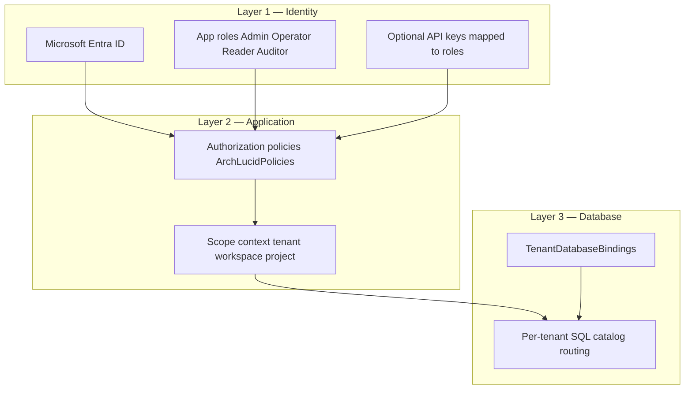

> **Reviewed:** 2026-07-29


> **Scope:** Buyer-safe security and procurement question-answer packet for V1 controlled pilots, plus the principal-architect falsification script (formerly `PRINCIPAL_ARCHITECT_FALSIFICATION_SCRIPT.md`), the Azure extractor InfoSec pre-read (formerly `AZURE_EXTRACTOR_INFOSEC_PREREAD.md`), the enterprise procurement FAQ (formerly `PROCUREMENT_FAQ.md`), the tenant isolation buyer overview (formerly the body of `TENANT_ISOLATION.md`; that filename remains a path-stable pack alias), the procurement response accelerator / SIG–CAIQ map (formerly the body of `PROCUREMENT_RESPONSE_ACCELERATOR.md`; that filename remains a path-stable alias), the security reviewer one-pager (formerly the body of `SECURITY_REVIEWER_ONE_PAGER.md`; that filename remains a path-stable pack alias), the procurement objection playbook / controlled-pilot drill (formerly the body of `PROCUREMENT_OBJECTION_PLAYBOOK.md`; that filename remains a path-stable alias for proof-language CI), the inbound-webhook security-reviewer handout (formerly the body of `SECURITY_REVIEWER_INBOUND_WEBHOOK_ONE_PAGER.md`; that filename remains a path-stable alias for GTM **M-126**), the prompt-injection resistance buyer one-pager (formerly the body of `PROMPT_INJECTION_RESISTANCE_BUYER_ONE_PAGER.md`; that filename remains a path-stable alias for GTM **M-115**), the security-reviewer audit-trail one-pager (formerly the body of `SECURITY_REVIEWER_AUDIT_TRAIL_ONE_PAGER.md`; that filename remains a path-stable alias for GTM **M-118**), the tenant-identity single-derivation PA one-pager (formerly the body of `TENANT_IDENTITY_SINGLE_DERIVATION_PA_ONE_PAGER.md`; that filename remains a path-stable alias for GTM **M-151**), the minimum pilot trust packet without CPA/3P pen test (formerly the body of `MINIMUM_PILOT_TRUST_PACKET_WITHOUT_CPA_PA_ONE_PAGER.md`; that filename remains a path-stable alias for GTM **M-191**), the model-failed vs quality-rejected one-pager (formerly the body of `MODEL_FAILED_VS_QUALITY_REJECTED_ONE_PAGER.md`; that filename remains a path-stable alias for GTM **M-124**), the execution-mode honesty one-pager (formerly the body of `EXECUTION_MODE_HONESTY_ONE_PAGER.md`; that filename remains a path-stable alias for GTM **M-128**), the Simulator-ROI sponsor forbid one-pager (formerly the body of `SIMULATOR_ROI_SPONSOR_FORBID_ONE_PAGER.md`; that filename remains a path-stable alias for GTM **M-139**), the interrupted-review buyer one-pager (formerly the body of `INTERRUPTED_REVIEW_BUYER_ONE_PAGER.md`; that filename remains a path-stable alias for GTM **M-122**), the first-security-review PA one-pager ship order (formerly the body of `FIRST_SECURITY_REVIEW_PA_ONE_PAGER_SHIP_ORDER_PA_ONE_PAGER.md`; that filename remains a path-stable alias for GTM **M-193**), the SOC 2 / pen-test honest procurement talk-track (formerly the body of `SOC2_PENTEST_HONEST_PROCUREMENT_TALK_TRACK_PA_ONE_PAGER.md`; that filename remains a path-stable alias for GTM **M-197**), the isolation-claims vs INV-001 / ADR 0037 handout (formerly the body of `ISOLATION_CLAIMS_VS_INV001_ADR0037_PA_ONE_PAGER.md`; that filename remains a path-stable alias for GTM **M-195**), the retrieval tenancy hit-guarantee handout (formerly the body of `RETRIEVAL_TENANCY_HIT_GUARANTEE_PA_ONE_PAGER.md`; that filename remains a path-stable alias for GTM **M-153**), the PilotStrict vs execution-mode handout (formerly the body of `PILOTSTRICT_VS_EXECUTION_MODE_PA_ONE_PAGER.md`; that filename remains a path-stable alias for GTM **M-167**), the committed golden-manifest unit-of-truth handout (formerly the body of `COMMITTED_GOLDEN_MANIFEST_UNIT_OF_TRUTH_PA_ONE_PAGER.md`; that filename remains a path-stable alias for GTM **M-155**), the operator primary-object + nav-collapse handout (formerly the body of `OPERATOR_PRIMARY_OBJECT_NAV_COLLAPSE_PA_ONE_PAGER.md`; that filename remains a path-stable alias for GTM **M-177**), the append-only / sealed-evidence handout (formerly the body of `APPEND_ONLY_SEALED_EVIDENCE_PA_ONE_PAGER.md`; that filename remains a path-stable alias for GTM **M-161**), and the Authority vs AgentTask loop handout (formerly the body of `AUTHORITY_VS_AGENTTASK_LOOP_PA_ONE_PAGER.md`; that filename remains a path-stable alias for GTM **M-159**), and the transactional finalize vs outbox handout (formerly the body of `TRANSACTIONAL_FINALIZE_VS_OUTBOX_PA_ONE_PAGER.md`; that filename remains a path-stable alias for GTM **M-163**), and the quality-gate versioning handout (formerly the body of `QUALITY_GATE_VERSIONING_PA_ONE_PAGER.md`; that filename remains a path-stable alias for GTM **M-130**), and the read-after-write client readiness handout (formerly the body of `READ_AFTER_WRITE_CLIENT_PA_ONE_PAGER.md`; that filename remains a path-stable alias for GTM **M-165**), and the finding disposition concurrency handout (formerly the body of `FINDING_CONCURRENT_DISPOSITION_RACE_PA_ONE_PAGER.md`; that filename remains a path-stable alias for GTM **M-141**), and the outbox replay vs idempotency handout (formerly the body of `TRANSACTIONAL_OUTBOX_REPLAY_IDEMPOTENCY_PA_ONE_PAGER.md`; that filename remains a path-stable alias for GTM **M-145**), and the LLM trust-boundary ingress handout (formerly the body of `LLM_TRUST_BOUNDARY_INGRESS_PA_ONE_PAGER.md`; that filename remains a path-stable alias for GTM **M-149**), and the Polly vs run-completeness handout (formerly the body of `POLLY_VS_RUN_LEVEL_SURFACE_PA_ONE_PAGER.md`; that filename remains a path-stable alias for GTM **M-147**). This packet only describes existing controls and evidence. It does **not** claim SOC 2 CPA, third-party penetration test, ISO 27001, or any unavailable external assurance.

> **Spine doc:** [`START_HERE.md`](../START_HERE.md).

# Buyer security and procurement packet

**Audience:** Procurement reviewers, security reviewers, GRC teams, CISOs, and enterprise buyers evaluating ArchLucid for a controlled pilot.

**Last reviewed:** 2026-07-29

**Review checklist owner:** Founder / ArchLucid operator. Re-validate before each new buyer conversation.

---

## Isolation one-pager (M-114) {#isolation-one-pager-m-114}

**Claim (G3):** Authenticated identity binds tenant/workspace scope; client-supplied scope headers cannot override that binding on production-like hosts.

| Statement | Meaning |
| --- | --- |
| Identity wins | JWT or API-key subject resolves tenant/workspace; forged `x-tenant-id` and actor headers do not steer reads or writes |
| Database-per-tenant default | Customer data uses a tenant-scoped database catalog where configured |
| SingleCatalog boundary | CI, local, and controlled demo only; not the default production isolation story |
| Fail closed | Scope-sensitive APIs deny (typically **403**) when headers disagree with identity |

Reviewer check: authenticate as Tenant A on a JwtBearer or ApiKey host, submit a scope-sensitive request with a forged Tenant B header, and expect a denial rather than Tenant B payload. Ask for the latest **TB-948** isolation evidence artifact where an attachment is required. Do not treat DevBypass or test actor headers as production-safe; production-like hosts must reject them (**TB-949**).

| Concern | Posture |
| --- | --- |
| Security | Least privilege: identity is authoritative; headers cannot expand scope |
| Scalability | Per-tenant catalogs scale independently |
| Reliability | Mismatches fail closed rather than serving mixed scope |
| Cost | Middleware and catalog routing; no third-party isolation SaaS required for this V1 claim |

Full technical narrative: [Tenant isolation (buyer overview)](#tenant-isolation-buyer-overview). Live review: [principal architect falsification script](#principal-architect-falsification-script-m-113) below.

## Tenant identity single derivation (M-151) {#tenant-identity-single-derivation-m-151}

Former standalone body: `docs/go-to-market/TENANT_IDENTITY_SINGLE_DERIVATION_PA_ONE_PAGER.md` → this section (filename kept as a path-stable alias for GTM **M-151**). **Must** before first security review per **M-192** / **TB-1120**. Complements [Isolation one-pager (M-114)](#isolation-one-pager-m-114). Layer B of tenant isolation. Not an assurance attestation.

**Path-stable alias:** [`TENANT_IDENTITY_SINGLE_DERIVATION_PA_ONE_PAGER.md`](TENANT_IDENTITY_SINGLE_DERIVATION_PA_ONE_PAGER.md).

**Audience:** Principal architects and security reviewers probing multi-tenant identity binding.

**Claim:** Production-like hosts derive tenant/workspace/project **once** at the host boundary into typed `ScopeContext`. Client `x-tenant-id` (and peer headers) do **not** establish production tenant identity. Application and Persistence layers must **not** re-parse JWT/headers for tenant. SQL RLS is **not** a deployed control (ADR 0037).

### Statement / meaning

| Statement | Meaning |
| --- | --- |
| Decide once | Host middleware / auth resolves scope from trusted identity (JWT app roles or mapped API key) into `ScopeContext` before application and persistence work |
| Trusted production sources | JWT/API-key claims and explicit background-job ambient scope are trusted |
| Headers are not authority | Forged or mismatched `x-tenant-id` / workspace / project headers fail closed on production-like hosts (**M-114** / **TB-925**); they cannot establish scope |
| Typed handoff | `IScopeContextProvider` or explicit parameters carry the resolved scope downward |
| Forbidden layers | Application/Persistence must not touch `HttpContext` / `ClaimsPrincipal` to re-derive tenant (ARCH001 / **TB-999**) |
| Jobs / ambient | Background work carries explicit or ambient scope from the enqueue boundary — not a fresh header parse |
| Route `{tenantId}` | Route values are validated against identity scope; they are not a second source of truth |

### Boundary matrix

| Layer | Allowed | Forbidden |
| --- | --- | --- |
| Host / API boundary | Resolve identity claims and route binding | Accept header-only scope in production-like hosts |
| Application / Persistence | Consume `ScopeContext` | Re-derive tenant identity from `HttpContext` or `ClaimsPrincipal` |
| Background job | Use `AmbientScopeContext` override | Use development default scope as production authority |

### Too strong vs safe

| Too strong | Safe |
| --- | --- |
| “`x-tenant-id` selects the tenant” | Identity wins; headers cannot expand scope |
| “NetArchTest / layer tests prove isolation” | DAG guards help; isolation is catalogs + INV-001 + retrieval filters (**M-156**) |
| “SQL RLS isolates tenants” | ADR 0037 — RLS is non-control; database-per-tenant + predicates |
| “Empty TenantId returns no rows” | Empty/untyped scope routing risks — **M-168** / **M-169** |

### Reviewer check

1. Authenticate as Tenant A; send a scope-sensitive API call with a forged Tenant B header → expect **403** / denial, not Tenant B data (**M-113** Claim-1).
2. Ask which assemblies may read `HttpContext` for tenant — expect host-only list.
3. Confirm route `{tenantId}` binding is checked against resolved identity scope.
4. Ask how background jobs receive scope: explicit ambient scope from enqueue, not request headers.
5. Confirm DevBypass / test actor headers are rejected on production-like hosts (**TB-949** residual language).

### Posture

| Concern | Posture |
| --- | --- |
| Security | Least privilege; single derivation reduces confused-deputy / header-steering classes |
| Scalability | Per-tenant catalogs; typed scope propagates without a separate identity lookup per repository call |
| Reliability | Fail closed on mismatch; no silent header override on production-like hosts |
| Cost | Middleware / host logic only; no per-tenant IdP or SQL RLS product required for this V1 claim |

### Residuals (honest)

- **INV-001** and Layer B are implemented; **ARCH001** prohibits lower assemblies from using `HttpContext`/`ClaimsPrincipal` for this purpose.
- Contract + honesty CI: **TB-999** / **TB-1000** (open).
- Too-strong inventory / stale RLS purge: **M-194** / **TB-1122**.
- DiD erosion after provider exists: **M-213** / **TB-1232**.
- Retrieval hit tenancy (Search `$filter`): **M-152** / **M-153**.
- This is Layer B defense in depth; Layer A database-per-tenant routing remains the primary paying-client isolation boundary.

**Deep reference:** [`../security/TENANT_ISOLATION_DEFENSE_IN_DEPTH.md`](../security/TENANT_ISOLATION_DEFENSE_IN_DEPTH.md) Layer B · [Isolation one-pager (M-114)](#isolation-one-pager-m-114) · [Isolation claims vs INV-001 / ADR 0037 (M-195)](#isolation-claims-vs-inv001-adr0037-m-195) · [Tenant isolation (buyer overview)](#tenant-isolation-buyer-overview) · [`PA_CLAIM_HONESTY_INDEX.md`](PA_CLAIM_HONESTY_INDEX.md).

## Isolation claims vs INV-001 / ADR 0037 (M-195) {#isolation-claims-vs-inv001-adr0037-m-195}

Former standalone body: `docs/go-to-market/ISOLATION_CLAIMS_VS_INV001_ADR0037_PA_ONE_PAGER.md` → this section (filename kept as a path-stable alias for GTM **M-195** / **TB-1122**). Complements [Isolation one-pager (M-114)](#isolation-one-pager-m-114) and [Tenant identity (M-151)](#tenant-identity-single-derivation-m-151). Does not reopen SQL RLS as a production control.

**Path-stable alias:** [`ISOLATION_CLAIMS_VS_INV001_ADR0037_PA_ONE_PAGER.md`](ISOLATION_CLAIMS_VS_INV001_ADR0037_PA_ONE_PAGER.md).

**Audience:** Security reviewers and principal architects challenging tenancy language.

**Claim:** Safe pin = **database-per-tenant** + **INV-001 decide-once** + **M-114** identity-wins. Do **not** cite SQL RLS as a deployed production control. Do not treat workspace/project as the paying-client security boundary. Do not claim G3 fully proven without **TB-948**/**TB-949**. Do not promise per-tenant Search index / crypto-proof retrieval / NetArchTest-alone isolation.

### Too strong vs safe

| Too strong | Safe |
| --- | --- |
| “SQL RLS isolates tenants” | ADR 0037 — RLS is non-control |
| “NetArchTest proves isolation” | Compile-time DAG ≠ runtime tenancy (**M-156**) |
| “Per-tenant Search index / crypto-proof retrieval” | Mandatory OData `$filter` (**M-152**/**M-153**) |
| “Empty TenantId returns no data” | Empty-scope routing risks (**M-168**/**M-169**) |
| “G3 PASS without isolation evidence” | Soften until **TB-948**/**TB-949** artifacts |

### Stale language purge

Remove buyer-facing “RLS protects production” / “headers select tenant” / “architecture tests = isolation proof.” Point to [`../security/TENANT_ISOLATION_DEFENSE_IN_DEPTH.md`](../security/TENANT_ISOLATION_DEFENSE_IN_DEPTH.md) + [Isolation one-pager (M-114)](#isolation-one-pager-m-114).

**Related:** [Tenant identity (M-151)](#tenant-identity-single-derivation-m-151) · [Retrieval tenancy hit guarantee (M-153)](#retrieval-tenancy-hit-guarantee-m-153) · **M-213**/**M-255** (DiD erosion) · [`PA_CLAIM_HONESTY_INDEX.md`](PA_CLAIM_HONESTY_INDEX.md).

## Retrieval tenancy — what a hit guarantees (M-153) {#retrieval-tenancy-hit-guarantee-m-153}

Former standalone body: `docs/go-to-market/RETRIEVAL_TENANCY_HIT_GUARANTEE_PA_ONE_PAGER.md` → this section (filename kept as a path-stable alias for GTM **M-153** / **TB-1001**). Complements [Isolation one-pager (M-114)](#isolation-one-pager-m-114) and [Isolation claims (M-195)](#isolation-claims-vs-inv001-adr0037-m-195). Not an assurance attestation.

**Path-stable alias:** [`RETRIEVAL_TENANCY_HIT_GUARANTEE_PA_ONE_PAGER.md`](RETRIEVAL_TENANCY_HIT_GUARANTEE_PA_ONE_PAGER.md).

**Audience:** Principal architects and security reviewers.

**Claim:** Ask, Azure AI Search, and Graph-RAG require the same identity-bound scope; they do **not** use a per-tenant Search index or cryptographic proof of isolation. A hit cannot be another paying tenant’s chunk when filters are enforced.

### Control path

| Step | Current control | Boundary |
| --- | --- | --- |
| Query | Required OData tenant/workspace/project filter | Empty scope throws |
| Upsert | Scope mismatch fails closed | Not a separate index |
| Graph expansion | `GetByIdAsync(scope, …)` reuses scope | No unscoped second search |
| Platform corpus | `Guid.Empty` denotes intentional shared content | Must be explicitly labelled |

Done **TB-071** builds required filters and Done **TB-604** rejects scope-mismatched writes. These controls complement database-per-tenant catalog routing; they do not replace it.

### Reviewer check

1. Query as Tenant A with a forged Tenant B identifier.
2. Confirm the required filter is derived from authoritative scope.
3. Attempt an empty or mismatched scope and expect a failure, not broad retrieval.
4. Identify intentional platform corpus hits separately from tenant content.

### Too strong vs safe

| Too strong | Safe |
| --- | --- |
| “Each tenant has a dedicated Search index” | Shared index + mandatory scope `$filter` |
| “Filters are optional” | Empty / mismatched scope fails closed |
| “A Search hit is cryptographic isolation proof” | Identity-bound filter + fail-closed upsert; not crypto tenancy |

### Residuals (honest)

| Open work | Purpose |
| --- | --- |
| **TB-1001** | PA query/upsert/graph/shared-corpus guarantee matrix |
| **TB-1002** | Claim-drift regression guard |

**Related:** [`../security/ASK_RAG_THREAT_MODEL.md`](../security/ASK_RAG_THREAT_MODEL.md) · [`../security/TENANT_ISOLATION_DEFENSE_IN_DEPTH.md`](../security/TENANT_ISOLATION_DEFENSE_IN_DEPTH.md) · [ADR 0037](../architecture/adrs/0037-tenant-isolation-without-rls-defense-in-depth.md) · [Isolation claims (M-195)](#isolation-claims-vs-inv001-adr0037-m-195) · [`PA_CLAIM_HONESTY_INDEX.md`](PA_CLAIM_HONESTY_INDEX.md).

## Prompt-injection resistance (M-115) {#prompt-injection-resistance-m-115}

Former standalone body: `docs/go-to-market/PROMPT_INJECTION_RESISTANCE_BUYER_ONE_PAGER.md` → this section (filename kept as a path-stable alias for GTM **M-115**). Complements [Isolation one-pager (M-114)](#isolation-one-pager-m-114). Not an assurance attestation.

**Path-stable alias:** [`PROMPT_INJECTION_RESISTANCE_BUYER_ONE_PAGER.md`](PROMPT_INJECTION_RESISTANCE_BUYER_ONE_PAGER.md).

**Audience:** Security reviewers, principal architects, CISOs evaluating ArchLucid AI review agents.

**Claim:** Customer docs and repo content are treated as **DATA**. Resistance is **host confinement** (structured ingress, tool allowlists, no model-driven exfil loop) — not “we sanitize every PDF.” Residual injection risk is stated; Azure AI Content Safety is a **gate**, not the product.

### Statement / meaning

| Statement | Meaning |
| --- | --- |
| Data, not instructions | Architecture briefs, uploaded docs, and repo excerpts enter the model as untrusted content inside host-composed prompts |
| Confinement over filtering | Safety comes from what the host allows the agent to *do* (tools, side effects, egress), not from promising perfect prompt hygiene |
| Content Safety ≠ product | Azure AI Content Safety (and related) may block or label unsafe content; that does not make ArchLucid “injection-proof” |
| Residual risk | A determined injector can still influence **finding text**; they must not gain HTTP/shell/ITSM tool loops or cross-tenant reads via the model |

### Too strong vs safe

| Too strong | Safe |
| --- | --- |
| “Prompt-injection proof” / “we sanitize architecture PDFs” | Host-composed ingress + structured evidence paths; residual influence on prose |
| “Empty AllowedTools means the agent can do anything” | Tool dispatch is constrained (**TB-082** Done); residual empty-`AllowedTools` hole tracked under **TB-950** |
| “Content Safety makes us enterprise-safe alone” | Content Safety is one gate; isolation + audit + mode labels remain separate claims |

### Reviewer check

1. Ask which surfaces feed the model (brief, attachments, retrieval chunks) and confirm they are labeled/quarantined as DATA in the composer contract (**TB-949**).
2. Ask whether the model can open arbitrary URLs, shells, or create ITSM tickets via a tool loop — expect **no** unconstrained tool-loop for those side effects (**M-149** / **TB-997**).
3. Do **not** accept “we filter the PDF” as the primary control story.

### Posture

| Concern | Posture |
| --- | --- |
| Security | Least privilege on tools; identity/scope still wins (**M-114**); injection ≠ tenant escape |
| Scalability | Confinement is per-request host logic; no per-doc manual sanitize farm |
| Reliability | Fail closed on unsafe tool use; finding-text influence remains a quality/audit concern |
| Cost | Content Safety + token spend; no third-party “prompt firewall” product required for this claim |

### Residuals (honest)

- Engineering **TB-949**–**TB-952** (composer delimiters, confinement tests, Content Safety wiring honesty) — cite as open until Done.
- Empty / advisory `AllowedTools` residual: **TB-950**.
- Extend claim guardrails: **M-116**; deeper ingress vs impossible matrix: [LLM trust boundary (M-149)](#llm-trust-boundary-ingress-m-149).

**Related:** [Isolation one-pager (M-114)](#isolation-one-pager-m-114) · [LLM trust boundary (M-149)](#llm-trust-boundary-ingress-m-149) · [`PA_CLAIM_HONESTY_INDEX.md`](PA_CLAIM_HONESTY_INDEX.md) · [`PUBLIC_CLAIM_BOUNDARY_GUIDE.md#gtm-do-not-promise`](../library/PUBLIC_CLAIM_BOUNDARY_GUIDE.md#gtm-do-not-promise).

## LLM trust boundary — ingress vs impossible (M-149) {#llm-trust-boundary-ingress-m-149}

Former standalone body: `docs/go-to-market/LLM_TRUST_BOUNDARY_INGRESS_PA_ONE_PAGER.md` → this section (filename kept as a path-stable alias for GTM **M-149** / **TB-997**). Extends [Prompt-injection resistance (M-115)](#prompt-injection-resistance-m-115). Not an assurance attestation.

**Path-stable alias:** [`LLM_TRUST_BOUNDARY_INGRESS_PA_ONE_PAGER.md`](LLM_TRUST_BOUNDARY_INGRESS_PA_ONE_PAGER.md).

**Audience:** Principal architects and security reviewers assessing AI agent boundaries.

**Claim:** Promise **host-composed ingress** and **no model tool-loop** for HTTP/shell/ITSM side effects. Do **not** promise injection-proof customer docs or that the model cannot influence findings text. Residual empty-`AllowedTools`: **TB-950**.

### Ingress / impossible matrix

| Boundary question | Current posture |
| --- | --- |
| What enters the model? | Host-selected request data, evidence package, technology ledger, and retrieval context |
| Can model output alter finding prose? | Yes; output quality and governance controls must evaluate it |
| Can it call arbitrary HTTP or shell tools? | No model-driven tool loop for those capabilities |
| Can it create ITSM work directly? | No model-driven ITSM side-effect loop |
| Are all tool states fail-closed? | Not yet: empty `AllowedTools` remains a tracked residual |

### What enters the model

| Ingress | Treatment |
| --- | --- |
| Brief / attachments / repo excerpts | Untrusted DATA in host-composed prompts |
| Retrieval chunks | Scoped hits only (**M-152** / **M-153**) |
| Prior agent prose | May influence later findings — quarantine vs package rules |

### Structurally impossible (intent)

| Side effect | Expectation |
| --- | --- |
| Arbitrary HTTP/shell from model tool-loop | Not allowed |
| ITSM create via unconstrained model tools | Not allowed |
| Cross-tenant read via prompt alone | Blocked by identity/scope (**M-114** / **M-151**) — not by “filtering the PDF” |

### Too strong vs safe

| Too strong | Safe |
| --- | --- |
| “Customer documents are injection-proof” | Untrusted content enters a host-composed, confined model boundary |
| “The model cannot influence findings” | It can influence generated text; it cannot directly invoke the listed side-effect loops |
| “Tool allowlists are complete” / “Empty AllowedTools is safe” | Dispatch guarding is shipped (**TB-082** Done); empty `AllowedTools` closure remains **TB-950** |

### Reviewer check

1. Identify the host-owned inputs to a representative completion request.
2. Ask whether output can invoke HTTP, shell, or ITSM actions without host code.
3. Confirm the treatment of an empty `AllowedTools` list before accepting an allowlist claim.

### Posture

| Concern | Posture |
| --- | --- |
| Security | Host-composed ingress and constrained tools reduce model-directed side effects |
| Scalability | Boundary enforcement is host-side and applies consistently per completion |
| Reliability | Content Safety can gate content but does not eliminate influence on text |
| Cost | No claim of a separate prompt-firewall service; model use still consumes tokens |

### Residuals (honest)

- **TB-082** is Done for `AgentTaskAllowedToolsDispatchGuard`.
- Empty/unrestricted `AllowedTools` behavior is still a residual under **TB-950**.
- **TB-997**–**TB-998** remain open for the PA ingress/impossible contract and claim guard.
- This does not promise prompt-injection proof; see [M-115](#prompt-injection-resistance-m-115) / **M-116**.

**Related:** [Prompt-injection resistance (M-115)](#prompt-injection-resistance-m-115) · [Retrieval tenancy (M-153)](#retrieval-tenancy-hit-guarantee-m-153) · [`../security/SYSTEM_THREAT_MODEL.md`](../security/SYSTEM_THREAT_MODEL.md) · [`PUBLIC_CLAIM_BOUNDARY_GUIDE.md#gtm-do-not-promise`](../library/PUBLIC_CLAIM_BOUNDARY_GUIDE.md#gtm-do-not-promise) · [`PA_CLAIM_HONESTY_INDEX.md`](PA_CLAIM_HONESTY_INDEX.md).

## Security reviewer audit trail (M-118) {#security-reviewer-audit-trail-m-118}

Former standalone body: `docs/go-to-market/SECURITY_REVIEWER_AUDIT_TRAIL_ONE_PAGER.md` → this section (filename kept as a path-stable alias for GTM **M-118**). **Must** before first security review per **M-192** / **TB-1120**. Complements [Isolation one-pager (M-114)](#isolation-one-pager-m-114). Not an assurance attestation.

**Path-stable alias:** [`SECURITY_REVIEWER_AUDIT_TRAIL_ONE_PAGER.md`](SECURITY_REVIEWER_AUDIT_TRAIL_ONE_PAGER.md).

**Audience:** Security reviewers and principal architects verifying governance dispositions leave a durable trail.

**Claim:** **Required** governance / finalize / identity / export events use fail-closed durable audit write (**TB-953** Done — `LogOrThrow`). Cost, projection, and funnel telemetry may remain **informational / best-effort** (**TB-001** posture). Not every audit event is same-transaction with the domain write until **TB-956**.

### Statement / meaning

| Statement | Meaning |
| --- | --- |
| Required = fail-closed | Indefensible paths (approve/reject/waive, finalize/promote, identity/role, export attest) must leave a durable `AuditEvents` row or the operation fails |
| Informational = best-effort | Cost/projection/funnel-style events may use retry-then-swallow; losing them is undesirable, not a governance integrity break |
| Append-only trail | Corrections append; do not promise an editable audit log — see [Append-only and sealed evidence (M-161)](#append-only-sealed-evidence-m-161) |
| Dual-write residual | Domain success with missing Required row is the defect class **TB-954**/**TB-955** harden; same-TX / outbox for hottest paths is **TB-956** |

### Too strong vs safe

| Too strong | Safe |
| --- | --- |
| “Every audit event is transactional” | Required set is fail-closed durable; informational may be best-effort |
| “Approve always left a trail even before TB-953” | Pre-migration `TryLogAsync` swallow risk — **TB-953** closed that for Required paths |
| “Same database transaction as the disposition today” | Durable write + retry; same-TX / transactional outbox is **TB-956** (open) |
| “Append-only means immutable external storage” | Application audit trail — not WORM storage or a PKI-signed ledger |

### Reviewer check

1. Perform (or witness) a governance disposition on a pilot host; confirm an `AuditEvents` row for that action type.
2. Ask for the Required vs informational split (INV-003 / **TB-953** tip) — do not accept “all telemetry is equally durable.”
3. For export/attest paths, confirm failure if the Required audit write cannot complete.
4. Do not extrapolate this check to cost or funnel telemetry.

### Posture

| Concern | Posture |
| --- | --- |
| Security | Fail-closed on indefensible events; least privilege on who can dispose |
| Scalability | Append-only log; probe/alert for orphans (**TB-955**); informational telemetry can degrade independently |
| Reliability | Required abandon is pageable; informational loss does not block product path; dual-write window remains until **TB-956** |
| Cost | Extra write latency on Required paths; no external SIEM / immutable-ledger service required for this V1 claim |

### Residuals (honest)

- **TB-953** is Done: `LogOrThrow` establishes the required-event fail-closed path.
- **TB-954** Required type registry + arch test; **TB-955** abandon alert / orphan probe; **TB-956** same-TX (open).
- Finding disposition race ≠ approval-request CAS — see [Finding disposition concurrency (M-141)](#finding-disposition-concurrency-m-141).
- Claim honesty bullets: **M-117**.

**Related:** [Prompt-injection resistance (M-115)](#prompt-injection-resistance-m-115) · [Finding disposition concurrency (M-141)](#finding-disposition-concurrency-m-141) · [`AUDIT_COVERAGE_MATRIX.md`](../library/AUDIT_COVERAGE_MATRIX.md) · [Append-only and sealed evidence (M-161)](#append-only-sealed-evidence-m-161) · [Tenant identity single derivation (M-151)](#tenant-identity-single-derivation-m-151) · [`PA_CLAIM_HONESTY_INDEX.md`](PA_CLAIM_HONESTY_INDEX.md) · [`PUBLIC_CLAIM_BOUNDARY_GUIDE.md#gtm-do-not-promise`](../library/PUBLIC_CLAIM_BOUNDARY_GUIDE.md#gtm-do-not-promise).

## Finding disposition concurrency (M-141) {#finding-disposition-concurrency-m-141}

Former standalone body: `docs/go-to-market/FINDING_CONCURRENT_DISPOSITION_RACE_PA_ONE_PAGER.md` → this section (filename kept as a path-stable alias for GTM **M-141** / **TB-986**). Complements [Security reviewer audit trail (M-118)](#security-reviewer-audit-trail-m-118). Does not alter governance approval-request CAS. Not an assurance attestation.

**Path-stable alias:** [`FINDING_CONCURRENT_DISPOSITION_RACE_PA_ONE_PAGER.md`](FINDING_CONCURRENT_DISPOSITION_RACE_PA_ONE_PAGER.md).

**Audience:** Principal architects and governance reviewers.

**Decision:** A finding-disposition trail is append-only history; it is not the same concurrency contract as a governance approval request.

### Current semantics

| Object | Concurrent behavior | Buyer-safe description |
| --- | --- | --- |
| Finding disposition | Both writes can succeed; latest `OccurredAtUtc` is current | Append-only review history |
| ITSM human review status | Plain update; last writer wins | Integration state, not CAS-protected approval |
| Governance approval request | First transition wins; loser receives 409 | Conflict-aware approval decision |

`FindingDispositionService` appends through `FindingReviewTrailAppendService` into `dbo.FindingReviewEvents`. The current view is selected by timestamp; it is not a mutex or compare-and-swap decision.

### PA review script

1. Start two approve/reject actions against the same finding.
2. Confirm both events remain visible in the review trail.
3. Confirm the UI identifies the current outcome and does not hide a concurrent conflict.
4. Contrast that result with an approval-request transition, where the second actor receives a conflict.

### What not to claim

- Do not say every approval or disposition is first-wins.
- Do not equate append-only history with conflict prevention.
- Do not say the current disposition is immutable when a later disposition event can supersede it.
- Do not treat an ITSM status update as a durable approval trail.

### Residuals (honest)

| Gap | Planned item |
| --- | --- |
| One explicit finding-versus-approval contract | **TB-986** |
| Concurrent-update UX and divergence disclosure | **TB-987** |
| Approve/reject race regression coverage | **TB-988** |

No mutex is implied, and this work does not alter the existing governance approval-request CAS behavior.

**Related:** [Security reviewer audit trail (M-118)](#security-reviewer-audit-trail-m-118) · [Append-only and sealed evidence (M-161)](#append-only-sealed-evidence-m-161) · [`../library/AUDIT_COVERAGE_MATRIX.md`](../library/AUDIT_COVERAGE_MATRIX.md) · [`../library/V1_SCOPE.md`](../library/V1_SCOPE.md) · [`PUBLIC_CLAIM_BOUNDARY_GUIDE.md#gtm-do-not-promise`](../library/PUBLIC_CLAIM_BOUNDARY_GUIDE.md#gtm-do-not-promise) · [`PA_CLAIM_HONESTY_INDEX.md`](PA_CLAIM_HONESTY_INDEX.md).

## Append-only and sealed evidence (M-161) {#append-only-sealed-evidence-m-161}

Former standalone body: `docs/go-to-market/APPEND_ONLY_SEALED_EVIDENCE_PA_ONE_PAGER.md` → this section (filename kept as a path-stable alias for GTM **M-161** / **TB-1009**). Complements [Security reviewer audit trail (M-118)](#security-reviewer-audit-trail-m-118) and [Committed golden manifest (M-155)](#committed-golden-manifest-unit-of-truth-m-155). Does not reopen Done **TB-303**, **TB-307**, or **TB-310**. Not an assurance attestation and not platform WORM (ADR 0040).

**Path-stable alias:** [`APPEND_ONLY_SEALED_EVIDENCE_PA_ONE_PAGER.md`](APPEND_ONLY_SEALED_EVIDENCE_PA_ONE_PAGER.md).

**Audience:** Principal architects, auditors, and procurement reviewers.

**Claim:** Specific audit and committed-evidence records are append-only or sealed; mutable overlays remain by design, and the platform is not claimed as WORM storage.

### Inventory

| Data class | Posture | Why it matters |
| --- | --- | --- |
| `dbo.AuditEvents` | Append-only / denied updates | Preserves audit history |
| Sealed evidence registry | Commit-sealed | Preserves committed package inputs |
| Run-header anchors | Committed state | Anchors finalized lifecycle |
| Finding review events | Append-only | Preserves disposition history |
| Enrichments, drafts, lifecycle fields | Mutable | Supports active work |

The presence of a mutable field does not invalidate an append-only event trail. The risk is exposing a generic `Update*` API over a record whose historical meaning must remain intact.

### Reviewer check

1. Identify whether the object is an event, sealed evidence, a committed anchor, or a mutable overlay.
2. Attempt the prohibited update path for audit events.
3. Verify corrections create an appended event or superseding record when required.
4. Run export verification and describe the result as application-layer hash lineage.

### Too strong vs safe

| Too strong | Safe |
| --- | --- |
| “Every product table is immutable” | Named append-only / sealed classes only |
| “An auditor can edit the audit log” | Corrections append; updates denied on `AuditEvents` |
| “A committed finding can be corrected in place” | Append new events or enrichment overlay |
| “Manifest hashing is platform WORM or PKI signing” | Application-layer hash lineage (ADR 0040) |

### Residuals (honest)

- **TB-1009** defines the append-only versus mutable matrix and destructive-update analysis.
- **TB-1010** adds language regression coverage.

**Related:** [Security reviewer audit trail (M-118)](#security-reviewer-audit-trail-m-118) · [Committed golden manifest (M-155)](#committed-golden-manifest-unit-of-truth-m-155) · [Authority vs AgentTask loop (M-159)](#authority-vs-agenttask-loop-m-159) · [ADR 0039](../architecture/adrs/0039-sealed-evidence-registry.md) · [ADR 0040](../architecture/adrs/0040-manifest-hash-and-export-verification.md) · [`../library/EVIDENCE_IMMUTABILITY.md`](../library/EVIDENCE_IMMUTABILITY.md) · [`../library/AUDIT_COVERAGE_MATRIX.md`](../library/AUDIT_COVERAGE_MATRIX.md) · [`PA_CLAIM_HONESTY_INDEX.md`](PA_CLAIM_HONESTY_INDEX.md).

## Authority pipeline versus AgentTask loop (M-159) {#authority-vs-agenttask-loop-m-159}

Former standalone body: `docs/go-to-market/AUTHORITY_VS_AGENTTASK_LOOP_PA_ONE_PAGER.md` → this section (filename kept as a path-stable alias for GTM **M-159** / **TB-1007**). Complements [Committed golden manifest (M-155)](#committed-golden-manifest-unit-of-truth-m-155). Does not reopen Done **TB-305**/**TB-919**. Not an assurance attestation.

**Path-stable alias:** [`AUTHORITY_VS_AGENTTASK_LOOP_PA_ONE_PAGER.md`](AUTHORITY_VS_AGENTTASK_LOOP_PA_ONE_PAGER.md).

**Audience:** Principal architects and integration developers.

**Claim:** New product surfaces use the Authority pipeline; `execute` / `result` / `commit` remain a task-loop contract, not the default next step after every create.

### Canonical path

`POST /v1/architecture/request` → `IAuthorityRunOrchestrator` → `AuthorityPipelineStagesExecutor` → `FinalizeCommittedPipelineAsync`

Dual coordinator storage and orchestrators were retired through ADR 0030. The current HTTP write family is `v1/architecture/*`.

### When AgentTask endpoints remain valid

| Use | Valid? | Boundary |
| --- | --- | --- |
| Task-driven agents and external result push | Yes | AgentTask lifecycle |
| Trial / QuickStart or selective re-execute | Yes | Task state permits it |
| Finish a finalized Authority run | No | Already finalized |
| Async queued run without context snapshot | No | Do not force task-loop completion |
| `result` outside generated/waiting states | No | Invalid lifecycle |

### Reviewer check

1. Identify whether the surface initiates an Authority request or a task-loop action.
2. Follow the state machine before using `result`.
3. Confirm an Authority-finalized run does not receive a second finish path.
4. Keep “legacy coordinator” as a vocabulary warning, not evidence of dual live storage.

### Too strong vs safe

| Too strong | Safe |
| --- | --- |
| “Always execute after create” | Authority path finalizes without a mandatory peer execute step |
| “Old and new pipelines are both default” | Authority is product-default; AgentTask is intentional extension-loop |
| “`/result` is retired” | Valid in AgentTask lifecycle states; forbidden as a second finish on Authority-finalized runs |

### Residuals (honest)

- **TB-1007** supplies the canonical-versus-task-loop forbid matrix.
- **TB-1008** guards against dual-pipeline and forced-execute claim drift.
- Next strangler slice language: **M-185** / **TB-1034**.

**Related:** [Committed golden manifest (M-155)](#committed-golden-manifest-unit-of-truth-m-155) · [Transactional finalize vs outbox (M-163)](#transactional-finalize-vs-outbox-m-163) · [ADR 0030](../architecture/adrs/0030-authority-storage-strangler.md) · [ADR 0042](../architecture/adrs/0042-authority-http-write-family.md) · [`../library/API_CONTRACTS.md`](../library/API_CONTRACTS.md) · [`../library/ARCHITECTURE_FLOWS.md`](../library/ARCHITECTURE_FLOWS.md) · [`PA_CLAIM_HONESTY_INDEX.md`](PA_CLAIM_HONESTY_INDEX.md).

## Transactional finalize versus async outbox (M-163) {#transactional-finalize-vs-outbox-m-163}

Former standalone body: `docs/go-to-market/TRANSACTIONAL_FINALIZE_VS_OUTBOX_PA_ONE_PAGER.md` → this section (filename kept as a path-stable alias for GTM **M-163** / **TB-1011**). Complements [Committed golden manifest (M-155)](#committed-golden-manifest-unit-of-truth-m-155) and [Append-only / sealed evidence (M-161)](#append-only-sealed-evidence-m-161). Does not claim Durable Task Framework exactly-once (**TB-924**). Not an assurance attestation.

**Path-stable alias:** [`TRANSACTIONAL_FINALIZE_VS_OUTBOX_PA_ONE_PAGER.md`](TRANSACTIONAL_FINALIZE_VS_OUTBOX_PA_ONE_PAGER.md).

**Audience:** Principal architects and integration reviewers.

**Decision:** A committed package proves finalize state; it does not prove that asynchronous indexing, exports, or delivery have completed.

### State boundary

| State | Meaning | Not implied |
| --- | --- | --- |
| Finalized / committed | Package transaction succeeded | Search index updated |
| Required audit persisted | Required local audit condition met | Every audit destination delivered |
| Outbox pending | Async work recorded | Consumer processed it |
| Delivery acknowledged | Named consumer receipt | All downstream effects |

Use the committed manifest to establish the architecture-package record. Use delivery telemetry or acknowledgments to establish each asynchronous outcome.

### Never silent vs disclosed best-effort

| Class | Examples |
| --- | --- |
| Never silent best-effort | Sealed package commit; Required audit (INV-003 / **TB-953**); outbox **enqueue** for commit-tied work; tenant isolation / hard budget |
| Disclosed best-effort OK | Informational audit; metering secondary writes; cache/metrics; actual delivery lag (at-least-once — **TB-992**) |

Transactional finalize (same UoW / ADR 0004 / `AuthorityCommittedPipelineFinalizer`) owns committed golden manifest, sealed evidence, run anchors, and **enqueue** of retrieval/integration outbox rows. Outbox/async workers own Search indexing, SB/webhook delivery, Cosmos/export-blob push, and post-commit projections.

### PA review

1. Commit a package and capture its manifest ID and hash.
2. Inspect pending outbox messages separately from commit status.
3. Verify indexed/ITSM/export readiness from its own state or receipt.
4. Retry a dispatcher and confirm the description remains at-least-once.

### Claim boundary

Do not say “committed means delivered,” “Required audit means all audit sinks succeeded,” or “finalize makes Ask immediately current.” Describe the named state and the consumer that has acknowledged it.

### Residuals (honest)

- **TB-1011** defines the finalize vs outbox + never-silent-best-effort matrix.
- **TB-1012** adds anti-committed-equals-indexed / all-audit-transactional honesty CI.
- Does not turn asynchronous delivery into a synchronous guarantee; does not claim DTF exactly-once (**TB-924**).

**Related:** [Committed golden manifest (M-155)](#committed-golden-manifest-unit-of-truth-m-155) · [Append-only / sealed evidence (M-161)](#append-only-sealed-evidence-m-161) · [Outbox replay vs idempotency (M-145)](#outbox-replay-vs-idempotency-m-145) · [Read-after-write client readiness (M-165)](#read-after-write-client-m-165) · [Security reviewer audit trail (M-118)](#security-reviewer-audit-trail-m-118) · [Authority vs AgentTask loop (M-159)](#authority-vs-agenttask-loop-m-159) · [ADR 0004](../architecture/adrs/0004-transactional-outbox-retrieval-indexing.md) · [`../library/DATA_CONSISTENCY_MATRIX.md`](../library/DATA_CONSISTENCY_MATRIX.md) · [`../library/ITSM_OUTBOX_DLQ_DELIVERY_GUARANTEE_MAP.md`](../library/ITSM_OUTBOX_DLQ_DELIVERY_GUARANTEE_MAP.md) · [`../library/AUDIT_COVERAGE_MATRIX.md`](../library/AUDIT_COVERAGE_MATRIX.md) · [`PA_CLAIM_HONESTY_INDEX.md`](PA_CLAIM_HONESTY_INDEX.md).

## Transactional outbox — replay versus idempotency (M-145) {#outbox-replay-vs-idempotency-m-145}

Former standalone body: `docs/go-to-market/TRANSACTIONAL_OUTBOX_REPLAY_IDEMPOTENCY_PA_ONE_PAGER.md` → this section (filename kept as a path-stable alias for GTM **M-145** / **TB-992**). Complements [Transactional finalize vs outbox (M-163)](#transactional-finalize-vs-outbox-m-163). Does not claim exactly-once delivery. Not an assurance attestation.

**Path-stable alias:** [`TRANSACTIONAL_OUTBOX_REPLAY_IDEMPOTENCY_PA_ONE_PAGER.md`](TRANSACTIONAL_OUTBOX_REPLAY_IDEMPOTENCY_PA_ONE_PAGER.md).

**Audience:** Principal architects and integration reviewers.

**Decision:** A transactional outbox preserves a local intent with the transaction; it does not provide exactly-once delivery or make consumers idempotent.

### Separation of guarantees

| Concern | What the outbox can provide | What it cannot provide alone |
| --- | --- | --- |
| Local write + intent | Atomic persistence of the business change and pending message | Remote delivery |
| Worker retry | At-least-once dispatch attempts | One and only one consumer effect |
| Consumer behavior | Replay input for a consumer idempotency key | Consumer deduplication |
| Ordering | Per-stream design choice | Global causal order |

An outbox protects the database-side handoff from a process crash between business commit and enqueue. A retry can legitimately deliver the same message more than once.

### PA review

1. Identify the producer transaction and its outbox record.
2. Kill or retry a dispatcher after persistence and before acknowledgment.
3. Verify a replay is safe only when the downstream consumer owns an idempotency contract.
4. Inspect dead-letter and operator handling rather than assuming silent eventual success.

### Claim boundary

Use “at-least-once delivery with replay” and “consumer idempotency required.”

Do not use “exactly once,” “duplicate-proof eventing,” or “a committed record means the provider received it.” A completed local transaction is not a remote acknowledgment.

### Residuals (honest)

| Decision needed | Evidence to request |
| --- | --- |
| Consumer idempotency key | Provider or consumer contract |
| Retry/DLQ handling | Operator runbook and delivery telemetry |
| Ordered side effects | Explicit stream ordering contract |
| External proof | Delivery receipt, not just outbox state |

**Related:** [Transactional finalize vs outbox (M-163)](#transactional-finalize-vs-outbox-m-163) · [Read-after-write client readiness (M-165)](#read-after-write-client-m-165) · [ADR 0004](../architecture/adrs/0004-transactional-outbox-retrieval-indexing.md) · [`../library/ITSM_OUTBOX_DLQ_DELIVERY_GUARANTEE_MAP.md`](../library/ITSM_OUTBOX_DLQ_DELIVERY_GUARANTEE_MAP.md) · [`../library/DATA_CONSISTENCY_MATRIX.md`](../library/DATA_CONSISTENCY_MATRIX.md) · [`PUBLIC_CLAIM_BOUNDARY_GUIDE.md#gtm-do-not-promise`](../library/PUBLIC_CLAIM_BOUNDARY_GUIDE.md#gtm-do-not-promise) · [`PA_CLAIM_HONESTY_INDEX.md`](PA_CLAIM_HONESTY_INDEX.md).

## Read-after-write — client readiness is explicit (M-165) {#read-after-write-client-m-165}

Former standalone body: `docs/go-to-market/READ_AFTER_WRITE_CLIENT_PA_ONE_PAGER.md` → this section (filename kept as a path-stable alias for GTM **M-165** / **TB-1013**). Complements [Transactional finalize vs outbox (M-163)](#transactional-finalize-vs-outbox-m-163). Does not re-implement the architect workspace. Not an assurance attestation.

**Path-stable alias:** [`READ_AFTER_WRITE_CLIENT_PA_ONE_PAGER.md`](READ_AFTER_WRITE_CLIENT_PA_ONE_PAGER.md).

**Audience:** Principal architects, UI reviewers, and pilot operators.

**Decision:** Create, commit, index, Ask, export, and ITSM readiness are separate observable states.

### Readiness matrix

| User action | What it confirms | What must be checked next |
| --- | --- | --- |
| Create review | Request accepted / draft exists | Execution state |
| Execute | Task or pipeline processing | Quality and completion |
| Commit | Finalized package exists | Async projections |
| Open Ask | Read plane responds | Index freshness / source scope |
| Export or ITSM | Consumer-specific result | Delivery receipt/status |

The client must not infer a later state from an earlier write. A status badge should name the object that is ready rather than using a generic “complete.” Prefer poll/SSE until golden manifest for package readiness; disclose outbox and replica lag for projections.

### PA test

1. Create a run and immediately inspect package availability.
2. Commit it and inspect search/Ask readiness independently.
3. Trigger an export or ITSM action and observe delivery status.
4. Confirm retry guidance does not duplicate an action without an idempotency key.

### Claim boundary

Do not say “create means package ready,” “commit means Ask is current,” or “an accepted request is delivered to ITSM.” Say “committed,” “indexed,” “export generated,” or “delivery acknowledged,” as applicable.

### Residuals (honest)

- **TB-1013** defines read-after-write expectations for APIs and UI.
- **TB-1014** makes readiness state visible and protects against generic-complete copy.

**Related:** [Transactional finalize vs outbox (M-163)](#transactional-finalize-vs-outbox-m-163) · [Committed golden manifest (M-155)](#committed-golden-manifest-unit-of-truth-m-155) · [Authority vs AgentTask loop (M-159)](#authority-vs-agenttask-loop-m-159) · [ADR 0038](../architecture/adrs/0038-authority-run-sql-queue.md) · [`../library/API_CONTRACTS.md`](../library/API_CONTRACTS.md) · [`../library/DATA_CONSISTENCY_MATRIX.md`](../library/DATA_CONSISTENCY_MATRIX.md) · [`../library/ITSM_OUTBOX_DLQ_DELIVERY_GUARANTEE_MAP.md`](../library/ITSM_OUTBOX_DLQ_DELIVERY_GUARANTEE_MAP.md) · [`PA_CLAIM_HONESTY_INDEX.md`](PA_CLAIM_HONESTY_INDEX.md).

## Security reviewer inbound webhook (M-126) {#security-reviewer-inbound-webhook-m-126}

Former standalone body: `docs/go-to-market/SECURITY_REVIEWER_INBOUND_WEBHOOK_ONE_PAGER.md` → this section (filename kept as a path-stable alias for GTM **M-126** / **TB-966**). Complements [Isolation one-pager (M-114)](#isolation-one-pager-m-114).

**Path-stable alias:** [`SECURITY_REVIEWER_INBOUND_WEBHOOK_ONE_PAGER.md`](SECURITY_REVIEWER_INBOUND_WEBHOOK_ONE_PAGER.md).

**Audience:** Security reviewers probing ITSM, Stripe, Marketplace, and similar inbound hooks.

**Claim:** Documented pipeline order is not “internet-safe by itself.” **Signed ≠ replay/DoS hardened.** Prefer: rate → size → verify → parse.

### Control order

| Step | Intent |
| --- | --- |
| Rate | Edge / app rate limits before expensive work |
| Size | Bound body (`Content-Length` / pre-read max) before HMAC (**TB-967**) |
| Verify | Signature / authenticity |
| Parse | Only after verify + size |

### Too strong vs safe

| Too strong | Safe |
| --- | --- |
| “Signed webhooks are fully hardened” | Signed authenticity ≠ replay/idempotency/freshness |
| “Front Door Network Protection completes app-layer” | Edge helps; app still needs size/verify/replay |
| “ITSM inbound is replay-safe today” | Billing has replay patterns; ITSM parity is **TB-968** |

**Residuals:** **TB-966**–**TB-968**; cite INV-015 / Done **TB-012** without overclaim.

**Related:** [`PA_CLAIM_HONESTY_INDEX.md`](PA_CLAIM_HONESTY_INDEX.md) · [`PUBLIC_CLAIM_BOUNDARY_GUIDE.md#gtm-do-not-promise`](../library/PUBLIC_CLAIM_BOUNDARY_GUIDE.md#gtm-do-not-promise).

## Minimum pilot trust packet without CPA / 3P pen test (M-191) {#minimum-pilot-trust-packet-m-191}

Former standalone body: `docs/go-to-market/MINIMUM_PILOT_TRUST_PACKET_WITHOUT_CPA_PA_ONE_PAGER.md` → this section (filename kept as a path-stable alias for GTM **M-191** / **TB-1112**). Does **not** reopen Done **TB-135**/**TB-136**. Complements [§4 Assurance status](#4-assurance-status--explicit). Not an assurance attestation.

**Path-stable alias:** [`MINIMUM_PILOT_TRUST_PACKET_WITHOUT_CPA_PA_ONE_PAGER.md`](MINIMUM_PILOT_TRUST_PACKET_WITHOUT_CPA_PA_ONE_PAGER.md).

**Audience:** Procurement and security reviewers for a **controlled pilot**; founder assembling the packet.

**Claim:** The Stage 0 pilot trust bar is a **six-element Real SEND executive packet** plus **labeled self-attested** assurance substitutes — not a CPA-issued SOC 2 report and not a published third-party pen-test summary.

### Include (minimum bar)

| Element | Meaning |
| --- | --- |
| Committed package | Golden manifest + `ManifestHash` on a Real (or honestly labeled) run — see [Committed golden manifest (M-155)](#committed-golden-manifest-unit-of-truth-m-155) |
| Mode label | Execution mode on sponsor surfaces (**M-128**) |
| Evidence-linked findings | Findings with evidence refs / provenance story (**M-207** when in scope) |
| Mode-labeled export | Export/verify path; no silent Simulator-as-production |
| Source-classified ROI | Estimates labeled; no Simulator-as-customer-savings (**M-138**/**M-139**) |
| Self-attested assurance | Trust Center + SOC self-assessment + owner-conducted pen-style summary as labeled substitutes |

### Drop / defer (not required for single-pilot Stage 0 bar)

| Item | Where it lives |
| --- | --- |
| CPA-issued SOC 2 report | **G-REAL-05** (owner) |
| Published third-party pen test | **G-ASSURANCE-02** (owner) |
| Stage 1 / G4 ≥3 pilot proof rows | **G-REAL-06** / **G-REAL-07** (does not substitute this packet) |
| Named public reference customer | GTM owner clearance |

### Too strong vs safe

| Too strong | Safe |
| --- | --- |
| “SOC 2 certified” / “third-party pen tested” | Self-attested / owner-conducted / program deferred |
| “Trust Center equals CPA attestation” | Trust Center is honesty + evidence pointers |
| Mock-review FAIL because CPA missing | Mock PASS may accept deferred `(B)` as scope |

**Talk-track ladder:** [SOC 2 / pen-test honest procurement talk-track (M-197)](#soc2-pentest-honest-talk-track-m-197) · Stage 0 allowlist **M-188**/**M-189**.

**Related:** [`QUOTE_TO_PROOF_PACKET.md`](QUOTE_TO_PROOF_PACKET.md) · [`ASSURANCE_STATUS_CANONICAL.md`](ASSURANCE_STATUS_CANONICAL.md) · [§4 Assurance status](#4-assurance-status--explicit) · [Committed golden manifest (M-155)](#committed-golden-manifest-unit-of-truth-m-155) · [`PA_CLAIM_HONESTY_INDEX.md`](PA_CLAIM_HONESTY_INDEX.md).

## Committed golden manifest — unit of truth (M-155) {#committed-golden-manifest-unit-of-truth-m-155}

Former standalone body: `docs/go-to-market/COMMITTED_GOLDEN_MANIFEST_UNIT_OF_TRUTH_PA_ONE_PAGER.md` → this section (filename kept as a path-stable alias for GTM **M-155** / **TB-1003**). Complements [Minimum pilot trust packet (M-191)](#minimum-pilot-trust-packet-m-191). Does not claim WORM or PKI beyond app-layer hash lineage. Not an assurance attestation.

**Path-stable alias:** [`COMMITTED_GOLDEN_MANIFEST_UNIT_OF_TRUTH_PA_ONE_PAGER.md`](COMMITTED_GOLDEN_MANIFEST_UNIT_OF_TRUTH_PA_ONE_PAGER.md).

**Audience:** Principal architects, sponsors, and reviewers.

**Claim:** The buyer-facing record is the committed `dbo.GoldenManifests` row linked from `Runs.GoldenManifestId` with its `ManifestHash`.

### Truth versus useful context

| Item | May support discussion | May be called finalized record |
| --- | --- | --- |
| Committed golden manifest | Yes | Yes |
| Uncommitted run or draft | Yes | No |
| Findings / agent results | Yes | No |
| Ask response or chat | Yes | No |
| Simulator demo or UI summary | Yes, labelled | No |

Buyer-facing terms are “finalized architecture package” or “signed review record” only after commit. `review-backed` in the proof-language audit refers to that committed package.

### Chain integrity

Evidence, findings, manifest, artifacts, and audit events each have a role. A new surface may project or summarize an earlier link, but it must not skip the manifest and pretend it is the finalized record.

| Surface | Required label when not committed |
| --- | --- |
| Draft | Draft |
| Chat / Ask | Conversational |
| Demo | Illustrative |
| Projection | Projection |
| Working findings | Working, not finalized |

### Reviewer check

1. Open the run and record its manifest identifier and hash.
2. Verify commit before describing a package as final.
3. Trace a finding back to its evidence and forward to the package artifact.
4. Verify export integrity separately; a hash is not WORM or PKI signing.

### Residuals (honest)

- **TB-1003** defines the single-unit-of-truth and hop-label contract.
- **TB-1004** prevents “findings equal package” and uncommitted-finalized claim drift.

**Related:** [`../library/PROOF_LANGUAGE_CLAIM_AUDIT.md`](../library/PROOF_LANGUAGE_CLAIM_AUDIT.md) · [ADR 0040](../architecture/adrs/0040-manifest-hash-and-export-verification.md) · [`../library/AUDIT_COVERAGE_MATRIX.md`](../library/AUDIT_COVERAGE_MATRIX.md) · [Operator primary object (M-177)](#operator-primary-object-nav-collapse-m-177) · [Minimum pilot trust packet (M-191)](#minimum-pilot-trust-packet-m-191) · [`PA_CLAIM_HONESTY_INDEX.md`](PA_CLAIM_HONESTY_INDEX.md).

## Operator primary object and navigation collapse (M-177) {#operator-primary-object-nav-collapse-m-177}

Former standalone body: `docs/go-to-market/OPERATOR_PRIMARY_OBJECT_NAV_COLLAPSE_PA_ONE_PAGER.md` → this section (filename kept as a path-stable alias for GTM **M-177** / **TB-1026**). Complements [Committed golden manifest (M-155)](#committed-golden-manifest-unit-of-truth-m-155). Does not mandate renaming every “Reviews” UI label. Not an assurance attestation.

**Path-stable alias:** [`OPERATOR_PRIMARY_OBJECT_NAV_COLLAPSE_PA_ONE_PAGER.md`](OPERATOR_PRIMARY_OBJECT_NAV_COLLAPSE_PA_ONE_PAGER.md).

**Audience:** Principal architects, product reviewers, and GTM copy owners.

**Claim:** The hireable unit is the **architecture package** (committed golden manifest + evidence trail); findings and decisions are children; create and review are lifecycle verbs — not two equal products.

### Object hierarchy

| Noun | Role | Collapse risk |
| --- | --- | --- |
| Architecture package | Primary product object | Substituted by findings list |
| Review / run | Lifecycle container | Bare `run` in buyer copy |
| Finding | Child signal | Treated as unit of truth |
| Decision | Governance child | Equated to finalized package |
| Create / Review | Verbs on package spine | Dual headline as two products |

Canonical operator spine: `/reviews` and `/reviews/{runId}` package context. `/governance/findings` as default home collapses the primary object.

### Reviewer check

1. Walk first-session navigation: does the PA reach finalize + export from the package spine?
2. Flag surfaces that headline findings or dual create/review products.
3. Confirm buyer copy uses “architecture package” for finalized deliverables.
4. Do not mandate renaming every “Reviews” UI label — fix collapse patterns first.

### Too strong vs safe

| Too strong | Safe |
| --- | --- |
| Findings or decisions are the hireable unit | Architecture package is primary; findings/decisions are children |
| Create and review are two equal products | Create / review are verbs on the package spine |

### Residuals (honest)

- **TB-1026** inventories nav-collapse surfaces.
- **TB-1027** aligns positioning and glossary pointers.
- Full vocab rewrite is out of scope.

**Related:** [Committed golden manifest (M-155)](#committed-golden-manifest-unit-of-truth-m-155) · [`UI_GLOSSARY_V1.md`](UI_GLOSSARY_V1.md) · [`POSITIONING.md#create-vs-review--adversarial-evaluation-closed`](POSITIONING.md#create-vs-review--adversarial-evaluation-closed) · [`PA_CLAIM_HONESTY_INDEX.md`](PA_CLAIM_HONESTY_INDEX.md).

## SOC 2 / pen-test — honest procurement talk-track (M-197) {#soc2-pentest-honest-talk-track-m-197}

Former standalone body: `docs/go-to-market/SOC2_PENTEST_HONEST_PROCUREMENT_TALK_TRACK_PA_ONE_PAGER.md` → this section (filename kept as a path-stable alias for GTM **M-197** / **TB-1144**). Complements [Minimum pilot trust packet (M-191)](#minimum-pilot-trust-packet-m-191). Does **not** reopen Done **TB-135**/**TB-136**.

**Path-stable alias:** [`SOC2_PENTEST_HONEST_PROCUREMENT_TALK_TRACK_PA_ONE_PAGER.md`](SOC2_PENTEST_HONEST_PROCUREMENT_TALK_TRACK_PA_ONE_PAGER.md).

**Audience:** Founder and SE in live procurement dialogue.

**Claim:** Do not lead with “no SOC 2 / no pen test.” Do not hedge “SOC 2 ready/almost/in process” or “pen test in flight” when only self-assessment / owner-conducted / SoW template exists.

### Conversation ladder

1. **Intent** — what decision are they making (controlled pilot vs production attestation)?
2. **Evidence-type label** — self-attested vs CPA vs third-party.
3. **Pack** — Trust Center + this buyer security packet + [falsification script](#principal-architect-falsification-script-m-113).
4. **Defer** — CPA / 3P with funding trigger (**G-REAL-05** / **G-ASSURANCE-02**).
5. **Controlled-pilot exception** — Stage 0 bar per [M-191](#minimum-pilot-trust-packet-m-191).

### Safe vs forbidden phrases

| Forbidden | Safe |
| --- | --- |
| “SOC 2 certified / almost / in process” (without CPA) | “SOC self-assessment + control narrative; CPA program not started” |
| “Pen test underway” (without vendor engagement) | “Owner-conducted testing + SoW template; third-party program deferred” |
| Leading with absence | Lead with what *is* verifiable this week |

**Live rehearsal** remains GTM V1.1 **M-91** (do not pull forward unless owner directs).

**Related:** [Minimum pilot trust packet (M-191)](#minimum-pilot-trust-packet-m-191) · [§4 Assurance status](#4-assurance-status--explicit) · [`ASSURANCE_STATUS_CANONICAL.md`](ASSURANCE_STATUS_CANONICAL.md) · [`PA_CLAIM_HONESTY_INDEX.md`](PA_CLAIM_HONESTY_INDEX.md).

## Model-failed vs quality-rejected (M-124) {#model-failed-vs-quality-rejected-m-124}

Former standalone body: `docs/go-to-market/MODEL_FAILED_VS_QUALITY_REJECTED_ONE_PAGER.md` → this section (filename kept as a path-stable alias for GTM **M-124**). **Should** before first security review if AI trust is in scope (**M-192** / **TB-1120**). Not an assurance attestation.

**Path-stable alias:** [`MODEL_FAILED_VS_QUALITY_REJECTED_ONE_PAGER.md`](MODEL_FAILED_VS_QUALITY_REJECTED_ONE_PAGER.md).

**Audience:** Principal architects, operators, and security reviewers reading run outcomes.

**Claim:** **HOLD / quality reject is not a platform outage.** Transport, parse, and timeout failures are a different axis from quality-gate reject. Do not promise “perfect AI quality.”

### Two-axis matrix

| Axis | Examples | Buyer-facing meaning |
| --- | --- | --- |
| Execution failure | Timeout, provider 5xx, parse failure, cancel | Model/path did not complete successfully |
| Quality outcome | Quality gate reject, faithfulness HOLD, policy floor | Run completed enough to evaluate and **failed the bar** |

### Statement / meaning

| Statement | Meaning |
| --- | --- |
| Model failed | The execution could not produce an acceptable machine-readable result (timeout, parse, transport) |
| Quality rejected | Execution completed, but output failed a quality/grounding/schema evaluation |
| HOLD | A governed decision state; it does not claim the platform is unavailable |
| Auditability | Outcomes and failure classes are persisted where available; complete durable reconstruction remains open work |

### Too strong vs safe

| Too strong | Safe |
| --- | --- |
| “Any HOLD is an LLM outage” / “LLM error” for every red run | Separate model-failed vs quality-rejected in UI/docs (**TB-965**) |
| “The quality gate guarantees correct AI” / “pass = correct forever” | Pass is as-of gate definition (**M-129** / **M-130**); gate is a control, not perpetual correctness |
| “PilotStrict green = Real sponsor proof” | Orthogonal to execution mode (**M-166** / **M-167**) |
| “Every score and threshold is reconstructible today” | Taxonomy and durable completeness are open under **TB-963**–**TB-965** |

### What should persist for audit

- Scores / reject category / gate mode / floors when quality path runs (**TB-964**)
- Execution outcome vocabulary on run detail (partial / failed partial — Done **TB-937**)
- Do not require raw LLM bodies to reconstruct triage identity

### Reviewer check

1. Compare an example timeout/parse event with a quality-rejected completed output.
2. Confirm the operator surface does not label the latter as a generic “LLM error.”
3. Ask which failure class and quality outcome were recorded for the reviewed run.

### Posture

| Concern | Posture |
| --- | --- |
| Security | Distinguishing failure from quality outcome avoids silently treating untrusted output as accepted |
| Scalability | Classification is per execution and does not require manual triage for every run |
| Reliability | A quality rejection is an explicit controlled outcome, not evidence of service availability |
| Cost | Rejected completions can still consume model tokens; no refund or zero-waste promise |

### Residuals (honest)

- Contract cluster **TB-963**–**TB-965** (open) — this handout states the intended language now.
- Done **TB-684** PilotStrict defaults are not a claim that quality gates are perfect.
- Optional **M-113** Claim-4 addendum after **M-115**.
- Do not promise complete historical quality reconstruction until open persistence work ships.

**Related:** [Execution-mode honesty (M-128)](#execution-mode-honesty-m-128) · [Quality-gate versioning (M-130)](#quality-gate-versioning-m-130) · [principal architect falsification script](#principal-architect-falsification-script-m-113) · [`PA_CLAIM_HONESTY_INDEX.md`](PA_CLAIM_HONESTY_INDEX.md) · [`PUBLIC_CLAIM_BOUNDARY_GUIDE.md#gtm-do-not-promise`](../library/PUBLIC_CLAIM_BOUNDARY_GUIDE.md#gtm-do-not-promise).

## Quality-gate versioning (M-130) {#quality-gate-versioning-m-130}

Former standalone body: `docs/go-to-market/QUALITY_GATE_VERSIONING_PA_ONE_PAGER.md` → this section (filename kept as a path-stable alias for GTM **M-130** / **TB-972**). Complements [Model-failed vs quality-rejected (M-124)](#model-failed-vs-quality-rejected-m-124). Does **not** claim perfect gate calibration. Not an assurance attestation.

**Path-stable alias:** [`QUALITY_GATE_VERSIONING_PA_ONE_PAGER.md`](QUALITY_GATE_VERSIONING_PA_ONE_PAGER.md).

**Audience:** Principal architects, security reviewers, and governance owners.

**Claim:** A quality pass is **as-of the gate definition version**, not eternal AI correctness. Threshold upgrades must **not** silently re-grade history. Advisory “as if today” ≠ recorded decision.

### Statement / meaning

| Statement | Meaning |
| --- | --- |
| Recorded decision | The quality result produced at execution time under then-applicable rules (with gate version/hash when persisted — **TB-973**) |
| Advisory current | A later comparison using current thresholds; visibly distinct from history — not an authoritative rewrite |
| Versioned gate | Definition version/hash and floors are needed to reconstruct the recorded decision |
| Wrong definition | Correct through deprecation, re-execution, or append-only supersession (**TB-974**), never a silent UPDATE |

### Wrong-definition remediation

| Allowed | Forbidden |
| --- | --- |
| Deprecate version; selective re-execute; append-only supersede | Silent UPDATE of historical outcomes |

### Too strong vs safe

| Too strong | Safe |
| --- | --- |
| “Passed once means permanently correct” | A pass is as-of its gate definition, not proof of eternal AI correctness |
| “We re-grade all history after an upgrade” | Historical decisions remain immutable; later evaluation is advisory unless formally superseded |
| “Current API evaluation is the recorded decision” | Existing summaries can recompute with current host floors and are not a durable historical record |

### Reviewer check

1. Ask for the gate version/hash and floors associated with a reviewed outcome.
2. Distinguish the recorded outcome from a current-threshold advisory comparison.
3. Request the remediation record if a gate definition was found incorrect.

### Posture

| Concern | Posture |
| --- | --- |
| Security | Preserves accountable, reviewable governance decisions |
| Scalability | Versioned definitions avoid mass destructive rewrites of historical runs |
| Reliability | Explicit supersession makes remediation traceable rather than silent |
| Cost | Re-execution may incur model cost; no automatic re-grade promise is made |

### Residuals (honest)

- **TB-972**–**TB-974** remain open for versioning, durable version/hash persistence, and wrong-gate remediation.
- **TB-964** separately owns durable quality-outcome completeness.
- Do not claim perfect gate calibration or full historical immutability implementation before these items ship.

**Related:** [Model-failed vs quality-rejected (M-124)](#model-failed-vs-quality-rejected-m-124) · [`CLAIM_READINESS_STATUS.md`](CLAIM_READINESS_STATUS.md) · [`PUBLIC_CLAIM_BOUNDARY_GUIDE.md#gtm-do-not-promise`](../library/PUBLIC_CLAIM_BOUNDARY_GUIDE.md#gtm-do-not-promise) · [`PA_CLAIM_HONESTY_INDEX.md`](PA_CLAIM_HONESTY_INDEX.md).

## Execution-mode honesty (M-128) {#execution-mode-honesty-m-128}

Former standalone body: `docs/go-to-market/EXECUTION_MODE_HONESTY_ONE_PAGER.md` → this section (filename kept as a path-stable alias for GTM **M-128**). Complements **M-113** Claim-3. Does **not** replace **G-REAL-06**/**G-REAL-07**. Not an assurance attestation.

**Path-stable alias:** [`EXECUTION_MODE_HONESTY_ONE_PAGER.md`](EXECUTION_MODE_HONESTY_ONE_PAGER.md).

**Audience:** Sponsors, principal architects, operators, and security reviewers reading packages and ROI footnotes.

**Claim:** Packages must disclose **Real / Mixed / Simulator / Fallback**. Cache-served ≠ Simulator. Never promote Mixed/Fallback → Real. Within-run Mixed ≠ ROI period mix (**TB-239**). Mode labels describe how a run was produced — not customer outcomes.

### How to read a package

| Label | Meaning |
| --- | --- |
| Real | Live model path for disclosed agents; not a universal quality or ROI guarantee |
| Simulator | Offline / fixture / non-live path — not production AI proof; must stay visibly labeled |
| Mixed | Per-outcome mix inside a run (partial Real + other) — reserved rules (**TB-969**); never surfaced as Real |
| Fallback | Explicit degraded path — not silent Real |
| Cache served | Prior result reuse — disclose; do not relabel as Simulator or Real; needs aggregate-contract treatment |

### Too strong vs safe

| Too strong | Safe |
| --- | --- |
| “The package is Real because some agents were Real” | A mixed or fallback constituent cannot be promoted to Real |
| “Quality green ⇒ Real” | PilotStrict ≠ Real (**M-166**) |
| “Mixed ROI means this run was Mixed” / “Mixed run = Real for ROI charts” | ROI `IsMixedMode` is a period across runs; within-run Mixed ≠ period-mix footnotes |
| “A mode badge proves customer outcomes” | Badge identifies execution provenance; outcome claims need their own evidence |
| “AOAI 429 silently became Simulator” | Fail-closed vs labeled-sim allowlist is **M-229** / **TB-1299** |

### Reviewer check

1. Compare the run-detail mode label with the first-value report or export (**M-113** Claim-3).
2. Ask how cache hits, retries, and selective resume affect the run roll-up.
3. Read ROI period-mix footnotes separately from the package’s within-run label.

### Posture

| Concern | Posture |
| --- | --- |
| Security | Mode labels prevent simulator/fallback evidence from being misrepresented as real execution |
| Scalability | Per-task provenance is the basis for accurate run aggregation |
| Reliability | Retry and resume can change outcomes; stale roll-ups remain an open risk |
| Cost | Cached or fallback work can affect spend differently; label alone is not a cost guarantee |

### Residuals (honest)

- **TB-239** is Done for ROI period-mix semantics.
- **TB-969**–**TB-971** remain open for per-outcome aggregation, persisted cache/task mode, and cross-surface guards.
- This handout complements, but does not replace, Real-mode proof packets **G-REAL-06** and **G-REAL-07**.

**Related:** [Model-failed vs quality-rejected (M-124)](#model-failed-vs-quality-rejected-m-124) · [PilotStrict vs execution mode (M-167)](#pilotstrict-vs-execution-mode-m-167) · [Simulator ROI sponsor forbid (M-139)](#simulator-roi-sponsor-forbid-m-139) · [principal architect falsification script](#principal-architect-falsification-script-m-113) · [`PA_CLAIM_HONESTY_INDEX.md`](PA_CLAIM_HONESTY_INDEX.md).

## PilotStrict versus execution mode (M-167) {#pilotstrict-vs-execution-mode-m-167}

Former standalone body: `docs/go-to-market/PILOTSTRICT_VS_EXECUTION_MODE_PA_ONE_PAGER.md` → this section (filename kept as a path-stable alias for GTM **M-167** / **TB-1015**). Complements [Execution-mode honesty (M-128)](#execution-mode-honesty-m-128). Does not reopen PilotStrict floors (**TB-684**). Not an assurance attestation.

**Path-stable alias:** [`PILOTSTRICT_VS_EXECUTION_MODE_PA_ONE_PAGER.md`](PILOTSTRICT_VS_EXECUTION_MODE_PA_ONE_PAGER.md).

**Audience:** Principal architects, pilot sponsors, and procurement reviewers.

**Claim:** PilotStrict / AI-readiness pass and execution mode are **orthogonal axes**; a quality pass does not prove live-model execution or sponsor-safe export eligibility.

### Orthogonal axes

| Axis | What it measures | What it does not prove |
| --- | --- | --- |
| PilotStrict / quality gates | Output meets configured quality floors | Real AOAI execution |
| Execution mode (INV-002) | Which completion path ran | Semantic correctness alone |
| Sponsor export gate | Real + COMPLETE baselines | Simulator or Mixed as production proof |

Green quality on Simulator, Fallback, or Mixed must still carry mode labels. External PDF or email-to-sponsor requires Real execution with sponsor-safe baselines.

### Reviewer check

1. Open a completed run and read its execution-mode label before citing it as proof.
2. Confirm sponsor export UI and server send rules block unlabeled Simulator from external send.
3. Separate evidence-basis copy from mode disclosure in exports.
4. Do not treat PilotStrict pass as a substitute for Real-mode sponsor proof.

### Too strong vs safe

| Too strong | Safe |
| --- | --- |
| “PilotStrict passed, therefore live AI proof” | Say which mode executed and which surfaces are eligible for external sponsor send |
| Omit mode when quality gates are green | Mode disclosure stays required on green Simulator / Fallback / Mixed |

### Residuals (honest)

- **TB-1015**–**TB-1017** formalize orthogonal-axis disclosure and export gates.
- Real-variance→commit isolation remains **M-203**/**TB-1196**; Mixed roll-up semantics remain **M-127**.

**Related:** [Execution-mode honesty (M-128)](#execution-mode-honesty-m-128) · [Model-failed vs quality-rejected (M-124)](#model-failed-vs-quality-rejected-m-124) · [`SPONSOR_CLAIM_LABEL_AUDIT.md`](SPONSOR_CLAIM_LABEL_AUDIT.md) · [`WHAT_NOT_TO_PROMISE.md`](WHAT_NOT_TO_PROMISE.md) · [`PA_CLAIM_HONESTY_INDEX.md`](PA_CLAIM_HONESTY_INDEX.md).

## Simulator ROI — sponsor forbid + language ladder (M-139) {#simulator-roi-sponsor-forbid-m-139}

Former standalone body: `docs/go-to-market/SIMULATOR_ROI_SPONSOR_FORBID_ONE_PAGER.md` → this section (filename kept as a path-stable alias for GTM **M-139** / **TB-983**). Complements [Execution-mode honesty (M-128)](#execution-mode-honesty-m-128) and **M-113** Claim-3. Not an assurance attestation.

**Path-stable alias:** [`SIMULATOR_ROI_SPONSOR_FORBID_ONE_PAGER.md`](SIMULATOR_ROI_SPONSOR_FORBID_ONE_PAGER.md).

**Audience:** Sponsors, principal architects, and marketers writing ROI copy.

**Claim:** Never present Simulator/demo/HOLD dollars as **customer-realized savings**. Execution mode ≠ ROI source.

### Language ladder

| Source | Allowed phrase | Forbidden |
| --- | --- | --- |
| Simulator / demo / HOLD | “Illustrative estimate / not customer-realized” | “Saved $X” / “customer ROI” / “proven savings” |
| Real + sponsor-safe baselines | “Estimated from tenant baselines” + source label | Unlabeled guaranteed $ |
| External send | Requires Real + COMPLETE baselines per ROI send policy | Simulator-as-production savings |

### Too strong vs safe

| Too strong | Safe |
| --- | --- |
| Leading USD on forbidden postures | Suppress until **TB-984** / honesty CI **TB-985** |
| “PDF and Email-to-sponsor always match” | Asymmetry until enforcement lands — disclose |

**Cite:** Done **TB-239** · [`ROI_BASELINE_SEND_POLICY.md`](ROI_BASELINE_SEND_POLICY.md) · [Execution-mode honesty (M-128)](#execution-mode-honesty-m-128).

**Related:** [`PA_CLAIM_HONESTY_INDEX.md`](PA_CLAIM_HONESTY_INDEX.md) · [`PUBLIC_CLAIM_BOUNDARY_GUIDE.md#gtm-do-not-promise`](../library/PUBLIC_CLAIM_BOUNDARY_GUIDE.md#gtm-do-not-promise) · [Minimum pilot trust packet (M-191)](#minimum-pilot-trust-packet-m-191).

## Interrupted review — replica death and resume (M-122) {#interrupted-review-m-122}

Former standalone body: `docs/go-to-market/INTERRUPTED_REVIEW_BUYER_ONE_PAGER.md` → this section (filename kept as a path-stable alias for GTM **M-122** / **TB-960**). Complements **M-113** Claim-3. Not an assurance attestation and not Real-mode proof (**G-REAL-06**/**G-REAL-07**).

**Path-stable alias:** [`INTERRUPTED_REVIEW_BUYER_ONE_PAGER.md`](INTERRUPTED_REVIEW_BUYER_ONE_PAGER.md).

**Audience:** Buyers, principal architects, and pilot operators reviewing resilience behavior when a worker replica dies mid-LLM review.

**Claim:** Resume **skips persisted successful `(RunId, TaskId)`** (process idempotency — Done **TB-039**/**TB-201**). The review remains visible as in progress or needs attention and can resume through lease-aware processing. Do **not** promise exactly-once LLM, zero duplicate provider spend, provider refunds, or automatic honest Failed for every API-sync death.

### What buyers may see

| State / situation | Buyer-safe meaning |
| --- | --- |
| In progress | Work may still be reclaimable via Worker lease / re-execute; not a false completed package |
| Ready / Needs attention | Terminal or actionable after resume/reconcile |
| Persisted task already completed | Resume can skip the persisted `(RunId, TaskId)` result |
| Partial outcomes | Some agents persisted; commit may block until required agents complete (**TB-937**) |
| In-flight provider call | Spend and completion outcome may be uncertain after a hard replica loss |

### Too strong vs safe

| Too strong | Safe |
| --- | --- |
| “Exactly-once LLM” / “zero duplicate spend on kill” | Process skip after persist; provider is at-least-once (**M-170**) |
| “Replica death always auto-fails cleanly” / “every interruption automatically completes” | Lease recovery and operator-visible attention states support safe continuation; API-sync execute can stick In progress (**TB-943**) |
| “Provider refunds duplicates” | Not promised |

### Reviewer check

1. Identify a run that is in progress and inspect its task/run status.
2. Ask which completed tasks are persisted before resume.
3. For a kill-drill assertion, request staging evidence rather than accepting a narrative.

### Posture

| Concern | Posture |
| --- | --- |
| Security | Recovery must retain the established tenant/run scope |
| Scalability | Lease-based work ownership supports replacement replicas |
| Reliability | Completed work has idempotent-skip protections; graceful drain and kill-drill proof remain open |
| Cost | Avoids redoing persisted work but does not promise provider refunds or zero duplicate in-flight spend |

### Residuals (honest)

- **TB-039** (idempotent skip) and **TB-201** (unique `(RunId,TaskId)`) are Done.
- **TB-960**–**TB-962** remain open for the ACA worker contract, graceful drain, and staging replica-kill drill.
- See also [`../library/CRASH_RECOVERY_LONG_RUNNING_REVIEW_CLAIM_MAP.md`](../library/CRASH_RECOVERY_LONG_RUNNING_REVIEW_CLAIM_MAP.md).

**Related:** [Polly vs run completeness (M-147)](#polly-vs-run-completeness-m-147) · [`AGENT_TASK_PROCESS_VS_PROVIDER_IDEMPOTENCY_PA_ONE_PAGER.md`](AGENT_TASK_PROCESS_VS_PROVIDER_IDEMPOTENCY_PA_ONE_PAGER.md) · [`../library/LLM_RETRY_AND_CIRCUIT_BREAKER.md`](../library/LLM_RETRY_AND_CIRCUIT_BREAKER.md) · [principal architect falsification script](#principal-architect-falsification-script-m-113) · [`PA_CLAIM_HONESTY_INDEX.md`](PA_CLAIM_HONESTY_INDEX.md) · [`PUBLIC_CLAIM_BOUNDARY_GUIDE.md#gtm-do-not-promise`](../library/PUBLIC_CLAIM_BOUNDARY_GUIDE.md#gtm-do-not-promise).

## Polly transport resilience versus run completion (M-147) {#polly-vs-run-completeness-m-147}

Former standalone body: `docs/go-to-market/POLLY_VS_RUN_LEVEL_SURFACE_PA_ONE_PAGER.md` → this section (filename kept as a path-stable alias for GTM **M-147**). Complements [Interrupted review (M-122)](#interrupted-review-m-122) and [Execution-mode honesty (M-128)](#execution-mode-honesty-m-128). Not an assurance attestation.

**Path-stable alias:** [`POLLY_VS_RUN_LEVEL_SURFACE_PA_ONE_PAGER.md`](POLLY_VS_RUN_LEVEL_SURFACE_PA_ONE_PAGER.md).

**Audience:** Principal architects, SRE reviewers, and pilot sponsors.

**Decision:** A retry policy improves an individual transport call; it does not establish completion of a multi-agent architecture run.

### Boundary matrix

| Layer | Can report | Cannot prove |
| --- | --- | --- |
| Polly / HTTP transport | Retry, timeout, breaker outcome for one call | Run-level completeness |
| Agent task | Task execution result and failure class | Finalized package |
| Orchestration | Aggregate task lifecycle and resume state | External provider exactly-once billing |
| Commit | Finalized package state | Indexing, export, or ITSM delivery |

The PA should distinguish transient transport failure from semantic rejection, quality hold, cancellation, and a run that remains incomplete. Retrying an HTTP request is neither a successful agent result nor a committed architecture package.

### Review script

1. Force a transient provider failure and observe retry/breaker telemetry.
2. Force a task quality rejection and confirm it is not called a transport error.
3. Inspect run status after one agent fails, times out, or is pending.
4. Verify that sponsor-facing language follows finalization and execution-mode state, not a Polly success counter.

### Approved wording

“Transport resilience handles selected transient calls. Run status and finalization determine whether the review is complete.”

Do not say “automatic retry guarantees a completed review,” “the breaker recovers the run,” or “no duplicate provider spend can occur.”

### Residuals (honest)

The run-level contract, resume semantics, and buyer-facing state surface remain distinct engineering work (**TB-937**–**TB-945**). Use the execution result and committed package as the proof boundary; escalate an incomplete run through operator procedures.

**Related:** [Interrupted review (M-122)](#interrupted-review-m-122) · [Model-failed vs quality-rejected (M-124)](#model-failed-vs-quality-rejected-m-124) · [Execution-mode honesty (M-128)](#execution-mode-honesty-m-128) · [Transactional finalize vs outbox (M-163)](#transactional-finalize-vs-outbox-m-163) · [`../library/LLM_RETRY_AND_CIRCUIT_BREAKER.md`](../library/LLM_RETRY_AND_CIRCUIT_BREAKER.md) · [`../library/API_SLOS.md`](../library/API_SLOS.md) · [`CLAIM_READINESS_STATUS.md`](CLAIM_READINESS_STATUS.md) · [`PA_CLAIM_HONESTY_INDEX.md`](PA_CLAIM_HONESTY_INDEX.md).

## First security review — PA one-pager ship order (M-193) {#first-security-review-ship-order-m-193}

Former standalone body: `docs/go-to-market/FIRST_SECURITY_REVIEW_PA_ONE_PAGER_SHIP_ORDER_PA_ONE_PAGER.md` → this section (filename kept as a path-stable alias for GTM **M-193** / **TB-1120**). Not itself a control attestation.

**Path-stable alias:** [`FIRST_SECURITY_REVIEW_PA_ONE_PAGER_SHIP_ORDER_PA_ONE_PAGER.md`](FIRST_SECURITY_REVIEW_PA_ONE_PAGER_SHIP_ORDER_PA_ONE_PAGER.md).

**Audience:** Founder preparing a controlled-pilot security conversation; PA diligence.

**Claim:** “Ready for first buyer security review” means the **must** handouts below exist and talk-tracks match shipped controls — not that CPA SOC 2 or a published third-party pen test exists (**G-REAL-05** / **G-ASSURANCE-02** remain owner programs; tech **TB-135**/**TB-136** Done tracking only).

### Ship order

| Priority | Artifact | Status intent |
| --- | --- | --- |
| Already | Isolation (**M-114**) | Done — [#isolation-one-pager-m-114](#isolation-one-pager-m-114) |
| **Must** | Tenant identity decide-once (**M-151**) | [#tenant-identity-single-derivation-m-151](#tenant-identity-single-derivation-m-151) (`TENANT_IDENTITY_SINGLE_DERIVATION_PA_ONE_PAGER.md` alias) |
| **Must** | Audit Required vs informational (**M-118**) | [#security-reviewer-audit-trail-m-118](#security-reviewer-audit-trail-m-118) (`SECURITY_REVIEWER_AUDIT_TRAIL_ONE_PAGER.md` alias) |
| **Should** (if AI trust in scope) | Model-failed vs quality-rejected (**M-124**) | [#model-failed-vs-quality-rejected-m-124](#model-failed-vs-quality-rejected-m-124) (`MODEL_FAILED_VS_QUALITY_REJECTED_ONE_PAGER.md` alias) |
| Defer (FinOps / second pass) | Process vs provider LLM idempotency (**M-171**) | Not a first-review must |
| Agenda-dependent | Prompt injection (**M-115**), retrieval tenancy (**M-153**), inbound webhooks (**M-126**) | Bring if those topics are on the agenda — [#prompt-injection-resistance-m-115](#prompt-injection-resistance-m-115) · [#retrieval-tenancy-hit-guarantee-m-153](#retrieval-tenancy-hit-guarantee-m-153) · [#security-reviewer-inbound-webhook-m-126](#security-reviewer-inbound-webhook-m-126) |

### Live script

Use [principal architect falsification script](#principal-architect-falsification-script-m-113). Does **not** replace **G-REAL-06** / **G-REAL-07**.

### Too strong vs safe

| Too strong | Safe |
| --- | --- |
| “Security review ready = SOC 2 / 3P pen tested” | Self-attested pack + these handouts; CPA/3P are separate owner rows |
| “All PA one-pagers must ship before first conversation” | Must = **M-151** + **M-118** (+ **M-114**); others agenda-driven |

**Related:** [Minimum pilot trust packet (M-191)](#minimum-pilot-trust-packet-m-191) · [`PA_CLAIM_HONESTY_INDEX.md`](PA_CLAIM_HONESTY_INDEX.md).

## PA claim-honesty short rows (M-115+) {#pa-claim-honesty-short-rows}

Companion one-pagers and full do-not/do-promise table: [`PA_CLAIM_HONESTY_INDEX.md`](PA_CLAIM_HONESTY_INDEX.md) · [`../library/PUBLIC_CLAIM_BOUNDARY_GUIDE.md#gtm-do-not-promise`](../library/PUBLIC_CLAIM_BOUNDARY_GUIDE.md#gtm-do-not-promise).

| Topic | Safe pin | Do not say | One-pager |
| --- | --- | --- | --- |
| Prompt injection (M-115/M-116) | Docs/repo as DATA; host confinement | “Injection-proof” / “we sanitize PDFs” | [`#prompt-injection-resistance-m-115`](#prompt-injection-resistance-m-115) |
| LLM trust boundary (M-148/M-149) | Host-composed ingress; no model HTTP/shell/ITSM tool-loop | “Injection-proof docs” / “Model cannot influence findings” | [`#llm-trust-boundary-ingress-m-149`](#llm-trust-boundary-ingress-m-149) |
| Audit Required (M-117/M-118) | Fail-closed durable trail on Required events (**TB-953**) | “Every audit event is transactional” | [`#security-reviewer-audit-trail-m-118`](#security-reviewer-audit-trail-m-118) |
| Finding disposition race (M-140/M-141) | Append-only last-by-time unless mutex ships | “Finding approve is first-wins CAS like governance queue” | [`#finding-disposition-concurrency-m-141`](#finding-disposition-concurrency-m-141) |
| Append-only / sealed evidence (M-160/M-161) | Named append-only + sealed classes; mutable overlays by design | “Platform WORM” / “every table immutable” | [`#append-only-sealed-evidence-m-161`](#append-only-sealed-evidence-m-161) |
| Authority vs AgentTask (M-158/M-159) | Authority product-default; task-loop only when intentional | “Always execute after create” / dual default pipelines | [`#authority-vs-agenttask-loop-m-159`](#authority-vs-agenttask-loop-m-159) |
| Finalize vs outbox (M-162/M-163) | Sealed package + durable outbox enqueue; Search/webhook/Cosmos may lag | “Commit success means indexed and delivered” | [`#transactional-finalize-vs-outbox-m-163`](#transactional-finalize-vs-outbox-m-163) |
| Outbox replay (M-144/M-145) | At-least-once; consumers must be idempotent | “Exactly-once integration events” | [`#outbox-replay-vs-idempotency-m-145`](#outbox-replay-vs-idempotency-m-145) |
| Read-after-write (M-164/M-165) | Poll/SSE until golden; name consumer readiness | “Create/commit means Ask/ITSM ready” | [`#read-after-write-client-m-165`](#read-after-write-client-m-165) |
| INV-001 decide-once (M-150/M-151) | Host `ScopeContext`; headers ≠ prod tenant | “`x-tenant-id` selects tenant” | [`#tenant-identity-single-derivation-m-151`](#tenant-identity-single-derivation-m-151) |
| Isolation overclaim (M-194/M-195) | Database-per-tenant + INV-001 + identity-wins; RLS non-control | “SQL RLS is a production control” | [`#isolation-claims-vs-inv001-adr0037-m-195`](#isolation-claims-vs-inv001-adr0037-m-195) |
| Retrieval tenancy (M-152/M-153) | Mandatory OData scope filter + fail-closed upsert | “Per-tenant Search index” / “crypto-proof hit” | [`#retrieval-tenancy-hit-guarantee-m-153`](#retrieval-tenancy-hit-guarantee-m-153) |
| Execution mode (M-127/M-128) | Disclose Real/Mixed/Simulator; never promote Mixed→Real | “Quality green ⇒ Real” | [`#execution-mode-honesty-m-128`](#execution-mode-honesty-m-128) |
| PilotStrict ≠ Real (M-166/M-167) | Quality pass orthogonal to execution mode / export gate | “PilotStrict ⇒ live AI proof” | [`#pilotstrict-vs-execution-mode-m-167`](#pilotstrict-vs-execution-mode-m-167) |
| Simulator ROI (M-138/M-139) | Illustrative / source-labeled estimates only | “Saved $X” from Simulator/demo/HOLD | [`#simulator-roi-sponsor-forbid-m-139`](#simulator-roi-sponsor-forbid-m-139) |
| Model vs quality (M-123/M-124) | HOLD ≠ outage | “Perfect AI quality” | [`#model-failed-vs-quality-rejected-m-124`](#model-failed-vs-quality-rejected-m-124) |
| Quality-gate versioning (M-129/M-130) | Pass as-of gate definition; no silent re-grade | “Eternal AI correctness” / silent history rewrite | [`#quality-gate-versioning-m-130`](#quality-gate-versioning-m-130) |
| Interrupted review (M-121/M-122) | Skip persisted `(RunId,TaskId)` only | “Exactly-once LLM” | [`#interrupted-review-m-122`](#interrupted-review-m-122) |
| Polly vs run completeness (M-146/M-147) | Transport resilience ≠ finished multi-agent run | “Polly means runs always complete” | [`#polly-vs-run-completeness-m-147`](#polly-vs-run-completeness-m-147) |
| Inbound webhooks (M-126) | Rate → size → verify → parse; signed ≠ hardened | “Signed webhooks are fully hardened” | [`#security-reviewer-inbound-webhook-m-126`](#security-reviewer-inbound-webhook-m-126) |
| Pilot trust bar (M-190/M-191) | Six-element Real SEND + self-attested substitutes | “Requires CPA SOC 2 / published 3P pen test” | [`#minimum-pilot-trust-packet-m-191`](#minimum-pilot-trust-packet-m-191) |
| Committed manifest truth (M-154/M-155) | Only committed golden manifest + ManifestHash is unit of truth | “Findings / Ask / Simulator = signed package” | [`#committed-golden-manifest-unit-of-truth-m-155`](#committed-golden-manifest-unit-of-truth-m-155) |
| Operator primary object (M-176/M-177) | Architecture package primary; findings/decisions children | “Findings are the hireable unit” / dual create=review products | [`#operator-primary-object-nav-collapse-m-177`](#operator-primary-object-nav-collapse-m-177) |
| SOC 2 / pen-test talk-track (M-196/M-197) | Intent → label → pack → defer with funding trigger | “SOC 2 ready/almost” / “pen test in flight” | [`#soc2-pentest-honest-talk-track-m-197`](#soc2-pentest-honest-talk-track-m-197) |
| First security review (M-192/M-193) | Must **M-114** + **M-151** + **M-118** | “Ready = CPA + all one-pagers” | [`#first-security-review-ship-order-m-193`](#first-security-review-ship-order-m-193) |

## Tenant isolation (buyer overview) {#tenant-isolation-buyer-overview}

Former standalone body: `docs/go-to-market/TENANT_ISOLATION.md` → this section (`TENANT_ISOLATION.md` remains a path-stable procurement-pack alias).

**Audience:** Security reviewers who need a **short** explanation before diving into engineering docs.

**Headline:** Your data is **logically isolated** at **identity**, **application**, and **database** layers when ArchLucid is deployed with the recommended Azure posture. This section summarizes; deep references are linked below.

**Healthcare / PHI:** ArchLucid is for **architecture and governance evidence** about systems you describe; **do not upload PHI** into product briefs or unstructured context fields. Posture and contractual questions (including BAA) are summarized under **[`trust-center.md`](trust-center.md)** (**Healthcare and PHI**); inquiries → **`sales@archlucid.net`**.

### Three layers {#tenant-isolation-three-layers}



- **Layer 1 — Identity:** Prefer **Entra-issued JWTs** with **app roles**; API keys are server-side secrets mapped to **limited** roles ([SECURITY.md](../library/contributor-reference/SECURITY.md)).
- **Layer 2 — Application:** Controllers enforce **policies**; orchestration sets **tenant / workspace / project** scope before data access ([../security/MULTI_TENANT_RLS.md](../security/MULTI_TENANT_RLS.md) §5).
- **Layer 3 — Database:** In `SystemWithPerTenantCatalogs` (production) mode each tenant organization receives a **dedicated product SQL catalog** resolved via `TenantDatabaseBindings`. **SQL RLS is not used** ([ADR 0037](../architecture/adrs/0037-tenant-isolation-without-rls-defense-in-depth.md)). Application repositories still apply scope predicates within the catalog. Deep reference: [`TENANT_ISOLATION_DEFENSE_IN_DEPTH.md`](../security/TENANT_ISOLATION_DEFENSE_IN_DEPTH.md).

### Encryption {#tenant-isolation-encryption}

- **In transit:** TLS to the API; TLS to Azure services per Microsoft’s stack.
- **At rest:** Azure SQL (TDE) and blob encryption are standard Azure controls; see [../CUSTOMER_TRUST_AND_ACCESS.md](../library/CUSTOMER_TRUST_AND_ACCESS.md).
- **Secrets:** Prefer **Key Vault** references in hosted configs ([../CONFIGURATION_KEY_VAULT.md](../library/CONFIGURATION_KEY_VAULT.md)).

### Network {#tenant-isolation-network}

Optional **Front Door + WAF**, optional **APIM**, and **private endpoints** for SQL and blob reduce exposure ([../CUSTOMER_TRUST_AND_ACCESS.md](../library/CUSTOMER_TRUST_AND_ACCESS.md)). **SMB (445)** is not used for tenant data at the API boundary (workspace security rule).

### Audit and accountability {#tenant-isolation-audit-and-accountability}

Durable **append-only** audit events and correlation IDs support forensic review ([../AUDIT_COVERAGE_MATRIX.md](../library/AUDIT_COVERAGE_MATRIX.md), [SECURITY.md](../library/contributor-reference/SECURITY.md)).

### What we do not claim here {#tenant-isolation-what-we-do-not-claim}

Hosted **trial** tenants and **commercial** pilots use ArchLucid's **single supported multitenant data-plane model**: **`SystemWithPerTenantCatalogs`** (**database-per-tenant** routing via **`TenantDatabaseBindings`** — one product catalog per tenant organization). `SingleCatalog` may exist only for narrow **developer/CI convenience** and is **not** the hosted SaaS posture; deep detail: **[`../library/TENANT_DATABASE_TOPOLOGY.md`](../library/TENANT_DATABASE_TOPOLOGY.md)**, **[`trust-center.md`](trust-center.md)** (*Data isolation*).

Unless separately contracted and documented:

- **Dedicated compute / silo SKU per tenant** — not implied for standard SaaS.
- **Customer-managed keys (BYOK)** — not stated; confirm in roadmap or security pack if offered.

Be explicit in sales and security packs to avoid over-claiming.

### Verification pack (generated) {#tenant-isolation-verification-pack}

Generate a buyer-safe metadata pack (no tenant data, no secrets):

```bash
python scripts/generate_tenant_isolation_verification_pack.py
```

Outputs under `dist/tenant-isolation-verification-pack/`:

- `tenant-isolation-verification.json` — topology, layer summary, test inventory, redaction notes
- `tenant-isolation-verification.md` — human-readable mirror for procurement/support bundles

CI validates references with `--dry-run`.

### Deep dives {#tenant-isolation-deep-dives}

| Doc | Content |
|-----|---------|
| [../security/TENANT_ISOLATION_DEFENSE_IN_DEPTH.md](../security/TENANT_ISOLATION_DEFENSE_IN_DEPTH.md) | Defense-in-depth architecture per ADR 0037; database-per-tenant + app-layer scope predicates |
| [../security/SYSTEM_THREAT_MODEL.md](../security/SYSTEM_THREAT_MODEL.md) | STRIDE, trust boundaries |
| [../CUSTOMER_TRUST_AND_ACCESS.md](../library/CUSTOMER_TRUST_AND_ACCESS.md) | Edge, identity, private connectivity |
| [SECURITY.md](../library/contributor-reference/SECURITY.md) | RBAC, rate limiting, CI security tests, PII |

## Principal architect falsification script (M-113) {#principal-architect-falsification-script-m-113}

**Audience:** Founder / SE running a procurement technical review with a skeptical principal architect (or security reviewer).  
**Duration:** 30–45 minutes.  
**Goal:** Let them try to break three highest-stakes V1 claims; walk out with pass/fail notes and artifact links.  
**Spine:** [`CLAIM_READINESS_STATUS.md`](CLAIM_READINESS_STATUS.md) · [`GTM_BACKLOG.md`](GTM_BACKLOG.md) **M-113**

**Do not** use this script to substitute for **G-REAL-06** / **G-REAL-07** (real-mode proof packets). Use a **Real** committed run when possible; if you must use Simulator/seed, label it loudly and do not claim G4/G5.

### Preflight (5 min)

| Check | Pass criteria |
|-------|----------------|
| Auth mode | Staging/demo host is **JwtBearer** (or ApiKey), **not** DevelopmentBypass |
| Scope headers | `AllowTestActorHeaders` is **false** on this host (**TB-949**) |
| Sample run | One finalized review the visitor can open (prefer Real) |
| Artifacts ready | Isolation one-pager above, export/verify docs (**TB-886**), optional **TB-948** harness output |

### Claim 1 — Tenant isolation (identity wins)

**Claim:** Forged `x-tenant-id` / workspace headers cannot steer scope away from the JWT tenant.

| Step | Action | Pass |
|------|--------|------|
| 1.1 | Authenticate as Tenant A | Session shows Tenant A |
| 1.2 | Call a scope-sensitive API (e.g. `GET /v1/scope` or invitations list) with forged Tenant B header | **403** (or equivalent deny), not 200 with B’s data |
| 1.3 | Optional: Ask / Search with B’s identifiers while A is authenticated | No cross-tenant hits |
| 1.4 | Show one-pager | [Isolation one-pager (M-114)](#isolation-one-pager-m-114) |

**Talk track:** Database-per-tenant + identity-bound scope; SingleCatalog is CI/dev only; production-like hosts reject DevBypass / header bake.

**Engineering:** **TB-925** (Done), **TB-948** (harness artifact), **TB-949** (posture reject).

### Claim 2 — Audit chain + hash-verified manifest

**Claim:** Findings are evidence-linked; committed package hash can be verified (application-layer lineage, not WORM/PKI).

| Step | Action | Pass |
|------|--------|------|
| 2.1 | Open a finding with citations | Evidence refs / policy rule visible |
| 2.2 | Trace Explainability / evidence trail | Visitor can answer “what was examined?” |
| 2.3 | Run export verify (`GET /v1/authority/runs/{runId}/export/verify`) or UI CTA (**TB-950**) | Match / Mismatch / NotAttested with honest copy |
| 2.4 | State ADR 0040 posture | “Hash lineage, not immutable storage / not certificate-signed” |

**Talk track:** Use “audit chain” + “signed manifest” only as defined in [`POSITIONING.md`](POSITIONING.md) (ExplainabilityTrace + AuditEvents; ManifestHash).

**Engineering:** **TB-886**, **TB-950**, **TB-307** (Done).

### Claim 3 — Real vs Simulator honesty

**Claim:** Sponsor-facing surfaces label execution mode; PilotStrict does not forward Simulator as enterprise proof.

| Step | Action | Pass |
|------|--------|------|
| 3.1 | Show run detail mode badge | `Real` / `Simulator` / `Fallback` / `Mixed` visible |
| 3.2 | Open first-value report or export | Same mode vocabulary present |
| 3.3 | If Simulator/seed: say so explicitly | No “live multi-agent” overclaim |
| 3.4 | Point to G5 / G4 evidence | Gate JSON (**G-REAL-01**) and/or proof packets (**G-REAL-06/07**) |

**Talk track:** Stage 0 allows controlled demos; Stage 1 selling needs G1–G4 green for ≥3 real packets.

**Engineering:** **TB-951** (export mode CI); GTM **G-REAL-06** / **G-REAL-07**.

### Close-out

1. Record pass/fail per claim in the deal notes or defect log (**M-101**).
2. If Claim 1 failed → stop the deal path until **TB-948**/**TB-949** green on that host.
3. If Claim 2/3 weak → schedule **TB-886**/**TB-950** or a Real run before the next PA review.
4. Update [`CLAIM_READINESS_STATUS.md`](CLAIM_READINESS_STATUS.md) evidence links when new artifacts land.

**Out of scope for this script:** CPA SOC 2, third-party pen test, Marketplace (**G-REAL-05** / **G-ASSURANCE-02** — V1.1).

## Azure extractor — InfoSec pre-read

**Audience:** Customer security, cloud platform, and procurement reviewers who must approve running `Get-ArchLucidAzurePackage.ps1` or uploading its ZIP output to ArchLucid.  
**Status:** V1 GA — aligns with [`V1_SCOPE.md`](../library/V1_SCOPE.md) §2.16 and [`trust-center.md`](trust-center.md) Azure connectivity posture.  
**Related:** [`AZURE_EXTRACTOR.md`](../library/AZURE_EXTRACTOR.md) · [`AZURE_EXTRACTOR_INGEST.md`](../runbooks/AZURE_EXTRACTOR_INGEST.md) · [`FIRST_PILOT_OPERATOR_PATH.md`](../runbooks/FIRST_PILOT_OPERATOR_PATH.md) Phase B · [`EXECUTIVE_SPONSOR_BRIEF.md`](EXECUTIVE_SPONSOR_BRIEF.md)

Not legal attestation.

### Decision summary (30 seconds)

| Question | Answer |
| --- | --- |
| Does ArchLucid need credentials in our Azure tenant for Tier 1? | **No.** The script runs **in your environment** under **your** operator identity. |
| What Azure permissions does the script need? | **Read-only** ARM access to list resources in the scoped subscription or resource group; optional **Cost Management Reader** when `-IncludeCost` is used. |
| What leaves our tenant? | A **schema-versioned ZIP** the operator chooses to upload — not live API keys or Key Vault secrets. |
| What if we cannot approve the script? | Use an **evidence-only** architecture review (`CloudProvider.None`) — upload briefs, diagrams, and documents without extractor output. |

### Tier 1 — customer-run collector (default V1 path)

1. Your team downloads and reviews **`scripts/azure/Get-ArchLucidAzurePackage.ps1`** from the ArchLucid distribution you received (or repository tag aligned to your pilot build).
2. An authorized operator runs the script **inside your Azure context** (Azure PowerShell / Cloud Shell / approved automation runner).
3. The architect inspects the ZIP locally, then uploads it to ArchLucid via **`POST /v1/azure-extractor/upload`** (architect workspace or API) associated with an architecture **review**.

ArchLucid does **not** execute the script in your tenant and does **not** receive your Azure login session or refresh tokens from Tier 1.

| Payload (when switches enabled) | Purpose |
| --- | --- |
| `manifest.json` | Schema version, script version, collection timestamp (UTC), subscription id, scope, switches used |
| `resources.json` | ARM resource inventory for scoped subscription or resource group |
| `cost-actual.json` / `cost-amortized.json` | Cost Management exports (only with `-IncludeCost`) |
| `advisor-cost.json` | Advisor cost recommendations (only with `-IncludeCost`) |
| `orphan-candidates.json` | Orphan / unattached resource candidates (only with `-IncludeCost`) |
| `retail-prices.json` | Public Azure Retail Prices API rows for SKUs seen in inventory (no customer secret) |
| `README.txt` | Human-readable collection summary |

**Never collects:** Key Vault contents, certificates, private keys, connection strings, storage keys, SAS tokens, Entra directory secrets, user passwords, or credential material from application configuration.

Treat the uploaded ZIP as **tenant confidential configuration metadata** — scope retention to your deployment backup and data-lifecycle policy once ingested.

| Role | When required |
| --- | --- |
| **`Reader`** on subscription or resource group | Always (ARM inventory) |
| **`Cost Management Reader`** on subscription or resource group | When `-IncludeCost` is used |

Scope the run to the **smallest** subscription or resource group that represents the architecture under review.

**Roles ArchLucid will never request** (per trust-center and V1_SCOPE §2.16): **`Global Reader`**, **`Owner`**, **`Contributor`**, **`User Access Administrator`**, any write/deploy/destructive role, or any role that would let ArchLucid **apply** or **destroy** infrastructure. Terraform emit is **advisory-only**.

### Upload and audit trail (ArchLucid side)

- Package stored in tenant-scoped SQL/blob per deployment ([`trust-center.md`](trust-center.md) data residency table).
- Durable audit events include **`AzureExtractorPackage.Uploaded`**, **`AzureExtractorPackage.IngestSucceeded`**, and rejection events when schema validation fails — see [`AUDIT_COVERAGE_MATRIX.md`](../library/AUDIT_COVERAGE_MATRIX.md).
- Unsupported **`schemaVersion`** values are **rejected** (no silent parsing).

**API:** `POST /v1/azure-extractor/upload` — requires **ExecuteAuthority**; optional `runId` associates the package with an existing architecture review.

### Tier 2 — optional hosted collection (separate approval)

Tier 2 is **opt-in** and **not required** for V1 pilots. If enabled later: customer provisions a dedicated read-only service principal with **`Reader`** + **`Cost Management Reader`** only; federated workload identity preferred; ArchLucid stores only `{ customerTenantId, customerAppId, subscriptionId, includeCost }` — **never** customer client secrets. Detail: [`AZURE_EXTRACTOR.md`](../library/AZURE_EXTRACTOR.md) Tier 2 section.

### Alternative when the script is blocked

1. Run an **evidence-only** review (`CloudProvider.None`).
2. Use **demo evidence** for internal evaluator dry-runs only (label **demo-derived**; do not quote externally).
3. Revisit Tier 1 after sandbox approval or use a **narrow resource-group scope** on a non-production subscription.

First-pilot path: [`FIRST_PILOT_OPERATOR_PATH.md`](../runbooks/FIRST_PILOT_OPERATOR_PATH.md) Phase B step B2.

### Reviewer checklist

| # | Check | Pass criteria |
| --- | --- | --- |
| 1 | Script source reviewed | Team inspected `Get-ArchLucidAzurePackage.ps1` for the pilot build tag |
| 2 | Scope minimized | Subscription or RG scope matches the architecture under review only |
| 3 | RBAC least privilege | Only **Reader** (+ **Cost Management Reader** if cost enabled) |
| 4 | Output inspected pre-upload | Operator opened ZIP; no unexpected files |
| 5 | Upload path authorized | `POST /v1/azure-extractor/upload` allowed to ArchLucid tenant URL only |
| 6 | Fallback documented | Evidence-only path documented if production script denied |

### FAQ (security reviewers)

**Can ArchLucid call back into our tenant after upload?** Tier 1: **No standing access** from upload alone. Tier 2: only if you separately configure hosted extractor (opt-in).

**Is the ZIP encrypted in transit?** Upload uses HTTPS to the ArchLucid API endpoint in your deployment region.

**Does ArchLucid train models on our ZIP?** Hosted Azure OpenAI inference does not use customer content for foundation-model training per Microsoft DPA posture in [`trust-center.md`](trust-center.md). Treat ZIP as confidential tenant data regardless.

**What if PowerShell execution policy blocks the script?** See [`EXTRACTOR_EXECUTION_POLICY_BYPASS.md`](../runbooks/EXTRACTOR_EXECUTION_POLICY_BYPASS.md) — customer-controlled remediation, not ArchLucid remote execution.

### Change control

When extractor schema, RBAC posture, or trust-center rows change, update this pre-read and [`trust-center.md`](trust-center.md) § Azure connectivity in the same change.

## Evidence routing map

| Reviewer | Start with | Decision focus |
| --- | --- | --- |
| CIO / executive sponsor | [Executive Sponsor Brief](EXECUTIVE_SPONSOR_BRIEF.md) · [Core Pilot](../CORE_PILOT.md) · [Pilot Success Scorecard](PILOT_SUCCESS_SCORECARD.md) | Cycle time, defensible package, proof for broader use |
| Architecture review board | [Architecture on one page](../ARCHITECTURE_ON_ONE_PAGE.md) · [V1 Scope](../library/V1_SCOPE.md) · [Core Pilot](../CORE_PILOT.md) | Findings, decisions, evidence, governance fit |
| Security / GRC / procurement | [Trust Center](trust-center.md) · [Procurement Pack Index](PROCUREMENT_PACK_INDEX.md) · [Procurement Response Accelerator](#procurement-response-accelerator) · [DPA](DPA_TEMPLATE.md) | Current controls, evidence boundaries, deferred scope |
| Pilot owner / sales engineer | [Core Pilot](../CORE_PILOT.md) · [Pilot Success Scorecard](PILOT_SUCCESS_SCORECARD.md) · [Second Run](../library/SECOND_RUN.md) | First-session path, baseline inputs, honest ROI |

## 1. How to use this packet

1. Send this packet to the buyer's security or procurement contact.
2. Before sending, run through **Section 7 (staleness and accuracy checklist)** to confirm no dates or status fields are outdated.
3. Mark items that are **draft / not yet available** clearly rather than leaving them blank.
4. Do not add or remove assurance claims without owner review.

---

## 2. Company and product summary

| Item | Answer |
| --- | --- |
| Product name | ArchLucid |
| Product category | AI-assisted architecture workflow system (decision-support, not autonomous infrastructure change) |
| Deployment model | V1: single-region Azure deployment (customer tenant or ArchLucid-hosted controlled pilot) |
| Customer data boundary | Each tenant is logically isolated. See [Tenant isolation (buyer overview)](#tenant-isolation-buyer-overview). |
| Architecture at a glance | See [`../ARCHITECTURE_ON_ONE_PAGE.md`](../ARCHITECTURE_ON_ONE_PAGE.md) |
| V1 scope and deferred items | [`../library/V1_SCOPE.md`](../library/V1_SCOPE.md), [`../library/V1_DEFERRED.md`](../library/V1_DEFERRED.md) |

---

## 3. Security controls (shipped V1)

| Control area | Status | Evidence |
| --- | --- | --- |
| Authentication | Shipped — Azure Entra ID OIDC/SAML; app-level JWT validation | [`../library/contributor-reference/SECURITY.md`](../library/contributor-reference/SECURITY.md) |
| Tenant isolation | Shipped — **database-per-tenant** catalogs plus application-layer scope predicates (SQL RLS is not the production boundary; ADR 0037) | [`#tenant-isolation-buyer-overview`](#tenant-isolation-buyer-overview) |
| Audit trail | Shipped — structured audit events, append-only audit log | [`../library/AUDIT_COVERAGE_MATRIX.md`](../library/AUDIT_COVERAGE_MATRIX.md) |
| Encryption at rest | Shipped — Azure SQL TDE, Azure Blob encryption enabled | [`trust-center.md`](trust-center.md) |
| Encryption in transit | Shipped — TLS 1.2+ enforced on all API endpoints | [`trust-center.md`](trust-center.md) |
| Secrets management | Shipped — Azure Key Vault for connection strings and API keys | [`trust-center.md`](trust-center.md) |
| RBAC / least-privilege | Shipped — role-based access controls; governance approval separation | [`../library/contributor-reference/SECURITY.md`](../library/contributor-reference/SECURITY.md) |
| Pre-finalize governance gate | Shipped — policy-pack enforcement before architecture-package finalize (API: pre-commit / manifest commit) | [`../library/V1_SCOPE.md`](../library/V1_SCOPE.md) |
| Data retention posture | Draft — configurable retention policy; formal retention schedule owner review required | [`trust-center.md`](trust-center.md) |
| Vulnerability management | Owner-conducted — tooling in place; formal program cadence owner-defined | [`PEN_TEST_SUMMARY_PROCUREMENT_INTERIM.md`](PEN_TEST_SUMMARY_PROCUREMENT_INTERIM.md) |
| Incident response plan | Draft — incident communications policy documented; formal IR plan is owner-drafted | [`INCIDENT_COMMUNICATIONS_POLICY.md`](INCIDENT_COMMUNICATIONS_POLICY.md) |

---

## 4. Assurance status — explicit

> **Reading this table:** Status values are **Shipped**, **Self-assessed**, **Roadmap / V1.1**, or **Not available**. Do not treat Roadmap items as current capabilities.

| Assurance item | Status | Notes |
| --- | --- | --- |
| SOC 2 Type II (CPA) | **Not available — V1.1 backlog** | Self-assessment narrative and CAIQ/SIG answers available. CPA program parked in V1.1 backlog (TB-135). |
| Third-party penetration test | **Not available — V1.1 backlog** | Owner-conducted security posture review exists. Third-party vendor program is V1.1 (TB-136). |
| ISO 27001 | **Not available** | Not in current roadmap. |
| CAIQ / SIG answers | **Self-assessed — available on request** | [`#procurement-response-accelerator`](#procurement-response-accelerator) |
| DPA (Data Processing Addendum) | **Template available — owner signature required** | [`DPA_TEMPLATE.md`](DPA_TEMPLATE.md) (incl. [`§10 cross-tenant opt-in`](DPA_TEMPLATE.md#10-cross-tenant-patterns-opt-in)) |
| Sub-processor list | **Available** | [`SUBPROCESSORS.md`](SUBPROCESSORS.md) |
| Owner-conducted security assessment | **Available (redacted)** | [`ASSURANCE_STATUS_CANONICAL.md#owner-security-assessment-procurement-excerpt`](ASSURANCE_STATUS_CANONICAL.md#owner-security-assessment-procurement-excerpt) (`OWNER_SECURITY_ASSESSMENT_REDACTED_FOR_PACK.md` alias) |
| SOC 2 self-assessment | **Self-assessed** | [`../security/SOC2_SELF_ASSESSMENT_2026.md`](../security/SOC2_SELF_ASSESSMENT_2026.md) |
| Trust Center | **Published** | [`trust-center.md`](trust-center.md) |

---

## 5. Approved security questionnaire answers

Use these answers verbatim or adapted in buyer questionnaires. Do not deviate from the assurance scope without owner approval.

### 5.1 Authentication and access control

**Q: How does ArchLucid authenticate users?**
A: ArchLucid uses Azure Entra ID via OIDC/SAML for human authentication. Machine clients use service principals or API keys. App-level JWT validation is enforced on all API paths.

**Q: Does ArchLucid support SSO?**
A: Yes, via Azure Entra ID / SAML federation. SCIM provisioning is available in V1 for basic lifecycle management.

**Q: How is access controlled within the product?**
A: Role-based access controls govern which users can run reviews, approve architecture packages, access audit events, and manage governance settings. Approval and governance actions require explicit assignment.

### 5.2 Data isolation and tenant boundaries

**Q: Is customer data isolated from other customers?**
A: Yes. Hosted posture uses **database-per-tenant** product catalogs with identity-bound scope and application-layer predicates. Tenants cannot access each other's reviews, architecture packages, findings, or evidence. See [Tenant isolation (buyer overview)](#tenant-isolation-buyer-overview).

**Q: Where is customer data stored?**
A: In Azure SQL and Azure Blob Storage within the designated Azure region. Data does not leave the configured region boundary except for Azure OpenAI calls (configurable endpoint).

### 5.3 Data handling and retention

**Q: How long is customer data retained?**
A: Retention posture is documented and configurable. A formal data-retention schedule is a draft artifact pending owner review. See [`trust-center.md`](trust-center.md).

**Q: Does ArchLucid use customer data to train AI models?**
A: No. Customer architecture evidence and run outputs are not used to train Azure OpenAI models or any third-party model.

### 5.4 Encryption

**Q: Is data encrypted at rest?**
A: Yes. Azure SQL Transparent Data Encryption (TDE) and Azure Blob Storage encryption are enabled by default.

**Q: Is data encrypted in transit?**
A: Yes. TLS 1.2 or higher is enforced on all API endpoints.

### 5.5 Audit and logging

**Q: Does ArchLucid produce an audit trail?**
A: Yes. All material user and system actions produce structured audit events in an append-only audit log. The audit coverage model is documented in [`../library/AUDIT_COVERAGE_MATRIX.md`](../library/AUDIT_COVERAGE_MATRIX.md).

### 5.6 Incident response

**Q: Does ArchLucid have an incident response plan?**
A: An incident communications policy is documented at [`INCIDENT_COMMUNICATIONS_POLICY.md`](INCIDENT_COMMUNICATIONS_POLICY.md). A formal IR plan is a draft artifact pending owner review. Pilot buyers will be contacted within 24 hours of a confirmed incident affecting their data.

### 5.7 Vendor and sub-processor risk

**Q: What third-party sub-processors does ArchLucid use?**
A: Current sub-processors are listed in [`SUBPROCESSORS.md`](SUBPROCESSORS.md). Material additions will be communicated per the DPA template.

---

## 6. Buyer-risk questions and honest answers

| Buyer concern | Honest answer |
| --- | --- |
| "Will this pass our formal SOC 2 vendor review?" | Likely not for reviewers who require a CPA-issued SOC 2 Type II report. A self-assessment narrative, CAIQ/SIG answers, and trust-center materials are available. SOC 2 CPA is a V1.1 program item. |
| "Has a third party tested your security?" | An owner-conducted security review is documented. An independent third-party pen-test report is not yet available (V1.1 backlog). |
| "Do you have any paying customers we can reference?" | Controlled pilot references are available subject to buyer permission. Named public references are not yet approved (V1.1 GTM item). |
| "Can we buy via Azure Marketplace?" | Not yet. Current purchase path is invoice / SOW. Marketplace listing is a V1.1 / V2 item. See [`QUOTE_TO_PROOF_PACKET.md#transactable-procurement-path`](QUOTE_TO_PROOF_PACKET.md#transactable-procurement-path) (`TRANSACTABLE_PROCUREMENT_PATH.md` alias). |
| "Can you sign our standard DPA?" | Yes, with owner legal review and adaptation. Starting template at [`DPA_TEMPLATE.md`](DPA_TEMPLATE.md). |

---

## Q & A {#enterprise-procurement-faq}

<!-- TB-1254: In-app `/help/procurement` renders this section for buyers — keep answers free of repo paths, CLI, infra/, and improvement IDs. Contributor detail for SE/ops stays in other packet sections. -->

**Audience:** procurement, InfoSec questionnaires, resilience reviews preparing **SOC 2** / SIG / CAIQ spreadsheets.

**Evidence index:** **[Security and trust](/help/security-trust)** · **[Trust Center](/trust)**

### 1. Do you have SOC 2 Type II?

**Answer:** Today we publish a **SOC 2 self-assessment** and control mapping—SOC 2 **Type II** CPA attestation is **not currently issued** ([SOC 2 self-assessment](/help/soc2-self-assessment)). Type **I** followed by Type **II** is the typical SaaS roadmap once operating evidence exists alongside budget.

### 2. Can we see the latest penetration-test report?

**Answer:** **V1** uses **owner-conducted** penetration-style testing and internal assessments. A **third-party** vendor engagement is **planned, not yet scheduled**; there is **no** awarded external vendor today. Redacted assessor summaries, when they exist, are distributed **under NDA** through security / sales diligence. Lack of a published third-party pen-test report is an honesty boundary, not a hidden control claim.

### 3. Where is customer **data processed / stored**?

**Answer:** **Vendor-hosted** Azure workloads. Region choices depend on the contracted Azure regions and private-connectivity setup negotiated at onboarding. For buyer-facing isolation and residency messaging, see [Data handling and tenant isolation](/help/data-handling-tenant-isolation). Platform administrators configure regional storage during provisioning; procurement reviewers do not need application configuration keys.

### 4. Can we authenticate with **Okta / Ping / Auth0** instead of Microsoft Entra ID?

**Answer:** **Yes — V1 GA.** ArchLucid supports **OIDC** against configurable issuers (including non-Microsoft IdPs) and **native SAML 2.0** workforce SSO (ArchLucid as SAML service provider). **Microsoft Entra ID** remains the reference path in hosted samples. Capture your issuer URLs, audience/metadata, and claim shapes in questionnaire follow-ups; for SAML cutovers use the IdP mapping guidance in [Enterprise onboarding](/help/enterprise-onboarding) and [Authentication and sign-in](/help/authentication-sign-in). Lead times depend on IdP-specific federation work on **your** side.

### 5. What **SLA** do you publish?

**Answer:** Hosted availability **targets** are published for diligence; contractual SLA language is finalized per **Order Form** — pre-contract targets, not unconditional guarantees until executed. Request current SLA summary language through security / sales.

### 6. Can we execute the **Data Processing Agreement**?

**Answer:** Yes — start from the in-app **[DPA template](/help/dpa-template)** (negotiation template, not a countersigned agreement) and **[Subprocessors](/help/subprocessors)**.

### 7. What **subprocessors** apply?

**Answer:** See **[Subprocessors](/help/subprocessors)** (maintained quarterly); aligns with contractual notification windows in the **[DPA template](/help/dpa-template)**.

### 8. What happens if ArchLucid **ceases trading**?

**Answer:** Operational continuity hinges on contractual **termination assistance**, **export rights**, negotiated **escrow** arrangements, and staged **migration** timelines—**explicit source-code escrow** is negotiable rather than universally bundled in starter paper. Request MSA / Order Form language through legal / sales diligence.

### 9. Do you maintain **cyber insurance**?

**Answer:** Procurement should request current **coverage limits**, **carrier**, renewal date, and **claims history** directly from Vendor during diligence—figures change year to year. Do not treat informal marketing copy as a certificate of insurance.

### 10. Can we speak with **reference customers**?

**Answer:** Permissioned pilot references are coordinated via sales. Public named references are approved only when status allows — ask sales for the current reference posture.

### 11. How do we get **extended audit retention** (e.g. 7 years)?

**Answer:** Per-tier defaults are **90 days (Team)**, **1 year (Professional)**, and **custom (Enterprise)**. Extended retention is an **Enterprise-negotiated** add-on (scheduled exports to customer-controlled immutable storage plus an agreed hot window) — not a universal 7-year default in the interactive database. See [Billing and plans](/help/billing-and-plans) and request Enterprise terms through sales.

### 12. Can we **commission custom policy packs** beyond bundled defaults?

**Answer:** **Yes — V1 professional services.** ArchLucid offers **Custom Policy Pack Authoring** SKUs (Starter / Standard / Program) with customer-exclusive or ArchLucid-owned IP tiers. Scope, delivery windows, and list prices are on the public **[pricing](/pricing)** page; submit a quote with tier interest **Custom policy pack (professional services)** or use **`/pricing?interest=custom-policy-pack#pricing-quote-request`**. Engagements are **owner-delivered only** for V1 — not a self-serve product feature.

---

## Trust progression timeline (informal)

| Window | Checkpoint |
|--------|-----------|
| V2 (when funded) | **Third-party pen-test programme** — templates: **[Trust Center posture](trust-center.md)**, **[V1_DEFERRED.md §6c](../library/V1_DEFERRED.md)** |
| Rolling | **Owner-conducted** pen testing + **self-assessment** updates (**[SOC2_SELF_ASSESSMENT_2026.md](../security/SOC2_SELF_ASSESSMENT_2026.md)**), **[2026-Q2-OWNER-CONDUCTED.md](../security/pen-test-summaries/2026-Q2-OWNER-CONDUCTED.md)** |
| Deferred (funding-gated) | **SOC 2 Type I readiness** milestone |
| Subsequent | **SOC 2 Type II** (~6–12 months operating effectiveness evidence) |

**Note:** Dates are illustrative—bind via executed Order Form milestones when procuring regulated workloads. Stripped from `/help/procurement` buyer presentation (internal enablement).

---

## 7. Staleness and accuracy checklist

Run before each new buyer send:

- [ ] All "Last reviewed" dates are within 90 days.
- [ ] Sub-processor list matches current Azure services in use.
- [ ] No claim has been upgraded from "Not available" or "Draft" without a new evidence link.
- [ ] Assurance status table matches the current state in [`ASSURANCE_STATUS_CANONICAL.md`](ASSURANCE_STATUS_CANONICAL.md) if that file has been updated.
- [ ] DPA template version is the most recent in the repo.
- [ ] No SOC 2 CPA, ISO, or third-party pen-test completion is implied.
- [ ] Incident response contact information is current.
- [ ] Owner has reviewed and approved the packet for this buyer context.

---

## Procurement response accelerator {#procurement-response-accelerator}

Former standalone body: `docs/go-to-market/PROCUREMENT_RESPONSE_ACCELERATOR.md` → this section (filename kept as a path-stable alias).

**Audience:** Teams pasting questionnaire rows (SIG / CAIQ-style) into spreadsheets who need **fast, honest** citations into this repository.

**How to use:** Copy the question text into customer worksheets; cite the **Evidence** links as append-only references. **`Status`** is one of **`Implemented`** (engineering / shipped behavior documented), **`Self-asserted`** (internal narrative or matrices), **`Planned, not yet scheduled`** (future external program or gated publication per linked docs), or **`Deferred`** (out-of-current scope)—**not** a third-party auditor label.

**Canonical procurement artefact/status table:** **[`PROCUREMENT_PACK_INDEX.md`](PROCUREMENT_PACK_INDEX.md)** — CI validates paths, **Implemented** review-age freshness, and **Procurement artifact status map** tokens (`scripts/ci/check_procurement_pack_index.py`).

**Canonical assurance wording:** [ASSURANCE_STATUS_CANONICAL.md](ASSURANCE_STATUS_CANONICAL.md)

**Rules:** Never represent **`Self-asserted`** or **`Implemented`** docs as SOC 2 **Type II** **audit opinions**. For SOC 2 programme status see **[SOC2_STATUS_PROCUREMENT.md](SOC2_STATUS_PROCUREMENT.md)** and **[SOC2_SELF_ASSESSMENT_2026.md](../security/SOC2_SELF_ASSESSMENT_2026.md)**.

### Status legend

| Label | Meaning in this accelerator |
|------|-------------------------------|
| **Implemented** | Shipped behaviour or CI automation described in linked engineering / security artefacts. |
| **Self-asserted** | Owner-maintained narratives, inventories, matrices, or templates—not CPA / pen-test attestations. |
| **Deferred V2** | Explicitly out of V1 and planned for V2 release window. |
| **Deferred V1.1** | Deferred publication, engagement class, or follow-on milestone per **`V1_DEFERRED`** or linked procurement notes. |

### Questions (SIG-aligned families — 50 prompts)

Answers are pointers only; pull quotations from targets during diligence.

#### A — Governance & programme

| # | Prompt | Status | Evidence |
|---|--------|--------|----------|
| 1 | Does the vendor publish an information-security / trust index for procurement? | Self-asserted | [trust-center.md](trust-center.md) |
| 2 | Is there a SOC 2 **self-assessment** (explicitly **not** a CPA Type II opinion)? | Self-asserted | [SOC2_SELF_ASSESSMENT_2026.md](../security/SOC2_SELF_ASSESSMENT_2026.md) |
| 3 | What is the procurement-facing SOC 2 **Type II issuance** posture? (**Do not answer “issued” unless the linked procurement statement says so.**) | Self-asserted | [SOC2_STATUS_PROCUREMENT.md](SOC2_STATUS_PROCUREMENT.md) |
| 4 | Where is the CAIQ-lite pre-fill for cloud questionnaires? | Self-asserted | [CAIQ_LITE_2026.md](../security/CAIQ_LITE_2026.md) |
| 5 | Where is the SIG **Core**-style mapping pre-fill? | Self-asserted | [SIG_CORE_2026.md](../security/SIG_CORE_2026.md) |
| 6 | Is there an internal mapping of controls / obligations to engineering evidence? | Self-asserted | [COMPLIANCE_MATRIX.md](../security/COMPLIANCE_MATRIX.md) |

#### B — Risk management & assurance

| # | Prompt | Status | Evidence |
|---|--------|--------|----------|
| 7 | Is there an architecture / STRIDE threat model for the product boundary? | Self-asserted | [SYSTEM_THREAT_MODEL.md](../security/SYSTEM_THREAT_MODEL.md) |
| 8 | Is there threat analysis for Ask / retrieval (RAG) flows? | Self-asserted | [ASK_RAG_THREAT_MODEL.md](../security/ASK_RAG_THREAT_MODEL.md) |
| 9 | Is there threat analysis for SCIM surfaces? | Self-asserted | [SCIM_THREAT_MODEL.md](../security/SCIM_THREAT_MODEL.md) |
| 10 | Is an independent penetration test **engagement** underway or scoped? | Deferred V2 | [2026-Q2-SOW.md](../security/pen-test-summaries/2026-Q2-SOW.md) · [trust-center.md](trust-center.md) |
|11 | Where is remediation tracking for penetration-test findings described? | Self-asserted | [REMEDIATION_TRACKER.md](../security/pen-test-summaries/REMEDIATION_TRACKER.md) |
|12 | Are governance simulation / dry-run mitigations documented? | Self-asserted | [GOVERNANCE_DRY_RUN_MITIGATIONS.md](../security/GOVERNANCE_DRY_RUN_MITIGATIONS.md) |

#### C — People & organizational security

| # | Prompt | Status | Evidence |
|---|--------|--------|----------|
|13 | How should HR-related controls be answered against CAIQ / SIG (personnel security)? | Self-asserted | [CAIQ_LITE_2026.md](../security/CAIQ_LITE_2026.md) · [SOC2_SELF_ASSESSMENT_2026.md](../security/SOC2_SELF_ASSESSMENT_2026.md) |
|14 | Where is **SIG Core** summarizing personnel-security expectations? | Self-asserted | [SIG_CORE_2026.md](../security/SIG_CORE_2026.md) § family C |
|15 | Owner security self-assessment (internal) posture? | Self-asserted | [OWNER_SECURITY_ASSESSMENT_2026_Q2.md](../security/OWNER_SECURITY_ASSESSMENT_2026_Q2.md) |

#### D — Technical security controls

| # | Prompt | Status | Evidence |
|---|--------|--------|----------|
|16 | What is the high-level API / platform security stance? | Self-asserted | [SECURITY.md](../library/contributor-reference/SECURITY.md) |
|17 | Trial / identity edge auth behaviour? | Self-asserted | [TRIAL_AUTH.md](../security/TRIAL_AUTH.md) |
|18 | Tenant isolation narrative for buyers (logical)? | Self-asserted | [#tenant-isolation-buyer-overview](#tenant-isolation-buyer-overview) · pack alias [TENANT_ISOLATION.md](TENANT_ISOLATION.md) |
|19 | Detailed customer trust / connectivity discussion? | Self-asserted | [CUSTOMER_TRUST_AND_ACCESS.md](../library/CUSTOMER_TRUST_AND_ACCESS.md) |
| 20 | Database-per-tenant SQL isolation? | Implemented | [ADR 0037](../architecture/adrs/0037-tenant-isolation-without-rls-defense-in-depth.md) |
|21 | Tenant table isolation classifications? | Self-asserted | [TENANT_TABLE_ISOLATION_CLASSIFICATION.md](../security/TENANT_TABLE_ISOLATION_CLASSIFICATION.md) |
|22 | Implementation notes for defense-in-depth? | Self-asserted | [TENANT_ISOLATION_DEFENSE_IN_DEPTH.md](../security/TENANT_ISOLATION_DEFENSE_IN_DEPTH.md) |
|23 | Managed identities for SQL/Blob boundaries? | Self-asserted | [MANAGED_IDENTITY_SQL_BLOB.md](../security/MANAGED_IDENTITY_SQL_BLOB.md) |
|24 | Authorization-boundary regression inventory? | Self-asserted | [AUTHORIZATION_BOUNDARY_TEST_INVENTORY.md](../security/AUTHORIZATION_BOUNDARY_TEST_INVENTORY.md) |
|25 | Secret-scanning guidance (supply chain hygiene)? | Self-asserted | [GITLEAKS_PRE_RECEIVE.md](../security/GITLEAKS_PRE_RECEIVE.md) |

#### E — Assets, configuration & change

| # | Prompt | Status | Evidence |
|---|--------|--------|----------|
|26 | Where does documentation point for infrastructure-as-code posture? | Self-asserted | [SIG_CORE_2026.md](../security/SIG_CORE_2026.md) · [`infra/README.md`](../../infra/README.md) |
|27 | Procurement evidence-pack overview (controlled artefact index)? | Self-asserted | [EVIDENCE_PACK.md](../security/EVIDENCE_PACK.md) |
|28 | Evidence-pack download / HTTP behaviours (trust surface)? | Self-asserted | [trust-center.md](trust-center.md) |

#### F — Physical / data-center inheritance

| # | Prompt | Status | Evidence |
|---|--------|--------|----------|
|29 | Cloud **shared responsibility** / inherited DC controls wording (SIG-aligned)? | Self-asserted | [SIG_CORE_2026.md](../security/SIG_CORE_2026.md) § family F |
|30 | Cross-cloud compliance framing (matrix)? | Self-asserted | [COMPLIANCE_MATRIX.md](../security/COMPLIANCE_MATRIX.md) |

#### G — Operational resilience & monitoring

| # | Prompt | Status | Evidence |
|---|--------|--------|----------|
|31 | Audit event coverage matrix (catalog of auditable domains)? | Self-asserted | [AUDIT_COVERAGE_MATRIX.md](../library/AUDIT_COVERAGE_MATRIX.md) |
|32 | Incident / customer communications policy draft? | Self-asserted | [INCIDENT_COMMUNICATIONS_POLICY.md](INCIDENT_COMMUNICATIONS_POLICY.md) |
|33 | Data Subject Access Request (DSAR) operator process? | Self-asserted | [DSAR_PROCESS.md](../security/DSAR_PROCESS.md) |
|34 | SLA **targets** (pre-contract narrative)? | Self-asserted | [SLA_SUMMARY.md#hosted-saas-availability-target](SLA_SUMMARY.md#hosted-saas-availability-target) (`SLA_TARGETS.md` alias) |
|35 | API SLO framing? | Self-asserted | [API_SLOS.md](../library/API_SLOS.md) |
|36 | Scalability / load-test narrative for buyers? | Self-asserted | [BUYER_SCALABILITY_FAQ.md](../library/BUYER_SCALABILITY_FAQ.md) |
| 37 | Dynamic application security scanning (baseline rules narrative)? | Implemented | [ZAP_BASELINE_RULES.md](../security/ZAP_BASELINE_RULES.md) · [`infra/zap/README.md`](../security/ZAP_BASELINE_RULES.md) |
|38 | External penetration-test **UI / scope** checklist? | Self-asserted | [PENTEST_EXTERNAL_UI_CHECKLIST.md](../security/PENTEST_EXTERNAL_UI_CHECKLIST.md) |

#### H — Privacy, communications & contractual drafts

| # | Prompt | Status | Evidence |
|---|--------|--------|----------|
|39 | PHI / healthcare positioning (what **not** to upload)? | Self-asserted | [trust-center.md](trust-center.md) § Healthcare · [POLICY_PACK_HEALTHCARE_CLAIMS_PILOT.md](../library/walkthroughs/POLICY_PACK_HEALTHCARE_CLAIMS_PILOT.md#healthcare-vertical-positioning-sales--architecture) |
|40 | Trial limits (abuse / cost guardrails)? | Self-asserted | [TRIAL_LIMITS.md](../security/TRIAL_LIMITS.md) |
|41 | Privacy note (internal-facing)? | Self-asserted | [PRIVACY_NOTE.md](../security/PRIVACY_NOTE.md) |
|42 | Email / PII handling notes? | Self-asserted | [PII_EMAIL.md](../security/PII_EMAIL.md) |
|43 | Conversation retention / PII? | Self-asserted | [PII_RETENTION_CONVERSATIONS.md](../security/PII_RETENTION_CONVERSATIONS.md) |
|44 | Subprocessor register draft? | Self-asserted | [SUBPROCESSORS.md](SUBPROCESSORS.md) |
|45 | DPA template draft? | Self-asserted | [DPA_TEMPLATE.md](DPA_TEMPLATE.md) |
|46 | Accessibility conformance evidence map? | Self-asserted | [VPAT_EVIDENCE_MAP.md](../security/VPAT_EVIDENCE_MAP.md) · [VPAT_2_5_WCAG_2_1_AA.md](../security/VPAT_2_5_WCAG_2_1_AA.md) · [ACCESSIBILITY_MAILBOX.md](../security/ACCESSIBILITY_MAILBOX.md) |
|47 | Redacted pen-test summary **publication** posture? | Deferred V2 | [V1_DEFERRED.md](../library/V1_DEFERRED.md) · [trust-center.md](trust-center.md) |
|48 | What is intentionally **not** in the default evidence ZIP? | Self-asserted | [trust-center.md](trust-center.md) · [PROCUREMENT_PACK_INDEX.md](PROCUREMENT_PACK_INDEX.md#additional-navigation) |
|49 | How buyers request procurement materials / pen-test artefacts? | Self-asserted | [PROCUREMENT_PACK_INDEX.md](PROCUREMENT_PACK_INDEX.md#how-to-request-and-build-the-pack) · [#enterprise-procurement-faq](#enterprise-procurement-faq) |
|50 | Formal deferrals register beyond trust-center summary? | Deferred V1.1 | [V1_DEFERRED.md](../library/V1_DEFERRED.md) |

---

## Security reviewer one-pager {#security-reviewer-one-pager}

Former standalone body: `docs/go-to-market/SECURITY_REVIEWER_ONE_PAGER.md` → this section (filename kept as a path-stable pack alias).

> **Not a certification.** This section summarizes current documented posture vs deferred formal assurance. Full buyer Q&A and evidence routing live in the rest of this packet.

**Posture:** Self-assessed controls and documented engineering evidence — not CPA SOC 2, ISO certification, or third-party pen-test attestation today. Canonical wording: [`ASSURANCE_STATUS_CANONICAL.md`](ASSURANCE_STATUS_CANONICAL.md).

### Current controls (V1 evidence today)

- Tenant-scoped auth (OIDC/SAML/API key) with least-privilege operator ranks
- Append-only audit events and correlation IDs on API failures
- Config summary and config lint without returning secrets
- Policy packs and governance workflows (optional after first commit)
- DPA/SIG/CAIQ-style templates in procurement pack — templates, not legal guarantees

### Deferred / informational only (not V1 blockers)

- CPA SOC 2 Type I/II report
- Third-party penetration test publication
- No ISO or statutory certification automation in V1 (deferred)
- Live marketplace checkout as procurement gate

### We will never ask you to paste

- Production database connection strings in tickets
- API keys, SAML secrets, or Key Vault values in email
- Unredacted LLM prompts in buyer-safe attachments
- Customer-operated webhook secrets in V1 required path

### Control-to-evidence map {#control-to-evidence-map}

| Control | Evidence path | Status (V1) | Deferred boundary |
| --- | --- | --- | --- |
| Identity (OIDC/SAML) + API keys | `docs/library/CONFIGURATION_REFERENCE.md` · `ArchLucid.Api` auth middleware | Implemented | Customer IdP config owner-required |
| RBAC + tenant scope | `docs/library/API_CONTRACTS.md` · policy matrix | Implemented | Custom roles V1.1 |
| Database-per-tenant catalogs | `docs/library/DATA_CONSISTENCY_MATRIX.md` | Implemented | Cross-region DR active/active V2 |
| Audit (append-only) | `docs/library/AUDIT_COVERAGE_MATRIX.md` · audit export API | Implemented | CPA SOC 2 report **not issued** |
| Secrets (Key Vault) | `docs/engineering/SAAS_INFRA_VALIDATION.md` · Terraform roots | Implemented | Customer BYOK patterns owner-required |
| LLM prompt redaction | `docs/library/AGENT_OUTPUT_EVALUATION.md` | Implemented | Raw prompt retention policy owner-required |
| Azure AI Content Safety | `CONFIGURATION_REFERENCE.md` production-like lint | Implemented when enabled | Bypass blocked in production-like profile |
| Vulnerability scanning (CI) | `.github/workflows/ci.yml` | Implemented | Third-party pen-test summary **planned, not yet scheduled** |
| Incident communications | [`trust-center.md`](trust-center.md) | Documented | Customer-specific IR playbooks owner-required |
| Deletion / offboarding | DPA · subprocessor list in procurement pack | Documented | Customer data purge runbooks operator-owned |
| Procurement pack | `scripts/build_procurement_pack.py --deal-ready` | Implemented | SOC 2 CPA **deferred (B)** |

**Not issued (do not imply):** SOC 2 Type I/II CPA report · third-party penetration test attestation · public customer reference.

### Example audit walkthrough (one finalized review) {#example-audit-walkthrough-one-finalized-review}

Assume review id `runId` and tenant scope already established. Uses existing routes and exports only.

| Step | What to inspect | Surface |
| --- | --- | --- |
| 1 | Confirm review is **Finalized** (API status: Committed) | `GET /v1/architecture/run/{runId}` or architect workspace `/reviews/{runId}` |
| 2 | Record **architecture package id** and finalize timestamp | Review detail · `GoldenManifest.Metadata.CreatedUtc` |
| 3 | Export or query **audit events** for the run window | `GET /v1/audit/events` (scoped) · CSV export · SIEM path in [`../library/AUDIT_COVERAGE_MATRIX.md`](../library/AUDIT_COVERAGE_MATRIX.md) |
| 4 | Capture **correlation id** from a failed or successful API call | Response header `X-Correlation-ID` |
| 5 | Open **top finding evidence chain** | First-value report evidence card · finding evidence-chain endpoints per [`../library/API_CONTRACTS.md`](../library/API_CONTRACTS.md) |
| 6 | Verify **artifact descriptors** for the finalized architecture package | Review detail artifacts table · evidence bundle `artifact-manifest.json` |
| 7 | Attach **procurement pack** when buyer review requires policies | `python scripts/build_procurement_pack.py --deal-ready` — [`PROCUREMENT_PACK_INDEX.md`](PROCUREMENT_PACK_INDEX.md#how-to-request-and-build-the-pack) |

**Walkthrough limits:** Audit volume can be large — filter by run id, time window, and event type. Retention follows environment configuration ([`../library/AUDIT_RETENTION_EXTENSION.md`](../library/AUDIT_RETENTION_EXTENSION.md)). Primary isolation is database-per-tenant ([`#tenant-isolation-buyer-overview`](#tenant-isolation-buyer-overview)); SQL RLS is not the production isolation story.

### One-pager source documents

- [`trust-center.md`](trust-center.md) — Trust center narrative
- [`../security/SOC2_SELF_ASSESSMENT_2026.md`](../security/SOC2_SELF_ASSESSMENT_2026.md) — SOC 2 self-assessment (not CPA attestation)
- [`ASSURANCE_STATUS_CANONICAL.md#soc-2-readiness-roadmap`](ASSURANCE_STATUS_CANONICAL.md#soc-2-readiness-roadmap) — SOC 2 roadmap (deferred CPA program)
- [`../library/V1_DEFERRED.md`](../library/V1_DEFERRED.md) — Explicit V1 deferrals

---

## Procurement objection playbook {#procurement-objection-playbook}

Former standalone body: `docs/go-to-market/PROCUREMENT_OBJECTION_PLAYBOOK.md` → this section (filename kept as a path-stable alias for proof-language CI). High-frequency procurement objection responses with approved short/long answers, evidence links, and escalation triggers; designed to reduce deal-cycle friction while avoiding over-claims.

**Audience:** Sales engineering, security contacts, and procurement responders.

### Usage

- Use the short answer first.
- Expand with the long answer when reviewers request detail.
- Escalate when the trigger condition is met.
- Keep claims aligned with `ASSURANCE_STATUS_CANONICAL.md`.

### Objections

#### 1) "Do you have SOC2 Type II today?"

- **Short answer:** No. We provide a SOC2 self-assessment and technical evidence pack; external attestation is not currently issued.
- **Long answer:** SOC2 Type II is not issued. Current posture is explicit self-assessment plus control evidence in-repo. We do not represent this as a CPA opinion.
- **Evidence:** [SOC2_STATUS_PROCUREMENT.md](SOC2_STATUS_PROCUREMENT.md), [../security/SOC2_SELF_ASSESSMENT_2026.md](../security/SOC2_SELF_ASSESSMENT_2026.md), [ASSURANCE_STATUS_CANONICAL.md](ASSURANCE_STATUS_CANONICAL.md)
- **Escalate when:** Buyer requires contractual attestation date commitment.

#### 2) "Where is the third-party pen-test report?"

- **Short answer:** V1 uses owner-conducted penetration-style testing; third-party engagement is planned, not yet scheduled.
- **Long answer:** We provide owner-conducted testing evidence and external-engagement templates. We do not claim an external assessor report today.
- **Evidence:** [trust-center.md](trust-center.md), [../security/pen-test-summaries/2026-Q2-OWNER-CONDUCTED.md](../security/pen-test-summaries/2026-Q2-OWNER-CONDUCTED.md), [../library/V1_DEFERRED.md](../library/V1_DEFERRED.md)
- **Escalate when:** Buyer demands NDA package from an external assessor.

#### 3) "Your DPA has placeholders. Is it executable?"

- **Short answer:** The template is negotiation-ready but still requires legal review before execution.
- **Long answer:** Core obligations are defined; negotiable variables are consolidated in the template checklist. Cross-tenant optional processing references a dedicated addendum.
- **Evidence:** [DPA_TEMPLATE.md §10](DPA_TEMPLATE.md#10-cross-tenant-patterns-opt-in)
- **Escalate when:** Buyer requests custom clauses or regional legal amendments.

#### 4) "How do we know incident communication is real?"

- **Short answer:** Incident timelines and channels are documented with explicit severity-based response windows.
- **Long answer:** We publish response timing targets and fallback communication channels for status incidents, with policy links from SLA and trust docs.
- **Evidence:** [INCIDENT_COMMUNICATIONS_POLICY.md](INCIDENT_COMMUNICATIONS_POLICY.md), [SLA_SUMMARY.md](SLA_SUMMARY.md), [INCIDENT_COMMUNICATIONS_POLICY.md §8](INCIDENT_COMMUNICATIONS_POLICY.md#8-operational-transparency--status-page-plan)
- **Escalate when:** Buyer requires contractual service-credit language.

#### 5) "What are your data residency commitments?"

- **Short answer:** Region is deployment-scoped and confirmed in order-form/security pack terms.
- **Long answer:** ArchLucid is Azure-region scoped. Region commitments are finalized in commercial docs per deployment model.
- **Evidence:** [SUBPROCESSORS.md](SUBPROCESSORS.md), [DPA_TEMPLATE.md](DPA_TEMPLATE.md)
- **Escalate when:** Buyer requires multi-region active-active commitments.

#### 6) "How often are these trust docs reviewed?"

- **Short answer:** Key procurement docs are on a cadence and checked in CI for staleness.
- **Long answer:** Review ownership and frequency are documented; CI warns on stale dates for key buyer-facing documents.
- **Evidence:** [ASSURANCE_STATUS_CANONICAL.md](ASSURANCE_STATUS_CANONICAL.md#procurement-documentation-review-cadence), [trust-center.md](trust-center.md)
- **Escalate when:** Buyer requests named individual owners rather than role ownership.

#### 7) "Can we trust that docs are consistent?"

- **Short answer:** We added a claim-coherence check to detect contradictory procurement statements.
- **Long answer:** CI now validates high-risk assurance phrases across trust, FAQ, and status docs to reduce contradiction drift.
- **Evidence:** `scripts/ci/check_procurement_claim_coherence.py`, [ASSURANCE_STATUS_CANONICAL.md](ASSURANCE_STATUS_CANONICAL.md)
- **Escalate when:** Buyer requests independent legal attestation of document controls.

#### 8) "How do we know this pack is complete?"

- **Short answer:** Pack generation is deterministic with manifest hashes and canonical source checks.
- **Long answer:** Build emits file hashes, version metadata, and redaction report; deal-ready mode adds stricter quality gates.
- **Evidence:** [PROCUREMENT_PACK_INDEX.md](PROCUREMENT_PACK_INDEX.md#how-to-request-and-build-the-pack), `scripts/build_procurement_pack.py`
- **Escalate when:** Buyer requires customer-specific annexes outside canonical pack.

#### 9) "Do you support legal fallback if support channels fail?"

- **Short answer:** Yes. Security mailbox remains the hard fallback when operational channels are degraded.
- **Long answer:** Service channels are primary; `security@archlucid.net` is fallback for incident and security communications.
- **Evidence:** [INCIDENT_COMMUNICATIONS_POLICY.md](INCIDENT_COMMUNICATIONS_POLICY.md), [trust-center.md](trust-center.md)
- **Escalate when:** Buyer requires named 24x7 phone escalation.

#### 10) "Is optional cross-tenant processing mandatory?"

- **Short answer:** No. It is OFF by default and requires explicit tenant opt-in.
- **Long answer:** Optional processing only uses non-identifying aggregates and enforces minimum cohort thresholds; tenant can withdraw.
- **Evidence:** [DPA_TEMPLATE.md §10](DPA_TEMPLATE.md#10-cross-tenant-patterns-opt-in)
- **Escalate when:** Buyer requests tenant-specific opt-in contract riders.

#### 11) "Are SLA numbers contractual?"

- **Short answer:** They are objectives unless an SLA addendum is executed in the Order Form.
- **Long answer:** Published SLOs define operational targets and incident policy. Contractual credits/commitments are negotiated in commercial terms.
- **Evidence:** [SLA_SUMMARY.md](SLA_SUMMARY.md), [MSA_TEMPLATE.md](MSA_TEMPLATE.md), [ORDER_FORM_TEMPLATE.md](ORDER_FORM_TEMPLATE.md)
- **Escalate when:** Buyer requests fixed credit schedule in base agreement.

#### 12) "Do you have a public status page now?"

- **Short answer:** We publish incident communication channels now and keep status-page implementation explicit in the transparency plan.
- **Long answer:** Current model includes operational channels plus fallback policy. Status endpoint rollout remains tracked as an operational transparency task.
- **Evidence:** [INCIDENT_COMMUNICATIONS_POLICY.md §8](INCIDENT_COMMUNICATIONS_POLICY.md#8-operational-transparency--status-page-plan), [INCIDENT_COMMUNICATIONS_POLICY.md](INCIDENT_COMMUNICATIONS_POLICY.md)
- **Escalate when:** Buyer blocks onboarding on public status URL publication.

#### 13) "How do we validate subprocessor changes?"

- **Short answer:** We commit to advance notice and maintain a versioned register.
- **Long answer:** Subprocessor register and DPA process define change notifications and legal path for objections.
- **Evidence:** [SUBPROCESSORS.md](SUBPROCESSORS.md), [DPA_TEMPLATE.md](DPA_TEMPLATE.md)
- **Escalate when:** Buyer requires tenant-specific notification windows.

#### 14) "Can we rely on your procurement responses in questionnaires?"

- **Short answer:** Yes, with the status labels and evidence links preserved.
- **Long answer:** Accelerator answers are evidence-linked and labeled to prevent over-claiming; they must not be rewritten as external attestations.
- **Evidence:** [#procurement-response-accelerator](#procurement-response-accelerator), [ASSURANCE_STATUS_CANONICAL.md](ASSURANCE_STATUS_CANONICAL.md)
- **Escalate when:** Buyer asks for signed legal representation beyond provided terms.

#### 15) "What if your statements conflict across docs?"

- **Short answer:** Canonical status and CI coherence guard are the controls to prevent that.
- **Long answer:** We centralized assurance status and added an automated contradiction check. If any mismatch is found, we update all impacted docs in one change.
- **Evidence:** [ASSURANCE_STATUS_CANONICAL.md](ASSURANCE_STATUS_CANONICAL.md), `scripts/ci/check_procurement_claim_coherence.py`
- **Escalate when:** Buyer requests a controlled-document policy attestation.

### Controlled pilot drill {#controlled-pilot-drill}

**Duration:** 45–60 minutes (solo or with a colleague playing procurement). Rehearse top V1 objections without over-claiming deferred assurance (SOC 2 CPA, third-party pen test).

#### Setup

1. Keep this playbook section open; assign **Responder** and **Procurement reviewer** roles.
2. Keep [`ASSURANCE_STATUS_CANONICAL.md`](ASSURANCE_STATUS_CANONICAL.md) and [`trust-center.md`](trust-center.md) open for evidence links only — do not invent new claims.

#### Drill rounds (minimum four)

| Round | Objection (playbook #) | Pass criteria |
| --- | --- | --- |
| 1 | SOC 2 Type II (#1) | Short answer states self-assessment; no CPA claim; cites SOC2 status doc |
| 2 | Third-party pen test (#2) | Owner-conducted testing named; external report not claimed |
| 3 | Pack completeness (#8) | Manifest hashes / deterministic pack generation mentioned |
| 4 | Real-mode AI evidence | Simulator vs real-mode boundary stated; RC claim gate referenced |

Optional fifth round: data residency (#5) or DPA placeholders (#3).

#### Scoring sheet

| Round | Short answer without over-claim | Evidence link named | Escalation trigger identified | Notes |
| --- | --- | --- | --- | --- |
| 1 | ☐ | ☐ | ☐ | |
| 2 | ☐ | ☐ | ☐ | |
| 3 | ☐ | ☐ | ☐ | |
| 4 | ☐ | ☐ | ☐ | |

**Pass:** All four rounds score yes on short answer + evidence link.  
**Hold:** Any round invents assurance not in canonical docs — rewrite before the buyer call.

#### After the drill

- Update private deal notes with objections that still felt weak.
- Do **not** commit buyer-specific responses to the repository.
- If the buyer requires CPA SOC 2 or external pen-test publication, route to GTM **G-REAL-05** / **G-ASSURANCE-02** — do not promise dates in the pilot.

---

## 8. References

| Document | Purpose |
| --- | --- |
| [`trust-center.md`](trust-center.md) | Master trust and assurance index |
| [`#security-reviewer-one-pager`](#security-reviewer-one-pager) · [`SECURITY_REVIEWER_ONE_PAGER.md`](SECURITY_REVIEWER_ONE_PAGER.md) (alias) | Security reviewer one-pager |
| [`#security-reviewer-inbound-webhook-m-126`](#security-reviewer-inbound-webhook-m-126) · [`SECURITY_REVIEWER_INBOUND_WEBHOOK_ONE_PAGER.md`](SECURITY_REVIEWER_INBOUND_WEBHOOK_ONE_PAGER.md) (alias) | Inbound webhook order (M-126) |
| [`#prompt-injection-resistance-m-115`](#prompt-injection-resistance-m-115) · [`PROMPT_INJECTION_RESISTANCE_BUYER_ONE_PAGER.md`](PROMPT_INJECTION_RESISTANCE_BUYER_ONE_PAGER.md) (alias) | Prompt-injection posture (M-115) |
| [`#llm-trust-boundary-ingress-m-149`](#llm-trust-boundary-ingress-m-149) · [`LLM_TRUST_BOUNDARY_INGRESS_PA_ONE_PAGER.md`](LLM_TRUST_BOUNDARY_INGRESS_PA_ONE_PAGER.md) (alias) | LLM trust-boundary ingress (M-149) |
| [`#security-reviewer-audit-trail-m-118`](#security-reviewer-audit-trail-m-118) · [`SECURITY_REVIEWER_AUDIT_TRAIL_ONE_PAGER.md`](SECURITY_REVIEWER_AUDIT_TRAIL_ONE_PAGER.md) (alias) | Audit Required vs informational (M-118) |
| [`#finding-disposition-concurrency-m-141`](#finding-disposition-concurrency-m-141) · [`FINDING_CONCURRENT_DISPOSITION_RACE_PA_ONE_PAGER.md`](FINDING_CONCURRENT_DISPOSITION_RACE_PA_ONE_PAGER.md) (alias) | Finding disposition concurrency (M-141) |
| [`#append-only-sealed-evidence-m-161`](#append-only-sealed-evidence-m-161) · [`APPEND_ONLY_SEALED_EVIDENCE_PA_ONE_PAGER.md`](APPEND_ONLY_SEALED_EVIDENCE_PA_ONE_PAGER.md) (alias) | Append-only / sealed evidence (M-161) |
| [`#authority-vs-agenttask-loop-m-159`](#authority-vs-agenttask-loop-m-159) · [`AUTHORITY_VS_AGENTTASK_LOOP_PA_ONE_PAGER.md`](AUTHORITY_VS_AGENTTASK_LOOP_PA_ONE_PAGER.md) (alias) | Authority vs AgentTask loop (M-159) |
| [`#transactional-finalize-vs-outbox-m-163`](#transactional-finalize-vs-outbox-m-163) · [`TRANSACTIONAL_FINALIZE_VS_OUTBOX_PA_ONE_PAGER.md`](TRANSACTIONAL_FINALIZE_VS_OUTBOX_PA_ONE_PAGER.md) (alias) | Finalize vs outbox (M-163) |
| [`#outbox-replay-vs-idempotency-m-145`](#outbox-replay-vs-idempotency-m-145) · [`TRANSACTIONAL_OUTBOX_REPLAY_IDEMPOTENCY_PA_ONE_PAGER.md`](TRANSACTIONAL_OUTBOX_REPLAY_IDEMPOTENCY_PA_ONE_PAGER.md) (alias) | Outbox replay vs idempotency (M-145) |
| [`#read-after-write-client-m-165`](#read-after-write-client-m-165) · [`READ_AFTER_WRITE_CLIENT_PA_ONE_PAGER.md`](READ_AFTER_WRITE_CLIENT_PA_ONE_PAGER.md) (alias) | Read-after-write client readiness (M-165) |
| [`#tenant-identity-single-derivation-m-151`](#tenant-identity-single-derivation-m-151) · [`TENANT_IDENTITY_SINGLE_DERIVATION_PA_ONE_PAGER.md`](TENANT_IDENTITY_SINGLE_DERIVATION_PA_ONE_PAGER.md) (alias) | Tenant identity decide-once (M-151) |
| [`#minimum-pilot-trust-packet-m-191`](#minimum-pilot-trust-packet-m-191) · [`MINIMUM_PILOT_TRUST_PACKET_WITHOUT_CPA_PA_ONE_PAGER.md`](MINIMUM_PILOT_TRUST_PACKET_WITHOUT_CPA_PA_ONE_PAGER.md) (alias) | Stage 0 pilot trust bar without CPA/3P (M-191) |
| [`#model-failed-vs-quality-rejected-m-124`](#model-failed-vs-quality-rejected-m-124) · [`MODEL_FAILED_VS_QUALITY_REJECTED_ONE_PAGER.md`](MODEL_FAILED_VS_QUALITY_REJECTED_ONE_PAGER.md) (alias) | Model-failed vs quality-rejected (M-124) |
| [`#quality-gate-versioning-m-130`](#quality-gate-versioning-m-130) · [`QUALITY_GATE_VERSIONING_PA_ONE_PAGER.md`](QUALITY_GATE_VERSIONING_PA_ONE_PAGER.md) (alias) | Quality-gate versioning (M-130) |
| [`#execution-mode-honesty-m-128`](#execution-mode-honesty-m-128) · [`EXECUTION_MODE_HONESTY_ONE_PAGER.md`](EXECUTION_MODE_HONESTY_ONE_PAGER.md) (alias) | Execution-mode honesty (M-128) |
| [`#pilotstrict-vs-execution-mode-m-167`](#pilotstrict-vs-execution-mode-m-167) · [`PILOTSTRICT_VS_EXECUTION_MODE_PA_ONE_PAGER.md`](PILOTSTRICT_VS_EXECUTION_MODE_PA_ONE_PAGER.md) (alias) | PilotStrict vs execution mode (M-167) |
| [`#simulator-roi-sponsor-forbid-m-139`](#simulator-roi-sponsor-forbid-m-139) · [`SIMULATOR_ROI_SPONSOR_FORBID_ONE_PAGER.md`](SIMULATOR_ROI_SPONSOR_FORBID_ONE_PAGER.md) (alias) | Simulator ROI sponsor forbid (M-139) |
| [`#interrupted-review-m-122`](#interrupted-review-m-122) · [`INTERRUPTED_REVIEW_BUYER_ONE_PAGER.md`](INTERRUPTED_REVIEW_BUYER_ONE_PAGER.md) (alias) | Interrupted review / resume (M-122) |
| [`#polly-vs-run-completeness-m-147`](#polly-vs-run-completeness-m-147) · [`POLLY_VS_RUN_LEVEL_SURFACE_PA_ONE_PAGER.md`](POLLY_VS_RUN_LEVEL_SURFACE_PA_ONE_PAGER.md) (alias) | Polly vs run completeness (M-147) |
| [`#first-security-review-ship-order-m-193`](#first-security-review-ship-order-m-193) · [`FIRST_SECURITY_REVIEW_PA_ONE_PAGER_SHIP_ORDER_PA_ONE_PAGER.md`](FIRST_SECURITY_REVIEW_PA_ONE_PAGER_SHIP_ORDER_PA_ONE_PAGER.md) (alias) | First security review ship order (M-193) |
| [`#soc2-pentest-honest-talk-track-m-197`](#soc2-pentest-honest-talk-track-m-197) · [`SOC2_PENTEST_HONEST_PROCUREMENT_TALK_TRACK_PA_ONE_PAGER.md`](SOC2_PENTEST_HONEST_PROCUREMENT_TALK_TRACK_PA_ONE_PAGER.md) (alias) | SOC 2 / pen-test talk-track (M-197) |
| [`#isolation-claims-vs-inv001-adr0037-m-195`](#isolation-claims-vs-inv001-adr0037-m-195) · [`ISOLATION_CLAIMS_VS_INV001_ADR0037_PA_ONE_PAGER.md`](ISOLATION_CLAIMS_VS_INV001_ADR0037_PA_ONE_PAGER.md) (alias) | Isolation claims vs INV-001 / ADR 0037 (M-195) |
| [`#retrieval-tenancy-hit-guarantee-m-153`](#retrieval-tenancy-hit-guarantee-m-153) · [`RETRIEVAL_TENANCY_HIT_GUARANTEE_PA_ONE_PAGER.md`](RETRIEVAL_TENANCY_HIT_GUARANTEE_PA_ONE_PAGER.md) (alias) | Retrieval tenancy hit guarantee (M-153) |
| [`#committed-golden-manifest-unit-of-truth-m-155`](#committed-golden-manifest-unit-of-truth-m-155) · [`COMMITTED_GOLDEN_MANIFEST_UNIT_OF_TRUTH_PA_ONE_PAGER.md`](COMMITTED_GOLDEN_MANIFEST_UNIT_OF_TRUTH_PA_ONE_PAGER.md) (alias) | Committed golden manifest unit of truth (M-155) |
| [`#operator-primary-object-nav-collapse-m-177`](#operator-primary-object-nav-collapse-m-177) · [`OPERATOR_PRIMARY_OBJECT_NAV_COLLAPSE_PA_ONE_PAGER.md`](OPERATOR_PRIMARY_OBJECT_NAV_COLLAPSE_PA_ONE_PAGER.md) (alias) | Operator primary object + nav collapse (M-177) |
| [`../security/SOC2_SELF_ASSESSMENT_2026.md`](../security/SOC2_SELF_ASSESSMENT_2026.md) | SOC 2 self-assessment narrative |
| [`ASSURANCE_STATUS_CANONICAL.md#soc-2-readiness-roadmap`](ASSURANCE_STATUS_CANONICAL.md#soc-2-readiness-roadmap) | SOC 2 CPA roadmap (V1.1) |
| [`#procurement-response-accelerator`](#procurement-response-accelerator) · [`PROCUREMENT_RESPONSE_ACCELERATOR.md`](PROCUREMENT_RESPONSE_ACCELERATOR.md) (alias) | CAIQ / SIG question-answer map |
| [`#procurement-objection-playbook`](#procurement-objection-playbook) · [`PROCUREMENT_OBJECTION_PLAYBOOK.md`](PROCUREMENT_OBJECTION_PLAYBOOK.md) (alias) | Objection talk-tracks + controlled-pilot drill |
| [`DPA_TEMPLATE.md`](DPA_TEMPLATE.md) | Data Processing Addendum template |
| [`SUBPROCESSORS.md`](SUBPROCESSORS.md) | Sub-processor list |
| [`#tenant-isolation-buyer-overview`](#tenant-isolation-buyer-overview) · [`TENANT_ISOLATION.md`](TENANT_ISOLATION.md) (pack alias) | Tenant isolation model |
| [`ASSURANCE_STATUS_CANONICAL.md#owner-security-assessment-procurement-excerpt`](ASSURANCE_STATUS_CANONICAL.md#owner-security-assessment-procurement-excerpt) (`OWNER_SECURITY_ASSESSMENT_REDACTED_FOR_PACK.md` alias) | Owner-conducted security assessment (redacted) |
| [`PEN_TEST_SUMMARY_PROCUREMENT_INTERIM.md`](PEN_TEST_SUMMARY_PROCUREMENT_INTERIM.md) | Pen test interim procurement summary |
| [`INCIDENT_COMMUNICATIONS_POLICY.md`](INCIDENT_COMMUNICATIONS_POLICY.md) | Incident communications posture |
| [`PUBLIC_CLAIM_BOUNDARY_GUIDE.md#gtm-do-not-promise`](../library/PUBLIC_CLAIM_BOUNDARY_GUIDE.md#gtm-do-not-promise) | GTM overclaim guardrails |
| [`CLAIM_READINESS_STATUS.md`](CLAIM_READINESS_STATUS.md) | Claim gates — refresh after falsification runs |

Former standalone script: `docs/go-to-market/PRINCIPAL_ARCHITECT_FALSIFICATION_SCRIPT.md` → [falsification script](#principal-architect-falsification-script-m-113).  
Former standalone pre-read: `docs/go-to-market/AZURE_EXTRACTOR_INFOSEC_PREREAD.md` → [Azure extractor InfoSec pre-read](#azure-extractor--infosec-pre-read).  
Former standalone FAQ: `docs/go-to-market/PROCUREMENT_FAQ.md` → [Q & A / enterprise procurement FAQ](#enterprise-procurement-faq).  
Former standalone body: `docs/go-to-market/TENANT_ISOLATION.md` → [tenant isolation buyer overview](#tenant-isolation-buyer-overview) (filename kept as pack alias).  
Former standalone body: `docs/go-to-market/PROCUREMENT_RESPONSE_ACCELERATOR.md` → [procurement response accelerator](#procurement-response-accelerator) (filename kept as path-stable alias).  
Former standalone body: `docs/go-to-market/SECURITY_REVIEWER_ONE_PAGER.md` → [security reviewer one-pager](#security-reviewer-one-pager) (filename kept as path-stable pack alias).  
Former standalone body: `docs/go-to-market/PROCUREMENT_OBJECTION_PLAYBOOK.md` → [procurement objection playbook](#procurement-objection-playbook) (filename kept as path-stable alias).  
Former standalone body: `docs/go-to-market/SECURITY_REVIEWER_INBOUND_WEBHOOK_ONE_PAGER.md` → [inbound webhook handout](#security-reviewer-inbound-webhook-m-126) (filename kept as path-stable alias).  
Former standalone body: `docs/go-to-market/PROMPT_INJECTION_RESISTANCE_BUYER_ONE_PAGER.md` → [prompt-injection resistance](#prompt-injection-resistance-m-115) (filename kept as path-stable alias).  
Former standalone body: `docs/go-to-market/LLM_TRUST_BOUNDARY_INGRESS_PA_ONE_PAGER.md` → [LLM trust-boundary ingress](#llm-trust-boundary-ingress-m-149) (filename kept as path-stable alias; duplicate body collapsed on fold).  
Former standalone body: `docs/go-to-market/SECURITY_REVIEWER_AUDIT_TRAIL_ONE_PAGER.md` → [audit trail handout](#security-reviewer-audit-trail-m-118) (filename kept as path-stable alias; duplicate body collapsed on fold).  
Former standalone body: `docs/go-to-market/FINDING_CONCURRENT_DISPOSITION_RACE_PA_ONE_PAGER.md` → [finding disposition concurrency](#finding-disposition-concurrency-m-141) (filename kept as path-stable alias).  
Former standalone body: `docs/go-to-market/APPEND_ONLY_SEALED_EVIDENCE_PA_ONE_PAGER.md` → [append-only / sealed evidence](#append-only-sealed-evidence-m-161) (filename kept as path-stable alias).  
Former standalone body: `docs/go-to-market/AUTHORITY_VS_AGENTTASK_LOOP_PA_ONE_PAGER.md` → [Authority vs AgentTask loop](#authority-vs-agenttask-loop-m-159) (filename kept as path-stable alias).  
Former standalone body: `docs/go-to-market/TRANSACTIONAL_FINALIZE_VS_OUTBOX_PA_ONE_PAGER.md` → [transactional finalize vs outbox](#transactional-finalize-vs-outbox-m-163) (filename kept as path-stable alias).  
Former standalone body: `docs/go-to-market/TRANSACTIONAL_OUTBOX_REPLAY_IDEMPOTENCY_PA_ONE_PAGER.md` → [outbox replay vs idempotency](#outbox-replay-vs-idempotency-m-145) (filename kept as path-stable alias).  
Former standalone body: `docs/go-to-market/READ_AFTER_WRITE_CLIENT_PA_ONE_PAGER.md` → [read-after-write client readiness](#read-after-write-client-m-165) (filename kept as path-stable alias).  
Former standalone body: `docs/go-to-market/TENANT_IDENTITY_SINGLE_DERIVATION_PA_ONE_PAGER.md` → [tenant identity single derivation](#tenant-identity-single-derivation-m-151) (filename kept as path-stable alias; duplicate body collapsed on fold).  
Former standalone body: `docs/go-to-market/MINIMUM_PILOT_TRUST_PACKET_WITHOUT_CPA_PA_ONE_PAGER.md` → [minimum pilot trust packet](#minimum-pilot-trust-packet-m-191) (filename kept as path-stable alias).  
Former standalone body: `docs/go-to-market/MODEL_FAILED_VS_QUALITY_REJECTED_ONE_PAGER.md` → [model-failed vs quality-rejected](#model-failed-vs-quality-rejected-m-124) (filename kept as path-stable alias; duplicate body collapsed on fold).  
Former standalone body: `docs/go-to-market/QUALITY_GATE_VERSIONING_PA_ONE_PAGER.md` → [quality-gate versioning](#quality-gate-versioning-m-130) (filename kept as path-stable alias; duplicate body collapsed on fold).  
Former standalone body: `docs/go-to-market/EXECUTION_MODE_HONESTY_ONE_PAGER.md` → [execution-mode honesty](#execution-mode-honesty-m-128) (filename kept as path-stable alias; duplicate body collapsed on fold).  
Former standalone body: `docs/go-to-market/PILOTSTRICT_VS_EXECUTION_MODE_PA_ONE_PAGER.md` → [PilotStrict vs execution mode](#pilotstrict-vs-execution-mode-m-167) (filename kept as path-stable alias).  
Former standalone body: `docs/go-to-market/SIMULATOR_ROI_SPONSOR_FORBID_ONE_PAGER.md` → [Simulator ROI sponsor forbid](#simulator-roi-sponsor-forbid-m-139) (filename kept as path-stable alias).  
Former standalone body: `docs/go-to-market/INTERRUPTED_REVIEW_BUYER_ONE_PAGER.md` → [interrupted review](#interrupted-review-m-122) (filename kept as path-stable alias; duplicate body collapsed on fold).  
Former standalone body: `docs/go-to-market/POLLY_VS_RUN_LEVEL_SURFACE_PA_ONE_PAGER.md` → [Polly vs run completeness](#polly-vs-run-completeness-m-147) (filename kept as path-stable alias).  
Former standalone body: `docs/go-to-market/FIRST_SECURITY_REVIEW_PA_ONE_PAGER_SHIP_ORDER_PA_ONE_PAGER.md` → [first security review ship order](#first-security-review-ship-order-m-193) (filename kept as path-stable alias).  
Former standalone body: `docs/go-to-market/SOC2_PENTEST_HONEST_PROCUREMENT_TALK_TRACK_PA_ONE_PAGER.md` → [SOC 2 / pen-test talk-track](#soc2-pentest-honest-talk-track-m-197) (filename kept as path-stable alias).  
Former standalone body: `docs/go-to-market/ISOLATION_CLAIMS_VS_INV001_ADR0037_PA_ONE_PAGER.md` → [isolation claims vs INV-001 / ADR 0037](#isolation-claims-vs-inv001-adr0037-m-195) (filename kept as path-stable alias).  
Former standalone body: `docs/go-to-market/RETRIEVAL_TENANCY_HIT_GUARANTEE_PA_ONE_PAGER.md` → [retrieval tenancy hit guarantee](#retrieval-tenancy-hit-guarantee-m-153) (filename kept as path-stable alias).  
Former standalone body: `docs/go-to-market/COMMITTED_GOLDEN_MANIFEST_UNIT_OF_TRUTH_PA_ONE_PAGER.md` → [committed golden manifest unit of truth](#committed-golden-manifest-unit-of-truth-m-155) (filename kept as path-stable alias).  
Former standalone body: `docs/go-to-market/OPERATOR_PRIMARY_OBJECT_NAV_COLLAPSE_PA_ONE_PAGER.md` → [operator primary object + nav collapse](#operator-primary-object-nav-collapse-m-177) (filename kept as path-stable alias).
