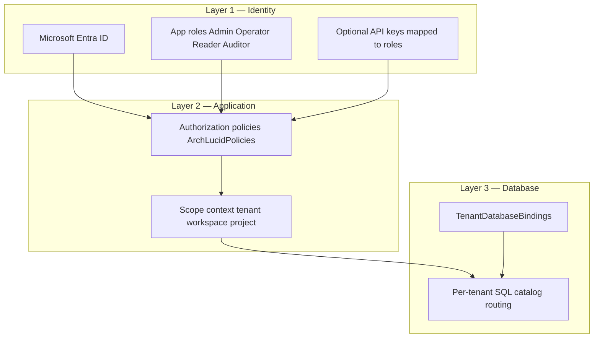

> **Scope:** ArchLucid — Tenant isolation (buyer overview) - full detail, tables, and links in the sections below.

> **Spine doc:** [`START_HERE.md`](../START_HERE.md).


# ArchLucid — Tenant isolation (buyer overview)

**Audience:** Security reviewers who need a **short** explanation before diving into engineering docs.

**Last reviewed:** 2026-04-15

**Headline:** Your data is **logically isolated** at **identity**, **application**, and **database** layers when ArchLucid is deployed with the recommended Azure posture. This page summarizes; deep references are linked below.

**Healthcare / PHI:** ArchLucid is for **architecture and governance evidence** about systems you describe; **do not upload PHI** into product briefs or unstructured context fields. Posture and contractual questions (including BAA) are summarized under **[`docs/go-to-market/trust-center.md`](../go-to-market/trust-center.md)** (**Healthcare and PHI**); inquiries → **`sales@archlucid.net`**.

---

## 1. Three layers {#three-layers}



- **Layer 1 — Identity:** Prefer **Entra-issued JWTs** with **app roles**; API keys are server-side secrets mapped to **limited** roles ([SECURITY.md](../library/contributor-reference/SECURITY.md)).
- **Layer 2 — Application:** Controllers enforce **policies**; orchestration sets **tenant / workspace / project** scope before data access ([../security/MULTI_TENANT_RLS.md](../security/MULTI_TENANT_RLS.md) §5).
- **Layer 3 — Database:** In `SystemWithPerTenantCatalogs` (production) mode each tenant organization receives a **dedicated product SQL catalog** resolved via `TenantDatabaseBindings`. **SQL RLS is not used** ([ADR 0037](../architecture/adrs/0037-tenant-isolation-without-rls-defense-in-depth.md)). Application repositories still apply scope predicates within the catalog. Deep reference: [`TENANT_ISOLATION_DEFENSE_IN_DEPTH.md`](../security/TENANT_ISOLATION_DEFENSE_IN_DEPTH.md).

---

## 2. Encryption {#encryption}

- **In transit:** TLS to the API; TLS to Azure services per Microsoft’s stack.
- **At rest:** Azure SQL (TDE) and blob encryption are standard Azure controls; see [../CUSTOMER_TRUST_AND_ACCESS.md](../library/CUSTOMER_TRUST_AND_ACCESS.md).
- **Secrets:** Prefer **Key Vault** references in hosted configs ([../CONFIGURATION_KEY_VAULT.md](../library/CONFIGURATION_KEY_VAULT.md)).

---

## 3. Network {#network}

Optional **Front Door + WAF**, optional **APIM**, and **private endpoints** for SQL and blob reduce exposure ([../CUSTOMER_TRUST_AND_ACCESS.md](../library/CUSTOMER_TRUST_AND_ACCESS.md)). **SMB (445)** is not used for tenant data at the API boundary (workspace security rule).

---

## 4. Audit and accountability {#audit-and-accountability}

Durable **append-only** audit events and correlation IDs support forensic review ([../AUDIT_COVERAGE_MATRIX.md](../library/AUDIT_COVERAGE_MATRIX.md), [SECURITY.md](../library/contributor-reference/SECURITY.md)).

---

## 5. What we do not claim here {#what-we-do-not-claim-here}

Hosted **trial** tenants and **commercial** pilots use ArchLucid's **single supported multitenant data-plane model**: **`SystemWithPerTenantCatalogs`** (**database-per-tenant** routing via **`TenantDatabaseBindings`** — one product catalog per tenant organization). `SingleCatalog` may exist only for narrow **developer/CI convenience** and is **not** the hosted SaaS posture; deep detail: **[`../library/TENANT_DATABASE_TOPOLOGY.md`](../library/TENANT_DATABASE_TOPOLOGY.md)**, **[`trust-center.md`](trust-center.md)** (*Data isolation*).

Unless separately contracted and documented:

- **Dedicated compute / silo SKU per tenant** — not implied for standard SaaS.
- **Customer-managed keys (BYOK)** — not stated; confirm in roadmap or security pack if offered.

Be explicit in sales and security packs to avoid over-claiming.

---

## 7. Verification pack (generated)

Generate a buyer-safe metadata pack (no tenant data, no secrets):

```bash
python scripts/generate_tenant_isolation_verification_pack.py
```

Outputs under `dist/tenant-isolation-verification-pack/`:

- `tenant-isolation-verification.json` — topology, layer summary, test inventory, redaction notes
- `tenant-isolation-verification.md` — human-readable mirror for procurement/support bundles

CI validates references with `--dry-run`.

---

## 6. Deep dives

| Doc | Content |
|-----|---------|
| [../security/TENANT_ISOLATION_DEFENSE_IN_DEPTH.md](../security/TENANT_ISOLATION_DEFENSE_IN_DEPTH.md) | Defense-in-depth architecture per ADR 0037; database-per-tenant + app-layer scope predicates |
| [../security/SYSTEM_THREAT_MODEL.md](../security/SYSTEM_THREAT_MODEL.md) | STRIDE, trust boundaries |
| [../CUSTOMER_TRUST_AND_ACCESS.md](../library/CUSTOMER_TRUST_AND_ACCESS.md) | Edge, identity, private connectivity |
| [SECURITY.md](../library/contributor-reference/SECURITY.md) | RBAC, rate limiting, CI security tests, PII |

---

## Related documents

| Doc | Use |
|-----|-----|
| [trust-center.md](trust-center.md) | Trust index |
| [SUBPROCESSORS.md](SUBPROCESSORS.md) | Where data is processed (Azure) |
