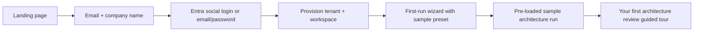

> **Scope:** ArchLucid — Trial and signup experience design - full detail, tables, and links in the sections below.

> **Spine doc:** [Five-document onboarding spine](../FIRST_5_DOCS.md). Read this file only if you have a specific reason beyond those five entry documents.

# ArchLucid — Trial and signup experience design

**Audience:** Product and engineering teams planning the self-serve trial path.

**Last reviewed:** 2026-05-11 (§4 separates near‑term **automated infra purge urgency** vs **product lifecycle** posture; §3 AOAI unchanged; prior 2026‑05‑10 self‑serve/email stance unchanged).

**Pricing:** Trial parameters (seats, runs, duration) are governed by the free trial row in [PRICING_PHILOSOPHY.md](PRICING_PHILOSOPHY.md) §4. Prices for conversion are in [PRICING_PHILOSOPHY.md §5](PRICING_PHILOSOPHY.md) — do not restate numbers here.

---

## 1. Goal

Prospect → active trial in **< 5 minutes** with no sales contact required. The trial should deliver the same "first impression" as the seller-led Docker demo ([DEMO_QUICKSTART.md](DEMO_QUICKSTART.md)) but in a **buyer-led, hosted** experience.

**Operator stance (2026-05-10):** Hosted **trials ship as PLG**: **self-serve** onboarding through **`/signup`** with **email + organization**, Entra/email-password paths per §2. **Default GTM posture is not** “request trial access → manual approval before account exists.” Exceptions (e.g. named enterprise pilots) remain **sales-led** engagements outside this self-serve path.

---

## 2. Signup flow

| Step | Owner | Notes |
|------|-------|-------|
| Landing page | Marketing | CTA: "Start free trial" — no credit card required |
| Email + company | Product | Minimal form; company name for ICP qualification |
| Authentication | Engineering | Entra social login (Microsoft account), or email/password for non-Microsoft users |
| Tenant provisioning | Engineering | Automated: create tenant, workspace, assign Admin role, seed sample data |
| First-run wizard | Product (existing) | Pre-select a sample preset (e.g., "Greenfield web app") so the trial user sees results immediately |
| Sample run | Engineering | Auto-execute a sample run using the agent simulator so results appear without LLM cost |
| Guided tour | Product | In-app tooltips or checklist highlighting: findings, manifest, governance, comparison |

### 2.1 Baseline review-cycle (soft-required UX)

The signup form defaults to **“Use model default (modeled estimate)”** so prospects are nudged toward a consistent “before” anchor without blocking signup. Prospects may switch to **custom hours**; how that field is used in deltas and **what is never published per-tenant** is documented in [`TRIAL_BASELINE_PRIVACY_NOTE.md`](TRIAL_BASELINE_PRIVACY_NOTE.md). When prospects stay on the model default path, the API increments `archlucid_trial_signup_baseline_skipped_total` (see [`docs/runbooks/TRIAL_FUNNEL.md`](../runbooks/TRIAL_FUNNEL.md)).

### 2.2 Team Stripe checkout (`NEXT_PUBLIC_STRIPE_TEAM_CHECKOUT_ENABLED`)

Public **`/pricing`** treats Team self-serve checkout as **off by default**: the Team tier stays quote-first (**Request quote** + trial link) unless **`NEXT_PUBLIC_STRIPE_TEAM_CHECKOUT_ENABLED`** is set to **`true`** or **`1`** at **Next.js build time**, in which case the primary CTA becomes the Stripe-hosted URL from **`resolveTeamStripeCheckoutHref`** (`pricing.json` **`teamStripeCheckoutUrl`**, optionally overridden by **`NEXT_PUBLIC_STRIPE_TEAM_CHECKOUT_URL`**). Keep this flag unset or false in production builds until staging validates Checkout and webhooks; use **Stripe TEST mode** Payment Links / Checkout URLs only until then—never bake live Stripe secrets into the UI bundle.

---

## 3. Trial parameters

| Parameter | Value | Rationale |
|-----------|-------|-----------|
| **Duration** | **30 days** | Enterprise architects need 4+ sessions across multiple weeks to evaluate, demo to stakeholders, and make a buy decision; 14 days was too short for the product's complexity and multi-stakeholder evaluation pattern |
| **Tier** | **Team** features (per [PRICING_PHILOSOPHY.md](PRICING_PHILOSOPHY.md)) | Provides architecture runs, manifests, comparisons — enough to demonstrate core value |
| **Seats** | Up to 3 | Allows team evaluation without over-provisioning |
| **Runs** | 10 included | Sufficient for meaningful evaluation; prevents abuse |
| **Workspaces** | 1 | Simplicity for trial; upgrade to add more |
| **Data** | Pre-seeded sample project (using Docker demo seed pattern) | Ensures immediate value — user sees a completed run on first login |
| **Trial end** | **Read-only access** for 14 days after expiration, then data export available for 30 days, then deletion per [DPA](DPA_TEMPLATE.md) | Avoids abrupt loss; incentivizes conversion; one-time 14-day extension available via in-app button |

### 3.1 Duration economics (operator, 2026-05-11)

Calendar **duration stays 30 days** (table above): evaluation buyers revisit across **weeks**. **Runs** (**10**) cap Azure OpenAI spend **before** the calendar does — shortening trial days **without lowering run caps saves almost no AOAI**.

To reduce LLM envelope: **fewer evaluation runs**, **lower `AzureOpenAI:MaxCompletionTokens`**, cheaper **deployment SKUs**, and **`LlmMonthlyTenantDollarBudget`** (see **section 3.2**)—**not** a 14‑day blanket duration cut.

**Product backlog recommendation (not coded today):** transition abandoned trials earlier by **moving to read‑only after 14 consecutive days with zero product activity** once activity signals are authoritative (coordinate with **`TrialLifecycleTransitionEngine`** and `archlucid_trial_expirations_total` reason labels).

---

### 3.2 Azure OpenAI spend (hosted trial, operator stance 2026-05-11)

This is **order‑of‑magnitude forecasting** backed by **`AgentExecution:LlmCostEstimation`** default illustrative rates (**`InputUsdPerMillionTokens`** **\$0.5** / **`OutputUsdPerMillionTokens`** **\$1.5** USD per 1M tokens — see **`LlmCostEstimationOptions`**) plus the **`GET /v1/agent-execution/cost-preview`** assumptions (wizard upper bound inputs \~8192 tokens, completion bound by effective **`AzureOpenAI:MaxCompletionTokens`**, commonly **4096** unless tightened). Detailed methodology and caveats live in **[`../library/PER_TENANT_COST_MODEL.md`](../library/PER_TENANT_COST_MODEL.md)** — reconcile against **Azure invoice** pricing.

Real architecture runs invoke **four** specialist pipelines (topology / cost / compliance / critic) plus follow‑on tooling; totals scale with **`MaxCompletionTokens`**, retries, and **Ask** traffic.

**Rule of thumb (one active tenant, **10 evaluation runs**/month saturated):**

| Deployment class | Ballpark AOAI **USD / trial‑month** (LLM tokens only) | Notes |
|------------------|------------------------------------------------------|--------|
| **`gpt‑4o`‑mini class** (rates near shipped defaults above) | **~\$3–\$6** | Baseline SaaS forecasting band. |
| **`gpt‑4o`‑class deployments** | **~\$15–\$25** | Higher list prices + longer completions. |

Add light **Ask** / advisory chatter: **~\$1–\$3**/month discretionary.

Fleet envelope (multiply by **concurrently active trials**): **\$5 × trials** (\$150 at **30**) for mini‑class optimism; **`LlmMonthlyTenantDollarBudget` hard‑cutoffs** clamp worst‑case outliers.

Infra dominates hosted COGS (**per‑tenant SQL**, Container Apps compute, egress, observability) — AOAI tuning alone does **not** replace elastic‑pool sizing for signup traffic.

#### Configuration posture (engineering)

Target hosted signup hosts (**`Hosting` SaaS overlays merge `appsettings.SaaS.json`**) as follows:

| Knob | Stance |
|------|--------|
| **`AgentExecution:Mode`** | **`Real`** for buyer‑started architecture runs (**welcome seed/sample** may remain **Simulator** for zero‑day cost control in **section 2**). |
| **`AzureOpenAI`** deployment SKU | Prefer **mini / cost‑efficient** SKUs mapped to illustrative **`LlmCostEstimation`** rates (override USD/M tokens when SKU prices diverge — see [**`CAPACITY_AND_COST_PLAYBOOK.md`**](../library/CAPACITY_AND_COST_PLAYBOOK.md)). |
| **`AzureOpenAI:MaxCompletionTokens`** | Rightsize below default **4096** when QA tolerates tighter findings (staging currently uses tighter caps elsewhere; align trial hosts deliberately). **`1024`** is an evaluation‑friendly midpoint when product agrees. |
| **`LlmMonthlyTenantDollarBudget`** | Repo **`appsettings.SaaS.json`** enables budgeting with **`IncludedUsdPerUtcMonth`** **\$50** / **`HardCutoffUsdPerUtcMonth`** **\$75** (**all SaaS tenants** share this host today — generous headroom for trials **and** pilots). When **tier‑scoped** binds exist, tighten **Free/`Tier` trial tenants** toward **\$25** included / **\$35** hard‑cutoff (warn first via **`WarnFraction`**). Instrument with **`archlucid_llm_cost_usd_total`** and **`LlmTenantMonthlyDollarBudgetApproaching`** audits ([`AUDIT_COVERAGE_MATRIX.md`](../library/AUDIT_COVERAGE_MATRIX.md)). |

Merge order for **`appsettings`** is environment‑specific — reconcile **`AgentExecution:Mode=Real`** plus AOAI prerequisites before asserting hosted‑prospect fidelity (**[`FIRST_REAL_VALUE.md`](../library/FIRST_REAL_VALUE.md)**); funnel scraping remains in **`docs/runbooks/TRIAL_FUNNEL.md`**.

**Per‑run prompt design is not capped (operator, 2026-05-11).** A run that consumes most of a tenant’s monthly envelope is **acceptable**; the governing limit is the **per‑tenant per‑UTC‑month** estimate enforced by **`LlmMonthlyTenantDollarBudget`** + the sliding window in **`LlmTokenQuota`**, not an artificial per‑run dollar ceiling. **Buying more tokens** when the monthly cap is hit is a tracked backlog item — see **`TB-014`** in **[`../library/TECH_BACKLOG.md`](../library/TECH_BACKLOG.md)** (Stripe SKU + grant ledger reuse + audit). Trial tenants are **not** the target audience for top‑up SKUs; PLG conversion remains the path forward when a trial nears its run cap or budget.

---

## 4. Technical requirements (high level)

| Requirement | Description | Priority |
|-------------|-------------|----------|
| **Multi-tenant provisioning** | API or background service that creates tenant, workspace, seeds sample data, and assigns roles | Must-have |
| **Trial feature flags** | Configuration-driven tier enforcement (run limits, feature gates per [PRICING_PHILOSOPHY.md](PRICING_PHILOSOPHY.md)) | Must-have |
| **Usage metering** | Track runs consumed, seats active, features used — feeds health scoring ([CUSTOMER_HEALTH_SCORING.md](CUSTOMER_HEALTH_SCORING.md)) and conversion analytics | Must-have |
| **Billing integration** | Stripe, Azure Marketplace, or equivalent — triggered on conversion from trial to paid | Phase 2 |
| **Marketing Team Stripe CTA** | Public `/pricing` Team tier: **`NEXT_PUBLIC_STRIPE_TEAM_CHECKOUT_ENABLED=true`** (or **`1`**) required for Stripe Checkout as primary CTA; optional **`NEXT_PUBLIC_STRIPE_TEAM_CHECKOUT_URL`** overrides **`pricing.json`**. **`resolveTeamStripeCheckoutHref`** still returns **`null`** when the flag is **`0`**/**`false`** (suppression). Details in **section 2.2** above. | Phase 2 |
| **Trial lifecycle (CRM + entitlement)** | Automated lifecycle emails (**§5**), **read‑only enforcement** once trial phases advance, **`TrialLimitGate`**, **`dbo.TenantLifecycleTransitions`** / audit trail (**[`TRIAL_LIFECYCLE.md`](../runbooks/TRIAL_LIFECYCLE.md)**) | Must‑have |
| **Automated hard purge vs manual infra cleanup** | **Product code** already exposes **`Trial:Lifecycle`** → **`TrialLifecycleSchedulerHostedService`** → optional **`SqlTenantHardPurgeService`** (see **`TRIAL_LIFECYCLE`**). **Operator stance (2026-05‑11):** do **not** treat **immediate lights‑out infra teardown** as a near‑term optimisation — **inactive trials burn negligible AOAI** (no completions). **Deleting an idle tenant’s Azure SQL catalog remains low friction for platform admins** (`TenantDatabaseBindings` path per **`../library/TENANT_DATABASE_TOPOLOGY.md`**). Tune **`PurgeAfterExportOnlyDays`** / scheduler interval **generously**, lean on **manual** catalog drop + ticket when volume is modest, revisit **prioritising** unattended purge automation when dormant‑tenant cardinality strains pools or violates retention SLAs. **DPA** export / eventual deletion narratives stay honest — timing may be **`Trial:Lifecycle` + Ops SOP**, not hurry. | Phase 2 (automation urgency) |

---

## 5. Conversion triggers

| Trigger | Channel | Timing |
|---------|---------|--------|
| **Welcome + getting started** | Email | Day 0 |
| **"Your first run is complete"** | In-app notification + email | Day 1 (after seed run) |
| **Mid-trial check-in** | Email | Day 14 |
| **Approaching run limit** | In-app banner | When 8 of 10 runs consumed |
| **Trial expiring soon** | Email + in-app | Day 26 |
| **Trial expired** | Email with upgrade CTA pointing at **Stripe Checkout** for Team tier (`teamStripeCheckoutUrl` in `archlucid-ui/public/pricing.json`, populated per [STRIPE_CHECKOUT.md](STRIPE_CHECKOUT.md)) + data export reminder | Day 30 |
| **Champion enablement** | Auto-generated pilot scorecard stub (linked to [PILOT_SUCCESS_SCORECARD.md](PILOT_SUCCESS_SCORECARD.md)) | Day 10 (if > 3 runs completed) |

---

## 6. Relationship to Docker demo

| | Docker demo | Self-serve trial |
|--|-------------|-----------------|
| **Audience** | Seller-led prospects, conference attendees | Buyer-led self-evaluation |
| **Infrastructure** | Prospect's machine (Docker) | ArchLucid-hosted SaaS |
| **Data** | Pre-seeded, disposable | Pre-seeded, persisted for trial duration |
| **Auth** | DevelopmentBypass | Entra / email-password (production auth) |
| **Outcome** | "Wow" moment → schedule deeper evaluation | "Wow" moment → convert to paid or escalate to sales |

Both paths should deliver the **same first impression**: a completed architecture run with findings, manifest, and governance gate visible within minutes.

---

## Related documents

| Doc | Use |
|-----|-----|
| [PRICING_PHILOSOPHY.md](PRICING_PHILOSOPHY.md) | Tier features and limits |
| [DEMO_QUICKSTART.md](DEMO_QUICKSTART.md) | Seller-led Docker demo |
| [BUYER_PERSONAS.md](BUYER_PERSONAS.md) | Who signs up |
| [CUSTOMER_ONBOARDING_PLAYBOOK.md](CUSTOMER_ONBOARDING_PLAYBOOK.md) | Post-conversion onboarding |
| [PER_TENANT_COST_MODEL.md](../library/PER_TENANT_COST_MODEL.md) | AOAI estimation methodology (`GET /v1/agent-execution/cost-preview` wizard bound) |
| **[`CAPACITY_AND_COST_PLAYBOOK.md`](../library/CAPACITY_AND_COST_PLAYBOOK.md)** | Hosted capacity + **`LlmMonthlyTenantDollarBudget`** posture |

---
