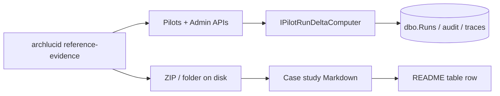

> **Reviewed:** 2026-07-25

> **Scope:** ArchLucid — reference-customers index — status table, how to add a real reference, per-customer tracking checklist, plus the publication runbook / named-reference capture / evidence pack template (formerly the body of `REFERENCE_PUBLICATION_RUNBOOK.md`; that filename remains a path-stable alias). CI Batch 5BC pins first-contact template strings on this README canon.

> **Spine doc:** [`START_HERE.md`](../../START_HERE.md).


# ArchLucid — reference-customers index

**Audience:** Marketing, sales, customer success, and product leadership.

**Last reviewed:** 2026-07-25

**Purpose:** Single source of truth for **real**, **publishable** reference-customer assets. This file replaces "no published reference customer" as a discount-stack assumption (see [`PRICING_PHILOSOPHY.md` § 5.4](../PRICING_PHILOSOPHY.md#54-discount-stack-work-down)). The CI guard [`scripts/ci/check_reference_customer_status.py`](../../../scripts/ci/check_reference_customer_status.py) parses the table below and (today) **warns** when zero rows have `Status: Published`. The same guard becomes **merge-blocking** the day the first real customer is `Published`, at which point the **−15% reference discount** in [`PRICING_PHILOSOPHY.md` § 5.1](../PRICING_PHILOSOPHY.md#51-derivation-50-of-fair-value-basis) becomes a candidate for re-rate ([§ 5.3](../PRICING_PHILOSOPHY.md#53-re-rate-plan)).

**Distinct from [`REFERENCE_NARRATIVE_TEMPLATE.md`](../REFERENCE_NARRATIVE_TEMPLATE.md):** that file holds the **fictional but realistic** narrative templates for marketing copy. *This* directory holds **real customer-specific assets** (case studies populated with permission, with placeholders unwound, ready to publish externally).

---

## Status lifecycle

Every row in the table below moves through these states in order. A CI guard rejects any other value.

| Status | Meaning | Exit criteria |
|--------|---------|---------------|
| `Placeholder` | Empty seat for a future real customer; case-study file uses `<<...>>` placeholders | Real customer name + signed reference agreement |
| `Drafting` | Real customer named; case study being written internally | Customer-facing copy ready to send |
| `Customer review` | Customer reviewing the draft for legal / brand approval | Written approval to publish |
| `Published` | Live on archlucid.net / sales decks / Azure Marketplace listing | (terminal) |

A row that fails to move from `Customer review` to `Published` within 60 days should be downgraded back to `Drafting` and flagged in the next pricing review.

---

## Reference-customer table

| Customer | Tier | Pilot start | Case-study link | Reference-call cadence | Status |
|----------|------|-------------|-----------------|------------------------|--------|
| EXAMPLE_DESIGN_PARTNER | Professional (design-partner −50%) | TBD | [EXAMPLE_DESIGN_PARTNER_CASE_STUDY.md](EXAMPLE_DESIGN_PARTNER_CASE_STUDY.md) | TBD (target: quarterly) | Placeholder — copy to `<slug>_CASE_STUDY.md` when a named design partner is authorized |
| First paying tenant (PLG) | `<<TIER>>` (at conversion) | TBD | [EXAMPLE_DESIGN_PARTNER_CASE_STUDY.md#plg-first-paying-tenant-variant](EXAMPLE_DESIGN_PARTNER_CASE_STUDY.md#plg-first-paying-tenant-variant) · [TRIAL_FIRST_REFERENCE_CASE_STUDY.md](TRIAL_FIRST_REFERENCE_CASE_STUDY.md) (alias) | TBD | Placeholder — populate after first self-serve trial converts to paid; see [`docs/PENDING_QUESTIONS.md`](../../PENDING_QUESTIONS.md) |
| **[DRAFT]** `[CUSTOMER]` · `[INDUSTRY]` | `[TIER]` | TBD | TBD — add `<slug>_CASE_STUDY.md` when entering Drafting | TBD — `[CONTACT]` | Draft — **DRAFT template row** (fabricated names forbidden here); replace placeholders and move to **Drafting** before naming a real customer |

> **Published requires human approval.** Do not set **`Status: Published`** on any row based on assistant or unilateral documentation edits. Eligibility, logo use, case study copy, and reference-call commitments must follow **[`PRICING_PHILOSOPHY.md` §4.1](../PRICING_PHILOSOPHY.md#41-reference-customer-discount-standardized-2026-04-21)**. Use **[publication checklist](#0-publication-checklist-human-gates)** before publication (`REFERENCE_PUBLICATION_RUNBOOK.md` alias).

> **CI guard contract:** the script reads only this table. The exact column order and the literal `Status` header text matter. Do not split the table across multiple sub-tables; add new rows to the bottom.

---

## How to add a real reference

0. **Workflow docs (TB-229):** Use [first-contact email template](#5-first-contact-email-template) (`REFERENCE_PUBLICATION_RUNBOOK.md` / [`NAMED_REFERENCE_CUSTOMER_CAPTURE.md`](../NAMED_REFERENCE_CUSTOMER_CAPTURE.md) aliases) for the initial ask and the [tracking checklist](#per-customer-tracking-checklist-ah) below for steps **a–h** from pilot-complete through **Published**.
1. **Copy** [`EXAMPLE_DESIGN_PARTNER_CASE_STUDY.md`](EXAMPLE_DESIGN_PARTNER_CASE_STUDY.md) to a new file named `<CUSTOMER_SLUG>_CASE_STUDY.md` (lowercase-hyphen-or-underscore slug; no spaces).
2. **Find/replace** every `<<CUSTOMER_NAME>>`, `<<TIER>>`, `<<DESIGN_PARTNER_TERM_START>>` and any other `<<...>>` placeholder with the real value. The existing pattern is intentional — it lets a sales engineer one-shot the substitution from a single deal-close email.
3. **Add a row** to the table above, with `Status: Drafting`.
4. **Move through the lifecycle** (Drafting → Customer review → Published) as approvals come in. Each transition gets a one-line entry in [`docs/CHANGELOG.md`](../../CHANGELOG.md) so finance/sales can re-rate the discount stack on a known cadence.
5. **When the first row reaches `Published`,** CI **auto-flips** to a merge-blocking re-check of the same script (see `.github/workflows/ci.yml` — *Guard — reference-customer status (auto-flip: strict once any Published row exists)*). You do **not** need to edit `continue-on-error` by hand. This is the moment that authorizes a pricing-review trigger per [`PRICING_PHILOSOPHY.md` § 5.3](../PRICING_PHILOSOPHY.md#53-re-rate-plan).

**PLG path:** If you are **not** waiting on a named design partner, use the **First paying tenant (PLG)** row and [`EXAMPLE_DESIGN_PARTNER_CASE_STUDY.md#plg-first-paying-tenant-variant`](EXAMPLE_DESIGN_PARTNER_CASE_STUDY.md#plg-first-paying-tenant-variant) as the first publishable reference once a trial converts and the customer approves copy.

---

## Per-customer tracking checklist (a–h)

Operational checklist from pilot-complete to **Published** (owner, sales, CS). Complements the status table above — does not replace it.

| Step | Action | Done |
|------|--------|------|
| **a** | Gather pilot metrics from [`PILOT_SUCCESS_SCORECARD.md`](../PILOT_SUCCESS_SCORECARD.md) and [`PILOT_ROI_MODEL.md`](../../library/PILOT_ROI_MODEL.md) §5 (runs committed, findings resolved, hours saved). | ☐ |
| **b** | Send first-contact email using [first-contact email template](#5-first-contact-email-template) (`REFERENCE_PUBLICATION_RUNBOOK.md` alias). | ☐ |
| **c** | Receive **written approval** for the chosen commitment tier (1, 2, or 3). | ☐ |
| **d** | Collect logo file (vector preferred) if logo use is approved. | ☐ |
| **e** | Draft case study from `<slug>_CASE_STUDY.md`; move README row to **Customer review**. | ☐ |
| **f** | Obtain customer-approved final copy (legal/brand). | ☐ |
| **g** | Add one-line entry to [`CHANGELOG.md`](../../CHANGELOG.md) when status becomes **Published**. | ☐ |
| **h** | Update README row to **Published**; confirm CI reference guard sees at least one published row. | ☐ |

**Sorting:** Work customers with the highest measured ROI delta and sponsor sponsor engagement first. Defer rows that lack written approval past 60 days back to **Drafting** per the lifecycle rules above.

---

## Reference publication runbook {#reference-publication-runbook}

Former standalone body: `docs/go-to-market/reference-customers/REFERENCE_PUBLICATION_RUNBOOK.md` → this section (filename kept as a path-stable alias). Includes named-reference capture and the evidence pack template. First-contact email strings are pinned here by CI Batch 5BC.

**Audience:** Product marketing, customer success, sales engineering, and the owner who signs legal agreements.  
**Path-stable alias:** [`REFERENCE_PUBLICATION_RUNBOOK.md`](REFERENCE_PUBLICATION_RUNBOOK.md).

**Related:** [`PRICING_PHILOSOPHY.md` § 5.4](../PRICING_PHILOSOPHY.md#54-discount-stack-work-down) · [`scripts/ci/check_reference_customer_status.py`](../../../scripts/ci/check_reference_customer_status.py) · [`#named-reference-customer-capture`](#named-reference-customer-capture) · [`#reference-evidence-pack-template`](#reference-evidence-pack-template) · [`../REFERENCE_NARRATIVE_TEMPLATE.md`](../REFERENCE_NARRATIVE_TEMPLATE.md)

### 0. Publication checklist (human gates) {#0-publication-checklist-human-gates}

Complete these gates **before** changing any status-table row above to **`Status: Published`**. This list does not replace counsel.

- **Logo permission** — Written approval for the customer’s logo (and associated brand marks) on the marketing site, decks, Marketplace copy, and any other surfaces named in the reference agreement.
- **Quote approval** — Every attributable quote, metric, or endorsement in the case study is approved for **public** use under the same agreement.
- **Case study legal review** — Customer legal / brand review of the **final** case-study document is complete; internal drafts stay out of public indexes until then.
- **CI / pricing gate** — Understand how merge-time automation behaves when the first **Published** row lands: **[`PRICING_PHILOSOPHY.md` §5.4 — Discount-stack work-down](../PRICING_PHILOSOPHY.md#54-discount-stack-work-down)** (link only — do not restate discounts here).

### 1. Objective (publication)

Ship **one** publishable reference backed by **measured** pilot deltas (time-to-commit, findings, audit rows, LLM calls) so finance can re-rate the **−15% reference discount** when the table first reaches `Status: Published` (CI auto-flip — see § *How to add a real reference* above).

### 2. Assumptions (publication)

- The customer has at least one **finalized** architecture package (API: golden manifest) in production or pilot SQL.
- You have an **API key** with `ReadAuthority` for tenant-scoped CLI export, or **AdminAuthority** for `--tenant` ZIP export.
- **Owner-blocked:** a countersigned **reference / logo / quote** agreement exists before anything is published externally.

### 3. Constraints (publication)

- **Never** publish Contoso demo numbers as a customer outcome. The CLI refuses demo runs unless `--include-demo` is explicit; JSON includes `isDemoTenant` for double-checks.
- Do **not** restate list prices outside [`PRICING_PHILOSOPHY.md`](../PRICING_PHILOSOPHY.md) — link instead.
- Historical SQL migrations **001–028** are immutable; evidence export is API/CLI-only.

### 4. Architecture overview (evidence flow)



### 5. Step-by-step — Drafting → Customer review → Published

#### Step 1 — Confirm legal sign-off (owner-blocked)

- [ ] Executed reference / logo / quote agreement (template: *owner legal template path TBD*).
- [ ] Customer named contact for approvals recorded.

#### Step 2 — Extract computed evidence

**Tenant-scoped run (operator / sales engineer key):**

```bash
archlucid reference-evidence --run <runId> [--out ./reference-evidence/<runId>] [--include-demo]
```

**Admin ZIP (global admin key, entire tenant anchor run auto-picked):**

```bash
archlucid reference-evidence --tenant <tenantId> [--out ./reference-evidence/tenant-<tenantId>] [--include-demo]
```

| Artifact | Source |
|----------|--------|
| `pilot-run-deltas.json` | `GET /v1/pilots/runs/{runId}/pilot-run-deltas` |
| `first-value-report.md` | `GET /v1/pilots/runs/{runId}/first-value-report` |
| `first-value-report.pdf` | `POST /v1/pilots/runs/{runId}/first-value-report.pdf` |
| `sponsor-one-pager.pdf` | `POST /v1/pilots/runs/{runId}/sponsor-one-pager` (Standard tier; may be absent) |
| ZIP (tenant path) | `GET /v1/admin/tenants/{tenantId}/reference-evidence` |

#### Step 3 — Fill the narrative

1. Open the [reference evidence pack template](#reference-evidence-pack-template) (path-stable alias: [`REFERENCE_EVIDENCE_PACK_TEMPLATE.md`](REFERENCE_EVIDENCE_PACK_TEMPLATE.md)).
2. Copy measured fields from `pilot-run-deltas.json` into the template.
3. For long-form prose, start from [`../REFERENCE_NARRATIVE_TEMPLATE.md`](../REFERENCE_NARRATIVE_TEMPLATE.md) archetypes and replace fictional names with the customer’s.

#### Step 4 — Customer review checklist

- [ ] **Quote accuracy** — every quote matches an email or signed doc; attach redacted source link internally.
- [ ] **Screenshots** — no third-party logos or unreleased product UI without permission; blur tenant-specific hostnames if required.
- [ ] **Numbers** — every numeric claim maps to `pilot-run-deltas.json` or [`PILOT_ROI_MODEL.md`](../../library/PILOT_ROI_MODEL.md) formula inputs the customer approved.
- [ ] **Demo banner** — if any screenshot accidentally includes demo data, ensure the “demo tenant — replace before publishing” banner is visible or delete the screenshot.

#### Step 5 — README row + CI flip

1. Add or update the customer row in the [status table](#reference-customer-table) with `Status: Drafting` → `Customer review` → `Published` per the lifecycle table.
2. The CI guard [`check_reference_customer_status.py`](../../../scripts/ci/check_reference_customer_status.py) parses **only** that table. When **any** row’s normalized `Status` token is `published`, the follow-on strict step in `.github/workflows/ci.yml` becomes merge-blocking (auto-flip — no YAML hand-edit).
3. Add a one-line entry to [`../../CHANGELOG.md`](../../CHANGELOG.md) on each transition so finance can trace discount re-rate timing ([`PRICING_PHILOSOPHY.md` § 5.3](../PRICING_PHILOSOPHY.md#53-re-rate-plan)).

### 6. Security model (publication)

- API keys with **only** `ReadAuthority` cannot call `--tenant` admin export (403).
- Evidence ZIPs may contain **run metadata** — treat as **confidential** until the customer publishes.
- Do not attach ZIPs to public tickets; use NDA-gated storage.

### 7. Operational considerations (publication)

- **404 on tenant export:** no finalized review for that tenant after demo filtering — seed a real pilot review or pass `--include-demo` for internal-only rehearsal.
- **402 on sponsor PDF:** tenant below Standard — omit from pack; Markdown + first-value PDF still tell the story.
- **Re-run evidence** after each material pilot week so the case study stays fresh.

### 8. Owner decisions

Defer to [`../../PENDING_QUESTIONS.md`](../../PENDING_QUESTIONS.md):

- Discount-for-reference percent (default narrative: **15%** per § 5.4).
- Whether the first **Published** row is **PLG first paying tenant** vs **named design partner**.

### Named reference customer capture {#named-reference-customer-capture}

Former standalone body: `docs/go-to-market/NAMED_REFERENCE_CUSTOMER_CAPTURE.md` → this section (filename kept as a path-stable alias).

**Window:** V1.1 GTM backlog (TB-164) — do not treat as a V1 release requirement or headline-readiness factor.

**Audience:** Founder and GTM lead managing the transition from controlled pilot to public-reference customer.

Using a named reference without completing this checklist is not permitted.

#### Context and guardrails

ArchLucid V1 has no approved named public references. This is not a product defect. Current materials can accurately state "no named public reference yet."

Before any named reference, logo, case study, or reference call is used externally:

1. This checklist must be completed and signed off by the owner.
2. The claim must be scoped to exactly what the reference record permits.
3. The claim must pass the copy guard in [`PUBLIC_CLAIM_BOUNDARY_GUIDE.md#gtm-do-not-promise`](../../library/PUBLIC_CLAIM_BOUNDARY_GUIDE.md#gtm-do-not-promise).

#### Permission requirements by reference type

| Reference use | Permission required | Legal approval required | Revalidation cadence |
| --- | --- | --- | --- |
| Customer logo on website / marketing materials | Written permission (email or signed release); customer legal may require | Owner + customer legal review | Annual or on contract change |
| Public case study with company name | Signed reference agreement or case-study release | Owner + customer legal review | On content update |
| Anonymized case study (no name, no logo) | Verbal or written consent; anonymization reviewed by owner | Owner review | On content update |
| Reference call (customer speaks to prospect) | Written agreement naming scope and topics | Owner + customer review | Per call |
| Third-party review site quote (G2, TrustRadius, etc.) | Customer consent to the quote as written | Owner review | On quote update |
| ROI figure with attribution | Customer approval of specific numbers; source label applied | Owner review | On figure update |

#### Reference-readiness checklist

Complete one record per customer reference candidate.

##### Proof packet quality gate

- [ ] The pilot completed with PASS outcome per [`PILOT_ACCEPTANCE_THRESHOLDS.md`](../PILOT_ACCEPTANCE_THRESHOLDS.md).
- [ ] At least one committed run with buyer-provided or buyer-accepted evidence exists.
- [ ] ROI figures are labeled by source (buyer-provided, defaulted, demo-derived).
- [ ] No HOLD rows in the final pilot scorecard remain unresolved.

##### Buyer approval gate

- [ ] Customer key contact name and title confirmed:
- [ ] Customer sponsor sponsor confirmed:
- [ ] Reference permission scope agreed (choose all that apply):
  - [ ] Internal use only (no public claim)
  - [ ] Anonymized case study (no name, no logo)
  - [ ] Named logo use on ArchLucid website
  - [ ] Named case study with ROI data
  - [ ] Named reference call availability
  - [ ] Third-party review quote
- [ ] What can be said (approved claim language):
- [ ] Where it can be used (channels, materials, URLs):
- [ ] What cannot be said (exclusions or caveats):

##### Legal approval gate

- [ ] Reference agreement or signed release obtained (attach reference or file location):
- [ ] Customer legal has reviewed and approved the specific claim language:
- [ ] Revocation process agreed (customer can withdraw reference by: _____________________):
- [ ] Owner has signed off on legal gate completion: _______ Date: _______

##### Claim boundary review

- [ ] Every external use of this reference has been reviewed against [`PUBLIC_CLAIM_BOUNDARY_GUIDE.md#gtm-do-not-promise`](../../library/PUBLIC_CLAIM_BOUNDARY_GUIDE.md#gtm-do-not-promise).
- [ ] The claim does not imply SOC 2 CPA, third-party pen test, guaranteed ROI, or other unavailable assurance.
- [ ] If ROI figures are used, they include source labels and the claim scope matches what the customer approved.
- [ ] Claim has passed the commercial copy overclaim check.

#### Reference record template

Maintain one completed record per approved reference (customer name, scope, approved claim language, channels, exclusions, revocation process, legal gate, owner sign-off, revalidation due).

### First-contact email template {#5-first-contact-email-template}

Copy-paste after a successful pilot for founder, sales, and customer success. Not a legal commitment or published case study.

**Pricing context:** Reference participation unlocks the standing **−15% reference discount** described in [PRICING_PHILOSOPHY.md §4.1](../PRICING_PHILOSOPHY.md#41-reference-customer-discount-standardized-2026-04-21). Do not promise publication until written approval is on file.

#### Subject line variants

**Short:** ArchLucid pilot wrap-up — reference request?

**Long:** Thank you for the ArchLucid pilot — optional reference participation (15% ongoing discount)

#### Body template

Hello <<CUSTOMER_NAME>> team,

Thank you for completing the ArchLucid architecture review pilot on the **<<TIER>>** tier. <<PILOT_OUTCOME_SENTENCE>>

We would be grateful if you would consider becoming a published reference customer. Participation includes a **15% standing discount** on subscription pricing while the reference remains active (see our pricing philosophy for re-rate rules).

Please choose one commitment level:

1. **Logo only** — permission to display your logo on archlucid.net and sales decks.
2. **Logo + written quote** — a short attributed quote we can use in marketplace and datasheet copy.
3. **Full case study + reference call** — a one-page case study (we draft; you approve) plus up to one 30-minute reference call per quarter for qualified prospects.

**Next step:** Reply with your preferred option (1, 2, or 3) and the best contact for legal/brand review.

Thank you,  
<<SENDER_NAME>>  
ArchLucid

#### Objection-handling postscript

**If your policy blocks customer references:** We can still document an **internal success summary** without public logo use. The −15% reference discount applies only after a **Published** row in this index — not from this email alone.

**If legal needs more time:** We will keep your row in **Customer review** status until written approval arrives; nothing is published without your sign-off.

#### Routing for current V1 materials

Until at least one reference record has been completed and signed off:

- Current materials should say: "ArchLucid is currently conducting controlled pilots. Named public references are not yet approved."
- Do not use "a leading healthcare company" or similar implied-real language without an anonymized-case-study release.
- Route public-reference asks from prospects to this checklist, not to an informal commitment.

### Reference evidence pack template {#reference-evidence-pack-template}

Former standalone body: `docs/go-to-market/reference-customers/REFERENCE_EVIDENCE_PACK_TEMPLATE.md` → this section (filename kept as a path-stable alias).

One-page **template** for a single customer reference pack. Replace `<<…>>` placeholders. Every **computed** line must map to `pilot-run-deltas.json` produced by `archlucid reference-evidence` (or the admin ZIP).

#### Logo

`<<LOGO_URI_OR_ATTACH>>`

#### Problem statement (before ArchLucid)

`<<2_4_SENTENCES_CUSTOMER_VOICE>>`

#### Measured deltas (from `pilot-run-deltas.json`)

> Fill from the CLI export. Property names refer to **camelCase** JSON from `GET /v1/pilots/runs/{runId}/pilot-run-deltas`. **Internal format-only sample:** [`samples/pilot-run-deltas.demo-tenant.json`](samples/pilot-run-deltas.demo-tenant.json) (must remain **demo tenant — replace before publishing** until a customer export replaces it).

| Metric | Value | JSON field |
|--------|------:|------------|
| Wall-clock request → committed manifest | `<<HH:MM:SS>>` | `timeToCommittedManifestTotalSeconds` (convert from seconds) |
| Manifest committed at (UTC) | `<<ISO8601>>` | `manifestCommittedUtc` |
| Run created at (UTC) | `<<ISO8601>>` | `runCreatedUtc` |
| Findings by severity | `<<TABLE_OR_BULLETS>>` | `findingsBySeverity[]` → `{ severity, count }` |
| Audit rows (run scope) | `<<N>>` (`<<lower bound if truncated>>`) | `auditRowCount`, `auditRowCountTruncated` |
| LLM completion calls (run scope) | `<<N>>` | `llmCallCount` |
| Top finding id / severity | `<<id>>` / `<<severity>>` | `topFindingId`, `topFindingSeverity` |
| Demo flag | `<<Yes/No>>` | `isDemoTenant` — **must be No** for external publication |

**Review-cycle hours saved** (if captured at signup): derive per [`PILOT_ROI_MODEL.md`](../../library/PILOT_ROI_MODEL.md) § 3.1 using tenant baseline fields — not duplicated in `pilot-run-deltas.json`.

#### Customer quote

> `<<ONE_SENTENCE_QUOTE>>`  
> — `<<NAME, TITLE>>`, `<<DATE>>`

#### Screenshot

`<<SCREENSHOT_URI>>` — run detail or committed manifest view (no demo banner unless intentionally demo).

#### Links

- Case study file: `<<PATH_TO_CASE_STUDY_MD>>`
- Evidence folder / ZIP on secure share: `<<INTERNAL_LINK>>`

#### Demo-tenant scaffold (internal shape only) {#demo-tenant-scaffold-internal-shape-only}

**Not** a publishable customer artefact. Until a paying customer export exists, you may copy **shape only** from [`samples/pilot-run-deltas.demo-tenant.json`](samples/pilot-run-deltas.demo-tenant.json) — keep the literal banner **demo tenant — replace before publishing** on every ArchLucid-side artifact. Every numeric and narrative cell in a real pack must come from **customer-approved** sources per this runbook.

| Template metric row | JSON / API field |
|---------------------|------------------|
| Wall-clock request → finalized architecture package | `timeToCommittedManifestTotalSeconds` |
| Manifest committed at | `manifestCommittedUtc` |
| Run created at | `runCreatedUtc` |
| Findings by severity | `findingsBySeverity[]` |
| Audit rows | `auditRowCount`, `auditRowCountTruncated` |
| LLM completion calls | `llmCallCount` |
| Top finding | `topFindingId`, `topFindingSeverity` |
| Demo flag | `isDemoTenant` — must be **false** before external publication |

---

## Related documents

| Doc | Use |
|-----|-----|
| [`#reference-publication-runbook`](#reference-publication-runbook) · [`REFERENCE_PUBLICATION_RUNBOOK.md`](REFERENCE_PUBLICATION_RUNBOOK.md) (alias) | Publish gates, evidence extraction, CI discount re-rate |
| [`#reference-evidence-pack-template`](#reference-evidence-pack-template) · [`REFERENCE_EVIDENCE_PACK_TEMPLATE.md`](REFERENCE_EVIDENCE_PACK_TEMPLATE.md) (alias) | One-page measured-delta template tied to `pilot-run-deltas.json` |
| [`PRICING_PHILOSOPHY.md` § 5.1](../PRICING_PHILOSOPHY.md#51-derivation-50-of-fair-value-basis) | Discount stack derivation (`−25%` trust, `−15%` reference, `−10%` self-serve = `−50%` total) |
| [`PRICING_PHILOSOPHY.md` § 5.3](../PRICING_PHILOSOPHY.md#53-re-rate-plan) | Re-rate gates that retire each discount line |
| [`PRICING_PHILOSOPHY.md` § 5.4](../PRICING_PHILOSOPHY.md#54-discount-stack-work-down) | Operational tracker — owner, target close, evidence link, re-rate trigger per discount line |
| [`REFERENCE_NARRATIVE_TEMPLATE.md`](../REFERENCE_NARRATIVE_TEMPLATE.md) | Three fictional-but-realistic narrative archetypes (FinServ / Tech / Healthcare) for marketing |
| [`PILOT_SUCCESS_SCORECARD.md`](../PILOT_SUCCESS_SCORECARD.md) | Metric definitions every published case study should populate |
| [`AZURE_MARKETPLACE_SAAS_OFFER.md`](../AZURE_MARKETPLACE_SAAS_OFFER.md) | Where published references appear in the Marketplace listing copy |
