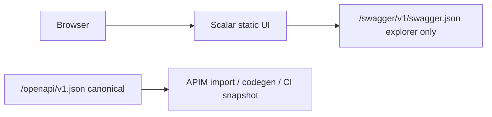

> **Scope:** API explorer (Scalar + OpenAPI) - full detail, tables, and links in the sections below.

> **Spine doc:** [Five-document onboarding spine](../FIRST_5_DOCS.md). Read this file only if you have a specific reason beyond those five entry documents.

# API explorer (Scalar + OpenAPI)

## 1. Objective

Give developers and operators an interactive, browser-based way to discover and try ArchLucid HTTP endpoints without leaving the documented OpenAPI surface.

## 2. Assumptions

- Non-production environments may enable the explorer; production keeps it off unless explicitly configured.
- **`GET /openapi/v1.json`** is the **canonical** OpenAPI document (contract tests, APIM import, npm/PyPI/.NET client generation). **`GET /swagger/v1/swagger.json`** exists **only** so Scalar can render the explorer (schema IDs, tags, examples, auth metadata aligned via shared mutators — but not a second contract of record).
- Microsoft `MapOpenApi()` serves the canonical document; Swashbuckle serves the explorer-facing sibling.

## 3. Constraints

- **Security:** `DeveloperExperience:EnableApiExplorer` must stay `false` in production unless a deliberate exception is made; a warning is logged when enabled outside Development.
- **Network:** Any staging enablement should sit behind private networking or authenticated ingress, not a public internet default.
- **Metering:** Explorer routes do not match `/v1/…` versioned API paths and are not counted as tenant API usage.

## 4. Architecture Overview

## 5. Component Breakdown

| Piece | Role |
| --- | --- |
| `Swashbuckle.AspNetCore` | Generates **`/swagger/v1/swagger.json`** for Scalar (`UseSwagger()`); explorer UX only. |
| `Scalar.AspNetCore` | Renders the Scalar UI and points it at the Swashbuckle document pattern. |
| `Microsoft.AspNetCore.OpenApi` | Serves **`/openapi/v1.json`** — **canonical** spec for APIM, SDKs, and `OpenApiContractSnapshotTests`. |
| `DeveloperExperienceOptions` | Configuration gate for opt-in outside Development. |

## 6. Data Flow

1. Operator opens `/scalar/v1` (or `/scalar/` and picks document `v1`).
2. Scalar loads configuration that references `/swagger/v1/swagger.json`.
3. Browser fetches that JSON from the same host; Scalar renders operations and “try it” UI.

## 7. Security Model

- Default production: explorer endpoints not registered (`EnableApiExplorer: false` and not Development).
- Opt-in: set `DeveloperExperience:EnableApiExplorer` to `true` only with network and identity controls aligned to your threat model.
- Static replay recipe HTML (`DocsController`) links to Scalar instead of legacy Swagger UI.

## 8. Operational Considerations

- **URLs:** Scalar UI: `/scalar/v1` (typical). Explorer JSON: `/swagger/v1/swagger.json`. **Canonical import/codegen:** `/openapi/v1.json`.
- **Upgrades:** Keep `Scalar.AspNetCore` aligned with the repo central package versions (`Directory.Packages.props`).
- **Failure mode:** If Scalar fails to load the JSON, check reverse-proxy paths and that `UseSwagger()` runs in the same pipeline configuration as Scalar.
