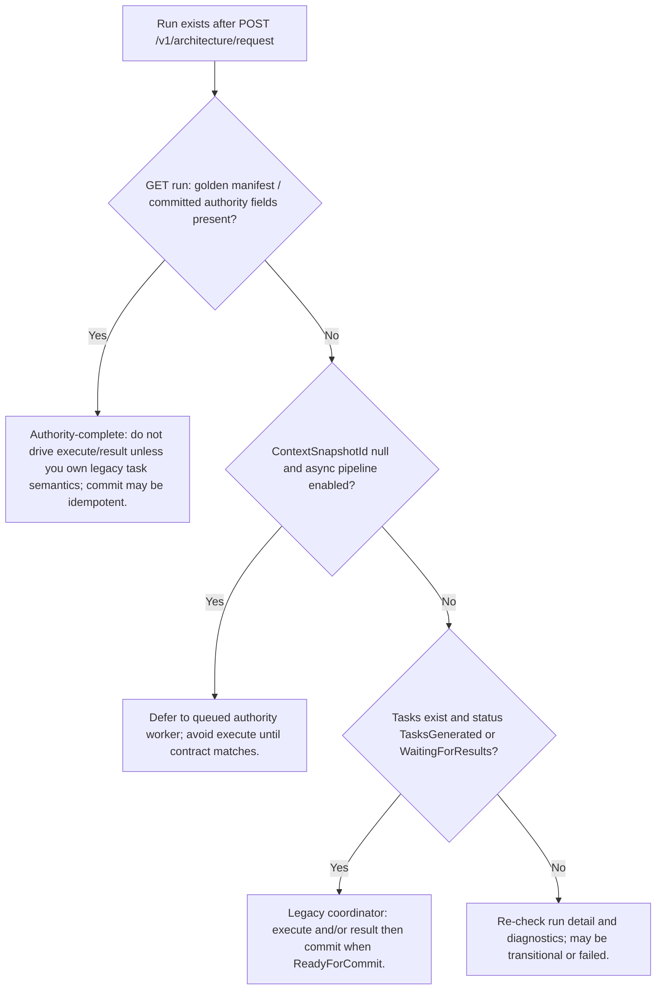

> **Scope:** ArchLucid architecture (Key flows) - full detail, tables, and links in the sections below.

> **Spine doc:** [`START_HERE.md`](../START_HERE.md).

## ArchLucid architecture (Key flows)

**Canonical poster:** [ARCHITECTURE_ON_ONE_PAGE.md](../ARCHITECTURE_ON_ONE_PAGE.md) · **Operator atlas:** [OPERATOR_ATLAS.md](OPERATOR_ATLAS.md)

This doc describes the main runtime flows in “sequence narrative” form. It’s meant to be readable without diagrams.

---

### Flow A: Run lifecycle (request → committed manifest)

**Goal:** Turn an `ArchitectureRequest` into a committed, versioned golden manifest.

**Important:** There are **two ways** the product reaches that outcome. **`POST /v1/architecture/request`** always persists the run and, on **SQL storage**, enters **`IAuthorityRunOrchestrator`** (context ingestion → knowledge graph → findings → decisioning → artifact synthesis) via **`AuthorityPipelineStagesExecutor`**. Separately, a **legacy coordinator** path still supports **in-host agent execution** (`POST …/execute`), **external** per-task submission (`POST …/result`), and a **merge commit** (`POST …/commit`) when the run is driven by **AgentTask** / **AgentResult** rows. **Choose one mental model per run** after inspecting **`GET /v1/architecture/run/{runId}`** (see decision tree below).

#### A0 — Authority pipeline (ingestion → graph → findings → artifacts)

1. **Create run** — `POST /v1/architecture/request` with an `ArchitectureRequest`; API persists the request and **`dbo.Runs`** row.
2. **Pipeline stages (server-side)** — After the run row exists, **`AuthorityPipelineStagesExecutor`** runs (or is **queued** — see async flag below): context ingestion, graph, findings, decisioning, artifacts. OpenTelemetry spans: `authority.context_ingestion`, `authority.graph`, `authority.findings`, `authority.decisioning`, `authority.artifacts` (tag **`archlucid.stage.name`**). See [BACKGROUND_JOB_CORRELATION.md](BACKGROUND_JOB_CORRELATION.md) and [CANONICAL_PIPELINE.md](CANONICAL_PIPELINE.md).
3. **Transactional finalize** — **`AuthorityRunOrchestrator`** commits the unit of work with golden manifest, decision trace, and related snapshots (`FinalizeCommittedPipelineAsync`); retrieval indexing and integration-event outbox participate when configured.
4. **Async / queued variant** — When **`FeatureManagement:FeatureFlags:AsyncAuthorityPipeline`** is **enabled** and an evidence-bundle id is present, the host may **enqueue** pipeline work first; the run can temporarily lack **`ContextSnapshotId`** until **`CompleteQueuedAuthorityPipelineAsync`** finishes. **InMemory** storage uses a resolver that does **not** enable this async mode.
5. **Fetch artifacts** — Run detail, manifests, exports, explain, bundles.

#### A0b — Legacy coordinator path (`execute` / `result` / `commit`)

Use when the run is intentionally driven by **coordinator agent tasks** and **`AgentResult`** persistence (simulator/real agent executor, trial preseed, QuickStart, custom integrations), **not** when authority has already finalized the run.

1. **Create run** — Same `POST /v1/architecture/request` (authority coordination still creates the run row; starter tasks may exist for non-deferred creates).
2. **Tasks** — `AgentTask` rows for topology/cost/compliance/critic; statuses such as **`TasksGenerated`**, **`WaitingForResults`**.
3. **Execute or submit results** — **`POST /v1/architecture/run/{runId}/execute`** (`IAgentExecutor`) and/or **`POST /v1/architecture/run/{runId}/result`** (external **`AgentResult`** per task).
4. **Commit** — **`POST /v1/architecture/run/{runId}/commit`** when **ReadyForCommit**; merges coordinator results into a **`GoldenManifest`**.
5. **Fetch artifacts** — Run detail, exports, etc.

#### Flow A1: Decision tree (which path am I on?)

**Linear checklist (same logic):**

1. **GET** `/v1/architecture/run/{runId}`.
2. If the response shows **committed golden manifest** / authority-final fields → **Authority-complete**; skip **`execute`/`result`** unless you have a defined **task-level** integration for an **unfinished** legacy phase.
3. If **no context snapshot** yet and **`AsyncAuthorityPipeline`** applies → **wait** for pipeline or queue completion.
4. If **tasks** exist and status allows **execute**/**result** → **coordinator path** through **`commit`**.

> **Anti-pattern — mixing models without understanding commit semantics**  
> Calling **`POST …/execute`** or **`POST …/result`** to “finish” a run that **already completed the Authority pipeline** (golden manifest and decision trace already persisted with the pipeline transaction) causes **409/400 confusion** or **idempotent commit** behavior that does **not** re-run decisioning. Authority **finalize** bundles ingestion through artifacts in **one** commit; coordinator **commit** expects **four `AgentResult` types** — **different preconditions**. **Always read run state first.**

---

### Flow B: Export lifecycle (build → persist record → replay)

**Goal**: build an export artifact and allow it to be replayed later.

1. **Build export**
   - API builds an analysis report and exports it (Markdown/DOCX).
   - Exports are deterministic “as of” the code + dependencies at generation time.

2. **Persist export record**
   - Persist the export artifact and/or its metadata record (`RunExportRecord`).

3. **Replay export**
   - Client requests replay by export record ID.
   - System loads the persisted record and re-exports without re-running the original work.

---

### Flow C: Comparison lifecycle (compare → persist record → replay/export → verify drift)

**Goal**: create comparisons that are persisted, inspectable, replayable, and exportable again.

#### C1: Create and persist an end-to-end run comparison

1. Client compares two runs (end-to-end).
2. API generates:
   - `EndToEndReplayComparisonReport` (structured payload)
   - a Markdown summary
3. If `persist=true`, API writes a `ComparisonRecord`:
   - `ComparisonType = "end-to-end-replay"`
   - `PayloadJson = serialized report`
   - `SummaryMarkdown = summary`

#### C2: Create and persist an export-record diff comparison

1. Client compares two export records.
2. API generates:
   - `ExportRecordDiffResult` (structured payload)
   - a Markdown summary
3. If `persist=true`, API writes a `ComparisonRecord`:
   - `ComparisonType = "export-record-diff"`
   - `PayloadJson = serialized diff`
   - `SummaryMarkdown = summary`

#### C3: Replay a persisted comparison record

1. Client calls:
   - `POST /v1/architecture/comparisons/{comparisonRecordId}/replay` (download file)
   - or `POST /v1/architecture/comparisons/{comparisonRecordId}/replay/metadata` (metadata only)
2. Application service:
   - loads the `ComparisonRecord`
   - **rehydrates** `PayloadJson` into a typed payload
   - generates requested format:
     - end-to-end: Markdown/HTML/DOCX/PDF
     - export-diff: Markdown/DOCX
3. API returns file + headers describing the replay (type, mode, ids, profile, etc).

#### C4: Replay modes (artifact vs regenerate vs verify)

- **artifact** (default): export the stored payload as-is (fastest, no dependency on original runs/exports).
- **regenerate**: rebuild the comparison from source runs/exports and then export (requires source data still exists).
- **verify**: regenerate and compare to the stored payload; returns drift analysis and verification headers.

#### C5: Persist replay (optional)

- If `persistReplay=true`, the replay operation creates a **new** comparison record and returns `PersistedReplayRecordId`.

