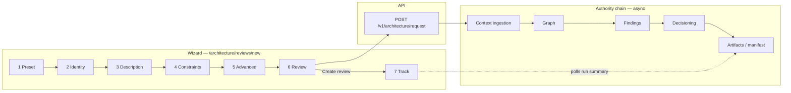

> **Scope:** Single canonical minimum viable first-run path for V1 pilot operators (seven mandatory steps), plus the architect-workspace first-review UI walkthrough (formerly the body of `FIRST_RUN_WALKTHROUGH.md`; that filename remains a path-stable alias), the first-run wizard design notes (formerly the body of `FIRST_RUN_WIZARD.md`; that filename remains a path-stable alias for help-center / UI drawers), the controlled-pilot first-run proof checklist (formerly the body of `CONTROLLED_PILOT_FIRST_RUN_CHECKLIST.md`; that filename remains a path-stable alias), the hosted-pilot strict single-path quickstart (formerly the body of `HOSTED_PILOT_SINGLE_PATH.md`; that filename remains a path-stable alias), and the expert principal-architect 15-minute lane (formerly the body of `FIRST_15_MINUTES_FOR_PRINCIPAL_ARCHITECTS.md`; that filename remains a path-stable alias for **M-44** / **M-180** callers). Audience is customer-facing operator onboarding, not a contributor reference.

> **Reviewed:** 2026-07-31


# Canonical first-run path (V1 pilot)

**Audience:** Buyer operators, design partners, and sales engineers running the first architecture review.

**Last reviewed:** 2026-07-31

**Operational detail:** [`../runbooks/FIRST_PILOT_OPERATOR_PATH.md`](../runbooks/FIRST_PILOT_OPERATOR_PATH.md)  
**First-hour operator contract (four steps):** [`CORE_PILOT.md`](../CORE_PILOT.md) (`FIRST_HOUR_OPERATOR_PATH.md` alias)  
**Architect UI walkthrough (`/architecture/reviews/new`):** [`#first-architecture-review-walkthrough`](#first-architecture-review-walkthrough) (`FIRST_RUN_WALKTHROUGH.md` alias)  
**First-run wizard design (`/architecture/reviews/new`):** [`#first-run-wizard-architect-workspace`](#first-run-wizard-architect-workspace) (`FIRST_RUN_WIZARD.md` alias)  
**Expert principal-architect lane (15 min):** [`#expert-principal-architect-15-minute-lane`](#expert-principal-architect-15-minute-lane) (`FIRST_15_MINUTES_FOR_PRINCIPAL_ARCHITECTS.md` alias)  
**Hosted / strict RC single path:** [`#hosted-pilot-single-path`](#hosted-pilot-single-path) (`HOSTED_PILOT_SINGLE_PATH.md` alias)  
**Integration commitments (V1 vs V1.1):** [`../go-to-market/INTEGRATION_CATALOG.md`](../go-to-market/INTEGRATION_CATALOG.md) § Commitment boundary  
**Contributor/engineer path (not customer):** [`../engineering/FIRST_30_MINUTES.md`](../engineering/FIRST_30_MINUTES.md)

---

## Seven mandatory steps

| Step | Action | Command / surface | Success signal |
| --- | --- | --- | --- |
| **1** | Confirm platform prerequisites | `.\scripts\Test-ArchLucidPrerequisites.ps1 -Profile FirstPilotMinimum` | No **BLOCK** rows |
| **2** | Run first-run preflight | `dotnet run --project ArchLucid.Cli -- --json pilot preflight` | No **BLOCK** rows |
| **3** | Readiness-only proof (no finalized architecture package yet) | `.\scripts\collect-first-pilot-proof.ps1` | `first-pilot-command-center.md` shows phased status |
| **4** | Sign in and start one architecture review | Architect workspace `/architecture/reviews/new` or `POST /v1/architecture/request` | `runId` captured |
| **5** | Finalize the architecture package | `POST /v1/architecture/review/{runId}/finalize` (or UI Finalize) | `goldenManifestId` present |
| **6** | Collect committed-run proof | `.\scripts\collect-first-pilot-proof.ps1 -RunId <runId>` | `first-pilot-evidence/first-value-report.md` attached |
| **7** | Sponsor handoff only when SEND-eligible | `.\scripts\collect-first-pilot-proof.ps1 -RunId <runId> -SponsorHandoff -FailOnHold` | `sponsorPacketDisposition` not **HOLD**; `sendEligible` true |

Stop at step 3 when the environment is not ready. Do not sponsor-send until step 7 passes with **COMPLETE** ROI baseline completeness (see [`QUOTE_TO_PROOF_PACKET.md#roi-baseline-send-policy`](../go-to-market/QUOTE_TO_PROOF_PACKET.md#roi-baseline-send-policy)).

---

## One script entry point

```powershell
.\scripts\Run-CanonicalFirstPilotPath.ps1 -Phase Readiness
.\scripts\Run-CanonicalFirstPilotPath.ps1 -Phase CommittedProof -RunId '<run-guid>'
.\scripts\Run-CanonicalFirstPilotPath.ps1 -Phase SponsorHandoff -RunId '<run-guid>' -FailOnHold
```

---

## First architecture review walkthrough {#first-architecture-review-walkthrough}

Former standalone body: `docs/library/FIRST_RUN_WALKTHROUGH.md` → this section (filename kept as a path-stable alias). Linear **UI** checklist for creating the first architecture review at **`/architecture/reviews/new`** — complements the [seven mandatory steps](#seven-mandatory-steps) (scripted proof path) without screenshots.

**Path-stable alias:** [`FIRST_RUN_WALKTHROUGH.md`](FIRST_RUN_WALKTHROUGH.md).

**Last reviewed:** 2026-07-31

### Objective

Give architects a **linear checklist** for creating the first **architecture review** using **New architecture review** at **`/architecture/reviews/new`** (legacy **`/architecture/reviews/new`** may redirect), without relying on screenshots (which go stale quickly).

### Assumptions

- The UI is available at **`/architecture/reviews/new`** (see [`#first-run-wizard-architect-workspace`](#first-run-wizard-architect-workspace) for design intent).
- Sign-in works for your tenant — see **[Authentication and sign-in](/help/authentication-sign-in)** and **[Pilot guide](/help/pilot-guide)**.

### Constraints

- This walkthrough does not replace **[`LIVE_E2E_HAPPY_PATH.md`](LIVE_E2E_HAPPY_PATH.md)** for HTTP-level scripted parity or **[`onboarding/day-one-developer.md`](../onboarding/day-one-developer.md#following-the-request-past-create-execute--commit--retrieval--ask)** for the request-to-answer narrative spine.
- **Actor-dependent findings:** Uploading IaC alone (Bicep, Terraform, YAML, rendered Kubernetes manifests) materializes topology resources but not **Actor** nodes. Trust-boundary, privileged-access, and external-exposure engines stay silent until you add people and systems in guided intake (**People, systems, and integrations**).

### Steps

1. **Open the workspace** — Sign in with work/school account, email one-time code, or your organization's SSO.
2. **Navigate to New architecture review** — Use **`/architecture/reviews/new`** or the primary nav entry **New architecture review**.
3. **Pick a preset or template** — Choose the closest sample if you are evaluating; customize fields only where you have real system facts.
4. **Complete each wizard step** — Advance only when required fields validate; note inline errors reference a correlation id when the UI surfaces API failures — see **[Troubleshooting](/help/troubleshooting)**.
5. **Submit** — Capture the returned review id from the success path or **Reviews** list.
6. **Execute and finalize** — From **review detail**, drive **Execute**, then **Finalize** when the pipeline reports **Ready to finalize** — see **[Workspace navigation](/help/pilot-guide)**.
7. **Verify the architecture package** — Confirm the sealed review record and artifacts appear; use **Compare**/**Replay** only after you have two finalized packages or an export need — see **[Architecture packages](/help/review-packages)**.
8. **Attach to your workflow (optional)** — After finalize, collect sponsor proof per **[Pilot guide](/help/pilot-guide)** when your team uses GitHub or Azure DevOps handoff.

<details>
<summary>Administrator details — CLI and HTTP</summary>

- Create path may call **`POST /v1/architecture/request`** (API still uses `run` identifiers).
- Proof collectors: **`collect-first-pilot-proof.ps1`** and workflow handoff docs under `docs/runbooks/`.
- Contributor shell patterns: [`operator-shell.md`](operator-shell.md).

</details>

### Related (UI walkthrough)

- **[Your first architecture review](/help/first-architecture-review)** — guided first-session checklist.
- [`#first-run-wizard-architect-workspace`](#first-run-wizard-architect-workspace) — design and UX notes (`FIRST_RUN_WIZARD.md` alias).
- **[Pilot guide](/help/pilot-guide)** — pilot-facing scope and support boundaries.
- **[Workspace navigation](/help/pilot-guide)** — sidebar and first-review path.
- [Seven mandatory steps](#seven-mandatory-steps) — scripted proof / sponsor-handoff path.

---

## First-run wizard (architect workspace) {#first-run-wizard-architect-workspace}

Former standalone body: `docs/library/FIRST_RUN_WIZARD.md` → this section (filename kept as a path-stable alias for help-center / wizard drawer callers). Field map, presets, and Step 7 pipeline badges for **`/architecture/reviews/new`** — complements the [UI walkthrough checklist](#first-architecture-review-walkthrough) and the [seven mandatory steps](#seven-mandatory-steps).

**Path-stable alias:** [`FIRST_RUN_WIZARD.md`](FIRST_RUN_WIZARD.md).

**Audience:** New architects, pilot users, and first-time evaluators using **ArchLucid** through the web shell (`archlucid-ui`).

**Route:** **`/architecture/reviews/new`** (canonical architect path; legacy **`/architecture/reviews/new`** may redirect) — submits **`POST /v1/architecture/request`** with a full **`ArchitectureRequest`**-shaped body (camelCase JSON). The wizard replaces the older minimal “few fields only” flow.

**Architect checklist (no screenshots):** [`#first-architecture-review-walkthrough`](#first-architecture-review-walkthrough) (`FIRST_RUN_WALKTHROUGH.md` alias)

**After first finalize — workflow handoff:** **[V1_WORKFLOW_HANDOFF_GITHUB_AZDO.md](../runbooks/V1_WORKFLOW_HANDOFF_GITHUB_AZDO.md)** (attach proof to GitHub / Azure DevOps without V1.1 connectors).

**Last reviewed:** 2026-07-31

### Implementation status

| Design element | Status |
|----------------|--------|
| Seven-step wizard (`/architecture/reviews/new`) | **Shipped** — preset → identity → description → constraints → advanced → review → track (`WizardStep*` + `NewRunWizardClient`). Quick review default on buyer-polished shell. |
| Starter presets (greenfield / modernize / blank) | **Shipped** — see `WizardStepPreset` and preset merge logic. |
| Live pipeline tracking (step 7) | **Shipped** — `RunProgressTracker` + polling against run detail APIs. |
| Playwright / Vitest coverage | **Partial** — Vitest: `archlucid-ui/src/app/(operator)/architecture/reviews/new/*.test.tsx`; E2E: **`first-run-wizard.spec.ts`**, **`core-pilot-path.spec.ts`** (Core Pilot four-step path). **`/onboarding`** adds **`OnboardingWizardClient`** (auth / connection / storage checklist with localStorage progress). |

### Purpose

The **seven-step guided wizard** walks you from a **starting template** (or scratch defaults) through **identity**, **requirements**, **constraints**, optional **advanced context**, **review**, and **live pipeline tracking**. It exists so you do not have to hand-craft JSON or guess which fields matter for agents and the authority chain.

Use it when you want a **repeatable first review** in a new tenant, workspace, or pilot environment, or when you are **demoing** ArchLucid to stakeholders who should not touch the API directly.

### End-to-end flow (wizard + pipeline)



Deep dives: **[ARCHITECTURE_FLOWS.md](ARCHITECTURE_FLOWS.md)** (run lifecycle narrative), **[CANONICAL_PIPELINE.md](CANONICAL_PIPELINE.md)** (operator pipeline overview).

### Starter presets

| Preset | When to use it |
|--------|----------------|
| **Greenfield web app** | New public-facing web workload on Azure; pre-fills description, constraints, and capabilities typical of HTTPS + data tier + CI/CD. |
| **Modernize legacy system** | Strangler / incremental migration narrative; includes **topology hints**; leave **prior manifest** empty unless you have a baseline version string. |
| **Blank (advanced)** | Minimal defaults only — you fill every meaningful field yourself. Good when you already have a checklist or copy-paste from an RFC. |

**Start from scratch** resets the form to validated defaults (new `requestId`, placeholder description meeting length rules, empty lists, Azure + staging).

### Step-by-step (fields ↔ `ArchitectureRequest`)

Below, names match the **JSON body** sent to `POST /v1/architecture/request` (same surface as `ArchitectureRequest` / `CreateArchitectureRunRequestPayload` in the UI client).

#### Step 1 — Choose a starting point

- **What:** Preset or scratch; no API fields change until you continue — the choice **merges** into the form (`reset` with parsed values).
- **Why:** Jump-start realistic examples or enforce a disciplined blank slate.

#### Step 2 — System identity

| UI control | Request field | Notes |
|------------|---------------|--------|
| System name | `systemName` | Required; used as the **ingestion project identity** (short slug, e.g. `OrderService`). |
| Environment | `environment` | `staging`, `production`, `development`, or `sandbox`. |
| Cloud provider | `cloudProvider` | **Azure** only in this release; other clouds show as disabled “coming soon.” |
| Prior manifest version (optional) | `priorManifestVersion` | Omit or leave blank for greenfield; set a **version string** for incremental / baseline-aware runs. |

#### Step 3 — Description & requirements

| UI control | Request field | Notes |
|------------|---------------|--------|
| Description | `description` | Required; **minimum 10 characters**. Primary signal for agents. |
| Inline requirements (list) | `inlineRequirements` | Optional strings; one row per extra requirement. |

**Tip:** A strong description is **2–4 sentences**: what the system does, who uses it, the **architectural question** you want answered (e.g. “single region vs multi-region,” “PCI scope,” “strangler cutover boundary”). Avoid paste-only buzzwords; agents need intent.

#### Step 4 — Constraints, capabilities & assumptions

| UI area | Request field | Notes |
|---------|---------------|--------|
| Constraints (chips) | `constraints` | Hard limits: budget, regions, compliance, “must not” rules. |
| Required capabilities (chips) | `requiredCapabilities` | What the architecture **must** support (e.g. HTTPS ingress, managed DB). |
| Assumptions (chips) | `assumptions` | What agents may treat as true unless evidence contradicts (team skills, timelines). |

#### Step 5 — Advanced (optional)

Omitted empty sections are not sent (or sent as empty arrays only where required by validation — the client strips noise for the POST body).

| UI area | Request field | Notes |
|---------|---------------|--------|
| Policy references (chips) | `policyReferences` | e.g. `policy-pack:enterprise-default`. |
| Topology hints (chips) | `topologyHints` | Patterns to prefer or avoid. |
| Security baseline hints (chips) | `securityBaselineHints` | Expected controls in plain language. |
| Documents (rows) | `documents[]` | `{ name, contentType, content }` — inlined UTF-8 text for agent context. |
| Infrastructure declarations (rows) | `infrastructureDeclarations[]` | `{ name, format, content }`; `format` is one of `json`, `simple-terraform`, `terraform-show-json`, `bicep`, `arm-json`, `kubernetes-json`, `kubernetes-yaml`. |

#### Step 6 — Review & submit

- **What:** Read-only summary + inline validation messages from the form schema.
- **Why:** Catch mistakes before **`Create review`** calls the API.
- **Also shown:** `requestId` (client-generated idempotency-style key, 32-char hex without dashes).

#### Step 7 — Track pipeline

- **What:** Polls **`GET /v1/authority/architecture/reviews/{runId}/summary`** (via the UI proxy) for up to **~2 minutes**, every **~3 seconds**.
- **Why:** Surfaces **Context → Graph → Findings → Manifest** readiness without leaving the page.
- **Not the full OTel story:** The server’s authority orchestration spans **context → graph → findings → decisioning → artifacts** (see **ARCHITECTURE_FLOWS.md**). The wizard’s fourth milestone is **architecture package available** (`hasGoldenManifest` in the API summary), which is what architects care about for review detail and exports.

### Pipeline status indicators (Step 7)

| Badge | Meaning (run summary flags) | Rough expectation |
|-------|-----------------------------|-------------------|
| **Context — Ready** | `hasContextSnapshot` | Usually among the first to flip; depends on ingestion load and input size. |
| **Graph — Ready** | `hasGraphSnapshot` | Follows context once graph materialization completes. |
| **Findings — Ready** | `hasFindingsSnapshot` | Findings generation tied to graph/context readiness. |
| **Package — Ready** | `hasGoldenManifest` | End state for “can open review detail with architecture package links”; may trail the others by minutes in busy environments. |

The **progress bar** is a simple **count of ready stages / 4**, not a time estimate. If nothing moves before the UI stops polling, treat it as **still running server-side** or **stuck** — see [Troubleshooting](#first-run-wizard-troubleshooting).

### After the wizard

1. **Open review detail** — `/architecture/reviews/{runId}`: architecture package summary, artifacts, authority context (when finalized and indexed per environment).
2. **Finalize if required** — Until finalize (`commit` in API/CLI), some views stay empty; follow **[OPERATOR_QUICKSTART.md](customer-facing/OPERATOR_QUICKSTART.md)** for API/CLI finalize expectations and `409` handling.
3. **Export** — From review detail (with package): bundle / export ZIP links when your deployment exposes them.
4. **Compare** — `/compare?leftRunId={runId}` (wizard success panel links this for you).
5. **Provenance** — `/architecture/reviews/{runId}/provenance` for graph/trace orientation.

Primary architect reference: **[OPERATOR_QUICKSTART.md](customer-facing/OPERATOR_QUICKSTART.md)**.

### Troubleshooting {#first-run-wizard-troubleshooting}

| Symptom | What to check |
|---------|----------------|
| **Cannot create run / network error** | UI uses **`/api/proxy`** to reach the API. Verify API base URL, API key (server env), and JWT if enabled — see `archlucid-ui` docs and **`docs/runbooks/TROUBLESHOOTING.md`**. |
| **Run id returned but Step 7 stays all Pending** | API may be down for authority workers, or scope headers point at the wrong project. Confirm **`GET .../architecture/reviews/{id}/summary`** outside the UI. |
| **Stuck in “Created” / no snapshots** | Run lifecycle nuances: **CANONICAL_PIPELINE.md**. Check host logs for `AuthorityPipelineStagesExecutor` / stage failures. |
| **Timeout (~2 min) with no architecture package** | Pipeline may still be running; open **review detail** and refresh later. If permanently stuck, inspect SQL run row, worker health, and **OPERATIONS** runbooks. |
| **Empty package after “ready”** | “Ready” in the wizard means **summary flags**; **finalize** (`commit`) and **artifact** availability are separate steps — **OPERATOR_QUICKSTART.md**. |

### Related documentation (wizard)

| Doc | Use it for |
|-----|------------|
| [LIVE_E2E_HAPPY_PATH.md](LIVE_E2E_HAPPY_PATH.md) | Scripted HTTP spine (auth → request → authority → commit). Narrative: **[`onboarding/day-one-developer.md`](../onboarding/day-one-developer.md#following-the-request-past-create-execute--commit--retrieval--ask)** |
| [OPERATOR_QUICKSTART.md](customer-facing/OPERATOR_QUICKSTART.md) | Day-1 commands, commit, manifests, exports. |
| [ARCHITECTURE_FLOWS.md](ARCHITECTURE_FLOWS.md) | Flow A run lifecycle + authority span names. |
| [CANONICAL_PIPELINE.md](CANONICAL_PIPELINE.md) | Request → stages → commit → artifacts (operator map). |
| [API_CONTRACTS.md](API_CONTRACTS.md) | `ArchitectureRequest`, idempotency, error shapes. |
| [UI walkthrough checklist](#first-architecture-review-walkthrough) | Linear no-screenshot first-review steps. |

---

## Secondary (not first-run)

Operate compare/replay/graph lanes, V1.1 connectors, MCP, marketplace checkout, and broad integration catalog reading are **out of scope** for the default first run. See [`FIRST_PILOT_OPERATOR_PATH.md`](../runbooks/FIRST_PILOT_OPERATOR_PATH.md) § Ignore for first pilot.

---

## Expert principal-architect 15-minute lane {#expert-principal-architect-15-minute-lane}

Former standalone body: `docs/library/FIRST_15_MINUTES_FOR_PRINCIPAL_ARCHITECTS.md` → this section (filename kept as a path-stable alias for **M-44** / **M-180** / **M-181** callers). One-page expert lane for principal architects under time pressure — compresses ceremony without replacing the [seven mandatory steps](#seven-mandatory-steps).

**Path-stable alias:** [`FIRST_15_MINUTES_FOR_PRINCIPAL_ARCHITECTS.md`](FIRST_15_MINUTES_FOR_PRINCIPAL_ARCHITECTS.md).

**Last reviewed:** 2026-07-31

**Audience:** Principal / staff architects evaluating ArchLucid — daily frontier-AI users with low patience for process overhead.  
**Not for:** naive operators (use [`CORE_PILOT.md`](../CORE_PILOT.md)), contributors (use [`../engineering/FIRST_30_MINUTES.md`](../engineering/FIRST_30_MINUTES.md)), or sponsor-led procurement walks.

**Canonical depth stays elsewhere** — this section is a **focused expert lane** only. Do not remove or replace this document’s [seven mandatory steps](#seven-mandatory-steps), [`CORE_PILOT.md`](../CORE_PILOT.md), or [`../runbooks/FIRST_PILOT_OPERATOR_PATH.md`](../runbooks/FIRST_PILOT_OPERATOR_PATH.md).

**Timing validation:** GTM backlog **M-44 (V1.1)** — observed first-session cohort measures whether experts hit the step-4 checkpoint within 15 minutes without facilitator narration. Until that cohort completes, do **not** claim product-led “15 minutes without founder narration” as proven (see claim boundary / **M-180**).

**Engineering SoT (must-complete + IA unlock + residuals):** [`PA_FIRST_15_PACKAGE_SPINE_IA_CONTRACT.md`](PA_FIRST_15_PACKAGE_SPINE_IA_CONTRACT.md) (**TB-1030** Done). Follow-on honesty CI: **TB-1031**.

### Objective (one)

**Produce one committed finding you would raise in a real architecture review — or stop at minute 12 and record why ArchLucid did not beat your frontier-AI workflow.**

Success is **decision signal**, not completing every UI surface.

### Seven steps (15-minute box)

| # | Action | Time box | Success signal |
| --- | --- | --- | --- |
| **1** | Open **`/architecture/reviews/new`** with your architecture brief ready (paste text or upload evidence). Decline feature tours. | 0–2 min | Review request admitted |
| **2** | Submit **minimal intake** — answer MUST questions only; skip optional governance and policy-pack fields. | 2–5 min | `runId` captured |
| **3** | **Execute** the review. Stay on the run detail page — do not open Operate, Graph, Compare, or Governance routes. | 5–12 min | Findings list visible |
| **4** | **STOP-IF-VALUE-NOT-SEEN checkpoint** — see below. | 12–13 min | Pass → step 5; Fail → stop |
| **5** | **Commit** the manifest — only if step 4 passed. | 13–14 min | `goldenManifestId` present |
| **6** | Locate the **sponsor export** or architecture package — unaided. | 14–15 min | Sendable artifact path found |
| **7** | *(Optional)* Walk **one** finding's evidence trail — only when step 4 was marginal. | ≤15 min total | Evidence chain stronger than raw AI output |

### Step 4 — STOP-IF-VALUE-NOT-SEEN (mandatory)

At **minute 12**, scan the top three findings and answer **both**:

1. Is at least **one** finding **non-obvious** — something you had not already concluded from the brief alone?
2. Does that finding link to an **evidence trail** you could defend to a sponsor?

| Result | Action |
| --- | --- |
| **YES to both** | Continue to commit (steps 5–6). |
| **NO to either** | **Stop.** Do not commit. Record primary dismissal code **D1** (equivalent to frontier AI) or **D7** (finding quality doubt) per [`FIRST_SESSION_COGNITIVE_LOAD_OBSERVATION.md`](../go-to-market/FIRST_SESSION_COGNITIVE_LOAD_OBSERVATION.md). File the [principal architect dismissal log](../go-to-market/FIRST_SESSION_COGNITIVE_LOAD_OBSERVATION.md#principal-architect-dismissal-log) (alias: [`validation/PRINCIPAL_ARCHITECT_DISMISSAL_LOG.md`](../go-to-market/validation/PRINCIPAL_ARCHITECT_DISMISSAL_LOG.md)). |

This checkpoint prevents ceremony completion without value signal — the most common expert dismissal pattern.

### Explicitly skip (first 15 minutes)

| Skip | Why |
| --- | --- |
| Operate: Graph, Compare, Replay | Not required for first value signal |
| Governance dashboards and policy-pack configuration | Deep links below — use after commit |
| ROI baseline scorecard and procurement pack | Post-handoff only |
| Azure extractor setup when brief + uploads suffice | Evidence-only path: [`CORE_PILOT.md`](../CORE_PILOT.md) § Evidence-only |
| Reading full V1 scope or integration catalog | Expert lane assumes platform is already provisioned |

### Optional deep links (after step 4 passes or after commit)

| Topic | Doc |
| --- | --- |
| Evidence trail / audit rows for one finding | [`../go-to-market/FIRST_SESSION_COGNITIVE_LOAD_OBSERVATION.md#principal-architect-insight-validation`](../go-to-market/FIRST_SESSION_COGNITIVE_LOAD_OBSERVATION.md#principal-architect-insight-validation) (alias: [`PRINCIPAL_ARCHITECT_INSIGHT_VALIDATION_PROTOCOL.md`](../go-to-market/Architect_Evaluation/PRINCIPAL_ARCHITECT_INSIGHT_VALIDATION_PROTOCOL.md)) |
| Governance gates and policy packs | [`PRODUCT_PACKAGING.md`](PRODUCT_PACKAGING.md) · [`../go-to-market/EXECUTIVE_SPONSOR_BRIEF.md`](../go-to-market/EXECUTIVE_SPONSOR_BRIEF.md) |
| Sponsor packet and export labels | [`../runbooks/FIRST_PILOT_EVIDENCE_BUNDLE.md`](../runbooks/FIRST_PILOT_EVIDENCE_BUNDLE.md) |
| Full seven-step canonical pilot | [Seven mandatory steps](#seven-mandatory-steps) |
| One-sitting timing narrative (operators) | [`../runbooks/FIRST_CREDIBLE_REVIEW_ONE_SITTING.md`](../runbooks/FIRST_CREDIBLE_REVIEW_ONE_SITTING.md) |
| First-session observation protocol | [`../go-to-market/FIRST_SESSION_COGNITIVE_LOAD_OBSERVATION.md`](../go-to-market/FIRST_SESSION_COGNITIVE_LOAD_OBSERVATION.md) |

### Related paths (do not duplicate)

| Path | When to use instead |
| --- | --- |
| [`CORE_PILOT.md`](../CORE_PILOT.md) | New tenant operator — four-step first review (`FIRST_HOUR_OPERATOR_PATH.md` alias) |
| [`PILOT_SUCCESS_SCORECARD.md#minimum-viable-pilot-success-lane`](../go-to-market/PILOT_SUCCESS_SCORECARD.md#minimum-viable-pilot-success-lane) | Naive operator — five-step guided intake |
| [`#hosted-pilot-single-path`](#hosted-pilot-single-path) | Platform engineer — strict RC script path |
| [Seven mandatory steps](#seven-mandatory-steps) + [controlled-pilot checklist](#controlled-pilot-first-run-proof-checklist) | Full pilot with proof scripts and sponsor-send gates |

---

## Controlled-pilot first-run proof checklist {#controlled-pilot-first-run-proof-checklist}

Former standalone body: `docs/library/CONTROLLED_PILOT_FIRST_RUN_CHECKLIST.md` → this section (filename kept as a path-stable alias). Complements the [seven mandatory steps](#seven-mandatory-steps) with a sales-led 60–90 minute proof walkthrough and claim-posture picker. Does **not** replace KEEP [`../go-to-market/PILOT_ACCEPTANCE_THRESHOLDS.md`](../go-to-market/PILOT_ACCEPTANCE_THRESHOLDS.md).

**Path-stable alias:** [`CONTROLLED_PILOT_FIRST_RUN_CHECKLIST.md`](CONTROLLED_PILOT_FIRST_RUN_CHECKLIST.md).

**Last reviewed:** 2026-07-31

**Audience:** Operators and evaluators running a sales-led controlled pilot.

### Paths (pick one)

| Path | When to use | Claim posture |
| --- | --- | --- |
| **Simulator-only** | CI parity, dry demos, no AOAI credentials | Simulator labels on all sponsor exports |
| **Partial-real** | Some agents on live model with caveats | Partial-real wording + evidence-basis labels |
| **Full-real** | Staging with current real-mode gate PASS | Full-real only when `real-mode-claim-gate.json` is PASS |

### Checklist (60–90 minutes)

| Step | Action | Success signal | Doc |
| --- | --- | --- | --- |
| 1 | Configure tenant auth and SQL (or use hosted staging). | `GET /health/ready` healthy. | [First architecture review walkthrough](#first-architecture-review-walkthrough) |
| 2 | Sign in; open **New review** (`/architecture/reviews/new`). | Wizard loads without auth errors. | [DEMO_QUICKSTART.md](../go-to-market/DEMO_QUICKSTART.md) |
| 3 | Create request; note **run id**. | Run appears in Reviews. | [operator-shell.md](operator-shell.md) |
| 4 | Upload Azure extractor ZIP (Tier 1) or attach evidence. | Upload 200; evidence on run. | [AZURE_EXTRACTOR.md](AZURE_EXTRACTOR.md) |
| 5 | **Execute** agents. | **Ready for commit** or actionable failure + correlation id. | [TROUBLESHOOTING.md](../runbooks/TROUBLESHOOTING.md) |
| 6 | Resolve governance warnings; **Commit** manifest. | Manifest id visible; execution mode persisted. | [V1_SCOPE.md](V1_SCOPE.md) |
| 7 | Verify run detail shows **execution mode** and **evidence basis**. | Real/Simulator/Fallback/Mixed + basis labels. | [CLAIM_READINESS_STATUS.md](../go-to-market/CLAIM_READINESS_STATUS.md) |
| 8 | Collect proof packet. | `collect-first-pilot-proof.ps1` PASS/WARN with limitations.md. | [FIRST_PILOT_OPERATOR_PATH.md#printable-first-run-evidence-checklist](../runbooks/FIRST_PILOT_OPERATOR_PATH.md#printable-first-run-evidence-checklist) |
| 9 | Export sponsor packet / sponsor review. | Labels present; no overclaim language. | [PILOT_GUIDE.md](customer-facing/PILOT_GUIDE.md) |

### Expected artifacts

- Committed run with manifest id
- Proof folder: `run-evidence.json`, `limitations.md`, `environment.json`, `governance-outcome-summary.json`
- Sponsor export with execution mode + evidence basis sections

### Failure interpretation

- **Governance block on commit:** read API problem detail for blocking rule and minimum unblock action.
- **Real-mode HOLD:** do not use full-real sponsor wording; use simulator-only or partial-real per claim gate.
- **Proof-packet WARN:** missing ROI baseline or demo tenant — hold external send until resolved.

### Related (controlled-pilot checklist)

- [LIVE_E2E_HAPPY_PATH.md](LIVE_E2E_HAPPY_PATH.md)
- [V1_RELEASE_CHECKLIST.md](V1_RELEASE_CHECKLIST.md) (strict RC via `ARCHLUCID_STRICT_RC=1`)
- [Minimum viable pilot success lane](../go-to-market/PILOT_SUCCESS_SCORECARD.md#minimum-viable-pilot-success-lane)
- [Hosted pilot — single path](#hosted-pilot-single-path)

---

## Hosted pilot — single path quickstart {#hosted-pilot-single-path}

Former standalone body: `docs/library/HOSTED_PILOT_SINGLE_PATH.md` → this section (filename kept as a path-stable alias). Operator cookbook for the first **hosted** pilot on ArchLucid-managed Azure — one authoritative strict-RC flow; advanced paths are troubleshooting only. Complements the [seven mandatory steps](#seven-mandatory-steps) and [controlled-pilot checklist](#controlled-pilot-first-run-proof-checklist).

**Path-stable alias:** [`HOSTED_PILOT_SINGLE_PATH.md`](HOSTED_PILOT_SINGLE_PATH.md).

**Last reviewed:** 2026-07-31

**Audience:** Operator or platform engineer cutting the first hosted pilot on ArchLucid-managed Azure.

**Canonical script:** `.\scripts\Invoke-FirstPilotStrictPath.ps1` (strict RC gates + consolidated evidence index).

**Do not branch** until this path completes or emits an explicit **HOLD** with remediation.

**Naive architect workspace path (before strict script):** use `/architecture/reviews/new` → **Guided intake (recommended)** → admit draft → answer/skip MUST questions → submit → execute → finalize (API `commit`). Live E2E coverage: `archlucid-ui/e2e/live-api-socratic-intake.spec.ts`.

### Prerequisites (one checklist)

1. Azure Staging (or agreed RC) API base URL and Bearer JWT for live probes — see [`RC_TARGET_ENVIRONMENT_MATRIX.md`](RC_TARGET_ENVIRONMENT_MATRIX.md).
2. Repository clone at the release candidate commit.
3. Python 3.11+ and PowerShell 7 on the operator workstation.

### Single command path

From the repository root:

```powershell
$env:ARCHLUCID_API_BASE_URL = "https://your-staging-api.example"
$env:ARCHLUCID_BEARER_TOKEN = "<staging-jwt>"
.\scripts\Invoke-FirstPilotStrictPath.ps1 -OutDir artifacts/first-pilot-strict
```

#### Expected outputs (stop/fail checkpoints)

| Step | Artifact | PASS signal |
| --- | --- | --- |
| 1 | `artifacts/first-pilot-strict/release-readiness/rc-go-no-go-verdict.json` | `"verdict": "PASS"` or documented `"WARN"` with sponsor caveats |
| 2 | `artifacts/first-pilot-strict/release-readiness/rc-decision-narrative.md` | Decision line matches verdict |
| 3 | `artifacts/first-pilot-strict/release-readiness/first-pilot-timing-budget.json` | `firstValueCommitBudget.disposition` is **PASS** or **WARN** (not silent omission) |
| 4 | `artifacts/first-pilot-strict/first-pilot-strict-summary.json` | `evidenceScope` = `local-plus-staging-live` when API URL supplied |

**HOLD:** Do not send sponsor materials until blockers in `rc-go-no-go-verdict.json` → `blockers` are cleared or explicitly waived per [`RC_RELEASE_GATE.md`](../runbooks/RC_RELEASE_GATE.md).

### After strict path (optional proof rollup)

When attaching sponsor packet evidence for a named environment run:

```powershell
.\scripts\collect-first-pilot-proof.ps1 -ProofDirectory artifacts/first-pilot-proof -RunId "<run-id>"
```

### Advanced / troubleshooting (not the first path)

| Topic | Doc |
| --- | --- |
| Full release checklist | [`V1_RELEASE_CHECKLIST.md`](V1_RELEASE_CHECKLIST.md) |
| Release smoke only | [`RELEASE_SMOKE.md`](RELEASE_SMOKE.md) |
| Live E2E parity matrix | [`LIVE_E2E_AUTH_PARITY.md`](LIVE_E2E_AUTH_PARITY.md) |
| First pilot evidence bundle | [`FIRST_PILOT_EVIDENCE_BUNDLE.md`](../runbooks/FIRST_PILOT_EVIDENCE_BUNDLE.md) |
| Build / local stack | [`docs/engineering/BUILD.md`](../engineering/BUILD.md) |

### Related (hosted single path)

- [`customer-facing/PILOT_GUIDE.md`](customer-facing/PILOT_GUIDE.md) — redirect spine
- [`PILOT_SUCCESS_SCORECARD.md#minimum-viable-pilot-success-lane`](../go-to-market/PILOT_SUCCESS_SCORECARD.md#minimum-viable-pilot-success-lane) — five-step buyer success lane
- [`EXECUTIVE_SPONSOR_BRIEF.md`](../go-to-market/EXECUTIVE_SPONSOR_BRIEF.md) — sponsor narrative of record
