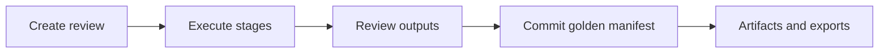

> **Scope:** Customer-facing — Canonical operator pipeline — request through commit; links to deeper architecture docs below.

# Canonical review pipeline (operator view)

**Objective:** Give operators and sponsors a single mental model for how **a review** flows from request to committed manifest and artifacts, without implementation seam vocabulary.

This document is the **review job only**. Creating an architecture is a peer job (ADR 0067), not “step 0” of this pipeline. Kernel specification: [`../architecture/architecture_handbook/75-architecture-and-review-engines.md`](../architecture/architecture_handbook/75-architecture-and-review-engines.md).

**Assumptions:** You use the architect workspace or public APIs with a normal tenant scope. Authoritative storage is SQL Server with **database-per-tenant catalogs** (ADR 0037); workspace/project are organizational coordinates inside a catalog, not paying-client RLS.

**Constraints:** Detailed contributor maps and ADR receipts live under `docs/architecture/adrs/` and `docs/archive/dual-pipeline-navigator-superseded.md` for engineering-only deep dives.

---

## Architecture overview

1. **Create review** — Guided wizard or API creates a scoped **review** session (`runId` in APIs/storage) with evidence and tasks.
2. **Execute stages** — The host runs ingestion, graph, findings, decisioning, and artifact synthesis where applicable; OpenTelemetry spans carry `archlucid.stage.name` for support correlation (see [`BACKGROUND_JOB_CORRELATION.md`](BACKGROUND_JOB_CORRELATION.md)).
3. **Review** — Inspect tasks, findings, and previews before commit.
4. **Commit** — Produce the golden manifest and durable traces for your scope.
5. **Artifacts** — Download bundles, exports, and sponsor-facing summaries from the **review detail** surface (legacy UI routes may still use **run detail**).

---

## Where to read next

- [`ARCHITECTURE_FLOWS.md`](ARCHITECTURE_FLOWS.md) — narrative lifecycle and API touchpoints.
- [`CANONICAL_FIRST_RUN_PATH.md#first-architecture-review-walkthrough`](CANONICAL_FIRST_RUN_PATH.md#first-architecture-review-walkthrough) — architect workspace checklist for first successful review; HTTP-level parity in [`LIVE_E2E_HAPPY_PATH.md`](LIVE_E2E_HAPPY_PATH.md).
- [`OPERATOR_ATLAS.md`](OPERATOR_ATLAS.md) — task → UI map.
- [`API_CONTRACTS.md`](API_CONTRACTS.md) — stable HTTP contracts.

---

## Security model

All steps honor tenant, workspace, and project scope. Anonymous marketing surfaces (`/v1/demo/preview`, `/v1/public/demo/sample-run`) use read-only demo bundles only; they never bypass RLS for tenant data.

---

## Operational considerations

- **Stuck runs** — Check host logs for stage failures; confirm scope headers or JWT claims match the run’s tenant.
- **Support** — Capture correlation IDs from API responses and trace spans when opening incidents.
