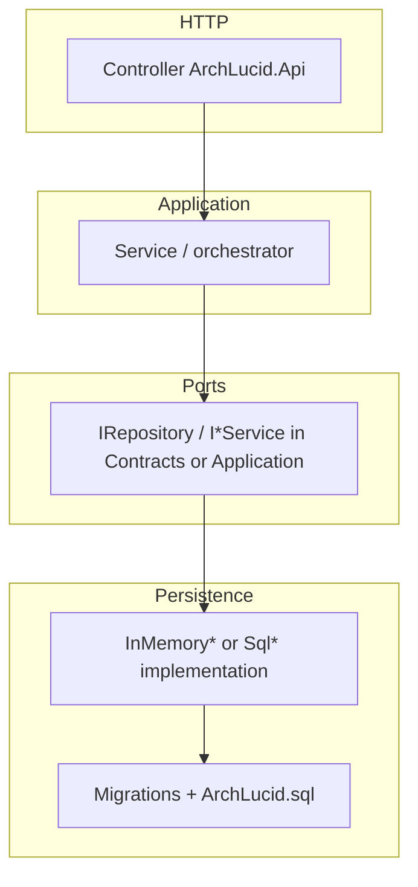

> **Scope:** Contributor-reference — 1-page decision tree for new contributors, plus a high-signal path table (formerly `CODE_MAP.md`), the PR follow-through checklist by change type (formerly the body of `CHANGE_IMPACT_CHECKLIST.md`; that filename remains a path-stable alias), and the golden change-path minimum-touch checklists (formerly the body of `GOLDEN_CHANGE_PATH.md`; that filename remains a path-stable alias for templates / onboarding).
> **Reviewed:** 2026-08-03

# Contributor Code Map

**Last reviewed:** 2026-08-03

Use this quick-reference to find where to make changes in the ArchLucid codebase based on your goal.

## 1. Modifying the API or Endpoints
**"I need to add or change an HTTP route."**
- **Location:** `ArchLucid.Api/Controllers/`
- **What to know:** Endpoints are organized by domain (e.g., `Authority`, `Governance`, `Tenancy`). You must apply the correct authorization policy (e.g., `[Authorize(Policy = ArchLucidPolicies.ReadAuthority)]`).

## 2. Changing Persistence or Database Logic
**"I need to modify how data is saved or retrieved."**
- **Location:** `ArchLucid.Persistence/`
- **What to know:** 
  - Sub-assemblies (e.g., Alerts, Advisory, Integration) have been consolidated into this single project to reduce cognitive load. 
  - Look in `Repositories/` for data access.
  - SQL Migrations live in `ArchLucid.Persistence/Migrations/`. Remember to add your `.sql` file as an Embedded Resource.

## 3. Editing the architect workspace
**"I need to change a React component or screen."**
- **Location:** `archlucid-ui/src/`
- **What to know:**
  - Pages and routing: `app/(operator)/`
  - Reusable components: `components/`
  - Sidebar navigation and progressive disclosure configuration: `lib/nav-config.ts` and `components/SidebarNav.tsx`

## 4. Modifying Architecture Agents or Pipelines
**"I need to adjust how the AI analyzes an architecture."**
- **Location:** `ArchLucid.Application/Runs/Orchestration/` and `ArchLucid.Decisioning/`
- **What to know:** 
  - The pipeline orchestrates the sequence of agent execution.
  - Golden Manifests have been renamed in the UI to "Committed Architecture Manifest", but internal types remain `GoldenManifest`.
  - **Custom in-repo handlers:** register `IAgentHandler` in `ArchLucid.Host.Composition` — see [`CUSTOM_AGENT_HANDLER_GUIDE.md`](CUSTOM_AGENT_HANDLER_GUIDE.md). **Out-of-process:** [`CUSTOM_AGENT_HANDLERS.md`](CUSTOM_AGENT_HANDLERS.md). V1 contract: [`V1_SCOPE.md`](V1_SCOPE.md) §2.18.

## 5. Adding a New Integration or Connector
**"I need to add a new ITSM sink (like Jira) or Slack webhook."**
- **Location:** `ArchLucid.Application/Integrations/`
- **What to know:** 
  - Webhooks use a unified Architecture Run payload. Do not invent a parallel schema. 
  - For UI setup, edit `archlucid-ui/src/app/(operator)/integrations/`.

## 6. Modifying Configuration or Startup
**"I need to add a new appsettings value."**
- **Location:** `ArchLucid.Host.Core/Configuration/` and `ArchLucid.Api/appsettings.json`
- **What to know:** 
  - Add your strongly-typed configuration class.
  - Do not add boilerplate defaults to `appsettings.json`—rely on the C# class defaults to keep the pilot startup clean.

## 7. Before Opening a PR
**"What else must I update for this change type?"**
- **PR follow-through:** [#change-impact-checklist](#change-impact-checklist) (`CHANGE_IMPACT_CHECKLIST.md` alias).
- **Generated map:** [`MAINTAINABILITY_BOUNDARY_MAP.generated.md`](MAINTAINABILITY_BOUNDARY_MAP.generated.md) (regenerate with `python scripts/ci/generate_maintainability_boundary_map.py`).
- **Code touch order (controller → app → SQL → audit):** [`#golden-change-path`](#golden-change-path) (`GOLDEN_CHANGE_PATH.md` alias).

## Change impact checklist — PR follow-through {#change-impact-checklist}

Former standalone body: `docs/library/CHANGE_IMPACT_CHECKLIST.md` → this section (filename kept as a path-stable alias). Use before opening a PR; detailed rules remain in the linked canonical docs. Pair with [#golden-change-path](#golden-change-path) for where to edit code.

**Path-stable alias:** [`CHANGE_IMPACT_CHECKLIST.md`](CHANGE_IMPACT_CHECKLIST.md).

Start with the row that matches your change. Check the follow-through items that apply; do not duplicate canonical source-of-truth rules here.

| Change type | Required follow-through |
| --- | --- |
| API route or DTO | Update controller/action tests, OpenAPI snapshot, generated clients when needed, [`API_CONTRACTS.md`](API_CONTRACTS.md), and [`BREAKING_CHANGES.md`](../../BREAKING_CHANGES.md) if behavior changes. |
| SQL schema or persistence | Add a DbUp migration under `ArchLucid.Persistence/Migrations/`; keep DDL consolidated through [`SQL_SCRIPTS.md`](SQL_SCRIPTS.md); update repository tests and [`CI_MIGRATION_CHECKLIST.md`](CI_MIGRATION_CHECKLIST.md) assumptions. |
| Config key | Add the key to the typed options / startup validation path, [`CONFIGURATION_REFERENCE.md`](CONFIGURATION_REFERENCE.md), config lint/admin diagnostics where applicable, and redaction-safe support bundle summaries. |
| Architect workspace route | Update route/page tests, nav config, progressive disclosure rules, accessibility coverage, and [`ROUTE_TIER_POLICY_NAV_MATRIX.md`](ROUTE_TIER_POLICY_NAV_MATRIX.md) if there is an API/nav boundary. |
| Commercial tier | Update `[RequiresCommercialTenantTier]` usage, route-tier-policy-nav registry, [`PRODUCT_PACKAGING.md`](PRODUCT_PACKAGING.md), and [`COMMERCIAL_TIER_CODE_ALIGNMENT.md`](COMMERCIAL_TIER_CODE_ALIGNMENT.md). |
| Audit event | Update event constants, emitters, tests, [`AUDIT_EVENT_MODEL.md`](AUDIT_EVENT_MODEL.md), and [`AUDIT_COVERAGE_MATRIX.md`](AUDIT_COVERAGE_MATRIX.md). |
| Retrieval or agent behavior | Update agent/runtime tests, quality gates, forensic UI/docs, [`AGENT_OUTPUT_EVALUATION.md`](AGENT_OUTPUT_EVALUATION.md), [LLM_EXECUTION_VS_QUALITY_OUTCOME.md](LLM_EXECUTION_VS_QUALITY_OUTCOME.md), and [`AGENT_TRACE_FORENSICS.md`](AGENT_TRACE_FORENSICS.md). |
| Pricing, trust, or procurement copy | Update the canonical source first, then dependent summaries. Use [`trust-center.md`](../go-to-market/trust-center.md), [`PRICING_PHILOSOPHY.md`](../go-to-market/PRICING_PHILOSOPHY.md), and procurement pack guards. |
| V1 scope boundary | Update [`V1_SCOPE.md`](V1_SCOPE.md) first. If the work is deferred, update [`V1_DEFERRED.md`](V1_DEFERRED.md); if it changes buyer integration commitments, update [`INTEGRATION_CATALOG.md`](../go-to-market/INTEGRATION_CATALOG.md). |

Always consider whether the change also needs tests, docs, runbook updates, observability, security review, accessibility evidence, generated artifacts, and changelog notes. Keep REST route names, DTO names, and database entity names stable unless the breaking-change path is explicit.

## Golden change path — extend ArchLucid safely {#golden-change-path}

Former standalone body: `docs/library/GOLDEN_CHANGE_PATH.md` → this section (filename kept as a path-stable alias for `templates/archlucid-api-endpoint` and onboarding callers). Minimum file touch list per change type so work stays inside the right **interfaces → services → data models → orchestration** boundaries (see [ARCHITECTURE_ON_ONE_PAGE.md](../ARCHITECTURE_ON_ONE_PAGE.md)).

**Path-stable alias:** [`GOLDEN_CHANGE_PATH.md`](GOLDEN_CHANGE_PATH.md).

**Last reviewed:** 2026-07-31

**Audience:** Engineers adding HTTP features, persistence, or audit signals without re-reading the entire repo.

**First run / week one:** If you haven't shipped a change here yet, do [onboarding/day-one-developer.md](../onboarding/day-one-developer.md) first — it covers clone → build → test → your first small PR. Come back to **this section** once you're ready to add a real feature and want the minimum file touch list per change type.

### Assumptions

- You are on **`main`** with a green **fast core** (`Suite=Core&Category!=Slow&Category!=Integration`) before pushing.
- **Storage** is either `Sql` (production-like) or `InMemory` (local/tests); parity matters for both when the feature touches workflow data ([ADR 0011](../architecture/adrs/0011-inmemory-vs-sql-storage-provider.md)).
- **OpenAPI** drift fails CI until the snapshot is regenerated ([OPENAPI_CONTRACT_DRIFT.md](OPENAPI_CONTRACT_DRIFT.md)).

### Constraints

- Prefer **one class per file**; match existing controller and repository patterns.
- **Do not edit historical migrations** (001–028); add new migrations and update **`ArchLucid.Persistence/Scripts/ArchLucid.sql`** for the consolidated DDL story ([SQL_SCRIPTS.md](SQL_SCRIPTS.md)).
- **Durable audit:** use `IAuditService` + `AuditEventTypes.*`; update [AUDIT_COVERAGE_MATRIX.md](AUDIT_COVERAGE_MATRIX.md) and the **`audit-core-const-count`** HTML comment when adding Core constants.

### Architecture overview (change routing)

### Minimum touches by change type

#### A. New versioned HTTP endpoint (read or write)

| Step | Location | Notes |
|------|----------|--------|
| 1 | `ArchLucid.Api/Controllers/{Area}/*Controller.cs` | Use `v{version:apiVersion}`, `[ApiVersion("1.0")]`, policies from `ArchLucidPolicies`, rate limiting per area ([CONTROLLER_AREA_MAP.md](CONTROLLER_AREA_MAP.md)). |
| 2 | `ArchLucid.Application/` | Application service if logic is non-trivial; keep controllers thin. |
| 3 | `ArchLucid.Contracts/` | DTOs / request-response types shared with clients. |
| 4 | `ArchLucid.Host.Composition/` | DI registration only if new interfaces or decorators ([DI_REGISTRATION_MAP.md](DI_REGISTRATION_MAP.md)). |
| 5 | `ArchLucid.Api.Tests/` | Integration or unit tests; `[Trait("Suite","Core")]` when appropriate. |
| 6 | Regenerate OpenAPI snapshot | `ARCHLUCID_UPDATE_OPENAPI_SNAPSHOT=1` per [TEST_EXECUTION_MODEL.md](TEST_EXECUTION_MODEL.md). |

**Scaffold:** `dotnet new archlucid-api-endpoint -n YourFeature` then copy the generated controller into the correct `Controllers/{Area}/` folder and adjust namespace, route, and policies ([templates/archlucid-api-endpoint/README.md](../../templates/archlucid-api-endpoint/README.md)).

#### B. New SQL-backed repository or column

| Step | Location | Notes |
|------|----------|--------|
| 1 | `ArchLucid.Persistence/` or `ArchLucid.Persistence.Data/` | Interface if cross-cutting; Dapper repository implementation. |
| 2 | New migration `ArchLucid.Persistence/Migrations/NNN_*.sql` + rollback | Forward-only numbering. |
| 3 | `ArchLucid.Persistence/Scripts/ArchLucid.sql` | Master DDL alignment. |
| 4 | `ArchLucid.Persistence/**/InMemory*.cs` | When `StorageProvider=InMemory` must behave for dev/tests. |
| 5 | `ArchLucid.Persistence.Tests` or `ArchLucid.Api.Tests` | SQL integration or repository tests. |
| 6 | `docs/TENANT_SCOPED_TABLES_INVENTORY.md` | If table carries tenant scope — document triple vs run-only FK ([MULTI_TENANT_RLS.md](../security/MULTI_TENANT_RLS.md)). |

#### C. New durable audit event

| Step | Location | Notes |
|------|----------|--------|
| 1 | `ArchLucid.Core/Audit/AuditEventTypes.<Family>.cs` | New `public const string` in the matching family partial (root `AuditEventTypes.cs` covers run/manifest lifecycle). |
| 2 | Call site | `IAuditService.LogAsync` (fire-and-forget acceptable only where already documented). |
| 3 | `docs/AUDIT_COVERAGE_MATRIX.md` | New row + bump **`<!-- audit-core-const-count:N -->`**. |

#### D. Agent / LLM path change

| Step | Location | Notes |
|------|----------|--------|
| 1 | `ArchLucid.AgentRuntime/` | Handlers, completion client usage. |
| 2 | `ArchLucid.Core/Diagnostics/ArchLucidInstrumentation.cs` | New metrics / activity sources if needed ([OBSERVABILITY.md](OBSERVABILITY.md)). |
| 3 | `docs/AGENT_TRACE_FORENSICS.md` / eval baselines | When prompts or trace shape change. |

### Data flow (happy path)

1. **Request** hits controller → authZ policy → application service.
2. **Service** uses repository port; SQL path sets **RLS session context** when enabled.
3. **Response** maps to contract DTO; errors use [API_ERROR_CONTRACT.md](API_ERROR_CONTRACT.md) (`ProblemDetails`).

For a fully worked example of this happy path — from HTTP through the coordinator, authority orchestrator, and persistence — see the **`POST /v1/architecture/request`** mental-model walkthrough (with sequence diagram) in [onboarding/day-one-developer.md](../onboarding/day-one-developer.md#mental-model-post-v1architecturerequest).

### Security model

- **Default deny** on controllers; `AllowAnonymous` only for health/version/OpenAPI where already established.
- **Production:** CORS must not be `*`; RLS session context required for `Sql` (see `ProductionSafetyRules` in the API host validation layer).
- Optional **Entra-only** posture: `ArchLucidAuth:RequireJwtBearerInProduction=true` ([SECURITY.md](contributor-reference/SECURITY.md)).

### Operational considerations

- Run **full regression** with SQL before merge when touching persistence ([TEST_EXECUTION_MODEL.md](TEST_EXECUTION_MODEL.md)).
- **Storage provider parity:** DI registration parity is tested in `StorageProviderRegistrationParityTests`; HTTP surface parity in `StorageProviderPublicSurfaceParityIntegrationTests`.

### Related (golden change path)

- [CANONICAL_PIPELINE.md](CANONICAL_PIPELINE.md) — coordinator vs authority.
- [CANONICAL_FIRST_RUN_PATH.md#first-run-wizard-architect-workspace](CANONICAL_FIRST_RUN_PATH.md#first-run-wizard-architect-workspace) — operator-first run wizard (UI; `FIRST_RUN_WIZARD.md` alias).
- [onboarding/day-one-developer.md](../onboarding/day-one-developer.md) — week-one checklist and create-run mental model.

## 8. High-signal paths (open first)

| Concern | Path |
|---------|------|
| API startup | `ArchLucid.Api/Program.cs`, `ArchLucid.Api/Startup/` |
| Auth + ArchLucid bridge | `ArchLucid.Api/Auth/`, `ArchLucid.Api/Configuration/ArchLucidAuthConfigurationBridge.cs` |
| Config merge (storage + auth keys) | `ArchLucid.Host.Core/Configuration/ArchLucidConfigurationBridge.cs` |
| Storage + repository registration | `ArchLucid.Host.Composition/Configuration/ArchLucidStorageServiceCollectionExtensions.cs` |
| Feature DI slices | `ArchLucid.Host.Composition/Startup/ServiceCollectionExtensions.*.cs` |
| Outbox operational metrics | `ArchLucid.Persistence/Diagnostics/DapperOutboxOperationalMetricsReader.cs`, `ArchLucid.Host.Core/Hosted/OutboxOperationalMetricsHostedService.cs` |
| OTel meters / gauges | `ArchLucid.Core/Diagnostics/ArchLucidInstrumentation.cs` |
| SQL schema (master) | `ArchLucid.Persistence/Scripts/ArchLucid.sql` |
| UI API proxy | `archlucid-ui/src/app/api/proxy/[...path]/route.ts` |
| CD smoke + rollback | `.github/workflows/cd.yml`, `cd-staging-on-merge.yml` |
| ZAP baseline (blocking) | `infra/zap/baseline-pr.tsv`, `.github/workflows/ci.yml` (`security-zap-api-baseline`), `zap-baseline-strict-scheduled.yml` |
| Prometheus alerts | `infra/prometheus/archlucid-alerts.yml` |
| Health wiring | `ArchLucid.Host.Core/Health` |
| Build info | `ArchLucid.Core/Diagnostics/BuildInfoResponse.cs` |

Gaps: grep and [`DI_REGISTRATION_MAP.md`](DI_REGISTRATION_MAP.md).
