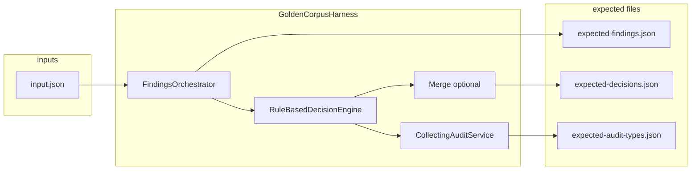

> **Scope:** Contributor-reference — Decisioning golden corpus — CI contract, layout, recording workflow, and maintenance rules for `tests/golden-corpus/decisioning/`.

# Decisioning golden corpus

**Audience:** Engineers changing authority decisioning, merge integration, or manifest emission who need a merge-blocking correctness signal without LLMs or SQL integration tests.

**Status:** Active hard gate in `.github/workflows/ci.yml` (`dotnet-fast-core` → **Test — fast core**). Tests live in `ArchLucid.Decisioning.Tests` and run under `Suite=Core` with `Category!=GoldenCorpusRecord`.

---

## Why this exists

The pipeline **agent output → typed findings → manifest decisions → audit** is the highest-risk place for silent regressions. The corpus freezes **deterministic** JSON for each curated input bundle so any drift fails CI before it reaches production.

**Non-goals:** No live LLM calls, no integration-tier SQL, and no edits to `ArchLucid.Decisioning` / `ArchLucid.Decisioning.Merge` production code or `AuditEvents` schema solely to satisfy a case (if behavior is intentional, update expected files and document in the case `README.md`).

---

## Corpus contract

Each case is a directory under `tests/golden-corpus/decisioning/` named `case-NN` (two-digit index). **63** directories exist today: **`case-01` … `case-30`** are produced by `GoldenCorpusGraphFactory` / the materializer; **`case-31`** through **`case-63`** are **hand-authored** scenarios (see each folder’s `README.md`).

| File | Purpose |
|------|---------|
| `input.json` | Agent-result bundle: graph snapshot, run identifiers, optional merge payload (same shape as `GoldenCorpusInputDocument`). |
| `expected-findings.json` | Normalized typed finding rows (stable sort order). Each `findingId` is a **deterministic surrogate** (SHA256-derived Guid over canonical fields) because production engines emit fresh runtime IDs per run; golden files must not depend on those. |
| `expected-decisions.json` | Manifest decision payload after authority + optional merge (stable shape). |
| `expected-audit-types.json` | Sorted list of `AuditEventType` string names emitted during the harness run. |
| `README.md` | What the case exercises; note any intentional quirks of frozen behavior. |

On assertion failure, `GoldenCorpusRegressionTests` writes sibling files with an `.actual` suffix for trivial diffing.

---

## Coverage map (`case-01` … `case-63`)

Cases **`case-01` … `case-30`** are built by cycling **six archetypes** (`index % 6`) with a stable suffix per block of six (`index / 6`).

| Case | What it stresses |
|------|------------------|
| **`case-31`** (hand-authored) | **Compliance** (`storage-must-have-policy-applicability` on a **storage** topology node **without** policy coverage) **+** **security coverage** (no **PROTECTS**) **+** **topology pillar gap** (network/compute/data missing) in one deterministic graph. See `tests/golden-corpus/decisioning/case-31/README.md`. |
| **`case-32`** (hand-authored) | **Merge input gate** rejects an `AgentResult` whose `runId` stamp does not match the bundle `mergeRunId`. See `tests/golden-corpus/decisioning/case-32/README.md`. |
| **`case-33`** (hand-authored) | **`DeclarationSecurityBaselineFindingEngine`** — public network access + HTTPS disabled on one `TopologyResource`. See `tests/golden-corpus/decisioning/case-33/README.md`. |
| **`case-34`** (hand-authored) | **`DeclarationPremiseConflictFindingEngine`** — `SecurityBaseline` intent conflicts with linked declaration public-access property. See `tests/golden-corpus/decisioning/case-34/README.md`. |
| **`case-35`** (hand-authored) | **WK-06 / DX-03 actor slice** — declaration-seeded machine actors (k8s `ServiceAccount` + anonymous `aws_iam_role`) with auto `TrustBoundary` on external actors, plus one guided-intake internal human. Exercises **privileged-access** only among actor engines (external-exposure / cross-origin trust-boundary suppressed). See `tests/golden-corpus/decisioning/case-35/README.md`. |
| **`case-36`** (hand-authored) | **DX-03 companion** — hand-authored mixed internal/external actors **without** `TrustBoundary` nodes. Exercises **trust-boundary**, **external-exposure**, and **privileged-access**. See `tests/golden-corpus/decisioning/case-36/README.md`. |
| **`case-37`** (hand-authored) | **DX-04 / DX-14** — storage declaration `tf.public_network_access: Disabled` vs pinned Azure inventory `publicNetworkAccess: Enabled` on the same ARM id. Exercises **`declaration-inventory-contradiction`** with scoped extractor inventory (no live Azure). See `tests/golden-corpus/decisioning/case-37/README.md`. |
| **`case-38`** (hand-authored) | **DX-28** — machine actor Contributor path to regulated Key Vault. Exercises **`identity-blast-radius`**. See `tests/golden-corpus/decisioning/case-38/README.md`. |
| **`case-39`** (hand-authored) | **DX-28** — internet-exposed SSH to subnet with SQL datastore path. Exercises **`segmentation-semantics`**. See `tests/golden-corpus/decisioning/case-39/README.md`. |
| **`case-40`** (hand-authored) | **DX-28** — requirement RPO 15 min with SQL lacking replica/failover. Exercises **`dr-rpo-topology`**. See `tests/golden-corpus/decisioning/case-40/README.md`. |
| **`case-41`** (hand-authored) | **DX-24** — function `appSettings` Key Vault URI with no vault node in graph. Exercises **`dangling-declaration-reference`**. See `tests/golden-corpus/decisioning/case-41/README.md`. |
| **`case-42`** (hand-authored) | **DX-25** — zone-redundant requirement with `Standard_LRS` SQL SKU. Exercises **`requirement-sku-tier`**. See `tests/golden-corpus/decisioning/case-42/README.md`. |
| **`case-43`** (hand-authored) | **DX-29** — second billing machine actor Contributor path to audit storage account. Exercises **`identity-blast-radius`** (second fixture). See `tests/golden-corpus/decisioning/case-43/README.md`. |
| **`case-44`** (hand-authored) | **DX-29** — second internet-exposed RDP (3389) to subnet with HR SQL path. Exercises **`segmentation-semantics`** (second fixture). See `tests/golden-corpus/decisioning/case-44/README.md`. |
| **`case-45`** (hand-authored) | **DX-29** — second requirement RPO 5 min with ledger SQL lacking replica/failover. Exercises **`dr-rpo-topology`** (second fixture). See `tests/golden-corpus/decisioning/case-45/README.md`. |
| **`case-46`** (hand-authored) | **DX-22** — six declaration public-network gaps on storage-shaped topology nodes. Feeds **`ChecklistClusterSynthesisGoldenCorpusTests`** (post-gate synthesis sibling). See `tests/golden-corpus/decisioning/case-46/README.md`. |
| **`case-47`** (hand-authored) | **DX-36** — external actor path to SQL without trust-boundary hop. Exercises **`data-flow-trust-boundary`**. See `tests/golden-corpus/decisioning/case-47/README.md`. |
| **`case-48`** (hand-authored) | **DX-40** — pinned Azure inventory with unattached managed disk and empty graph. Exercises **`orphaned-azure-resource`** (also **`azure-inventory-reconciliation`**). See `tests/golden-corpus/decisioning/case-48/README.md`. |
| **`case-49`** (hand-authored) | **DX-40** — pinned Azure inventory with `allowBlobPublicAccess: true`. Exercises **`azure-inventory-security-baseline`**. See `tests/golden-corpus/decisioning/case-49/README.md`. |
| **`case-50`** (hand-authored) | **DX-40** — graph references Key Vault secret; pinned inventory row stale 90+ days before harness clock. Exercises **`secrets-lifecycle`**. See `tests/golden-corpus/decisioning/case-50/README.md`. |
| **`case-51`** (hand-authored) | **DX-44** — pinned AWS inventory with unattached EBS volume and empty graph. Exercises **`orphaned-aws-resource`** (also **`aws-inventory-reconciliation`**). See `tests/golden-corpus/decisioning/case-51/README.md`. |
| **`case-52`** (hand-authored) | **DX-44** — pinned GCP inventory with unattached persistent disk and empty graph. Exercises **`orphaned-gcp-resource`** (also **`gcp-inventory-reconciliation`**). See `tests/golden-corpus/decisioning/case-52/README.md`. |
| **`case-53`** (hand-authored) | **DX-44** — pinned AWS inventory with security group administrative ingress from 0.0.0.0/0. Exercises **`aws-inventory-security-baseline`**. See `tests/golden-corpus/decisioning/case-53/README.md`. |
| **`case-54`** (hand-authored) | **DX-44** — pinned GCP inventory with firewall SSH ingress from 0.0.0.0/0. Exercises **`gcp-inventory-security-baseline`**. See `tests/golden-corpus/decisioning/case-54/README.md`. |
| **`case-55`** (hand-authored) | **DX-46** — pinned Azure inventory ZIP with `advisor-cost.json` and empty `resources.json`. Exercises **`advisor-cost-recommendation`**. See `tests/golden-corpus/decisioning/case-55/README.md`. |
| **`case-56`** (hand-authored) | **DX-46** — pinned AWS inventory ZIP with `advisor-cost.json` cost row and empty `resources.json`. Exercises **`aws-cost-recommendation`**. See `tests/golden-corpus/decisioning/case-56/README.md`. |
| **`case-57`** (hand-authored) | **DX-46** — pinned GCP inventory ZIP with `recommender-cost.json` and empty `resources.json`. Exercises **`gcp-cost-recommendation`**. See `tests/golden-corpus/decisioning/case-57/README.md`. |
| **`case-58`** (hand-authored) | **DX-48** — CloudFormation S3 declaration (`PublicNetworkAccess: Disabled`) vs pinned AWS inventory `publiclyAccessible: true` on the same ARN. Exercises **`declaration-inventory-contradiction`** from in-batch CloudFormation ingest. See `tests/golden-corpus/decisioning/case-58/README.md`. |
| **`case-59`** (hand-authored) | **DX-48** — Pulumi stack-export storage node with identity path overlay (Contributor to regulated Key Vault). Exercises **`identity-blast-radius`** from in-batch Pulumi ingest. See `tests/golden-corpus/decisioning/case-59/README.md`. |
| **`case-60`** (hand-authored) | **DX-48** — CDK synth Lambda node with external actor path overlay (no trust-boundary hop). Exercises **`data-flow-trust-boundary`** from in-batch CDK synth ingest. See `tests/golden-corpus/decisioning/case-60/README.md`. |
| **`case-61`** (hand-authored) | **DX-49** — compute + datastore topology nodes with no `CONNECTS_TO`/`DEPENDS_ON` edge. Exercises **`topology-anti-pattern`**. See `tests/golden-corpus/decisioning/case-61/README.md`. |
| **`case-62`** (hand-authored) | **DX-49** — compute topology node with no security baseline `PROTECTS` edge. Exercises **`security-baseline-expectation`**. See `tests/golden-corpus/decisioning/case-62/README.md`. |
| **`case-63`** (hand-authored) | **DX-49** — context snapshot requires `encryption-at-rest` with no matching graph evidence. Exercises **`required-capability-coverage`**. See `tests/golden-corpus/decisioning/case-63/README.md`. |

### Archetypes (`case-01` … `case-30` only)

| Archetype | What it stresses |
|-----------|------------------|
| 0 | **Empty graph** — no nodes (boundary: minimal graph / empty finding sets where applicable). |
| 1 | Requirement-only graph. |
| 2 | **Topology** — `TopologyResource` nodes (topology coverage engines). |
| 3 | **Cost** — `CostConstraint` with budget / risk properties. |
| 4 | **Compliance / security baseline** — `SecurityBaseline` with missing control. |
| 5 | **Multi-signal** — requirement + topology + security + cost + edges (cross-category density). |

**Merge slice:** `case-01` … `case-03` include a minimal `DecisionEngineService.MergeResults` payload (success path with one proposed service). Remaining cases exercise authority + manifest only.

**Simulator / LLM:** The harness uses **in-process** finding engines and `RuleBasedDecisionEngine` only. It does **not** start the agent runtime or call a live LLM. `AgentExecution:Mode=Simulator` applies to hosted runs; it is not required for this test path because no coordinator agent execution is invoked.

**Severity / conflict edges:** Dedicated “threshold” and “conflicting decision node” fixtures are approximated by **multi-signal graphs** (several engines firing) and **merge + authority** on the first three cases. Tightening with extra named edge fixtures is a corpus expansion (add new case indices per the no-deletion rule), not a change to production decisioning.

---

## Where the harness lives

| Component | Location |
|-----------|----------|
| **Full pipeline** (orchestrator, engines, decision engine, optional merge, audit capture) | `ArchLucid.Decisioning.Tests/GoldenCorpus/GoldenCorpusHarness.cs` |
| **Shared primitives** (frozen clock provider, collecting audit service, JSON options) | `ArchLucid.TestSupport/GoldenCorpus/` |

`ArchLucid.TestSupport` intentionally does **not** reference `ArchLucid.Decisioning`, so the heavy wiring stays in the Decisioning test project and the solution graph stays clean.

**Policy-filter contract (sibling tests):** `GoldenCorpusHarness.CreateEngines()` constructs `FileComplianceRulePackProvider` directly (**twenty-two** graph-only engines: requirement slice, topology slice, security slice including trust-boundary / privileged-access / external-exposure / data-flow-trust-boundary, compliance, cost, declaration engines, dangling-declaration-reference, and requirement-sku-tier — unfiltered pack). **`GoldenCorpusEffectfulEngineFactory`** registers **sixteen** additional effectful engines with no-op inventory / disabled governance options so cases **01–36** stay stable; **`case-37`** supplies a pinned Azure inventory fixture for **`declaration-inventory-contradiction`**. `PolicyFilteredGoldenCorpusTests` runs `ComplianceFindingEngine` twice on a fixed graph with two different `PolicyPackContentDocument.ComplianceRuleKeys` postures and asserts the compliance finding rule ids differ. `PolicyFilteredDeclarationGoldenCorpusTests` runs `DeclarationSecurityBaselineFindingEngine` with two filtered packs (`soc2-004` vs `cis-az-006`) and asserts declaration findings differ. `PolicyDeclarationInventoryContradictionGoldenCorpusTests` runs **`PolicyDeclarationInventoryContradictionFindingEngine`** on the **`case-37`** graph + inventory with filtered **`cis-az-006`** pack (three-way contradiction sibling). `PolicyPackP1ToggleGoldenCorpusTests` runs the same declaration engine on bundled **SOC 2** vs **CIS Azure** packs at **`P1`** (buyer-visible demo arm). `PolicyExpectationCoverageGoldenCorpusTests` runs `TopologyCoverageFindingEngine` on one graph with and without a stamped `identity` topology extra and asserts missing categories differ. `ChecklistClusterSynthesisGoldenCorpusTests` runs the post-gate checklist-cluster stage on declaration rows from the **`case-46`** graph after dismiss posture (synthesis is not graph-stable in the merge harness alone). Summary artifact: `docs/quality/policy-filter-golden-delta.md`. These do **not** inject `PolicyFilteredComplianceRulePackProvider` or `IEffectiveGovernanceLoader` into the merge-blocking harness.

### Non-goal: production governance loader in the harness (WK-22)

`GoldenCorpusHarness` must keep **`FileComplianceRulePackProvider`** wired directly in `CreateEngines()`. Do **not** inject **`IEffectiveGovernanceLoader`**, tenant curated-rule merger, or production **`PolicyFilteredComplianceRulePackProvider`** into the merge-blocking harness — that would make `case-01` … `case-63` depend on tenant pack seeds and break bit-stability. Policy filter, P1 pack toggle, expectation stamps, checklist-cluster synthesis, and three-way policy-declaration-inventory contradiction stay in sibling tests (`PolicyFilteredGoldenCorpusTests`, `PolicyFilteredDeclarationGoldenCorpusTests`, `PolicyDeclarationInventoryContradictionGoldenCorpusTests`, `PolicyPackP1ToggleGoldenCorpusTests`, `PolicyExpectationCoverageGoldenCorpusTests`, `ChecklistClusterSynthesisGoldenCorpusTests`).

---

## How to refresh or add cases

1. **Add or edit definitions** in `GoldenCorpusGraphFactory` (and related DTOs) so new scenarios are generated with stable semantics, **or** add a new hand-authored `case-NN` directory (next index only; see **`case-31` … `case-37`**) with `input.json`, `expected-*.json`, and `README.md`. For hand-authored cases, run `ARCHLUCID_RECORD_DECISIONING_GOLDEN=1` with `Record_hand_authored_cases_33_34_when_env_flag_set`, `Record_hand_authored_case_35_when_env_flag_set`, `Record_hand_authored_case_36_when_env_flag_set`, or `Record_hand_authored_case_37_when_env_flag_set` (extend the recorder for new indices as needed).
2. **Record** (local only): set `ARCHLUCID_RECORD_DECISIONING_GOLDEN=1` and run:
   - `dotnet test ArchLucid.Decisioning.Tests/ArchLucid.Decisioning.Tests.csproj --filter "FullyQualifiedName~GoldenCorpusMaterializerTests"`
3. **Commit** the updated `tests/golden-corpus/decisioning/**` tree and case `README.md` files.
4. **Verify** regression: `dotnet test ArchLucid.Decisioning.Tests/ArchLucid.Decisioning.Tests.csproj --filter "FullyQualifiedName~GoldenCorpusRegressionTests"` (or rely on CI `Suite=Core`).

`GoldenCorpusMaterializerTests` is tagged `Category=GoldenCorpusRecord` and is **excluded** from the fast-core CI filter so accidental env in CI does not rewrite the repo.

---

## Maintenance rule: no case deletion

**Do not delete** an existing `case-NN` directory. The corpus only **grows** (new indices or new files). If a scenario is obsolete, keep the folder and mark the `README.md` as superseded or redirect to the replacement case. Rationale: git history and reviewers can always see what was locked and when.

---

## Diagram (high level)

---

## Related

- Typed findings detail: [DECISIONING_TYPED_FINDINGS.md](./DECISIONING_TYPED_FINDINGS.md)
- CI tiering comment in `.github/workflows/ci.yml` (fast core job)
