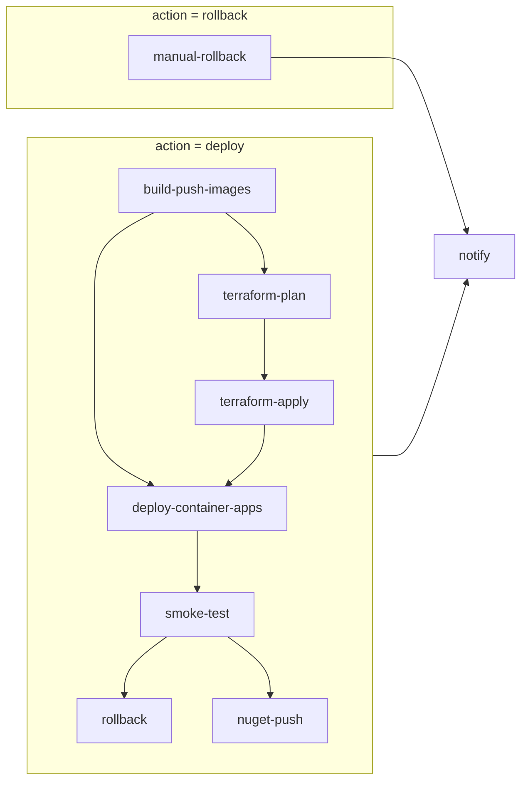

> **Scope:** Contributor-reference — CD pipeline (manual workflow_dispatch) - full detail, tables, and links in the sections below.

> **Spine doc:** [`START_HERE.md`](../START_HERE.md).


# CD pipeline (manual `workflow_dispatch` only)

This document describes the multi-job **CD** workflow (`.github/workflows/cd.yml`). It complements [DEPLOYMENT.md](../engineering/DEPLOYMENT.md) and [DEPLOYMENT_TERRAFORM.md](./DEPLOYMENT_TERRAFORM.md).

GitHub environment setup: [`docs/operations/GITHUB_CD_ENVIRONMENTS.md`](../operations/GITHUB_CD_ENVIRONMENTS.md).

## Triggers

| Trigger | Target | Notes |
|---------|--------|-------|
| **workflow_dispatch** | `dev` / `staging` / `production` | On-demand deploy or rollback only. There is **no** scheduled CD (schedules would always run from the default branch tip). |
| **Dev maintenance window** | `dev` only | Deploy allowed during hour **22** ET unless repo var `CD_MAINTENANCE_WINDOW_OVERRIDE=true`. Post-deploy validation must pass before **23:00** ET or the job fails and optional rollback runs. |

## Objective

Provide a **repeatable V1-style** path: build and push container images to ACR, optionally plan/apply Terraform for the same environment, roll **API + worker + UI** Container App revisions to the new tag, smoke the public API surface, optionally roll back revisions on failed smoke, optionally publish the API client to NuGet, and notify—using **Azure OIDC** only (no long-lived service principal client secrets in GitHub).

## Assumptions

- GitHub **Environments** `dev`, `staging`, and `production` exist when you use those CD targets; use **required reviewers** on `staging` and `production` (and optionally on `dev`) for manual gates before jobs that reference those environments run.
- Azure Federated Credentials map each environment (or the workflow) to Entra app registration(s) used by `azure/login@v2`.
- Operators copy `terraform.tfvars.example` → `terraform.tfvars` and `production.tfvars.example` → `production.tfvars` inside `infra/terraform-container-apps/` (or your `TF_WORKING_DIRECTORY`) when using Terraform; committed `.example` files are templates only.

## Architecture overview (nodes and flow)



- **Edges**: `needs` relationships in GitHub Actions; `deploy-container-apps` uses `always()`-style conditions so it still runs when `terraform-apply` is **skipped** (apply is optional).
- **Rollback path**: only `manual-rollback` and `notify` run when `action = rollback`.

## Job breakdown

| Job | Purpose |
|-----|---------|
| `build-push-images` | Checkout, OIDC login, Docker Buildx, push **API** (`ArchLucid.Api/Dockerfile`) and **UI** (`archlucid-ui/Dockerfile`) to ACR. The API image contains **both** `ArchLucid.Api.dll` and `ArchLucid.Worker.dll` (see Dockerfile comments). Tags: `${IMAGE_TAG}` (defaults to `github.sha`), plus `latest-dev`, `latest-staging`, or `latest-production` on manual CD by target. BuildKit cache scopes: `api-docker-smoke-v2`, `ui-docker-smoke-v2` (aligned with CI). |
| `terraform-plan` | Checkout; when `target=dev`, optionally writes `dev.tfvars` from environment secret **`DEV_TFVARS`** (see `.github/workflows/cd.yml`); writes the gitignored **`backend.tf`** from secret **`TF_BACKEND_TF`** so `init` binds to remote state. OIDC, `terraform init`, **remote-state assertion** (`scripts/ci/cd_assert_terraform_remote_state.py` — warns on plan-only runs, **fails** when `run_terraform_apply=true`), `terraform plan` (saved as `tfplan`), upload artifact `tfplan-<target>`, plan summary in step summary. **Skipped** when secret `TF_WORKING_DIRECTORY` is unset (job succeeds with no plan artifact). Production adds `-var-file=production.tfvars` when the file exists; staging adds `-var-file=terraform.tfvars` when present; **dev** adds `-var-file=dev.tfvars` when present (including after materialization from `DEV_TFVARS`). |
| `terraform-apply` | Runs only when `run_terraform_apply` is true and a plan was produced. Writes `backend.tf` from **`TF_BACKEND_TF`**, downloads the plan artifact, and runs `terraform apply tfplan`. **Fails closed** when state is not remote (an apply on empty local state would create a second copy of live infrastructure). Uses the same environment as the target (reviewer gate). |
| `deploy-container-apps` | OIDC, records API (and optional worker) revision **before** update, `az containerapp update --image` for API, **worker** (same image URI as API: `…/archlucid-api:<tag>`), and UI when configured, then records revisions **after**. Skips the whole update when `ACR_LOGIN_SERVER`, `AZURE_RESOURCE_GROUP`, or `CONTAINER_APP_API_NAME` is missing. Worker update runs only when secret **`CONTAINER_APP_WORKER_NAME`** is set (matches Terraform default `archlucid-worker`). Before the image roll it also mirrors the API app's SQL settings onto the worker and **fails closed** when they are unavailable (`scripts/ci/cd_heal_worker_sql_config.py`) — Terraform declares no `ConnectionStrings` for any Container App, so those values are operator-managed out-of-band and the worker was previously left without them. |
| `smoke-test` (job id; UI label **Post-deploy validation**) | Optional when `SMOKE_TEST_BASE_URL` unset. Otherwise runs **`archlucid deployment-evidence`** (same checks as `scripts/ci/cd-post-deploy-verify.sh`), writes `artifacts/deployment-evidence-<target>-<run_id>.md`, **fails the job** on probe failure, and uploads the Markdown as a workflow artifact. |
| `rollback` | On **smoke failure** only: if `CD_ROLLBACK_ON_SMOKE_FAILURE=true`, restores traffic to the captured **last-known-good** API/worker/UI revisions (digest/BUILD_ID identity), verifies runtime BUILD_ID, and writes a rollback report. Schema-incompatible deploys **block** auto-rollback. |
| `manual-rollback` | `workflow_dispatch` with `action = rollback` + required `rollback_build_id` (immutable git SHA): validates ACR digests, schema gate, digest-pinned restore, essential smoke + BUILD_ID verify, report artifact. |
| `nuget-push` | Production only, after successful smoke: packs and pushes `ArchLucid.Api.Client` when `NUGET_API_KEY` is set. |
| `notify` | `if: always()` webhook (optional) + consolidated step summary. |

## Platform probes vs CD readiness gate

Azure Container Apps **API** liveness and readiness both probe **`GET /health/live`** (fast). That keeps platform probes from recycling revisions when deep dependency checks are slow. **CD smoke requires `GET /health/ready`** (Healthy) before a release is traffic-safe — platform “ready” alone is not enough.

| Component | ACA liveness | ACA readiness | Release / traffic-safety gate |
|-----------|--------------|---------------|-------------------------------|
| API | `/health/live` | `/health/live` | CD: `/health/ready` Healthy + `/version` lineage |
| Worker | `/health/live` | `/health/ready` | Worker role deep ready |
| UI | `/api/health` | `/api/health` | Process up + build fingerprint JSON |

Full check → live/ready matrix: [`docs/operations/HEALTH_LIVE_READY_DEPENDENCY_MATRIX.md`](../operations/HEALTH_LIVE_READY_DEPENDENCY_MATRIX.md). Drift guard: `scripts/ci/container_app_probe_paths.py`.

## Post-deploy validation behavior

**Primary (CD):** after revision verification, CD runs:

1. Fast curl **`/health/live`** + **`/health/ready`** (Healthy) with retries,
2. **`scripts/ci/cd_post_deploy_product_smoke.py`** — required/optional product-path matrix (authenticated workspace + Why-ArchLucid reads, UI `/api/health`, BFF `/api/proxy/health/ready`, BUILD_ID table) — see [`docs/operations/CD_POST_DEPLOY_PRODUCT_SMOKE.md`](../operations/CD_POST_DEPLOY_PRODUCT_SMOKE.md),
3. **`archlucid deployment-evidence`** Markdown artifact (same infra probes + OpenAPI + synthetic path).

**Exit code non-zero fails the job** (release gate). For **`staging`** / **`production`**, **`SMOKE_TEST_BASE_URL`** and **`ARCHLUCID_API_KEY`** are required (no soft-skip). **`dev`** may skip when the smoke URL is unset.

**Legacy / curl:** **`scripts/ci/cd-post-deploy-verify.sh`** remains available for shells that prefer `curl`+`jq` only (see table below).

| Step | Request | Pass criteria | First-line diagnosis |
|------|---------|---------------|----------------------|
| 1 | `GET /health/live` | HTTP **200** | Logs HTTP code and body preview (redacted) on failure. |
| 2 | `GET /health/ready` | HTTP **200** and JSON **`.status` == `"Healthy"`** | Logs compact JSON preview; on non-Healthy see probe **Next steps** in the Markdown report. Does **not** call `GET /health` (requires **ReadAuthority**). |
| 3 | Product-path smoke | Required checks in [`CD_POST_DEPLOY_PRODUCT_SMOKE.md`](../operations/CD_POST_DEPLOY_PRODUCT_SMOKE.md) | Summary table: check / pass-fail / duration / expected vs observed BUILD_ID. |
| 4 | `GET /openapi/v1.json` | HTTP **200** with **`X-Api-Key`** | Covered by product smoke + deployment-evidence. |
| 5 | `GET /version` | HTTP **200**, `commitSha` == `BUILD_ID` | Wrong artifact / stale revision. |
| 6 | `GET {SMOKE_SYNTHETIC_PATH}` | HTTP **200** | Omitted when the path is **`/version`** (already checked). When not `/version`, send **`X-Api-Key`** (`ARCHLUCID_API_KEY`) — see synthetic warm-path below. |

**Synthetic warm-path (TB-758):** Set repository variable **`SMOKE_SYNTHETIC_PATH=/api/auth/me`** (recommended) so deployment-evidence performs one extra authenticated GET after `/version`. That route is **ReadAuthority**, side-effect-free, and exercises auth + tenant scope without mutating data. Anonymous health probes stay keyless. Audit with `.\scripts\ci\verify-cd-synthetic-path-vars.ps1` (`-Apply` sets the recommended value). Legacy bash: export `ARCHLUCID_API_KEY` when calling `cd-post-deploy-verify.sh` with a non-`/version` synthetic path.

**Operator CLI (local, non-blocking unless you treat exit code as gate):**

```bash
dotnet run --project ArchLucid.Cli -- deployment-evidence \
  --environment staging \
  --api-base-url "https://staging.example.com" \
  --synthetic-path /version \
  --out ./artifacts/deployment-evidence-staging-local.md \
  --repo .
```

**Break-glass OpenAPI:** add **`--allow-missing-openapi`** only when policy accepts a 404/403 on `/openapi/v1.json` for that environment; do **not** make that the default in CD without explicit approval.

Failures emit **`::error::`** lines on GitHub Actions for visible annotations when probes fail.

**Retries:** Set repository variables **`CD_POST_DEPLOY_MAX_ATTEMPTS`** & **`CD_POST_DEPLOY_RETRY_WAIT_SECONDS`** to re-run the full check sequence after deploy (helps new revisions still starting). **Cold-start checklist:** `6` / `10` (GitHub Actions retries only — no Azure compute increase). Audit with `.\scripts\ci\verify-cd-post-deploy-retry-vars.ps1` (see [`GITHUB_CD_ENVIRONMENTS.md`](../operations/GITHUB_CD_ENVIRONMENTS.md)).

**Canary (API):** When **`CD_CANARY_ENABLED=true`**, the deploy job splits ingress traffic to the new API revision (`CD_CANARY_INITIAL_PERCENT`, default **10**), optionally bakes (`CD_CANARY_BAKE_MINUTES`), then smoke promotes to 100% on success. Requires Terraform **`api_revision_mode = "Multiple"`** on the API Container App. Audit with `.\scripts\ci\verify-cd-canary-vars.ps1`. See [`PRODUCTION_DEPLOYMENT.md`](../runbooks/PRODUCTION_DEPLOYMENT.md#part-c--canary-promotion-container-apps).

**Cold-start measurement (TB-759):** After routine CD, record revision → `/health/ready` vs first authenticated business latency (`/api/auth/me` when **TB-758** is set) before proposing paid Azure levers. Runbook: [`COLD_START_MEASUREMENT.md`](../runbooks/COLD_START_MEASUREMENT.md) · baseline register: [`cold-start-baselines/`](../operations/cold-start-baselines/README.md).

**Local run (legacy bash):** `bash scripts/ci/cd-post-deploy-verify.sh https://your-api.example.com /version`

**Runner dependency:** **`jq`** must be on the path (preinstalled on `ubuntu-latest`).

## Security model

- **OIDC**: `permissions: id-token: write` and `azure/login@v2` with `AZURE_CLIENT_ID` / `AZURE_TENANT_ID` / `AZURE_SUBSCRIPTION_ID` from the environment. Do not store `AZURE_CREDENTIALS` JSON or client secrets for this flow.
- **Storage / SMB**: The pipeline does not expose SMB (port 445). Application storage patterns remain private-endpoint-oriented as described in deployment docs; nothing in this workflow publishes file shares publicly.

## Traceability

- **`BUILD_ID`** is the immutable build identity: the full git commit SHA (`github.sha` on manual CD; `workflow_run.head_sha` on staging-on-merge). It is set once at the start of image build and reused for:
  - `BUILD_SHA` / `SourceRevisionId` (API + worker in the API image),
  - `NEXT_PUBLIC_BUILD_COMMIT_SHA` (UI),
  - OCI labels (`org.opencontainers.image.revision` / `.version` / `.source` / `.created` / `.title`),
  - default **`IMAGE_TAG`**,
  - runtime `ARCHLUCID_BUILD_COMMIT_SHA` on Container Apps.
- Default image tag is **`BUILD_ID`**, overridable via repository variable `IMAGE_TAG` (must not be `latest` or `latest-*`). Friendly `latest-dev` / `latest-staging` / `latest-production` tags are **aliases only**; deploy uses the SHA tag and/or `@sha256:<digest>`.
- Drift guard: `scripts/ci/oci_build_identity.py` (unit tests in `scripts/ci/tests/test_oci_build_identity.py`).
- **Deployment lineage (fail-closed when Azure deploy is configured):**
  1. build-push requires non-empty `sha256:` digests for API + UI,
  2. deploy job consumes only `needs.build-push-images` outputs (no tag re-inference),
  3. pre-deploy `az acr manifest show-metadata` proves the digest exists in ACR,
  4. Container Apps update uses `@sha256:…` only (not `latest*`),
  5. revision image verify hard-fails unless the running revision contains that digest,
  6. smoke compares `GET /version` `commitSha` to `BUILD_ID`.
- Lineage summary: step summary + `artifacts/deployment-lineage-<target>-<run_id>.{md,json}` (`scripts/ci/cd_deployment_lineage.py`).
- **Azure deployment-target preflight** (`scripts/ci/cd_deploy_target_preflight.py`): after every `azure/login`, compare live `az account show` tenant/subscription to expected values; when ACR + RG + API app are configured, also prove those resources exist in that subscription/RG before push/update/apply. Optional GitHub Environment variables `EXPECTED_AZURE_*` / `EXPECTED_ACR_*` / `EXPECTED_CONTAINER_APP_*` override; otherwise the matching deploy secrets are the expected values (still fail on live mismatch).
- Terraform plan is stored as a run artifact named with the target environment for audit and optional `terraform apply` in a later job in the same run.

## GitHub Environment secrets and variables (checklist)

Configure per **environment** (`dev` / `staging` / `production`) or organization policy as you prefer.

| Name | Required for | Notes |
|------|----------------|-------|
| `AZURE_CLIENT_ID`, `AZURE_TENANT_ID`, `AZURE_SUBSCRIPTION_ID` | All Azure steps | Federated credential workload identity. |
| `DEV_TFVARS` | Terraform plan when `target=dev` | Optional multiline secret: full HCL body of `dev.tfvars` so the runner can plan without committing gitignored tfvars. When unset, `dev.tfvars` must already exist in the checkout (not typical). See [`AZURE_SUBSCRIPTIONS.md`](AZURE_SUBSCRIPTIONS.md). |
| `ACR_LOGIN_SERVER` | Image build/push and `az containerapp update` | e.g. `myregistry.azurecr.io`. When unset, build/push and app updates are skipped (job still succeeds). |
| `ACR_NAME` | `az acr login` | Optional; defaults to first label of `ACR_LOGIN_SERVER`. |
| `AZURE_RESOURCE_GROUP` | Container Apps CLI | Resource group that holds the apps. |
| `CONTAINER_APP_API_NAME` | Deploy / rollback | e.g. `archlucid-api`. |
| `CONTAINER_APP_WORKER_NAME` | Worker deploy / rollback | Optional; e.g. `archlucid-worker`. **Image** = same `archlucid-api:<tag>` as API; entrypoint/command stays `dotnet ArchLucid.Worker.dll` from Terraform. |
| `CONTAINER_APP_UI_NAME` | UI deploy | Optional. |
| `TF_WORKING_DIRECTORY` | Terraform jobs | e.g. `infra/terraform-container-apps`. Unset = plan/apply skipped. |
| `SMOKE_TEST_BASE_URL` | Post-deploy validation | Public API base URL (required for staging/production; optional skip for dev). |
| `ARCHLUCID_API_KEY` | Product-path smoke + OpenAPI | Admin X-Api-Key for authenticated non-mutating reads (never logged). |
| `NUGET_API_KEY` | NuGet job | Production manual CD only. |
| `CD_NOTIFY_WEBHOOK_URL` | Notify | Optional Slack-style webhook. |

**Repository variables:** `IMAGE_TAG` (override default tag), `SMOKE_SYNTHETIC_PATH` (recommended **`/api/auth/me`** for authenticated warm-path smoke; default effective **`/version`** when unset), `CD_ROLLBACK_ON_SMOKE_FAILURE` (`true` to auto-restore last-known-good revisions on validation failure — required for staging/production), `CD_POST_DEPLOY_MAX_ATTEMPTS` (recommended repo var **6**; `cd.yml` bash fallback **6** when unset; local `cd-post-deploy-verify.sh` defaults **1** unless env is exported), `CD_POST_DEPLOY_RETRY_WAIT_SECONDS` (recommended **10**; same `cd.yml` fallback), `CD_CANARY_ENABLED` (`true` for staging/production cold-start canary), `CD_CANARY_INITIAL_PERCENT` (recommended **10**), `CD_CANARY_BAKE_MINUTES` (recommended **3**).

**Manual dispatch:** `run_terraform_apply` defaults to **false** so routine releases only refresh images and Container App revisions; set **true** when infra tfvars (e.g. image pins) must move with the same run.

## Dev Contoso showcase seed (always on)

Hosted **`target=dev`** (RC lab) keeps Contoso Retail baseline/hardened sample runs available after every API roll so operator deep links such as `6e8c4a10-…c501` do not 404.

| Setting | `target=dev` | `staging` / `production` |
|---------|--------------|---------------------------|
| `ASPNETCORE_ENVIRONMENT` | **`Staging`** (not Production — `Demo:Enabled` is blocked on the Production profile) | unchanged / Production-like |
| `Demo__Enabled` | **`true`** | **`false`** (CD config gate) |
| `Demo__EnableShowcaseSeed` | **`true`** (startup seed on non-Development hosts) | unset / false |
| `Demo__SaaSGuestSeedEnabled` | **`true`** (allows idempotent `POST /v1/demo/seed` on Staging) | unset / false |

CD **auto-heals** those API Container App env vars during the pre-deploy config check when `target=dev`, and re-pins them on each `az containerapp update` for the API. Seed is **idempotent** (`IDemoSeedService`) and covers Contoso baseline/hardened plus Product Tour / regulated demo workspaces. Post-deploy product smoke treats Contoso summary as **required** on `dev` only.

## Operational considerations

- **Environment protection**: Use `required_reviewers` on `staging` and `production` so `terraform-apply` and image deploy jobs respect your change-management process. **`dev`** is usually ungated for engineer velocity; add reviewers if your org requires it.
- **Failure behavior**: If `terraform-plan` fails, downstream deploy jobs do not run. If **post-deploy validation** fails and `CD_ROLLBACK_ON_SMOKE_FAILURE=true`, the workflow restores **last-known-good** API/worker/UI revisions (schema gate may block); the run still fails. Read the job log / `cd-rollback-*` artifact for BUILD_ID, schema, and verify results.
- **Terraform vs CLI**: **CD owns runtime Container App image tags.** `cd.yml` rolls API, worker, and UI via `az containerapp update`; `infra/terraform-container-apps` seeds warm-start pins in tfvars but each `azurerm_container_app` uses `lifecycle { ignore_changes = [template[0].container[0].image] }` (TB-657) so a later `terraform apply` does **not** revert CD rollouts. Update tfvars when you want Terraform to change the *seed* pin for net-new environments; routine releases do not require a matching apply.
- **Terraform remote state is mandatory for a meaningful plan**: `infra/terraform-container-apps/backend.tf` is **gitignored**, so a CI checkout has no backend block and plain `terraform init` silently selects the **implicit local backend** — empty state on the ephemeral runner. The plan then proposes creating every resource (including the resource group) against infrastructure that already exists, which also makes `assert_terraform_plan_data_regions.py` / `assert_sql_backup_regions.py` assert against a fabricated diff. Set the environment-scoped secret **`TF_BACKEND_TF`** to the full `backend.tf` contents. Detection uses Terraform's own backend record (`.terraform/terraform.tfstate`): absent means the implicit local backend, and `type: local` is equally ephemeral.
- **Migrations**: Schema still travels with the **API** process (DbUp / bootstrap on startup). Deploy API before relying on worker-only features that need new schema, or run a one-off migration job per your runbook.

## When to skip full CD (avoid no-op revision churn)

**TB-756 posture:** Each `az containerapp update` (including routine CD) can start a **new revision** and cold-start window even when the container image digest is unchanged. Avoid unnecessary deploys — they do not raise `min_replicas`, but they do add revision churn and transient cold-start risk.

| Situation | Action |
|-----------|--------|
| Docs, backlog, tests-only, or CI config with **no** API/UI/Dockerfile change | **Do not** run `workflow_dispatch` deploy |
| Green CD just finished; operator wants to "refresh" | **Do not** run manual `az containerapp update` — CD already pinned digest + revision |
| Same git commit re-run without a new image build | Usually **skip** — digest is unchanged; deploy job emits an informational notice |
| API/Worker/UI code, Dockerfile, or Container App env vars changed | **Run** CD (digest-pinned `@sha256:…` + `--revision-suffix`) |
| Infra/tfvars must move with the release | CD with **`run_terraform_apply=true`** when appropriate |

**How CD rolls intentionally:** `cd.yml` deploys with **`registry/repo@sha256:<digest>`** (never `latest`) and **`--revision-suffix`** so a deliberate roll still creates a new revision when the image string would otherwise match a prior deploy. That is correct for real releases; it is wasteful when nothing image-relevant changed.

**Terraform:** CD owns runtime image tags (**TB-657**). `terraform apply` does not refresh live images after CD; do not apply Container Apps Terraform solely to "sync" an image CD already rolled.

See also [DEPLOYMENT_RUNBOOK.md](DEPLOYMENT_RUNBOOK.md) §2 (deploy failed / unnecessary reruns).

## Dev: dropping Front Door for the Container Apps FQDN (cost-aware)

`dev` is the one target where **Front Door / WAF is optional** — see [`PILOT_PROFILE.md`](../deployment/PILOT_PROFILE.md) ("omit Front Door for pilots; use Container Apps direct FQDN + TLS"). The pre-deploy configuration check only pins **`Cors__AllowedOrigins__0`** to `https://www.archlucid.net` for **staging/production**; for `dev` it just requires the value to be **set** (any origin), since a Container Apps FQDN is unique per environment and can't be hardcoded.

**Cutover order (avoids downtime — do not reverse):**

1. Keep the existing `infra/terraform-edge` Front Door stack for `dev` running as-is.
2. Point `dev` at the Container App FQDN: set the `dev` environment's **`SMOKE_TEST_BASE_URL`** and the API Container App's **`Cors__AllowedOrigins__0`** to the `terraform-container-apps` output `api_https_url` / `ui_https_url` — or a custom domain bound directly to the Container App via `ui_custom_domain_name` / `api_custom_domain_name` (see [`infra/terraform-container-apps/README.md`](../../infra/terraform-container-apps/README.md#custom-domain-without-front-door-ui_custom_domain_name--api_custom_domain_name), still no Front Door) — and update the Entra app registration's redirect URIs to match.
3. Run CD for `target=dev` and confirm a **green** post-deploy validation against the FQDN directly.
4. Only **after** that green run, disable Front Door for dev (`enable_front_door_waf = false` in `infra/terraform-edge` tfvars, then apply — or `terraform destroy` scoped to that root).

Front Door and Container Apps are separate Terraform roots with no resource dependency, so step 4 never restarts or redeploys the running Container Apps — it only removes the edge profile/WAF/custom-domain association. The risk is entirely on the **public hostname** (whatever DNS pointed at Front Door stops resolving once the custom-domain association is removed), which is why step 4 must come after step 3 is verified green, not before.

## Application rollback

Focus: **application** rollback after failed deploy/smoke. **No automatic database rollback** (DbUp is forward-only — see [`docs/runbooks/MIGRATION_ROLLBACK.md`](../runbooks/MIGRATION_ROLLBACK.md)).

Helpers: `scripts/ci/cd_rollback.py`, `cd_capture_last_known_good.py`, `cd_plan_rollback.py`, `cd_finalize_rollback_report.py`. Tests: `scripts/ci/tests/test_cd_rollback.py`.

### Before each deploy

`deploy-container-apps` captures a **last-known-good** JSON artifact (`cd-last-known-good-<target>-<run_id>`) from the active API/worker/UI revisions: revision name, image digest, and `ARCHLUCID_BUILD_COMMIT_SHA` when present.

### When automatic rollback runs

All of the following:

1. Post-deploy **smoke-test job fails**.
2. Repository variable **`CD_ROLLBACK_ON_SMOKE_FAILURE=true`**.
3. `SMOKE_TEST_BASE_URL` is configured.
4. A distinct failed revision exists vs the pre-deploy revision.
5. Last-known-good artifact is usable (API revision + digest/BUILD_ID).
6. Schema gate passes: no **destructive** forward migrations between LKG BUILD_ID and failed BUILD_ID (DROP TABLE/COLUMN, destructive ALTER, `sp_rename`, etc.).

Then CD restores ingress traffic to LKG revisions (API + worker + UI when configured), deactivates the failed revisions, re-checks `/health/live`, `/health/ready`, API `/version` BUILD_ID, and (when UI is configured) UI public-shell BUILD_ID meta, and uploads `cd-rollback-*` artifacts. **The workflow remains failed** because smoke failed — rollback success does not greenwash the deploy.

**Canary:** Smoke failure during canary bake follows this same auto-rollback path (no separate canary-only rollback).

### When automatic rollback is skipped or blocked (human intervention)

| Condition | Behavior |
|-----------|----------|
| `CD_ROLLBACK_ON_SMOKE_FAILURE` ≠ `true` | Skip (operator must run manual rollback or re-deploy) |
| Smoke URL missing | Skip (refuses blind rollback) |
| No distinct new revision / missing LKG | Skip |
| Destructive migrations after LKG | **Block** with schema error — do **not** auto-roll app; follow migration restore guidance |
| Schema gate cannot resolve LKG/failed git SHAs (shallow clone) | **Block** fail-closed — deepen fetch / human intervention; gate is never silently skipped |
| Post-rollback BUILD_ID/health verify fails | Rollback job fails; operator investigates |

### Manual rollback

`workflow_dispatch` → `action=rollback` → protected Environment approval → required input **`rollback_build_id`** (immutable git SHA / BUILD_ID):

1. Validate ACR manifests `archlucid-api:<BUILD_ID>` and (when UI configured) `archlucid-ui:<BUILD_ID>`.
2. Schema gate vs currently running BUILD_ID.
3. Digest-pinned `az containerapp update` (never mutable `latest*`).
4. Essential smoke + BUILD_ID verify + report artifact.

### Staging / production expectation

Keep **`CD_ROLLBACK_ON_SMOKE_FAILURE=true`** on staging/production Environments (bootstrap script sets this by default). Dev may temporarily set `false` for experimentation; restore before relying on auto-rollback.

## Related workflows

- **CI** (`.github/workflows/ci.yml`): validation, tests, Docker smoke caches.
- **CD staging on merge** (`.github/workflows/cd-staging-on-merge.yml`): optional automatic staging deploy after green CI on `main`/`master` when `AUTO_DEPLOY_STAGING_MERGE=true`; same digest-pinned Container App update + LKG capture + schema-gated auto-rollback as `cd.yml` (manual `rollback_build_id` remains on `cd.yml` only).

**When something breaks after deploy:** [DEPLOYMENT_RUNBOOK.md](DEPLOYMENT_RUNBOOK.md) (health failures, deploy-only failures, version identification, manual rollback).
