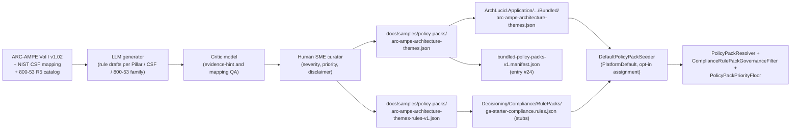

> **Scope:** Design spec for V1 GA bundled pack **#24 — ARC-AMPE Architecture Themes (CMS ACA / Medicaid Partner Entities)**. Content authoring (rule JSON) is **out of scope** for this document and tracked separately under the LLM → critic → human pipeline in [`POLICY_PACK_CONTENT_BACKLOG.md`](POLICY_PACK_CONTENT_BACKLOG.md).
>
> **Buyer-safe invariant:** Architecture-review prompts mapped thematically to ARC-AMPE Volumes I and II — **not** CMS conformity assessment, **not** SSPP authoring, **not** third-party attestation, **not** legal advice on ACA/Medicaid scope. Same posture as every other bundled pack.

> **Spine docs:** [`DEFAULT_POLICY_PACKS_V1.md`](../go-to-market/DEFAULT_POLICY_PACKS_V1.md) · [`POLICY_PACK_RULE_PRIORITY_MODEL.md`](POLICY_PACK_RULE_PRIORITY_MODEL.md) · [`POLICY_PACK_CONTENT_BACKLOG.md`](POLICY_PACK_CONTENT_BACKLOG.md)

# ARC-AMPE policy pack — design spec (V1 GA, pack #24)

**Audience:** product, engineering, and GTM. This is the **architecture / content-shape contract** that the rule JSON must satisfy when authored.

---

## 1. Objective

Ship a credible, defensible **ARC-AMPE architecture-review pack** as part of V1 GA so ArchLucid is one of very few governance tools that can demonstrate **CMS ACA / Medicaid / Partner Entity** posture coverage during pilots — without claiming CMS conformity or replacing the SSPP that Volume II requires.

**Buyer outcome:** A pilot working with ACA Administering Entities (AE), Medicaid agencies, or their IT vendors / data processors can assign this pack and immediately see (a) which **Pillars** their architecture supports, (b) which **NIST CSF** functions and **NIST SP 800-53 R5** families have evidence in the manifest, and (c) where **architecture-review gaps** suggest SSPP / continuous monitoring follow-ups for their own counsel and assessor.

---

## 2. Assumptions

| # | Assumption | Rationale / source |
|---|------------|--------------------|
| A1 | ARC-AMPE Volume I v1.02 (CMS, 2025-04-10) is the canonical source for **Pillars** and the **ACA AE CSF Profile** (Tables 6–10). Volume II is the SSPP control catalog — referenced thematically, **not republished**. | CMS ARC-AMPE Volume I, Foreword and Appendix D. |
| A2 | ARC-AMPE is **NIST SP 800-53 R5 Moderate-baseline-derived** with CMS tailoring; controls are not reproduced — `frameworkMappings` cite control family + identifier (e.g. `SC-8`, `IR-4`). | ARC-AMPE §2 and Appendix A.2. |
| A3 | The pack covers **architecture-review themes only** — not personnel screening (`PS-*`), physical access (`PE-*`), or maintenance (`MA-*`) procedural rigor beyond what architecture evidence can support. | ArchLucid scope: architecture manifest + Azure extractor evidence. |
| A4 | **US data residency / offshore prohibition** is a first-class differentiator vs MARS-E and must be a P0 rule, not a generic note. | ARC-AMPE §2.2 "Drivers for Change". |
| A5 | **Enterprise Risk Management (ERM)** integration (NIST 800-37 RMF cycle) is an explicit ARC-AMPE differentiator and gets its own sub-corpus. | ARC-AMPE Appendices B and C. |
| A6 | The pack uses ArchLucid’s **P0/P1/P2** priority tiers; **P0** mirrors CMS "High Priority Subcategories" (Table 7) plus mandatory ARC-AMPE differentiators; **P1** mirrors "Moderate Priority" (Table 8); **P2** covers the remaining CSF Subcategories and Volume II depth. | [`POLICY_PACK_RULE_PRIORITY_MODEL.md`](POLICY_PACK_RULE_PRIORITY_MODEL.md) + ARC-AMPE §D.2.1.3. |
| A7 | Bundled pack defaults to **`priorityFloor: P0`** so pilots see CMS-graded must-haves first; operators widen to `P1` / `P2` once SSPP work is underway. | Project pattern; matches §4 of priority model. |
| A8 | The pack is **seeded `PlatformDefault` enabled-for-all** at tenant provisioning (V1 manifest entry #24), like every other bundled pack. Scope is communicated by **disclaimer + appendix + UI Inspect**; operators disable the assignment for non-healthcare tenants if irrelevant. | See §7 below (Resolved decisions §11.Q1). |
| A9 | Disclaimer language is **per-rule** (via `frameworkMappings.note` style) **and** in pack `metadata.frameworkMappingDisclaimer`. | Same buyer-safe pattern as AI Governance and HIPAA packs. |
| A10 | Authoring uses the LLM generator → critic → human SME pipeline; ArchLucid does **not** ship a CMS-employed reviewer. Pack carries `metadata.authoringMode = "llm-critic-human"`. | [`POLICY_PACK_CONTENT_BACKLOG.md`](POLICY_PACK_CONTENT_BACKLOG.md) §2. |

---

## 3. Constraints

| # | Constraint | Implication |
|---|------------|-------------|
| C1 | Manifest pack count is currently **23**; this proposal moves it to **24**. | Tests asserting count must bump. CI manifest test stays green. |
| C2 | Rule prefix must be unique across all 23 existing packs. | Use `arc-ampe-*` (sub-corpora detailed in §5). |
| C3 | All `severityFloor` / `priorityFloor` / curated-rule JSON must validate against the existing `PolicyPackContentDocument` and `CuratedPolicyPackRulesDocument` shapes. | No schema changes required (see §5). |
| C4 | ArchLucid must **never** auto-classify a tenant as an "ACA Administering Entity" or "Partner Entity". That determination is the customer's legal/contractual position. | Disclaimer wording must be explicit and repeated in the appendix doc. |
| C5 | Procurement-pressure realism (`Enterprise-Realism.mdc`) — sellers will be asked **"are you ARC-AMPE certified?"**. The pack and appendix must give them a confident, accurate answer. | Pack name uses **"Architecture Themes"** suffix; appendix opens with a one-paragraph FAQ. |
| C6 | The pack ships as **content**, not platform code. No new C# types, no schema migrations, no new compliance evaluator. | All variability expressed via `advisoryDefaults` strings + `frameworkMappings`. |
| C7 | Volume II's ~400 controls are **not** reproduced verbatim — derivative-work / authoritative-control concerns. | Cite by control id; describe expected **architecture evidence**, not the control text. |

---

## 4. Architecture Overview



**Net new shape:** none — the design fits inside the existing curated-rules + bundled-manifest pipeline. The pack adds **content**, the optional **opt-in seeding tag**, and the **appendix doc**.

---

## 5. Component Breakdown

### 5.1 Pack identity

| Field | Value |
|-------|-------|
| Slug | `arc-ampe-architecture-themes` |
| Display name | **ARC-AMPE Architecture Themes (CMS ACA / Medicaid Partner Entities)** |
| Short name (UI chip) | `ARC-AMPE` |
| Category | **Compliance** (sub-flavor: *Public sector / Healthcare exchange*) |
| Pack type | `PlatformDefault` |
| Version | `1.0.0` |
| Manifest position | **#24** |
| Vertical tag | `us-healthcare-exchange` (advisory string) |
| `isDefault` | `true` |
| Default `priorityFloor` | `P0` |
| Default `severityFloor` | `warning` |
| Source citation | "ARC-AMPE Volume I v1.02 (CMS, 2025-04-10)" (in `metadata.sourceCitation`) |

### 5.2 Rule id prefix conventions (sub-corpora)

These let operators filter by sub-area without splitting the pack. Naming is enforced in the curated JSON only — no code changes.

| Prefix | Theme | Expected priority mix |
|--------|-------|------------------------|
| `arc-ampe-pillar-*` | ACA AE Pillars 1–7 (anchor narratives, one rule per Pillar) | **All P0** |
| `arc-ampe-id-*` | NIST CSF **Identify** (ID.AM, ID.BE, ID.GV, ID.RA, ID.RM, ID.SC) | Majority **P0**, some P1 |
| `arc-ampe-pr-*` | NIST CSF **Protect** (PR.AC, PR.AT, PR.DS, PR.IP, PR.MA, PR.PT) | Mixed P0 / P1 |
| `arc-ampe-de-*` | NIST CSF **Detect** (DE.AE, DE.CM, DE.DP) | Mixed P0 / P1 |
| `arc-ampe-rs-*` | NIST CSF **Respond** (RS.RP, RS.CO, RS.AN, RS.MI, RS.IM) | Mostly P1 |
| `arc-ampe-rc-*` | NIST CSF **Recover** (RC.RP, RC.IM, RC.CO) | Mostly P1 |
| `arc-ampe-pf-*` | NIST **Privacy Framework** (Identify-P, Govern-P, Control-P, Communicate-P, Protect-P) | Mixed P0 / P1 |
| `arc-ampe-erm-*` | **Enterprise Risk Management** (NIST 800-37 RMF: categorize → select → implement → assess → authorize → monitor) | **All P0** |
| `arc-ampe-data-us-*` | **US data residency** / offshore prohibition / cloud region pinning | **All P0** |
| `arc-ampe-vol2-*` | Pointer rules referencing **Volume II SSPP artifacts** (advisory only — no SSPP authoring) | **All P2** |

### 5.3 Target rule volume (V1 publish)

Not a cap; a credible publishable target for the first version. Authors may go higher per the priority model.

| Sub-corpus | Target count (V1) |
|------------|--------------------|
| `arc-ampe-pillar-*` | **7** (one per Pillar) |
| `arc-ampe-id-*` | ~12 |
| `arc-ampe-pr-*` | ~18 |
| `arc-ampe-de-*` | ~8 |
| `arc-ampe-rs-*` | ~6 |
| `arc-ampe-rc-*` | ~5 |
| `arc-ampe-pf-*` | ~10 |
| `arc-ampe-erm-*` | ~6 |
| `arc-ampe-data-us-*` | ~4 |
| `arc-ampe-vol2-*` | ~4 |
| **Total** | **~80 rules** |

This makes ARC-AMPE the **second-largest bundled pack** after `security-architecture-baseline` — appropriate given the framework's scope.

### 5.4 Rule shape (no schema changes)

Each rule uses the existing `CuratedRulesRuleEntry` shape, with `priority` already added in the priority-tier work:

```json
{
  "id": "arc-ampe-pr-001",
  "title": "Data-in-transit encryption is documented for Exchange-facing surfaces",
  "description": "Architecture manifest should identify all ingress/egress paths handling PII / PHI and reference the TLS posture (version, cipher policy, mTLS where applicable). Thematic alignment to ARC-AMPE PR.DS-2 / SC-8 / SC-11.",
  "severity": "High",
  "priority": "P0",
  "remediationGuidance": "Tag each ingress in services[].Tags with the encryption profile; describe TLS termination and mutual auth boundaries in metadata.ChangeDescription.",
  "evidenceHints": [
    "services[].Tags",
    "services[].Endpoints",
    "metadata.ChangeDescription",
    "governance.RequiredControls"
  ],
  "frameworkMappings": [
    { "framework": "ARC-AMPE Volume I (CMS, v1.02)", "theme": "ACA AE CSF Profile — PROTECT / PR.DS-2 (High Priority Subcategory)" },
    { "framework": "NIST SP 800-53 R5", "control": "SC-8", "requirement": "Transmission confidentiality and integrity" },
    { "framework": "NIST SP 800-53 R5", "control": "SC-11", "requirement": "Trusted path" },
    { "framework": "Disclaimer", "theme": "Thematic architecture-review mapping; not CMS conformity, SSPP authoring, or legal classification." }
  ]
}
```

### 5.5 Pack content document (`advisoryDefaults` + `metadata`)

```json
"advisoryDefaults": {
  "severityFloor": "warning",
  "priorityFloor": "P0",
  "scanDepth": "extended",
  "verticalScope": "us-healthcare-exchange",
  "dataResidency": "us-only",
  "arcAmpeVolumes": "I-and-II-architecture-themes"
},
"metadata": {
  "templateId": "arc-ampe-architecture-themes-v1",
  "pack.displayName": "ARC-AMPE Architecture Themes (CMS ACA / Medicaid Partner Entities)",
  "pack.category": "Compliance",
  "pack.version": "1.0.0",
  "pack.isDefault": "true",
  "pack.description": "Architecture-review themes aligned to CMS ARC-AMPE Volume I v1.02 (Pillars, ACA AE CSF Profile, Privacy Framework profile) with NIST SP 800-53 R5 control citations. Thematic mapping only; not CMS conformity, SSPP authoring, or attestation.",
  "frameworkMappingDisclaimer": "Thematic architecture-review mapping toward ARC-AMPE Volumes I and II (CMS, v1.02). Not CMS conformity assessment, not SSPP authoring, not third-party attestation, not legal advice. ArchLucid does not classify customers as ACA Administering Entities or Partner Entities; those determinations rest with customer counsel.",
  "sourceCitation": "Centers for Medicare & Medicaid Services, ARC-AMPE Volume I, Version 1.02, 2025-04-10",
  "verticalRecommendation": "us-healthcare-exchange",
  "seedScopeRecommendation": "opt-in-vertical",
  "curatedRulesArtifact": "docs/samples/policy-packs/arc-ampe-architecture-themes-rules-v1.json"
}
```

> **No new content-document fields are required by the engine** — `advisoryDefaults` and `metadata` already accept arbitrary string keys; only `priorityFloor` is honored by `PolicyPackPriorityFloor`. Other keys are advisory hints for the operator UI and the appendix.

### 5.6 Files added (paths only — content not authored in this spec)

| Path | Purpose |
|------|---------|
| `docs/samples/policy-packs/arc-ampe-architecture-themes-rules-v1.json` | Curated rules corpus |
| `docs/samples/policy-packs/arc-ampe-architecture-themes.json` | `PolicyPackContentDocument` (sample) |
| `ArchLucid.Application/Governance/DefaultPolicyPacks/Bundled/arc-ampe-architecture-themes.json` | Embedded pack body (bundle copy) |
| `ArchLucid.Application/Governance/DefaultPolicyPacks/Bundled/bundled-policy-packs-v1.manifest.json` | Add `arc-ampe-architecture-themes.json` entry (count → **24**) |
| `docs/library/POLICY_PACK_APPENDIX_ARC_AMPE_V1.md` | Buyer-safe appendix (Pillars table, CSF rollup, 800-53 family rollup, FAQ) |
| `ArchLucid.Decisioning/Compliance/RulePacks/ga-starter-compliance.rules.json` | ~80 new stubs (one per `arc-ampe-*` id) |
| `scripts/generate_v1_bundled_policy_packs.py` | Add pack descriptor with `existing_rules: true` so the hand-curated JSON is preserved |

---

## 6. Data Flow

1. **Provisioning** — `DefaultPolicyPackSeeder` reads `bundled-policy-packs-v1.manifest.json` (now 24 entries) and creates `PlatformDefault` rows per tenant.
2. **Assignment** — Seeded enabled at tenant scope (same path as every other bundled pack). Operators can disable the assignment via the operator UI for tenants where ARC-AMPE is out of scope. `priorityFloor: P0` keeps the active rule count to the must-have anchors (~15–20 of ~80) until the operator widens.
3. **Effective merge** — `PolicyPackResolver` merges `advisoryDefaults` (including `priorityFloor: P0`) and `complianceRuleKeys` (the ~80 `arc-ampe-*` ids).
4. **Compliance evaluation** — `TenantCuratedComplianceRulePackMerger` injects the curated rule bodies; `ComplianceRulePackGovernanceFilter` narrows to the merged key set; `PolicyPackPriorityFloor` enforces `P0` until widened.
5. **Findings UI** — `/governance/findings` shows ARC-AMPE rule rows with chips: **Pillar**, **CSF function**, **800-53 family**.
6. **Inspect / Appendix** — `/policy-packs/.../inspect` deep-links to **`POLICY_PACK_APPENDIX_ARC_AMPE_V1.md`** with the buyer-safe FAQ.

---

## 7. Security Model

| Concern | Mitigation |
|---------|------------|
| **Over-broad seeding** — a non-healthcare tenant getting CMS-graded enforcement noise | Pack is seeded enabled-for-all in V1 (same path as every other bundled pack), but **`priorityFloor: P0`** keeps the active rule count to ~15–20 anchor rules (Pillars + ERM + data-residency + a small must-have CSF slice) until an operator widens. Scope is communicated by disclaimer + appendix + UI Inspect; operators disable the assignment for irrelevant tenants. **No special seeder code path** is introduced for V1. |
| **Misuse as a certification claim** | Disclaimer in **pack metadata**, **each rule’s `frameworkMappings`**, the **appendix doc**, the **landing page row**, and the **operator Inspect tab**. Pack name suffix **"Architecture Themes"** signals scope. |
| **Auto-classification of customer** | Pack carries **no** rule that asserts "customer is an ACA AE" / "is a Partner Entity". Rules ask whether the **architecture** supports the obligation **if** the customer is in scope. |
| **Authoritative-control republication risk** | Citations only — control id + brief intent, never full 800-53 control text. |
| **Cross-pack drift** (e.g. ARC-AMPE PR.AC vs Zero Trust pack) | Cross-link via `frameworkMappings.note` instead of duplicating; document explicit overlap in the appendix's "Adjacent packs" section. |
| **Multi-tenant isolation** (Port 445 alignment rule) | Pack is JSON content; same persistence path as every other pack. No SMB or storage rules in body. Verified non-regression. |
| **Disclaimer regression** | Add a unit test asserting `pack.metadata.frameworkMappingDisclaimer` exists and contains "not CMS conformity". Same pattern as existing HIPAA / SOC 2 packs. |

---

## 8. Operational Considerations

| Area | Action |
|------|--------|
| **CI / count tests** | Bump expected manifest size from **23 → 24** in `DefaultPolicyPackBundledManifestTests` and the corresponding seeder test. |
| **GA stub generation** | `scripts/generate_v1_bundled_policy_packs.py` extended to recognize `existing_rules: true` for `arc-ampe-architecture-themes`; stub rows propagate `priority` per §5.2. |
| **Pack count claim in landing page** | Update M-09 copy: "**24** curated policy packs" once content is authored. Hold copy change until JSON is merged. |
| **Operator UI** | No new code; Inspect tab already renders `metadata` keys. Add appendix link button if not present in `metadata.appendixDoc`. **No new vertical-filter chip** at V1 (see §11.Q4). |
| **Procurement export** | Reuse the existing **Inspect → DOCX** export shipped under #28; **no dedicated ARC-AMPE PDF** at V1 (see §11.Q2). |
| **Pre-commit blocking** | **No rule ships at `Critical`** in V1 — ARC-AMPE is an architecture-review pack, not a deterministic gate (see §11.Q3). Customers can promote individual rules at the assignment level if desired. |
| **Pricing / SKUs** | None. Pack is bundled `PlatformDefault`; no separate add-on SKU at V1 (revisit at V1.1 if buyers ask for paid "Healthcare exchange" tier). |
| **Versioning** | First publish = `1.0.0`. SemVer bumps follow `POLICY_PACK_CONTENT_BACKLOG.md` rules — minor for new rules, major for breaking id renames. |
| **Continuous-monitoring claim** | Appendix must explicitly say ArchLucid is **not** the continuous-monitoring system required by Volume II §4.2 — it surfaces architecture-evidence gaps that should feed the customer's CM program. |
| **Sunset of MARS-E messaging** | Appendix notes ARC-AMPE supersedes MARS-E and the NEE GRC Framework (CMS, 2025-03-04). No MARS-E pack will be authored. |
| **Future depth** | Volume II's deeper control breadth is content-iteration work via the LLM pipeline; no new packs needed. Sub-corpora can grow under existing prefixes. |
| **Cross-reference packs (no duplication)** | Adjacent packs that share themes (do **not** duplicate rules): `hipaa-architecture`, `nist-csf-2-architecture`, `zero-trust-architecture`, `data-classification-lineage`, `entra-iam-baseline`, `azure-resiliency-dr`, `azure-data-layer-security`. |

---

## 9. Acceptance criteria (for the build pass, not this spec)

The pack is **publishable as V1 GA #24** when **all** of the following are true. None of these are completed in this spec — they are the deliverables of the next pass.

1. `bundled-policy-packs-v1.manifest.json` lists `arc-ampe-architecture-themes.json` (manifest size = **24**).
2. `arc-ampe-architecture-themes-rules-v1.json` exists with **≥ 70** rules covering every sub-corpus in §5.2; ≥ **all 7** `arc-ampe-pillar-*` rules present.
3. Every rule carries non-empty `priority`, `severity`, `frameworkMappings`, and at least one **NIST SP 800-53 R5** control citation.
4. Pack `advisoryDefaults.priorityFloor` is **`P0`**.
5. Pack `metadata.frameworkMappingDisclaimer` contains the strings **"not CMS conformity"** and **"not legal"**.
6. `ga-starter-compliance.rules.json` contains a stub for every `arc-ampe-*` id.
7. `DefaultPolicyPackBundledManifestTests` (count) and `DefaultPolicyPackSeederTests` pass for **24** packs.
8. New test: `ArcAmpePackDisclaimerTests` asserts the disclaimer invariants in #5.
9. **No rule ships with `severity: "Critical"`** (§11.Q3); test asserts this.
10. **No code change to `DefaultPolicyPackSeeder`** — pack is seeded enabled-for-all via the existing manifest path (§11.Q1).
11. **[`POLICY_PACK_APPENDIX_ARC_AMPE_V1.md`](POLICY_PACK_APPENDIX_ARC_AMPE_V1.md)** ships with Pillars / CSF / 800-53 family rollup tables and the FAQ in §10 below.
12. **[`DEFAULT_POLICY_PACKS_V1.md`](../go-to-market/DEFAULT_POLICY_PACKS_V1.md)** lists pack #24 (this change is **included in this design pass**).

---

## 10. Required FAQ wording (verbatim seed for the appendix and seller use)

These three answers are **buyer-safe** and survive procurement scrutiny — they should appear in the appendix and the operator Inspect tab without rewording.

**Q: Does ArchLucid certify ARC-AMPE compliance?**
A: No. ArchLucid surfaces **architecture-review evidence and gaps** thematically mapped to ARC-AMPE Volume I and II. CMS conformity, SSPP authoring, ATO, and continuous monitoring obligations remain the customer's responsibility under Volume II.

**Q: Does ArchLucid decide whether my organization is an ACA Administering Entity or Partner Entity?**
A: No. That classification rests with your counsel and your contractual relationships with CMS, HHS, and your state Exchange. ArchLucid offers the pack to any tenant that elects to use it.

**Q: My organization is past the March 4, 2026 ARC-AMPE deadline — can ArchLucid catch us up?**
A: ArchLucid can accelerate **architecture-review evidence** against the ACA AE CSF Profile and the Privacy Framework profile in Volume I. The Volume II SSPP, continuous monitoring (§4.2), and authorization workflow remain processes you operate, not artifacts ArchLucid produces.

---

## 11. Resolved decisions (build pass directives)

These were originally open questions; resolved **2026-05-18**. They are now binding for the M-35 build pass.

| # | Decision | Reasoning |
|---|----------|-----------|
| **Q1** | **Seed enabled-for-all in V1.** No special seeder code path; no `seedScopeRecommendation` enforcement at V1. | Matches every other bundled pack. `priorityFloor: P0` already narrows the active rule count to ~15–20 anchor rules; further scope clarity comes from the **disclaimer + appendix + UI Inspect**. Cheaper to ship; operators have a single off-switch (disable assignment) for irrelevant tenants. Revisit at V1.1 only if pilots report noise. |
| **Q2** | **No dedicated ARC-AMPE PDF.** Reuse the existing **Inspect → DOCX** export (shipped under improvement #28). | Sellers can produce a per-tenant artifact on demand; a static PDF would drift from rule content. Revisit at V1.1 if a procurement RFP requires a fixed-form deliverable. |
| **Q3** | **No `Critical` rules at V1.** Severities are **High** / **Medium** only. | The pack is an **architecture-review** corpus, not a deterministic pre-commit gate. Promoting rules to `Critical` is a customer policy decision at the assignment / workspace level via `governance.blockCommitOnCritical`. Shipping `Critical` by default would risk blocking commits on rules that are inherently interpretive ("Pillar 5 — Maintain compliance with federal laws…"). |
| **Q4** | **No "Healthcare exchange" UI filter chip at V1.** `metadata.verticalScope` remains an advisory string. | Only two vertical-leaning packs today (HIPAA, ARC-AMPE) — not enough to justify a filter UI surface. Revisit when ≥ 3 vertical packs exist (e.g. adding a state-Medicaid or public-sector pack at V1.1). |

---

## 12. Related documents

| Doc | Purpose |
|-----|---------|
| [`DEFAULT_POLICY_PACKS_V1.md`](../go-to-market/DEFAULT_POLICY_PACKS_V1.md) | Buyer-facing V1 GA list (must include pack #24) |
| [`POLICY_PACK_CONTENT_BACKLOG.md`](POLICY_PACK_CONTENT_BACKLOG.md) | Authoring pipeline and prioritized backlog (must add ARC-AMPE row) |
| [`POLICY_PACK_RULE_PRIORITY_MODEL.md`](POLICY_PACK_RULE_PRIORITY_MODEL.md) | P0/P1/P2 tiers and `priorityFloor` semantics |
| [`POLICY_PACK_APPENDIX_AI_GOVERNANCE_V1.md`](POLICY_PACK_APPENDIX_AI_GOVERNANCE_V1.md) | Appendix format precedent |
| `docs/samples/policy-packs/README.md` | Curated-rules JSON schema reminders |
