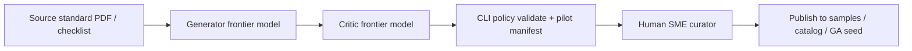

> **Scope:** Internal content roadmap and authoring playbook for curated policy packs — prioritized backlog, LLM-assisted drafting pipeline, and human curation gates; not buyer certification or legal advice.

> **Spine doc:** [`START_HERE.md`](../START_HERE.md).

# Policy pack content backlog and authoring playbook

**Audience:** Product, GTM, and engineers extending ArchLucid governance corpora without shipping new binaries.

**Canonical GA bundles:** [`DEFAULT_POLICY_PACKS_V1.md`](../go-to-market/DEFAULT_POLICY_PACKS_V1.md) · **Sample JSON:** [`docs/samples/policy-packs/`](../samples/policy-packs/) · **Validate locally:** `dotnet run --project ArchLucid.Cli -- policy validate <path>`

---

## 1. Why policy packs are the strategic lever

Policy packs are the **adaptive brain** of ArchLucid governance: versioned JSON (or YAML converted to JSON) that supplies **compliance rule keys**, **alert rules**, and **advisory defaults**. The core evaluation engine stays stable; domain knowledge (frameworks, cloud baselines, sector regulations) ships as **content**.

| Benefit | Mechanism |
|---------|-----------|
| **Technology agility** | New standards ship as pack revisions, not platform releases. |
| **Hierarchical governance** | Tenant / workspace / project assignments merge via **`PolicyPackResolver`**. |
| **Fast time-to-value** | Curated packs accelerate pilots (see bundled defaults in **`DEFAULT_POLICY_PACKS_V1.md`**). |

**Effort profile:** Authoring is **content work**, not compiler work. A domain expert plus JSON curation is typically **hours to a few days per pack** once the schema and evidence hints are understood — not multi-sprint engineering. The bottleneck is **correct framework mapping and severity calibration**, not C# or UI changes.

---

## 2. Recommended authoring pipeline (LLM + critic + human)

Use a **three-stage** pipeline so throughput scales without sacrificing audit defensibility.



### Stage A — Generator (draft pack)

**Inputs:**

- Target framework or buyer narrative (e.g. SOC 2 TSC, CIS Azure Foundations, GDPR Articles 32/35 themes).
- ArchLucid **curated-rules** shape: see [`ai-governance-responsible-ai-rules-v1.json`](../samples/policy-packs/ai-governance-responsible-ai-rules-v1.json) (`schemaVersion`, `kind`, `pack`, `rules[]` with `id`, `title`, `description`, `severity`, `remediationGuidance`, `evidenceHints`, `frameworkMappings`).
- Manifest field vocabulary from appendices: [`POLICY_PACK_APPENDIX_AI_GOVERNANCE_V1.md`](POLICY_PACK_APPENDIX_AI_GOVERNANCE_V1.md), [`POLICY_PACK_APPENDIX_SECURITY_BASELINE_V1.md`](POLICY_PACK_APPENDIX_SECURITY_BASELINE_V1.md).

**Generator prompt pattern (paraphrase for your model):**

> Map the top N architectural controls from [STANDARD] into an ArchLucid curated policy pack JSON. Each rule must cite plausible `evidenceHints` (manifest paths such as `governance.PolicyConstraints`, `services[].RequiredControls`, `datastores`, `relationships`). Write actionable `remediationGuidance` for architects updating the golden manifest. Include `frameworkMappings` as **informative thematic mapping only** — not legal attestation. Target 15–30 rules unless the standard is narrow.

**Output:** Draft `*-rules-v1.json` under `docs/samples/policy-packs/`.

### Stage B — Critic (red team, preferably different model)

**Critic prompt pattern:**

> You are a skeptical compliance architect. Review this pack against [STANDARD]. Flag: vague rules, wrong severities, `evidenceHints` that do not exist in ArchLucid manifests, missing critical controls, over-claiming certification language, and rules that cannot be evaluated from architecture evidence (only runtime pen-test). Return a numbered fix list; do not rewrite the whole file unless asked.

**Gate:** All **Critical** critic findings resolved before human review.

### Stage C — Human curator (sign-off)

Human SME responsibilities (cannot be delegated to LLMs):

- Calibrate **severity** to organizational risk appetite.
- Confirm **buyer-safe disclaimers** (same posture as **`DEFAULT_POLICY_PACKS_V1.md` §3**).
- Run **`policy validate`** and a **pilot manifest** that should trigger representative findings.
- Decide **GA bundle vs sample-only vs catalog** promotion path.

### Stage D — Mechanical validation

```bash
dotnet run --project ArchLucid.Cli/ArchLucid.Cli.csproj -- policy validate docs/samples/policy-packs/<pack>-rules-v1.json
```

Optional: import sample via **`POST /v1/policy-packs`**, assign scope, dry-run with **`POST /v1/governance/policy-packs/dry-run`** (see [`docs/samples/policy-packs/README.md`](../samples/policy-packs/README.md)).

**Security / hygiene:** Do not paste customer manifests or secrets into external LLM APIs; use synthetic pilot workspaces and public framework text only.

---

## 3. Prioritized backlog — next 20 curated packs

Ordered by **commercial unblock**, **assessment gaps**, and **Azure-first** alignment. **Status** reflects repo state as of 2026-05-18.

| Rank | Pack name | Primary buyer / use case | Target milestone | Suggested artifact path | Status |
|------|-----------|------------------------|------------------|-------------------------|--------|
| 1 | **Azure CAF / Landing Zone** | Enterprise Azure platform teams; unblocks LZ vending narrative | **V1.1** | `docs/samples/policy-packs/azure-caf-landing-zone-rules-v1.json` | Planned — explicit deferral in **`DEFAULT_POLICY_PACKS_V1.md` §2** |
| 2 | **GDPR compliance baseline** | EU + global privacy programs | V1.1 | `docs/samples/policy-packs/gdpr-baseline-rules-v1.json` | Planned — assessment improvement **#20** |
| 3 | **SOC 2 Type II (TSC architecture themes)** | Mid-market selling to enterprises | V1.1 | `docs/samples/policy-packs/soc2-tsc-architecture-rules-v1.json` | Partial — metadata sample exists (`soc2-compliance-baseline.json`); curated-rules corpus TBD |
| 4 | **FinOps & cloud cost optimization** | CFO / FinOps sponsors | V1.1 | Extend `cost-optimization-rules-v1.json` | Partial — sample exists; expand curated-rules parity |
| 5 | **OWASP API Security Top 10** | Application / API architecture reviews | V1.1 | `docs/samples/policy-packs/owasp-api-top10-rules-v1.json` | Planned |
| 6 | **ISO/IEC 27001 ISMS (architecture slice)** | Global security management | V1.1 | `docs/samples/policy-packs/iso27001-architecture-rules-v1.json` | Planned |
| 7 | **CIS Microsoft Azure Foundations Benchmark** | Security architects hardening Azure | V1.1 | `docs/samples/policy-packs/cis-azure-foundations-rules-v1.json` | Planned |
| 8 | **HIPAA / HITECH safeguards** | Healthcare vertical | V1.1+ | `docs/samples/policy-packs/hipaa-architecture-rules-v1.json` | Planned |
| 9 | **PCI-DSS (architecture / segmentation)** | Fintech / payments | V1.1+ | `docs/samples/policy-packs/pci-dss-architecture-rules-v1.json` | Planned |
| 10 | **Zero Trust Architecture (ZTA)** | Board-level security modernization | V1.1 | `docs/samples/policy-packs/zero-trust-architecture-rules-v1.json` | Planned |
| 11 | **Azure resiliency & disaster recovery** | Mission-critical workloads | V1.1 | `docs/samples/policy-packs/azure-resiliency-dr-rules-v1.json` | Planned |
| 12 | **AKS production baseline** | Container platform teams | V1.1 | `docs/samples/policy-packs/aks-production-baseline-rules-v1.json` | Planned |
| 13 | **Data classification & lineage** | Regulated data governance | V1.1 | `docs/samples/policy-packs/data-classification-lineage-rules-v1.json` | Planned |
| 14 | **Entra ID / IAM architecture baseline** | Identity-centric security | V1.1 | `docs/samples/policy-packs/entra-iam-baseline-rules-v1.json` | Planned |
| 15 | **Serverless & PaaS security (Functions / ACA / App Service)** | Modern Azure PaaS adopters | V1.1 | `docs/samples/policy-packs/azure-paas-security-rules-v1.json` | Planned |
| 16 | **NIST Cybersecurity Framework 2.0** | US public sector + enterprise mapping | V1.1+ | `docs/samples/policy-packs/nist-csf-2-architecture-rules-v1.json` | Planned |
| 17 | **Software supply chain & SBOM** | DevSecOps / SLSA-oriented buyers | V1.1+ | `docs/samples/policy-packs/supply-chain-sbom-rules-v1.json` | Planned |
| 18 | **DORA / DevSecOps delivery posture** | Engineering excellence sponsors | V1.1+ | `docs/samples/policy-packs/dora-devsecops-rules-v1.json` | Planned |
| 19 | **Observability & OpenTelemetry baseline** | SRE / platform engineering | V1.1 | `docs/samples/policy-packs/observability-otel-rules-v1.json` | Planned |
| 20 | **Azure SQL / Cosmos DB data-layer security** | Data platform architects | V1.1 | `docs/samples/policy-packs/azure-data-layer-security-rules-v1.json` | Planned |

### Already shipped (not in backlog queue)

| Pack | Role | Location |
|------|------|----------|
| **AI Governance / Responsible AI** | V1 GA bundled default | [`ai-governance-responsible-ai-rules-v1.json`](../samples/policy-packs/ai-governance-responsible-ai-rules-v1.json) |
| **Security Architecture Baseline** | V1 GA bundled default | [`security-architecture-baseline-rules-v1.json`](../samples/policy-packs/security-architecture-baseline-rules-v1.json) |
| **Azure Well-Architected Framework (sample)** | Curated sample (12 rules); not a third GA bundle | [`azure-waf-rules-v1.json`](../samples/policy-packs/azure-waf-rules-v1.json) |

---

## 4. Promotion paths (sample → catalog → GA seed)

| Path | When to use | Owner touchpoints |
|------|-------------|-------------------|
| **Sample only** | Pilot / demo / assessment deliverable | `docs/samples/policy-packs/` + README |
| **Policy Pack Hub / catalog** | Repeatable import across tenants | `POST /v1/policy-packs/catalog` promotion flows (see API contracts) |
| **GA bundled default** | Every net-new tenant seed | `IDefaultPolicyPackSeeder` — requires product + GTM sign-off per **`DEFAULT_POLICY_PACKS_V1.md`** |

Do **not** market CAF/LZ **bundled GA** coverage until rank **#1** ships with appendix + pilot validation (**GTM M-30**).

---

## 5. Operational considerations

| Dimension | Guidance |
|-----------|----------|
| **Security** | Packs are tenant-scoped content; never imply cross-tenant rule sharing. See **`DEFAULT_POLICY_PACKS_V1.md` §5**. |
| **Scalability** | Prefer **15–30 rules** per pack for reviewer comprehension; split mega-frameworks into pillar-specific packs if needed. |
| **Reliability** | Validate JSON via CLI before merge; add integration tests when a pack becomes GA seed. |
| **Cost** | LLM drafting is cheap vs engineering; budget human SME time for severity/disclaimer review. |

---

## 6. Related links

| Doc | Purpose |
|-----|---------|
| [`DEFAULT_POLICY_PACKS_V1.md`](../go-to-market/DEFAULT_POLICY_PACKS_V1.md) | What ships at GA |
| [`GTM_BACKLOG.md`](../go-to-market/GTM_BACKLOG.md) | Marketing tasks blocked on pack content (**M-30** CAF) |
| [`docs/assessments/LATEST.md`](../assessments/LATEST.md) | Readiness improvements **#13** (WAF), **#20** (GDPR) |
| [`templates/policy-packs/`](../templates/policy-packs/) | Vertical templates and import request bodies |
