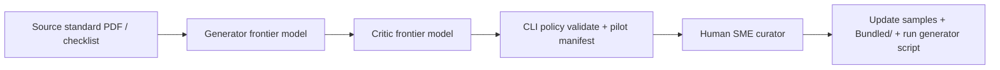

> **Scope:** Internal content roadmap and authoring playbook for curated policy packs — prioritized backlog, LLM-assisted drafting pipeline, and human curation gates; not buyer certification or legal advice.

> **Spine doc:** [`START_HERE.md`](../START_HERE.md).

# Policy pack content backlog and authoring playbook

**Audience:** Product, GTM, and engineers extending ArchLucid governance corpora without shipping new binaries.

**Canonical GA bundles:** [`DEFAULT_POLICY_PACKS_V1.md`](../go-to-market/DEFAULT_POLICY_PACKS_V1.md) (**23** seeded packs) · **Regenerate:** `python scripts/generate_v1_bundled_policy_packs.py` · **Validate:** `dotnet run --project ArchLucid.Cli -- policy validate <path>`

---

## 1. Why policy packs are the strategic lever

Policy packs are the **adaptive brain** of ArchLucid governance: versioned JSON that supplies **compliance rule keys**, **alert rules**, and **advisory defaults**. The core evaluation engine stays stable; domain knowledge ships as **content**.

| Benefit | Mechanism |
|---------|-----------|
| **Technology agility** | New standards ship as pack revisions, not platform releases. |
| **Hierarchical governance** | Tenant / workspace / project assignments merge via **`PolicyPackResolver`**. |
| **Fast time-to-value** | **23** curated packs seed on every net-new tenant. |

**Effort profile:** Authoring is **content work**. Use the LLM pipeline below; deepen rule narratives over time without recompiling the product.

**Rule sizing and priorities:** There is **no fixed rule count per pack**. Each corpus should reflect its source standard (CIS, SOC 2, HIPAA, etc.). Use **`priority`** (`P0` / `P1` / `P2`) on each rule and **`priorityFloor`** in pack `advisoryDefaults` so pilots can start with must-have coverage only. Canonical assumptions: **[`POLICY_PACK_RULE_PRIORITY_MODEL.md`](POLICY_PACK_RULE_PRIORITY_MODEL.md)**.

---

## 2. Recommended authoring pipeline (LLM + critic + human)

**Generator / critic prompts:** see prior revision of this doc (unchanged pattern).

**Mechanical steps after human sign-off:**

1. Edit or add `docs/samples/policy-packs/<slug>-rules-v1.json` and `<slug>.json`.
2. Run **`python scripts/generate_v1_bundled_policy_packs.py`** (syncs `Bundled/`, manifest, GA compliance stubs).
3. Add `<slug>.json` to **`bundled-policy-packs-v1.manifest.json`** if introducing a **new** bundle file name.

---

## 3. Prioritized commercial backlog — status (2026-05-18)

All **top-20** commercial packs plus **AI Governance** and **Security baseline** ship as **V1 GA `PlatformDefault`** seeds. Rule counts vary by framework (6–30 keys today; **no cap** — see priority model). Newer packs use starter templates until the LLM pipeline replaces them with full framework depth.

| Rank | Pack name | V1 GA status |
|------|-----------|--------------|
| 1 | Azure CAF / Landing Zone | **Shipped** |
| 2 | GDPR compliance baseline | **Shipped** |
| 3 | SOC 2 Type II (TSC architecture themes) | **Shipped** |
| 4 | FinOps & cloud cost optimization | **Shipped** |
| 5 | OWASP API Security Top 10 | **Shipped** |
| 6 | ISO/IEC 27001 ISMS (architecture slice) | **Shipped** |
| 7 | CIS Microsoft Azure Foundations Benchmark | **Shipped** |
| 8 | HIPAA / HITECH safeguards | **Shipped** |
| 9 | PCI-DSS (architecture / segmentation) | **Shipped** |
| 10 | Zero Trust Architecture | **Shipped** |
| 11 | Azure resiliency & disaster recovery | **Shipped** |
| 12 | AKS production baseline | **Shipped** |
| 13 | Data classification & lineage | **Shipped** |
| 14 | Entra ID / IAM architecture baseline | **Shipped** |
| 15 | Serverless & PaaS security (Azure) | **Shipped** |
| 16 | NIST Cybersecurity Framework 2.0 | **Shipped** |
| 17 | Software supply chain & SBOM | **Shipped** |
| 18 | DORA / DevSecOps delivery posture | **Shipped** |
| 19 | Observability & OpenTelemetry baseline | **Shipped** |
| 20 | Azure SQL / Cosmos DB data-layer security | **Shipped** |
| — | AI Governance / Responsible AI (core) | **Shipped** |
| — | Security Architecture Baseline (core) | **Shipped** |
| — | Azure Well-Architected Framework | **Shipped** |

**Next content work (not new GA bundles):** expand rule counts to match each standard, tag **`priority`** tiers, deepen narratives via LLM → critic → human review, and add framework appendices — without expanding the seeded bundle count unless product adds a 24th manifest entry.

---

## 4. Promotion paths

| Path | When to use |
|------|-------------|
| **V1 GA bundled default** | Listed in **`bundled-policy-packs-v1.manifest.json`** — auto-seeded on tenant provision |
| **Sample / pilot only** | JSON under `docs/samples/` but **not** in manifest — manual import |
| **Catalog / Hub** | Cross-tenant promotion after GA corpus stabilizes |

---

## 5. Related links

| Doc | Purpose |
|-----|---------|
| [`DEFAULT_POLICY_PACKS_V1.md`](../go-to-market/DEFAULT_POLICY_PACKS_V1.md) | Buyer-facing GA list |
| [`docs/samples/policy-packs/README.md`](../samples/policy-packs/README.md) | Import and validate |
| [`V1_DEFERRED.md`](V1_DEFERRED.md) §6j | Governance deferrals (certification depth only) |
| [`POLICY_PACK_RULE_PRIORITY_MODEL.md`](POLICY_PACK_RULE_PRIORITY_MODEL.md) | P0/P1/P2 tiers and `priorityFloor` |
