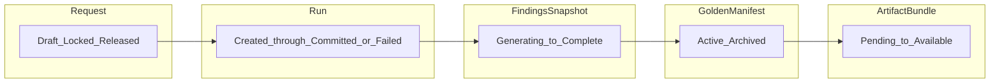

# ArchLucid backend state machines

This document is the authoritative reference for lifecycle states on core authority entities. It aligns with migrations **127** (constraints and lifecycle columns) and **128** (`RetryCount` / `LastFailureReason` on runs).

## Objective

Make illegal combinations (e.g. committed run without manifest, finalization against a still-generating findings snapshot) **rejectable at the database layer** and **documented for API/UX**.

## Assumptions

- One golden manifest per active run (`UQ_GoldenManifests_RunId_Active`).
- Findings are sealed in a `FindingsSnapshot` before commit; human review is orthogonal to snapshot generation status.
- Artifact bundles may be optional for commit; when present, their status is tracked.

## Constraints

- Historical migrations **001–028** are immutable per project policy; additive changes use **127+** only.
- `LegacyRunStatus` remains the string store for `ArchitectureRunStatus` (including **`Retrying`**).

---

## 1. Request (`ArchitectureRequest` / `dbo.ArchitectureRequests`)

**Contract enum:** `ArchLucid.Contracts.Common.RequestStatus`

| State     | Meaning                                                |
| --------- | ------------------------------------------------------ |
| `Draft`   | Created/imported; not yet tied to an in-flight run    |
| `Locked`  | At least one run for this request is non-terminal     |
| `Released`| All runs for this request are terminal (`Committed` / `Failed`) |

**Transitions (conceptual):** `Draft` → `Locked` → `Released` → `Locked` (new run).  
**Audit (when wired):** `Request.Created`, `Request.Locked`, `Request.Released`.

Implementation note: persistence may add `RequestStatus` later; the enum is the **canonical vocabulary** for orchestrators and future migrations.

---

## 2. Run (`dbo.Runs`, `ArchitectureRunStatus`)

**Enum:** `ArchLucid.Contracts.Common.ArchitectureRunStatus`

Ordered flow:

`Created` → `TasksGenerated` → `WaitingForResults` → `ReadyForCommit` → `Committed`  
(or `TasksGenerated` → `Committed` legacy path)

**Terminal:** `Committed`, `Failed`.  
**User retry:** `Failed` → `Retrying` → `TasksGenerated`.

**Checks (DB, migration 127):**

- `LegacyRunStatus` in known set (including `Retrying`).
- `Committed` ⇒ `GoldenManifestId` not null; `CompletedUtc` set.
- `Failed` ⇒ `GoldenManifestId` null; `ArtifactBundleId` null (after backfill).

**Audit:** `AuditEventTypes.Run.*`, `Run.RetryRequested`, `RunLegacyReadyForCommitPromoted`.

---

## 3. Manifest (`dbo.GoldenManifests`)

**Lifecycle column:** `LifecycleStatus` (`Active` | `Superseded` | `Archived`), default `Active` on insert.

| State         | Meaning                                      |
| ------------- | -------------------------------------------- |
| `Active`      | Current committed manifest for its run      |
| `Superseded`  | Replaced by policy (e.g. newer run)         |
| `Archived`    | Soft-deleted (`ArchivedUtc` set)            |

**Audit (when promoted/superseded):** `ManifestSuperseded`, `ManifestArchived`; finalize continues to emit `ManifestFinalized`.

---

## 4. Findings snapshot (`dbo.FindingsSnapshots`)

**Generation enum:** `ArchLucid.Contracts.Findings.FindingsSnapshotGenerationStatus`

| State               | Meaning                                      |
| ------------------- | -------------------------------------------- |
| `Generating`        | Snapshot not yet sealed for commit           |
| `Complete`          | All engines succeeded (or default legacy)  |
| `PartiallyComplete` | Some engine failures; some findings present |
| `Failed`            | No usable snapshot (if used)                 |

**Finalization rule:** `ManifestFinalizationService` rejects finalization when generation is `Generating` or `Failed`.

Per-finding **human** review remains `FindingHumanReviewStatus` (`NotRequired`, `Pending`, `Approved`, `Rejected`, `Overridden`).

**FindingRecords checks:** reviewed states require `ReviewedByUserId` and `ReviewedAtUtc`.

**Audit:** `FindingsSnapshotSealed`, finding review events (constants in `AuditEventTypes`).

---

## 5. Artifact bundle (`dbo.ArtifactBundles`, `ArtifactBundleArtifacts`)

**Bundle enum:** `ArchLucid.ArtifactSynthesis.Models.ArtifactBundleStatus`  
**Per-artifact enum:** `SynthesizedArtifactGenerationStatus`

Bundle: `Pending`, `Available`, `Partial`, `Failed`, `Archived`.  
Default for new rows: `Available` (legacy bundles backfilled).

Per-artifact: `Pending`, `Generated`, `Failed`; default `Generated`.

**Audit:** `ArtifactsGenerated`, `ArtifactSynthesisFailed`, `ArtifactSynthesisPartial`.

---

## Invalid combinations (review)

| Scenario                                      | Mitigation                                      |
| --------------------------------------------- | ----------------------------------------------- |
| Run committed, no manifest                    | `CK_Runs_CommittedHasManifest`                  |
| Manifest finalized while snapshot generating | App guard + `GenerationStatus` not `Generating` |
| Artifact on failed run                        | `CK_Runs_FailedNoArtifact` + clear on fail      |
| Request edit while run in flight              | `RequestStatus.Locked` (when column exists)     |
| Finalize twice                                | `sp_FinalizeManifest` idempotency + rowversion  |
| Retry failed run                              | `Retrying` + migration 128 counters              |
| Partial artifact generation                   | `ArtifactBundleStatus.Partial` + audit           |

---

## Data flow (high level)

## Security

State transitions that mutate authority data must stay **scope-scoped** (tenant/workspace/project) and **audited** where the event type already exists or is added in `AuditEventTypes`.

## Operations

Apply migrations **127** and **128** in order; then deploy application code that sets `FindingsSnapshot.GenerationStatus`, `ArtifactBundle.Status`, and manifest `LifecycleStatus` on write paths.
