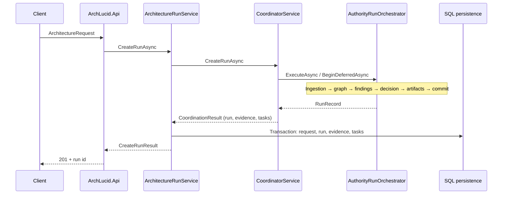
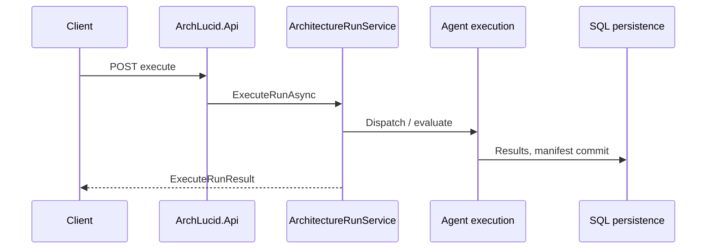
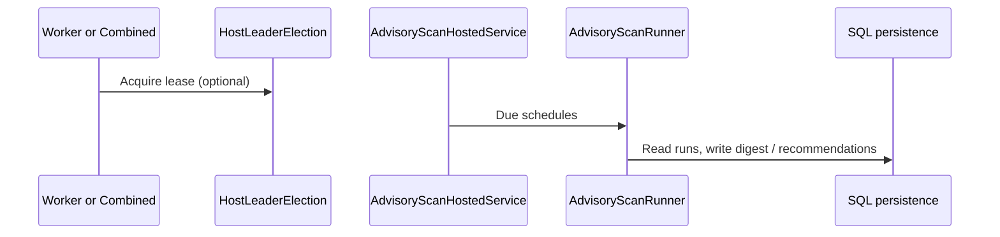

> **Scope:** Contributor-reference — ArchLucid system map - full detail, tables, and links in the sections below.

> **Spine doc:** [`START_HERE.md`](../START_HERE.md).

# ArchLucid system map

**Canonical poster:** [ARCHITECTURE_ON_ONE_PAGE.md](../ARCHITECTURE_ON_ONE_PAGE.md) · **Operator atlas:** [OPERATOR_ATLAS.md](OPERATOR_ATLAS.md)

High-level flows for navigation and onboarding. For component detail see [ARCHITECTURE_COMPONENTS.md](./ARCHITECTURE_COMPONENTS.md) and [ARCHITECTURE_FLOWS.md](./ARCHITECTURE_FLOWS.md).

---

## Primary HTTP flows

### Create architecture run (`POST /v1/architecture/runs` and related)

### Execute run (agent tasks → commit)

### Advisory scan (worker / combined host)

---

## Composition root entry points

| Host | File | Responsibility |
|------|------|----------------|
| API | `ArchLucid.Api/Program.cs` | HTTP pipeline, config validation, `AddArchLucidApplicationServices` |
| Worker | `ArchLucid.Worker/Program.cs` | Background loops, health, shared DI |
| DI assembly | `ArchLucid.Host.Composition/Startup/ServiceCollectionExtensions*.cs` (+ `Configuration/ArchLucidStorageServiceCollectionExtensions.cs`) | Partial classes: storage, agents, scheduling, alerts, pipeline, coordinator |

---

## Feature flags (Microsoft.FeatureManagement)

Section `FeatureManagement:FeatureFlags` in configuration. Used for gradual rollout of authority pipeline behavior. See `AuthorityPipeline:QueueContextAndGraph` and related options under `ArchLucid:AuthorityPipeline`.

---

## Observability artifacts

- **Traces**: `ArchLucidInstrumentation` activity sources (including `ArchLucid.AuthorityRun` and per-stage child activities).
- **Metrics**: OpenTelemetry meter **`ArchLucid`** (`ArchLucidInstrumentation.MeterName`); Prometheus scrape path under `Observability:Prometheus`. (Exported **metric series names** for queue depth and LLM usage use an `archlucid_*` prefix — see `infra/prometheus/`.)
- **LLM token dimensions (TB-015 Phase A)**: `LlmAccountingInvocationScope` (`AsyncLocal`) tags completion accounting with `consume_role` + `invoke_kind`; histogram **`archlucid.llm.completion_tokens`**.
- **Dashboards / alerts**: `infra/grafana/` and `infra/prometheus/` (reference JSON and rule files for operators).

---

## Context ingestion (TB-008 Phases 3–4)

| Component | Location | Role |
|-----------|----------|------|
| **`IConnectorDeltaComputer`** | `ArchLucid.ContextIngestion/Delta/` | Set-diff on `SourceId` replaces literal-string deltas (shared default + per-connector overrides via `ConnectorDeltaAsyncHelper`). |
| **`CompositeCanonicalEnricher`** | `ArchLucid.ContextIngestion/Canonicalization/` | Routes per-`ObjectType` enrichers (`TopologyResourceCanonicalEnricher`, `SecurityBaselineCanonicalEnricher`, …). |
| **`IPolicyTopologyOverlapResolver`** | `ArchLucid.ContextIngestion/Topology/` | Shared stable-ID overlap logic consumed by policy + topology stages (no duplicated normalizer rules). |

See [CONTEXT_INGESTION.md](./CONTEXT_INGESTION.md) for pipeline ordering and connector matrix.
