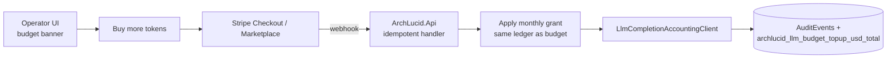

> **Scope:** Engineering-owned technical backlog items deferred from current sessions; audience is contributors and the AI assistant; not a buyer or operator document. Not a substitute for ADRs or the pending-questions owner decisions file.

# Tech backlog

Items here are **greenlit in principle** — the decision has been made and context is captured — but deferred for a future session rather than the current one. Pick any item up by searching the codebase for the files listed and applying the recorded approach.

**Priority order:** Items are listed highest → lowest priority. When picking up work, start at the top. Re-sort when new items are added: items that affect customer-visible correctness rank above ops/observability improvements, which rank above developer-experience polish.

**Recently shipped (IDs kept for grep, ADRs, and code comments — spec text removed below):** **TB-001** (informational async audit best-effort + counter), **TB-002** (`archlucid_startup_config_warnings_total`), **TB-003** (named-query p95 allowlist + `archlucid_query_p95_ms`), **TB-006** (`ComparisonRecords` run id GUID + FK migration).

| ID | Title | Priority driver | Size |
|----|-------|----------------|------|
| TB-009 | Architecture invariant program — doc + ADR 0035 finalize | Engineering governance — single catalog IDs `INV-*`, proposed ADR acceptance, links from index / Cursor rule | Done (doc land 2026-05-09) |
| TB-010 | Architecture invariant enforcement — Wave A (INV-001 done, INV-005, INV-006) | Multi-tenant + prod boot safety — **INV-001 shipped 2026-05-09**; remaining: startup validator parity + composition-root scan | S (remainder) |
| TB-011 | Architecture invariant enforcement — Wave B (INV-002, INV-004, INV-012, INV-013) | Honesty + economics — persisted execution mode, durable budget coherence, single quality-gate truth, replay scope isolation | L |
| TB-012 | Architecture invariant enforcement — Wave C (INV-007–INV-011, INV-014–INV-015) | Contributor hygiene — time/cancellation/idempotency/HTTP/analyzer pack + webhook ordering + INV-003 path markers | L |
| TB-004 | Wire OTel exporters + verify agent-output metrics; add Azure alerts | Ops / release bar — conservative quality posture needs visible trends (`archlucid_agent_output_*`) | ~1–2 h |
| TB-005 | AI-assisted owner pen-test support (Cursor agent) | Security / V1 assurance — structured help for 2026-Q2 owner exercise | Ongoing (time-boxed sessions) |
| TB-007 | LLM correctness boundary — cohort gate promotion + eval real-mode scenarios | Correctness posture — gated real-model CI blocked on prereqs (Gap A+C open) | A: ~1 h ops; C: ~4 h eng |
| TB-008 | Context ingestion connectors — Phases 3–4 (meaningful delta + enrichers, policy/topology coupling) | Architecture maintainability — Phases 1–2 shipped | L |
| TB-013 | Documentation library audience split — Phases 2–3 (customer-facing vs contributor-reference) | Developer experience — lower onboarding cognitive load without breaking bookmarks or procurement/UI doc paths | M |
| TB-014 | LLM monthly budget top-up — **`PurchasedCapBumpUsd`** column + effective cap (manual SQL / test hook today); Stripe SKU + webhook + UI TBD | Self-service headroom before UTC month roll | M |
| TB-015 | Per-agent/per-invoke-kind LLM token dimensions + CI export of real-mode averages | FinOps honesty — truthful Topology/Cost/Compliance/Critic token envelopes for `cost-preview` + cohort budgeting (no guesses) | M |
| TB-016 | ITSM + chat vendor sandbox accounts — provision, secrets, inbound webhooks — for recurring live smoke | Trust / interoperability — mocks are not proofs; gated CI + CONNECTOR_READINESS_MATRIX need operator-owned URLs + tokens | S–M |
| TB-017 | Trial orphaned-catalog teardown SOP + only then tighten unattended `Trial:Lifecycle` purge | Hosted COGS — idle dormant trials burn negligible AOAI; manual Azure SQL/catalog drop suffices at low cardinality (`TRIAL_AND_SIGNUP` §4, `TRIAL_LIFECYCLE`) | S |
| TB-018 | Warm tenant catalogs in elastic pool — replenish + fast claim (`RunTenant`-skip path) | Signup SLA — elastic pool amortizes DDL; standby empties shorten hot path (`TENANT_DATABASE_TOPOLOGY` Operational notes warm catalogs) | M |
| TB-019 | Signup marketing attribution + server-side conversion (UTM survive funnel → provision success → telemetry/SQL) | Paid + organic honesty — **`SEO_AND_PAID_ACQUISITION.md`** data flow requires measurable **`TenantProvisioningService`** outcomes; avoids raw-UTM metric cardinality explosions | M |
| TB-020 | Public marketing SEO — `SoftwareApplication` + trust `FAQPage` JSON-LD; consent-gated Clarity (`NEXT_PUBLIC_ARCHLUCID_CLARITY_PROJECT_ID`); CSP (`clarity.ms`, `c.bing.com`); privacy §2.4 — DPIA / server kill-switch mirror optional | SERP + honest analytics posture | S–M |

---

## TB-009 — Architecture invariant catalog + ADR 0035

**Status:** **Documentation landed** (2026-05-09) — [`docs/library/ARCHITECTURE_INVARIANTS.md`](ARCHITECTURE_INVARIANTS.md) (IDs `INV-001`–`INV-015`), authoring skeleton [`docs/architecture/adr/adr-template-full.md`](../architecture/adr/adr-template-full.md), governance ADR **`docs/architecture/adr/0035-architecture-invariant-catalog.md`** (**Status: Proposed** — flip to Accepted when owner reviews).

**What remains:**

1. Owner moves **ADR 0035** → **Accepted** after skimming invariant list + confirming no conflict with **TB-001** audit posture (especially **INV-003**).
2. Pick up **TB-010** → **TB-012** in order unless a security incident reprioritizes **INV-015**.

**Refs:** Cursor rule `.cursor/rules/Architecture-Invariants.mdc` (points agents at the catalog).

---

## TB-010 — Invariant Wave A — tenant boundary + fail-closed boot + composition root

**Status (2026-05-09):** INV-001 (tenant identity boundary Roslyn analyzer ARCH001) **shipped** — see assessment Improvement 3. Remaining: INV-005 startup-validator catalog parity and INV-006 composition-root architecture test — see assessment Improvement 13.

**Covers:** **INV-001**, **INV-005**, **INV-006**.

**Objective:** Eliminate ambiguous tenant derivation below the HTTP boundary and fail fast when production-like hosts violate auth/secret/disposition rules; constrain DI extensions to **`ArchLucid.Host.Composition`** (allow-listed exceptions only).

**Enforcement sketches:** Roslyn analyzer / architecture tests (`NetArchTest` or equivalent patterns already in-repo), **`StartupValidatorTests`** extensions, documented allow-list path for **`IServiceCollection`** extensions used by tests.

**Out of scope for this wave:** execution-mode persistence (**TB-011**), webhook middleware (**INV-015** → **TB-012**).

---

## TB-011 — Invariant Wave B — execution mode, budgets, single quality-gate outcome, replay isolation

**Covers:** **INV-002**, **INV-004**, **INV-012**, **INV-013**.

**Objective:** Persist honest execution labelling across API + DB + traces; reconcile LLM budgets across replicas; persist one quality-gate verdict per persisted run revision for downstream consumers; ensure replay artefacts do not mutate original evidence namespaces.

**Enforcement sketches:** DbUp → master DDL as per repo SQL rules; OpenAPI snapshot + codegen per **[`docs/library/API_CONTRACTS.md`](API_CONTRACTS.md)** if DTO shape changes.

**Depends on:** product agreement on **`Mixed`** UX copy (INV-002) before UI ships.

---

## TB-012 — Invariant Wave C — hygiene pack (clock, cancellation, idempotency, HTTP, repos, webhook order)

**Covers:** **INV-007**–**INV-011**, **INV-014**, **INV-015** plus **INV-003** transactional vs informational markings.

**Objective:** Analyzer-first gates with low behavioural risk; ordered inbound webhook pipeline before handler bodies; forbid mutable static state in **`Application`** / **`AgentRuntime`**.

**Note:** **INV-003** must respect **TB-001** informational-audit semantics unless a superseding backlog item merges.

---

## TB-004 — Wire OTel exporters + verify agent-output metrics; add Azure alerts

**Decision / context (2026-05-01):** Product stance for agent quality favors a **conservative** release bar; **`archlucid_agent_output_*`** histograms and **`archlucid_agent_output_quality_gate_total`** must reach a backend before **trend charts** or **email alerts** are possible. Code already emits metrics after successful execute; **`ObservabilityExtensions`** exports when App Insights connection string, OTLP endpoint, or Prometheus scrape is configured (`docs/library/OBSERVABILITY.md` § *Export path configuration*).

**What to do (checklist):**

0. **Offline verification (no Azure CLI):** `python scripts/report_observability_export_readiness.py --environment Production --out artifacts/observability-export-readiness.md` — see `docs/library/OBSERVABILITY.md` (values from process env are detected but never printed; use `--no-process-environment` for committed JSON only).

1. **Per environment (staging → production):** Set **at least one** of:
   - **`APPLICATIONINSIGHTS_CONNECTION_STRING`** (preferred on Azure), or **`ApplicationInsights:ConnectionString`**, or **`Observability:AzureMonitor:ApplicationInsightsConnectionString`** on the **API** host; or
   - Non-empty **`Observability:Otlp:Endpoint`** (+ **`Protocol`** / **`Headers`** as needed); or
   - **`Observability:Prometheus:Enabled`** with scrape auth credentials and a scraper pointing at **`/metrics`** (trusted network only).

2. **`ArchLucid.Worker`:** If running Worker in the same subscription, apply the **same** exporter settings so worker-originated telemetry is not orphaned.

3. **Smoke verification:** After deploy, run **one full execute**; in **Application Insights → Metrics** (or OTLP sink), confirm **`archlucid_agent_output_semantic_score`**, **`archlucid_agent_output_structural_completeness_ratio`**, and **`archlucid_agent_output_quality_gate_total`** appear (Azure may normalize names — search by meter / namespace).

4. **Alerts:** Create **Azure Monitor metric alerts** (or Grafana rules) + **Action group → email** — e.g. semantic **p10** over 24h below agreed floor, or elevated **`rejected`** rate on **`quality_gate_total`**. Product does not ship pre-built rules.

5. **Optional:** Deploy **`infra/terraform-otel-collector`** for tail sampling; lower **`Observability:Tracing:SamplingRatio`** affects **traces**, not the agent-output **metric** path — document any sampling choice for on-call.

**Reference docs:** `docs/library/AGENT_OUTPUT_EVALUATION.md` §9; `docs/quality/MANUAL_QA_CHECKLIST.md` §8.4.

**Size estimate:** ~1–2 h of ops / Terraform / portal work (no mandatory code change unless exporter wiring gaps are found).

---

## TB-005 — AI-assisted owner pen-test support (Cursor agent)

**Context (2026-05-01):** External third-party penetration testing is **V2**; **V1** relies on an **owner-conducted** exercise documented in [`docs/security/pen-test-summaries/2026-Q2-OWNER-CONDUCTED.md`](../security/pen-test-summaries/2026-Q2-OWNER-CONDUCTED.md), aligned with [`docs/security/PENTEST_EXTERNAL_UI_CHECKLIST.md`](../security/PENTEST_EXTERNAL_UI_CHECKLIST.md) and [`docs/security/SYSTEM_THREAT_MODEL.md`](../security/SYSTEM_THREAT_MODEL.md). Target window **~2026-06-15**, after repeatable builds, UI stability, and reliable Azure deploy — see also [`QUALITY_ASSESSMENT_2026_05_01_INDEPENDENT_68_20.md`](../archive/assessments/QUALITY_ASSESSMENT_2026_05_01_INDEPENDENT_68_20.md) § *Pending Questions*.

**Owner bar (recorded for assessments):** Remediate **material** findings before calling the engagement complete; **do not** refresh public posture until **Critical** and **High** are cleared; **track** all security issues in-repo (findings table + PR links).

**What the coding agent can do (pick up in chat):**

1. **Runbooks & coverage** — Expand checklist-driven sessions from the docs above so testing is repeatable (auth, RBAC, RLS, injection classes, IDOR, session / CSRF-relevant UI flows).
2. **Negative cases from code** — Given a route, controller, or policy class, propose **edge cases** (headers, roles, tenant scope, stale tokens) consistent with implementation.
3. **CI artefacts** — Help interpret **OWASP ZAP** and **Schemathesis** output; separate false positives vs likely issues; suggest tracker wording at **high level** (no public exploit recipes unless you explicitly want them in a non-public artefact).
4. **Tracker hygiene** — Structure findings rows (severity, summary, owner, PR, retest) for [`2026-Q2-OWNER-CONDUCTED.md`](../security/pen-test-summaries/2026-Q2-OWNER-CONDUCTED.md).
5. **Posture text** — When retests are green, draft **stub → final** narrative that matches what was run and fixed and stays consistent with [`docs/go-to-market/TRUST_CENTER.md`](../go-to-market/TRUST_CENTER.md).

**Explicit limits:** The agent does **not** autonomously attack **archlucid.net** or Azure; **you** run tools in your environments and supply redacted logs or behaviour descriptions. This backlog item is **not** a substitute for a **V2** third-party report.

**Size estimate:** Ongoing — budget **30–60 min sessions** per surface or CI failure cluster; close the item when the 2026-Q2 owner tracker is complete and posture text is updated.

---

## TB-007 — LLM correctness boundary: three remaining gaps after 2026-05-01 session

**Context:** The quality assessment sessions identified the LLM correctness boundary as the highest engineering risk. Three gaps were documented and partially addressed. The items below require either owner decisions or operational prerequisites before they can be closed.

### Gap A — Promote cohort-real-llm-gate to a required PR status check

**Status:** Blocked on owner task. The Azure OpenAI deployment (archlucid-golden-cohort in eastus) must be provisioned and the GitHub protected-Environment secret (ARCHLUCID_GOLDEN_COHORT_AZURE_OPENAI_KEY or federated identity) injected before the gate can be promoted. See docs/runbooks/GOLDEN_COHORT_REAL_LLM_GATE.md § 2 and § 6 for the one-line promotion change and the stop-and-ask boundary.

**What to do (once deployment exists):**
1. Inject secret into the protected Environment per PENDING_QUESTIONS.md Q15.
2. Add cohort-real-llm-gate to the required status checks in the main branch protection rule.
3. Open a separate PR (not the same as the deployment PR) for the promotion.

### Gap B — Enable EnforceOnReject after product decision

**Status (2026-05-08):** **Closed for production-like hosts.** **`ArchLucid.Api/appsettings.Staging.json`** and **`appsettings.Production.json`** set **`ArchLucid:AgentOutput:QualityGate`** to **`Mode: PilotStrict`**, **`EnforceOnReject: true`**, **`BlockRunOnReject: true`**. **`AgentOutputEvaluationRecorder`** throws **`AgentOutputQualityGateRejectedException`** on reject; **`ArchitectureRunExecuteOrchestrator`** catches it when both flags are true, marks **`LegacyRunStatus`** **`ExecutionCompletedQualityRejected`**, emits baseline audit **`RunQualityGateRejected`**, and rethrows (**HTTP 409** from API problem-details handling). **`appsettings.Development.json`** keeps **`EnforceOnReject` / `BlockRunOnReject`** **`false`** for local usability. Coverage: **`ArchitectureRunExecuteOrchestratorQualityGateBlockingTests`**, **`AgentOutputQualityGateStagingAppsettingsTests`** (effective options from committed Staging JSON).

**Follow-up (optional):** If a **`appsettings.SaaS.json`** (or tenant-specific) profile needs a different posture, duplicate or slice the Staging block explicitly rather than relying on base **`appsettings.json`** (which omits the section and uses CLR defaults).

### Gap C — Eval corpus has no real-mode scenarios

**Status:** All three scenarios in `tests/eval-corpus/` have "mode": "simulator" in their qualityEvidence block. The eval_agent_corpus.py CI script runs against simulator agent result fixtures. There are no CI-run checks that assert on real-model finding quality against expected keyword patterns.

**What to do:**
1. Add at least one eval-corpus scenario with "mode": "real" and expectedFindings keyword checks meaningful for real model output.
2. Wire a nightly or post-deploy job that runs eval_agent_corpus.py against the real-mode API (similar to the golden cohort gate).
3. Gate this on the same ARCHLUCID_GOLDEN_COHORT_REAL_LLM variable and budget probe as the cohort gate.

**Affected areas:** `tests/eval-corpus/`, `scripts/ci/eval_agent_corpus.py`, `.github/workflows/golden-cohort-nightly.yml`.

**Size estimate:** Gap A ~1 h (operational, no code). Gap B — closed (see Gap B status above). Gap C ~4 h (scenario authoring + workflow wiring).

---

## TB-008 — Context ingestion connectors: Phases 3–4 after typed stages + orchestrator

**Status:** Phase 1 **shipped** (2026-05-04). Phase 2 **shipped** (2026-05-05): `IConnectorDescriptor` + `ConnectorDescriptor`; `IConnectorPipelineOrchestrator` implemented by `DefaultConnectorPipelineOrchestrator` (parallel fetch+normalize via `Task.WhenAll`, sequential `DeltaAsync` + `DeltaSummary` segments in `PipelineOrder`); `ContextConnectorPipeline.CreateOrderedConnectorDescriptors` is canonical; `CreateOrderedContextConnectorPipeline` projects connectors only; `ContextIngestionService` delegates stages to the orchestrator. DI registers `IReadOnlyList<IConnectorDescriptor>` and `IConnectorPipelineOrchestrator` in `RegisterContextIngestionAndKnowledgeGraph`.

**Deferred work (pick up in order):**

1. **Phase 3 — Meaningful delta + typed enrichers** — Introduce `IConnectorDeltaComputer` (shared default + optional per-connector overrides). Replace literal-string deltas where useful (e.g. set-diff on `SourceId`). Split `CanonicalInfrastructureEnricher` into per-`ObjectType` enrichers behind a composite.

2. **Phase 4 — Cross-connector coupling** — Resolve `PolicyReferenceConnector` / topology stable-ID duplication via a shared resolver service consumed by policy + topology stages so overlap logic is not replicated.

Optional later: per-connector fault isolation during parallel fetch+normalize (warnings vs abort entire ingest).

**References:** `docs/library/SYSTEM_MAP.md` (ingestion host path); `ArchLucid.ContextIngestion/Infrastructure/ContextConnectorPipeline.cs`; `ArchLucid.ContextIngestion/Services/DefaultConnectorPipelineOrchestrator.cs`; `ArchLucid.ContextIngestion/Services/ContextIngestionService.cs`.

**Size estimate:** Phase 3 ~4–8 h (delta semantics + enricher split + regression). Phase 4 ~2–4 h (extract shared topology resolution + tests).

---

## TB-013 — Documentation library audience reorganisation (remaining phases)

**Status:** **Phase 1 shipped** — subtrees **`docs/library/customer-facing/`** and **`docs/library/contributor-reference/`** plus README indexes; persona recipes canonical at [`customer-facing/WORKFLOW_RECIPES_BY_PERSONA.md`](customer-facing/WORKFLOW_RECIPES_BY_PERSONA.md); bookmark stub [`WORKFLOW_RECIPES_BY_PERSONA.md`](WORKFLOW_RECIPES_BY_PERSONA.md) under **`docs/library/`**.

**Objective**

Separate buyer-visible cookbook markdown from contributor-heavy internals **without** orphaning bookmarks (stub plus redirect pattern), **`dist/procurement-pack`**, **`archlucid-ui`** doc paths, or CI link assertions.

**Assumptions**

- Canonical URLs cited in **`API_CONTRACTS`**, Stripe, and procurement tooling must stay stable **or** be batch-updated atomically.

**Constraints**

- Doc scope headers on **every new** Markdown under **`docs/`** (CI **`scripts/ci/check_doc_scope_header.py`**).
- Navigator link assertions (**`scripts/ci/assert_navigator_links_valid.py`**) stay green after each batch move.

---

### Phase 2 (planned)

Batch-move lightly cross-linked evaluator docs (**`CONCEPTS_IN_5_MINUTES`**, **`FAQ`**, pilot-adjacent scaffolds) using **temporary stubs** matching Phase 1.

**Prepare:** script-assisted link rewrite; optional **`grep`** gate in CI forbidding new **`library/`** root drops without audience tagging.

---

### Phase 3 (planned — guarded)

Migrate widely linked references (**`GOVERNANCE`**, **`SECURITY`** operator sections, **`API_CONTRACTS`** only if coordinated with codegen, procurement manifest, and contextual-help URLs):

1. Freeze window for OpenAPI or client-rule changes affecting doc URLs.
2. Regenerate **`doc-index.json`** and procurement paths.
3. Repository-wide hyperlink smoke.

---

### Security model

**`customer-facing/`** prose stays SMB and credential-light (no raw secrets; no infra break-glass that belongs only under **`runbooks/`**).

### Operational considerations

Default new **`library/`** root files to **`contributor-reference/`** unless the author marks buyer scope in the doc header; link from **`customer-facing/README.md`** when appropriate.

**Related:** [`DOCUMENTATION_BY_AUDIENCE.md`](DOCUMENTATION_BY_AUDIENCE.md).

**Size estimate:** Phase 2 ~2–6 h (script plus stubs plus CI green). Phase 3 ~1–2 days (freeze, batch rewire, smoke).

---

## TB-014 — LLM monthly budget top-up SKU

**Progress (2026-05-10):** Persistent bump column **`PurchasedCapBumpUsd`** on **`dbo.LlmMonthlyTenantBudgetState`** (migration **`155_LlmMonthlyTenantBudgetPurchasedCapBump.sql`**) + effective cap in **`LlmMonthlyTenantDollarBudgetTracker`**; runbook **[`LLM_BUDGET_TOP_UP.md`](LLM_BUDGET_TOP_UP.md)**; test hook **`InMemoryLlmTenantBudgetRepository.ApplyMonthlyPurchasedCapBumpAsync`**. **Remaining:** Stripe SKU, idempotent purchase webhook, operator UI surfacing, audit event names.

**Decision (operator, 2026-05-11):** **Greenlit in principle.** There is **no** target cost-per-run budget — runs are bounded by **`LlmMonthlyTenantDollarBudget`** + **`LlmTokenQuota`**, not by a per-run prompt-design ceiling. Tenants who legitimately exhaust their **`HardCutoffUsdPerUtcMonth`** before the UTC month rolls should be able to **buy more tokens** (or more dollars of estimated LLM spend) self-serve, rather than waiting or contacting sales.

**Why it's not in the current session:** Requires Stripe SKU + Marketplace plan-add-on alignment with [`docs/go-to-market/PRICING_PHILOSOPHY.md`](../go-to-market/PRICING_PHILOSOPHY.md) (already has **run overage** concepts — token top-up is the **adjacent** SKU governing the AOAI envelope), commerce un-hold sequencing in [`docs/library/V1_DEFERRED.md`](V1_DEFERRED.md) §6b, and a runtime path that lifts the per-tenant cap **after** the purchase webhook is durable.

**Objective**

Allow a paying tenant who has hit `HardCutoffUsdPerUtcMonth` to add headroom **for the current UTC month** without operator intervention; default behaviour is unchanged for tenants that do not buy.

**Assumptions**

- Tenant monthly budget already governs envelope — see [`ArchLucid.Core/Configuration/LlmMonthlyTenantDollarBudgetOptions.cs`](../../ArchLucid.Core/Configuration/LlmMonthlyTenantDollarBudgetOptions.cs) and `LlmCompletionAccountingClient` enforcement.
- Stripe live keys flip per [`docs/library/V1_DEFERRED.md`](V1_DEFERRED.md) §6b (un-hold) — staging stays **TEST** until then.
- Marketplace mapping is additive (not a tier change); see [`docs/go-to-market/PRICING_PHILOSOPHY.md`](../go-to-market/PRICING_PHILOSOPHY.md) §expansion levers.
- Audit + accounting reuse existing **`LlmTenantMonthlyDollarBudgetApproaching`** / **`LlmTokenQuotaExceeded`** plumbing rather than introducing a parallel ledger.

**Constraints**

- **No new budget *table*.** Top-up purchases must adjust the **same** `dbo.LlmMonthlyTenantBudgetState` monthly row (e.g. **`PurchasedCapBumpUsd`**) read by `LlmCompletionAccountingClient`, not a second spend ledger. A parallel ledger would violate **INV-004** coherence — see [`docs/library/ARCHITECTURE_INVARIANTS.md`](ARCHITECTURE_INVARIANTS.md).
- **Idempotent purchase webhook.** Stripe (or Marketplace) → API webhook must be replay-safe; reuse the existing webhook idempotency pipeline.
- **Refund / proration policy.** Top-ups are consumed within the **current UTC month** and **do not roll over** unless product decides otherwise; document explicitly in **`PRICING_PHILOSOPHY`** before shipping.
- **Audit.** Issue durable audit on purchase + apply (event names TBD; reuse **`AuditEventTypes.Llm*`** family) and emit a metric (e.g. `archlucid_llm_budget_topup_usd_total`).
- **Surface.** Operator UI shows top-up purchase + remaining headroom alongside the existing budget banner; trial tenants should see top-up only after conversion (or be explicitly disabled per `PRICING_PHILOSOPHY` free-trial row).

**Architecture overview**

**Component breakdown (sketch)**

- **Stripe / Marketplace SKU:** “LLM token pack — $25” (or similar). One-time charge, scoped to tenant + UTC month.
- **Webhook handler:** reuses the existing Stripe webhook idempotency mechanism; on success, invokes a top-up application service.
- **Application service:** records the top-up, increments the monthly grant for the tenant, emits durable audit, increments the metric.
- **Accounting client:** unchanged enforcement path; reads the same effective `(IncludedUsd + GrantsUsd)` envelope.
- **UI:** two new states on the budget banner (`approaching` already exists) — `topup-available` and `topup-applied`.

**Out of scope for this item**

- Rolling unused top-up balance into the next month (decide before shipping; default is **no rollover**).
- Replacing per-tier `LlmMonthlyTenantDollarBudget` defaults — top-up is **additive**, not a tier change.
- Per-run dollar ceilings (explicitly rejected — see assessment Improvement 4 resolution).

**Security model**

Purchase + grant requires the same **`Admin`** authority as billing changes today; webhook handler validates Stripe signature and tenant binding. No PII beyond what existing billing flows already capture.

**Operational considerations**

- Reconciliation: Stripe ledger ↔ ArchLucid grants must match; nightly reconciliation script (or Power BI report) recommended once volume justifies it.
- Support tooling: an admin “revoke grant” path is desirable for refunds; not blocking for v1 of the SKU.

**Refs:**
- [`ArchLucid.Core/Configuration/LlmMonthlyTenantDollarBudgetOptions.cs`](../../ArchLucid.Core/Configuration/LlmMonthlyTenantDollarBudgetOptions.cs)
- [`docs/go-to-market/PRICING_PHILOSOPHY.md`](../go-to-market/PRICING_PHILOSOPHY.md) (run overage rows; add token top-up before SKU goes live)
- [`docs/go-to-market/STRIPE_CHECKOUT.md`](../go-to-market/STRIPE_CHECKOUT.md)
- [`docs/library/ARCHITECTURE_INVARIANTS.md`](ARCHITECTURE_INVARIANTS.md) (**INV-004** budget coherence)
- [`docs/library/V1_DEFERRED.md`](V1_DEFERRED.md) §6b (commerce un-hold sequencing)
- [`docs/OPERATIONS_LLM_QUOTA.md`](../OPERATIONS_LLM_QUOTA.md) (existing cap + audit posture)

**Size estimate:** **M** — ~1–2 days end-to-end (SKU + webhook + grant ledger reuse + UI banner + audit + tests + docs). Treat the runtime grant path as the gating piece; the SKU and UI are smaller.

---

## TB-015 — Per-agent/per-invoke-kind LLM token dimensions + CI export

**Decision (operator, 2026-05-11):** There is **no** credible empirical answer for average prompt/completion tokens **per AgentType** (Topology / Cost / Compliance / Critic) in real mode **until telemetry captures it.** Today:

- **`LlmCompletionAccountingClient`** aggregates **`ArchLucidInstrumentation.LlmPromptTokensTotal`** / **`LlmCompletionTokensTotal`** (**`MeterName`** = **`ArchLucid`**) — optional tags are **`tenant_id`**, **`llm_provider`**, **`llm_deployment`** via **`RecordLlmTokenUsage`** only — **`not`** `agent_type` or invoke role.
- **`LlmTelemetryLabelOptions.ProviderId`** is **globally** set to **`azure-openai`** in composition (`ConfigureLlmTelemetryLabels`), **not** per handler.
- OTel **`Activity`** **does** tag the agent handler (**`AgentHandler`**): **`archlucid.agent.type_enum`** (**`RealAgentExecutor`** line ~362), and **`AzureOpenAiCompletionClient`** tags **`AgentLlmCompletion`** spans with **`gen_ai.usage.*`** — downstream Azure Monitor / Application Insights traces can correlate **when** exporters are wired, but Prometheus counters are **flat** unless we add dimensions.

Until **TB-015** ships, “averages without a live deployment” mean **estimated** bounds (**`AgentExecutionCostPreviewController`** + **`PER_TENANT_COST_MODEL.md`**), **not measured** envelopes.

---

### Phase A — Bounded dimensions on token counters/histogram

**Objective:** Extend `RecordLlmTokenUsage` (or add **replacement** sibling instruments beside the existing totals so legacy dashboards unchanged) so every AOAI invoke records low-cardinality labels:

| Label | Intended values |
|-------|----------------|
| **`archlucid.llm.consume_role`** (`consumer` for short in code) | `Topology`, `Cost`, `Compliance`, `Critic` for **primary** agent JSON completions. |
| **`archlucid.llm.invoke_kind`** | `Primary` (**main** structured output), `SemanticJudge` (`AgentOutputLlmSemanticJudge`; Topology+Critic paths), `Explanation` / **`Ask`** (non-agent surfaces), **`Unknown`** fallback. |

**Propagation strategy (recommended):**

1. **`AsyncLocal<LlmAccountingInvocationScope>`** (new small struct): `{ AgentType? AgentKind; InvokeKind Invoke }` scoped with `using` in **`RealAgentExecutor`** around handler body (mirrors **`Activity`** tag).
2. **`AgentOutputLlmSemanticJudge`** sets scope to **`SemanticJudge`** (parent **`AgentType`** still Topology or Critic) **before** `CompleteJsonAsync`.
3. **`ExplanationService`** / Ask paths set **`InvokeKind`** to `Explanation`/`Ask` and **`Unknown`** **`AgentKind`** unless a stable mapping exists later.
4. **`LlmCompletionAccountingClient`** **`finally`** block reads **`AsyncLocal`**, clamps labels to enums, feeds **`RecordLlmTokenUsage`**.

**Histogram vs counter:** Prefer **adding** **`Histogram<long>`** (`archlucid.llm.completion_tokens`) with the same bounded tags plus **distribution** queries (percentiles); keep **additive counters** so existing golden-cohort Grafana tiles keep working → **dual emit** counters + histogram for Phase A if cost is negligible (one AOAI invoke = one histogram point).

---

### Phase B — Unit + integration tests without Azure

**Unit:** `MeterListener` on **`ArchLucid`** `Meter`; fake completion client emits usage; assert tags per handler path (**echo**/`FakeAgentCompletionClient` pipeline suffices).

**Integration (optional smoke):** `WebApplicationFactory` + echo mode proves tags survive the full **`IAgentCompletionClient`** decorator chain (accounting → cache → cost guardrail).

---

### Phase C — Capture in CI (`golden-cohort` + optional nightly)

**When real AOAI is available:**

1. After **`golden-cohort drift --strict-real`** (**`.github/workflows/golden-cohort-nightly.yml`** → **`cohort-real-llm-live`**) scrape **`GET /metrics`** **if** the API host exposes Prometheus (**`Observability:Prometheus:Enabled`** for that environment), **or** export OTLP traces to a temp sink and sum **`gen_ai.usage.*`** by correlated **`archlucid.agent.type_enum`** (**more fragile — prefer Prometheus parse**).
2. Check in **`scripts/ci/aggregate_llm_token_metrics.py`** (new): parse text exposition format; aggregate **per-consumer / per-invoke_kind** deltas for the workflow window; emit **`golden-cohort-llm-token-report.md`** GH Actions artifact (+ optional **`tests/golden-cohort/telemetry-snapshots/last-real-run-tokens.sample.json`** for doc examples — **never** commit secrets).

**Frequency:** Weekly live job is sufficient for trend; rerun when **`MaxCompletionTokens`**, prompts, or model SKU changes.

---

### Phase D — Product doc + estimator alignment

Roll forward measured **p50 / p95** ranges into **`docs/library/PER_TENANT_COST_MODEL.md`** (“measured cohort 2026-…”) distinct from **`GET /v1/agent-execution/cost-preview`** hypothetical bounds — until then, **`cost-preview`** remains explicitly **estimated**.

**Refs:**
- [`ArchLucid.AgentRuntime/LlmCompletionAccountingClient.cs`](../../ArchLucid.AgentRuntime/LlmCompletionAccountingClient.cs)
- [`ArchLucid.Core/Diagnostics/ArchLucidInstrumentation.cs`](../../ArchLucid.Core/Diagnostics/ArchLucidInstrumentation.cs)
- [`ArchLucid.AgentRuntime/RealAgentExecutor.cs`](../../ArchLucid.AgentRuntime/RealAgentExecutor.cs) (**`AgentHandler`** span tagging)
- [`ArchLucid.AgentRuntime/AzureOpenAiCompletionClient.cs`](../../ArchLucid.AgentRuntime/AzureOpenAiCompletionClient.cs)
- [`ArchLucid.Api/Controllers/AgentExecution/AgentExecutionCostPreviewController.cs`](../../ArchLucid.Api/Controllers/AgentExecution/AgentExecutionCostPreviewController.cs)
- [`docs/runbooks/GOLDEN_COHORT_REAL_LLM_GATE.md`](../runbooks/GOLDEN_COHORT_REAL_LLM_GATE.md)

**Security / cardinality**

- Labels are **literal enums** bounded to **Architecture agent types × invoke kinds**, not free text or tenant-derived strings (tenant stays on **`RecordPerTenantTokens`** paths only).

**Size estimate:** **M** — ~2–4 eng days (**Phase A+B** dominating C); **Phase C** is ops + scripting once metrics exist.

---

## TB-016 — ITSM + Slack vendor sandbox accounts (provision + secrets + inbound URLs)

**Status (operator question, resolved for scope 2026-05-11):** The repo **does not** ship tenant credentials or long-lived sandbox URLs — **those are operator-owned**. Free / trial programs exist for **Jira Cloud**, **ServiceNow Developer instances**, **Confluence Cloud**, and **Slack developer workspaces**. Use **separate pilot projects / spaces / channels** away from production knowledge bases — never reuse brittle automation credentials against prod SOX systems.

Cross-check posture with **`docs/go-to-market/INTEGRATION_CATALOG.md`** and **`CONNECTOR_READINESS_MATRIX.md`** after first successful smoke; pair procedural steps with **`docs/integrations/smoke/CONNECTOR_SMOKE_*.md`**. **Scaffold:** [`docs/runbooks/ITSM_LIVE_SMOKE_SCAFFOLD.md`](../runbooks/ITSM_LIVE_SMOKE_SCAFFOLD.md) (workflow + secret naming convention).
Recurrence aligns with **`ArchLucid_Assessment_Weighted_Readiness_2026_05_10`** — Improvement 8 (**scheduled + `workflow_dispatch`**, not one-off).

---

### A. Jira Cloud (outbound + optional inbound webhook)

**Provision**

1. Create or claim an **[Atlassian Cloud](https://www.atlassian.com/try/cloud)** site (trial suffices).
2. Enable **Jira**; create a **pilot project** — note **`project key`**.

**Outbound auth ArchLucid expects (MVP)** — **`ArchLucid.Core/Configuration/IntegrationsItsmOutboundOptions.cs`** (**`Integrations:ItsmOutbound:Jira`**):

| Binding | Contents |
|---------|----------|
| `CloudBaseUrl` | **`https://{site}.atlassian.net`** (no trailing slash) |
| `ServiceAccountEmail` | Atlassian-account email |
| `ApiToken` | **Profile → Security → API tokens** (Key Vault / deploy secret — **never git**) |
| `DefaultProjectKey` | Fallback when tenant SQL override empty |

**Inbound**

- **`Integrations:ItsmInbound:JiraWebhookSecret`**; vendor POST validates shared header — **`ItsmInboundWebhooksController`**, **`docs/integrations/smoke/CONNECTOR_SMOKE_JIRA.md`**.
- Jira **Automation** → **`POST`** your API **`…/integrations/webhooks/jira`** (staging hostname or authenticated tunnel).

---

### B. ServiceNow (personal developer instance → Table API)

**Provision**

1. **[ServiceNow Developer Program](https://developer.servicenow.com/)** portal → **Request / open Personal Developer Instance** → record **`InstanceBaseUrl`** (instances may sleep unless kept warm).
2. Integration user + **`incident`** Table API create (+ CMDB reads if testing **`cmdb_ci`** paths).

**Outbound** — **`Integrations:ItsmOutbound:ServiceNow`**: **`InstanceBaseUrl`**, **`Username`**, **`Password`** (basic auth MVP).

**Inbound** — **`Integrations:ItsmInbound:ServiceNowWebhookSecret`** + **`CONNECTOR_SMOKE_SERVICENOW.md`** business-rule HTTP.

Developer instances reset / sleep — cron smoke should **`continue-on-error`** with clear stderr when unreachable.

---

### C. Confluence Cloud (typically same Atlassian site as Jira)

**Publishing** — **`ArchLucid.Core/Configuration/ConfluencePublishingOptions.cs`** (**`Integrations:ConfluencePublishing`**): **`Enabled`**, **`CloudBaseUrl`**, **`SpaceKey`**, **`ServiceAccountEmail`**, **`ApiToken`** (Basic + Cloud token until OAuth ships per catalog).

**OAuth follow-on:** **`INTEGRATION_CATALOG.md`** — MVP is Basic.

Smoke: **`docs/integrations/smoke/CONNECTOR_SMOKE_CONFLUENCE.md`** (caller needs **AdminAuthority**).

---

### D. Slack (incoming webhook workspace)

**Provision**

1. **[Slack workspace](https://slack.com/get-started#create)** dedicated to integrations smoke (recommended) or sanctioned corp sandbox.
2. **Incoming Webhooks** Slack app installation → **`#integrations-smoke`**.

**Auth model** — store webhook URL as **opaque secret** (GitHub Action secret `SLACK_INCOMING_WEBHOOK_URL`); bind to **`SlackWebhook`** **`AlertRoutingSubscription`** / digest route per **`CONNECTOR_SMOKE_SLACK.md`** (SQL **`destination`** is sensitive — tighten operator RBAC).

Probe **`POST /v1/integrations/webhooks/{routingSubscriptionId}/test`**.

---

### E. Operational checklist

**Suggested secret inventory (names only — values never committed)**

- `ATLASSIAN_SITE_EMAIL`, `ATLASSIAN_JIRA_API_TOKEN`, `JIRA_CLOUD_BASE_URL`, `JIRA_PILOT_PROJECT_KEY`
- `SERVICENOW_INSTANCE_URL`, `SERVICENOW_USERNAME`, `SERVICENOW_PASSWORD`
- `ATLASSIAN_CONFLUENCE_API_TOKEN` (may reuse Jira token), `CONFLUENCE_CLOUD_BASE_URL`, `CONFLUENCE_SPACE_KEY`
- `SLACK_INCOMING_WEBHOOK_URL`, `ITSM_JIRA_WEBHOOK_SHARED_SECRET`, `ITSM_SERVICENOW_WEBHOOK_SHARED_SECRET`

Map into host **`Azure Key Vault`** / GitHub Actions **staging environment** (`Integrations:ItsmOutbound`, `Integrations:ItsmInbound`, `Integrations:ConfluencePublishing`) — authoritative key list **`docs/library/CONFIGURATION_REFERENCE.md`**.

After each smoke wave, update **`docs/library/CONNECTOR_READINESS_MATRIX.md`** (**Validated yyyy-mm-dd**).

**Size estimate:** **S** first provision + manual smoke (**~0.5 day** vendor-admin time); **M** if attaching to **fully automated** recurring CI with secret rotation SOP (**split TB if needed**).

---

## TB-017 — Trial orphaned-catalog teardown deferral + SOP

**Decision (operator, 2026-05-11):** Aggressive **unattended** Azure SQL/catalog teardown **is not urgent** while signup volume stays modest — **idle dormant trials incur negligible AOAI**. Platform admins delete **`TenantDatabaseBindings`** / catalogs **manually** with low friction ([`TENANT_DATABASE_TOPOLOGY.md`](TENANT_DATABASE_TOPOLOGY.md)). Product lifecycle (**[`docs/runbooks/TRIAL_LIFECYCLE.md`](../runbooks/TRIAL_LIFECYCLE.md)**) may advance statuses while infra follows an admin cadence. **Resolved (operator, 2026-05-12):** Prospect **trial** volume does **not** warrant a gated **Azure subscription cost commitment** milestone — escalate pool SKU **only** when **traffic**/cardinality (not dormant headcount guesses) dictates.

**What to ship before scale**

1. Typed **manual teardown runbook** (Azure Portal / Terraform teardown order, Key Vault detach, **`dbo.Tenants`** / binding cleanup order) referencing **`TrialLifecycleSchedulerHostedService`** behaviour so ops does not orphan metadata.
2. Metric / ops query: dormant trials by phase + **`TenantDatabaseBindings`** state — alert when elasticity pool SKU pressure climbs.
3. Revisit unattended **`SqlTenantHardPurgeService`** throughput + **`PurgeAfterExportOnlyDays`** tightening when cardinality threshold hits (candidate: **>** N dormant catalogs per pool per FinOps spreadsheet).

**Refs:** [`docs/go-to-market/TRIAL_AND_SIGNUP.md`](../go-to-market/TRIAL_AND_SIGNUP.md) §4, [`docs/runbooks/TRIAL_LIFECYCLE.md`](../runbooks/TRIAL_LIFECYCLE.md).

---

## TB-018 — Warm tenant catalogs in elastic pool (signup latency)

**Context:** Hosted **`SystemWithPerTenantCatalogs`** signup currently runs **`SqlTenantSqlCatalogProvisioner.ProvisionTenantCatalogAsync`** which **always executes** **`DatabaseMigrator.RunTenant`** before mirroring **`dbo.Tenants`**. Migrating hundreds of migrations on-demand adds seconds to tens of seconds under load — acceptable at low signup rate, poor for bursts.

**Target behavior**

1. **Terraform/IaC** — configure **warm pool depth** (**N**) of empty product catalogs attached to an **elastic pool** (reuse existing pool per environment or dedicated small pool — FinOps spreadsheet).
2. **Replenish worker** (or provisioning job subsystem) keeps **TenantDatabaseProvisioningJobs / binding records** pointing at sentinel warm logical names OR a side table keyed by **`archlucid_warm_*`** until claimed.
3. **Claim:** On signup, dequeue warm DB → **`UpsertPending` / MarkActive fast path**: **skip RunTenant when schema stamp matches deployed version** → **`MirrorTenantRowFromSystemAsync`** → **`MarkActive`**; optional **`ALTER DATABASE … MODIFY NAME`** to canonical **`TenantDatabaseNaming`** form.
4. **Post-claim** — enqueue replenish to restore **N**.

**Safety / correctness**

- No resolver cache until **`MarkActive`**; invalidate after claim (**`InvalidateCachedTenantConnectionString`** already exists).
- Orphan warm DB teardown if tenant insert fails mid-claim → align with **`TB-017`** teardown SOP.
- Pool capacity alert when **warm depth &lt; threshold** — avoid empty pool at peak signup.

**Refs:** [`docs/library/TENANT_DATABASE_TOPOLOGY.md`](TENANT_DATABASE_TOPOLOGY.md) Operational notes (**Signup latency: warm catalogs in elastic pools**); [`ArchLucid.Persistence/Tenancy/SqlTenantSqlCatalogProvisioner.cs`](../../ArchLucid.Persistence/Tenancy/SqlTenantSqlCatalogProvisioner.cs).

---

## TB-019 — Signup marketing attribution + server-side conversion

**Context:** Paid and disciplined organic spend need **trial-created** truth, not impressions. [`docs/go-to-market/SEO_AND_PAID_ACQUISITION.md`](../go-to-market/SEO_AND_PAID_ACQUISITION.md) section 6 requires UTM-stable funnel + server confirmation. Today signup may drop query params between **`/signup`** and **`TenantProvisioningService`** without persisted first-touch.

**What to ship**

1. **Capture** normalized first-touch attribution on marketing entry (**`utm_source`**, **`utm_medium`**, **`utm_campaign`**, **`utm_content`**, optional **`utm_term`**) — **`httpOnly`**, **`Secure`**, **`SameSite=Lax`** cookie or equivalent first-party KV with short TTL (**≤ 90 days**) and sanitization (**max lengths**, strip PII-ish junk).
2. **Propagate** into the signup API boundary (authenticated provisioning unchanged; anonymous trial signup is the MVP scope). If the signup flow spans **`archlucid-ui` → `/v1/...`** only, threading may be **`x-archlucid-first-touch`** header derived from cookie server-side — choose one transport, document in **`PUBLIC_MARKETING_SITE_TOPOLOGY.md`** or API notes alongside OpenAPI-touching edits per **`docs/library/API_CONTRACTS.md`** if request DTO grows.
3. **Persist durability** optional but recommended: **`dbo.TenantMarketingAttribution`** (or widen **`AuditEvents`** with typed payload) keyed by **`TenantId`** + **`CapturedUtc`** with **immutable insert** — supports SQL cohort reports without exploding OTel label cardinality.
4. **Telemetry** — increment **low-cardinality** counters/histogram **after provision succeeds end-to-end** (tenant row **and** tenant catalog **`Active`** if per-tenant mode). Example coarse buckets: **`attribution.medium`** ∈ **`{organic, paid_direct, referral, unknown}`**, **`attribution.platform`** ∈ **`{linkedin, google, bing, internal, unknown}`** (map from raw **`utm_*`** in fixed code tables). **Never** attach raw **`utm_campaign`** strings to Prometheus-style metrics — keep raw values in SQL/Audit only.

**Safety / correctness**

- **Privacy / consent** — first-party technical attribution should stay documented in **`PRIVACY_POLICY.md`** companion change when semantics ship (legal owns final wording — especially EU traffic).
- **Idempotency** — first-touch wins; ignore naive rewrite spikes except telemetry alerts.
- **Tests** — unit map raw UTM tuples → coarse buckets + integration asserting provision path emits conversion once only.

**Refs:** [`TenantProvisioningService`](../../ArchLucid.Application/Tenancy/TenantProvisioningService.cs); [`SEO_AND_PAID_ACQUISITION.md`](../go-to-market/SEO_AND_PAID_ACQUISITION.md); [`PUBLIC_MARKETING_SITE_TOPOLOGY.md`](PUBLIC_MARKETING_SITE_TOPOLOGY.md).

---

## TB-020 — Public marketing structured data + consent-gated third-party analytics

**Context:** Honest **`JSON-LD`** lifts SERP/discernment without fabricated review stars; third-party replay widens CSP and may demand consent banners for EU-heavy traffic.

**Status (2026-05-10):** **`JSON-LD`** — `SoftwareApplication` on `(marketing)` + **`FAQPage`** on **`/trust`** (`TrustCenterFaqJsonLd`). **Microsoft Clarity** — consent banner + loader; CSP allows `https://www.clarity.ms` + Bing pixel host; **`PRIVACY_POLICY.md`** updated (§2.4). **Config:** `NEXT_PUBLIC_ARCHLUCID_CLARITY_PROJECT_ID` in **`archlucid-ui/.env.example`**. **Remaining:** DPIA text for EU-heavy traffic if legal requests; optional CONFIGURATION_REFERENCE row if ops wants server-side kill-switch mirror.

**What to ship**

1. **`JSON-LD`** — inject **`@type: SoftwareApplication`** (and minimal **`publisher`**) from **`(marketing)`** shells with narrative aligned **`POSITIONING.md`** — **never** mint **`aggregateRating`** / **`reviewCount`** unless tied to audited real survey data. *(Done for marketing shell.)*
2. **FAQ blocks only where copy supports them** — e.g. discrete Q/A on **`/compliance-journey`** or **`/trust`** excerpts; reject spam-tier FAQ schema stuffing. *(Partial: factual **`FAQPage`** on **`/trust`**.)*
3. **Analytics gated** — optional **Microsoft Clarity** (or chosen vendor) activates only when (**a**) optional server kill-switch (exact subtree TBD **`docs/library/CONFIGURATION_REFERENCE.md`**) and (**b**) client consent UX exists where jurisdictions require opt-in (**`(marketing)`** subtree only until a separate DPIA says otherwise for logged-in shells). *(Partial: consent + `NEXT_PUBLIC_ARCHLUCID_CLARITY_PROJECT_ID`.)*
4. **CSP** — extend **`archlucid-ui/next.config.ts`** **`script-src`** / **`connect-src`** minimally per vendor subdomain allowlist + changelog entry in **`PRIVACY_POLICY.md`** noting active vendors. *(Done for Clarity + Bing image host used by Clarity.)*

**Size estimate:** **S** JSON-LD alone (**~half day eng + positioning copy QA**); **M** packaged with consent UX + DPIA-aligned Clarity.

**Refs:** [`archlucid-ui/next.config.ts`](../../archlucid-ui/next.config.ts); [`archlucid-ui/src/app/(marketing)/layout.tsx`](../../archlucid-ui/src/app/(marketing)/layout.tsx); [`SEO_AND_PAID_ACQUISITION.md`](../go-to-market/SEO_AND_PAID_ACQUISITION.md).

