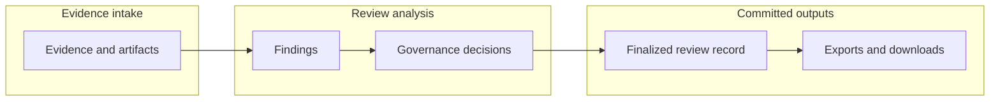

> **Scope:** Customer-facing — tracing findings back to supporting evidence on the Evidence graph page (`/graph`). General ArchLucid concepts live on [Getting started](/help/getting-started).

# Evidence graph

Trace how evidence supports findings, decisions, approvals, and the final architecture package.

In the product, this page is labeled **Evidence graph** in navigation. Help topics and deep links may use the slug **evidence-trail** — both refer to the same traceability surface.

## What the evidence trail shows {#what-the-evidence-trail-shows}

An **evidence trail** is the inspectable lineage from architecture inputs through analysis to reviewer-visible conclusions:

- **Evidence** — briefs, diagrams, documents, and optional cloud inventory you attached during intake.
- **Findings** — structured risks with severity, rationale, and links to supporting artifacts.
- **Decisions and governance** — approvals, dispositions, and exceptions when your workflow records them.
- **Audit records** — who acted and when, without exposing raw engineering logs.

The **evidence graph** is the interactive view that shows how those pieces connect for one finalized architecture package.

In order: **evidence and artifacts** feed **findings**; **findings** feed **governance decisions**; **governance decisions** commit to the **sealed review record**; the **sealed review record** produces **exports and downloads**.

## Open the Evidence graph {#open-the-evidence-graph}

1. In the architect workspace, open **Insights** and choose **Evidence graph**.
2. Select a **finalized review from your workspace**, or choose **Open sample evidence graph (Azure reference)** to load the illustrative Claims Intake sample — the review picker shows **Showing Claims Intake sample (not your workspace)** and that sample is **not** a review from your tenant.
3. Select **Load evidence graph** when prompted.

You can also jump from a finding:

1. Open an architecture package and go to **Findings**.
2. On a finding with linked evidence, choose **Explain in evidence trail** (or **View evidence trail** from related surfaces).
3. ArchLucid opens the finding **evidence trace** for that review and finding. From the trace table or graph view, open the Evidence graph in **Evidence provenance** mode when you need the visual explorer.

## Trace table vs graph view {#trace-table-vs-graph-view}

After you load a review, switch between two presentations on the same page:

| View | Best when |
| --- | --- |
| **Trace table** | You want a scannable list of findings with provenance columns — severity, evidence links, and recommended actions in one table. |
| **Graph view** | You want to explore relationships visually — how evidence, findings, decisions, and architecture context connect as nodes and edges. |

Use **Open graph view** from the trace table when a row needs visual exploration.

## Graph modes {#graph-modes}

In **Graph view**, pick a mode from the control above the canvas:

| Mode | What it emphasizes |
| --- | --- |
| **Evidence provenance** | How findings link back to uploaded artifacts and intake evidence. |
| **Decision traceability** | How governance decisions, approvals, and the sealed review record connect to findings. |
| **Architecture context** | How analyzed components and topology relate to the evidence that produced them. |

Start with **Evidence provenance** when your question is “what file or artifact supports this finding?” Switch modes when you need decision or architecture context for the same review.

## Trace a finding step by step {#trace-a-finding-step-by-step}

1. **Start from the finding** — open the architecture package **Findings** tab and note the finding title and severity.
2. **Open the evidence trace** — use **Explain in evidence trail** on the finding, or load the same review from **Insights → Evidence graph** and switch to **Evidence provenance**.
3. **Read the trace table** — confirm the finding row lists evidence links or flags an evidence gap.
4. **Switch to graph view** — select **Evidence provenance** and follow edges from the finding to artifact nodes.
5. **Return to the package** — use **Open review** to jump back to the architecture package detail when you are ready to add evidence, record a disposition, or export.

If a finding shows an **evidence gap**, the trace table and graph still help you see what is missing — add uploads from the architecture package **Evidence** tab before finalize when your workflow allows.

## Related guides {#related-guides}

- [Review guide](/help/review-guide) — wizard field reference for each intake step.
- [Architecture packages](/help/review-packages) — browse and open architecture packages before tracing.
- [Findings](/help/findings) — interpret severity, rationale, and evidence links on a package.
- [Start a review](/help/evidence-intake) — attach the evidence the trail will reference.
- [Audit trail](/help/audit-trail) — immutable audit events (who did what, when) vs lineage (what supports a conclusion).
- [Getting started](/help/getting-started) — five-minute ArchLucid concepts and vocabulary.
