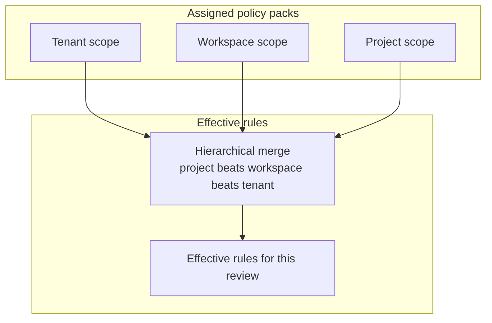

> **Scope:** Customer-facing — policy packs orientation (in-app help). Bundled pack catalogs and authoring detail live in go-to-market and contributor docs.

# Policy packs

See which governance rules apply to reviews in this workspace, which pack is active, and how ArchLucid chooses a winner when packs disagree.

A **policy pack** is a versioned bundle of compliance checks, advisory defaults, and alert posture. Assigning a pack to a tenant, workspace, or project sets the bar every architecture review evaluates against.

## Open Policy packs {#open-policy-packs}

1. In the architect workspace, open **Governance** and choose **[Policy packs](/governance/policy-packs)**.
2. Confirm the workspace (and project, when used) in the header switcher — packs and rules are scoped to that selection.
3. Review the **Active policy pack** card and the **Rules applied to this review** table for the review in context.

Use **Refresh** when assignments or pack versions may have changed since the page last loaded.

## Active pack and enforced rules {#active-pack-and-enforced-rules}

The Policy packs page shows:

- **Active policy pack** — the pack enabled for this workspace, including version and how many rules it contributes.
- **Rules applied to this review** — each enforced rule with category, source pack, and a link to supporting evidence when available.
- **My packs / Catalog** — packs already available in your tenant versus packs you can compare or adopt from the catalog.

**[Standards & rules](/governance/standards-and-rules)** lists the same class of checks for the current review with filters for enforcement mode, source pack, and evidence. Use Policy packs when you are managing which pack is assigned; use Standards & rules when you are inspecting the resulting rule list for one review.

## How conflicts are resolved {#how-conflicts-are-resolved}

When more than one assigned pack defines the same governance item, ArchLucid keeps a single effective definition:

1. **Higher scope wins** — **Project** beats **Workspace** beats **Tenant**.
2. **Pinned beats unpinned** at the same scope.
3. **Newest assignment** breaks remaining ties.

The higher-precedence pack is the **winner**; other packs that defined the same item are losing candidates. Changing which pack wins usually means changing assignment, pin, or scope on **Policy packs**, then refreshing Standards & rules (or exporting a resolution snapshot when your role can see operator diagnostics).

Policy packs do not certify compliance frameworks by themselves — they define the checks ArchLucid evaluates during reviews.

## Related guides {#related-guides}

- [Governance approval](/help/governance-approval) — submit and decide on a finalized architecture package.
- [Understanding governance alerts](/help/alerts) — how pack posture can surface inbox alerts.
- [Audit trail](/help/audit-trail) — who changed governance configuration and when.
- [Getting started](/help/getting-started) — core ArchLucid vocabulary and first-review path.
